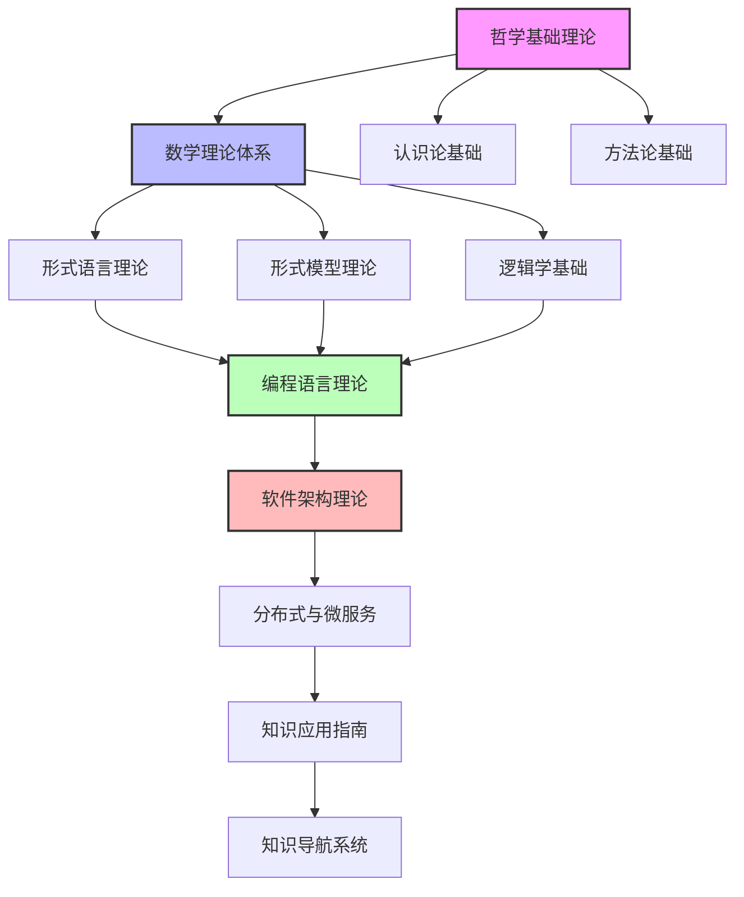

# 知识导航系统理论体系总论-整合版

## 概述

本文档整合了FormalUnified知识导航系统理论体系的核心内容，包括知识图谱、理论体系图谱、概念关系图谱、应用场景图谱、智能导航系统等，构建统一的知识导航系统理论框架。

## 理论体系结构

### 1. 基础理论层

#### 1.1 知识图谱理论

**知识图谱定义**：

```text
知识图谱 = (E, R, A, G)
E: 实体集合 (Entity Set)
R: 关系集合 (Relation Set)
A: 属性集合 (Attribute Set)
G: 图结构 (Graph Structure)
```

**核心理论体系关系图**：



**理论层次结构**：

```text
框架层次结构：
┌─────────────────┐
│   应用理论层    │ ← 最高应用层次
├─────────────────┤
│   核心理论层    │ ← 核心理论层次
├─────────────────┤
│   基础理论层    │ ← 基础理论层次
├─────────────────┤
│   数学基础层    │ ← 数学基础层次
└─────────────────┘
```

**知识组织原则**：

- **层次性**：按层次组织知识结构
- **一致性**：保持知识间的一致性
- **完整性**：确保知识体系的完整性
- **可扩展性**：支持知识的动态扩展

#### 1.2 理论体系图谱理论

**理论体系图谱定义**：

```text
理论体系图谱 = (T, R, H, M)
T: 理论集合 (Theory Set)
R: 关系集合 (Relation Set)
H: 层次结构 (Hierarchy Structure)
M: 映射机制 (Mapping Mechanism)
```

**九大理论体系**：

1. **哲学基础理论体系** - 整个知识体系的理论基础
2. **数学理论体系** - 形式化方法的基础工具
3. **形式语言理论体系** - 形式化表达的基础
4. **形式模型理论体系** - 系统建模的基础
5. **编程语言理论体系** - 软件实现的基础
6. **软件架构理论体系** - 软件设计的基础
7. **分布式系统理论体系** - 大规模系统的基础
8. **知识应用指南** - 理论与实践的结合点
9. **知识导航系统** - 知识组织的核心

**关系类型**：

```text
关系类型：
- 基础支撑关系：上层理论支撑下层理论
- 方法指导关系：理论方法指导应用
- 应用实现关系：理论指导实践实现
- 服务指导关系：服务指导理论应用
```

#### 1.3 概念关系图谱理论

**概念关系图谱定义**：

```text
概念关系图谱 = (C, R, S, M)
C: 概念集合 (Concept Set)
R: 关系集合 (Relation Set)
S: 语义结构 (Semantic Structure)
M: 映射关系 (Mapping Relation)
```

**核心概念体系**：

**哲学基础概念**：

- 存在 (Being) - 一切事物的根本属性
- 实体 (Entity) - 独立存在的对象
- 属性 (Attribute) - 实体的特征
- 关系 (Relation) - 实体间的联系

**数学基础概念**：

- 集合 (Set) - 对象的聚集
- 元素 (Element) - 集合的成员
- 运算 (Operation) - 集合上的操作
- 函数 (Function) - 集合间的映射

**形式语言概念**：

- 状态 (State) - 系统的当前配置
- 转换 (Transition) - 状态间的变化
- 语言 (Language) - 符号串的集合
- 文法 (Grammar) - 语言生成的规则

**关系类型**：

```text
关系类型：
- 包含关系：层次包含、集合包含、结构包含
- 映射关系：同构映射、同态映射、对应映射
- 依赖关系：直接依赖、间接依赖、循环依赖
```

#### 1.4 应用场景图谱理论

**应用场景图谱定义**：

```text
应用场景图谱 = (S, C, A, R)
S: 场景集合 (Scenario Set)
C: 分类体系 (Classification System)
A: 应用方法 (Application Method)
R: 关系网络 (Relation Network)
```

**应用场景分类**：

**软件开发场景**：

- 系统设计
- 算法研究
- 程序验证
- 性能优化

**系统设计场景**：

- 架构设计
- 组件设计
- 接口设计
- 质量保证

**知识管理场景**：

- 知识获取
- 知识组织
- 知识检索
- 知识应用

### 2. 核心理论层

#### 2.1 智能导航系统理论

**智能导航系统定义**：

```text
智能导航系统 = (N, I, A, P)
N: 导航机制 (Navigation Mechanism)
I: 智能算法 (Intelligence Algorithm)
A: 自适应机制 (Adaptive Mechanism)
P: 个性化服务 (Personalization Service)
```

**导航功能**：

**知识检索**：

- **全文检索**：支持全文内容的快速检索
- **语义检索**：基于语义相似性的智能检索
- **标签检索**：基于标签系统的分类检索
- **关系检索**：基于概念关系的关联检索

**路径导航**：

- **学习路径**：系统化的学习路径导航
- **应用路径**：实践应用路径导航
- **探索路径**：知识探索路径导航
- **推荐路径**：个性化推荐路径

**可视化导航**：

- **概念图谱**：概念关系的可视化展示
- **结构图表**：理论结构的图表展示
- **流程图**：学习流程的可视化
- **关系网络**：知识关系的网络展示

#### 2.2 智能检索系统理论

**智能检索系统定义**：

```text
智能检索系统 = (Q, I, R, R)
Q: 查询处理 (Query Processing)
I: 索引机制 (Indexing Mechanism)
R: 检索算法 (Retrieval Algorithm)
R: 结果排序 (Result Ranking)
```

**检索维度**：

**按理论体系检索**：

- 哲学基础理论
- 数学理论体系
- 形式语言理论
- 形式模型理论
- 编程语言理论
- 软件架构理论
- 分布式与微服务

**按概念类型检索**：

- 基础概念
- 核心理论
- 应用方法
- 实践案例
- 工具技术

**按应用领域检索**：

- 软件开发
- 系统设计
- 算法研究
- 形式验证
- 知识管理

**检索方法**：

```text
检索方法：
- 关键词检索：精确匹配、模糊匹配、语义匹配、关联匹配
- 路径检索：学习路径、应用路径、发展路径、创新路径
- 关系检索：概念关系、理论关系、应用关系、发展关系
```

#### 2.3 知识更新机制理论

**知识更新机制定义**：

```text
知识更新机制 = (U, C, V, Q)
U: 更新策略 (Update Strategy)
C: 内容管理 (Content Management)
V: 验证机制 (Verification Mechanism)
Q: 质量控制 (Quality Control)
```

**更新策略**：

```text
更新策略：
- 定期更新：按计划更新知识内容
- 动态更新：根据发展动态更新
- 反馈更新：根据用户反馈更新
- 创新更新：根据新理论创新更新
```

**质量控制**：

```text
质量控制：
- 内容审核：确保内容的准确性和完整性
- 关系验证：验证概念关系的正确性
- 一致性检查：检查理论间的一致性
- 实用性评估：评估知识的实用性
```

### 3. 应用理论层

#### 3.1 知识管理应用

**知识管理应用定义**：

```text
知识管理应用 = (K, M, S, A)
K: 知识库 (Knowledge Base)
M: 管理工具 (Management Tool)
S: 搜索系统 (Search System)
A: 分析工具 (Analysis Tool)
```

**知识管理功能**：

```text
知识管理功能：
- 知识获取：从各种源获取知识
- 知识存储：存储和组织知识
- 知识检索：检索和发现知识
- 知识应用：应用和利用知识
```

**知识管理技术**：

- **知识抽取**：从文本中抽取知识
- **知识融合**：融合多源知识
- **知识推理**：基于知识进行推理
- **知识更新**：动态更新知识

#### 3.2 学习路径设计应用

**学习路径设计定义**：

```text
学习路径设计 = (P, S, A, E)
P: 路径规划 (Path Planning)
S: 序列设计 (Sequence Design)
A: 适应性调整 (Adaptive Adjustment)
E: 效果评估 (Effectiveness Evaluation)
```

**学习路径类型**：

**基础路径**：

```text
基础路径：
哲学基础 → 数学基础 → 形式化基础 → 应用基础
    ↓         ↓         ↓         ↓
本体论    → 集合论   → 自动机 → 编程语言
    ↓         ↓         ↓         ↓
认识论    → 逻辑学 → 形式语法 → 软件架构
    ↓         ↓         ↓         ↓
方法论    → 代数学 → 形式模型 → 分布式系统
```

**专业路径**：

```text
专业路径：
软件工程路径：
编程语言 → 软件架构 → 分布式系统 → 微服务

形式化方法路径：
形式语言 → 形式模型 → 形式验证 → 模型检查

数学基础路径：
集合论 → 范畴论 → 代数 → 拓扑
```

**整合路径**：

```text
整合路径：
跨学科整合：
哲学+数学 → 数学+计算机 → 计算机+工程 → 统一理论
```

#### 3.3 个性化服务应用

**个性化服务定义**：

```text
个性化服务 = (P, A, R, F)
P: 用户画像 (User Profile)
A: 自适应算法 (Adaptive Algorithm)
R: 推荐系统 (Recommendation System)
F: 反馈机制 (Feedback Mechanism)
```

**个性化功能**：

```text
个性化功能：
- 智能推荐：基于用户行为的智能推荐
- 个性化：个性化的导航体验
- 自适应：自适应的导航调整
- 学习优化：基于学习效果的优化
```

**服务特色**：

```text
服务特色：
- 系统性：层次结构、关联关系、发展脉络、应用场景
- 智能性：智能推荐、个性化、自适应、学习优化
- 实用性：快速定位、深度探索、关联发现、应用指导
```

### 4. 技术实现层

#### 4.1 知识表示技术

**知识表示技术定义**：

```text
知识表示技术 = (R, L, S, T)
R: 表示方法 (Representation Method)
L: 表示语言 (Representation Language)
S: 存储结构 (Storage Structure)
T: 转换工具 (Transformation Tool)
```

**表示方法**：

```text
表示方法：
- 逻辑表示：基于逻辑的知识表示
- 语义表示：基于语义的知识表示
- 图表示：基于图的知识表示
- 向量表示：基于向量的知识表示
```

**表示语言**：

- **OWL**：Web本体语言
- **RDF**：资源描述框架
- **SPARQL**：SPARQL查询语言
- **JSON-LD**：JSON链接数据

#### 4.2 知识推理技术

**知识推理技术定义**：

```text
知识推理技术 = (R, E, A, O)
R: 推理规则 (Reasoning Rules)
E: 推理引擎 (Reasoning Engine)
A: 推理算法 (Reasoning Algorithm)
O: 推理优化 (Reasoning Optimization)
```

**推理类型**：

```text
推理类型：
- 演绎推理：从一般到特殊的推理
- 归纳推理：从特殊到一般的推理
- 类比推理：基于类比的推理
- 因果推理：基于因果关系的推理
```

**推理算法**：

- **前向推理**：从前提推导结论
- **后向推理**：从结论推导前提
- **双向推理**：前向和后向结合推理
- **并行推理**：并行执行推理过程

#### 4.3 知识融合技术

**知识融合技术定义**：

```text
知识融合技术 = (F, A, R, V)
F: 融合方法 (Fusion Method)
A: 融合算法 (Fusion Algorithm)
R: 融合规则 (Fusion Rules)
V: 融合验证 (Fusion Verification)
```

**融合策略**：

```text
融合策略：
- 实体融合：融合相同实体
- 关系融合：融合相同关系
- 属性融合：融合相同属性
- 结构融合：融合知识结构
```

**融合方法**：

- **基于规则的融合**：基于预定义规则融合
- **基于学习的融合**：基于机器学习融合
- **基于相似度的融合**：基于相似度融合
- **基于上下文的融合**：基于上下文融合

### 5. 工具与平台层

#### 5.1 知识管理工具

**知识管理工具定义**：

```text
知识管理工具 = (T, I, U, A)
T: 工具集合 (Tool Set)
I: 接口 (Interface)
U: 用户界面 (User Interface)
A: 应用接口 (Application Interface)
```

**工具类型**：

```text
工具类型：
- 知识编辑工具：编辑和创建知识
- 知识浏览工具：浏览和查看知识
- 知识搜索工具：搜索和发现知识
- 知识分析工具：分析和挖掘知识
```

**工具功能**：

- **知识建模**：建立知识模型
- **知识验证**：验证知识质量
- **知识转换**：转换知识格式
- **知识发布**：发布和分享知识

#### 5.2 智能检索平台

**智能检索平台定义**：

```text
智能检索平台 = (P, E, T, R)
P: 平台 (Platform)
E: 执行引擎 (Execution Engine)
T: 检索工具 (Retrieval Tools)
R: 结果报告 (Result Report)
```

**平台功能**：

```text
平台功能：
- 查询处理：处理用户查询
- 索引管理：管理知识索引
- 检索执行：执行检索过程
- 结果排序：排序检索结果
```

**平台特性**：

- **可扩展性**：支持工具扩展
- **可配置性**：支持参数配置
- **可监控性**：支持过程监控
- **可追溯性**：支持结果追溯

#### 5.3 知识服务平台

**知识服务平台定义**：

```text
知识服务平台 = (S, A, I, M)
S: 服务 (Services)
A: 应用 (Applications)
I: 接口 (Interfaces)
M: 管理 (Management)
```

**服务类型**：

```text
服务类型：
- 知识查询服务：提供知识查询
- 知识推理服务：提供知识推理
- 知识推荐服务：提供知识推荐
- 知识分析服务：提供知识分析
```

**服务特性**：

- **高可用性**：保证服务可用性
- **高性能**：保证服务性能
- **高安全性**：保证服务安全性
- **高可扩展性**：保证服务可扩展性

### 6. 标准与规范层

#### 6.1 知识表示标准

**知识表示标准定义**：

```text
知识表示标准 = (S, F, V, C)
S: 标准规范 (Standard Specification)
F: 格式规范 (Format Specification)
V: 验证规范 (Validation Specification)
C: 兼容性规范 (Compatibility Specification)
```

**标准类型**：

```text
标准类型：
- 语法标准：知识表示语法标准
- 语义标准：知识表示语义标准
- 交换标准：知识交换标准
- 查询标准：知识查询标准
```

**标准组织**：

- **W3C**：万维网联盟
- **ISO**：国际标准化组织
- **IEEE**：电气和电子工程师协会
- **OASIS**：结构化信息标准促进组织

#### 6.2 质量评估标准

**质量评估标准定义**：

```text
质量评估标准 = (C, M, P, R)
C: 评估标准 (Evaluation Criteria)
M: 度量方法 (Measurement Method)
P: 评估过程 (Evaluation Process)
R: 报告规范 (Report Specification)
```

**评估维度**：

```text
评估维度：
- 准确性：知识内容的准确性
- 完整性：知识体系的完整性
- 一致性：知识间的一致性
- 时效性：知识内容的时效性
```

**评估方法**：

- **专家评估**：基于专家经验的评估
- **用户评估**：基于用户反馈的评估
- **自动评估**：基于算法的自动评估
- **混合评估**：多种方法结合的评估

### 7. 使用指南

#### 7.1 初学者使用

**使用步骤**：

1. 从知识图谱开始，了解整体结构
2. 按照学习路径进行系统学习
3. 利用概念关系图谱理解关联
4. 参考应用场景图谱了解应用

**学习建议**：

- 从基础理论开始学习
- 注重概念间的关联关系
- 结合实际应用场景理解
- 利用可视化工具辅助学习

#### 7.2 专业用户使用

**使用策略**：

1. 直接定位到相关理论领域
2. 利用关系网络进行深度探索
3. 通过应用场景了解实践应用
4. 使用智能推荐发现相关内容

**专业建议**：

- 重点关注专业领域的理论
- 深入理解理论间的关联
- 结合实际项目应用理论
- 参与理论发展和完善

#### 7.3 研究者使用

**研究策略**：

1. 利用理论体系图谱了解发展脉络
2. 通过概念关系图谱发现研究机会
3. 参考应用场景图谱了解应用前景
4. 使用智能导航系统进行创新探索

**研究建议**：

- 关注理论发展的前沿
- 发现理论间的空白领域
- 探索新的应用可能性
- 推动理论的创新发展

### 8. 发展趋势与展望

#### 8.1 技术发展趋势

**技术发展趋势**：

```text
技术发展趋势：
- 智能化：AI驱动的知识管理
- 自动化：自动化的知识处理
- 实时化：实时知识更新和应用
- 个性化：个性化的知识服务
```

**新兴技术**：

- **人工智能**：AI在知识管理中的应用
- **机器学习**：ML在知识推理中的应用
- **自然语言处理**：NLP在知识抽取中的应用
- **知识图谱**：知识图谱技术的发展

#### 8.2 应用发展趋势

**应用发展趋势**：

```text
应用发展趋势：
- 跨领域应用：跨学科领域的应用
- 跨平台应用：跨平台的知识服务
- 跨语言应用：跨语言的知识处理
- 跨文化应用：跨文化的知识理解
```

**应用领域**：

- **教育领域**：智能教育和个性化学习
- **医疗领域**：智能诊断和医疗决策
- **金融领域**：智能投顾和风险控制
- **科研领域**：智能科研和知识发现

#### 8.3 标准化发展趋势

**标准化发展趋势**：

```text
标准化发展趋势：
- 国际化：国际标准的制定和推广
- 行业化：行业标准的制定和应用
- 技术化：技术标准的完善和更新
- 服务化：服务标准的建立和规范
```

**标准建设**：

- **标准制定**：制定新的标准规范
- **标准推广**：推广现有标准
- **标准更新**：更新过时标准
- **标准认证**：建立标准认证体系

### 9. 实施策略与方法

#### 9.1 实施策略

**实施策略定义**：

```text
实施策略 = (P, S, T, R)
P: 实施计划 (Implementation Plan)
S: 实施步骤 (Implementation Steps)
T: 实施时间 (Implementation Timeline)
R: 实施资源 (Implementation Resources)
```

**策略类型**：

```text
策略类型：
- 渐进式策略：逐步推进实施
- 并行式策略：并行推进实施
- 试点式策略：先试点后推广
- 全面式策略：全面同步实施
```

**实施原则**：

- **系统性原则**：系统性地推进实施
- **协调性原则**：协调各方资源
- **持续性原则**：持续改进和完善
- **创新性原则**：创新实施方法

#### 9.2 实施方法

**实施方法定义**：

```text
实施方法 = (M, T, P, E)
M: 方法 (Method)
T: 技术 (Technology)
P: 过程 (Process)
E: 评估 (Evaluation)
```

**方法类型**：

```text
方法类型：
- 项目管理方法：基于项目管理的实施
- 质量管理方法：基于质量管理的实施
- 风险管理方法：基于风险管理的实施
- 变更管理方法：基于变更管理的实施
```

**实施工具**：

- **项目管理工具**：项目计划和跟踪工具
- **协作工具**：团队协作和沟通工具
- **监控工具**：实施过程监控工具
- **评估工具**：实施效果评估工具

### 10. 总结

知识导航系统理论体系通过整合知识图谱、理论体系图谱、概念关系图谱、应用场景图谱、智能导航系统等核心内容，构建了完整的知识导航系统理论框架：

1. **理论基础扎实**：建立了从基础到应用的完整理论体系
2. **技术手段先进**：结合了多种先进的知识管理技术
3. **应用范围广泛**：覆盖多个应用领域和场景
4. **发展前景广阔**：为未来的知识管理发展提供指导

这个统一框架为知识导航系统的研究、设计、实现和应用提供了重要的理论基础和实践指导，推动了知识管理技术向更智能、更高效、更可靠的方向发展。

---

**知识导航系统理论体系总论-整合版**  
*FormalUnified知识导航系统理论体系整合*  
*2025年9月6日*
