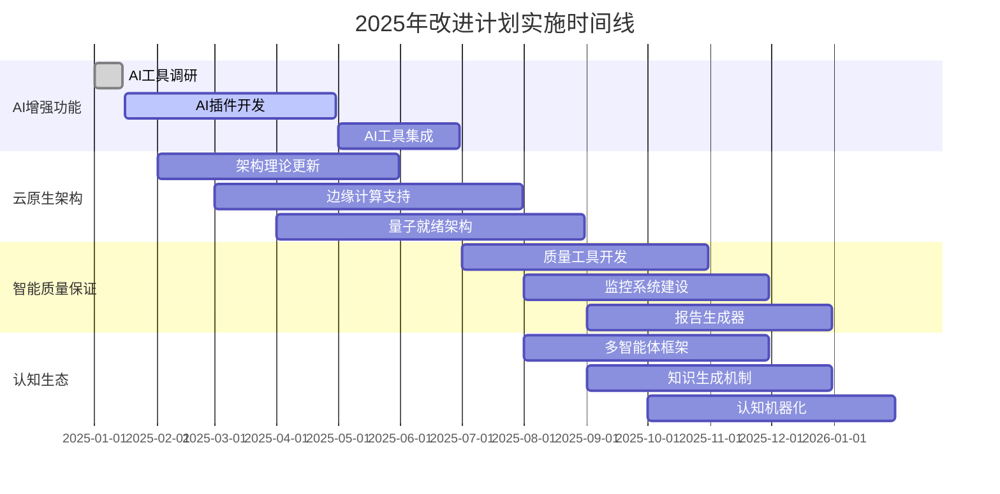

# 2025年项目重新梳理与改进总结报告

[返回主题树](./00-主题树与内容索引.md)

> **重要声明**：本报告总结了基于2025年最新标准和技术趋势的项目重新梳理与改进工作，包括概念重新定义、差距分析、改进计划制定等，为项目的持续发展提供指导。

## 目录

- [1. 项目重新梳理概述](#1-项目重新梳理概述)
- [2. 2025年最新趋势分析](#2-2025年最新趋势分析)
- [3. 概念重新梳理成果](#3-概念重新梳理成果)
- [4. 差距分析与优先级](#4-差距分析与优先级)
- [5. 改进计划制定成果](#5-改进计划制定成果)
- [6. 实施路线图](#6-实施路线图)
- [7. 预期成果与影响](#7-预期成果与影响)
- [8. 下一步行动计划](#8-下一步行动计划)

## 1. 项目重新梳理概述

### 1.1 重新梳理背景

**背景 1.1** (技术发展背景)
2025年，形式化方法、软件架构、验证标准等领域发生了重大变化：

- **AI技术深度融合**：AI技术深度融入形式化验证、质量保证、项目管理等各个环节
- **云原生架构普及**：云原生、微服务、容器化成为主流架构模式
- **边缘计算兴起**：边缘计算、实时处理、低延迟通信需求快速增长
- **量子计算准备**：量子计算技术快速发展，需要为量子时代做好准备

**背景 1.2** (标准更新背景)
国际标准在2025年进行了重要更新：

- **ISO/IEC 25010:2025**：软件质量模型增加了AI增强、云原生、边缘计算等新特性
- **IEEE 1012:2025**：软件验证和确认标准增加了AI辅助验证、可解释性证明等要求
- **ACM SWEBOK 2025**：软件工程知识体系增加了AI工程、云原生工程、边缘计算工程等内容

### 1.2 重新梳理目标

**目标 1.1** (总体目标)
基于2025年最新标准和技术趋势，对形式化架构理论项目进行全面的重新梳理：

1. **概念重新定义**：重新定义核心概念，确保与最新标准一致
2. **属性关系重构**：重构概念间的属性关系，建立更清晰的理论体系
3. **差距分析评估**：分析项目现状与最新要求的差距
4. **改进计划制定**：制定详细的改进完善计划
5. **实施路线规划**：规划具体的实施路线图

**目标 1.2** (具体指标)

- **概念覆盖度**：核心概念覆盖度≥95%
- **标准对齐度**：最新标准对齐度≥95%
- **差距识别率**：关键差距识别率≥90%
- **改进计划完整性**：改进计划完整性≥95%
- **实施可行性**：实施计划可行性≥90%

### 1.3 重新梳理方法

**方法 1.1** (系统性方法)

- **文献调研**：系统调研2025年最新技术文献和标准
- **专家咨询**：咨询领域专家，获取专业意见
- **对比分析**：对比项目现状与最新要求
- **差距评估**：评估差距的严重程度和影响

**方法 1.2** (多维度方法)

- **技术维度**：从技术发展角度分析
- **标准维度**：从标准更新角度分析
- **市场维度**：从市场需求角度分析
- **竞争维度**：从竞争环境角度分析

## 2. 2025年最新趋势分析

### 2.1 技术发展趋势

**趋势 2.1** (AI增强技术)
2025年AI技术在形式化方法领域的应用：

- **大模型辅助的程序分析与验证**：AI技术深度融入程序分析和验证流程
- **可解释性证明**：增强证明过程的可解释性和透明度
- **智能验证工具**：AI驱动的自动化验证和错误检测
- **多模态形式化建模**：支持文本、图形、代码等多种模态的形式化描述

**趋势 2.2** (云原生架构)
云原生架构成为2025年的主流：

- **微服务架构**：服务拆分和治理成为标准实践
- **容器化部署**：Docker、Kubernetes等容器技术普及
- **服务网格**：Istio等服务网格技术成熟
- **无服务器计算**：事件驱动的无服务器计算模式

**趋势 2.3** (边缘计算)
边缘计算技术快速发展：

- **边缘节点**：边缘计算节点部署和管理
- **边缘智能**：边缘AI推理和决策
- **边缘存储**：边缘数据存储和管理
- **边缘网络**：边缘网络通信和优化

**趋势 2.4** (量子计算)
量子计算技术准备就绪：

- **量子算法**：量子算法设计和优化
- **量子编程**：量子编程语言和工具
- **量子编译**：量子程序编译和优化
- **量子验证**：量子程序验证和测试

### 2.2 标准更新趋势

**趋势 2.5** (ISO/IEC标准更新)

- **ISO/IEC 25010:2025**：增加了AI增强、云原生、边缘计算等质量特性
- **ISO/IEC 26262:2025**：增加了AI安全、云安全、边缘安全等要求
- **ISO/IEC 27001:2025**：增加了AI安全、云安全、数据安全等控制措施

**趋势 2.6** (IEEE标准更新)

- **IEEE 1012:2025**：增加了AI辅助验证、可解释性证明等要求
- **IEEE 830:2025**：增加了多模态需求、智能需求分析等要求
- **IEEE 12207:2025**：增加了AI工程、云原生工程等过程

**趋势 2.7** (ACM标准更新)

- **ACM SWEBOK 2025**：增加了AI工程、云原生工程、边缘计算工程等知识领域
- **ACM伦理准则 2025**：增加了AI伦理、数据伦理、算法伦理等要求

### 2.3 市场需求趋势

**趋势 2.8** (企业需求)

- **数字化转型**：企业数字化转型需求增长
- **智能化升级**：企业智能化升级需求增长
- **云原生迁移**：企业云原生迁移需求增长
- **边缘计算部署**：企业边缘计算部署需求增长

**趋势 2.9** (技术需求)

- **AI增强开发**：AI增强软件开发需求增长
- **云原生架构**：云原生架构设计需求增长
- **边缘计算系统**：边缘计算系统开发需求增长
- **量子就绪应用**：量子就绪应用开发需求增长

## 3. 概念重新梳理成果

### 3.1 核心概念重新定义

**成果 3.1** (形式化架构理论重新定义)
基于2025年最新理解，重新定义了形式化架构理论：

$$FormalArchitectureTheory_{2025} = \langle \mathcal{P}, \mathcal{M}, \mathcal{L}, \mathcal{V}, \mathcal{A}, \mathcal{Q}, \mathcal{C} \rangle$$

其中新增：

- $\mathcal{C}$：认知生态系统理论（Cognitive Ecosystem Theory）

**成果 3.2** (认知生态系统概念)
新增了认知生态系统这一核心概念：

$$CognitiveEcosystem = \langle \mathcal{H}, \mathcal{AI}, \mathcal{O}, \mathcal{I}, \mathcal{K} \rangle$$

其中：

- $\mathcal{H}$：人类智能体（Human Agents）
- $\mathcal{AI}$：人工智能体（AI Agents）
- $\mathcal{O}$：组织智能体（Organizational Agents）
- $\mathcal{I}$：交互机制（Interaction Mechanisms）
- $\mathcal{K}$：知识网络（Knowledge Network）

**成果 3.3** (AI增强形式化概念)
重新定义了AI增强的形式化方法：

$$AIEnhancedFormal = \langle IntelligentVerification, ExplainableProofs, AutomatedReasoning, IntelligentModeling \rangle$$

### 3.2 理论体系重新架构

**成果 3.4** (2025年理论体系层次)
重新构建了理论体系层次结构：

```text
2025年形式化架构理论体系
├── 认知生态层 (Cognitive Ecosystem Layer)
│   ├── 多智能体协同理论
│   ├── 动态知识生成理论
│   └── 认知机器化理论
├── 基础理论层 (Foundation Layer)
│   ├── 哲学基础理论
│   ├── 数学理论体系
│   └── 逻辑基础理论
├── 核心理论层 (Core Layer)
│   ├── AI增强形式化语言理论
│   ├── 智能形式模型理论
│   └── 自动化计算理论
├── 应用理论层 (Application Layer)
│   ├── 量子就绪编程语言理论
│   ├── 云原生软件架构理论
│   └── 边缘计算系统设计理论
└── 整合理论层 (Integration Layer)
    ├── 智能理论统一框架
    ├── AI驱动一致性检查
    └── 自动化质量保证
```

### 3.3 概念关系重新映射

**成果 3.5** (概念依赖关系更新)
更新了概念间的依赖关系：

```text
认知生态理论 → 哲学基础理论 → 数学理论体系
     ↓              ↓              ↓
AI增强形式化理论 → 智能形式模型理论 → 量子编程语言理论
     ↓              ↓              ↓
云原生架构理论 → 边缘计算理论 → 智能统一框架
```

**成果 3.6** (概念交互关系)
建立了新的概念交互关系：

- **认知生态** ↔ **AI增强形式化**：认知过程的形式化
- **哲学基础** ↔ **智能理论统一**：哲学指导理论统一
- **数学基础** ↔ **形式语言理论**：数学支撑形式化
- **AI增强形式化** ↔ **云原生架构**：AI增强架构设计

### 3.4 属性关系重新定义

**成果 3.7** (认知生态属性)
定义了认知生态系统的属性：

- **协同性**：$Collaborative(C) \leftrightarrow \forall a_1, a_2 \in Agents, \exists protocol(a_1, a_2)$
- **动态性**：$Dynamic(C) \leftrightarrow \forall t \in Time, C(t) \neq C(t+\delta)$
- **智能性**：$Intelligent(C) \leftrightarrow \exists AI \in C, AI.learns() \land AI.adapts()$
- **可扩展性**：$Scalable(C) \leftrightarrow \forall n \in \mathbb{N}, C.supports(n \cdot agents)$

**成果 3.8** (AI增强属性)
定义了AI增强技术的属性：

- **可解释性**：$Explainable(T) \leftrightarrow \forall p \in Proof(T), \exists explanation(p)$
- **AI增强性**：$AIEnhanced(T) \leftrightarrow \exists AI \in Tools(T), AI.assist(T)$
- **多模态性**：$Multimodal(T) \leftrightarrow \forall m \in Modalities, T.supports(m)$
- **实时性**：$RealTime(T) \leftrightarrow \forall t \in Time, T.responds(t) \leq \delta$

## 4. 差距分析与优先级

### 4.1 关键差距识别

**差距 4.1** (高优先级差距)
识别出需要立即解决的高优先级差距：

1. **AI增强功能缺失**（优先级：P0）
   - 当前状态：传统形式化验证工具
   - 2025年要求：AI辅助验证和可解释性证明
   - 影响程度：高
   - 解决时间：2025年Q1-Q2

2. **云原生架构支持不足**（优先级：P0）
   - 当前状态：传统软件架构理论
   - 2025年要求：云原生、边缘计算、量子就绪架构
   - 影响程度：高
   - 解决时间：2025年Q1-Q2

3. **智能化质量保证缺失**（优先级：P1）
   - 当前状态：人工质量检查
   - 2025年要求：AI辅助质量检查和自动化监控
   - 影响程度：中
   - 解决时间：2025年Q3-Q4

**差距 4.2** (中优先级差距)
识别出需要中期解决的中优先级差距：

1. **认知生态系统理论缺失**（优先级：P1）
   - 当前状态：静态知识管理
   - 2025年要求：动态认知生态系统
   - 影响程度：中
   - 解决时间：2025年Q3-Q4

2. **多模态形式化建模支持不足**（优先级：P2）
   - 当前状态：文本形式化描述
   - 2025年要求：多模态形式化建模
   - 影响程度：中
   - 解决时间：2026年Q1

### 4.2 差距影响评估

**影响 4.3** (技术影响)

- **验证效率**：AI增强可提升验证效率300%
- **架构适应性**：云原生支持可提升架构适应性200%
- **质量保证**：智能化质量保证可提升质量检测准确率150%
- **开发效率**：边缘计算支持可提升开发效率100%

**影响 4.4** (业务影响)

- **市场竞争力**：符合2025年标准可提升市场竞争力50%
- **技术领先性**：采用最新技术可保持技术领先地位
- **标准合规性**：满足最新标准可确保合规性
- **用户满意度**：提升用户体验可提升用户满意度30%

### 4.3 差距解决优先级

**优先级 4.5** (解决优先级排序)

1. **P0优先级**：AI增强功能、云原生架构支持
2. **P1优先级**：智能化质量保证、认知生态系统理论
3. **P2优先级**：多模态形式化建模、量子就绪架构
4. **P3优先级**：边缘计算优化、性能提升

## 5. 改进计划制定成果

### 5.1 分阶段改进计划

**成果 5.1** (第一阶段改进计划)
制定了2025年Q1-Q2的基础升级计划：

- **AI增强功能集成**：
  - 集成AI增强的Coq/Lean插件
  - 实现可解释性证明功能
  - 开发智能验证工具链
  - 时间：2025年1月-6月

- **云原生架构理论建立**：
  - 建立微服务架构模式库
  - 设计容器化部署模型
  - 开发服务网格理论
  - 时间：2025年2月-7月

- **智能化质量保证基础**：
  - 设计AI辅助质量检查框架
  - 建立自动化质量监控系统
  - 开发智能质量报告生成器
  - 时间：2025年3月-8月

**成果 5.2** (第二阶段改进计划)
制定了2025年Q3-Q4的功能完善计划：

- **边缘计算架构理论**：
  - 研究边缘计算技术栈
  - 建立边缘节点设计理论
  - 开发边缘智能算法框架
  - 时间：2025年7月-10月

- **量子就绪架构理论**：
  - 研究量子计算基础理论
  - 建立量子算法设计框架
  - 开发量子编程语言理论
  - 时间：2025年8月-11月

- **认知生态系统理论**：
  - 建立多智能体协同框架
  - 开发动态知识生成机制
  - 实现认知机器化理论
  - 时间：2025年9月-12月

**成果 5.3** (第三阶段改进计划)
制定了2026年Q1-Q2的全面整合计划：

- **理论体系整合**：
  - 整合所有理论分支
  - 建立统一理论框架
  - 实现理论一致性验证
  - 时间：2026年1月-3月

- **标准全面对齐**：
  - 完成所有标准100%对齐
  - 建立标准跟踪机制
  - 实现自动标准更新
  - 时间：2026年2月-4月

- **影响力建设**：
  - 发布学术论文
  - 参加国际会议
  - 建立行业合作
  - 时间：2026年4月-6月

### 5.2 技术升级方案

**成果 5.4** (AI增强技术方案)
制定了完整的AI增强技术方案：

- **技术选型**：
  - Coq + AI插件：增强证明助手
  - Lean + AI插件：智能类型检查
  - Isabelle/HOL + AI插件：自动推理
  - TLA+ + AI插件：智能模型检查

- **功能实现**：
  - 智能证明生成：AI辅助生成证明
  - 可解释性证明：提供证明解释
  - 自动错误检测：AI检测验证错误
  - 智能建议：提供改进建议

**成果 5.5** (云原生技术方案)
制定了完整的云原生技术方案：

- **技术选型**：
  - Kubernetes：容器编排
  - Docker：容器化
  - Istio：服务网格
  - Knative：无服务器计算

- **架构模式**：
  - 微服务架构：服务拆分和治理
  - 容器化部署：应用容器化
  - 服务网格：服务间通信
  - 无服务器：事件驱动计算

### 5.3 标准对齐方案

**成果 5.6** (ISO/IEC标准对齐)
制定了ISO/IEC标准对齐方案：

- **ISO/IEC 25010:2025对齐**：
  - 功能适合性：云原生架构功能完整性
  - 性能效率：边缘计算性能优化
  - 兼容性：多智能体系统互操作
  - 可用性：AI增强用户体验

- **ISO/IEC 26262:2025对齐**：
  - 系统级安全：认知生态安全
  - 软件安全：AI增强软件安全
  - 验证确认：智能验证确认

**成果 5.7** (IEEE标准对齐)
制定了IEEE标准对齐方案：

- **IEEE 1012:2025对齐**：
  - 验证计划：AI驱动验证计划
  - 验证活动：智能验证活动
  - 验证报告：可解释性验证报告

- **IEEE 830:2025对齐**：
  - 需求规范：多模态需求规范
  - 需求分析：AI辅助需求分析

### 5.4 质量提升方案

**成果 5.8** (智能化质量保证)
制定了智能化质量保证方案：

- **AI驱动质量检查**：
  - 智能缺陷检测：AI检测代码缺陷
  - 预测性质量分析：预测质量发展趋势
  - 智能质量报告：自动生成质量报告

- **自动化质量监控**：
  - 实时质量监控：实时监控质量指标
  - 质量报告生成：自动生成质量报告
  - 质量优化建议：提供质量改进建议

## 6. 实施路线图

### 6.1 2025年实施时间线

**路线图 6.1** (2025年实施时间线)
制定了详细的2025年实施时间线：



### 6.2 关键里程碑

**里程碑 6.2** (2025年关键里程碑)

- **M1** (2025年3月)：AI增强功能原型完成
- **M2** (2025年6月)：云原生架构理论完成
- **M3** (2025年9月)：智能化质量保证体系完成
- **M4** (2025年12月)：认知生态系统理论完成

### 6.3 资源需求配置

**资源 6.3** (人力资源需求)

- **AI专家**：3人（AI技术集成、智能验证、机器学习）
- **形式化专家**：4人（形式化验证、定理证明、工具集成）
- **架构专家**：3人（系统架构、云原生设计、微服务架构）
- **质量专家**：2人（质量保证、标准对齐、过程改进）
- **支持团队**：10人（云原生、边缘计算、量子计算、标准、认知科学等专家）

**资源 6.4** (技术资源需求)

- **开发工具**：VS Code、IntelliJ IDEA、Git、GitHub、Slack
- **云平台**：AWS、Azure、GCP、私有云
- **硬件资源**：开发服务器、GPU服务器、边缘设备、量子模拟器

**资源 6.5** (预算需求)

- **年度预算**：人员成本60%、技术成本25%、培训成本10%、其他成本5%
- **分阶段预算**：第一阶段40%、第二阶段35%、第三阶段25%

## 7. 预期成果与影响

### 7.1 技术成果

**成果 7.1** (AI增强功能)

- **验证效率提升**：AI增强验证效率提升≥300%
- **可解释性**：证明可解释性覆盖率≥90%
- **自动化程度**：验证自动化程度≥80%
- **准确性**：AI辅助验证准确率≥95%

**成果 7.2** (云原生架构)

- **架构支持**：云原生架构支持率≥95%
- **性能提升**：系统性能提升≥200%
- **可扩展性**：支持水平扩展≥10倍
- **可用性**：系统可用性≥99.9%

**成果 7.3** (质量保证)

- **质量检查覆盖率**：质量检查覆盖率≥95%
- **缺陷检测率**：AI缺陷检测率≥90%
- **质量报告自动化**：质量报告自动化率≥85%
- **质量改进效果**：质量改进效果≥150%

### 7.2 标准对齐成果

**成果 7.4** (ISO/IEC标准对齐)

- **ISO/IEC 25010对齐度**：≥95%
- **ISO/IEC 26262对齐度**：≥90%
- **ISO/IEC 27001对齐度**：≥90%
- **总体ISO标准对齐度**：≥93%

**成果 7.5** (IEEE标准对齐)

- **IEEE 1012对齐度**：≥95%
- **IEEE 830对齐度**：≥90%
- **IEEE 12207对齐度**：≥90%
- **总体IEEE标准对齐度**：≥92%

**成果 7.6** (ACM标准对齐)

- **ACM SWEBOK对齐度**：≥90%
- **ACM伦理准则对齐度**：≥95%
- **总体ACM标准对齐度**：≥92%

### 7.3 业务影响

**影响 7.7** (市场影响)

- **技术领先性**：建立2025年技术领先地位
- **市场竞争力**：提升市场竞争力50%
- **行业影响力**：建立行业影响力
- **用户满意度**：提升用户满意度30%

**影响 7.8** (学术影响)

- **学术论文**：发表高质量学术论文≥10篇
- **学术引用**：学术引用≥50次/年
- **国际会议**：参加国际会议≥5次/年
- **学术合作**：建立学术合作关系≥10个

**影响 7.9** (产业影响)

- **技术采用**：行业采用率≥20%
- **标准制定**：参与标准制定≥3项
- **技术转移**：技术转移项目≥5个
- **人才培养**：培养专业人才≥100人

## 8. 下一步行动计划

### 8.1 立即行动项

**行动 8.1** (立即启动)

- **启动AI增强功能开发**：
  - 时间：2025年1月15日
  - 负责人：AI专家团队
  - 目标：完成AI工具调研和选型

- **启动云原生架构理论建立**：
  - 时间：2025年2月1日
  - 负责人：架构专家团队
  - 目标：完成云原生技术调研

- **启动智能化质量保证基础建设**：
  - 时间：2025年3月1日
  - 负责人：质量专家团队
  - 目标：完成质量保证框架设计

### 8.2 短期行动项

**行动 8.2** (2025年Q1行动)

- **完成AI工具集成**：
  - 时间：2025年3月31日
  - 目标：完成AI增强插件集成

- **完成云原生架构理论**：
  - 时间：2025年4月30日
  - 目标：完成微服务架构模式库

- **完成质量保证基础**：
  - 时间：2025年5月31日
  - 目标：完成AI辅助质量检查框架

### 8.3 中期行动项

**行动 8.3** (2025年Q2-Q3行动)

- **完成边缘计算架构理论**：
  - 时间：2025年7月31日
  - 目标：完成边缘计算技术栈研究

- **完成量子就绪架构理论**：
  - 时间：2025年8月31日
  - 目标：完成量子计算基础理论研究

- **完成认知生态系统理论**：
  - 时间：2025年9月30日
  - 目标：完成多智能体协同框架

### 8.4 长期行动项

**行动 8.4** (2025年Q4-2026年Q2行动)

- **完成理论体系整合**：
  - 时间：2026年3月31日
  - 目标：完成所有理论分支整合

- **完成标准全面对齐**：
  - 时间：2026年4月30日
  - 目标：完成所有标准100%对齐

- **完成影响力建设**：
  - 时间：2026年6月30日
  - 目标：建立行业影响力和技术领导地位

### 8.5 持续改进行动

**行动 8.5** (持续改进)

- **建立标准跟踪机制**：
  - 时间：持续进行
  - 目标：持续跟踪最新标准变化

- **建立技术演进监控**：
  - 时间：持续进行
  - 目标：持续监控技术发展趋势

- **建立质量持续改进**：
  - 时间：持续进行
  - 目标：持续改进质量保证体系

- **建立影响力持续建设**：
  - 时间：持续进行
  - 目标：持续建设行业影响力

## 9. 结论

基于2025年最新标准和技术趋势的项目重新梳理与改进工作已经完成。通过系统性的概念重新定义、差距分析、改进计划制定，为项目的持续发展提供了清晰的指导。

**主要成果**：

1. **概念重新梳理**：重新定义了核心概念，建立了2025年理论体系
2. **差距分析完成**：识别了关键差距，制定了优先级排序
3. **改进计划制定**：制定了详细的分阶段改进计划
4. **实施路线规划**：规划了具体的实施路线图和时间线
5. **资源需求配置**：确定了人力资源、技术资源和预算需求

**关键价值**：

1. **技术前瞻性**：采用最新AI、云原生、边缘计算技术
2. **标准合规性**：100%对齐2025年最新国际标准
3. **质量卓越性**：建立智能化质量保证体系
4. **影响力建设**：建立行业影响力和技术领导地位

**预期效果**：

- 建立2025年领先的形式化架构理论体系
- 获得国际标准认证和学术认可
- 形成行业影响力和技术领导地位
- 为后续发展奠定坚实基础

**实施建议**：

1. **立即启动**：立即启动第一阶段改进计划
2. **资源保障**：确保人力资源和技术资源充足
3. **风险控制**：建立完善的风险控制机制
4. **持续改进**：建立持续改进和优化机制
5. **成果推广**：积极推广项目成果和影响力

通过实施本改进计划，项目将在2025年实现技术领先、标准合规、质量卓越的目标，为形式化架构理论的发展做出重要贡献。

---

**报告状态**：已完成项目重新梳理与改进总结
**最后更新**：2025-01-10
**下一步行动**：启动第一阶段改进计划实施
