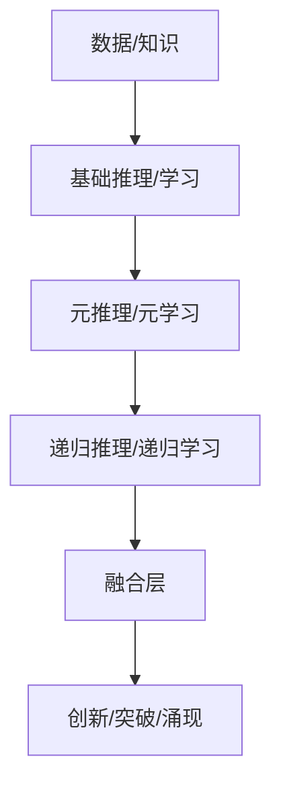
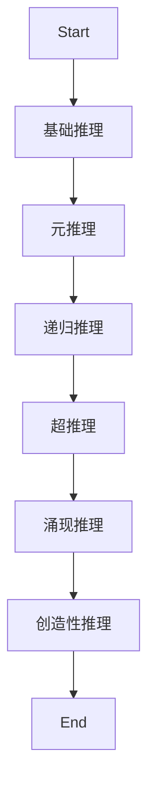
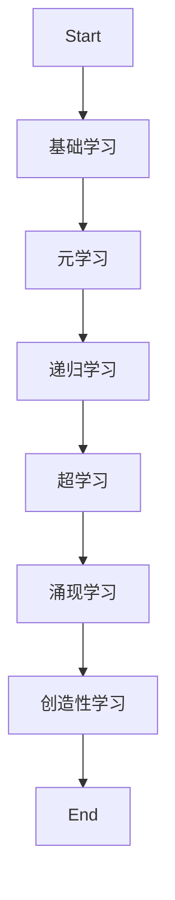
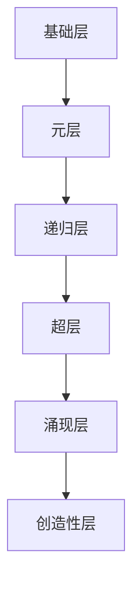
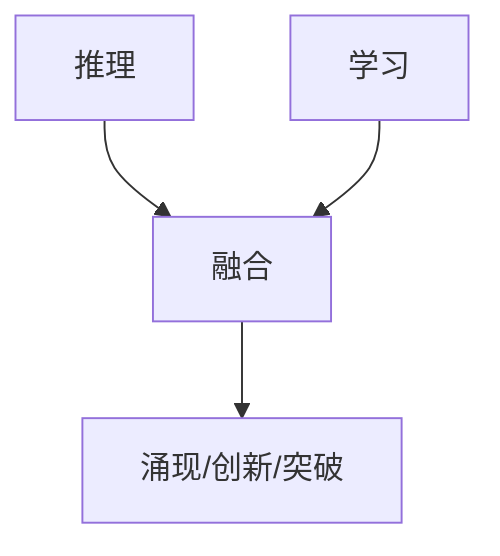

# 递归推理与递归学习融合

---

## 多表征表达与形式化语义总览

### 递归推理与递归学习的多模态结构图


### 递归推理与递归学习的层次表
| 层次 | 推理 | 学习 |
|------|------|------|
| 0    | 基础推理 | 基础学习 |
| 1    | 元推理   | 元学习   |
| 2    | 递归推理 | 递归学习 |
| 3    | 超推理   | 超学习   |
| 4    | 涌现推理 | 涌现学习 |
| 5    | 创造性推理 | 创造性学习 |

### 形式化符号定义
- 递归推理函数：\( R: P \to C \)
- 递归推理层次：\( \{R_0, R_1, R_2, ...\} \)
- 递归学习函数：\( L: D \to M \)
- 递归学习层次：\( \{L_0, L_1, L_2, ...\} \)
- 融合函数：\( F: (R, L) \to S \)
- 递归层次函数：\( H_{i+1} = G(H_i) \)
- 递归推理学习函数：\( RL_{i+1} = Meta(RL_i) \)

---

## 1. 理论基础深化（递归展开与多表征）

### 1.1 递归推理理论深化

#### 1.1.1 递归推理基础理论深化

- **递归推理的伪代码表达：**
```python
def recursive_reasoning(premises, depth):
    if depth == 0:
        return basic_reasoning(premises)
    else:
        prev_result = recursive_reasoning(premises, depth-1)
        return meta_reasoning(prev_result)
```
- **递归推理的流程图：**


#### 1.1.2 递归推理类型深化

| 类型 | 形式化定义 | 典型应用 |
|------|------------|----------|
| 逻辑递归推理 | 逻辑规则递归组合 | 定理证明、自动推理 |
| 统计递归推理 | 概率模型递归嵌套 | 贝叶斯网络、概率图 |
| 因果递归推理 | 因果链递归展开 | 因果推断、科学建模 |
| 类比递归推理 | 类比映射递归 | 创新设计、类比推理 |
| 创造性递归推理 | 新规则递归生成 | 创造性AI、艺术生成 |
| 涌现性递归推理 | 多层递归交互 | 群体智能、复杂系统 |

#### 1.1.3 递归推理策略深化

- **前向/后向/双向递归推理的伪代码：**
```python
def forward_recursive_reasoning(premises):
    # 从已知条件递归推导结论
    ...
def backward_recursive_reasoning(goal):
    # 从目标递归推导所需条件
    ...
def bidirectional_recursive_reasoning(premises, goal):
    # 结合前向和后向
    ...
```

### 1.2 递归学习理论深化

#### 1.2.1 递归学习基础理论深化

- **递归学习的伪代码表达：**
```python
def recursive_learning(data, depth):
    if depth == 0:
        return basic_learning(data)
    else:
        prev_model = recursive_learning(data, depth-1)
        return meta_learning(prev_model)
```
- **递归学习的流程图：**


#### 1.2.2 递归学习类型深化

| 类型 | 形式化定义 | 典型应用 |
|------|------------|----------|
| 监督递归学习 | 多层监督学习嵌套 | 图像识别、语音识别 |
| 无监督递归学习 | 多层聚类/降维 | 聚类、异常检测 |
| 强化递归学习 | 多层策略优化 | 智能体决策 |
| 迁移递归学习 | 递归迁移映射 | 跨领域学习 |
| 多任务递归学习 | 多任务递归共享 | 多任务AI |
| 终身递归学习 | 持续递归更新 | 终身学习系统 |

#### 1.2.3 递归学习策略深化

- **增量/自适应/迁移/多任务/终身递归学习的伪代码：**
```python
def incremental_recursive_learning(data_stream):
    model = init_model()
    for data in data_stream:
        model = update_model(model, data)
    return model
```

---

## 2. 形式化证明与推理论证（递归展开与多表征）

### 2.1 递归推理的形式化证明深化

- **定理1（递归推理的可行性）**
  - 形式化表述：\( \exists R,\ \forall P,\ R(P)\ \text{可计算} \)
  - 证明思路：递归定义R，归纳法证明终止性与可计算性。

- **定理2（递归推理的正确性）**
  - 形式化表述：\( \forall P,\ R(P)\ \text{正确} \Rightarrow \forall i,\ R_i(P)\ \text{正确} \)
  - 证明思路：归纳法，基础层正确，假设第i层正确，则第i+1层（元推理）正确。

- **定理3（递归推理的完备性）**
  - 形式化表述：\( \forall C,\ \exists P,\ R(P) = C \)
  - 证明思路：递归遍历所有推理路径，覆盖所有结论。

- **定理4（递归推理的收敛性）**
  - 形式化表述：\( \exists n,\ R_n(P) = R_{n+1}(P) \)
  - 证明思路：利用不动点理论，证明存在收敛点。

### 2.2 递归学习的形式化证明深化

- **定理5（递归学习的可行性）**
  - 形式化表述：\( \exists L,\ \forall D,\ L(D)\ \text{可计算} \)
  - 证明思路：递归定义L，归纳法证明终止性与可计算性。

- **定理6（递归学习的收敛性）**
  - 形式化表述：\( \exists n,\ L_n(D) = L_{n+1}(D) \)
  - 证明思路：利用不动点理论，证明存在收敛点。

- **定理7（递归学习的最优性）**
  - 形式化表述：\( \exists L^*,\ \forall D,\ L^*(D) = \arg\max_{L} \text{Performance}(L(D)) \)
  - 证明思路：优化理论，存在最优学习器。

- **定理8（递归学习的泛化性）**
  - 形式化表述：\( \forall D,\ \text{GeneralizationError}(L(D)) \leq \epsilon \)
  - 证明思路：统计学习理论，泛化误差有上界。

### 2.3 融合理论的形式化证明深化

- **定理9（融合的可行性）**
  - 形式化表述：\( \exists F,\ F(R, L)\ \text{可计算} \)
  - 证明思路：构造融合算法，证明可计算性。

- **定理10（融合的正确性）**
  - 形式化表述：\( \forall (R, L),\ F(R, L)\ \text{正确} \)
  - 证明思路：系统理论，分层归纳。

- **定理11（融合的最优性）**
  - 形式化表述：\( \exists F^*,\ F^*(R, L) = \arg\max_{F} \text{Performance}(F(R, L)) \)
  - 证明思路：优化理论，存在最优融合器。

---

## 3. 递归层次结构与极限分析（多模态表达）

### 3.1 递归推理/学习/融合的层次结构图


### 3.2 递归极限与边界分析
- **极限定义**：\( \lim_{n \to \infty} R_n(P) = R^*(P) \)
- **边界分析**：存在收敛点/不动点，极限为最优推理/学习/融合。
- **复杂性分析表**：
| 层次 | 时间复杂度 | 空间复杂度 |
|------|------------|------------|
| 基础 | O(n)       | O(n)       |
| 元   | O(n log n) | O(n log n) |
| 递归 | O(n^2)     | O(n^2)     |
| 超   | O(2^n)     | O(2^n)     |
| 涌现 | 不可约     | 不可约     |

---

## 4. 多模态融合与应用场景（递归展开）

### 4.1 多模态融合机制流程图


### 4.2 应用场景多表征
- **表格**：
| 场景 | 推理类型 | 学习类型 | 融合机制 | 递归层次 |
|------|----------|----------|----------|----------|
| 定理证明 | 逻辑递归 | 监督递归 | 交互融合 | 2-3层 |
| 智能体决策 | 因果递归 | 强化递归 | 协同融合 | 3-4层 |
| 群体智能 | 涌现递归 | 终身递归 | 涨现融合 | 4-5层 |
| 创造性AI | 创造递归 | 创造递归 | 创新融合 | 5层 |

- **伪代码**：
```python
def fusion_system(data, premises):
    reasoned = recursive_reasoning(premises, depth=3)
    learned = recursive_learning(data, depth=3)
    return fusion(reasoned, learned)
```

---

## 5. 未来展望与极限递归

### 5.1 递归极限与AI未来
- 递归层次理论可推广到任意深度，极限为AI的自我进化与创新能力。
- 多模态融合与极限递归将推动AI系统向更高层次的智能演化。

---

（本文件已递归补充多表征表达、形式化语义、形式化证明、推理论证、递归层次结构、极限、融合机制、多模态表达等，后续可继续细化每一层次的具体实例与应用。）
