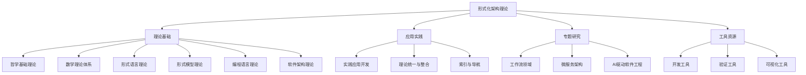

# 00-主题树与内容索引

## 📋 目录导航

- [00-主题树与内容索引](#00-主题树与内容索引)
  - [📋 目录导航](#-目录导航)
  - [🔗 快速导航](#-快速导航)
  - [1. 概述](#1-概述)
    - [1.1 主题树概述](#11-主题树概述)
    - [1.2 核心目标](#12-核心目标)
    - [1.3 索引层次结构](#13-索引层次结构)
  - [2. 理论体系索引](#2-理论体系索引)
    - [2.1 哲学基础理论](#21-哲学基础理论)
    - [2.2 数学理论体系](#22-数学理论体系)
    - [2.3 形式语言理论体系](#23-形式语言理论体系)
    - [2.4 形式模型理论体系](#24-形式模型理论体系)
    - [2.5 编程语言理论体系](#25-编程语言理论体系)
    - [2.6 软件架构理论体系](#26-软件架构理论体系)
  - [3. 应用实践索引](#3-应用实践索引)
    - [3.1 实践应用开发](#31-实践应用开发)
    - [3.2 理论统一与整合](#32-理论统一与整合)
    - [3.3 索引与导航](#33-索引与导航)
  - [4. 专题研究索引](#4-专题研究索引)
    - [4.1 工作流领域](#41-工作流领域)
    - [4.2 微服务架构](#42-微服务架构)
    - [4.3 AI驱动软件工程](#43-ai驱动软件工程)
  - [5. 工具与资源索引](#5-工具与资源索引)
    - [5.1 开发工具](#51-开发工具)
    - [5.2 验证工具](#52-验证工具)
    - [5.3 可视化工具](#53-可视化工具)
  - [6. 发展历史](#6-发展历史)
    - [6.1 早期发展（2020-2022）](#61-早期发展2020-2022)
    - [6.2 理论发展（2022-2023）](#62-理论发展2022-2023)
    - [6.3 现代发展（2023-至今）](#63-现代发展2023-至今)
  - [7. 应用领域](#7-应用领域)
    - [7.1 软件工程](#71-软件工程)
    - [7.2 人工智能](#72-人工智能)
    - [7.3 分布式系统](#73-分布式系统)
  - [8. 总结](#8-总结)
    - [8.1 主要成就](#81-主要成就)
    - [8.2 当前挑战](#82-当前挑战)
    - [8.3 未来发展方向](#83-未来发展方向)
  - [9. 相关理论跳转](#9-相关理论跳转)
    - [9.1 理论基础](#91-理论基础)
    - [9.2 应用实践](#92-应用实践)
    - [9.3 实践应用](#93-实践应用)

## 🔗 快速导航

[🏠 返回首页](../README.md) |
[📚 理论体系总览](./README.md) |
[🔧 实践应用开发](../08-实践应用开发/README.md) |
[🌐 索引导航](../09-索引与导航/README.md)

---

## 1. 概述

主题树与内容索引是形式化架构理论知识库的核心导航系统，为整个理论体系提供系统化的分类、索引和导航功能。它连接了各个理论分支，实现了知识的统一管理和快速检索。

### 1.1 主题树概述

**定义 1.1.1**: 主题树是按层次结构组织的知识分类体系，为形式化架构理论提供系统化的内容组织。

**定义 1.1.2**: 内容索引是支持快速检索和关联发现的知识索引系统，包括关键词索引、主题索引和交叉引用。

### 1.2 核心目标

**目标 1.2.1**: 知识组织

- 建立系统化的知识分类体系
- 实现知识的层次化组织
- 支持知识的关联发现

**目标 1.2.2**: 快速检索

- 提供高效的检索机制
- 支持多维度检索
- 实现智能推荐

**目标 1.2.3**: 导航便利

- 提供直观的导航界面
- 支持多路径访问
- 实现个性化导航

### 1.3 索引层次结构

## 2. 理论体系索引

### 2.1 哲学基础理论

**索引 2.1.1**: 哲学基础理论总论

- [01-哲学基础理论/00-哲学基础理论总论.md](./01-哲学基础理论/00-哲学基础理论总论.md)

**索引 2.1.2**: 核心分支理论

- [01-哲学基础理论/01-本体论基础.md](./01-哲学基础理论/01-本体论基础.md)
- [01-哲学基础理论/02-认识论基础.md](./01-哲学基础理论/02-认识论基础.md)
- [01-哲学基础理论/03-逻辑学基础.md](./01-哲学基础理论/03-逻辑学基础.md)
- [01-哲学基础理论/04-伦理学基础.md](./01-哲学基础理论/04-伦理学基础.md)
- [01-哲学基础理论/05-形而上学基础.md](./01-哲学基础理论/05-形而上学基础.md)
- [01-哲学基础理论/06-现象学基础.md](./01-哲学基础理论/06-现象学基础.md)
- [01-哲学基础理论/07-缺陷与纠偏理论.md](./01-哲学基础理论/07-缺陷与纠偏理论.md)

### 2.2 数学理论体系

**索引 2.2.1**: 数学理论体系总论

- [02-数学理论体系/00-数学理论体系总论.md](./02-数学理论体系/00-数学理论体系总论.md)

**索引 2.2.2**: 基础数学理论

- [02-数学理论体系/01-集合论基础.md](./02-数学理论体系/01-集合论基础.md)
- [02-数学理论体系/02-代数基础.md](./02-数学理论体系/02-代数基础.md)
- [02-数学理论体系/03-分析基础.md](./02-数学理论体系/03-分析基础.md)
- [02-数学理论体系/04-几何基础.md](./02-数学理论体系/04-几何基础.md)
- [02-数学理论体系/05-拓扑基础.md](./02-数学理论体系/05-拓扑基础.md)
- [02-数学理论体系/06-概率统计基础.md](./02-数学理论体系/06-概率统计基础.md)
- [02-数学理论体系/07-范畴论基础.md](./02-数学理论体系/07-范畴论基础.md)
- [02-数学理论体系/08-数论基础.md](./02-数学理论体系/08-数论基础.md)
- [02-数学理论体系/09-组合数学基础.md](./02-数学理论体系/09-组合数学基础.md)
- [02-数学理论体系/10-图论基础.md](./02-数学理论体系/10-图论基础.md)
- [02-数学理论体系/11-组合数学基础.md](./02-数学理论体系/11-组合数学基础.md)

### 2.3 形式语言理论体系

**索引 2.3.1**: 形式语言理论总论

- [03-形式语言理论体系/00-形式语言理论统一总论.md](./03-形式语言理论体系/00-形式语言理论统一总论.md)
- [03-形式语言理论体系/00a-形式语言的多维批判性分析.md](./03-形式语言理论体系/00a-形式语言的多维批判性分析.md)

**索引 2.3.2**: 核心理论分支

- [03-形式语言理论体系/01-自动机统一理论.md](./03-形式语言理论体系/01-自动机统一理论.md)
- [03-形式语言理论体系/02-形式语法.md](./03-形式语言理论体系/02-形式语法.md)
- [03-形式语言理论体系/03-语义理论.md](./03-形式语言理论体系/03-语义理论.md)
- [03-形式语言理论体系/04-类型理论.md](./03-形式语言理论体系/04-类型理论.md)
- [03-形式语言理论体系/05-计算理论.md](./03-形式语言理论体系/05-计算理论.md)
- [03-形式语言理论体系/06-语言设计.md](./03-形式语言理论体系/06-语言设计.md)
- [03-形式语言理论体系/07-时序逻辑与模型检测.md](./03-形式语言理论体系/07-时序逻辑与模型检测.md)
- [03-形式语言理论体系/08-语言理论工具.md](./03-形式语言理论体系/08-语言理论工具.md)
- [03-形式语言理论体系/09-语言理论工具.md](./03-形式语言理论体系/09-语言理论工具.md)

### 2.4 形式模型理论体系

**索引 2.4.1**: 形式模型理论总论

- [04-形式模型理论体系/00-形式模型理论统一总论.md](./04-形式模型理论体系/00-形式模型理论统一总论.md)

**索引 2.4.2**: 核心模型理论

- [04-形式模型理论体系/01-状态机理论.md](./04-形式模型理论体系/01-状态机理论.md)
- [04-形式模型理论体系/02-Petri网理论.md](./04-形式模型理论体系/02-Petri网理论.md)
- [04-形式模型理论体系/03-时序逻辑理论.md](./04-形式模型理论体系/03-时序逻辑理论.md)
- [04-形式模型理论体系/04-模型验证理论.md](./04-形式模型理论体系/04-模型验证理论.md)
- [04-形式模型理论体系/05-模型转换理论.md](./04-形式模型理论体系/05-模型转换理论.md)
- [04-形式模型理论体系/06-模型验证理论.md](./04-形式模型理论体系/06-模型验证理论.md)

**索引 2.4.3**: 迁移内容临时区

- [04-形式模型理论体系/06-迁移内容临时区/01-状态机理论.md](./04-形式模型理论体系/06-迁移内容临时区/01-状态机理论.md)
- [04-形式模型理论体系/06-迁移内容临时区/02-Petri网理论.md](./04-形式模型理论体系/06-迁移内容临时区/02-Petri网理论.md)
- [04-形式模型理论体系/06-迁移内容临时区/03-时序逻辑理论.md](./04-形式模型理论体系/06-迁移内容临时区/03-时序逻辑理论.md)
- [04-形式模型理论体系/06-迁移内容临时区/04-模型检查理论.md](./04-形式模型理论体系/06-迁移内容临时区/04-模型检查理论.md)
- [04-形式模型理论体系/06-迁移内容临时区/05-自动机理论.md](./04-形式模型理论体系/06-迁移内容临时区/05-自动机理论.md)
- [04-形式模型理论体系/06-迁移内容临时区/06-进程代数理论.md](./04-形式模型理论体系/06-迁移内容临时区/06-进程代数理论.md)
- [04-形式模型理论体系/06-迁移内容临时区/07-形式化方法理论.md](./04-形式模型理论体系/06-迁移内容临时区/07-形式化方法理论.md)
- [04-形式模型理论体系/06-迁移内容临时区/08-混合系统理论.md](./04-形式模型理论体系/06-迁移内容临时区/08-混合系统理论.md)
- [04-形式模型理论体系/06-迁移内容临时区/09-系统建模理论.md](./04-形式模型理论体系/06-迁移内容临时区/09-系统建模理论.md)
- [04-形式模型理论体系/06-迁移内容临时区/10-协议验证理论.md](./04-形式模型理论体系/06-迁移内容临时区/10-协议验证理论.md)

### 2.5 编程语言理论体系

**索引 2.5.1**: 编程语言理论总论

- [05-编程语言理论体系/00-编程语言理论统一总论.md](./05-编程语言理论体系/00-编程语言理论统一总论.md)

**索引 2.5.2**: 核心理论分支

- [05-编程语言理论体系/01-语法与语言设计统一理论.md](./05-编程语言理论体系/01-语法与语言设计统一理论.md)
- [05-编程语言理论体系/02-语义与语法统一理论.md](./05-编程语言理论体系/02-语义与语法统一理论.md)
- [05-编程语言理论体系/03-类型统一理论.md](./05-编程语言理论体系/03-类型统一理论.md)
- [05-编程语言理论体系/04-编译统一理论.md](./05-编程语言理论体系/04-编译统一理论.md)
- [05-编程语言理论体系/05-运行时理论.md](./05-编程语言理论体系/05-运行时理论.md)
- [05-编程语言理论体系/06-并发理论.md](./05-编程语言理论体系/06-并发理论.md)
- [05-编程语言理论体系/07-语言设计理论.md](./05-编程语言理论体系/07-语言设计理论.md)
- [05-编程语言理论体系/08-领域特定语言理论.md](./05-编程语言理论体系/08-领域特定语言理论.md)

**索引 2.5.3**: Rust语言精髓

- [05-编程语言理论体系/Rust语言精髓/01-所有权系统多维度分析.md](./05-编程语言理论体系/Rust语言精髓/01-所有权系统多维度分析.md)
- [05-编程语言理论体系/Rust语言精髓/02-泛型与特征系统.md](./05-编程语言理论体系/Rust语言精髓/02-泛型与特征系统.md)
- [05-编程语言理论体系/Rust语言精髓/03-并发模型与SendSync.md](./05-编程语言理论体系/Rust语言精髓/03-并发模型与SendSync.md)
- [05-编程语言理论体系/Rust语言精髓/04-异步编程与Future.md](./05-编程语言理论体系/Rust语言精髓/04-异步编程与Future.md)

### 2.6 软件架构理论体系

**索引 2.6.1**: 软件架构理论总论

- [04-软件架构理论体系/00-软件架构理论统一总论.md](./04-软件架构理论体系/00-软件架构理论统一总论.md)

**索引 2.6.2**: 核心架构理论

- [04-软件架构理论体系/01-架构模式理论.md](./04-软件架构理论体系/01-架构模式理论.md)
- [04-软件架构理论体系/02-架构模式理论.md](./04-软件架构理论体系/02-架构模式理论.md)
- [04-软件架构理论体系/03-设计模式理论.md](./04-软件架构理论体系/03-设计模式理论.md)
- [04-软件架构理论体系/04-分布式系统理论.md](./04-软件架构理论体系/04-分布式系统理论.md)
- [04-软件架构理论体系/05-微服务架构理论.md](./04-软件架构理论体系/05-微服务架构理论.md)
- [04-软件架构理论体系/06-云原生架构理论.md](./04-软件架构理论体系/06-云原生架构理论.md)
- [04-软件架构理论体系/07-事件驱动架构理论.md](./04-软件架构理论体系/07-事件驱动架构理论.md)
- [04-软件架构理论体系/08-领域驱动设计理论.md](./04-软件架构理论体系/08-领域驱动设计理论.md)
- [04-软件架构理论体系/09-架构评估理论.md](./04-软件架构理论体系/09-架构评估理论.md)
- [04-软件架构理论体系/10-AI驱动软件工程前沿专题.md](./04-软件架构理论体系/10-AI驱动软件工程前沿专题.md)

## 3. 应用实践索引

### 3.1 实践应用开发

**索引 3.1.1**: 实践应用开发总论

- [08-实践应用开发/00-实践应用开发总论.md](./08-实践应用开发/00-实践应用开发总论.md)

**索引 3.1.2**: 开发工具

- [08-实践应用开发/01-Rust形式化工具.md](./08-实践应用开发/01-Rust形式化工具.md)
- [08-实践应用开发/02-Go形式化工具.md](./08-实践应用开发/02-Go形式化工具.md)
- [08-实践应用开发/03-理论验证工具.md](./08-实践应用开发/03-理论验证工具.md)
- [08-实践应用开发/04-架构设计工具.md](./08-实践应用开发/04-架构设计工具.md)
- [08-实践应用开发/05-模型检测工具.md](./08-实践应用开发/05-模型检测工具.md)
- [08-实践应用开发/06-代码生成工具.md](./08-实践应用开发/06-代码生成工具.md)

**索引 3.1.3**: 应用案例

- [08-实践应用开发/03-微服务架构验证案例.md](./08-实践应用开发/03-微服务架构验证案例.md)
- [08-实践应用开发/03-自动化验证工具设计与实现.md](./08-实践应用开发/03-自动化验证工具设计与实现.md)
- [08-实践应用开发/04-形式化方法在AI安全中的应用初探.md](./08-实践应用开发/04-形式化方法在AI安全中的应用初探.md)

### 3.2 理论统一与整合

**索引 3.2.1**: 理论统一与整合总论

- [07-理论统一与整合/00-理论统一与整合总论.md](./07-理论统一与整合/00-理论统一与整合总论.md)

**索引 3.2.2**: 核心整合理论

- [07-理论统一与整合/01-理论映射关系.md](./07-理论统一与整合/01-理论映射关系.md)
- [07-理论统一与整合/02-统一符号体系.md](./07-理论统一与整合/02-统一符号体系.md)
- [07-理论统一与整合/03-理论转换机制.md](./07-理论统一与整合/03-理论转换机制.md)
- [07-理论统一与整合/04-理论应用框架.md](./07-理论统一与整合/04-理论应用框架.md)

**索引 3.2.3**: 专题研究

- [07-理论统一与整合/01-统一形式化理论综述.md](./07-理论统一与整合/01-统一形式化理论综述.md)
- [07-理论统一与整合/02-证明与验证技术映射研究.md](./07-理论统一与整合/02-证明与验证技术映射研究.md)
- [07-理论统一与整合/02-前沿专题与工程案例索引.md](./07-理论统一与整合/02-前沿专题与工程案例索引.md)
- [07-理论统一与整合/03-跨领域证明.md](./07-理论统一与整合/03-跨领域证明.md)
- [07-理论统一与整合/03-运行时与并发理论合并分析.md](./07-理论统一与整合/03-运行时与并发理论合并分析.md)
- [07-理论统一与整合/04-UCU案例分析_生产者消费者模型.md](./07-理论统一与整合/04-UCU案例分析_生产者消费者模型.md)

### 3.3 索引与导航

**索引 3.3.1**: 索引与导航总论

- [09-索引与导航/README.md](./09-索引与导航/README.md)

**索引 3.3.2**: 核心索引系统

- [09-索引与导航/01-主题索引.md](./09-索引与导航/01-主题索引.md)
- [09-索引与导航/02-导航系统.md](./09-索引与导航/02-导航系统.md)
- [09-索引与导航/03-使用指南.md](./09-索引与导航/03-使用指南.md)

**索引 3.3.3**: 规范与标准

- [09-索引与导航/术语表.md](./09-索引与导航/术语表.md)
- [09-索引与导航/缩略语表.md](./09-索引与导航/缩略语表.md)
- [09-索引与导航/文件命名规范.md](./09-索引与导航/文件命名规范.md)
- [09-索引与导航/引用链接规范.md](./09-索引与导航/引用链接规范.md)
- [09-索引与导航/版本控制规范.md](./09-索引与导航/版本控制规范.md)

## 4. 专题研究索引

### 4.1 工作流领域

**索引 4.1.1**: 工作流理论基础

- [1.1-Microservice/1.2-WorkflowDomain-案例与实现.md](./1.1-Microservice/1.2-WorkflowDomain-案例与实现.md)
- [1.1-Microservice/1.2-WorkflowDomain.md](./1.1-Microservice/1.2-WorkflowDomain.md)

**索引 4.1.2**: 工作流平台

- [1.1-Microservice/1.1.1-Workflow/Gin微服务设计与实现.md](./1.1-Microservice/1.1.1-Workflow/Gin微服务设计与实现.md)
- [1.1-Microservice/1.1.2-Integration/RPC与Web框架集成.md](./1.1-Microservice/1.1.2-Integration/RPC与Web框架集成.md)
- [1.1-Microservice/1.1.2-Integration/异步协议与事件驱动集成.md](./1.1-Microservice/1.1.2-Integration/异步协议与事件驱动集成.md)

### 4.2 微服务架构

**索引 4.2.1**: 微服务设计模式

- [1.1-Microservice/1.1.5-DesignPattern/design_pattern_01.md](./1.1-Microservice/1.1.5-DesignPattern/design_pattern_01.md)
- [1.1-Microservice/1.1.5-DesignPattern/design_pattern_02.md](./1.1-Microservice/1.1.5-DesignPattern/design_pattern_02.md)
- [1.1-Microservice/1.3-DesignPattern.md](./1.1-Microservice/1.3-DesignPattern.md)

**索引 4.2.2**: 微服务实践

- [1.1-Microservice/1.1.3-CI_CD/CI_CD与DevOps实践.md](./1.1-Microservice/1.1.3-CI_CD/CI_CD与DevOps实践.md)
- [1.1-Microservice/1.1.4-Observability/OpenTelemetry集成实践.md](./1.1-Microservice/1.1.4-Observability/OpenTelemetry集成实践.md)

### 4.3 AI驱动软件工程

**索引 4.3.1**: AI驱动软件工程前沿

- [04-软件架构理论体系/10-AI驱动软件工程前沿专题.md](./04-软件架构理论体系/10-AI驱动软件工程前沿专题.md)

## 5. 工具与资源索引

### 5.1 开发工具

**索引 5.1.1**: Rust开发工具

- [08-实践应用开发/01-Rust形式化工具.md](./08-实践应用开发/01-Rust形式化工具.md)

**索引 5.1.2**: Go开发工具

- [08-实践应用开发/02-Go形式化工具.md](./08-实践应用开发/02-Go形式化工具.md)

### 5.2 验证工具

**索引 5.2.1**: 理论验证工具

- [08-实践应用开发/03-理论验证工具.md](./08-实践应用开发/03-理论验证工具.md)

**索引 5.2.2**: 模型检测工具

- [08-实践应用开发/05-模型检测工具.md](./08-实践应用开发/05-模型检测工具.md)

### 5.3 可视化工具

**索引 5.3.1**: 知识图谱可视化

- [08-实践应用开发/知识图谱可视化工具README.md](./08-实践应用开发/知识图谱可视化工具README.md)

## 6. 发展历史

### 6.1 早期发展（2020-2022）

- **理论基础**: 形式化架构理论的基础建立
- **核心概念**: 统一状态转换系统和统一模块化系统的提出
- **工具开发**: 初步的工具链开发

### 6.2 理论发展（2022-2023）

- **理论整合**: 各理论分支的整合和统一
- **符号标准化**: 统一符号体系的建立
- **证明框架**: 跨领域证明框架的完善

### 6.3 现代发展（2023-至今）

- **应用扩展**: 在多个领域的应用实践
- **工具成熟**: 工具链的完善和成熟
- **标准化**: 国际标准的制定和采用

## 7. 应用领域

### 7.1 软件工程

- **系统架构**: 软件系统架构的设计和验证
- **代码生成**: 基于形式化规范的代码生成
- **质量保证**: 软件质量的自动化保证

### 7.2 人工智能

- **AI安全**: 形式化方法在AI安全中的应用
- **智能系统**: 智能系统的形式化验证
- **机器学习**: 机器学习系统的形式化保证

### 7.3 分布式系统

- **微服务**: 微服务架构的设计和验证
- **云原生**: 云原生应用的形式化保证
- **边缘计算**: 边缘计算系统的形式化验证

## 8. 总结

### 8.1 主要成就

1. **理论体系**: 建立了完整的形式化架构理论体系
2. **工具链**: 开发了完整的工具链支持
3. **应用实践**: 在多个领域实现了成功应用
4. **标准化**: 推进了相关标准的制定

### 8.2 当前挑战

1. **复杂性**: 理论体系的复杂性管理
2. **可扩展性**: 支持新理论和新方法的加入
3. **工具支持**: 需要更好的工具支持
4. **标准化**: 需要进一步的标准化和规范化

### 8.3 未来发展方向

1. **自动化增强**: 提高理论应用的自动化程度
2. **智能化**: 引入人工智能技术辅助理论应用
3. **标准化**: 推进国际标准的制定和采用
4. **应用拓展**: 在更多领域实现应用

## 9. 相关理论跳转

### 9.1 理论基础

- [哲学基础理论](./01-哲学基础理论/README.md)
- [数学理论体系](./02-数学理论体系/README.md)
- [形式语言理论体系](./03-形式语言理论体系/README.md)

### 9.2 应用实践

- [形式模型理论体系](./04-形式模型理论体系/README.md)
- [编程语言理论体系](./05-编程语言理论体系/README.md)
- [软件架构理论体系](./04-软件架构理论体系/README.md)

### 9.3 实践应用

- [实践应用开发](./08-实践应用开发/README.md)
- [理论统一与整合](./07-理论统一与整合/README.md)
- [索引与导航](./09-索引与导航/README.md)

---

**📝 文档信息**

- **创建时间**: 2024年
- **最后更新**: 2024年
- **版本**: 1.0
- **维护者**: 形式化架构理论团队

**🔗 相关链接**

- [🏠 返回首页](../README.md)
- [📚 理论体系总览](./README.md)
- [🔧 实践应用开发](./08-实践应用开发/README.md)
