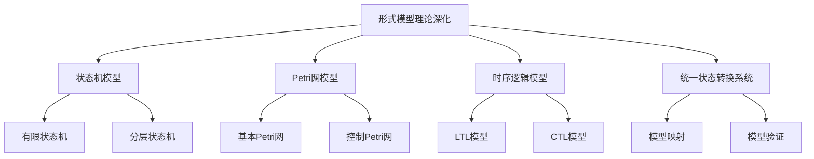
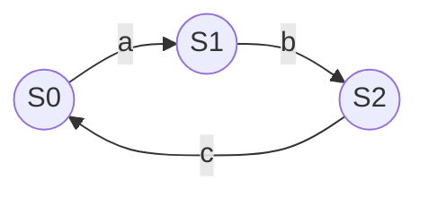
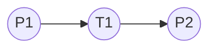

# 07-形式模型理论深化

> 本文档归纳 /Matter/Theory/Advanced_Formal_Model_Theory 目录下形式模型理论深化相关内容，分层梳理主要主题、论证思路、行业相关性。

## 目录

1. 形式模型理论深化概述
2. 主要文件与内容索引
3. 形式模型的基本理论
4. 统一状态转换系统理论
5. 形式模型的行业应用
6. 相关性跳转与引用

---

## 1. 形式模型理论深化概述

形式模型理论深化旨在统一描述各种形式模型（如状态机、Petri网、时序逻辑模型等）的理论基础，支撑系统建模、验证与工程实现。

### 1.1 核心目标

- 建立形式模型的统一理论框架
- 支持复杂系统的形式化建模与验证
- 推动行业标准与工程实践的理论基础

### 1.2 理论层次结构



---

## 2. 主要文件与内容索引

### 2.1 核心文件

- [Advanced_Formal_Model_Theory_Comprehensive.md](../Matter/Theory/Advanced_Formal_Model_Theory/Advanced_Formal_Model_Theory_Comprehensive.md)

### 2.2 相关文件

- [统一状态转换系统理论.md](../Analysis/04-形式模型理论体系/统一状态转换系统理论.md)
- [01-状态机理论.md](../Analysis/06-形式模型理论体系/01-状态机理论.md)
- [02-Petri网理论.md](../Analysis/06-形式模型理论体系/02-Petri网理论.md)
- [03-时序逻辑理论.md](../Analysis/06-形式模型理论体系/03-时序逻辑理论.md)

---

## 3. 形式模型的基本理论

### 3.1 状态机模型

有限状态机 $FSM = (S, I, O, f, g, s_0)$：

- $S$：状态集合
- $I$：输入集合
- $O$：输出集合
- $f$：状态转移函数
- $g$：输出函数
- $s_0$：初始状态

#### 3.1.1 状态转移图



#### 3.1.2 Rust状态机实现示例

```rust
#[derive(Debug, Clone, PartialEq, Eq, Hash)]
enum State { S0, S1, S2 }
#[derive(Debug, Clone, PartialEq, Eq, Hash)]
enum Input { A, B, C }

struct FSM {
    state: State,
}

impl FSM {
    fn new() -> Self { Self { state: State::S0 } }
    fn transition(&mut self, input: Input) {
        self.state = match (self.state.clone(), input) {
            (State::S0, Input::A) => State::S1,
            (State::S1, Input::B) => State::S2,
            (State::S2, Input::C) => State::S0,
            (s, _) => s,
        }
    }
}

fn main() {
    let mut fsm = FSM::new();
    fsm.transition(Input::A);
    fsm.transition(Input::B);
    fsm.transition(Input::C);
    println!("Current state: {:?}", fsm.state);
}
```

### 3.2 Petri网模型

Petri网 $PN = (P, T, F, M_0)$：

- $P$：库所集合
- $T$：变迁集合
- $F$：流关系
- $M_0$：初始标记

#### 3.2.1 Petri网结构图



#### 3.2.2 Go语言Petri网实现示例

```go
package main
import "fmt"

type Place struct {
    name  string
    tokens int
}
type Transition struct {
    name string
    input  []*Place
    output []*Place
}
func (t *Transition) Fire() bool {
    for _, p := range t.input {
        if p.tokens == 0 { return false }
    }
    for _, p := range t.input { p.tokens-- }
    for _, p := range t.output { p.tokens++ }
    return true
}
func main() {
    p1 := &Place{"P1", 1}
    p2 := &Place{"P2", 0}
    t1 := &Transition{"T1", []*Place{p1}, []*Place{p2}}
    fired := t1.Fire()
    fmt.Printf("Fired: %v, P1: %d, P2: %d\n", fired, p1.tokens, p2.tokens)
}
```

### 3.3 时序逻辑模型

- LTL模型：线性时序逻辑建模系统行为
- CTL模型：分支时序逻辑建模系统分支行为

#### 3.3.1 LTL公式示例

$$\square (request \rightarrow \diamond grant)$$

#### 3.3.2 CTL公式示例

$$\mathbf{A} \square (safe)$$

---

## 4. 统一状态转换系统理论

### 4.1 统一状态转换系统定义

统一状态转换系统 $UTS = (S, E, R, s_0)$：

- $S$：状态集合
- $E$：事件集合
- $R$：状态转移关系
- $s_0$：初始状态

### 4.2 模型映射与验证

- 状态机、Petri网、时序逻辑模型可映射为统一状态转换系统
- 支持模型间的自动转换与一致性验证

#### 4.2.1 Rust统一状态转换系统实现

```rust
use std::collections::HashMap;
#[derive(Debug, Clone, PartialEq, Eq, Hash)]
enum State { S0, S1, S2 }
#[derive(Debug, Clone, PartialEq, Eq, Hash)]
enum Event { E1, E2, E3 }
struct UTS {
    state: State,
    transitions: HashMap<(State, Event), State>,
}
impl UTS {
    fn new(transitions: HashMap<(State, Event), State>) -> Self {
        Self { state: State::S0, transitions }
    }
    fn trigger(&mut self, event: Event) {
        if let Some(next) = self.transitions.get(&(self.state.clone(), event)) {
            self.state = next.clone();
        }
    }
}
fn main() {
    let mut transitions = HashMap::new();
    transitions.insert((State::S0, Event::E1), State::S1);
    transitions.insert((State::S1, Event::E2), State::S2);
    transitions.insert((State::S2, Event::E3), State::S0);
    let mut uts = UTS::new(transitions);
    uts.trigger(Event::E1);
    uts.trigger(Event::E2);
    uts.trigger(Event::E3);
    println!("Current state: {:?}", uts.state);
}
```

---

## 5. 形式模型的行业应用

### 5.1 嵌入式与控制系统

- 状态机与Petri网建模实时控制逻辑
- 时序逻辑模型验证安全与活性

### 5.2 软件与企业架构

- 统一状态转换系统支撑微服务、工作流、业务流程建模
- 形式模型驱动架构设计与自动化验证

### 5.3 工程实践

- 使用模型检查工具（如NuSMV、UPPAAL）进行形式化验证
- 代码生成与自动化部署

---

## 6. 相关性跳转与引用

- [01-理论体系总论.md](01-理论体系总论.md)
- [01-统一形式理论综合.md](01-统一形式理论综合.md)
- [02-类型理论深化.md](02-类型理论深化.md)
- [03-时序逻辑控制深化.md](03-时序逻辑控制深化.md)
- [04-Petri网与控制论.md](04-Petri网与控制论.md)
- [05-线性仿射时序类型理论.md](05-线性仿射时序类型理论.md)
- [06-形式语言理论深化.md](06-形式语言理论深化.md)
- [00-主题树与内容索引.md](00-主题树与内容索引.md)
- [进度追踪与上下文.md](进度追踪与上下文.md)

---

> 本文件为自动归纳生成，后续将递归细化相关内容，持续补全图表、公式、代码等多表征内容。
