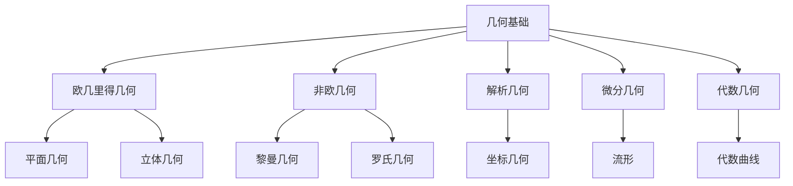

# 03-几何基础

> 本文档归纳 /Matter/Mathematics 目录下几何相关内容，分层梳理几何的基本定义、详细解释、严密论证、行业相关性。

## 目录

1. 几何基础概述
2. 主要文件与内容索引
3. 几何空间的基本定义与解释
4. 几何变换与性质
5. 几何理论的行业应用
6. 相关性跳转与引用

---

## 1. 几何基础概述

几何基础研究空间、形状、变换及其性质，是现代数学、计算机图形学、机器学习、工程等领域的核心理论基础。几何理论为空间建模、图像处理、机器人学等提供了坚实的理论支撑。

### 1.1 核心目标

- 建立几何空间的严格定义与分类
- 支持几何变换的性质分析与证明
- 推动几何理论与工程实践的融合

### 1.2 几何基础层次结构



---

## 2. 主要文件与内容索引

### 2.1 核心文件

- [数学内容全面分析报告-2024.md](../Matter/Mathematics/数学内容全面分析报告-2024.md)
- [03-几何基础.md](../Matter/Mathematics/03-几何基础.md)

### 2.2 相关文件

- [数学内容与Wiki权威对比分析-2024.md](../Matter/Mathematics/content/数学内容与Wiki权威对比分析-2024.md)

---

## 3. 几何空间的基本定义与解释

### 3.1 欧几里得几何

**定义 3.1.1** 欧几里得空间
欧几里得空间 $\mathbb{R}^n$ 是 $n$ 维实向量空间，配有内积：
$$\langle x, y \rangle = \sum_{i=1}^n x_i y_i$$

**公理 3.1.1** 平行公理
通过直线外一点，有且仅有一条直线与给定直线平行。

**论证 3.1.2** 欧几里得几何的性质

- 三角形内角和为 $180^\circ$
- 勾股定理：$a^2 + b^2 = c^2$
- 相似三角形的比例关系

### 3.2 非欧几何

**定义 3.2.1** 黎曼几何
黎曼几何中，不存在平行线，所有直线都相交。

**定义 3.2.2** 罗氏几何
罗氏几何中，通过直线外一点，存在多条平行线。

**论证 3.2.3** 非欧几何的独立性

- 非欧几何与欧几里得几何在逻辑上等价
- 非欧几何在相对论、宇宙学中有重要应用

### 3.3 解析几何

**定义 3.3.1** 坐标几何
将几何问题转化为代数问题，通过坐标系统描述几何对象。

**定义 3.3.2** 向量几何
使用向量描述几何对象和变换。

**论证 3.3.3** 解析几何的统一性

- 几何问题可转化为代数方程
- 代数方法可解决几何问题

### 3.4 微分几何

**定义 3.4.1** 流形
流形是局部与欧几里得空间同胚的拓扑空间。

**定义 3.4.2** 切空间
流形上一点的切空间是该点所有切向量的集合。

**论证 3.4.3** 微分几何的局部性质

- 流形在局部上与欧几里得空间相同
- 全局性质通过局部性质构建

---

## 4. 几何变换与性质

### 4.1 等距变换

**定义 4.1.1** 等距变换
保持距离的变换：$d(f(x), f(y)) = d(x, y)$。

**定义 4.1.2** 刚体变换
保持角度和距离的变换，包括平移、旋转、反射。

**论证 4.1.3** 等距变换的结构

- 等距变换构成群
- 等距变换保持几何性质

### 4.2 仿射变换

**定义 4.2.1** 仿射变换
形如 $f(x) = Ax + b$ 的变换，其中 $A$ 是可逆矩阵。

**论证 4.2.2** 仿射变换的性质

- 保持平行关系
- 保持面积比例
- 不保持角度

### 4.3 投影变换

**定义 4.3.1** 投影变换
将高维空间投影到低维空间的变换。

**论证 4.3.3** 投影变换的应用

- 计算机图形学中的透视投影
- 机器学习中的降维

### 4.4 代码示例

```rust
// 几何变换示例
use nalgebra::{Point2, Vector2, Rotation2};

#[derive(Debug, Clone)]
pub struct GeometricTransform {
    translation: Vector2<f64>,
    rotation: Rotation2<f64>,
    scale: f64,
}

impl GeometricTransform {
    pub fn new(translation: Vector2<f64>, rotation: Rotation2<f64>, scale: f64) -> Self {
        Self { translation, rotation, scale }
    }
    
    pub fn apply(&self, point: Point2<f64>) -> Point2<f64> {
        let rotated = self.rotation * (point - Point2::origin());
        let scaled = rotated * self.scale;
        Point2::origin() + scaled + self.translation
    }
    
    pub fn is_isometry(&self) -> bool {
        self.scale.abs() - 1.0 < f64::EPSILON
    }
}

fn main() {
    let transform = GeometricTransform::new(
        Vector2::new(1.0, 2.0),
        Rotation2::new(std::f64::consts::PI / 4.0),
        1.0,
    );
    let point = Point2::new(1.0, 0.0);
    let transformed = transform.apply(point);
    println!("Original: {:?}, Transformed: {:?}", point, transformed);
    println!("Is isometry: {}", transform.is_isometry());
}
```

---

## 5. 几何理论的行业应用

### 5.1 计算机图形学

- 几何变换：3D建模、动画
- 投影几何：渲染、可视化
- 曲线曲面：CAD、游戏开发

### 5.2 机器学习

- 流形学习：降维、特征提取
- 几何深度学习：图神经网络
- 计算机视觉：图像处理、目标检测

### 5.3 工程应用

- 机器人学：运动学、路径规划
- 建筑学：结构设计、空间规划
- 物理学：相对论、量子力学

---

## 6. 相关性跳转与引用

- [00-数学理论体系总论.md](00-数学理论体系总论.md)
- [01-集合论基础.md](01-集合论基础.md)
- [02-代数基础.md](02-代数基础.md)
- [04-分析基础.md](04-分析基础.md)
- [05-拓扑基础.md](05-拓扑基础.md)
- [06-概率统计基础.md](06-概率统计基础.md)
- [00-主题树与内容索引.md](../00-主题树与内容索引.md)
- [进度追踪与上下文.md](../进度追踪与上下文.md)

---

> 本文件为自动归纳生成，后续将递归细化相关内容，持续补全图表、公式、代码等多表征内容。
