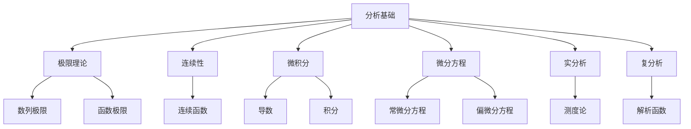

# 04-分析基础

> 本文档归纳 /Matter/Mathematics 目录下分析相关内容，分层梳理分析的基本定义、详细解释、严密论证、行业相关性。

## 目录

1. 分析基础概述
2. 主要文件与内容索引
3. 极限与连续性的基本定义与解释
4. 微积分与微分方程
5. 实分析与复分析
6. 分析理论的行业应用
7. 相关性跳转与引用

---

## 1. 分析基础概述

分析基础研究极限、连续性、微积分等概念，是现代数学、物理学、工程学等领域的核心理论基础。分析理论为数值计算、优化算法、控制系统等提供了坚实的理论支撑。

### 1.1 核心目标

- 建立极限与连续性的严格定义
- 支持微积分与微分方程的理论分析
- 推动分析理论与工程实践的融合

### 1.2 分析基础层次结构



---

## 2. 主要文件与内容索引

### 2.1 核心文件

- [数学内容全面分析报告-2024.md](../Matter/Mathematics/数学内容全面分析报告-2024.md)
- [04-分析基础.md](../Matter/Mathematics/04-分析基础.md)

### 2.2 相关文件

- [数学内容与Wiki权威对比分析-2024.md](../Matter/Mathematics/content/数学内容与Wiki权威对比分析-2024.md)

---

## 3. 极限与连续性的基本定义与解释

### 3.1 数列极限

**定义 3.1.1** 数列极限
数列 $\{a_n\}$ 收敛到 $L$，记作 $\lim_{n \to \infty} a_n = L$，如果：
$$\forall \epsilon > 0, \exists N \in \mathbb{N}, \forall n > N, |a_n - L| < \epsilon$$

**论证 3.1.2** 极限的唯一性
若 $\lim_{n \to \infty} a_n = L_1$ 且 $\lim_{n \to \infty} a_n = L_2$，则 $L_1 = L_2$。

**证明**：假设 $L_1 \neq L_2$，取 $\epsilon = \frac{|L_1 - L_2|}{2}$，则存在 $N$ 使得 $n > N$ 时 $|a_n - L_1| < \epsilon$ 且 $|a_n - L_2| < \epsilon$，这与三角不等式矛盾。

### 3.2 函数极限

**定义 3.2.1** 函数极限
函数 $f$ 在 $x_0$ 处的极限为 $L$，记作 $\lim_{x \to x_0} f(x) = L$，如果：
$$\forall \epsilon > 0, \exists \delta > 0, \forall x, 0 < |x - x_0| < \delta \Rightarrow |f(x) - L| < \epsilon$$

**论证 3.2.2** 极限的运算性质

- $\lim_{x \to x_0} (f(x) + g(x)) = \lim_{x \to x_0} f(x) + \lim_{x \to x_0} g(x)$
- $\lim_{x \to x_0} (f(x) \cdot g(x)) = \lim_{x \to x_0} f(x) \cdot \lim_{x \to x_0} g(x)$

### 3.3 连续性

**定义 3.3.1** 连续函数
函数 $f$ 在 $x_0$ 处连续，如果：
$$\lim_{x \to x_0} f(x) = f(x_0)$$

**论证 3.3.2** 连续函数的性质

- 连续函数的和、积、商（分母不为零）仍为连续函数
- 连续函数的复合仍为连续函数
- 闭区间上的连续函数有最大值和最小值

---

## 4. 微积分与微分方程

### 4.1 导数

**定义 4.1.1** 导数
函数 $f$ 在点 $x$ 的导数定义为：
$$f'(x) = \lim_{h \to 0} \frac{f(x + h) - f(x)}{h}$$

**论证 4.1.2** 导数的几何意义
导数 $f'(x)$ 表示函数 $f$ 在点 $x$ 处的切线斜率。

**论证 4.1.3** 导数的物理意义
导数表示瞬时变化率，如速度是位移的导数，加速度是速度的导数。

### 4.2 积分

**定义 4.2.1** 定积分
函数 $f$ 在区间 $[a, b]$ 上的定积分为：
$$\int_a^b f(x) dx = \lim_{n \to \infty} \sum_{i=1}^n f(x_i) \Delta x$$

**论证 4.2.2** 微积分基本定理
若 $F$ 是 $f$ 的原函数，则：
$$\int_a^b f(x) dx = F(b) - F(a)$$

### 4.3 微分方程

**定义 4.3.1** 常微分方程
形如 $F(x, y, y', y'', \ldots, y^{(n)}) = 0$ 的方程。

**定义 4.3.2** 偏微分方程
包含多个自变量的偏导数的方程。

**论证 4.3.3** 微分方程的解的存在唯一性
在适当条件下，微分方程的解存在且唯一。

---

## 5. 实分析与复分析

### 5.1 实分析

**定义 5.1.1** 测度
测度是定义在集合上的非负函数，满足可数可加性。

**定义 5.1.2** 勒贝格积分
基于测度的积分理论，比黎曼积分更广泛。

**论证 5.1.3** 实分析的重要性
实分析为现代数学提供了严格的测度与积分理论。

### 5.2 复分析

**定义 5.2.1** 解析函数
在复平面上可微的函数称为解析函数。

**论证 5.2.2** 柯西积分定理
解析函数在简单闭曲线上的积分为零。

**论证 5.2.3** 解析函数的性质
解析函数具有幂级数展开，且满足最大模原理。

### 5.3 代码示例

```rust
// 数值分析示例
use std::f64;

pub struct NumericalAnalysis {
    tolerance: f64,
    max_iterations: usize,
}

impl NumericalAnalysis {
    pub fn new(tolerance: f64, max_iterations: usize) -> Self {
        Self { tolerance, max_iterations }
    }
    
    pub fn derivative<F>(&self, f: F, x: f64, h: f64) -> f64 
    where F: Fn(f64) -> f64 
    {
        (f(x + h) - f(x)) / h
    }
    
    pub fn integrate<F>(&self, f: F, a: f64, b: f64, n: usize) -> f64 
    where F: Fn(f64) -> f64 
    {
        let h = (b - a) / n as f64;
        let mut sum = 0.0;
        for i in 0..n {
            let x = a + i as f64 * h;
            sum += f(x);
        }
        sum * h
    }
    
    pub fn newton_method<F, DF>(&self, f: F, df: DF, x0: f64) -> Option<f64> 
    where F: Fn(f64) -> f64, DF: Fn(f64) -> f64 
    {
        let mut x = x0;
        for _ in 0..self.max_iterations {
            let fx = f(x);
            let dfx = df(x);
            if dfx.abs() < self.tolerance {
                return None;
            }
            let x_new = x - fx / dfx;
            if (x_new - x).abs() < self.tolerance {
                return Some(x_new);
            }
            x = x_new;
        }
        None
    }
}

fn main() {
    let analysis = NumericalAnalysis::new(1e-10, 1000);
    
    // 计算导数
    let f = |x: f64| x.powi(2);
    let df = analysis.derivative(f, 2.0, 1e-6);
    println!("f'(2) = {}", df);
    
    // 计算积分
    let integral = analysis.integrate(f, 0.0, 1.0, 1000);
    println!("∫₀¹ x² dx = {}", integral);
    
    // 牛顿法求根
    let g = |x: f64| x.powi(2) - 4.0;
    let dg = |x: f64| 2.0 * x;
    if let Some(root) = analysis.newton_method(g, dg, 1.0) {
        println!("Root: {}", root);
    }
}
```

---

## 6. 分析理论的行业应用

### 6.1 数值计算

- 数值积分：科学计算、工程仿真
- 数值微分：优化算法、机器学习
- 微分方程求解：物理建模、控制系统

### 6.2 优化理论

- 梯度下降：机器学习、深度学习
- 拉格朗日乘数法：约束优化
- 变分法：最优控制

### 6.3 信号处理

- 傅里叶分析：频谱分析、滤波
- 拉普拉斯变换：控制系统分析
- 小波分析：图像压缩、信号去噪

---

## 7. 相关性跳转与引用

- [00-数学理论体系总论.md](00-数学理论体系总论.md)
- [01-集合论基础.md](01-集合论基础.md)
- [02-代数基础.md](02-代数基础.md)
- [03-几何基础.md](03-几何基础.md)
- [05-拓扑基础.md](05-拓扑基础.md)
- [06-概率统计基础.md](06-概率统计基础.md)
- [00-主题树与内容索引.md](../00-主题树与内容索引.md)
- [进度追踪与上下文.md](../进度追踪与上下文.md)

---

> 本文件为自动归纳生成，后续将递归细化相关内容，持续补全图表、公式、代码等多表征内容。
