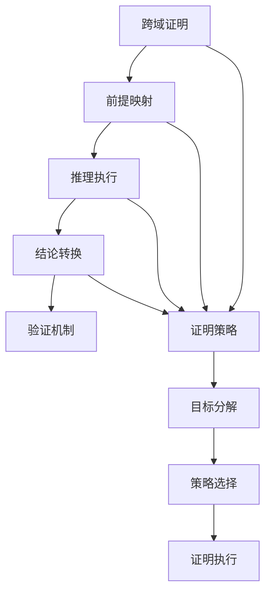

# 跨领域证明

## 目录

- [跨领域证明](#跨领域证明)
  - [目录](#目录)
  - [1. 理论基础](#1-理论基础)
    - [1.1 证明目标](#11-证明目标)
  - [2. 基本概念](#2-基本概念)
    - [2.1 证明框架](#21-证明框架)
    - [2.2 证明验证](#22-证明验证)
  - [3. 推理规则](#3-推理规则)
    - [3.1 跨域推理](#31-跨域推理)
    - [3.2 逻辑推理](#32-逻辑推理)
  - [4. 证明策略](#4-证明策略)
    - [4.1 目标分解](#41-目标分解)
    - [4.2 策略选择](#42-策略选择)
  - [5. 证明示例](#5-证明示例)
    - [5.1 哲学到数学的证明](#51-哲学到数学的证明)
    - [5.2 数学到软件的证明](#52-数学到软件的证明)
  - [6. 形式化表示](#6-形式化表示)
    - [6.1 证明结构图](#61-证明结构图)
    - [6.2 数学表示](#62-数学表示)
  - [7. 交叉引用](#7-交叉引用)
    - [7.1 相关理论](#71-相关理论)
    - [7.2 实践应用](#72-实践应用)
  - [8. 导航](#8-导航)

## 1. 理论基础

跨领域证明研究如何在不同理论分支间进行形式化推理和证明，建立统一的证明框架，实现跨理论的形式化验证。

### 1.1 证明目标

- 跨理论一致性证明
- 理论间转换正确性证明
- 综合性质验证
- 系统级正确性保证

## 2. 基本概念

### 2.1 证明框架

```rust
pub struct CrossDomainProof {
    pub premises: Vec<Premise>,
    pub inference_rules: Vec<InferenceRule>,
    pub conclusion: Conclusion,
    pub proof_steps: Vec<ProofStep>,
}

pub struct Premise {
    pub theory: Theory,
    pub statement: Statement,
    pub validity: ValidityProof,
}

pub struct InferenceRule {
    pub name: String,
    pub applicability: ApplicabilityCondition,
    pub transformation: ProofTransformation,
    pub soundness_proof: SoundnessProof,
}

pub struct ProofStep {
    pub step_number: u32,
    pub rule_applied: String,
    pub input_statements: Vec<Statement>,
    pub output_statement: Statement,
    pub justification: String,
}
```

### 2.2 证明验证

```rust
pub struct ProofVerifier {
    pub syntax_checker: SyntaxChecker,
    pub semantic_checker: SemanticChecker,
    pub consistency_checker: ConsistencyChecker,
}

impl ProofVerifier {
    pub fn verify_proof(&self, proof: &CrossDomainProof) -> Result<VerificationResult, Error> {
        // 1. 语法检查
        let syntax_valid = self.syntax_checker.check(proof)?;
        
        // 2. 语义验证
        let semantic_valid = self.semantic_checker.check(proof)?;
        
        // 3. 一致性检查
        let consistent = self.consistency_checker.check(proof)?;
        
        Ok(VerificationResult {
            is_valid: syntax_valid && semantic_valid && consistent,
            details: vec![syntax_valid, semantic_valid, consistent],
        })
    }
}
```

## 3. 推理规则

### 3.1 跨域推理

```rust
pub struct CrossDomainInference {
    pub domain_mappings: HashMap<Theory, DomainMapping>,
    pub translation_rules: Vec<TranslationRule>,
}

impl CrossDomainInference {
    pub fn infer(&self, premises: &[Premise], target_theory: &Theory) -> Result<Conclusion, Error> {
        // 1. 理论映射
        let mapped_premises = self.map_premises(premises, target_theory)?;
        
        // 2. 推理执行
        let intermediate_conclusion = self.execute_inference(&mapped_premises)?;
        
        // 3. 结果转换
        let final_conclusion = self.translate_conclusion(&intermediate_conclusion, target_theory)?;
        
        Ok(final_conclusion)
    }
    
    fn map_premises(&self, premises: &[Premise], target_theory: &Theory) -> Result<Vec<Premise>, Error> {
        let mut mapped_premises = Vec::new();
        
        for premise in premises {
            let mapping = self.domain_mappings.get(&premise.theory)
                .ok_or(Error::MappingNotFound)?;
            
            let mapped_statement = self.translate_statement(&premise.statement, mapping)?;
            
            mapped_premises.push(Premise {
                theory: target_theory.clone(),
                statement: mapped_statement,
                validity: premise.validity.clone(),
            });
        }
        
        Ok(mapped_premises)
    }
}
```

### 3.2 逻辑推理

```rust
pub struct LogicalInference {
    pub logical_rules: Vec<LogicalRule>,
    pub proof_strategies: Vec<ProofStrategy>,
}

impl LogicalInference {
    pub fn apply_rule(&self, rule: &LogicalRule, statements: &[Statement]) -> Result<Statement, Error> {
        // 1. 检查规则适用性
        if !self.is_applicable(rule, statements)? {
            return Err(Error::RuleNotApplicable);
        }
        
        // 2. 应用规则转换
        let result = rule.transformation.apply(statements)?;
        
        // 3. 验证结果
        self.validate_result(&result, rule)?;
        
        Ok(result)
    }
    
    fn is_applicable(&self, rule: &LogicalRule, statements: &[Statement]) -> Result<bool, Error> {
        // 检查规则的前置条件
        for condition in &rule.applicability {
            if !condition.check(statements)? {
                return Ok(false);
            }
        }
        Ok(true)
    }
}
```

## 4. 证明策略

### 4.1 目标分解

```rust
pub struct GoalDecomposer {
    pub decomposition_rules: Vec<DecompositionRule>,
    pub subgoal_generator: SubgoalGenerator,
}

impl GoalDecomposer {
    pub fn decompose_goal(&self, goal: &Goal) -> Result<Vec<Subgoal>, Error> {
        // 1. 分析目标结构
        let goal_structure = self.analyze_goal_structure(goal)?;
        
        // 2. 选择分解策略
        let strategy = self.select_decomposition_strategy(&goal_structure)?;
        
        // 3. 生成子目标
        let subgoals = self.subgoal_generator.generate_subgoals(goal, &strategy)?;
        
        // 4. 验证分解正确性
        self.verify_decomposition(goal, &subgoals)?;
        
        Ok(subgoals)
    }
}
```

### 4.2 策略选择

```rust
pub struct StrategySelector {
    pub strategies: Vec<ProofStrategy>,
    pub selection_criteria: Vec<SelectionCriterion>,
}

impl StrategySelector {
    pub fn select_strategy(&self, goal: &Goal, context: &ProofContext) -> Result<ProofStrategy, Error> {
        let mut best_strategy = None;
        let mut best_score = 0.0;
        
        for strategy in &self.strategies {
            // 1. 计算策略适用性
            let applicability = self.calculate_applicability(strategy, goal)?;
            
            // 2. 评估策略效率
            let efficiency = self.evaluate_efficiency(strategy, context)?;
            
            // 3. 综合评分
            let score = self.combine_scores(applicability, efficiency)?;
            
            if score > best_score {
                best_score = score;
                best_strategy = Some(strategy.clone());
            }
        }
        
        best_strategy.ok_or(Error::NoSuitableStrategy)
    }
}
```

## 5. 证明示例

### 5.1 哲学到数学的证明

```rust
pub struct PhilosophyToMathProof {
    pub ontology_mapper: OntologyMapper,
    pub logic_translator: LogicTranslator,
}

impl PhilosophyToMathProof {
    pub fn prove_existence(&self, philosophical_statement: &Statement) -> Result<MathTheorem, Error> {
        // 1. 哲学陈述解析
        let ontology_concept = self.parse_ontology_concept(philosophical_statement)?;
        
        // 2. 映射到数学概念
        let math_concept = self.ontology_mapper.map_to_math(ontology_concept)?;
        
        // 3. 构建数学证明
        let math_proof = self.construct_math_proof(math_concept)?;
        
        // 4. 验证证明正确性
        self.verify_math_proof(&math_proof)?;
        
        Ok(math_proof)
    }
}
```

### 5.2 数学到软件的证明

```rust
pub struct MathToSoftwareProof {
    pub algebra_mapper: AlgebraMapper,
    pub invariant_translator: InvariantTranslator,
}

impl MathToSoftwareProof {
    pub fn prove_invariant(&self, math_theorem: &MathTheorem) -> Result<SoftwareInvariant, Error> {
        // 1. 数学定理分析
        let mathematical_structure = self.analyze_math_structure(math_theorem)?;
        
        // 2. 映射到软件结构
        let software_structure = self.algebra_mapper.map_to_software(mathematical_structure)?;
        
        // 3. 生成软件不变量
        let invariant = self.invariant_translator.translate_invariant(software_structure)?;
        
        // 4. 验证不变量正确性
        self.verify_invariant(&invariant)?;
        
        Ok(invariant)
    }
}
```

## 6. 形式化表示

### 6.1 证明结构图



### 6.2 数学表示

跨域证明可形式化为 $P = (P_1, P_2, \ldots, P_n) \vdash C$，其中：

- $P_i$ 为各域前提
- $C$ 为跨域结论

证明正确性：
$$\forall i: \text{Valid}(P_i) \land \text{Consistent}(P_1, P_2, \ldots, P_n) \Rightarrow \text{Valid}(C)$$

## 7. 交叉引用

### 7.1 相关理论

- [理论统一与整合总论](00-理论统一与整合总论.md)
- [理论映射关系](01-理论映射关系.md)
- [统一符号体系](02-统一符号体系.md)

### 7.2 实践应用

- [应用框架](04-应用框架.md)
- [实践应用开发](../08-实践应用开发/README.md)

## 8. 导航

- [返回理论统一与整合总论](00-理论统一与整合总论.md)
- [理论映射关系](01-理论映射关系.md)
- [统一符号体系](02-统一符号体系.md)
- [应用框架](04-应用框架.md)
