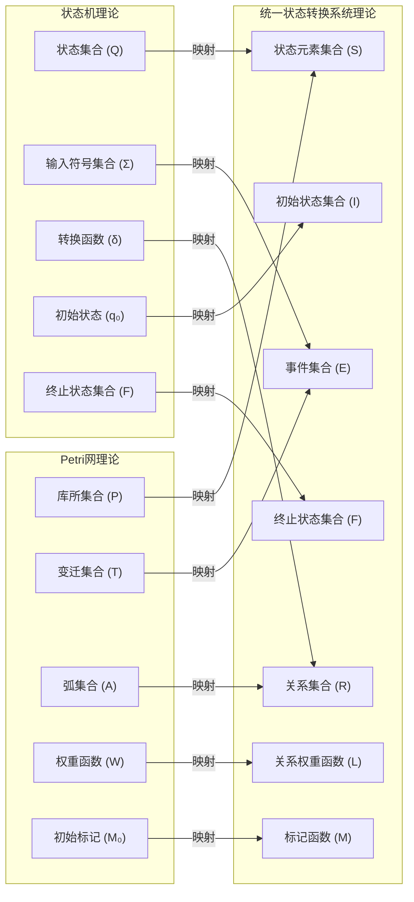

# 形式化架构理论概念图谱-v68

## 1. 概念图谱总览

形式化架构理论概念图谱v68版本在v67基础上更新了理论合并进展和重点研究方向，展示了理论体系的主要概念及其关系，为理解整个理论体系提供直观的可视化表示。

```mermaid
graph TD
    %% 顶层理论体系
    FA[形式化架构理论] --> PHI[哲学基础理论]
    FA --> MT[数学理论体系]
    FA --> FLT[形式语言理论体系]
    FA --> SAT[软件架构理论体系]
    FA --> PLT[编程语言理论体系]
    FA --> FMT[形式模型理论体系]
    
    %% 统一理论
    FA --> UT[统一理论]
    UT --> USTS[统一状态转换系统]
    UT --> UMS[统一模块化系统]
    UT --> UFPF[统一形式化证明框架]
    UT --> CVTF[跨领域验证技术]
    
    %% 统一状态转换系统
    USTS --> S1[状态元素集合]
    USTS --> E1[事件集合]
    USTS --> R1[关系集合]
    USTS --> M1[标记函数]
    USTS --> I1[初始状态集合]
    USTS --> F1[终止状态集合]
    USTS --> L1[关系权重函数]
    
    %% 统一模块化系统
    UMS --> S2[模块状态空间]
    UMS --> B2[模块行为模型]
    UMS --> P2[提供功能集合]
    UMS --> R2[依赖功能集合]
    UMS --> I2[模块实现细节]
    UMS --> C2[模块交互契约]
    UMS --> V2[模块版本信息]
    
    %% 哲学基础理论
    PHI --> LOG[逻辑学]
    PHI --> CS[认知科学]
    PHI --> SP[科学哲学]
    
    %% 数学理论体系
    MT --> ST[集合论]
    MT --> CT[范畴论]
    MT --> GT[图论]
    MT --> ALG[代数学]
    
    %% 形式语言理论体系
    FLT --> FG[形式语法]
    FLT --> FS[形式语义]
    FLT --> AT[自动机理论]
    
    %% 软件架构理论体系
    SAT --> LA[分层架构]
    SAT --> MS[微服务架构]
    SAT --> CN[云原生架构]
    SAT --> WA[WebAssembly架构]
    SAT --> CT2[组件理论]
    SAT --> IT[接口理论]
    
    %% 编程语言理论体系
    PLT --> SYN[语法理论]
    PLT --> SEM[语义理论]
    PLT --> TT[类型理论]
    PLT --> CPT[编译理论]
    
    %% 形式模型理论体系
    FMT --> SM[状态机理论]
    FMT --> PN[Petri网理论]
    FMT --> PA[进程代数]
    FMT --> TL[时序逻辑]
    
    %% 工具开发
    FA --> TOOLS[工具开发]
    TOOLS --> KGV[知识图谱可视化工具]
    TOOLS --> TNS[理论导航系统]
    TOOLS --> AVT[自动化验证工具]
    TOOLS --> TI[工具整合]
    
    %% 应用拓展
    FA --> APP[应用拓展]
    APP --> IAM[智能化模块研究]
    APP --> EMT[新兴模块类型研究]
    APP --> CDA[跨领域应用研究]
    
    %% 智能化模块研究
    IAM --> AM[自适应模块]
    IAM --> AI[AI增强模块]
    IAM --> IDM[智能决策模块]
    
    %% 新兴模块类型研究
    EMT --> QM[量子模块]
    EMT --> EM[边缘模块]
    EMT --> BM[区块链模块]
    
    %% 跨领域应用研究
    CDA --> EA[企业应用]
    CDA --> CC[云计算]
    CDA --> IOT[物联网]
    CDA --> AI2[人工智能]
    
    style FA fill:#f9f,stroke:#333,stroke-width:2px
    style UT fill:#bbf,stroke:#333,stroke-width:2px
    style TOOLS fill:#bfb,stroke:#333,stroke-width:2px
    style APP fill:#fbb,stroke:#333,stroke-width:2px
    style USTS fill:#bbf,stroke:#333,stroke-width:2px,stroke-dasharray: 5 5
    style UMS fill:#bbf,stroke:#333,stroke-width:2px,stroke-dasharray: 5 5
```

## 2. 统一状态转换系统增强概念图谱

统一状态转换系统 (USTS) 是形式化架构理论的核心统一理论之一，v68版本对状态机理论和Petri网理论的统一进行了深化和增强。

```mermaid
graph TD
    USTS[统一状态转换系统] --> Def[形式化定义]
    Def --> S[状态元素集合S]
    Def --> E[事件集合E]
    Def --> R[关系集合R]
    Def --> M[标记函数M]
    Def --> I[初始状态集合I]
    Def --> F[终止状态集合F]
    Def --> L[关系权重函数L]
    
    USTS --> SM[状态机映射]
    SM --> SM_S[状态→状态元素]
    SM --> SM_E[输入符号→事件]
    SM --> SM_R[转换函数→关系]
    SM --> SM_M[状态标记→0/1]
    SM --> SM_I[初始状态→初始集合]
    SM --> SM_F[接受状态→终止集合]
    
    USTS --> PN[Petri网映射]
    PN --> PN_S[库所→状态元素]
    PN --> PN_E[变迁→事件]
    PN --> PN_R[弧→关系]
    PN --> PN_M[标记→标记函数]
    PN --> PN_I[初始标记→初始集合]
    PN --> PN_L[弧权重→关系权重]
    
    USTS --> SEM[语义]
    SEM --> ES[执行语义]
    SEM --> CS[并发语义]
    SEM --> IS[交错语义]
    SEM --> TS[时间语义]
    
    USTS --> VER[验证方法]
    VER --> RA[可达性分析]
    VER --> IA[不变量分析]
    VER --> TP[时序性质验证]
    VER --> SA[结构分析]
    VER --> PA[性能分析]
    
    USTS --> CASE[应用案例]
    CASE --> CP[通信协议]
    CASE --> WF[工作流系统]
    CASE --> DS[分布式系统]
    CASE --> RT[实时系统]
    
    style USTS fill:#bbf,stroke:#333,stroke-width:2px
    style Def fill:#ddf,stroke:#333,stroke-width:1px
    style SM fill:#fdf,stroke:#333,stroke-width:1px
    style PN fill:#fdf,stroke:#333,stroke-width:1px
    style SEM fill:#dff,stroke:#333,stroke-width:1px
    style VER fill:#dff,stroke:#333,stroke-width:1px
    style CASE fill:#ffd,stroke:#333,stroke-width:1px
```

## 3. 统一模块化系统增强概念图谱

统一模块化系统 (UMS) 是形式化架构理论的另一个核心统一理论，v68版本对组件理论和接口理论的统一进行了深化和增强。

```mermaid
graph TD
    UMS[统一模块化系统] --> Def[形式化定义]
    Def --> S[状态空间S]
    Def --> B[行为模型B]
    Def --> P[提供功能集合P]
    Def --> R[依赖功能集合R]
    Def --> I[实现细节I]
    Def --> C[交互契约C]
    Def --> V[版本信息V]
    
    UMS --> CM[组件映射]
    CM --> CM_S[组件状态→状态空间]
    CM --> CM_B[组件行为→行为模型]
    CM --> CM_P[组件功能→提供功能]
    CM --> CM_R[组件依赖→依赖功能]
    CM --> CM_I[组件实现→实现细节]
    
    UMS --> IM[接口映射]
    IM --> IM_S[接口状态→契约状态]
    IM --> IM_P[接口签名→提供功能]
    IM --> IM_C[接口契约→交互契约]
    IM --> IM_V[接口版本→版本信息]
    
    UMS --> SEM[语义]
    SEM --> IS[交互语义]
    SEM --> CS[合成语义]
    SEM --> COS[契约语义]
    SEM --> ES2[演化语义]
    
    UMS --> VER[验证方法]
    VER --> IC[接口兼容性]
    VER --> SR[组件替换性]
    VER --> SC[系统组合]
    VER --> SV[状态验证]
    VER --> BC[行为一致性]
    
    UMS --> TECH[实现技术]
    TECH --> OOP[面向对象]
    TECH --> FP[函数式]
    TECH --> MS2[微服务]
    TECH --> SOA[服务导向]
    
    style UMS fill:#bbf,stroke:#333,stroke-width:2px
    style Def fill:#ddf,stroke:#333,stroke-width:1px
    style CM fill:#fdf,stroke:#333,stroke-width:1px
    style IM fill:#fdf,stroke:#333,stroke-width:1px
    style SEM fill:#dff,stroke:#333,stroke-width:1px
    style VER fill:#dff,stroke:#333,stroke-width:1px
    style TECH fill:#ffd,stroke:#333,stroke-width:1px
```

## 4. 工具生态系统增强概念图谱

工具生态系统是形式化架构理论的重要支持系统，v68版本增强了工具间的协同工作能力。

```mermaid
graph TD
    TE[工具生态系统] --> KGV[知识图谱可视化工具]
    TE --> TNS[理论导航系统]
    TE --> AVT[自动化验证工具]
    TE --> INT[工具整合与协同]
    
    KGV --> KGV_COMP[核心组件]
    KGV_COMP --> UI1[用户界面]
    KGV_COMP --> VE[可视化引擎]
    KGV_COMP --> QE1[查询引擎]
    KGV_COMP --> DM1[数据模型]
    KGV_COMP --> DP[数据处理]
    
    KGV --> KGV_FEAT[高级功能]
    KGV_FEAT --> MD[Markdown解析]
    KGV_FEAT --> KE[知识提取]
    KGV_FEAT --> AQ[高级查询]
    KGV_FEAT --> NA[导航功能]
    KGV_FEAT --> GA[图谱分析]
    
    TNS --> TNS_COMP[核心组件]
    TNS_COMP --> UI2[用户界面层]
    TNS_COMP --> BL[业务逻辑层]
    TNS_COMP --> DL1[数据层]
    TNS_COMP --> IL1[集成层]
    
    TNS --> TNS_FEAT[导航功能]
    TNS_FEAT --> HN[层次导航]
    TNS_FEAT --> RN[关系导航]
    TNS_FEAT --> KS[关键词搜索]
    TNS_FEAT --> SS[语义搜索]
    TNS_FEAT --> RP[推荐功能]
    
    AVT --> AVT_COMP[核心组件]
    AVT_COMP --> UI3[用户界面层]
    AVT_COMP --> BL2[业务逻辑层]
    AVT_COMP --> DL2[数据层]
    AVT_COMP --> IL2[集成层]
    
    AVT --> AVT_FEAT[验证功能]
    AVT_FEAT --> PR[规则解析]
    AVT_FEAT --> VE2[验证执行]
    AVT_FEAT --> RA2[结果分析]
    AVT_FEAT --> RG[报告生成]
    
    INT --> INT_COMP[整合组件]
    INT_COMP --> UDM[统一数据模型]
    INT_COMP --> UUI[统一用户界面]
    INT_COMP --> ITC[工具间通信]
    INT_COMP --> IAP[集成认证与权限]
    
    INT --> INT_FEAT[协同功能]
    INT_FEAT --> DS[数据同步]
    INT_FEAT --> CN[上下文导航]
    INT_FEAT --> CR[跨工具推荐]
    INT_FEAT --> WF[工作流支持]
    
    style TE fill:#bfb,stroke:#333,stroke-width:2px
    style KGV fill:#dfd,stroke:#333,stroke-width:1px
    style TNS fill:#dfd,stroke:#333,stroke-width:1px
    style AVT fill:#dfd,stroke:#333,stroke-width:1px
    style INT fill:#dfd,stroke:#333,stroke-width:1px
    style KGV_FEAT fill:#efe,stroke:#333,stroke-width:1px
    style TNS_FEAT fill:#efe,stroke:#333,stroke-width:1px
    style AVT_FEAT fill:#efe,stroke:#333,stroke-width:1px
    style INT_FEAT fill:#efe,stroke:#333,stroke-width:1px
```

## 5. 智能化模块概念图谱

智能化模块是形式化架构理论应用拓展的重要方向，v68版本深化了智能化模块的研究。

```mermaid
graph TD
    IM[智能化模块] --> Types[模块类型]
    Types --> AM[自适应模块]
    Types --> AIM[AI增强模块]
    Types --> IDM[智能决策模块]
    
    AM --> AM_DEF[形式化定义]
    AM_DEF --> AM_S[状态空间S]
    AM_DEF --> AM_I[输入空间I]
    AM_DEF --> AM_O[输出空间O]
    AM_DEF --> AM_A[适应性规则集A]
    AM_DEF --> AM_L[学习机制L]
    AM_DEF --> AM_T[触发条件集T]
    
    AM --> AM_FEAT[关键特性]
    AM_FEAT --> SR[自我调整]
    AM_FEAT --> EL[环境学习]
    AM_FEAT --> PE[性能演化]
    AM_FEAT --> FL[故障自愈]
    
    AIM --> AIM_ARCH[架构层次]
    AIM_ARCH --> BFL[基础功能层]
    AIM_ARCH --> AIL[AI推理层]
    AIM_ARCH --> KRL[知识表示层]
    AIM_ARCH --> LAL[学习适应层]
    AIM_ARCH --> IFL[接口层]
    
    AIM --> AIM_CAP[AI能力]
    AIM_CAP --> PR2[预测能力]
    AIM_CAP --> RE[推理能力]
    AIM_CAP --> OP[优化能力]
    AIM_CAP --> CO[协作能力]
    
    IDM --> IDM_COMP[核心组件]
    IDM_COMP --> KM[知识模型]
    IDM_COMP --> RM[推理模型]
    IDM_COMP --> DM[决策模型]
    IDM_COMP --> FM[反馈模型]
    
    IDM --> IDM_TECH[决策技术]
    IDM_TECH --> RL[强化学习]
    IDM_TECH --> BB[贝叶斯推理]
    IDM_TECH --> MO[多目标优化]
    IDM_TECH --> FR[模糊规则]
    
    IM --> APP[应用领域]
    APP --> SelfAdapt[自适应系统]
    APP --> ContLearn[持续学习系统]
    APP --> IntControl[智能控制系统]
    APP --> AugArch[增强型架构]
    
    style IM fill:#fbf,stroke:#333,stroke-width:2px
    style Types fill:#ddf,stroke:#333,stroke-width:1px
    style AM fill:#dff,stroke:#333,stroke-width:1px
    style AIM fill:#dff,stroke:#333,stroke-width:1px
    style IDM fill:#dff,stroke:#333,stroke-width:1px
    style APP fill:#ffd,stroke:#333,stroke-width:1px
    style AM_FEAT fill:#eef,stroke:#333,stroke-width:1px
    style AIM_CAP fill:#eef,stroke:#333,stroke-width:1px
    style IDM_TECH fill:#eef,stroke:#333,stroke-width:1px
```

## 6. 理论合并关系图谱

理论合并关系图谱展示了形式化架构理论中各个理论之间的合并关系和进展状态。

```mermaid
graph TD
    MT[理论合并] --> PC[已完成合并]
    MT --> OG[进行中合并]
    MT --> PL[计划中合并]
    
    PC --> ATRM[自动机理论相关文件合并]
    PC --> LCNM[分层架构与云原生架构理论合并]
    PC --> MWAM[微服务架构与WebAssembly架构理论合并]
    PC --> AWAM[架构评估与工作流架构理论合并]
    PC --> SLDM[语法理论与语言设计理论合并]
    PC --> SSGM[语义理论与语法理论合并]
    PC --> TTSM[类型理论与类型系统合并]
    PC --> CCTM[编译理论与编译器理论合并]
    
    OG --> SPMM[状态机与Petri网理论合并]
    SPMM --> USTS[统一状态转换系统]
    SPMM --> P1[当前进度: 75%]
    
    OG --> CITM[组件理论与接口理论合并]
    CITM --> UMS[统一模块化系统]
    CITM --> P2[当前进度: 55%]
    
    OG --> RTCTM[运行时理论与并发理论合并]
    RTCTM --> RTCS[运行时并发统一模型]
    RTCTM --> P3[当前进度: 25%]
    
    OG --> TMUSTM[理论映射关系与统一符号体系合并]
    TMUSTM --> TMUS[理论统一表示框架]
    TMUSTM --> P4[当前进度: 15%]
    
    PL --> FMVTM[形式模型与验证技术合并]
    PL --> TLPAM[时序逻辑与进程代数合并]
    PL --> SRBTM[语义理论与行为理论合并]
    
    style MT fill:#f9f,stroke:#333,stroke-width:2px
    style PC fill:#ddf,stroke:#333,stroke-width:1px
    style OG fill:#fdf,stroke:#333,stroke-width:1px
    style PL fill:#dff,stroke:#333,stroke-width:1px
    style SPMM fill:#fbf,stroke:#333,stroke-width:1px
    style CITM fill:#fbf,stroke:#333,stroke-width:1px
    style RTCTM fill:#fbf,stroke:#333,stroke-width:1px
    style TMUSTM fill:#fbf,stroke:#333,stroke-width:1px
    style USTS fill:#bbf,stroke:#333,stroke-width:1px
    style UMS fill:#bbf,stroke:#333,stroke-width:1px
    style P1 fill:#efe,stroke:#333,stroke-width:1px
    style P2 fill:#efe,stroke:#333,stroke-width:1px
    style P3 fill:#fed,stroke:#333,stroke-width:1px
    style P4 fill:#fed,stroke:#333,stroke-width:1px
```

## 7. 工作计划进度图谱

工作计划进度图谱展示了形式化架构理论项目各个工作方向的计划和进度。

```mermaid
graph TD
    WP[工作计划] --> TH[理论深化研究]
    WP --> TD[工具开发]
    WP --> TM[理论合并]
    WP --> AE[应用拓展]
    WP --> DI[文档完善]
    
    TH --> TH1[统一形式化证明框架研究]
    TH1 --> TH1P[进度: 45%]
    TH --> TH2[跨领域验证技术研究]
    TH2 --> TH2P[进度: 45%]
    TH --> TH3[理论扩展规划]
    TH3 --> TH3P[进度: 40%]
    
    TD --> TD1[知识图谱可视化工具完善]
    TD1 --> TD1P[进度: 60%]
    TD --> TD2[理论导航系统开发]
    TD2 --> TD2P[进度: 45%]
    TD --> TD3[自动化验证工具开发]
    TD3 --> TD3P[进度: 35%]
    
    TM --> TM1[状态机与Petri网理论合并]
    TM1 --> TM1P[进度: 75%]
    TM --> TM2[组件理论与接口理论合并]
    TM2 --> TM2P[进度: 55%]
    TM --> TM3[运行时理论与并发理论合并]
    TM3 --> TM3P[进度: 25%]
    TM --> TM4[理论映射关系与统一符号体系合并]
    TM4 --> TM4P[进度: 15%]
    
    AE --> AE1[智能化模块研究]
    AE1 --> AE1P[进度: 40%]
    AE --> AE2[新兴模块类型研究]
    AE2 --> AE2P[进度: 30%]
    AE --> AE3[跨领域应用研究]
    AE3 --> AE3P[进度: 25%]
    
    DI --> DI1[合并后文档完善]
    DI1 --> DI1P[进度: 50%]
    DI --> DI2[用户文档编写]
    DI2 --> DI2P[进度: 40%]
    DI --> DI3[教程和示例编写]
    DI3 --> DI3P[进度: 35%]
    
    style WP fill:#f9f,stroke:#333,stroke-width:2px
    style TH fill:#bbf,stroke:#333,stroke-width:1px
    style TD fill:#bfb,stroke:#333,stroke-width:1px
    style TM fill:#fbf,stroke:#333,stroke-width:1px
    style AE fill:#fbb,stroke:#333,stroke-width:1px
    style DI fill:#ffd,stroke:#333,stroke-width:1px
    style TM1P fill:#efe,stroke:#333,stroke-width:1px
    style TD1P fill:#efe,stroke:#333,stroke-width:1px
    style TM2P fill:#efe,stroke:#333,stroke-width:1px
    style DI1P fill:#efe,stroke:#333,stroke-width:1px
```

## 8. 总结

形式化架构理论概念图谱v68版本通过可视化方式展示了理论体系的最新进展和发展方向，包括统一状态转换系统和统一模块化系统的深化、工具生态系统的协同增强、智能化模块的研究深化以及理论合并的进度跟踪。这些图谱有助于理解形式化架构理论的整体框架和各部分之间的联系，为理论的学习、研究和应用提供直观的参考。

---

**版本**: v68  
**创建时间**: 2024年8月  
**状态**: 🔄 进行中  
**最后更新**: 2024年8月
