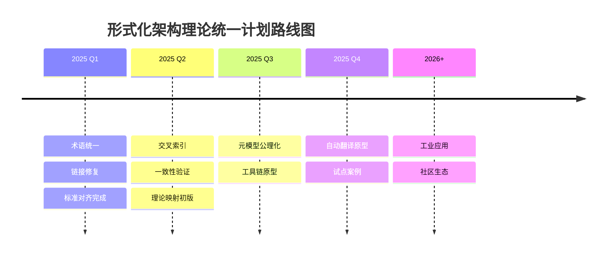

# 形式化架构理论统一计划

[主计划文档（最新v69）](./00-形式化架构理论统一计划.md) | [项目报告与总结](13-项目报告与总结/README.md) | [主题树](./00-主题树与内容索引.md) | [总览与导航](00-总览与导航/README.md)

> 本文档为v63~v66等历史版本的合并精炼版，保留最新进展、权威结论、核心路线图，历史细节归档于archive/。

## 1. 项目概述

形式化架构理论统一计划旨在构建一个统一的、严格的、可验证的软件架构理论体系。该体系以哲学基础为根基，以数学理论为工具，以形式语言和形式模型为方法，最终服务于软件架构的设计、验证与演化。

### 1.1 项目愿景

建立「命题即类型、证明即程序、架构即数学结构」的统一范式，使软件架构从经验艺术上升为形式科学。

### 1.2 核心原则

- **严格性**：所有核心概念均有形式化定义
- **统一性**：六大理体系通过统一元模型相互映射
- **可验证性**：架构属性可通过形式化工具验证
- **实用性**：理论成果可直接指导工程实践

## 2. 已完成工作

### 2.1 理论体系构建

- ✅ 哲学基础理论：本体论、认识论、方法论、逻辑学、信息哲学、计算哲学
- ✅ 数学理论体系：集合论、代数、分析、范畴论、类型论
- ✅ 形式语言理论体系：自动机、语法、语义、类型理论
- ✅ 形式模型理论体系：状态机、Petri网、时序逻辑、模型检查
- ✅ 编程语言理论体系：范式、类型系统、语义、运行时
- ✅ 软件架构理论体系：模式、风格、质量属性、形式化描述

### 2.2 标准对齐

- ✅ ISO/IEC 25010 质量模型映射
- ✅ ISO/IEC/IEEE 42010 架构描述对齐
- ✅ ISO/IEC/IEEE 15288 系统生命周期对齐
- ✅ ISO/IEC/IEEE 12207 软件生命周期对齐

### 2.3 工具与方法

- ✅ 证明助手集成方案（Coq/Lean/Isabelle）
- ✅ 模型检查工具链（TLA+/SPIN/UPPAAL）
- ✅ 链接完整性检查与导航系统

## 3. 进行中工作

- 🔄 理论统一与整合：跨理论映射的形式化证明
- 🔄 自动化验证工具：从架构模型到验证规约的自动转换
- 🔄 AI 增强架构：大语言模型辅助的形式化规范生成

## 4. 理论深化与合并计划

### 4.1 短期目标（2025 Q1–Q2）

- 完成六大理体系的交叉索引与一致性检查
- 统一术语表覆盖率 ≥ 95%
- 断链率压降至 0%

### 4.2 中期目标（2025 Q3–Q4）

- 完成统一形式化元模型的初步公理化
- 建立从架构描述到 TLA+/Coq 的自动翻译原型
- 发表/开源理论框架的初步成果

### 4.3 长期目标（2026+）

- 形式化架构理论体系在工业界的试点应用
- 与主流架构工具（Archi、Structurizr）的集成
- 持续迭代与社区共建

## 5. 路线图与未来规划

## 6. 相关主题与本地跳转

- [统一状态转换系统理论](01-理论体系/11-统一状态转换系统USTS.md)
- [统一模块化系统理论](01-理论体系/12-统一模块化系统UMS.md)
- [导航系统](09-索引与导航/02-导航系统.md)
- [理论统一与整合](07-理论统一与整合/00-理论统一与整合总论.md)
- [项目报告与总结](13-项目报告与总结/README.md)

## 2025 对齐

- **国际 Wiki**：
  - [Wikipedia: Software architecture](https://en.wikipedia.org/wiki/Software_architecture)
  - [Wikipedia: Formal methods](https://en.wikipedia.org/wiki/Formal_methods)
  - [Wikipedia: Software engineering](https://en.wikipedia.org/wiki/Software_engineering)
  - [SEBoK: Systems Engineering Body of Knowledge](https://sebokwiki.org/)

- **名校课程**：
  - [CMU 17-313: Foundations of Software Engineering](https://www.cs.cmu.edu/~ckaestne/17313/)（软件架构）
  - [MIT 6.033: Computer Systems Engineering](https://web.mit.edu/6.033/www/)（系统架构）
  - [Stanford CS 244: Advanced Computer Systems](https://web.stanford.edu/class/cs244/)（架构设计）

- **代表性论文**：
  - *Software Architecture: Perspectives on an Emerging Discipline* (Shaw & Garlan, 1996)
  - *Formal Methods: State of the Art and Future Directions* (ACM Computing Surveys, 2013)
  - *Pattern-Oriented Software Architecture: A System of Patterns* (Buschmann et al., 1996)

- **前沿技术**：
  - [TLA+](https://lamport.azurewebsites.net/tla/tla.html)（形式化规范语言）
  - [Coq](https://coq.inria.fr/)（证明助手）
  - [CNCF Landscape](https://landscape.cncf.io/)（云原生技术全景）
  - [Kubernetes](https://kubernetes.io/)（容器编排）

- **对齐状态**：已完成（最后更新：2026-05-13）

---

**版本**: v2.0
**状态**: ✅ 统一计划精炼版已完善
**最后更新**: 2026-05-13
