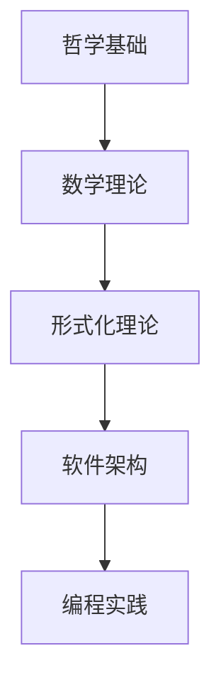
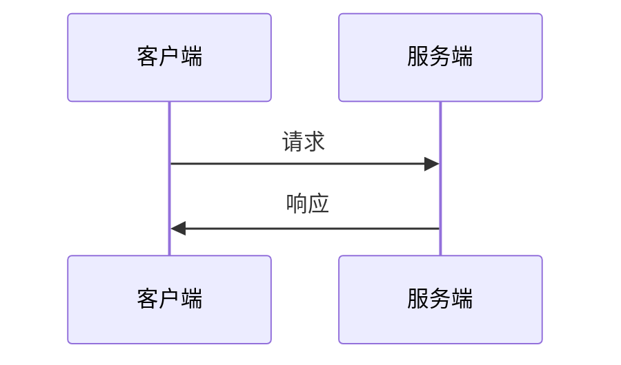

# 形式化架构分析总体框架 v10

## 1. 分析概述

### 1.1 任务目标

基于 `/Matter` 目录下的所有内容，构建一个符合数学LaTeX规范的形式化分析体系，涵盖：

1. **哲学基础理论** - 本体论、认识论、伦理学、逻辑学
2. **数学理论体系** - 范畴论、形式语言理论、数学基础
3. **形式化理论基础** - 类型理论、Petri网、控制论、分布式系统
4. **软件架构理论** - 微服务、组件化、系统设计
5. **编程语言理论** - 形式语义、编译器、运行时系统

### 1.2 核心原则

- **形式化规范**: 所有数学表达式使用LaTeX标签
- **层次化结构**: 严格的序号树形目录结构
- **内容一致性**: 概念定义、符号使用、引用关系统一
- **学术标准**: 符合数学和计算机科学学术规范
- **多表征方式**: 文字、公式、图表、代码等多种表达

## 2. 理论体系架构

### 2.1 哲学基础层

```latex
\text{哲学基础} = \begin{cases}
\text{本体论} & \text{存在性、实体性、信息性} \\
\text{认识论} & \text{知识论、真理理论、确证理论} \\
\text{伦理学} & \text{规范伦理学、元伦理学、应用伦理学} \\
\text{逻辑学} & \text{形式逻辑、哲学逻辑、非经典逻辑}
\end{cases}
```

### 2.2 数学理论层

```latex
\text{数学理论} = \begin{cases}
\text{范畴论} & \text{对象、态射、函子、自然变换} \\
\text{形式语言理论} & \text{自动机、语法分析、语言识别} \\
\text{数学基础} & \text{公理系统、证明理论、模型论}
\end{cases}
```

### 2.3 形式化理论层

```latex
\text{形式化理论} = \begin{cases}
\text{类型理论} & \text{基础类型、线性类型、仿射类型、时态类型} \\
\text{系统建模} & \text{Petri网、控制论、时态逻辑控制} \\
\text{分布式理论} & \text{一致性协议、容错机制、共识算法}
\end{cases}
```

### 2.4 软件架构层

```latex
\text{软件架构} = \begin{cases}
\text{微服务架构} & \text{服务分解、通信协议、数据一致性} \\
\text{组件化设计} & \text{组件接口、依赖管理、组合模式} \\
\text{系统设计} & \text{架构模式、设计原则、质量属性}
\end{cases}
```

## 3. 目录结构设计

### 3.1 主目录结构

```
Analysis/
├── 01-哲学基础理论/
│   ├── 01-本体论/
│   ├── 02-认识论/
│   ├── 03-伦理学/
│   └── 04-逻辑学/
├── 02-数学理论体系/
│   ├── 01-范畴论/
│   ├── 02-形式语言理论/
│   ├── 03-数学基础/
│   └── 04-应用数学/
├── 03-形式化理论基础/
│   ├── 01-类型理论/
│   ├── 02-系统建模/
│   ├── 03-分布式理论/
│   └── 04-控制理论/
├── 04-软件架构理论/
│   ├── 01-微服务架构/
│   ├── 02-组件化设计/
│   ├── 03-系统设计/
│   └── 04-架构模式/
├── 05-编程语言理论/
│   ├── 01-形式语义/
│   ├── 02-编译器理论/
│   ├── 03-运行时系统/
│   └── 04-类型系统/
└── 06-跨领域整合/
    ├── 01-理论整合/
    ├── 02-应用整合/
    └── 03-实践整合/
```

### 3.2 文件命名规范

- **主文件**: `README.md` - 目录总览和导航
- **理论文件**: `01-理论名称.md` - 核心理论内容
- **应用文件**: `02-应用名称.md` - 实际应用案例
- **证明文件**: `03-证明名称.md` - 形式化证明
- **代码文件**: `04-代码名称.md` - 实现代码

## 4. 内容形式化规范

### 4.1 数学表达式规范

**定义格式**:
```latex
\textbf{定义 1.1 (概念名称)}
概念的形式化定义：
$$\text{FormalDefinition} = \text{MathematicalExpression}$$
```

**定理格式**:
```latex
\textbf{定理 1.1 (定理名称)}
定理陈述：
$$\text{TheoremStatement}$$

\textbf{证明：} 证明过程...
```

**算法格式**:
```latex
\textbf{算法 1.1 (算法名称)}
算法描述：
\begin{algorithm}
\caption{算法名称}
\begin{algorithmic}
\STATE 步骤1
\STATE 步骤2
\RETURN 结果
\end{algorithmic}
\end{algorithm}
```

### 4.2 代码示例规范

**Rust代码**:
```rust
// 类型理论实现
pub trait Linear {
    fn consume(self) -> ();
    fn duplicate(&self) -> (Self, Self) where Self: Clone;
}
```

**Go代码**:
```go
// 分布式系统实现
type Consensus interface {
    Propose(value interface{}) error
    Decide() (interface{}, error)
}
```

### 4.3 图表规范

**关系图**:


**时序图**:


## 5. 核心理论映射

### 5.1 类型理论体系

| 理论类型 | 核心概念 | 数学表示 | 应用领域 |
|----------|----------|----------|----------|
| 基础类型 | 类型安全 | $\Gamma \vdash e : \tau$ | 编译器设计 |
| 线性类型 | 资源管理 | $\tau_1 \multimap \tau_2$ | 内存安全 |
| 仿射类型 | 所有权 | $\tau_1 \rightarrow \tau_2$ | 并发安全 |
| 时态类型 | 时间约束 | $\tau_1 \otimes \tau_2$ | 实时系统 |

### 5.2 系统建模理论

| 建模方法 | 核心概念 | 数学表示 | 应用领域 |
|----------|----------|----------|----------|
| Petri网 | 并发系统 | $N = (P, T, F, M_0)$ | 工作流建模 |
| 控制论 | 动态系统 | $\dot{x} = f(x, u)$ | 控制系统 |
| 时态逻辑 | 时间规范 | $\Box p \rightarrow \Diamond q$ | 实时验证 |
| 分布式 | 一致性 | $Consensus \subseteq Agreement$ | 分布式系统 |

### 5.3 软件架构理论

| 架构模式 | 核心概念 | 设计原则 | 应用场景 |
|----------|----------|----------|----------|
| 微服务 | 服务分解 | 单一职责 | 大型系统 |
| 组件化 | 接口抽象 | 依赖倒置 | 可复用设计 |
| 事件驱动 | 异步通信 | 松耦合 | 高并发系统 |
| 分层架构 | 关注分离 | 层次隔离 | 复杂系统 |

## 6. 形式化验证框架

### 6.1 类型安全验证

```latex
\text{类型安全} = \begin{cases}
\text{类型保持性} & \text{If } \Gamma \vdash e : \tau \text{ and } e \rightarrow e', \text{ then } \Gamma \vdash e' : \tau \\
\text{进展性} & \text{If } \emptyset \vdash e : \tau, \text{ then } e \text{ is a value or } \exists e' : e \rightarrow e'
\end{cases}
```

### 6.2 系统性质验证

```latex
\text{系统性质} = \begin{cases}
\text{安全性} & \text{No bad states are reachable} \\
\text{活性} & \text{Good states are eventually reached} \\
\text{公平性} & \text{All processes get fair treatment}
\end{cases}
```

### 6.3 一致性验证

```latex
\text{一致性} = \begin{cases}
\text{线性一致性} & \text{All operations appear atomic} \\
\text{顺序一致性} & \text{Operations appear in some total order} \\
\text{因果一致性} & \text{Causally related operations are ordered}
\end{cases}
```

## 7. 实现策略

### 7.1 内容处理策略

1. **内容分析**: 深度读取所有Matter目录文件
2. **主题分类**: 建立统一的主题分类体系
3. **内容去重**: 识别并合并重复内容
4. **形式化转换**: 规范化数学表达式和证明
5. **结构重构**: 建立规范的目录和文件结构

### 7.2 质量保证策略

1. **一致性检查**: 确保概念定义和符号使用一致
2. **完整性验证**: 确保所有内容都被处理
3. **正确性验证**: 验证数学表达式和证明的正确性
4. **可用性测试**: 测试目录结构和跳转链接

### 7.3 持续改进策略

1. **反馈收集**: 收集使用反馈和改进建议
2. **内容更新**: 根据新理论发展更新内容
3. **结构优化**: 根据使用情况优化目录结构
4. **工具改进**: 改进自动化处理工具

## 8. 预期成果

### 8.1 理论成果

1. **统一理论框架**: 整合哲学、数学、计算机科学的统一框架
2. **形式化体系**: 严格的形式化表述和证明体系
3. **应用指导**: 理论到实践的完整指导体系

### 8.2 实践成果

1. **规范化文档**: 符合学术标准的规范化文档
2. **可导航结构**: 完整的目录和跳转系统
3. **多表征内容**: 文字、公式、图表、代码的多种表征

### 8.3 教育成果

1. **学习路径**: 从基础到前沿的完整学习路径
2. **实践案例**: 丰富的实际应用案例
3. **工具支持**: 支持学习和研究的工具系统

## 9. 结论

本分析框架旨在构建一个完整、规范、实用的形式化架构分析体系，为软件工程、计算机科学和相关领域提供坚实的理论基础和实践指导。通过严格的学术标准和形式化方法，确保内容的准确性、一致性和可用性。 