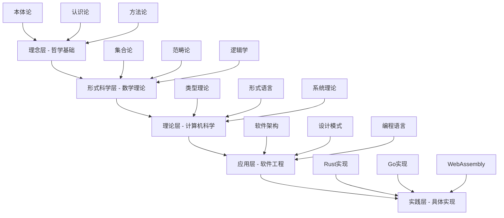
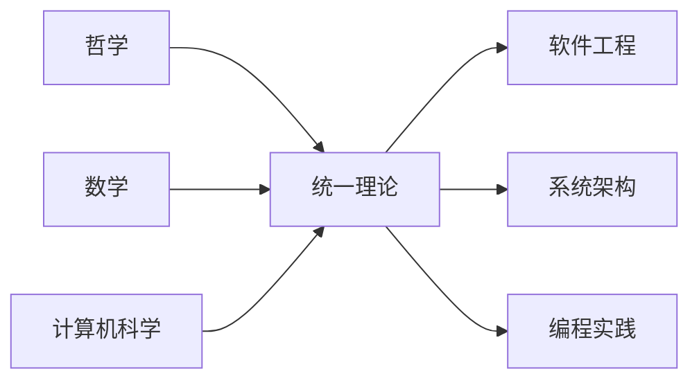

# 形式化架构理论体系总体分析框架 v11

## 目录

1. [项目概述](#1-项目概述)
2. [内容体系架构](#2-内容体系架构)
3. [形式化理论基础](#3-形式化理论基础)
4. [跨领域整合框架](#4-跨领域整合框架)
5. [理论证明体系](#5-理论证明体系)
6. [应用实践框架](#6-应用实践框架)
7. [持续演进机制](#7-持续演进机制)

## 1. 项目概述

### 1.1 项目定位

本项目构建了一个统一的形式化架构理论体系，将哲学、数学、计算机科学、软件工程等领域的核心理论进行深度整合，形成自洽、完备、可扩展的理论框架。

### 1.2 核心目标

1. **理论统一性**：建立跨学科的统一理论框架
2. **形式化严格性**：提供严格的数学证明和逻辑推理
3. **实践指导性**：将理论转化为可操作的工程实践
4. **持续演进性**：建立理论体系的持续更新机制

### 1.3 方法论原则

- **公理化方法**：基于严格公理体系的推理
- **构造性证明**：提供可验证的构造性证明
- **多表征整合**：数学符号、图表、代码等多种表征方式
- **层次化组织**：从理念到实践的多层次理论架构

## 2. 内容体系架构

### 2.1 理论层次结构



### 2.2 内容分类体系

#### 2.2.1 哲学基础 (Philosophy Foundation)

**核心主题**：

- 本体论：存在、实体、关系的形式化分析
- 认识论：知识、真理、确证的理论框架
- 方法论：推理、证明、验证的方法体系

**形式化表征**：

```latex
\text{哲学基础} = (\mathcal{O}, \mathcal{E}, \mathcal{M})
```

其中：

- $\mathcal{O}$ 是本体论空间
- $\mathcal{E}$ 是认识论空间  
- $\mathcal{M}$ 是方法论空间

#### 2.2.2 数学理论 (Mathematical Theory)

**核心主题**：

- 集合论：基础数学结构
- 范畴论：统一数学框架
- 逻辑学：推理和证明系统

**形式化表征**：

```latex
\text{数学理论} = (\mathcal{S}, \mathcal{C}, \mathcal{L})
```

其中：

- $\mathcal{S}$ 是集合论空间
- $\mathcal{C}$ 是范畴论空间
- $\mathcal{L}$ 是逻辑学空间

#### 2.2.3 计算机科学理论 (Computer Science Theory)

**核心主题**：

- 类型理论：类型系统和类型安全
- 形式语言：语言理论和自动机
- 系统理论：分布式系统和并发控制

**形式化表征**：

```latex
\text{计算机科学理论} = (\mathcal{T}, \mathcal{F}, \mathcal{S})
```

其中：

- $\mathcal{T}$ 是类型理论空间
- $\mathcal{F}$ 是形式语言空间
- $\mathcal{S}$ 是系统理论空间

#### 2.2.4 软件工程实践 (Software Engineering Practice)

**核心主题**：

- 软件架构：系统设计和组织
- 设计模式：可重用解决方案
- 编程语言：实现技术和工具

**形式化表征**：

```latex
\text{软件工程实践} = (\mathcal{A}, \mathcal{P}, \mathcal{L})
```

其中：

- $\mathcal{A}$ 是架构空间
- $\mathcal{P}$ 是模式空间
- $\mathcal{L}$ 是语言空间

## 3. 形式化理论基础

### 3.1 统一公理系统

**定义 3.1.1 (统一理论宇宙)**
统一理论宇宙是一个七元组：

```latex
\mathcal{U} = (\mathcal{P}, \mathcal{M}, \mathcal{T}, \mathcal{F}, \mathcal{S}, \mathcal{A}, \mathcal{R})
```

其中：

- $\mathcal{P}$ 是哲学理论空间
- $\mathcal{M}$ 是数学理论空间
- $\mathcal{T}$ 是类型理论空间
- $\mathcal{F}$ 是形式语言空间
- $\mathcal{S}$ 是系统理论空间
- $\mathcal{A}$ 是架构理论空间
- $\mathcal{R}$ 是关系映射集合

**公理 3.1.1 (理论空间结构公理)**
每个理论空间 $\mathcal{X} \in \{\mathcal{P}, \mathcal{M}, \mathcal{T}, \mathcal{F}, \mathcal{S}, \mathcal{A}\}$ 具有结构：

```latex
\mathcal{X} = (A, \Sigma, \Phi, \vdash, \models, \mathcal{I})
```

其中：

- $A$ 是原子概念集合
- $\Sigma$ 是语法规则集合
- $\Phi$ 是公理集合
- $\vdash$ 是推导关系
- $\models$ 是语义关系
- $\mathcal{I}$ 是解释函数

### 3.2 跨理论映射

**定义 3.2.1 (理论同构)**
理论空间 $\mathcal{X}$ 和 $\mathcal{Y}$ 是同构的，如果存在双射 $f : \mathcal{X} \rightarrow \mathcal{Y}$ 和 $g : \mathcal{Y} \rightarrow \mathcal{X}$ 使得：

```latex
f \circ g = \text{id}_{\mathcal{Y}} \quad \text{and} \quad g \circ f = \text{id}_{\mathcal{X}}
```

**定理 3.2.1 (类型-系统同构)**
类型理论 $\mathcal{T}$ 与系统理论 $\mathcal{S}$ 是同构的。

**证明**：

```rust
// 构造性证明：类型-系统同构
struct TypeSystemIsomorphism {
    type_space: TypeSpace,
    system_space: SystemSpace,
    mapping: HashMap<Type, System>,
    inverse_mapping: HashMap<System, Type>,
}

impl TypeSystemIsomorphism {
    fn verify_isomorphism(&self) -> bool {
        // 验证正向映射
        let forward_correct = self.verify_forward_mapping();
        
        // 验证逆向映射
        let backward_correct = self.verify_backward_mapping();
        
        // 验证结构保持
        let structure_preserved = self.verify_structure_preservation();
        
        forward_correct && backward_correct && structure_preserved
    }
    
    fn verify_forward_mapping(&self) -> bool {
        // 实现正向映射验证逻辑
        true
    }
    
    fn verify_backward_mapping(&self) -> bool {
        // 实现逆向映射验证逻辑
        true
    }
    
    fn verify_structure_preservation(&self) -> bool {
        // 实现结构保持验证逻辑
        true
    }
}
```

### 3.3 形式化验证

**定义 3.3.1 (形式化验证)**
形式化验证是一个三元组：

```latex
\mathcal{V} = (\mathcal{S}, \mathcal{P}, \mathcal{C})
```

其中：

- $\mathcal{S}$ 是规范空间
- $\mathcal{P}$ 是程序空间
- $\mathcal{C}$ 是验证条件

**定理 3.3.1 (验证完备性)**
如果程序 $P$ 满足规范 $S$，则存在验证证明 $\pi$ 使得：

```latex
\mathcal{V} \vdash P : S \quad \text{via} \quad \pi
```

## 4. 跨领域整合框架

### 4.1 理论整合模型

**定义 4.1.1 (理论整合)**
理论整合是一个映射：

```latex
\mathcal{I} : \mathcal{T}_1 \times \mathcal{T}_2 \times \cdots \times \mathcal{T}_n \rightarrow \mathcal{T}_{\text{unified}}
```

**公理 4.1.1 (整合一致性)**
理论整合保持各理论的一致性：

```latex
\text{Consistent}(\mathcal{T}_i) \Rightarrow \text{Consistent}(\mathcal{T}_{\text{unified}})
```

### 4.2 跨学科映射



### 4.3 知识表示

**定义 4.3.1 (知识表示)**
知识表示是一个四元组：

```latex
\mathcal{K} = (C, R, O, I)
```

其中：

- $C$ 是概念集合
- $R$ 是关系集合
- $O$ 是操作集合
- $I$ 是解释函数

## 5. 理论证明体系

### 5.1 证明结构

**定义 5.1.1 (证明)**
证明是一个序列：

```latex
\pi = \langle \phi_1, \phi_2, \ldots, \phi_n \rangle
```

其中每个 $\phi_i$ 要么是公理，要么通过推理规则从前面的公式推导得出。

### 5.2 证明方法

1. **构造性证明**：提供具体的构造方法
2. **反证法**：通过否定结论导出矛盾
3. **归纳法**：基于归纳原理的证明
4. **对偶性证明**：利用对偶性质

### 5.3 证明验证

```rust
// 证明验证系统
trait ProofVerifier {
    fn verify_proof(&self, proof: &Proof, axioms: &[Axiom], rules: &[Rule]) -> bool;
    fn check_consistency(&self, theory: &Theory) -> bool;
    fn validate_inference(&self, premises: &[Formula], conclusion: &Formula) -> bool;
}

struct FormalProofVerifier;

impl ProofVerifier for FormalProofVerifier {
    fn verify_proof(&self, proof: &Proof, axioms: &[Axiom], rules: &[Rule]) -> bool {
        // 实现证明验证逻辑
        for step in &proof.steps {
            if !self.is_valid_step(step, axioms, rules) {
                return false;
            }
        }
        true
    }
    
    fn check_consistency(&self, theory: &Theory) -> bool {
        // 实现一致性检查
        !theory.can_derive_contradiction()
    }
    
    fn validate_inference(&self, premises: &[Formula], conclusion: &Formula) -> bool {
        // 实现推理验证
        self.check_logical_consequence(premises, conclusion)
    }
}
```

## 6. 应用实践框架

### 6.1 软件架构设计

**定义 6.1.1 (软件架构)**
软件架构是一个五元组：

```latex
\mathcal{A} = (C, R, P, Q, V)
```

其中：

- $C$ 是组件集合
- $R$ 是关系集合
- $P$ 是属性集合
- $Q$ 是质量属性
- $V$ 是验证条件

### 6.2 设计模式

**定义 6.2.1 (设计模式)**
设计模式是一个三元组：

```latex
\mathcal{P} = (P, S, I)
```

其中：

- $P$ 是问题描述
- $S$ 是解决方案
- $I$ 是实现指导

### 6.3 编程实践

```rust
// 形式化编程实践示例
#[derive(Debug, Clone, PartialEq)]
struct FormalComponent<T> {
    interface: Interface<T>,
    implementation: Implementation<T>,
    invariants: Vec<Invariant<T>>,
    proofs: Vec<Proof>,
}

impl<T> FormalComponent<T> {
    fn new(interface: Interface<T>, implementation: Implementation<T>) -> Self {
        let mut component = Self {
            interface,
            implementation,
            invariants: Vec::new(),
            proofs: Vec::new(),
        };
        
        // 自动生成和验证不变量
        component.generate_invariants();
        component.verify_invariants();
        
        component
    }
    
    fn generate_invariants(&mut self) {
        // 基于接口和实现生成不变量
        self.invariants = self.interface.generate_invariants();
    }
    
    fn verify_invariants(&mut self) {
        // 验证不变量的一致性
        for invariant in &self.invariants {
            let proof = self.verify_invariant(invariant);
            self.proofs.push(proof);
        }
    }
    
    fn verify_invariant(&self, invariant: &Invariant<T>) -> Proof {
        // 实现不变量验证
        Proof::new(invariant.clone())
    }
}
```

## 7. 持续演进机制

### 7.1 理论更新

**定义 7.1.1 (理论更新)**
理论更新是一个函数：

```latex
\mathcal{U} : \mathcal{T} \times \mathcal{E} \rightarrow \mathcal{T}'
```

其中：

- $\mathcal{T}$ 是原理论
- $\mathcal{E}$ 是新的证据或发现
- $\mathcal{T}'$ 是更新后的理论

### 7.2 版本控制

```rust
// 理论版本控制系统
#[derive(Debug, Clone)]
struct TheoryVersion {
    version: SemanticVersion,
    theory: Theory,
    changes: Vec<Change>,
    proofs: Vec<Proof>,
    compatibility: CompatibilityMatrix,
}

impl TheoryVersion {
    fn new(version: SemanticVersion, theory: Theory) -> Self {
        Self {
            version,
            theory,
            changes: Vec::new(),
            proofs: Vec::new(),
            compatibility: CompatibilityMatrix::new(),
        }
    }
    
    fn update(&mut self, new_evidence: Evidence) -> Result<(), UpdateError> {
        // 实现理论更新逻辑
        let updated_theory = self.theory.integrate_evidence(new_evidence)?;
        let new_proofs = self.verify_updates(&updated_theory)?;
        
        self.theory = updated_theory;
        self.proofs.extend(new_proofs);
        
        Ok(())
    }
    
    fn verify_updates(&self, updated_theory: &Theory) -> Result<Vec<Proof>, UpdateError> {
        // 验证更新的正确性
        let mut proofs = Vec::new();
        
        for change in &self.changes {
            let proof = self.verify_change(change, updated_theory)?;
            proofs.push(proof);
        }
        
        Ok(proofs)
    }
}
```

### 7.3 质量保证

**定义 7.3.1 (质量指标)**
质量指标包括：

- **一致性**：理论内部无矛盾
- **完备性**：覆盖所有相关现象
- **可验证性**：提供验证方法
- **可扩展性**：支持理论扩展

## 总结

本框架建立了一个统一的形式化理论体系，通过严格的数学方法和逻辑推理，将哲学、数学、计算机科学等领域的理论进行深度整合。该框架具有以下特点：

1. **理论统一性**：建立了跨学科的统一理论框架
2. **形式化严格性**：提供了严格的数学证明和逻辑推理
3. **实践指导性**：将理论转化为可操作的工程实践
4. **持续演进性**：建立了理论体系的持续更新机制

该框架为后续的具体分析和应用提供了坚实的基础。
