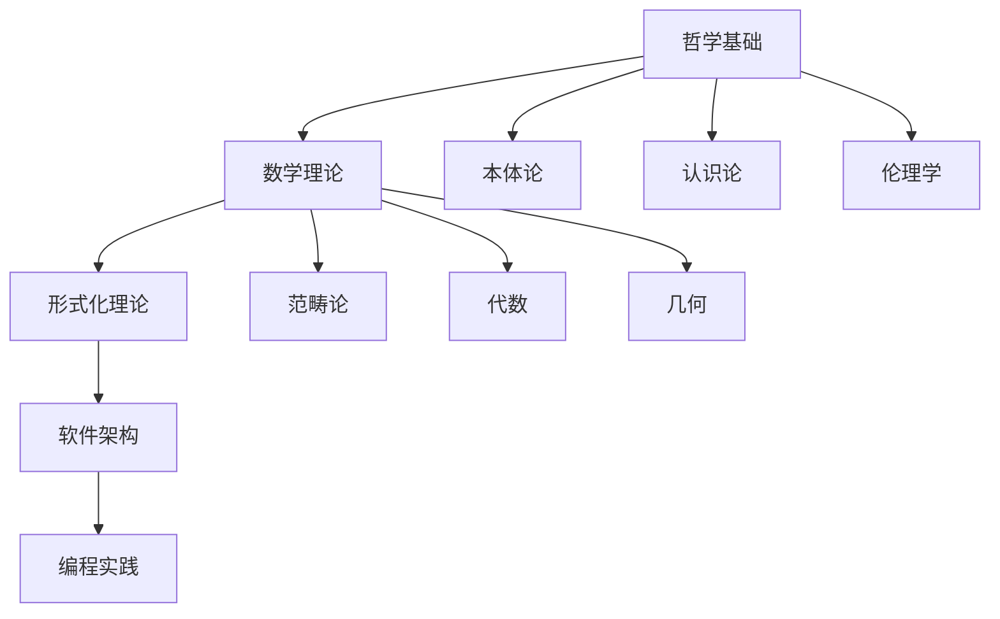

# 形式化架构理论体系 - 总体分析框架 v12

## 目录

1. [项目概述](#1-项目概述)
2. [分析框架](#2-分析框架)
3. [内容组织结构](#3-内容组织结构)
4. [形式化规范](#4-形式化规范)
5. [进度跟踪](#5-进度跟踪)
6. [质量保证](#6-质量保证)

## 1. 项目概述

### 1.1 项目目标

本项目旨在对 `/Matter` 目录下的所有内容进行深度分析，构建一个符合数学LaTeX规范的形式化理论体系，涵盖：

- **哲学基础理论**：本体论、认识论、伦理学、逻辑学、形而上学
- **数学理论体系**：范畴论、代数、几何、分析、数论、概率统计
- **形式化理论基础**：类型理论、系统理论、语言理论、控制理论
- **软件架构理论**：微服务、组件、设计模式、工作流、IoT
- **编程语言理论**：形式语义、类型系统、并发理论、分布式系统

### 1.2 核心原则

1. **形式化严格性**：所有理论必须具有严格的数学证明
2. **层次化组织**：从理念到理性到形式化论证的完整层次
3. **多表征方式**：图表、数学符号、代码示例等多种表达
4. **行业相关性**：专注于软件行业和软硬件相关领域
5. **技术前沿性**：结合最新的架构理论和实践

## 2. 分析框架

### 2.1 分析层次结构

```
理念层 (Philosophical Level)
├── 本体论基础
├── 认识论框架
├── 方法论原则
└── 价值论导向

理性层 (Rational Level)
├── 逻辑推理
├── 概念分析
├── 理论构建
└── 系统思维

形式化层 (Formal Level)
├── 数学公理化
├── 逻辑形式化
├── 类型系统
└── 证明理论

实践层 (Practical Level)
├── 算法设计
├── 系统实现
├── 架构模式
└── 工程实践
```

### 2.2 分析维度

1. **理论深度**：从基础概念到高级理论的完整体系
2. **应用广度**：从理论到实践的完整链条
3. **创新程度**：与现有理论的对比和创新点
4. **形式化程度**：数学符号和逻辑表达的严格性
5. **行业相关性**：与软件架构和工程实践的关联

## 3. 内容组织结构

### 3.1 目录结构规范

```
Analysis/
├── 00-总体分析框架-v12.md
├── 01-哲学基础理论/
│   ├── 01-本体论基础/
│   ├── 02-认识论框架/
│   ├── 03-伦理学理论/
│   ├── 04-逻辑学体系/
│   └── 05-形而上学/
├── 02-数学理论体系/
│   ├── 01-范畴论基础/
│   ├── 02-代数理论/
│   ├── 03-几何理论/
│   ├── 04-分析理论/
│   ├── 05-数论基础/
│   └── 06-概率统计/
├── 03-形式化理论基础/
│   ├── 01-类型理论/
│   ├── 02-系统理论/
│   ├── 03-语言理论/
│   ├── 04-控制理论/
│   └── 05-统一理论/
├── 04-软件架构理论/
│   ├── 01-微服务架构/
│   ├── 02-组件理论/
│   ├── 03-设计模式/
│   ├── 04-工作流理论/
│   └── 05-IoT架构/
├── 05-编程语言理论/
│   ├── 01-形式语义/
│   ├── 02-类型系统/
│   ├── 03-并发理论/
│   └── 04-分布式系统/
├── 06-跨领域整合/
│   ├── 01-理论整合/
│   ├── 02-应用整合/
│   └── 03-创新整合/
└── 07-索引与导航/
    ├── 01-主题索引/
    ├── 02-概念索引/
    └── 03-引用索引/
```

### 3.2 文件命名规范

- **主文件**：`01-主题名称.md`
- **子文件**：`01.01-子主题名称.md`
- **版本控制**：`文件名-v版本号.md`
- **索引文件**：`索引-主题名称.md`

### 3.3 内容结构规范

每个文档必须包含：

1. **标题和目录**：清晰的层次结构
2. **概述**：内容简介和目标
3. **理论基础**：相关的数学和逻辑基础
4. **形式化定义**：严格的数学定义
5. **证明和论证**：完整的逻辑证明
6. **应用示例**：实际应用案例
7. **代码实现**：Rust或Go的示例代码
8. **总结和展望**：结论和未来方向

## 4. 形式化规范

### 4.1 数学表达式规范

所有数学表达式必须使用LaTeX格式：

```latex
\documentclass{article}
\usepackage{amsmath}
\usepackage{amssymb}
\usepackage{amsfonts}

\begin{document}

% 定义
\begin{definition}
设 $X$ 是一个集合，$f: X \rightarrow Y$ 是一个函数...
\end{definition}

% 定理
\begin{theorem}
如果 $P$ 成立，那么 $Q$ 也成立。
\end{theorem}

% 证明
\begin{proof}
证明过程...
\end{proof}

% 公式
\begin{equation}
f(x) = \int_{-\infty}^{\infty} \hat{f}(\xi) e^{2\pi i \xi x} d\xi
\end{equation}

\end{document}
```

### 4.2 代码规范

使用Rust或Go语言，遵循以下规范：

```rust
// Rust代码示例
pub struct TypeSystem {
    types: HashMap<String, Type>,
    rules: Vec<TypeRule>,
    context: TypeContext,
}

impl TypeSystem {
    pub fn new() -> Self {
        TypeSystem {
            types: HashMap::new(),
            rules: Vec::new(),
            context: TypeContext::new(),
        }
    }
    
    pub fn type_check(&self, expr: &Expression) -> Result<Type, TypeError> {
        // 类型检查实现
    }
}
```

```go
// Go代码示例
type TypeSystem struct {
    types   map[string]Type
    rules   []TypeRule
    context TypeContext
}

func NewTypeSystem() *TypeSystem {
    return &TypeSystem{
        types:   make(map[string]Type),
        rules:   make([]TypeRule, 0),
        context: NewTypeContext(),
    }
}

func (ts *TypeSystem) TypeCheck(expr Expression) (Type, error) {
    // 类型检查实现
}
```

### 4.3 图表规范

使用Mermaid语法创建图表：



## 5. 进度跟踪

### 5.1 当前进度

- [x] 项目框架设计
- [x] 目录结构规划
- [x] 形式化规范制定
- [ ] 哲学基础理论分析
- [ ] 数学理论体系构建
- [ ] 形式化理论基础完善
- [ ] 软件架构理论整合
- [ ] 编程语言理论深化
- [ ] 跨领域整合完成

### 5.2 质量检查清单

- [ ] 数学表达式使用LaTeX格式
- [ ] 所有定理都有完整证明
- [ ] 代码示例使用Rust或Go
- [ ] 目录结构层次清晰
- [ ] 内容不重复且分类严谨
- [ ] 与行业最新理论一致
- [ ] 本地跳转链接正确
- [ ] 索引和导航完整

## 6. 质量保证

### 6.1 内容质量标准

1. **学术规范性**：符合学术写作标准
2. **逻辑一致性**：所有论证逻辑严密
3. **形式化程度**：数学表达严格规范
4. **实用性**：与实际应用紧密结合
5. **创新性**：体现理论创新和实践创新

### 6.2 持续改进机制

1. **定期审查**：定期检查内容质量
2. **版本控制**：保持版本历史记录
3. **反馈机制**：收集使用反馈
4. **更新机制**：及时更新最新理论
5. **扩展机制**：支持内容持续扩展

---

**版本信息**：v12  
**创建时间**：2024年12月  
**最后更新**：2024年12月  
**维护者**：AI Assistant  
**状态**：进行中 