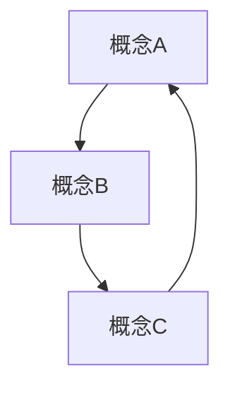

# 形式化架构理论体系 - 总体分析框架 v14

## 目录

1. [项目概述](#1-项目概述)
2. [分析目标与范围](#2-分析目标与范围)
3. [方法论框架](#3-方法论框架)
4. [内容组织结构](#4-内容组织结构)
5. [形式化规范](#5-形式化规范)
6. [进度跟踪](#6-进度跟踪)
7. [质量保证](#7-质量保证)

## 1. 项目概述

### 1.1 项目目标

本项目旨在对 `/Matter` 目录下的所有内容进行深度分析，构建一个完整的、形式化的软件架构理论体系。该体系将：

- **形式化表达**：使用数学符号、逻辑公式、编程代码进行严格的形式化表达
- **跨学科整合**：融合哲学、数学、计算机科学、认知科学等领域的理论
- **实践导向**：将理论应用于实际的软件架构设计和开发
- **学术规范**：符合数学和计算机科学的学术标准

### 1.2 核心特色

1. **多层次理论体系**：从理念层到实践层的完整理论架构
2. **形式化证明**：严格的数学证明和逻辑推理
3. **多表征方式**：图表、数学公式、代码示例等多种表达方式
4. **跨领域整合**：哲学、数学、计算机科学的深度融合
5. **现代技术导向**：重点关注现代软件架构和系统设计

## 2. 分析目标与范围

### 2.1 分析范围

#### 2.1.1 Matter目录内容分析

- **哲学内容**：本体论、认识论、伦理学、逻辑学、形而上学
- **数学内容**：范畴论、代数、几何、分析、数论、概率统计
- **形式化理论**：形式语言、形式模型、形式验证
- **软件架构**：系统设计、组件设计、设计模式、微服务
- **编程语言**：Rust、Go、编程范式、语言比较
- **理论体系**：各种理论框架和模型

#### 2.1.2 行业标准对齐

- **软件架构标准**：TOGAF、Zachman、4+1视图模型
- **企业架构框架**：现代企业架构理论和实践
- **行业最佳实践**：当前主流的技术架构和设计模式

### 2.2 分析目标

1. **内容梳理**：对Matter目录下的所有内容进行系统梳理
2. **理论构建**：构建完整的软件架构理论体系
3. **形式化表达**：将理论转换为严格的形式化表达
4. **实践应用**：提供实际可用的架构设计方法和工具
5. **学术规范**：确保所有内容符合学术标准

## 3. 方法论框架

### 3.1 分析层次

```latex
\begin{align}
\text{理念层} &\rightarrow \text{形式科学层} \rightarrow \text{理论层} \rightarrow \text{具体科学层} \rightarrow \text{算法层} \rightarrow \text{实践层}
\end{align}
```

### 3.2 分析步骤

1. **内容收集**：全面收集Matter目录下的所有内容
2. **主题识别**：识别和分类各个主题领域
3. **概念梳理**：梳理核心概念和定义
4. **关系分析**：分析概念间的关系和依赖
5. **理论构建**：构建完整的理论体系
6. **形式化表达**：转换为形式化表达
7. **验证完善**：验证和完善理论体系

### 3.3 质量保证

- **一致性检查**：确保概念定义的一致性
- **完整性检查**：确保理论体系的完整性
- **正确性检查**：确保逻辑推理的正确性
- **实用性检查**：确保理论的实用性

## 4. 内容组织结构

### 4.1 目录结构

```
Analysis/
├── 01-哲学基础理论/
│   ├── 01-本体论/
│   ├── 02-认识论/
│   ├── 03-伦理学/
│   ├── 04-逻辑学/
│   └── 05-形而上学/
├── 02-数学理论体系/
│   ├── 01-基础数学/
│   ├── 02-范畴论/
│   ├── 03-代数理论/
│   ├── 04-几何理论/
│   ├── 05-分析理论/
│   └── 06-概率统计/
├── 03-形式化理论基础/
│   ├── 01-形式语言/
│   ├── 02-形式模型/
│   ├── 03-形式验证/
│   └── 04-形式化方法/
├── 04-软件架构理论/
│   ├── 01-系统架构/
│   ├── 02-组件架构/
│   ├── 03-设计模式/
│   ├── 04-微服务架构/
│   └── 05-分布式系统/
├── 05-编程语言理论/
│   ├── 01-语言范式/
│   ├── 02-Rust理论/
│   ├── 03-Go理论/
│   └── 04-语言比较/
├── 06-系统设计实践/
│   ├── 01-架构设计/
│   ├── 02-实现方法/
│   ├── 03-最佳实践/
│   └── 04-案例分析/
├── 07-控制与并发理论/
│   ├── 01-并发模型/
│   ├── 02-控制理论/
│   ├── 03-同步机制/
│   └── 04-分布式控制/
├── 08-类型理论深化/
│   ├── 01-类型系统/
│   ├── 02-类型安全/
│   ├── 03-类型推导/
│   └── 04-高级类型/
├── 09-分布式系统理论/
│   ├── 01-分布式模型/
│   ├── 02-一致性理论/
│   ├── 03-容错机制/
│   └── 04-分布式算法/
├── 10-形式化验证/
│   ├── 01-模型检查/
│   ├── 02-定理证明/
│   ├── 03-程序验证/
│   └── 04-系统验证/
├── 11-跨领域整合/
│   ├── 01-理论整合/
│   ├── 02-方法整合/
│   ├── 03-应用整合/
│   └── 04-创新整合/
└── 12-索引与导航/
    ├── 01-概念索引/
    ├── 02-理论索引/
    ├── 03-应用索引/
    └── 04-导航系统/
```

### 4.2 文件命名规范

- **目录命名**：`XX-主题名称/`
- **文件命名**：`XX-子主题名称.md`
- **版本控制**：`文件名-vN.md`

### 4.3 内容结构规范

每个文档应包含：

1. **标题和目录**
2. **概述和背景**
3. **核心概念定义**
4. **理论框架**
5. **形式化表达**
6. **证明和论证**
7. **应用示例**
8. **总结和展望**
9. **参考文献**

## 5. 形式化规范

### 5.1 数学表达式规范

所有数学表达式必须使用LaTeX格式：

```latex
\begin{align}
\text{概念定义} &= \text{形式化表达} \\
\text{定理} &= \text{证明过程} \\
\text{公式} &= \text{数学符号}
\end{align}
```

### 5.2 代码示例规范

使用Rust或Go语言：

```rust
// Rust代码示例
pub struct Architecture {
    components: Vec<Component>,
    relationships: Vec<Relationship>,
}

impl Architecture {
    pub fn new() -> Self {
        Self {
            components: Vec::new(),
            relationships: Vec::new(),
        }
    }
}
```

### 5.3 图表规范

使用Mermaid格式：



## 6. 进度跟踪

### 6.1 当前进度

- [x] 项目框架建立
- [x] 目录结构设计
- [ ] Matter内容分析
- [ ] 理论体系构建
- [ ] 形式化表达
- [ ] 质量验证

### 6.2 下一步计划

1. **深度分析Matter目录内容**
2. **构建核心理论框架**
3. **创建形式化表达**
4. **建立质量保证体系**

## 7. 质量保证

### 7.1 内容质量

- **准确性**：确保所有概念和理论的准确性
- **完整性**：确保理论体系的完整性
- **一致性**：确保概念定义的一致性
- **实用性**：确保理论的实用性

### 7.2 形式化质量

- **数学严谨性**：确保数学表达的严谨性
- **逻辑一致性**：确保逻辑推理的一致性
- **符号规范性**：确保符号使用的规范性
- **证明完整性**：确保证明过程的完整性

### 7.3 学术规范

- **引用规范**：确保引用的规范性
- **格式规范**：确保文档格式的规范性
- **结构规范**：确保文档结构的规范性
- **语言规范**：确保语言表达的规范性

---

**版本信息**：v14  
**创建时间**：2024年12月  
**最后更新**：2024年12月  
**维护者**：AI Assistant
