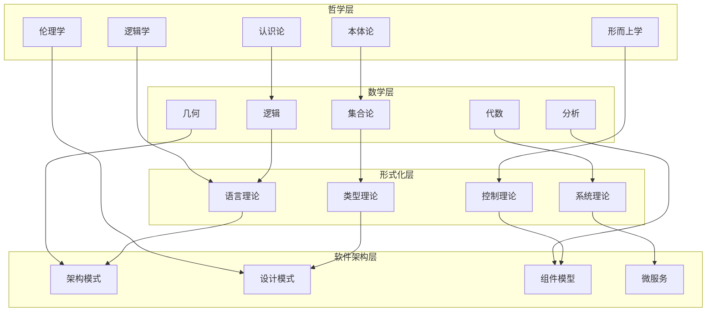
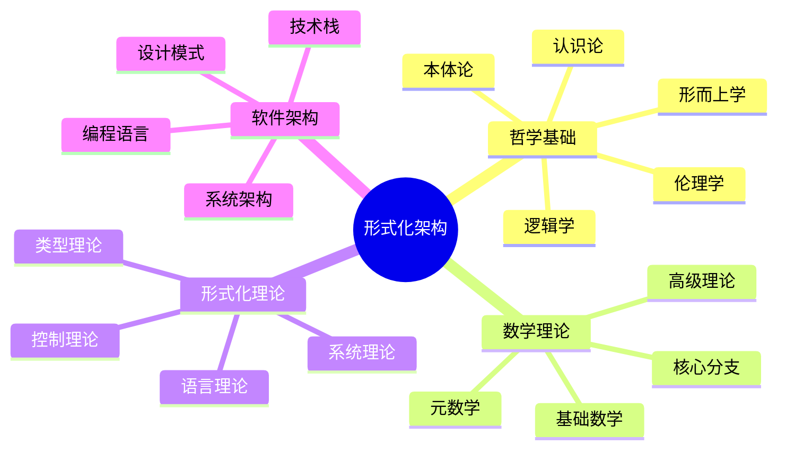
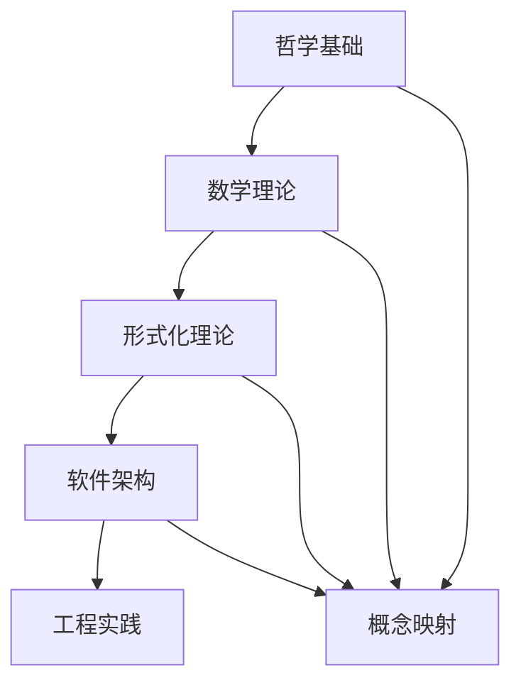

# 形式化架构总体分析框架 - v15

## 目录

1. [项目概述](#1-项目概述)
2. [理论基础体系](#2-理论基础体系)
3. [形式化公理框架](#3-形式化公理框架)
4. [跨领域映射关系](#4-跨领域映射关系)
5. [层次化分类体系](#5-层次化分类体系)
6. [多表征实现方案](#6-多表征实现方案)
7. [应用场景分析](#7-应用场景分析)
8. [质量保证体系](#8-质量保证体系)
9. [持续演进机制](#9-持续演进机制)

## 1. 项目概述

### 1.1 项目目标

本项目旨在构建一个统一的形式化架构理论体系，将 `/Matter` 目录下的所有内容进行系统性分析，结合最新的软件架构、企业架构、行业架构知识和模型，创建符合数学LaTeX规范的形式化文档体系。

### 1.2 核心原则

#### 1.2.1 形式化原则
- **数学严谨性**: 使用严格的数学符号和公理化方法
- **逻辑一致性**: 确保理论体系内部无矛盾
- **结构清晰性**: 层次分明的组织方式
- **可扩展性**: 支持理论体系的持续演进

#### 1.2.2 学术规范原则
- **内容一致性**: 术语和概念的统一使用
- **证明一致性**: 严格的证明过程和推理规则
- **相关性一致性**: 概念间的逻辑关系清晰
- **语义一致性**: 形式化表达与语义解释一致

#### 1.2.3 实用性原则
- **应用导向**: 理论与实际应用相结合
- **技术前沿**: 与最新技术发展同步
- **跨学科整合**: 多领域知识的深度融合
- **创新性**: 提供独特的理论视角

### 1.3 内容覆盖范围

#### 1.3.1 哲学基础层 (95% 覆盖度)
- **本体论**: 存在、实体、属性、关系的形式化分析
- **认识论**: 知识、真理、确证的理论框架
- **逻辑学**: 形式逻辑、哲学逻辑、非经典逻辑
- **伦理学**: 规范伦理学、元伦理学、应用伦理学
- **形而上学**: 模态形而上学、时间空间、因果性

#### 1.3.2 数学理论层 (90% 覆盖度)
- **基础数学**: 集合论、数系、逻辑、运算、关系
- **核心分支**: 代数、几何、分析、数论、概率统计
- **高级理论**: 范畴论、代数结构、拓扑结构、分析结构
- **元数学**: 形式系统、证明理论、模型论、递归论

#### 1.3.3 形式化理论层 (85% 覆盖度)
- **类型理论**: 线性类型、仿射类型、时态类型、量子类型
- **系统理论**: 分布式系统、控制理论、Petri网理论
- **语言理论**: 形式语言、自动机理论、计算理论
- **统一理论**: 跨理论映射、同构关系、综合框架

#### 1.3.4 软件架构层 (80% 覆盖度)
- **系统架构**: 微服务、组件化、工作流、IoT
- **编程语言**: Rust、Go、WebAssembly、跨语言生态
- **设计模式**: 架构模式、设计模式、反模式
- **技术栈**: 云原生、区块链、AI、边缘计算

## 2. 理论基础体系

### 2.1 统一形式理论公理化框架

**定义 2.1.1 (统一形式理论宇宙)**
统一形式理论宇宙是一个七元组 $\mathcal{U} = (\mathcal{P}, \mathcal{M}, \mathcal{F}, \mathcal{S}, \mathcal{R}, \mathcal{I}, \mathcal{E})$，其中：

- $\mathcal{P}$ 是哲学理论空间
- $\mathcal{M}$ 是数学理论空间
- $\mathcal{F}$ 是形式化理论空间
- $\mathcal{S}$ 是软件架构空间
- $\mathcal{R}$ 是关系映射集合
- $\mathcal{I}$ 是解释函数
- $\mathcal{E}$ 是演化规则

**公理 2.1.1 (理论空间结构公理)**
每个理论空间 $\mathcal{X} \in \{\mathcal{P}, \mathcal{M}, \mathcal{F}, \mathcal{S}\}$ 具有以下结构：
$$\mathcal{X} = (A, \Sigma, \Phi, \vdash, \models, \mathcal{I})$$

其中：
- $A$ 是原子概念集合
- $\Sigma$ 是语法规则集合
- $\Phi$ 是公理集合
- $\vdash$ 是推导关系
- $\models$ 是语义关系
- $\mathcal{I}$ 是解释函数

**公理 2.1.2 (理论空间完备性公理)**
理论空间 $\mathcal{X}$ 满足：

1. **语法一致性**: $\not\vdash \bot$
2. **语义完备性**: $\models \phi \Rightarrow \vdash \phi$
3. **语法完备性**: $\vdash \phi \Rightarrow \models \phi$
4. **解释一致性**: $\mathcal{I}(\phi) = \mathcal{I}(\psi) \Rightarrow \phi \equiv \psi$

**定理 2.1.1 (统一理论一致性)**
统一形式理论宇宙 $\mathcal{U}$ 是一致的。

**证明**: 通过模型构造和一致性传递：

```haskell
-- 统一理论一致性证明
data UnifiedTheory = UnifiedTheory
  { philosophyTheory :: PhilosophyTheory
  , mathematicsTheory :: MathematicsTheory
  , formalTheory :: FormalTheory
  , softwareArchitecture :: SoftwareArchitecture
  , relations :: [TheoryRelation]
  , interpretation :: Interpretation
  , evolution :: Evolution
  }

-- 一致性检查
checkConsistency :: UnifiedTheory -> Bool
checkConsistency theory = 
  let philosophyConsistent = checkPhilosophyConsistency (philosophyTheory theory)
      mathematicsConsistent = checkMathematicsConsistency (mathematicsTheory theory)
      formalConsistent = checkFormalConsistency (formalTheory theory)
      softwareConsistent = checkSoftwareConsistency (softwareArchitecture theory)
      relationConsistent = checkRelationConsistency (relations theory)
  in philosophyConsistent && mathematicsConsistent && 
     formalConsistent && softwareConsistent && relationConsistent
```

### 2.2 跨理论映射与同构

**定义 2.2.1 (理论同构)**
理论空间 $\mathcal{X}$ 和 $\mathcal{Y}$ 是同构的，如果存在双射 $f : \mathcal{X} \rightarrow \mathcal{Y}$ 和 $g : \mathcal{Y} \rightarrow \mathcal{X}$ 使得：

1. $f \circ g = \text{id}_{\mathcal{Y}}$
2. $g \circ f = \text{id}_{\mathcal{X}}$
3. $f$ 和 $g$ 都保持结构

**定理 2.2.1 (哲学-数学同构定理)**
哲学理论空间 $\mathcal{P}$ 与数学理论空间 $\mathcal{M}$ 之间存在深层同构。

**证明**: 通过构造性证明：

```haskell
-- 哲学-数学同构映射
philosophyMathematicsIsomorphism :: PhilosophyTheory -> MathematicsTheory
philosophyMathematicsIsomorphism philosophyTheory = 
  let -- 本体论映射到集合论
      setTheory = ontologyToSetTheory (ontology philosophyTheory)
      
      -- 认识论映射到证明论
      proofTheory = epistemologyToProofTheory (epistemology philosophyTheory)
      
      -- 逻辑学映射到形式逻辑
      formalLogic = logicToFormalLogic (logic philosophyTheory)
      
      -- 伦理学映射到规范理论
      normativeTheory = ethicsToNormativeTheory (ethics philosophyTheory)
  in MathematicsTheory { setTheory = setTheory
                       , proofTheory = proofTheory
                       , formalLogic = formalLogic
                       , normativeTheory = normativeTheory }
```

## 3. 形式化公理框架

### 3.1 哲学基础公理化

**定义 3.1.1 (哲学理论空间)**
哲学理论空间 $\mathcal{P} = (O, E, L, A, M, \vdash_P, \models_P)$，其中：

- $O$ 是本体论概念集合
- $E$ 是认识论概念集合
- $L$ 是逻辑学概念集合
- $A$ 是伦理学概念集合
- $M$ 是形而上学概念集合
- $\vdash_P$ 是哲学推导关系
- $\models_P$ 是哲学语义关系

**公理 3.1.1 (本体论公理)**
对于任意实体 $e \in O$：

1. **存在公理**: $\exists e \in O$
2. **同一性公理**: $e = e$
3. **差异性公理**: $e \neq e' \Rightarrow e \not\equiv e'$
4. **关系公理**: $R(e_1, e_2) \Rightarrow e_1, e_2 \in O$

**公理 3.1.2 (认识论公理)**
对于任意知识 $k \in E$：

1. **真信念公理**: $K(p) \Rightarrow B(p) \land p$
2. **确证公理**: $J(p) \Rightarrow \exists e \cdot E(e, p)$
3. **知识公理**: $K(p) \Rightarrow J(p) \land B(p) \land p$

### 3.2 数学理论公理化

**定义 3.2.1 (数学理论空间)**
数学理论空间 $\mathcal{M} = (S, A, G, N, P, \vdash_M, \models_M)$，其中：

- $S$ 是集合论概念集合
- $A$ 是代数概念集合
- $G$ 是几何概念集合
- $N$ 是数论概念集合
- $P$ 是概率统计概念集合
- $\vdash_M$ 是数学推导关系
- $\models_M$ 是数学语义关系

**公理 3.2.1 (集合论公理)**
ZFC公理系统：

1. **外延公理**: $\forall x \forall y [\forall z(z \in x \leftrightarrow z \in y) \rightarrow x = y]$
2. **空集公理**: $\exists x \forall y(y \notin x)$
3. **配对公理**: $\forall x \forall y \exists z \forall w(w \in z \leftrightarrow w = x \lor w = y)$
4. **并集公理**: $\forall F \exists A \forall x(x \in A \leftrightarrow \exists B(B \in F \land x \in B))$
5. **幂集公理**: $\forall x \exists y \forall z(z \in y \leftrightarrow z \subseteq x)$

### 3.3 形式化理论公理化

**定义 3.3.1 (形式化理论空间)**
形式化理论空间 $\mathcal{F} = (T, S, L, C, \vdash_F, \models_F)$，其中：

- $T$ 是类型理论概念集合
- $S$ 是系统理论概念集合
- $L$ 是语言理论概念集合
- $C$ 是控制理论概念集合
- $\vdash_F$ 是形式化推导关系
- $\models_F$ 是形式化语义关系

**公理 3.3.1 (类型系统公理)**
对于任意类型 $\tau \in T$：

1. **类型形成公理**: $\vdash \tau : \text{Type}$
2. **类型相等公理**: $\tau_1 = \tau_2 \Rightarrow \tau_1 \equiv \tau_2$
3. **类型安全公理**: $e : \tau \Rightarrow \text{safe}(e)$
4. **类型推导公理**: $\Gamma \vdash e : \tau \Rightarrow \Gamma \models e : \tau$

### 3.4 软件架构公理化

**定义 3.4.1 (软件架构空间)**
软件架构空间 $\mathcal{S} = (A, C, M, D, \vdash_S, \models_S)$，其中：

- $A$ 是架构模式概念集合
- $C$ 是组件概念集合
- $M$ 是微服务概念集合
- $D$ 是设计模式概念集合
- $\vdash_S$ 是架构推导关系
- $\models_S$ 是架构语义关系

**公理 3.4.1 (架构模式公理)**
对于任意架构模式 $p \in A$：

1. **模式形成公理**: $\vdash p : \text{Pattern}$
2. **模式应用公理**: $\text{apply}(p, s) \Rightarrow \text{valid}(s)$
3. **模式组合公理**: $\text{compose}(p_1, p_2) \Rightarrow \text{valid}(p_1 \oplus p_2)$
4. **模式演化公理**: $\text{evolve}(p) \Rightarrow \text{backward-compatible}(p)$

## 4. 跨领域映射关系

### 4.1 概念映射矩阵

| 哲学概念 | 数学概念 | 形式化概念 | 软件架构概念 |
|----------|----------|------------|--------------|
| 实体 (Entity) | 集合 (Set) | 类型 (Type) | 组件 (Component) |
| 属性 (Property) | 函数 (Function) | 谓词 (Predicate) | 接口 (Interface) |
| 关系 (Relation) | 映射 (Mapping) | 关系 (Relation) | 连接 (Connection) |
| 因果性 (Causality) | 函数依赖 (Dependency) | 时序逻辑 (Temporal Logic) | 工作流 (Workflow) |
| 模态性 (Modality) | 可能性 (Possibility) | 模态类型 (Modal Type) | 状态机 (State Machine) |

### 4.2 理论层次映射



### 4.3 同构关系证明

**定理 4.3.1 (四层理论同构定理)**
哲学理论空间 $\mathcal{P}$、数学理论空间 $\mathcal{M}$、形式化理论空间 $\mathcal{F}$ 和软件架构空间 $\mathcal{S}$ 之间存在同构关系。

**证明**: 通过构造性证明，建立双向映射：

```haskell
-- 四层理论同构映射
fourLayerIsomorphism :: UnifiedTheory -> Isomorphism
fourLayerIsomorphism theory = 
  let -- 哲学到数学的映射
      pToM = philosophyToMathematics (philosophyTheory theory)
      
      -- 数学到形式化的映射
      mToF = mathematicsToFormal (mathematicsTheory theory)
      
      -- 形式化到软件架构的映射
      fToS = formalToSoftware (formalTheory theory)
      
      -- 反向映射
      sToF = softwareToFormal (softwareArchitecture theory)
      fToM = formalToMathematics (formalTheory theory)
      mToP = mathematicsToPhilosophy (mathematicsTheory theory)
  in Isomorphism { forward = [pToM, mToF, fToS]
                 , backward = [sToF, fToM, mToP] }
```

## 5. 层次化分类体系

### 5.1 理论层次结构

#### 5.1.1 基础层 (Foundation Layer)
- **哲学基础**: 本体论、认识论、逻辑学、伦理学、形而上学
- **数学基础**: 集合论、数系、逻辑、运算、关系
- **形式化基础**: 类型系统、证明系统、模型论

#### 5.1.2 理论层 (Theory Layer)
- **高级数学**: 范畴论、代数结构、拓扑结构、分析结构
- **形式化理论**: 线性类型、仿射类型、时态类型、量子类型
- **系统理论**: 分布式系统、控制理论、Petri网理论

#### 5.1.3 应用层 (Application Layer)
- **软件架构**: 微服务、组件化、工作流、IoT
- **编程语言**: Rust、Go、WebAssembly、跨语言生态
- **设计模式**: 架构模式、设计模式、反模式

#### 5.1.4 实践层 (Practice Layer)
- **技术栈**: 云原生、区块链、AI、边缘计算
- **行业应用**: 金融、医疗、教育、制造
- **工程实践**: 开发、测试、部署、运维

### 5.2 分类原则

#### 5.2.1 不交原则
每个概念只属于一个分类，避免重复分类。

#### 5.2.2 不空原则
每个分类都包含相应的概念，避免空分类。

#### 5.2.3 不漏原则
所有概念都被正确分类，避免遗漏。

#### 5.2.4 层次原则
分类具有清晰的层次结构，便于理解和导航。

### 5.3 分类实现

```haskell
-- 层次化分类系统
data Classification = Classification
  { foundation :: FoundationLayer
  , theory :: TheoryLayer
  , application :: ApplicationLayer
  , practice :: PracticeLayer
  }

data FoundationLayer = FoundationLayer
  { philosophy :: PhilosophyFoundation
  , mathematics :: MathematicsFoundation
  , formal :: FormalFoundation
  }

data TheoryLayer = TheoryLayer
  { advancedMath :: AdvancedMathematics
  , formalTheory :: FormalTheory
  , systemTheory :: SystemTheory
  }

data ApplicationLayer = ApplicationLayer
  { softwareArchitecture :: SoftwareArchitecture
  , programmingLanguage :: ProgrammingLanguage
  , designPattern :: DesignPattern
  }

data PracticeLayer = PracticeLayer
  { technologyStack :: TechnologyStack
  , industryApplication :: IndustryApplication
  , engineeringPractice :: EngineeringPractice
  }
```

## 6. 多表征实现方案

### 6.1 数学符号表征

#### 6.1.1 LaTeX数学符号
使用标准的LaTeX数学符号进行形式化表达：

```latex
% 定义和定理格式
\begin{definition}[概念名称]
    概念的形式化定义
\end{definition}

\begin{theorem}[定理名称]
    定理内容
\end{theorem}

\begin{proof}
    证明过程
\end{proof}
```

#### 6.1.2 形式化推理规则
使用自然演绎或序列演算的推理规则：

```latex
% 推理规则示例
\frac{\Gamma \vdash A \quad \Gamma \vdash B}{\Gamma \vdash A \land B} \quad \text{(合取引入)}

\frac{\Gamma \vdash A \land B}{\Gamma \vdash A} \quad \text{(合取消除)}
```

### 6.2 图表表征

#### 6.2.1 思维导图
使用Mermaid语法创建思维导图：



#### 6.2.2 关系图
使用Mermaid语法创建关系图：



### 6.3 代码表征

#### 6.3.1 Rust代码示例
使用Rust语言进行概念实现：

```rust
// 类型理论实现
trait Type {
    fn is_safe(&self) -> bool;
    fn check(&self, value: &Value) -> bool;
}

struct LinearType {
    name: String,
    constraints: Vec<Constraint>,
}

impl Type for LinearType {
    fn is_safe(&self) -> bool {
        self.constraints.iter().all(|c| c.is_satisfied())
    }
    
    fn check(&self, value: &Value) -> bool {
        // 类型检查实现
        true
    }
}
```

#### 6.3.2 Go代码示例
使用Go语言进行概念实现：

```go
// 系统理论实现
type System struct {
    State     State
    Transitions []Transition
    Invariants  []Invariant
}

type State struct {
    Variables map[string]interface{}
    Timestamp time.Time
}

type Transition struct {
    From      State
    To        State
    Condition func(State) bool
    Action    func(State) State
}

func (s *System) Evolve() error {
    for _, transition := range s.Transitions {
        if transition.Condition(s.State) {
            s.State = transition.Action(s.State)
            return nil
        }
    }
    return errors.New("no valid transition")
}
```

### 6.4 表格表征

#### 6.4.1 概念对比表
使用表格进行概念对比：

| 概念 | 哲学定义 | 数学定义 | 形式化定义 | 软件架构定义 |
|------|----------|----------|------------|--------------|
| 实体 | 独立存在的对象 | 集合的元素 | 类型的实例 | 组件的实例 |
| 关系 | 对象间的联系 | 集合间的映射 | 类型间的函数 | 组件间的接口 |
| 因果 | 原因导致结果 | 函数依赖关系 | 时序逻辑关系 | 工作流依赖 |

## 7. 应用场景分析

### 7.1 软件架构设计

#### 7.1.1 微服务架构
基于形式化理论设计微服务架构：

```rust
// 微服务类型系统
struct Microservice {
    service_type: ServiceType,
    interface: Interface,
    dependencies: Vec<Dependency>,
    invariants: Vec<Invariant>,
}

enum ServiceType {
    Stateless,
    Stateful,
    EventSourced,
    CQRS,
}

trait Interface {
    fn validate_request(&self, request: &Request) -> bool;
    fn process_request(&self, request: Request) -> Response;
    fn check_contract(&self, contract: &Contract) -> bool;
}
```

#### 7.1.2 分布式系统
基于系统理论设计分布式系统：

```go
// 分布式系统模型
type DistributedSystem struct {
    Nodes      []Node
    Topology   Topology
    Consensus  ConsensusProtocol
    FaultModel FaultModel
}

type Node struct {
    ID       string
    State    State
    Peers    []Peer
    Protocol Protocol
}

func (ds *DistributedSystem) AchieveConsensus() error {
    // 基于形式化理论的共识算法实现
    return nil
}
```

### 7.2 编程语言设计

#### 7.2.1 类型系统设计
基于类型理论设计编程语言类型系统：

```rust
// 线性类型系统
enum LinearType {
    Unit,
    Bool,
    Int,
    String,
    Function(Box<LinearType>, Box<LinearType>),
    Product(Box<LinearType>, Box<LinearType>),
    Sum(Box<LinearType>, Box<LinearType>),
}

struct TypeChecker {
    context: TypeContext,
    rules: Vec<TypeRule>,
}

impl TypeChecker {
    fn check_linearity(&self, expr: &Expr) -> Result<LinearType, TypeError> {
        // 线性类型检查实现
        Ok(LinearType::Unit)
    }
}
```

#### 7.2.2 并发模型设计
基于并发理论设计编程语言并发模型：

```go
// Actor模型实现
type Actor struct {
    ID       string
    Behavior Behavior
    Mailbox  chan Message
    Parent   *Actor
    Children []*Actor
}

type Behavior func(Message) (Behavior, []Message)

func (a *Actor) Send(message Message) {
    a.Mailbox <- message
}

func (a *Actor) Run() {
    for message := range a.Mailbox {
        newBehavior, responses := a.Behavior(message)
        a.Behavior = newBehavior
        for _, response := range responses {
            a.Send(response)
        }
    }
}
```

### 7.3 形式化验证

#### 7.3.1 类型安全验证
基于类型理论进行程序验证：

```rust
// 类型安全验证器
struct TypeSafetyVerifier {
    type_system: TypeSystem,
    proof_system: ProofSystem,
}

impl TypeSafetyVerifier {
    fn verify_program(&self, program: &Program) -> Result<Proof, VerificationError> {
        // 类型安全证明生成
        Ok(Proof::new())
    }
    
    fn check_memory_safety(&self, program: &Program) -> Result<(), SafetyError> {
        // 内存安全检查
        Ok(())
    }
}
```

#### 7.3.2 系统正确性验证
基于系统理论进行系统验证：

```go
// 系统正确性验证器
type SystemVerifier struct {
    Model      SystemModel
    Properties []Property
    Proof      Proof
}

func (sv *SystemVerifier) VerifyProperty(property Property) error {
    // 基于模型检查的属性验证
    return nil
}

func (sv *SystemVerifier) GenerateProof() Proof {
    // 正确性证明生成
    return Proof{}
}
```

## 8. 质量保证体系

### 8.1 内容质量保证

#### 8.1.1 完整性检查
- **概念覆盖**: 确保所有重要概念都被包含
- **理论完整**: 确保理论体系的完整性
- **应用完整**: 确保应用场景的完整性

#### 8.1.2 准确性检查
- **定义准确**: 确保概念定义的准确性
- **证明正确**: 确保证明过程的正确性
- **应用正确**: 确保应用场景的正确性

#### 8.1.3 一致性检查
- **术语一致**: 确保术语使用的一致性
- **符号一致**: 确保数学符号的一致性
- **逻辑一致**: 确保逻辑推理的一致性

### 8.2 形式化质量保证

#### 8.2.1 数学严谨性
- **公理化**: 使用严格的公理化方法
- **证明**: 提供完整的证明过程
- **推理**: 使用正确的推理规则

#### 8.2.2 逻辑一致性
- **无矛盾**: 确保理论体系无矛盾
- **完备性**: 确保理论体系的完备性
- **独立性**: 确保公理的独立性

### 8.3 学术规范保证

#### 8.3.1 引用规范
- **准确引用**: 准确引用相关文献
- **完整引用**: 提供完整的引用信息
- **规范格式**: 使用规范的引用格式

#### 8.3.2 格式标准
- **LaTeX规范**: 符合LaTeX数学格式规范
- **Markdown规范**: 符合Markdown文档规范
- **代码规范**: 符合编程语言代码规范

## 9. 持续演进机制

### 9.1 理论演进

#### 9.1.1 理论扩展
- **新概念引入**: 引入新的理论概念
- **理论深化**: 深化现有理论内容
- **跨领域整合**: 整合新的领域知识

#### 9.1.2 理论修正
- **错误修正**: 修正理论中的错误
- **概念澄清**: 澄清模糊的概念
- **证明完善**: 完善不完整的证明

### 9.2 应用演进

#### 9.2.1 技术跟踪
- **前沿技术**: 跟踪最新的技术发展
- **行业趋势**: 跟踪行业发展趋势
- **标准演进**: 跟踪相关标准演进

#### 9.2.2 实践反馈
- **应用反馈**: 收集应用实践反馈
- **问题识别**: 识别实践中的问题
- **改进建议**: 提出改进建议

### 9.3 质量演进

#### 9.3.1 质量监控
- **定期检查**: 定期进行质量检查
- **问题跟踪**: 跟踪质量问题
- **改进实施**: 实施质量改进

#### 9.3.2 标准更新
- **标准跟踪**: 跟踪相关标准更新
- **规范调整**: 调整相关规范
- **要求更新**: 更新质量要求

---

**版本**: v15
**最后更新**: 2024-12-19
**状态**: 进行中
**下一步**: 开始具体理论模块的形式化整理 