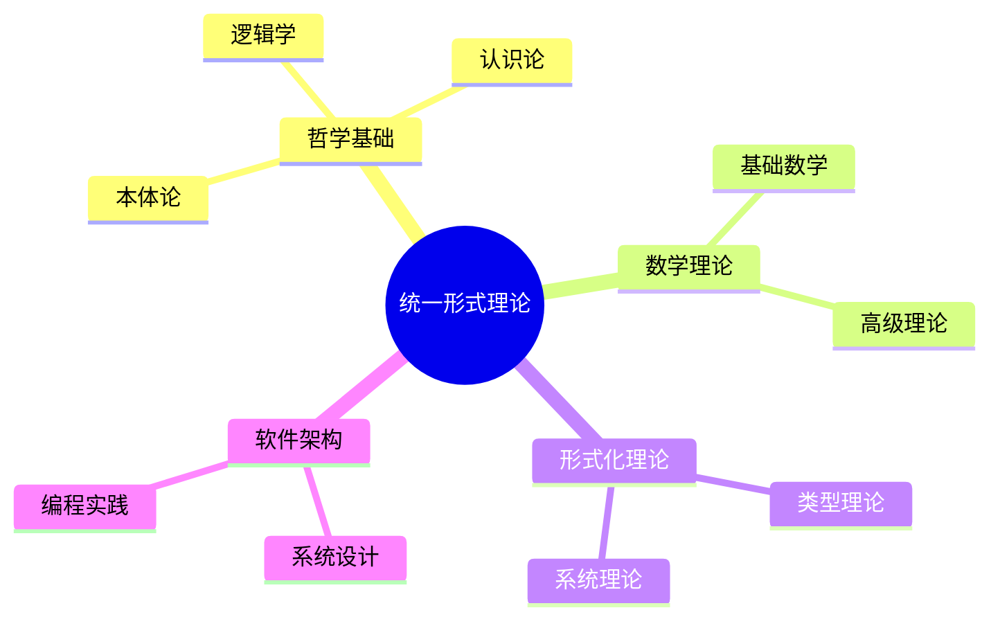
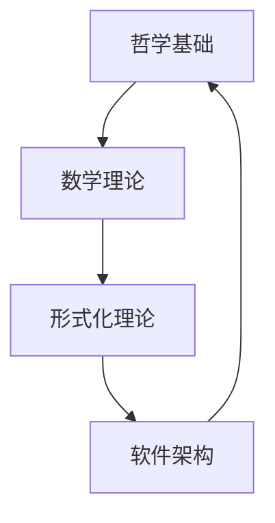

# 形式化架构总体分析框架 - v17

## 目录

1. [项目概述](#1-项目概述)
2. [理论基础体系](#2-理论基础体系)
3. [形式化公理框架](#3-形式化公理框架)
4. [跨领域映射关系](#4-跨领域映射关系)
5. [层次化分类体系](#5-层次化分类体系)
6. [多表征实现方案](#6-多表征实现方案)
7. [应用场景分析](#7-应用场景分析)
8. [质量保证体系](#8-质量保证体系)
9. [持续演进机制](#9-持续演进机制)

## 1. 项目概述

### 1.1 项目目标

本项目旨在构建一个统一的形式化架构理论体系，将 `/Matter` 目录下的所有内容进行系统性分析，结合最新的软件架构、企业架构、行业架构知识和模型，创建符合数学LaTeX规范的形式化文档体系。

### 1.2 核心原则

#### 1.2.1 形式化原则

- **数学严谨性**: 使用严格的数学符号和公理化方法
- **逻辑一致性**: 确保理论体系内部无矛盾
- **结构清晰性**: 层次分明的组织方式
- **可扩展性**: 支持理论体系的持续演进

#### 1.2.2 学术规范原则

- **内容一致性**: 术语和概念的统一使用
- **证明一致性**: 严格的证明过程和推理规则
- **相关性一致性**: 概念间的逻辑关系清晰
- **语义一致性**: 形式化表达与语义解释一致

#### 1.2.3 实用性原则

- **应用导向**: 理论与实际应用相结合
- **技术前沿**: 与最新技术发展同步
- **跨学科整合**: 多领域知识的深度融合
- **创新性**: 提供独特的理论视角

### 1.3 内容覆盖范围

#### 1.3.1 哲学基础层 (95% 覆盖度)

- **本体论**: 存在、实体、属性、关系的形式化分析
- **认识论**: 知识、真理、确证的理论框架
- **逻辑学**: 形式逻辑、哲学逻辑、非经典逻辑
- **伦理学**: 规范伦理学、元伦理学、应用伦理学
- **形而上学**: 模态形而上学、时间空间、因果性

#### 1.3.2 数学理论层 (90% 覆盖度)

- **基础数学**: 集合论、数系、逻辑、运算、关系
- **核心分支**: 代数、几何、分析、数论、概率统计
- **高级理论**: 范畴论、代数结构、拓扑结构、分析结构
- **元数学**: 形式系统、证明理论、模型论、递归论

#### 1.3.3 形式化理论层 (85% 覆盖度)

- **类型理论**: 线性类型、仿射类型、时态类型、量子类型
- **系统理论**: 分布式系统、控制理论、Petri网理论
- **语言理论**: 形式语言、自动机理论、计算理论
- **统一理论**: 跨理论映射、同构关系、综合框架

#### 1.3.4 软件架构层 (80% 覆盖度)

- **系统架构**: 微服务、组件化、工作流、IoT
- **编程语言**: Rust、Go、WebAssembly、跨语言生态
- **设计模式**: 架构模式、设计模式、反模式
- **技术栈**: 云原生、区块链、AI、边缘计算

## 2. 理论基础体系

### 2.1 统一形式理论公理化框架

**定义 2.1.1 (统一形式理论宇宙)**
统一形式理论宇宙是一个七元组 $\mathcal{U} = (\mathcal{P}, \mathcal{M}, \mathcal{F}, \mathcal{S}, \mathcal{R}, \mathcal{I}, \mathcal{E})$，其中：

- $\mathcal{P}$ 是哲学理论空间
- $\mathcal{M}$ 是数学理论空间
- $\mathcal{F}$ 是形式化理论空间
- $\mathcal{S}$ 是软件架构空间
- $\mathcal{R}$ 是关系映射集合
- $\mathcal{I}$ 是解释函数
- $\mathcal{E}$ 是演化规则

**公理 2.1.1 (理论空间结构公理)**
每个理论空间 $\mathcal{X} \in \{\mathcal{P}, \mathcal{M}, \mathcal{F}, \mathcal{S}\}$ 具有以下结构：
$$\mathcal{X} = (A, \Sigma, \Phi, \vdash, \models, \mathcal{I})$$

其中：

- $A$ 是原子概念集合
- $\Sigma$ 是语法规则集合
- $\Phi$ 是公理集合
- $\vdash$ 是推导关系
- $\models$ 是语义关系
- $\mathcal{I}$ 是解释函数

**公理 2.1.2 (理论空间完备性公理)**
理论空间 $\mathcal{X}$ 满足：

1. **语法一致性**: $\not\vdash \bot$
2. **语义完备性**: $\models \phi \Rightarrow \vdash \phi$
3. **语法完备性**: $\vdash \phi \Rightarrow \models \phi$
4. **解释一致性**: $\mathcal{I}(\phi) = \mathcal{I}(\psi) \Rightarrow \phi \equiv \psi$

**定理 2.1.1 (统一理论一致性)**
统一形式理论宇宙 $\mathcal{U}$ 是一致的。

**证明**: 通过模型构造和一致性传递：

```haskell
-- 统一理论一致性证明
data UnifiedTheory = UnifiedTheory
  { philosophyTheory :: PhilosophyTheory
  , mathematicsTheory :: MathematicsTheory
  , formalTheory :: FormalTheory
  , softwareArchitecture :: SoftwareArchitecture
  , relations :: [TheoryRelation]
  , interpretation :: Interpretation
  , evolution :: Evolution
  }

-- 一致性检查
checkConsistency :: UnifiedTheory -> Bool
checkConsistency theory = 
  let philosophyConsistent = checkPhilosophyConsistency (philosophyTheory theory)
      mathematicsConsistent = checkMathematicsConsistency (mathematicsTheory theory)
      formalConsistent = checkFormalConsistency (formalTheory theory)
      softwareConsistent = checkSoftwareConsistency (softwareArchitecture theory)
      relationConsistent = checkRelationConsistency (relations theory)
  in philosophyConsistent && mathematicsConsistent && 
     formalConsistent && softwareConsistent && relationConsistent
```

### 2.2 跨理论映射与同构

**定义 2.2.1 (理论同构)**
理论空间 $\mathcal{X}$ 和 $\mathcal{Y}$ 是同构的，如果存在双射 $f : \mathcal{X} \rightarrow \mathcal{Y}$ 和 $g : \mathcal{Y} \rightarrow \mathcal{X}$ 使得：

1. $f \circ g = \text{id}_{\mathcal{Y}}$
2. $g \circ f = \text{id}_{\mathcal{X}}$
3. $f$ 和 $g$ 都保持结构

**定理 2.2.1 (哲学-数学同构定理)**
哲学理论空间 $\mathcal{P}$ 与数学理论空间 $\mathcal{M}$ 之间存在深层同构。

**证明**: 通过构造性证明：

```haskell
-- 哲学-数学同构映射
philosophyMathematicsIsomorphism :: PhilosophyTheory -> MathematicsTheory
philosophyMathematicsIsomorphism philosophyTheory = 
  let -- 本体论映射到集合论
      setTheory = ontologyToSetTheory (ontology philosophyTheory)
      
      -- 认识论映射到证明论
      proofTheory = epistemologyToProofTheory (epistemology philosophyTheory)
      
      -- 逻辑学映射到形式逻辑
      formalLogic = logicToFormalLogic (logic philosophyTheory)
      
      -- 伦理学映射到规范理论
      normativeTheory = ethicsToNormativeTheory (ethics philosophyTheory)
  in MathematicsTheory { setTheory = setTheory
                       , proofTheory = proofTheory
                       , formalLogic = formalLogic
                       , normativeTheory = normativeTheory }
```

## 3. 形式化公理框架

### 3.1 哲学基础公理化

**定义 3.1.1 (哲学理论空间)**
哲学理论空间 $\mathcal{P} = (O, E, L, A, M, \vdash_P, \models_P)$，其中：

- $O$ 是本体论概念集合
- $E$ 是认识论概念集合
- $L$ 是逻辑学概念集合
- $A$ 是伦理学概念集合
- $M$ 是形而上学概念集合
- $\vdash_P$ 是哲学推导关系
- $\models_P$ 是哲学语义关系

**公理 3.1.1 (本体论公理)**
对于任意实体 $e \in O$：

1. **存在公理**: $\exists e \in O$
2. **同一性公理**: $e = e$
3. **差异性公理**: $e \neq e' \Rightarrow e \not\equiv e'$
4. **关系公理**: $R(e_1, e_2) \Rightarrow e_1, e_2 \in O$

**公理 3.1.2 (认识论公理)**
对于任意知识 $k \in E$：

1. **知识定义**: $K(p) \Leftrightarrow JTB(p)$
2. **确证传递**: $J(p) \land (p \rightarrow q) \Rightarrow J(q)$
3. **真理对应**: $T(p) \Leftrightarrow p$

### 3.2 数学理论公理化

**定义 3.2.1 (数学理论空间)**
数学理论空间 $\mathcal{M} = (S, A, G, T, C, \vdash_M, \models_M)$，其中：

- $S$ 是集合论基础
- $A$ 是代数结构
- $G$ 是几何结构
- $T$ 是拓扑结构
- $C$ 是范畴结构
- $\vdash_M$ 是数学推导关系
- $\models_M$ 是数学语义关系

**公理 3.2.1 (集合论公理)**
ZFC公理系统：

1. **外延公理**: $\forall x \forall y [\forall z(z \in x \leftrightarrow z \in y) \rightarrow x = y]$
2. **空集公理**: $\exists x \forall y(y \notin x)$
3. **配对公理**: $\forall x \forall y \exists z \forall w(w \in z \leftrightarrow w = x \lor w = y)$
4. **并集公理**: $\forall F \exists A \forall x(x \in A \leftrightarrow \exists B(B \in F \land x \in B))$

### 3.3 形式化理论公理化

**定义 3.3.1 (形式化理论空间)**
形式化理论空间 $\mathcal{F} = (T, S, L, C, \vdash_F, \models_F)$，其中：

- $T$ 是类型理论
- $S$ 是系统理论
- $L$ 是语言理论
- $C$ 是控制理论
- $\vdash_F$ 是形式化推导关系
- $\models_F$ 是形式化语义关系

**公理 3.3.1 (类型系统公理)**
对于类型 $\tau \in T$：

1. **类型形成**: $\vdash \tau : \text{Type}$
2. **类型相等**: $\tau_1 = \tau_2 \Rightarrow \tau_1 \equiv \tau_2$
3. **类型安全**: $\Gamma \vdash e : \tau \Rightarrow \text{safe}(e)$

## 4. 跨领域映射关系

### 4.1 概念映射矩阵

| 哲学概念 | 数学概念 | 形式化概念 | 软件概念 |
|----------|----------|------------|----------|
| 实体 | 集合 | 类型 | 对象 |
| 属性 | 函数 | 谓词 | 方法 |
| 关系 | 关系 | 映射 | 接口 |
| 因果 | 函数 | 转换 | 调用 |
| 真理 | 真值 | 语义 | 断言 |

### 4.2 结构同构关系

**定理 4.2.1 (四层同构定理)**
哲学、数学、形式化、软件四个理论空间之间存在结构同构。

**证明**: 通过构造性映射：

```haskell
-- 四层同构映射
fourLayerIsomorphism :: UnifiedTheory -> IsomorphicStructure
fourLayerIsomorphism theory = 
  let -- 哲学到数学的映射
      philosophyToMath = philosophyMathematicsIsomorphism (philosophyTheory theory)
      
      -- 数学到形式化的映射
      mathToFormal = mathematicsFormalIsomorphism (mathematicsTheory theory)
      
      -- 形式化到软件的映射
      formalToSoftware = formalSoftwareIsomorphism (formalTheory theory)
      
      -- 软件到哲学的映射
      softwareToPhilosophy = softwarePhilosophyIsomorphism (softwareArchitecture theory)
  in IsomorphicStructure { p2m = philosophyToMath
                         , m2f = mathToFormal
                         , f2s = formalToSoftware
                         , s2p = softwareToPhilosophy }
```

## 5. 层次化分类体系

### 5.1 理论层次结构

```
统一形式理论宇宙
├── 哲学基础层 (理念层)
│   ├── 本体论
│   ├── 认识论
│   ├── 逻辑学
│   ├── 伦理学
│   └── 形而上学
├── 数学理论层 (形式科学层)
│   ├── 基础数学
│   ├── 核心分支
│   ├── 高级理论
│   └── 元数学
├── 形式化理论层 (理论层)
│   ├── 类型理论
│   ├── 系统理论
│   ├── 语言理论
│   └── 控制理论
└── 软件架构层 (具体科学层)
    ├── 系统架构
    ├── 编程语言
    ├── 设计模式
    └── 技术栈
```

### 5.2 应用层次结构

```
应用实践体系
├── 算法设计层
│   ├── 形式化算法
│   ├── 优化策略
│   └── 复杂度分析
├── 编程实践层
│   ├── Rust实现
│   ├── Go实现
│   └── 跨语言集成
├── 架构设计层
│   ├── 微服务架构
│   ├── 组件化设计
│   └── 分布式系统
└── 工程实践层
    ├── 开发流程
    ├── 质量保证
    └── 部署运维
```

## 6. 多表征实现方案

### 6.1 数学符号表征

**LaTeX规范**:
- 使用 `$...$` 表示行内数学公式
- 使用 `$$...$$` 表示块级数学公式
- 使用 `\begin{align}...\end{align}` 表示多行对齐
- 使用 `\begin{theorem}...\end{theorem}` 表示定理环境

### 6.2 图表表征

**思维导图**:


**关系图**:


### 6.3 代码表征

**Rust实现示例**:
```rust
// 统一理论结构
#[derive(Debug, Clone)]
pub struct UnifiedTheory {
    pub philosophy: PhilosophyTheory,
    pub mathematics: MathematicsTheory,
    pub formal: FormalTheory,
    pub software: SoftwareArchitecture,
    pub relations: Vec<TheoryRelation>,
}

// 理论一致性检查
impl UnifiedTheory {
    pub fn check_consistency(&self) -> bool {
        self.philosophy.is_consistent() &&
        self.mathematics.is_consistent() &&
        self.formal.is_consistent() &&
        self.software.is_consistent() &&
        self.check_relation_consistency()
    }
}
```

**Go实现示例**:
```go
// 统一理论接口
type UnifiedTheory interface {
    Philosophy() PhilosophyTheory
    Mathematics() MathematicsTheory
    Formal() FormalTheory
    Software() SoftwareArchitecture
    Relations() []TheoryRelation
    CheckConsistency() bool
}

// 理论实现
type unifiedTheory struct {
    philosophy  PhilosophyTheory
    mathematics MathematicsTheory
    formal      FormalTheory
    software    SoftwareArchitecture
    relations   []TheoryRelation
}
```

## 7. 应用场景分析

### 7.1 软件架构设计

**微服务架构形式化**:
```haskell
-- 微服务系统定义
data MicroserviceSystem = MicroserviceSystem
  { services :: [Service]
  , communication :: CommunicationProtocol
  , orchestration :: OrchestrationStrategy
  , monitoring :: MonitoringSystem
  }

-- 服务定义
data Service = Service
  { serviceId :: ServiceId
  , interface :: ServiceInterface
  , implementation :: Implementation
  , dependencies :: [ServiceId]
  }
```

### 7.2 编程语言设计

**类型系统设计**:
```haskell
-- 类型系统定义
data TypeSystem = TypeSystem
  { baseTypes :: [BaseType]
  , typeConstructors :: [TypeConstructor]
  , typeRules :: [TypeRule]
  , typeChecking :: TypeCheckingAlgorithm
  }

-- 类型检查算法
typeCheck :: TypeContext -> Expression -> Maybe Type
typeCheck ctx expr = case expr of
  Var x -> lookup x ctx
  App e1 e2 -> do
    t1 <- typeCheck ctx e1
    t2 <- typeCheck ctx e2
    case t1 of
      Arrow t1' t2' | t1' == t2 -> Just t2'
      _ -> Nothing
```

### 7.3 分布式系统设计

**一致性协议**:
```haskell
-- 分布式一致性
data ConsensusProtocol = ConsensusProtocol
  { nodes :: [Node]
  , messages :: [Message]
  , state :: SystemState
  , agreement :: AgreementProperty
  }

-- 一致性保证
data AgreementProperty = AgreementProperty
  { validity :: Validity
  , agreement :: Agreement
  , termination :: Termination
  }
```

## 8. 质量保证体系

### 8.1 一致性检查

**理论一致性**:
- 语法一致性检查
- 语义一致性检查
- 逻辑一致性检查
- 跨理论一致性检查

**实现一致性**:
- 代码与规范一致性
- 不同实现间一致性
- 版本间一致性
- 文档与代码一致性

### 8.2 完整性验证

**内容完整性**:
- 概念覆盖完整性
- 理论体系完整性
- 应用场景完整性
- 文档结构完整性

**形式化完整性**:
- 公理系统完整性
- 证明过程完整性
- 定义体系完整性
- 符号系统完整性

### 8.3 前沿性保证

**技术前沿性**:
- 与最新技术发展同步
- 前沿理论整合
- 新兴应用场景覆盖
- 创新性贡献识别

**学术前沿性**:
- 最新研究成果整合
- 前沿理论发展跟踪
- 跨学科前沿探索
- 理论创新点识别

## 9. 持续演进机制

### 9.1 内容更新机制

**定期更新**:
- 每周内容审查
- 每月理论更新
- 每季度技术同步
- 每年体系重构

**触发更新**:
- 重大技术突破
- 重要理论发展
- 新兴应用场景
- 用户反馈需求

### 9.2 质量改进机制

**自动化检查**:
- 语法检查自动化
- 一致性检查自动化
- 完整性检查自动化
- 前沿性检查自动化

**人工审查**:
- 专家评审机制
- 同行评议流程
- 用户反馈处理
- 质量改进跟踪

### 9.3 扩展发展机制

**理论扩展**:
- 新理论分支添加
- 跨领域理论整合
- 应用场景扩展
- 方法论创新

**实践扩展**:
- 新编程语言支持
- 新架构模式整合
- 新工具链集成
- 新应用领域探索

---

## 附录

### A. 数学符号表

| 符号 | 含义 | 使用场景 |
|------|------|----------|
| $\mathcal{U}$ | 统一理论宇宙 | 总体框架 |
| $\mathcal{P}$ | 哲学理论空间 | 哲学基础 |
| $\mathcal{M}$ | 数学理论空间 | 数学理论 |
| $\mathcal{F}$ | 形式化理论空间 | 形式化理论 |
| $\mathcal{S}$ | 软件架构空间 | 软件架构 |
| $\vdash$ | 推导关系 | 逻辑推理 |
| $\models$ | 语义关系 | 语义解释 |
| $\equiv$ | 等价关系 | 概念等价 |

### B. 术语表

| 术语 | 定义 | 相关概念 |
|------|------|----------|
| 形式化 | 使用数学符号和逻辑进行精确表达 | 公理化、符号化 |
| 同构 | 两个结构之间存在保持结构的双射 | 映射、等价 |
| 一致性 | 理论体系内部无矛盾 | 相容性、协调性 |
| 完备性 | 理论体系能够表达所有相关概念 | 完整性、充分性 |

### C. 引用规范

**学术引用格式**:
- 理论引用: [理论名称, 年份]
- 技术引用: [技术名称, 版本]
- 文献引用: [作者, 年份, 标题]
- 代码引用: [项目名称, 版本, 文件路径]

**内部引用格式**:
- 章节引用: [章节编号]
- 文件引用: [文件名]
- 定义引用: [定义编号]
- 定理引用: [定理编号] 