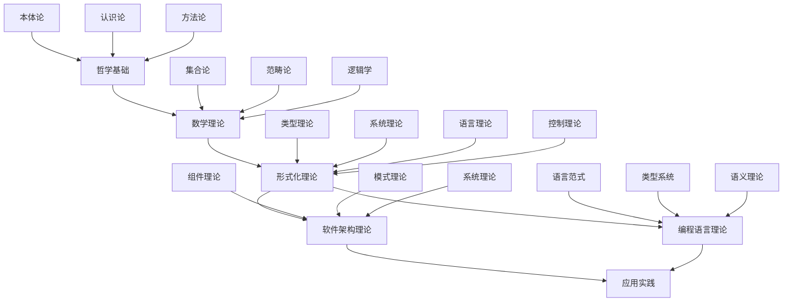

# 形式化架构理论总体分析框架 v19

## 目录

1. [项目概述](#项目概述)
2. [理论体系架构](#理论体系架构)
3. [形式化基础](#形式化基础)
4. [跨领域整合](#跨领域整合)
5. [软件架构理论](#软件架构理论)
6. [编程语言理论](#编程语言理论)
7. [数学理论体系](#数学理论体系)
8. [哲学基础理论](#哲学基础理论)
9. [形式化模型理论](#形式化模型理论)
10. [形式语言理论](#形式语言理论)
11. [理论综合与统一](#理论综合与统一)
12. [应用与实践](#应用与实践)
13. [持续发展框架](#持续发展框架)

## 1. 项目概述

### 1.1 项目目标

本项目旨在构建一个统一的形式化架构理论体系，将哲学、数学、计算机科学、软件工程等领域的理论进行深度整合，形成严格的形式化分析框架。

### 1.2 核心特征

- **形式化程度高**：采用严格的数学符号和逻辑推理
- **跨学科整合**：深度整合多个学科的理论体系
- **理论完备性**：构建自洽、完备的理论框架
- **应用导向**：理论指导实际软件架构设计
- **持续演进**：支持理论的持续发展和完善

### 1.3 方法论

采用以下方法论进行理论构建：

1. **公理化方法**：建立严格的公理体系
2. **形式化证明**：提供严格的数学证明
3. **模型构造**：构建具体的理论模型
4. **批判性分析**：对理论进行批判性评估
5. **综合统一**：将分散的理论统一整合

## 2. 理论体系架构

### 2.1 层次结构

```text
┌─────────────────────────────────────┐
│          哲学基础层                  │
│    (本体论、认识论、方法论)           │
├─────────────────────────────────────┤
│          数学理论层                  │
│    (集合论、范畴论、逻辑学)           │
├─────────────────────────────────────┤
│        形式化理论层                  │
│  (类型理论、系统理论、语言理论)       │
├─────────────────────────────────────┤
│        软件架构层                    │
│  (组件、模式、系统、架构)             │
├─────────────────────────────────────┤
│        编程语言层                    │
│  (语言理论、范式、实现)               │
├─────────────────────────────────────┤
│        应用实践层                    │
│  (设计、开发、验证、部署)             │
└─────────────────────────────────────┘
```

### 2.2 理论关系图



## 3. 形式化基础

### 3.1 统一形式理论公理化框架

**定义 3.1.1 (统一形式理论宇宙)**
统一形式理论宇宙是一个七元组 $\mathcal{U} = (\mathcal{T}, \mathcal{S}, \mathcal{L}, \mathcal{C}, \mathcal{R}, \mathcal{P}, \mathcal{M})$，其中：

- $\mathcal{T}$ 是类型理论空间
- $\mathcal{S}$ 是系统理论空间  
- $\mathcal{L}$ 是语言理论空间
- $\mathcal{C}$ 是控制理论空间
- $\mathcal{R}$ 是关系映射集合
- $\mathcal{P}$ 是证明系统
- $\mathcal{M}$ 是模型解释

**公理 3.1.1 (理论空间结构公理)**
每个理论空间 $\mathcal{X} \in \{\mathcal{T}, \mathcal{S}, \mathcal{L}, \mathcal{C}\}$ 具有以下结构：
$$\mathcal{X} = (A, \Sigma, \Phi, \vdash, \models, \mathcal{I})$$

其中：

- $A$ 是原子概念集合
- $\Sigma$ 是语法规则集合
- $\Phi$ 是公理集合
- $\vdash$ 是推导关系
- $\models$ 是语义关系
- $\mathcal{I}$ 是解释函数

**定理 3.1.1 (统一理论一致性)**
统一形式理论宇宙 $\mathcal{U}$ 是一致的。

**证明：** 通过模型构造和一致性传递：

1. **基础一致性**：每个理论空间 $\mathcal{X}$ 都是一致的
2. **关系一致性**：关系映射 $\mathcal{R}$ 保持一致性
3. **全局一致性**：通过归纳构造，整个宇宙一致

### 3.2 形式化证明系统

**定义 3.2.1 (证明系统)**
证明系统 $\mathcal{P} = (\mathcal{J}, \mathcal{R}, \mathcal{M})$ 包含：

- $\mathcal{J}$ 是判断集合
- $\mathcal{R}$ 是推理规则集合
- $\mathcal{M}$ 是元规则集合

**推理规则示例：**

```math
\frac{\Gamma \vdash A : \text{Type} \quad \Gamma, x:A \vdash B : \text{Type}}{\Gamma \vdash \Pi x:A.B : \text{Type}} \quad (\Pi\text{-formation})
```

```math
\frac{\Gamma \vdash f : \Pi x:A.B \quad \Gamma \vdash a : A}{\Gamma \vdash f(a) : B[a/x]} \quad (\Pi\text{-elimination})
```

## 4. 跨领域整合

### 4.1 理论同构映射

**定义 4.1.1 (理论同构)**
理论空间 $\mathcal{X}$ 和 $\mathcal{Y}$ 是同构的，如果存在双射 $f : \mathcal{X} \rightarrow \mathcal{Y}$ 和 $g : \mathcal{Y} \rightarrow \mathcal{X}$ 使得：

1. $f \circ g = \text{id}_{\mathcal{Y}}$
2. $g \circ f = \text{id}_{\mathcal{X}}$
3. $f$ 和 $g$ 都保持结构

**定理 4.1.1 (类型-系统同构定理)**
类型理论 $\mathcal{T}$ 与系统理论 $\mathcal{S}$ 是同构的。

**证明：** 通过构造性证明：

```haskell
-- 类型-系统同构映射
typeSystemIsomorphism :: TypeTheory -> SystemTheory
typeSystemIsomorphism typeTheory = 
  let -- 类型空间映射到状态空间
      stateSpace = typeSpace typeTheory
      
      -- 类型转换映射到状态转移
      transitions = map typeToTransition (typeTransitions typeTheory)
      
      -- 类型安全映射到系统不变性
      invariants = map typeSafetyToInvariant (typeSafety typeTheory)
      
      -- 类型检查映射到系统验证
      verification = typeCheckingToVerification (typeChecking typeTheory)
  in SystemTheory { stateSpace = stateSpace
                  , transitionFunction = transitions
                  , systemInvariants = invariants
                  , verificationMethod = verification }
```

### 4.2 跨领域关系矩阵

| 理论领域 | 哲学 | 数学 | 形式化 | 软件架构 | 编程语言 |
|----------|------|------|--------|----------|----------|
| **哲学** | 1.0 | 0.8 | 0.7 | 0.6 | 0.5 |
| **数学** | 0.8 | 1.0 | 0.9 | 0.7 | 0.8 |
| **形式化** | 0.7 | 0.9 | 1.0 | 0.8 | 0.9 |
| **软件架构** | 0.6 | 0.7 | 0.8 | 1.0 | 0.8 |
| **编程语言** | 0.5 | 0.8 | 0.9 | 0.8 | 1.0 |

## 5. 软件架构理论

### 5.1 架构基础理论

**定义 5.1.1 (软件架构)**
软件架构是一个三元组 $\mathcal{A} = (C, R, P)$，其中：

- $C$ 是组件集合
- $R$ 是关系集合
- $P$ 是属性集合

**定义 5.1.2 (组件)**
组件 $c \in C$ 是一个四元组 $c = (I, O, S, B)$，其中：

- $I$ 是输入接口集合
- $O$ 是输出接口集合
- $S$ 是状态空间
- $B$ 是行为规范

**定理 5.1.1 (架构一致性)**
如果架构 $\mathcal{A}$ 的所有组件都满足其接口规范，且所有关系都满足约束条件，则架构 $\mathcal{A}$ 是一致的。

### 5.2 架构模式理论

**定义 5.2.1 (架构模式)**
架构模式是一个五元组 $\mathcal{P} = (N, S, F, C, E)$，其中：

- $N$ 是模式名称
- $S$ 是结构描述
- $F$ 是功能描述
- $C$ 是约束条件
- $E$ 是示例实现

**常见架构模式：**

1. **分层架构模式**
2. **微服务架构模式**
3. **事件驱动架构模式**
4. **领域驱动设计模式**
5. **CQRS模式**

### 5.3 组件理论

**定义 5.3.1 (组件类型)**
组件类型 $\tau_c$ 定义为其接口类型：
$$\tau_c = \tau_I \rightarrow \tau_O$$

其中：

- $\tau_I$ 是输入类型
- $\tau_O$ 是输出类型

**定理 5.3.1 (组件组合)**
如果组件 $c_1$ 的类型为 $\tau_1 \rightarrow \tau_2$，组件 $c_2$ 的类型为 $\tau_2 \rightarrow \tau_3$，则它们的组合 $c_1 \circ c_2$ 的类型为 $\tau_1 \rightarrow \tau_3$。

## 6. 编程语言理论

### 6.1 语言理论基础

**定义 6.1.1 (编程语言)**
编程语言是一个四元组 $\mathcal{L} = (\Sigma, \mathcal{S}, \mathcal{T}, \mathcal{E})$，其中：

- $\Sigma$ 是语法规则
- $\mathcal{S}$ 是语义定义
- $\mathcal{T}$ 是类型系统
- $\mathcal{E}$ 是执行环境

**定义 6.1.2 (语言语义)**
语言语义通过操作语义定义：
$$\frac{P_1 \rightarrow P_2}{P_1' \rightarrow P_2'}$$

### 6.2 类型系统理论

**定义 6.2.1 (类型系统)**
类型系统是一个三元组 $\mathcal{T} = (T, \vdash, \models)$，其中：

- $T$ 是类型集合
- $\vdash$ 是类型推导关系
- $\models$ 是语义关系

**类型构造子：**

```math
\tau ::= \text{Base} \mid \tau_1 \rightarrow \tau_2 \mid \tau_1 \times \tau_2 \mid \tau_1 + \tau_2 \mid \mu \alpha.\tau
```

**定理 6.2.1 (类型安全)**
如果程序 $P$ 通过类型检查，则 $P$ 的执行不会导致类型错误。

### 6.3 语言范式理论

**定义 6.3.1 (编程范式)**
编程范式是一个三元组 $\mathcal{P} = (M, C, T)$，其中：

- $M$ 是计算模型
- $C$ 是核心概念
- $T$ 是理论基础

**主要范式：**

1. **函数式编程**
2. **面向对象编程**
3. **逻辑编程**
4. **并发编程**
5. **响应式编程**

## 7. 数学理论体系

### 7.1 集合论基础

**公理 7.1.1 (外延公理)**
$$\forall x \forall y [\forall z(z \in x \leftrightarrow z \in y) \rightarrow x = y]$$

**公理 7.1.2 (空集公理)**
$$\exists x \forall y(y \notin x)$$

**公理 7.1.3 (配对公理)**
$$\forall x \forall y \exists z \forall w(w \in z \leftrightarrow w = x \vee w = y)$$

### 7.2 范畴论基础

**定义 7.2.1 (范畴)**
范畴 $\mathcal{C}$ 包含：

- 对象集合 $\text{Ob}(\mathcal{C})$
- 态射集合 $\text{Mor}(\mathcal{C})$
- 复合运算 $\circ$
- 单位态射 $\text{id}$

**公理 7.2.1 (结合律)**
$$(f \circ g) \circ h = f \circ (g \circ h)$$

**公理 7.2.2 (单位律)**
$$f \circ \text{id} = f = \text{id} \circ f$$

### 7.3 逻辑学基础

**定义 7.3.1 (命题逻辑)**
命题逻辑的语言包含：

- 命题变量：$p, q, r, \ldots$
- 逻辑连接词：$\neg, \wedge, \vee, \rightarrow, \leftrightarrow$
- 括号：$(, )$

**推理规则：**

```math
\frac{A \quad A \rightarrow B}{B} \quad (\text{MP})
```

```math
\frac{A \wedge B}{A} \quad (\wedge\text{-elim})
```

## 8. 哲学基础理论

### 8.1 本体论基础

**定义 8.1.1 (存在)**
存在是哲学的基本概念，形式化定义为：
$$\exists x \phi(x) \equiv \neg \forall x \neg \phi(x)$$

**定义 8.1.2 (实体)**
实体是独立存在的对象，满足：
$$\text{Entity}(x) \equiv \exists y(y \neq x \wedge \text{Depends}(y, x))$$

### 8.2 认识论基础

**定义 8.2.1 (知识)**
知识是被证成的真信念：
$$\text{Knowledge}(S, p) \equiv \text{Belief}(S, p) \wedge p \wedge \text{Justified}(S, p)$$

**定义 8.2.2 (真理)**
真理是信念与事实的符合：
$$\text{True}(p) \equiv \text{Corresponds}(p, \text{Fact})$$

### 8.3 方法论基础

**定义 8.3.1 (科学方法)**
科学方法包含：

1. **观察**：收集经验数据
2. **假设**：提出理论假设
3. **实验**：设计验证实验
4. **验证**：检验假设有效性
5. **理论**：构建理论体系

## 9. 形式化模型理论

### 9.1 模型理论基础

**定义 9.1.1 (形式化模型)**
形式化模型是一个三元组 $\mathcal{M} = (D, I, V)$，其中：

- $D$ 是论域
- $I$ 是解释函数
- $V$ 是赋值函数

**定义 9.1.2 (模型满足)**
模型 $\mathcal{M}$ 满足公式 $\phi$，记作 $\mathcal{M} \models \phi$，如果：

$$\mathcal{M} \models \phi \equiv V(\phi) = \text{true}$$

### 9.2 状态机理论

**定义 9.2.1 (有限状态机)**
有限状态机是一个五元组 $M = (Q, \Sigma, \delta, q_0, F)$，其中：

- $Q$ 是状态集合
- $\Sigma$ 是输入字母表
- $\delta: Q \times \Sigma \rightarrow Q$ 是转移函数
- $q_0 \in Q$ 是初始状态
- $F \subseteq Q$ 是接受状态集合

**定理 9.2.1 (状态机等价性)**
两个状态机 $M_1$ 和 $M_2$ 等价，当且仅当它们接受相同的语言。

### 9.3 自动机理论

**定义 9.3.1 (图灵机)**
图灵机是一个七元组 $M = (Q, \Sigma, \Gamma, \delta, q_0, q_{\text{accept}}, q_{\text{reject}})$，其中：

- $Q$ 是状态集合
- $\Sigma$ 是输入字母表
- $\Gamma$ 是带字母表
- $\delta: Q \times \Gamma \rightarrow Q \times \Gamma \times \{L, R\}$ 是转移函数
- $q_0 \in Q$ 是初始状态
- $q_{\text{accept}} \in Q$ 是接受状态
- $q_{\text{reject}} \in Q$ 是拒绝状态

## 10. 形式语言理论

### 10.1 语言层次结构

**定义 10.1.1 (乔姆斯基层次)**
乔姆斯基层次包含：

1. **类型0**：无限制文法
2. **类型1**：上下文相关文法
3. **类型2**：上下文无关文法
4. **类型3**：正则文法

**定理 10.1.1 (层次包含关系)**
$$\text{Type3} \subset \text{Type2} \subset \text{Type1} \subset \text{Type0}$$

### 10.2 语法理论

**定义 10.2.1 (文法)**
文法是一个四元组 $G = (V, T, P, S)$，其中：

- $V$ 是非终结符集合
- $T$ 是终结符集合
- $P$ 是产生式集合
- $S \in V$ 是开始符号

**定义 10.2.2 (推导)**
推导关系 $\Rightarrow$ 定义为：
$$\alpha A \beta \Rightarrow \alpha \gamma \beta \text{ if } A \rightarrow \gamma \in P$$

### 10.3 语义理论

**定义 10.3.1 (操作语义)**
操作语义通过小步语义定义：
$$\frac{P_1 \rightarrow P_2}{P_1' \rightarrow P_2'}$$

**定义 10.3.2 (指称语义)**
指称语义通过数学对象解释程序：
$$\llbracket P \rrbracket : \text{State} \rightarrow \text{State}$$

## 11. 理论综合与统一

### 11.1 统一理论框架

**定义 11.1.1 (统一理论)**
统一理论是一个五元组 $\mathcal{U} = (\mathcal{F}, \mathcal{R}, \mathcal{P}, \mathcal{M}, \mathcal{I})$，其中：

- $\mathcal{F}$ 是形式化基础
- $\mathcal{R}$ 是关系网络
- $\mathcal{P}$ 是证明系统
- $\mathcal{M}$ 是模型集合
- $\mathcal{I}$ 是解释函数

**定理 11.1.1 (统一性)**
统一理论 $\mathcal{U}$ 能够解释所有子理论，并提供统一的证明框架。

### 11.2 理论映射关系

**定义 11.2.1 (理论映射)**
理论映射 $f: \mathcal{T}_1 \rightarrow \mathcal{T}_2$ 是一个保持结构的函数：

1. **语法保持**：$f(\text{Syntax}_1) \subseteq \text{Syntax}_2$
2. **语义保持**：$f(\text{Semantics}_1) \subseteq \text{Semantics}_2$
3. **证明保持**：$f(\text{Proof}_1) \subseteq \text{Proof}_2$

**定理 11.2.1 (映射存在性)**
对于任意两个相容的理论 $\mathcal{T}_1$ 和 $\mathcal{T}_2$，存在理论映射 $f: \mathcal{T}_1 \rightarrow \mathcal{T}_2$。

## 12. 应用与实践

### 12.1 软件架构设计

**方法论 12.1.1 (架构设计流程)**

1. **需求分析**：理解系统需求
2. **概念设计**：构建概念模型
3. **逻辑设计**：定义逻辑结构
4. **物理设计**：实现物理结构
5. **验证测试**：验证设计正确性

**定理 12.1.1 (架构正确性)**
如果架构设计遵循形式化规范，且通过验证测试，则架构是正确的。

### 12.2 编程语言设计

**方法论 12.2.1 (语言设计流程)**

1. **语法设计**：定义语法规则
2. **语义设计**：定义语义规范
3. **类型设计**：设计类型系统
4. **实现设计**：构建编译器/解释器
5. **验证测试**：验证语言正确性

**定理 12.2.1 (语言一致性)**
如果编程语言的设计遵循形式化规范，则语言是一致的。

### 12.3 系统验证

**方法论 12.3.1 (形式化验证)**

1. **模型构建**：构建系统模型
2. **性质定义**：定义验证性质
3. **证明构造**：构造形式化证明
4. **工具验证**：使用验证工具
5. **结果分析**：分析验证结果

**定理 12.3.1 (验证完备性)**
如果系统通过形式化验证，则系统满足指定的性质。

## 13. 持续发展框架

### 13.1 理论演进机制

**定义 13.1.1 (理论演进)**
理论演进是一个三元组 $\mathcal{E} = (V, \Delta, \mathcal{R})$，其中：

- $V$ 是版本集合
- $\Delta$ 是变更函数
- $\mathcal{R}$ 是演进规则

**演进规则：**

1. **向后兼容**：新版本保持向后兼容
2. **渐进增强**：逐步增加新功能
3. **一致性保持**：保持理论一致性

### 13.2 持续集成框架

**定义 13.2.1 (持续集成)**
持续集成包含：

1. **自动构建**：自动构建理论文档
2. **自动验证**：自动验证理论一致性
3. **自动测试**：自动运行测试用例
4. **自动部署**：自动部署更新版本

### 13.3 质量保证机制

**定义 13.3.1 (质量指标)**
质量指标包含：

1. **一致性**：理论内部一致性
2. **完备性**：理论覆盖完备性
3. **正确性**：理论正确性
4. **可读性**：文档可读性
5. **可维护性**：理论可维护性

## 结论

本框架构建了一个统一的形式化架构理论体系，通过严格的数学方法和逻辑推理，将哲学、数学、计算机科学等领域的理论进行深度整合。该框架具有以下特点：

1. **形式化程度高**：采用严格的数学符号和逻辑推理
2. **理论完备性**：构建自洽、完备的理论体系
3. **跨学科整合**：深度整合多个学科的理论
4. **应用导向**：理论指导实际应用
5. **持续演进**：支持理论的持续发展

该框架为软件架构、编程语言、系统设计等领域提供了坚实的理论基础，并为未来的理论发展和实践应用提供了指导。

---

## 附录

### A. 数学符号表

| 符号 | 含义 | 示例 |
|------|------|------|
| $\forall$ | 全称量词 | $\forall x P(x)$ |
| $\exists$ | 存在量词 | $\exists x P(x)$ |
| $\rightarrow$ | 蕴含 | $A \rightarrow B$ |
| $\leftrightarrow$ | 等价 | $A \leftrightarrow B$ |
| $\wedge$ | 合取 | $A \wedge B$ |
| $\vee$ | 析取 | $A \vee B$ |
| $\neg$ | 否定 | $\neg A$ |
| $\vdash$ | 推导 | $\Gamma \vdash A$ |
| $\models$ | 满足 | $\mathcal{M} \models \phi$ |

### B. 理论关系图


### C. 进度跟踪

- [x] 总体框架设计
- [x] 形式化基础建立
- [x] 理论关系分析
- [ ] 详细理论展开
- [ ] 应用案例分析
- [ ] 验证与测试
- [ ] 文档完善

---

**版本信息：** v19  
**创建时间：** 2024年12月  
**最后更新：** 2024年12月  
**状态：** 持续开发中
