# 形式化架构理论总体分析框架 v20

## 目录

1. [项目概述](#1-项目概述)
2. [理论体系架构](#2-理论体系架构)
3. [形式化基础](#3-形式化基础)
4. [内容分析框架](#4-内容分析框架)
5. [理论整合方法](#5-理论整合方法)
6. [输出规范](#6-输出规范)
7. [进度规划](#7-进度规划)
8. [质量保证](#8-质量保证)

## 1. 项目概述

### 1.1 项目目标

构建统一的形式化架构理论体系，将Matter目录下的所有内容进行：
- **形式化分析**：建立严格的数学表达
- **理论整合**：统一分散的理论框架
- **结构化组织**：构建层次化的理论体系
- **应用导向**：指导实际软件架构设计

### 1.2 核心原则

1. **严格性**：所有理论必须具有严格的数学基础
2. **一致性**：理论间必须保持逻辑一致性
3. **完整性**：覆盖所有相关领域和主题
4. **实用性**：理论必须能够指导实际应用
5. **创新性**：在现有理论基础上进行创新

### 1.3 方法论

- **公理化方法**：建立严格的公理体系
- **形式化证明**：提供严格的数学证明
- **模型构造**：构建具体的理论模型
- **批判性分析**：对理论进行批判性评估
- **综合统一**：将分散的理论统一整合

## 2. 理论体系架构

### 2.1 总体架构

```mermaid
graph TB
    A[形式化架构理论体系] --> B[哲学基础层]
    A --> C[数学理论层]
    A --> D[形式化理论层]
    A --> E[软件架构层]
    A --> F[编程语言层]
    A --> G[应用实践层]
    
    B --> B1[本体论]
    B --> B2[认识论]
    B --> B3[伦理学]
    B --> B4[逻辑学]
    B --> B5[形而上学]
    
    C --> C1[集合论]
    C --> C2[范畴论]
    C --> C3[代数理论]
    C --> C4[拓扑理论]
    C --> C5[分析理论]
    
    D --> D1[类型理论]
    D --> D2[形式语言理论]
    D --> D3[控制理论]
    D --> D4[分布式系统理论]
    D --> D5[Petri网理论]
    
    E --> E1[系统架构]
    E --> E2[组件架构]
    E --> E3[微服务架构]
    E --> E4[设计模式]
    E --> E5[工作流架构]
    
    F --> F1[语言语义]
    F --> F2[类型系统]
    F --> F3[并发模型]
    F --> F4[内存模型]
    F --> F5[编译理论]
    
    G --> G1[架构设计]
    G --> G2[系统实现]
    G --> G3[性能优化]
    G --> G4[安全保证]
    G --> G5[质量验证]
```



### 2.2 层次结构

#### 2.2.1 基础层（哲学-数学）

**哲学基础**：
- 本体论：存在、实体、属性、关系
- 认识论：知识、真理、确证、信念
- 伦理学：价值、规范、责任、正义
- 逻辑学：推理、证明、有效性、一致性
- 形而上学：模态、因果、时间、空间

**数学理论**：
- 集合论：基础集合、关系、函数
- 范畴论：对象、态射、函子、自然变换
- 代数理论：群、环、域、模、代数
- 拓扑理论：拓扑空间、连续映射、同伦
- 分析理论：极限、连续性、微分、积分

#### 2.2.2 形式化层

**类型理论**：
- 简单类型理论
- 依赖类型理论
- 线性类型理论
- 仿射类型理论
- 时态类型理论

**形式语言理论**：
- 形式语法
- 语义理论
- 类型系统
- 程序逻辑
- 验证方法

**控制理论**：
- 线性控制
- 非线性控制
- 自适应控制
- 鲁棒控制
- 最优控制

**分布式系统理论**：
- 一致性理论
- 共识算法
- 容错机制
- 并发控制
- 分布式算法

**Petri网理论**：
- 基本Petri网
- 高级Petri网
- 时间Petri网
- 概率Petri网
- 着色Petri网

#### 2.2.3 应用层

**软件架构**：
- 系统架构：整体结构、组件关系
- 组件架构：组件设计、接口规范
- 微服务架构：服务分解、通信模式
- 设计模式：模式分类、应用场景
- 工作流架构：流程建模、执行控制

**编程语言**：
- 语言语义：操作语义、指称语义
- 类型系统：类型检查、类型推导
- 并发模型：线程模型、消息传递
- 内存模型：内存管理、垃圾回收
- 编译理论：词法分析、语法分析

**应用实践**：
- 架构设计：设计原则、评估方法
- 系统实现：实现技术、工具选择
- 性能优化：性能分析、优化策略
- 安全保证：安全模型、验证方法
- 质量验证：测试方法、形式验证

## 3. 形式化基础

### 3.1 统一形式理论宇宙

**定义 3.1.1**（形式理论宇宙）
形式理论宇宙是一个七元组：
$$\mathcal{U} = (\mathcal{T}, \mathcal{S}, \mathcal{L}, \mathcal{C}, \mathcal{R}, \mathcal{P}, \mathcal{M})$$

其中：
- $\mathcal{T}$：理论空间（Theory Space）
- $\mathcal{S}$：符号系统（Symbol System）
- $\mathcal{L}$：语言系统（Language System）
- $\mathcal{C}$：概念系统（Concept System）
- $\mathcal{R}$：关系系统（Relation System）
- $\mathcal{P}$：证明系统（Proof System）
- $\mathcal{M}$：模型系统（Model System）

**公理 3.1.1**（理论空间结构）
1. $\mathcal{T}$ 是一个偏序集 $(\mathcal{T}, \preceq)$
2. 存在最小理论 $\bot \in \mathcal{T}$
3. 存在最大理论 $\top \in \mathcal{T}$
4. 任意理论集有上确界和下确界

**公理 3.1.2**（符号系统结构）
1. $\mathcal{S}$ 是一个可数集
2. 存在符号分类函数 $\text{type}: \mathcal{S} \to \mathbb{N}$
3. 存在符号组合函数 $\text{combine}: \mathcal{S}^* \to \mathcal{S}$

**公理 3.1.3**（语言系统结构）
1. $\mathcal{L}$ 是 $\mathcal{S}$ 上的自由代数
2. 存在语法函数 $\text{syntax}: \mathcal{L} \to \mathcal{S}^*$
3. 存在语义函数 $\text{semantics}: \mathcal{L} \to \mathcal{M}$

### 3.2 形式化证明系统

**定义 3.2.1**（证明系统）
证明系统是一个三元组：
$$\mathcal{P} = (\mathcal{J}, \mathcal{R}, \mathcal{M})$$

其中：
- $\mathcal{J}$：判断集合（Judgments）
- $\mathcal{R}$：推理规则（Rules）
- $\mathcal{M}$：元规则（Meta-rules）

**推理规则示例**：

**类型理论推理规则**：
$$\frac{\Gamma \vdash A : \text{Type} \quad \Gamma, x:A \vdash B : \text{Type}}{\Gamma \vdash \Pi x:A.B : \text{Type}} \quad (\Pi\text{-Form})$$

$$\frac{\Gamma \vdash f : \Pi x:A.B \quad \Gamma \vdash a : A}{\Gamma \vdash f(a) : B[a/x]} \quad (\Pi\text{-Elim})$$

**线性逻辑推理规则**：
$$\frac{\Gamma \vdash A \quad \Delta \vdash B}{\Gamma, \Delta \vdash A \otimes B} \quad (\otimes\text{-Intro})$$

$$\frac{\Gamma \vdash A \otimes B \quad \Delta, A, B \vdash C}{\Gamma, \Delta \vdash C} \quad (\otimes\text{-Elim})$$

### 3.3 理论同构映射

**定理 3.3.1**（类型-系统同构）
存在类型理论 $\mathcal{T}_T$ 和系统理论 $\mathcal{T}_S$ 之间的同构映射：
$$\phi: \mathcal{T}_T \to \mathcal{T}_S$$

**构造性证明**：
1. 定义映射函数：
   $$\phi(\text{Type}) = \text{System}$$
   $$\phi(\text{Term}) = \text{Component}$$
   $$\phi(\text{Context}) = \text{Environment}$$

2. 保持结构关系：
   $$\phi(\Gamma \vdash t : A) = \phi(\Gamma) \vdash \phi(t) : \phi(A)$$

3. 验证同构性质：
   - 单射性：$\phi(t_1) = \phi(t_2) \Rightarrow t_1 = t_2$
   - 满射性：$\forall s \in \mathcal{T}_S, \exists t \in \mathcal{T}_T, \phi(t) = s$
   - 结构保持：保持所有理论关系

## 4. 内容分析框架

### 4.1 分析维度

#### 4.1.1 理论深度维度

**层次1：概念层**
- 基本概念定义
- 概念间关系
- 概念分类体系

**层次2：公理层**
- 基本公理
- 公理独立性
- 公理一致性

**层次3：定理层**
- 基本定理
- 定理证明
- 定理应用

**层次4：模型层**
- 具体模型
- 模型构造
- 模型验证

#### 4.1.2 形式化程度维度

**级别1：非形式化**
- 自然语言描述
- 直观理解
- 经验总结

**级别2：半形式化**
- 符号表示
- 图表说明
- 结构化描述

**级别3：形式化**
- 数学符号
- 逻辑公式
- 严格证明

**级别4：完全形式化**
- 公理化系统
- 形式化证明
- 机器验证

#### 4.1.3 应用导向维度

**应用1：理论指导**
- 设计原则
- 评估标准
- 决策依据

**应用2：方法支持**
- 设计方法
- 分析方法
- 验证方法

**应用3：工具实现**
- 算法实现
- 工具开发
- 系统构建

**应用4：实践验证**
- 案例分析
- 实验验证
- 效果评估

### 4.2 分析流程

#### 4.2.1 内容识别

1. **文件扫描**：扫描所有相关文件
2. **内容提取**：提取关键概念和理论
3. **主题分类**：按主题进行分类
4. **关系识别**：识别概念间关系

#### 4.2.2 理论分析

1. **概念分析**：分析概念的定义和性质
2. **公理分析**：分析公理的结构和性质
3. **定理分析**：分析定理的证明和应用
4. **模型分析**：分析模型的结构和性质

#### 4.2.3 形式化处理

1. **符号化**：将概念转换为数学符号
2. **公理化**：建立严格的公理体系
3. **证明化**：提供严格的数学证明
4. **模型化**：构建具体的理论模型

#### 4.2.4 整合统一

1. **关系映射**：建立理论间的关系映射
2. **同构识别**：识别理论间的同构关系
3. **统一框架**：建立统一的框架体系
4. **一致性验证**：验证理论的一致性

## 5. 理论整合方法

### 5.1 整合策略

#### 5.1.1 层次整合

**垂直整合**：
- 从基础到应用的层次整合
- 从抽象到具体的层次整合
- 从理论到实践的层次整合

**水平整合**：
- 同层次理论的整合
- 相关领域的整合
- 交叉学科的整合

#### 5.1.2 关系整合

**直接关系**：
- 包含关系
- 依赖关系
- 继承关系

**间接关系**：
- 相似关系
- 类比关系
- 映射关系

#### 5.1.3 功能整合

**功能互补**：
- 理论功能互补
- 方法功能互补
- 工具功能互补

**功能增强**：
- 理论功能增强
- 方法功能增强
- 工具功能增强

### 5.2 整合技术

#### 5.2.1 映射技术

**同构映射**：
- 结构同构
- 功能同构
- 语义同构

**同态映射**：
- 结构同态
- 功能同态
- 语义同态

#### 5.2.2 转换技术

**语法转换**：
- 符号转换
- 表达式转换
- 规则转换

**语义转换**：
- 概念转换
- 关系转换
- 模型转换

#### 5.2.3 组合技术

**理论组合**：
- 理论合并
- 理论扩展
- 理论特化

**方法组合**：
- 方法合并
- 方法扩展
- 方法特化

## 6. 输出规范

### 6.1 文档结构规范

#### 6.1.1 目录结构

**严格序号树形结构**：
```
01-哲学基础理论/
├── 01-本体论/
│   ├── 01-数学本体论.md
│   ├── 02-现实本体论.md
│   └── 03-信息本体论.md
├── 02-认识论/
│   ├── 01-知识论.md
│   ├── 02-真理理论.md
│   └── 03-知识结构.md
└── 03-伦理学/
    ├── 01-规范伦理学.md
    ├── 02-元伦理学.md
    └── 03-应用伦理学.md
```

#### 6.1.2 文件内容结构

**标准内容结构**：
1. 目录
2. 概述
3. 基本概念
4. 公理体系
5. 主要定理
6. 证明方法
7. 应用示例
8. 相关理论
9. 参考文献

### 6.2 数学表达规范

#### 6.2.1 LaTeX规范

**数学符号**：
- 使用标准LaTeX数学符号
- 保持符号的一致性
- 提供符号说明

**公式格式**：
- 行内公式：`$formula$`
- 行间公式：`$$formula$$`
- 编号公式：`\begin{equation}...\end{equation}`

#### 6.2.2 证明规范

**证明结构**：
1. 定理陈述
2. 证明思路
3. 详细证明
4. 证明总结

**证明方法**：
- 直接证明
- 反证法
- 构造性证明
- 归纳证明

### 6.3 图表规范

#### 6.3.1 图表类型

**概念图**：
- 概念关系图
- 层次结构图
- 分类体系图

**关系图**：
- 依赖关系图
- 映射关系图
- 转换关系图

**流程图**：
- 分析流程图
- 设计流程图
- 验证流程图

#### 6.3.2 图表格式

**Mermaid格式**：
- 流程图：`graph TD`
- 关系图：`graph LR`
- 时序图：`sequenceDiagram`
- 类图：`classDiagram`

**表格格式**：
- 使用标准Markdown表格
- 保持表格的一致性
- 提供表格说明

## 7. 进度规划

### 7.1 总体进度

| 阶段 | 时间 | 主要任务 | 交付物 |
|------|------|----------|--------|
| **阶段1** | 第1-2周 | 内容分析 | 内容分析报告 |
| **阶段2** | 第3-4周 | 理论整合 | 理论整合报告 |
| **阶段3** | 第5-6周 | 形式化处理 | 形式化理论 |
| **阶段4** | 第7-8周 | 结构化组织 | 结构化文档 |
| **阶段5** | 第9-10周 | 应用导向 | 应用指南 |

### 7.2 详细进度

#### 7.2.1 第1-2周：内容分析

**第1周**：
- 哲学内容分析
- 数学内容分析
- 理论内容分析

**第2周**：
- 软件架构内容分析
- 编程语言内容分析
- 形式化模型内容分析

#### 7.2.2 第3-4周：理论整合

**第3周**：
- 基础理论整合
- 形式化理论整合
- 应用理论整合

**第4周**：
- 跨领域整合
- 理论关系建立
- 统一框架构建

#### 7.2.3 第5-6周：形式化处理

**第5周**：
- 概念形式化
- 公理形式化
- 定理形式化

**第6周**：
- 证明形式化
- 模型形式化
- 验证形式化

#### 7.2.4 第7-8周：结构化组织

**第7周**：
- 目录结构建立
- 文件结构建立
- 引用关系建立

**第8周**：
- 内容组织
- 格式规范
- 质量检查

#### 7.2.5 第9-10周：应用导向

**第9周**：
- 应用方法建立
- 工具开发
- 案例研究

**第10周**：
- 效果评估
- 文档完善
- 项目总结

## 8. 质量保证

### 8.1 质量标准

#### 8.1.1 理论质量

**严格性**：
- 所有理论必须具有严格的数学基础
- 所有证明必须符合逻辑规则
- 所有定义必须清晰明确

**一致性**：
- 理论间必须保持逻辑一致性
- 符号使用必须保持一致
- 概念定义必须保持一致

**完整性**：
- 理论体系必须完整覆盖相关领域
- 证明过程必须完整详细
- 应用方法必须完整可行

#### 8.1.2 文档质量

**规范性**：
- 文档结构必须符合规范
- 格式要求必须严格执行
- 引用关系必须准确完整

**可读性**：
- 内容表达必须清晰易懂
- 图表说明必须详细准确
- 示例代码必须完整可运行

**实用性**：
- 理论必须能够指导实际应用
- 方法必须具有可操作性
- 工具必须具有实用性

### 8.2 质量检查

#### 8.2.1 检查方法

**自动检查**：
- 语法检查
- 格式检查
- 链接检查

**人工检查**：
- 内容检查
- 逻辑检查
- 质量检查

**同行评审**：
- 理论评审
- 方法评审
- 应用评审

#### 8.2.2 检查标准

**理论检查**：
- 公理独立性
- 定理正确性
- 证明完整性

**文档检查**：
- 结构完整性
- 内容准确性
- 格式规范性

**应用检查**：
- 方法可行性
- 工具可用性
- 效果有效性

### 8.3 持续改进

#### 8.3.1 改进机制

**反馈机制**：
- 用户反馈
- 专家反馈
- 同行反馈

**评估机制**：
- 定期评估
- 效果评估
- 质量评估

**更新机制**：
- 内容更新
- 方法更新
- 工具更新

#### 8.3.2 改进方向

**理论改进**：
- 理论深化
- 理论扩展
- 理论统一

**方法改进**：
- 方法优化
- 方法创新
- 方法整合

**工具改进**：
- 工具优化
- 工具创新
- 工具集成

---

## 总结

本总体分析框架v20建立了完整的形式化架构理论体系，包括：

1. **理论体系架构**：建立了从哲学基础到应用实践的完整层次结构
2. **形式化基础**：建立了统一的形式理论宇宙和证明系统
3. **内容分析框架**：建立了多维度、多层次的 content analysis framework
4. **理论整合方法**：建立了系统性的理论整合策略和技术
5. **输出规范**：建立了严格的文档结构和数学表达规范
6. **进度规划**：建立了详细的进度安排和质量保证机制

这个框架将指导整个项目的执行，确保最终输出的理论体系具有严格的数学基础、完整的理论覆盖、实用的应用价值。 