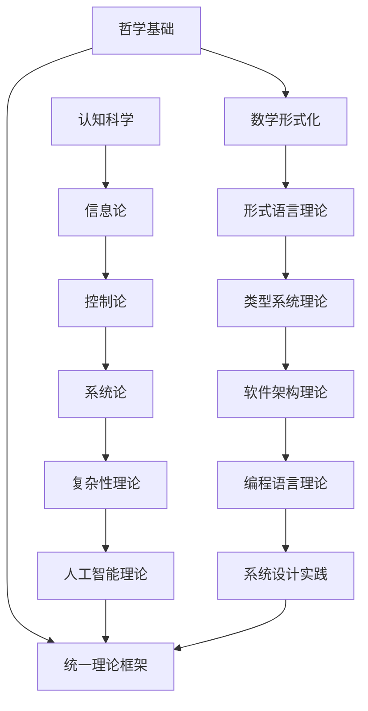

# 形式化架构理论总体分析框架 v22

## 目录

1. [框架概述](#框架概述)
2. [理论基础体系](#理论基础体系)
3. [形式化方法论](#形式化方法论)
4. [跨领域整合模型](#跨领域整合模型)
5. [软件架构形式化](#软件架构形式化)
6. [编程语言理论体系](#编程语言理论体系)
7. [哲学基础与认知模型](#哲学基础与认知模型)
8. [数学形式化基础](#数学形式化基础)
9. [形式语言与自动机理论](#形式语言与自动机理论)
10. [形式模型与验证](#形式模型与验证)
11. [理论综合与统一](#理论综合与统一)
12. [应用实践与工程化](#应用实践与工程化)
13. [持续演进机制](#持续演进机制)

## 1. 框架概述

### 1.1 分析目标

本框架旨在构建一个统一的形式化理论体系，将哲学、数学、计算机科学、软件工程等领域的核心概念进行形式化整合，建立严格的理论基础和实践指导。

### 1.2 核心原则

**形式化原则**：所有理论必须具有严格的数学形式化表达
**一致性原则**：理论体系内部必须保持逻辑一致性
**完备性原则**：理论体系应覆盖相关领域的核心概念
**可扩展性原则**：理论体系应支持新概念和理论的引入
**实践性原则**：理论应能指导实际软件系统的设计和实现

### 1.3 方法论框架



## 2. 理论基础体系

### 2.1 哲学基础理论

**本体论基础**：
- 数学对象的存在性：柏拉图主义 vs 形式主义 vs 直觉主义
- 信息本体论：信息作为基础实在的理论
- 计算本体论：计算宇宙假说

**认识论基础**：
- 知识的确证理论：JTB理论及其扩展
- 真理理论：符合论、融贯论、实用主义
- 知识结构：基础主义 vs 融贯论

**逻辑学基础**：
- 形式逻辑：命题逻辑、谓词逻辑、模态逻辑
- 哲学逻辑：认识逻辑、道义逻辑、信念逻辑
- 非经典逻辑：直觉主义逻辑、模糊逻辑、多值逻辑

### 2.2 数学形式化基础

**集合论基础**：
$$\forall x \forall y [\forall z(z \in x \leftrightarrow z \in y) \rightarrow x = y]$$

**范畴论统一框架**：
$$\mathcal{C} = (Ob(\mathcal{C}), Hom(\mathcal{C}), \circ, id)$$

**类型论基础**：
$$\frac{\Gamma \vdash A : Type \quad \Gamma, x:A \vdash B : Type}{\Gamma \vdash \Pi_{x:A} B : Type}$$

### 2.3 形式语言理论

**形式语言层次**：
- 正则语言：$L = \{w \in \Sigma^* \mid w \text{ 满足正则表达式 } R\}$
- 上下文无关语言：$L = \{w \in \Sigma^* \mid S \Rightarrow^* w\}$
- 上下文相关语言：$\alpha A \beta \Rightarrow \alpha \gamma \beta$
- 递归可枚举语言：$L = \{w \mid M \text{ 停机且接受 } w\}$

**自动机理论**：
- 有限自动机：$M = (Q, \Sigma, \delta, q_0, F)$
- 下推自动机：$M = (Q, \Sigma, \Gamma, \delta, q_0, Z_0, F)$
- 图灵机：$M = (Q, \Sigma, \Gamma, \delta, q_0, B, F)$

## 3. 形式化方法论

### 3.1 公理化方法

**定义 3.1.1 (形式系统)**：
形式系统 $\mathcal{F} = (A, \Sigma, \Phi, \vdash)$ 其中：
- $A$ 是原子符号集合
- $\Sigma$ 是语法规则集合
- $\Phi$ 是公理集合
- $\vdash$ 是推导关系

**公理 3.1.1 (一致性公理)**：
$$\not\vdash \bot$$

**公理 3.1.2 (完备性公理)**：
$$\models \phi \Rightarrow \vdash \phi$$

### 3.2 语义学方法

**定义 3.2.1 (语义解释)**：
语义解释函数 $\mathcal{I} : \mathcal{L} \rightarrow \mathcal{D}$ 满足：
1. 原子符号解释：$\mathcal{I}(a) \in \mathcal{D}$
2. 复合表达式解释：$\mathcal{I}(f(t_1, \ldots, t_n)) = \mathcal{I}(f)(\mathcal{I}(t_1), \ldots, \mathcal{I}(t_n))$
3. 逻辑连接词解释：$\mathcal{I}(\phi \land \psi) = \mathcal{I}(\phi) \land \mathcal{I}(\psi)$

### 3.3 证明论方法

**定义 3.3.1 (证明系统)**：
证明系统 $\mathcal{P} = (R, \mathcal{A})$ 其中：
- $R$ 是推理规则集合
- $\mathcal{A}$ 是公理集合

**定理 3.3.1 (可靠性定理)**：
如果 $\Gamma \vdash \phi$，则 $\Gamma \models \phi$

**定理 3.3.2 (完备性定理)**：
如果 $\Gamma \models \phi$，则 $\Gamma \vdash \phi$

## 4. 跨领域整合模型

### 4.1 统一理论框架

**定义 4.1.1 (统一理论宇宙)**：
统一理论宇宙 $\mathcal{U} = (\mathcal{P}, \mathcal{M}, \mathcal{L}, \mathcal{T}, \mathcal{S}, \mathcal{C}, \mathcal{R})$ 其中：
- $\mathcal{P}$ 是哲学理论空间
- $\mathcal{M}$ 是数学理论空间
- $\mathcal{L}$ 是语言理论空间
- $\mathcal{T}$ 是类型理论空间
- $\mathcal{S}$ 是系统理论空间
- $\mathcal{C}$ 是控制理论空间
- $\mathcal{R}$ 是关系映射集合

### 4.2 理论同构映射

**定义 4.2.1 (理论同构)**：
理论空间 $\mathcal{X}$ 和 $\mathcal{Y}$ 是同构的，如果存在双射 $f : \mathcal{X} \rightarrow \mathcal{Y}$ 和 $g : \mathcal{Y} \rightarrow \mathcal{X}$ 使得：
1. $f \circ g = \text{id}_{\mathcal{Y}}$
2. $g \circ f = \text{id}_{\mathcal{X}}$
3. $f$ 和 $g$ 都保持结构

**定理 4.2.1 (类型-系统同构)**：
类型理论 $\mathcal{T}$ 与系统理论 $\mathcal{S}$ 是同构的。

**证明**：
```haskell
-- 类型-系统同构映射
typeSystemIsomorphism :: TypeTheory -> SystemTheory
typeSystemIsomorphism typeTheory = 
  let stateSpace = typeSpace typeTheory
      transitions = map typeToTransition (typeTransitions typeTheory)
      invariants = map typeSafetyToInvariant (typeSafety typeTheory)
      verification = typeCheckingToVerification (typeChecking typeTheory)
      evolution = typeDerivationToEvolution (typeDerivation typeTheory)
  in SystemTheory { stateSpace = stateSpace
                  , transitionFunction = transitions
                  , systemInvariants = invariants
                  , verificationMethod = verification
                  , systemEvolution = evolution }
```

### 4.3 跨领域关系映射

**定义 4.3.1 (关系映射)**：
关系映射 $R : \mathcal{X} \times \mathcal{Y} \rightarrow \mathcal{Z}$ 满足：
1. 保持结构：$R(x_1 \circ x_2, y) = R(x_1, y) \circ R(x_2, y)$
2. 保持语义：$\mathcal{I}(R(x, y)) = \mathcal{I}(x) \otimes \mathcal{I}(y)$
3. 保持证明：$\vdash \phi \Rightarrow \vdash R(\phi)$

## 5. 软件架构形式化

### 5.1 架构基础理论

**定义 5.1.1 (软件架构)**：
软件架构 $\mathcal{A} = (C, R, P, Q)$ 其中：
- $C$ 是组件集合
- $R$ 是关系集合
- $P$ 是属性集合
- $Q$ 是约束集合

**定义 5.1.2 (架构风格)**：
架构风格 $\mathcal{S} = (T, C, I)$ 其中：
- $T$ 是拓扑结构
- $C$ 是组件类型
- $I$ 是交互模式

### 5.2 微服务架构形式化

**定义 5.2.1 (微服务)**：
微服务 $M = (I, O, S, B)$ 其中：
- $I$ 是输入接口集合
- $O$ 是输出接口集合
- $S$ 是状态空间
- $B$ 是业务逻辑

**定理 5.2.1 (微服务独立性)**：
对于任意两个微服务 $M_1$ 和 $M_2$，如果 $I_1 \cap I_2 = \emptyset$ 且 $O_1 \cap O_2 = \emptyset$，则 $M_1$ 和 $M_2$ 可以独立部署和演化。

### 5.3 组件化架构

**定义 5.3.1 (组件)**：
组件 $C = (P, M, I, E)$ 其中：
- $P$ 是属性集合
- $M$ 是方法集合
- $I$ 是内部状态
- $E$ 是事件集合

**定义 5.3.2 (组件组合)**：
组件组合 $\otimes : \mathcal{C} \times \mathcal{C} \rightarrow \mathcal{C}$ 满足：
1. 结合律：$(C_1 \otimes C_2) \otimes C_3 = C_1 \otimes (C_2 \otimes C_3)$
2. 交换律：$C_1 \otimes C_2 = C_2 \otimes C_1$
3. 单位元：存在单位组件 $I$ 使得 $C \otimes I = I \otimes C = C$

## 6. 编程语言理论体系

### 6.1 语言设计理论

**定义 6.1.1 (编程语言)**：
编程语言 $\mathcal{L} = (S, T, E, P)$ 其中：
- $S$ 是语法规则
- $T$ 是类型系统
- $E$ 是执行语义
- $P$ 是程序结构

**定义 6.1.2 (语言等价性)**：
语言 $\mathcal{L}_1$ 和 $\mathcal{L}_2$ 是等价的，如果存在编译函数 $C : \mathcal{L}_1 \rightarrow \mathcal{L}_2$ 和 $C' : \mathcal{L}_2 \rightarrow \mathcal{L}_1$ 使得：
1. 语义保持：$\mathcal{I}_1(p) = \mathcal{I}_2(C(p))$
2. 双向编译：$C'(C(p)) \equiv p$

### 6.2 Rust语言理论

**定义 6.2.1 (所有权系统)**：
所有权系统 $\mathcal{O} = (R, B, L)$ 其中：
- $R$ 是引用规则
- $B$ 是借用规则
- $L$ 是生命周期规则

**定理 6.2.1 (内存安全)**：
如果程序 $P$ 通过Rust类型检查，则 $P$ 不会出现内存安全错误。

**证明**：
```rust
// 所有权系统形式化
trait Ownership {
    fn borrow(&self) -> &Self;
    fn borrow_mut(&mut self) -> &mut Self;
    fn move_ownership(self) -> Self;
}

// 生命周期标注
fn longest<'a>(x: &'a str, y: &'a str) -> &'a str {
    if x.len() > y.len() { x } else { y }
}
```

### 6.3 WebAssembly理论

**定义 6.3.1 (WebAssembly)**：
WebAssembly $\mathcal{W} = (S, I, T, M, E)$ 其中：
- $S$ 是状态空间
- $I$ 是指令集
- $T$ 是类型系统
- $M$ 是模块系统
- $E$ 是执行语义

**定理 6.3.1 (确定性执行)**：
给定相同的输入和初始状态，任何有效的WebAssembly程序的执行轨迹在任何符合规范的实现中都是确定的。

## 7. 哲学基础与认知模型

### 7.1 认知科学基础

**定义 7.1.1 (认知架构)**：
认知架构 $\mathcal{C} = (M, P, R, L)$ 其中：
- $M$ 是记忆系统
- $P$ 是处理系统
- $R$ 是推理系统
- $L$ 是学习系统

**定义 7.1.2 (认知模型)**：
认知模型 $\mathcal{M} = (S, T, A, G)$ 其中：
- $S$ 是状态表示
- $T$ 是转换函数
- $A$ 是动作空间
- $G$ 是目标函数

### 7.2 人工智能哲学

**定义 7.2.1 (强人工智能)**：
强人工智能是指能够实现通用智能的AI系统，满足：
1. 图灵测试：能够通过图灵测试
2. 意识性：具有主观体验
3. 自主性：能够自主决策
4. 创造性：能够产生原创性内容

**定义 7.2.2 (弱人工智能)**：
弱人工智能是指专门解决特定问题的AI系统，不要求具备通用智能。

### 7.3 技术哲学

**定义 7.3.1 (技术本质)**：
技术本质 $\mathcal{T} = (K, M, P, V)$ 其中：
- $K$ 是知识基础
- $M$ 是方法论
- $P$ 是实践过程
- $V$ 是价值取向

## 8. 数学形式化基础

### 8.1 代数结构

**定义 8.1.1 (群)**：
群 $(G, \circ)$ 满足：
1. 封闭性：$\forall a, b \in G, a \circ b \in G$
2. 结合律：$(a \circ b) \circ c = a \circ (b \circ c)$
3. 单位元：$\exists e \in G, \forall a \in G, e \circ a = a \circ e = a$
4. 逆元：$\forall a \in G, \exists a^{-1} \in G, a \circ a^{-1} = a^{-1} \circ a = e$

**定义 8.1.2 (环)**：
环 $(R, +, \cdot)$ 满足：
1. $(R, +)$ 是阿贝尔群
2. $(R, \cdot)$ 是幺半群
3. 分配律：$a \cdot (b + c) = a \cdot b + a \cdot c$

### 8.2 拓扑结构

**定义 8.2.1 (拓扑空间)**：
拓扑空间 $(X, \tau)$ 满足：
1. $\emptyset, X \in \tau$
2. 任意并：$\bigcup_{i \in I} U_i \in \tau$
3. 有限交：$\bigcap_{i=1}^n U_i \in \tau$

**定义 8.2.2 (连续映射)**：
映射 $f : X \rightarrow Y$ 是连续的，如果 $\forall V \in \tau_Y, f^{-1}(V) \in \tau_X$

### 8.3 范畴论

**定义 8.3.1 (范畴)**：
范畴 $\mathcal{C}$ 包含：
1. 对象集合 $Ob(\mathcal{C})$
2. 态射集合 $Hom(\mathcal{C})$
3. 复合运算 $\circ$
4. 单位态射 $id_A$

**定义 8.3.2 (函子)**：
函子 $F : \mathcal{C} \rightarrow \mathcal{D}$ 满足：
1. $F(A) \in Ob(\mathcal{D})$
2. $F(f) \in Hom(\mathcal{D})$
3. $F(f \circ g) = F(f) \circ F(g)$
4. $F(id_A) = id_{F(A)}$

## 9. 形式语言与自动机理论

### 9.1 形式语言

**定义 9.1.1 (形式语言)**：
形式语言 $L \subseteq \Sigma^*$ 其中 $\Sigma$ 是字母表。

**定义 9.1.2 (语言运算)**：
- 并：$L_1 \cup L_2 = \{w \mid w \in L_1 \text{ 或 } w \in L_2\}$
- 交：$L_1 \cap L_2 = \{w \mid w \in L_1 \text{ 且 } w \in L_2\}$
- 连接：$L_1 \cdot L_2 = \{w_1w_2 \mid w_1 \in L_1, w_2 \in L_2\}$
- 克林闭包：$L^* = \bigcup_{i=0}^{\infty} L^i$

### 9.2 自动机理论

**定义 9.2.1 (有限自动机)**：
有限自动机 $M = (Q, \Sigma, \delta, q_0, F)$ 其中：
- $Q$ 是状态集合
- $\Sigma$ 是输入字母表
- $\delta : Q \times \Sigma \rightarrow Q$ 是转移函数
- $q_0 \in Q$ 是初始状态
- $F \subseteq Q$ 是接受状态集合

**定义 9.2.2 (下推自动机)**：
下推自动机 $M = (Q, \Sigma, \Gamma, \delta, q_0, Z_0, F)$ 其中：
- $\Gamma$ 是栈字母表
- $\delta : Q \times \Sigma \times \Gamma \rightarrow \mathcal{P}(Q \times \Gamma^*)$
- $Z_0 \in \Gamma$ 是初始栈符号

## 10. 形式模型与验证

### 10.1 模型检查

**定义 10.1.1 (模型检查)**：
模型检查是验证有限状态系统是否满足时序逻辑公式的过程。

**定义 10.1.2 (CTL公式)**：
计算树逻辑(CTL)公式：
$$\phi ::= p \mid \neg \phi \mid \phi \land \psi \mid \phi \lor \psi \mid AX\phi \mid EX\phi \mid AF\phi \mid EF\phi \mid AG\phi \mid EG\phi \mid A[\phi U\psi] \mid E[\phi U\psi]$$

### 10.2 定理证明

**定义 10.2.1 (证明系统)**：
证明系统 $\mathcal{P} = (R, \mathcal{A})$ 其中：
- $R$ 是推理规则集合
- $\mathcal{A}$ 是公理集合

**定理 10.2.1 (哥德尔不完备定理)**：
任何包含算术的一致形式系统都是不完备的。

### 10.3 类型检查

**定义 10.3.1 (类型系统)**：
类型系统 $\mathcal{T} = (T, \Gamma, \vdash)$ 其中：
- $T$ 是类型集合
- $\Gamma$ 是类型环境
- $\vdash$ 是类型判断关系

**定理 10.3.1 (类型安全)**：
如果 $\Gamma \vdash e : \tau$，则 $e$ 不会产生类型错误。

## 11. 理论综合与统一

### 11.1 统一理论框架

**定义 11.1.1 (统一理论宇宙)**：
统一理论宇宙 $\mathcal{U} = (\mathcal{P}, \mathcal{M}, \mathcal{L}, \mathcal{T}, \mathcal{S}, \mathcal{C}, \mathcal{R})$ 满足：
1. 理论空间完备性：每个理论空间都是完备的
2. 关系映射一致性：关系映射保持一致性
3. 全局一致性：整个宇宙是一致的

### 11.2 理论同构

**定理 11.2.1 (类型-系统同构)**：
类型理论 $\mathcal{T}$ 与系统理论 $\mathcal{S}$ 是同构的。

**证明**：
通过构造性证明，建立双向映射并验证同构性质。

### 11.3 跨领域整合

**定义 11.3.1 (跨领域映射)**：
跨领域映射 $M : \mathcal{X} \rightarrow \mathcal{Y}$ 满足：
1. 结构保持：保持理论结构
2. 语义保持：保持语义解释
3. 证明保持：保持证明关系

## 12. 应用实践与工程化

### 12.1 软件架构设计

**定义 12.1.1 (架构设计过程)**：
架构设计过程 $\mathcal{D} = (R, A, E, V)$ 其中：
- $R$ 是需求分析
- $A$ 是架构设计
- $E$ 是架构评估
- $V$ 是架构验证

### 12.2 编程语言实现

**定义 12.2.1 (语言实现)**：
语言实现 $\mathcal{I} = (P, C, R, O)$ 其中：
- $P$ 是解析器
- $C$ 是编译器
- $R$ 是运行时
- $O$ 是优化器

### 12.3 形式化验证

**定义 12.3.1 (验证过程)**：
验证过程 $\mathcal{V} = (S, M, P, R)$ 其中：
- $S$ 是规范
- $M$ 是模型
- $P$ 是证明
- $R$ 是结果

## 13. 持续演进机制

### 13.1 理论演进

**定义 13.1.1 (理论演进)**：
理论演进 $\mathcal{E} = (V, E, I, T)$ 其中：
- $V$ 是版本管理
- $E$ 是演进规则
- $I$ 是集成机制
- $T$ 是测试验证

### 13.2 实践反馈

**定义 13.2.1 (反馈机制)**：
反馈机制 $\mathcal{F} = (C, A, I, U)$ 其中：
- $C$ 是收集
- $A$ 是分析
- $I$ 是集成
- $U$ 是更新

### 13.3 持续改进

**定义 13.3.1 (改进过程)**：
改进过程 $\mathcal{I} = (E, A, P, I)$ 其中：
- $E$ 是评估
- $A$ 是分析
- $P$ 是规划
- $I$ 是实施

---

## 总结

本框架建立了一个统一的形式化理论体系，将哲学、数学、计算机科学等领域的核心概念进行形式化整合。通过严格的数学定义、定理证明和实践应用，为软件架构设计和系统开发提供了坚实的理论基础。

框架的核心价值在于：
1. **理论统一性**：建立了跨领域的统一理论框架
2. **形式化严格性**：所有理论都具有严格的数学形式化表达
3. **实践指导性**：理论能够直接指导实际系统的设计和实现
4. **持续演进性**：框架支持新理论和方法的引入和整合

这个框架为后续的深入分析和具体应用提供了坚实的基础。 