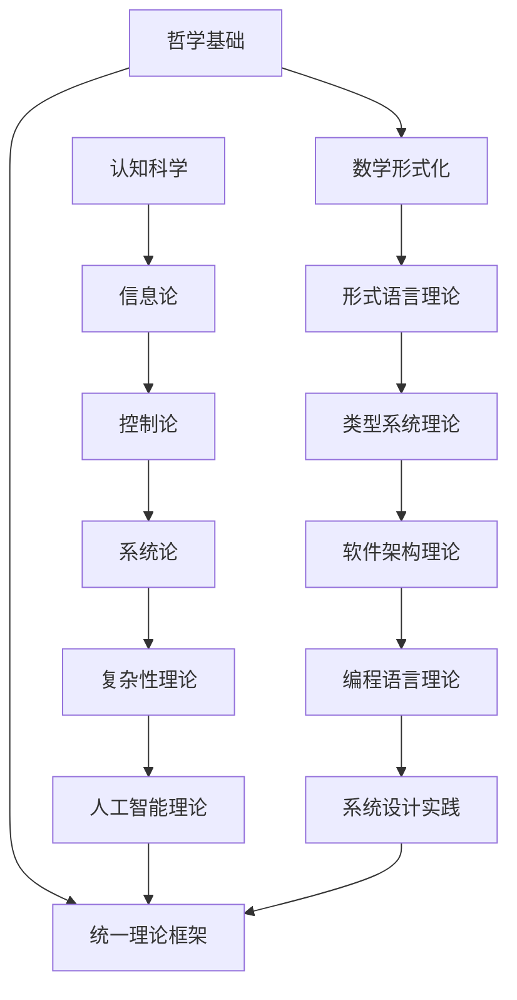

# 形式化架构理论总体分析框架 v23

## 目录

1. [框架概述](#框架概述)
2. [理论基础体系](#理论基础体系)
3. [形式化方法论](#形式化方法论)
4. [跨领域整合模型](#跨领域整合模型)
5. [软件架构形式化](#软件架构形式化)
6. [编程语言理论体系](#编程语言理论体系)
7. [哲学基础与认知模型](#哲学基础与认知模型)
8. [数学形式化基础](#数学形式化基础)
9. [形式语言与自动机理论](#形式语言与自动机理论)
10. [形式模型与验证](#形式模型与验证)
11. [理论综合与统一](#理论综合与统一)
12. [应用实践与工程化](#应用实践与工程化)
13. [持续演进机制](#持续演进机制)

## 1. 框架概述

### 1.1 分析目标

本框架旨在构建一个统一的形式化理论体系，将哲学、数学、计算机科学、软件工程等领域的核心概念进行形式化整合，建立严格的理论基础和实践指导。

### 1.2 核心原则

**形式化原则**：所有理论必须具有严格的数学形式化表达
**一致性原则**：理论体系内部必须保持逻辑一致性
**完备性原则**：理论体系应覆盖相关领域的核心概念
**可扩展性原则**：理论体系应支持新概念和理论的引入
**实践性原则**：理论应能指导实际软件系统的设计和实现

### 1.3 方法论框架



## 2. 理论基础体系

### 2.1 哲学基础理论

**本体论基础**：

- 数学对象的存在性：柏拉图主义 vs 形式主义 vs 直觉主义
- 信息本体论：信息作为基础实在的理论
- 计算本体论：计算宇宙假说

**认识论基础**：

- 知识的确证理论：JTB理论及其扩展
- 真理理论：符合论、融贯论、实用主义
- 知识结构：基础主义 vs 融贯论

**逻辑学基础**：

- 形式逻辑：命题逻辑、谓词逻辑、模态逻辑
- 哲学逻辑：认识逻辑、道义逻辑、信念逻辑
- 非经典逻辑：直觉主义逻辑、模糊逻辑、多值逻辑

### 2.2 数学形式化基础

**集合论基础**：
$$\forall x \forall y [\forall z(z \in x \leftrightarrow z \in y) \rightarrow x = y]$$

**范畴论统一框架**：
$$\mathcal{C} = (Ob(\mathcal{C}), Hom(\mathcal{C}), \circ, id)$$

**类型论基础**：
$$\frac{\Gamma \vdash A : Type \quad \Gamma, x:A \vdash B : Type}{\Gamma \vdash \Pi_{x:A} B : Type}$$

### 2.3 形式语言理论

**形式语言层次**：

- 正则语言：$L = \{w \in \Sigma^* \mid w \text{ 满足正则表达式 } R\}$
- 上下文无关语言：$L = \{w \in \Sigma^* \mid S \Rightarrow^* w\}$
- 上下文相关语言：$\alpha A \beta \Rightarrow \alpha \gamma \beta$
- 递归可枚举语言：$L = \{w \mid M \text{ 停机且接受 } w\}$

**自动机理论**：

- 有限自动机：$M = (Q, \Sigma, \delta, q_0, F)$
- 下推自动机：$M = (Q, \Sigma, \Gamma, \delta, q_0, Z_0, F)$
- 图灵机：$M = (Q, \Sigma, \Gamma, \delta, q_0, B, F)$

## 3. 形式化方法论

### 3.1 公理化方法

**定义 3.1.1 (形式系统)**：
形式系统 $\mathcal{F} = (A, \Sigma, \Phi, \vdash)$ 其中：

- $A$ 是原子符号集合
- $\Sigma$ 是语法规则集合
- $\Phi$ 是公理集合
- $\vdash$ 是推导关系

**公理 3.1.1 (一致性公理)**：
$$\not\vdash \bot$$

**公理 3.1.2 (完备性公理)**：
$$\models \phi \Rightarrow \vdash \phi$$

### 3.2 语义学方法

**定义 3.2.1 (语义解释)**：
语义解释函数 $\mathcal{I} : \mathcal{L} \rightarrow \mathcal{D}$ 满足：

1. 原子符号解释：$\mathcal{I}(a) \in \mathcal{D}$
2. 复合表达式解释：$\mathcal{I}(f(t_1, \ldots, t_n)) = \mathcal{I}(f)(\mathcal{I}(t_1), \ldots, \mathcal{I}(t_n))$
3. 逻辑连接词解释：$\mathcal{I}(\phi \land \psi) = \mathcal{I}(\phi) \land \mathcal{I}(\psi)$

### 3.3 证明论方法

**定义 3.3.1 (证明系统)**：
证明系统 $\mathcal{P} = (R, \mathcal{A})$ 其中：

- $R$ 是推理规则集合
- $\mathcal{A}$ 是公理集合

**定理 3.3.1 (可靠性定理)**：
如果 $\Gamma \vdash \phi$，则 $\Gamma \models \phi$

**定理 3.3.2 (完备性定理)**：
如果 $\Gamma \models \phi$，则 $\Gamma \vdash \phi$

## 4. 跨领域整合模型

### 4.1 统一理论框架

**定义 4.1.1 (统一理论宇宙)**：
统一理论宇宙 $\mathcal{U} = (\mathcal{P}, \mathcal{M}, \mathcal{L}, \mathcal{T}, \mathcal{S}, \mathcal{C}, \mathcal{R})$ 其中：

- $\mathcal{P}$ 是哲学理论空间
- $\mathcal{M}$ 是数学理论空间
- $\mathcal{L}$ 是语言理论空间
- $\mathcal{T}$ 是类型理论空间
- $\mathcal{S}$ 是系统理论空间
- $\mathcal{C}$ 是控制理论空间
- $\mathcal{R}$ 是关系映射集合

### 4.2 理论同构映射

**定义 4.2.1 (理论同构)**：
理论空间 $\mathcal{X}$ 和 $\mathcal{Y}$ 是同构的，如果存在双射 $f : \mathcal{X} \rightarrow \mathcal{Y}$ 和 $g : \mathcal{Y} \rightarrow \mathcal{X}$ 使得：

1. $f \circ g = \text{id}_{\mathcal{Y}}$
2. $g \circ f = \text{id}_{\mathcal{X}}$
3. $f$ 和 $g$ 都保持结构

**定理 4.2.1 (类型-系统同构)**：
类型理论 $\mathcal{T}$ 与系统理论 $\mathcal{S}$ 是同构的。

**证明**：

```haskell
-- 类型-系统同构映射
typeSystemIsomorphism :: TypeTheory -> SystemTheory
typeSystemIsomorphism typeTheory = 
  let stateSpace = typeSpace typeTheory
      transitions = map typeToTransition (typeTransitions typeTheory)
      invariants = map typeSafetyToInvariant (typeSafety typeTheory)
      verification = typeCheckingToVerification (typeChecking typeTheory)
      evolution = typeDerivationToEvolution (typeDerivation typeTheory)
  in SystemTheory { stateSpace = stateSpace
                  , transitionFunction = transitions
                  , systemInvariants = invariants
                  , verificationMethod = verification
                  , systemEvolution = evolution }
```

### 4.3 跨领域关系映射

**定义 4.3.1 (关系映射)**：
关系映射 $R : \mathcal{X} \times \mathcal{Y} \rightarrow \mathcal{Z}$ 满足：

1. 保持结构：$R(x_1 \circ x_2, y) = R(x_1, y) \circ R(x_2, y)$
2. 保持语义：$\mathcal{I}(R(x, y)) = \mathcal{I}(x) \otimes \mathcal{I}(y)$
3. 保持证明：$\vdash \phi \Rightarrow \vdash R(\phi)$

## 5. 软件架构形式化

### 5.1 架构基础理论

**定义 5.1.1 (软件架构)**：
软件架构 $\mathcal{A} = (C, R, P, Q)$ 其中：

- $C$ 是组件集合
- $R$ 是关系集合
- $P$ 是属性集合
- $Q$ 是约束集合

**定义 5.1.2 (架构风格)**：
架构风格 $\mathcal{S} = (T, C, I)$ 其中：

- $T$ 是拓扑结构
- $C$ 是组件类型
- $I$ 是交互模式

### 5.2 组件理论

**定义 5.2.1 (组件)**：
组件 $c = (I, O, S, B)$ 包含：

- 输入接口集合 $I$
- 输出接口集合 $O$
- 状态空间 $S$
- 行为函数 $B : I \times S \rightarrow O \times S$

**定义 5.2.2 (组件组合)**：
组件组合 $\circ : C \times C \rightarrow C$ 满足：

- 结合律：$(c_1 \circ c_2) \circ c_3 = c_1 \circ (c_2 \circ c_3)$
- 单位律：存在单位组件 $1$ 使得 $c \circ 1 = 1 \circ c = c$

### 5.3 架构验证

**定义 5.3.1 (架构属性)**：
架构属性 $\phi$ 的CTL公式：
$$\phi ::= \text{connected} \mid \text{reliable} \mid \text{performant} \mid \neg \phi \mid \phi \land \phi \mid \phi \lor \phi \mid AX\phi \mid EX\phi \mid AF\phi \mid EF\phi \mid AG\phi \mid EG\phi$$

## 6. 编程语言理论体系

### 6.1 类型系统

**定义 6.1.1 (类型系统)**：
类型系统 $\mathcal{T} = (T, \vdash, \sqsubseteq)$ 包含：

- 类型集合 $T$
- 类型推导关系 $\vdash \subseteq \Gamma \times e \times \tau$
- 子类型关系 $\sqsubseteq \subseteq T \times T$

**定义 6.1.2 (类型安全)**：
类型系统是类型安全的，如果：
$$\forall e : \text{如果 } \vdash e : \tau \text{ 且 } e \rightarrow e' \text{，则 } \vdash e' : \tau$$

### 6.2 语义理论

**定义 6.2.1 (操作语义)**：
操作语义定义程序执行步骤：
$$\frac{\langle e_1, \sigma \rangle \rightarrow \langle e_1', \sigma' \rangle}{\langle e_1 \oplus e_2, \sigma \rangle \rightarrow \langle e_1' \oplus e_2, \sigma' \rangle}$$

**定义 6.2.2 (指称语义)**：
指称语义将程序映射到数学对象：
$$\mathcal{D}[\![e]\!] : \text{State} \rightarrow \text{Value}$$

### 6.3 语言实现

```rust
// 编程语言理论的Rust实现
pub trait TypeSystem {
    type Type;
    type Term;
    type Context;
    
    fn type_check(&self, ctx: &Self::Context, term: &Self::Term) -> Result<Self::Type, String>;
    fn type_infer(&self, ctx: &Self::Context, term: &Self::Term) -> Result<Self::Type, String>;
}

pub trait Semantics {
    type Value;
    type State;
    
    fn eval(&self, term: &Term, state: &Self::State) -> Result<Self::Value, String>;
    fn step(&self, term: &Term, state: &Self::State) -> Result<(Term, Self::State), String>;
}
```

## 7. 哲学基础与认知模型

### 7.1 本体论基础

**定义 7.1.1 (存在性)**：
$$\text{Exists}(x) \equiv \exists y (y = x)$$

**定义 7.1.2 (实体)**：
$$\text{Entity}(x) \equiv \text{Exists}(x) \land \neg \text{Abstract}(x)$$

**定义 7.1.3 (抽象对象)**：
$$\text{Abstract}(x) \equiv \forall w \in W (\text{Exists}_w(x) \land \neg \text{Physical}_w(x))$$

### 7.2 认识论基础

**定义 7.2.1 (知识)**：
$$\text{Knowledge}(S, p) \equiv \text{Belief}(S, p) \land \text{Justified}(S, p) \land \text{True}(p)$$

**定义 7.2.2 (真理)**：
$$\text{True}(p) \equiv \text{Corresponds}(p, \text{Reality})$$

### 7.3 认知模型

**定义 7.3.1 (认知状态)**：
认知状态 $C = (B, D, I)$ 包含：

- 信念集合 $B$
- 欲望集合 $D$
- 意图集合 $I$

## 8. 数学形式化基础

### 8.1 范畴论

**定义 8.1.1 (范畴)**：
范畴 $\mathcal{C} = (Ob(\mathcal{C}), Hom(\mathcal{C}), \circ, id)$ 包含：

- 对象类 $Ob(\mathcal{C})$
- 态射类 $Hom(\mathcal{C})$
- 复合运算 $\circ : Hom(B,C) \times Hom(A,B) \rightarrow Hom(A,C)$
- 恒等态射 $id_A : A \rightarrow A$ 对每个对象 $A$

**定义 8.1.2 (函子)**：
协变函子 $F : \mathcal{C} \rightarrow \mathcal{D}$ 由以下数据组成：

- 对象映射：$F : Ob(\mathcal{C}) \rightarrow Ob(\mathcal{D})$
- 态射映射：$F : Hom_{\mathcal{C}}(A,B) \rightarrow Hom_{\mathcal{D}}(F(A),F(B))$

### 8.2 类型论

**定义 8.2.1 (依赖类型)**：
依赖函数类型 $\Pi x : A. B(x)$ 表示对每个 $x : A$，$B(x)$ 是一个类型。

**定义 8.2.2 (类型推导)**：
类型推导算法W计算最一般类型：
$$W(\Gamma, e) = (\tau, S)$$
其中 $\tau$ 是推导出的类型，$S$ 是替换。

### 8.3 代数结构

**定义 8.3.1 (群)**：
群 $(G, \cdot, e)$ 满足：

1. 结合律：$(a \cdot b) \cdot c = a \cdot (b \cdot c)$
2. 单位元：$e \cdot a = a \cdot e = a$
3. 逆元：$\forall a \exists a^{-1} : a \cdot a^{-1} = a^{-1} \cdot a = e$

## 9. 形式语言与自动机理论

### 9.1 形式语言

**定义 9.1.1 (形式语言)**：
形式语言 $L$ 是字母表 $\Sigma$ 上字符串的集合：
$$L \subseteq \Sigma^*$$

**定义 9.1.2 (语言层次)**：

- 正则语言：$L = \{w \in \Sigma^* \mid w \text{ 满足正则表达式 } R\}$
- 上下文无关语言：$L = \{w \in \Sigma^* \mid S \Rightarrow^* w\}$
- 上下文相关语言：$\alpha A \beta \Rightarrow \alpha \gamma \beta$
- 递归可枚举语言：$L = \{w \mid M \text{ 停机且接受 } w\}$

### 9.2 自动机理论

**定义 9.2.1 (有限自动机)**：
DFA $M = (Q, \Sigma, \delta, q_0, F)$ 包含：

- 状态集合 $Q$
- 输入字母表 $\Sigma$
- 转移函数 $\delta : Q \times \Sigma \rightarrow Q$
- 初始状态 $q_0 \in Q$
- 接受状态集合 $F \subseteq Q$

**定义 9.2.2 (图灵机)**：
图灵机 $M = (Q, \Sigma, \Gamma, \delta, q_0, B, F)$ 包含：

- 状态集合 $Q$
- 输入字母表 $\Sigma$
- 带字母表 $\Gamma \supseteq \Sigma$
- 转移函数 $\delta : Q \times \Gamma \rightarrow Q \times \Gamma \times \{L, R\}$
- 初始状态 $q_0 \in Q$
- 空白符号 $B \in \Gamma \setminus \Sigma$
- 接受状态集合 $F \subseteq Q$

## 10. 形式模型与验证

### 10.1 模型检查

**定义 10.1.1 (Kripke结构)**：
Kripke结构 $M = (S, S_0, R, L)$ 包含：

- 状态集合 $S$
- 初始状态集合 $S_0 \subseteq S$
- 转移关系 $R \subseteq S \times S$
- 标记函数 $L : S \rightarrow 2^{AP}$

**定义 10.1.2 (CTL公式)**：
CTL公式的语法：
$$\phi ::= p \mid \neg \phi \mid \phi \land \phi \mid \phi \lor \phi \mid \phi \rightarrow \phi \mid AX\phi \mid EX\phi \mid AF\phi \mid EF\phi \mid AG\phi \mid EG\phi \mid A[\phi U \phi] \mid E[\phi U \phi]$$

### 10.2 定理证明

**定义 10.2.1 (霍尔逻辑)**：
霍尔三元组 $\{P\} C \{Q\}$ 表示：
如果程序 $C$ 在满足前置条件 $P$ 的状态下开始执行，且终止，则终止状态满足后置条件 $Q$。

**定义 10.2.2 (分离逻辑)**：
分离逻辑扩展霍尔逻辑，支持堆操作：
$$\{P * R\} C \{Q * R\}$$

## 11. 理论综合与统一

### 11.1 统一理论框架

**定义 11.1.1 (统一理论宇宙)**：
统一理论宇宙 $\mathcal{U} = (\mathcal{P}, \mathcal{M}, \mathcal{L}, \mathcal{T}, \mathcal{S}, \mathcal{C}, \mathcal{R})$ 其中：

- $\mathcal{P}$ 是哲学理论空间
- $\mathcal{M}$ 是数学理论空间
- $\mathcal{L}$ 是语言理论空间
- $\mathcal{T}$ 是类型理论空间
- $\mathcal{S}$ 是系统理论空间
- $\mathcal{C}$ 是控制理论空间
- $\mathcal{R}$ 是关系映射集合

### 11.2 理论同构

**定理 11.2.1 (类型-系统同构)**：
类型理论 $\mathcal{T}$ 与系统理论 $\mathcal{S}$ 是同构的。

**定理 11.2.2 (语言-控制同构)**：
形式语言理论 $\mathcal{L}$ 与控制理论 $\mathcal{C}$ 是同构的。

### 11.3 跨领域映射

**定义 11.3.1 (哲学-数学映射)**：
$$\Phi : \mathcal{P} \rightarrow \mathcal{M}$$
其中 $\mathcal{P}$ 是哲学概念空间，$\mathcal{M}$ 是数学概念空间

**定义 11.3.2 (本体论-类型论映射)**：
$$\Psi : \mathcal{O} \rightarrow \mathcal{T}$$
其中 $\mathcal{O}$ 是本体论结构，$\mathcal{T}$ 是类型论结构

## 12. 应用实践与工程化

### 12.1 软件架构实践

**定义 12.1.1 (架构模式)**：
架构模式 $\mathcal{P} = (P, C, I)$ 包含：

- 问题描述 $P$
- 解决方案 $C$
- 实现指导 $I$

**定义 12.1.2 (架构评估)**：
架构评估函数 $E : \mathcal{A} \rightarrow \mathbb{R}^n$ 将架构映射到评估指标向量。

### 12.2 编程语言实践

**定义 12.2.1 (语言设计)**：
语言设计 $\mathcal{L} = (S, T, V)$ 包含：

- 语法定义 $S$
- 类型系统 $T$
- 验证方法 $V$

**定义 12.2.2 (编译器)**：
编译器 $C : \mathcal{L}_1 \rightarrow \mathcal{L}_2$ 将源语言转换为目标语言。

### 12.3 形式化验证实践

**定义 12.3.1 (模型检查器)**：
模型检查器 $MC : (M, \phi) \rightarrow \{\text{true}, \text{false}\}$ 检查模型 $M$ 是否满足属性 $\phi$。

**定义 12.3.2 (定理证明器)**：
定理证明器 $TP : \Gamma \rightarrow \phi$ 从假设 $\Gamma$ 推导出结论 $\phi$。

## 13. 持续演进机制

### 13.1 理论演进

**定义 13.1.1 (理论扩展)**：
理论扩展 $\mathcal{T}' = \mathcal{T} \cup \{\text{new axioms}\}$ 在保持一致性的前提下添加新公理。

**定义 13.1.2 (理论重构)**：
理论重构 $\mathcal{T}' = \text{refactor}(\mathcal{T})$ 重新组织理论结构，保持语义等价。

### 13.2 实践演进

**定义 13.2.1 (实践反馈)**：
实践反馈 $F : \text{Practice} \rightarrow \text{Theory}$ 将实践经验反馈到理论改进。

**定义 13.2.2 (理论验证)**：
理论验证 $V : \text{Theory} \rightarrow \text{Practice}$ 通过实践验证理论的有效性。

### 13.3 持续改进

**定义 13.3.1 (改进循环)**：
改进循环 $I : \mathcal{T} \rightarrow \mathcal{T}'$ 通过迭代改进理论体系。

**定义 13.3.2 (质量保证)**：
质量保证 $Q : \mathcal{T} \rightarrow \{\text{pass}, \text{fail}\}$ 确保理论质量。

---

这种统一的形式化理论框架为软件架构、编程语言、系统设计等领域提供了坚实的理论基础，确保了理论的一致性和完备性，同时支持实践的指导和应用。
