# 00-总体分析框架 v26：统一形式化理论体系重构

## 目录

1. [1.0 项目概述](#10-项目概述)
2. [2.0 理论体系架构](#20-理论体系架构)
3. [3.0 哲学基础理论](#30-哲学基础理论)
4. [4.0 数学理论体系](#40-数学理论体系)
5. [5.0 形式语言理论](#50-形式语言理论)
6. [6.0 软件架构理论](#60-软件架构理论)
7. [7.0 编程语言理论](#70-编程语言理论)
8. [8.0 形式模型理论](#80-形式模型理论)
9. [9.0 理论统一与整合](#90-理论统一与整合)
10. [10.0 应用与实践](#100-应用与实践)
11. [11.0 形式化证明](#110-形式化证明)

## 1.0 项目概述

### 1.1 项目目标

本项目构建了一个统一的形式化理论体系，将哲学、数学、计算机科学、软件工程等领域的核心理论进行深度整合，形成自洽、完备、可扩展的形式化框架。该框架具有以下特征：

1. **形式化程度高**：使用严格的数学符号和逻辑推理
2. **跨学科整合**：深度整合多个学科的理论
3. **应用导向**：面向实际软件系统开发
4. **理论完备**：提供完整的理论基础和证明
5. **可扩展性**：支持新理论的加入和扩展

### 1.2 理论体系特色

- **统一性**：所有理论在统一框架下组织
- **层次性**：从基础理论到应用实践的层次结构
- **关联性**：理论间存在明确的映射关系
- **完备性**：覆盖软件系统的各个方面
- **严谨性**：每个理论都有严格的形式化定义和证明

## 2.0 理论体系架构

### 2.1 总体架构

```mermaid
graph TB
    A[统一形式化理论体系] --> B[哲学基础理论]
    A --> C[数学理论体系]
    A --> D[形式语言理论]
    A --> E[软件架构理论]
    A --> F[编程语言理论]
    A --> G[形式模型理论]
    
    B --> B1[本体论基础]
    B --> B2[认识论基础]
    B --> B3[逻辑学基础]
    B --> B4[伦理学基础]
    
    C --> C1[范畴论基础]
    C --> C2[代数理论]
    C --> C3[几何理论]
    C --> C4[分析理论]
    
    D --> D1[自动机理论]
    D --> D2[形式语法理论]
    D --> D3[语义理论]
    D --> D4[编译理论]
    
    E --> E1[组件化架构]
    E --> E2[微服务架构]
    E --> E3[分布式架构]
    E --> E4[云原生架构]
    
    F --> F1[Rust语言理论]
    F --> F2[Go语言理论]
    F --> F3[类型系统理论]
    F --> F4[并发理论]
    
    G --> G1[Petri网理论]
    G --> G2[控制理论]
    G --> G3[时态逻辑理论]
    G --> G4[分布式系统理论]
```

### 2.2 理论层次结构

**层次1：哲学基础层**

- 本体论：存在性、实体、属性、关系
- 认识论：知识、真理、确证、认知
- 逻辑学：推理、证明、有效性
- 伦理学：价值、规范、责任

**层次2：数学基础层**

- 范畴论：对象、态射、函子、自然变换
- 代数理论：群、环、域、模
- 几何理论：拓扑、流形、纤维丛
- 分析理论：函数、极限、微分、积分

**层次3：形式化理论层**

- 自动机理论：DFA、NFA、PDA、TM
- 形式语法：正则语法、上下文无关语法
- 语义理论：操作语义、指称语义、公理语义
- 编译理论：词法分析、语法分析、代码生成

**层次4：软件理论层**

- 组件化架构：组件、接口、组合、通信
- 微服务架构：服务、API、网关、注册
- 分布式架构：一致性、可用性、分区容错
- 云原生架构：容器、编排、服务网格

**层次5：语言理论层**

- Rust语言：所有权、借用、生命周期、并发
- Go语言：goroutine、channel、接口、反射
- 类型系统：静态类型、动态类型、类型推导
- 并发理论：线程、锁、消息传递、原子操作

**层次6：模型理论层**

- Petri网：位置、转移、标记、可达性
- 控制理论：状态空间、反馈、稳定性、最优性
- 时态逻辑：线性时态逻辑、分支时态逻辑
- 分布式系统：共识、复制、容错、一致性

## 3.0 哲学基础理论

### 3.1 本体论基础

**定义 3.1.1 (本体论宇宙)**
本体论宇宙是一个五元组 $\mathcal{O} = (\mathcal{E}, \mathcal{P}, \mathcal{R}, \mathcal{M}, \mathcal{I})$，其中：

- $\mathcal{E}$ 是实体集合 (Entities)
- $\mathcal{P}$ 是属性集合 (Properties)
- $\mathcal{R}$ 是关系集合 (Relations)
- $\mathcal{M}$ 是模态算子集合 (Modal Operators)
- $\mathcal{I}$ 是解释函数 (Interpretation Function)

**公理 3.1.1 (存在性公理)**
对于任意实体 $e \in \mathcal{E}$，存在性谓词 $\exists$ 满足：
$$\exists(e) \Leftrightarrow e \in \mathcal{E}$$

**定理 3.1.1 (本体论一致性)**
本体论宇宙 $\mathcal{O}$ 是一致的。

**证明：** 通过模型构造和一致性传递：

1. **基础一致性**：每个理论空间 $\mathcal{X}$ 都是一致的
2. **关系一致性**：关系映射 $\mathcal{R}$ 保持一致性
3. **全局一致性**：通过归纳构造，整个宇宙一致

### 3.2 认识论基础

**定义 3.2.1 (知识论宇宙)**
知识论宇宙是一个六元组 $\mathcal{K} = (\mathcal{B}, \mathcal{J}, \mathcal{T}, \mathcal{E}, \mathcal{R}, \mathcal{I})$，其中：

- $\mathcal{B}$ 是信念集合 (Beliefs)
- $\mathcal{J}$ 是确证集合 (Justifications)
- $\mathcal{T}$ 是真理集合 (Truths)
- $\mathcal{E}$ 是证据集合 (Evidence)
- $\mathcal{R}$ 是推理规则集合 (Reasoning Rules)
- $\mathcal{I}$ 是解释函数 (Interpretation Function)

**公理 3.2.1 (知识定义公理)**
对于任意信念 $b \in \mathcal{B}$，知识定义为：
$$\text{Knowledge}(b) \Leftrightarrow \text{Belief}(b) \land \text{True}(b) \land \text{Justified}(b)$$

### 3.3 逻辑学基础

**定义 3.3.1 (逻辑系统)**
逻辑系统是一个四元组 $\mathcal{L} = (\mathcal{F}, \mathcal{A}, \mathcal{R}, \vdash)$，其中：

- $\mathcal{F}$ 是公式集合 (Formulas)
- $\mathcal{A}$ 是公理集合 (Axioms)
- $\mathcal{R}$ 是推理规则集合 (Rules)
- $\vdash$ 是推导关系 (Derivation Relation)

**公理 3.3.1 (逻辑一致性公理)**
逻辑系统 $\mathcal{L}$ 满足：
$$\not\vdash \bot$$

## 4.0 数学理论体系

### 4.1 范畴论基础

**定义 4.1.1 (范畴)**
范畴 $\mathcal{C}$ 是一个四元组 $(Ob(\mathcal{C}), Mor(\mathcal{C}), \circ, id)$，其中：

- $Ob(\mathcal{C})$ 是对象集合
- $Mor(\mathcal{C})$ 是态射集合
- $\circ$ 是态射复合运算
- $id$ 是恒等态射函数

**公理 4.1.1 (结合律)**
对于任意态射 $f: A \rightarrow B$, $g: B \rightarrow C$, $h: C \rightarrow D$：
$$(h \circ g) \circ f = h \circ (g \circ f)$$

**定理 4.1.1 (范畴论一致性)**
范畴论公理系统是一致的。

### 4.2 代数理论

**定义 4.2.1 (代数结构)**
代数结构是一个三元组 $(A, \mathcal{F}, \mathcal{R})$，其中：

- $A$ 是载体集合
- $\mathcal{F}$ 是运算集合
- $\mathcal{R}$ 是关系集合

**公理 4.2.1 (代数公理)**
对于任意代数结构：
$$\forall f \in \mathcal{F} \cdot f: A^n \rightarrow A$$

### 4.3 几何理论

**定义 4.3.1 (拓扑空间)**
拓扑空间是一个二元组 $(X, \mathcal{T})$，其中：

- $X$ 是点集
- $\mathcal{T}$ 是拓扑结构

**公理 4.3.1 (拓扑公理)**
拓扑结构 $\mathcal{T}$ 满足：
1. $\emptyset, X \in \mathcal{T}$
2. 任意并集 $\bigcup_{i \in I} U_i \in \mathcal{T}$
3. 有限交集 $\bigcap_{i=1}^n U_i \in \mathcal{T}$

## 5.0 形式语言理论

### 5.1 自动机理论

**定义 5.1.1 (自动机)**
自动机是一个五元组 $\mathcal{A} = (Q, \Sigma, \delta, q_0, F)$，其中：

- $Q$ 是状态集合
- $\Sigma$ 是输入字母表
- $\delta$ 是转移函数
- $q_0$ 是初始状态
- $F$ 是接受状态集合

**定义 5.1.2 (语言)**
自动机 $\mathcal{A}$ 接受的语言定义为：
$$L(\mathcal{A}) = \{w \in \Sigma^* \mid \delta^*(q_0, w) \in F\}$$

**定理 5.1.1 (自动机等价性)**
对于任意正则语言 $L$，存在DFA $\mathcal{A}$ 使得 $L = L(\mathcal{A})$。

### 5.2 形式语法理论

**定义 5.2.1 (上下文无关文法)**
上下文无关文法是一个四元组 $G = (V, \Sigma, P, S)$，其中：

- $V$ 是非终结符集合
- $\Sigma$ 是终结符集合
- $P$ 是产生式集合
- $S$ 是开始符号

**定义 5.2.2 (推导)**
对于产生式 $A \rightarrow \alpha$，定义推导关系：
$$\beta A \gamma \Rightarrow \beta \alpha \gamma$$

**定理 5.2.1 (乔姆斯基范式)**
任意上下文无关文法都可以转换为乔姆斯基范式。

## 6.0 软件架构理论

### 6.1 组件化架构

**定义 6.1.1 (组件)**
组件是一个三元组 $C = (I, O, B)$，其中：

- $I$ 是输入接口集合
- $O$ 是输出接口集合
- $B$ 是行为规范

**定义 6.1.2 (组件组合)**
组件 $C_1 = (I_1, O_1, B_1)$ 和 $C_2 = (I_2, O_2, B_2)$ 的组合定义为：
$$C_1 \otimes C_2 = (I_1 \cup I_2, O_1 \cup O_2, B_1 \land B_2)$$

**公理 6.1.1 (组合结合律)**
组件组合满足结合律：
$$(C_1 \otimes C_2) \otimes C_3 = C_1 \otimes (C_2 \otimes C_3)$$

### 6.2 微服务架构

**定义 6.2.1 (微服务)**
微服务是一个四元组 $S = (API, State, Logic, Config)$，其中：

- $API$ 是服务接口
- $State$ 是服务状态
- $Logic$ 是业务逻辑
- $Config$ 是配置信息

**定义 6.2.2 (服务编排)**
服务编排是一个函数：
$$\text{Orchestrate}: \mathcal{S}^* \rightarrow \mathcal{S}$$

**定理 6.2.1 (服务组合性)**
任意微服务集合都可以通过编排组合成更大的服务。

### 6.3 分布式架构

**定义 6.3.1 (分布式系统)**
分布式系统是一个三元组 $D = (N, C, P)$，其中：

- $N$ 是节点集合
- $C$ 是通信协议
- $P$ 是一致性协议

**定义 6.3.2 (CAP定理)**
分布式系统最多只能同时满足以下三个性质中的两个：
- 一致性 (Consistency)
- 可用性 (Availability)
- 分区容错性 (Partition Tolerance)

**定理 6.3.1 (CAP定理形式化)**
对于任意分布式系统 $D$：
$$\text{Consistency}(D) \land \text{Availability}(D) \land \text{PartitionTolerance}(D) \Rightarrow \bot$$

## 7.0 编程语言理论

### 7.1 Rust语言理论

**定义 7.1.1 (所有权系统)**
Rust的所有权系统是一个三元组 $\mathcal{O} = (V, R, L)$，其中：

- $V$ 是值集合
- $R$ 是引用关系
- $L$ 是生命周期约束

**公理 7.1.1 (所有权公理)**
对于任意值 $v \in V$：
1. 每个值只有一个所有者
2. 当所有者离开作用域时，值被丢弃
3. 引用必须有效

**定义 7.1.2 (借用检查)**
借用检查函数定义为：
$$\text{borrow\_check}: \text{Code} \rightarrow \text{Result}[\text{Valid}, \text{Error}]$$

**定理 7.1.1 (内存安全)**
通过借用检查的Rust代码是内存安全的。

### 7.2 Go语言理论

**定义 7.2.1 (Goroutine)**
Goroutine是一个三元组 $G = (F, S, C)$，其中：

- $F$ 是函数
- $S$ 是栈
- $C$ 是上下文

**定义 7.2.2 (Channel)**
Channel是一个四元组 $Ch = (T, B, S, R)$，其中：

- $T$ 是类型
- $B$ 是缓冲区大小
- $S$ 是发送操作
- $R$ 是接收操作

**公理 7.2.1 (通信公理)**
Channel通信满足：
$$\text{send}(ch, v) \land \text{receive}(ch, v') \Rightarrow v = v'$$

### 7.3 类型系统理论

**定义 7.3.1 (类型系统)**
类型系统是一个四元组 $\mathcal{T} = (T, \Gamma, \vdash, \models)$，其中：

- $T$ 是类型集合
- $\Gamma$ 是类型环境
- $\vdash$ 是类型推导关系
- $\models$ 是类型语义关系

**公理 7.3.1 (类型安全公理)**
类型系统满足：
$$\vdash e : \tau \Rightarrow \models e : \tau$$

**定理 7.3.1 (进展定理)**
对于良类型表达式 $e$，要么 $e$ 是值，要么存在 $e'$ 使得 $e \rightarrow e'$。

## 8.0 形式模型理论

### 8.1 Petri网理论

**定义 8.1.1 (Petri网)**
Petri网是一个四元组 $N = (P, T, F, M_0)$，其中：

- $P$ 是位置集合
- $T$ 是转移集合
- $F$ 是流关系
- $M_0$ 是初始标记

**定义 8.1.2 (转移规则)**
转移 $t \in T$ 在标记 $M$ 下可发生，当且仅当：
$$\forall p \in \bullet t \cdot M(p) \geq F(p, t)$$

**定理 8.1.1 (可达性)**
标记 $M$ 可达当且仅当存在转移序列 $\sigma$ 使得 $M_0 \xrightarrow{\sigma} M$。

### 8.2 控制理论

**定义 8.2.1 (控制系统)**
控制系统是一个五元组 $\mathcal{C} = (X, U, Y, f, h)$，其中：

- $X$ 是状态空间
- $U$ 是输入空间
- $Y$ 是输出空间
- $f$ 是状态转移函数
- $h$ 是输出函数

**定义 8.2.2 (稳定性)**
系统在平衡点 $x_e$ 处稳定，当且仅当：
$$\forall \epsilon > 0 \exists \delta > 0 \cdot \|x_0 - x_e\| < \delta \Rightarrow \|x(t) - x_e\| < \epsilon$$

**定理 8.2.1 (李雅普诺夫稳定性)**
如果存在李雅普诺夫函数 $V(x)$，则系统在平衡点处稳定。

### 8.3 时态逻辑理论

**定义 8.3.1 (线性时态逻辑)**
线性时态逻辑的语法定义为：
$$\phi ::= p \mid \neg \phi \mid \phi \land \psi \mid \phi \lor \psi \mid \phi \rightarrow \psi \mid \mathbf{X}\phi \mid \mathbf{F}\phi \mid \mathbf{G}\phi \mid \phi \mathbf{U}\psi$$

**定义 8.3.2 (语义)**
时态逻辑的语义通过路径 $\pi$ 定义：
$$\pi, i \models \mathbf{X}\phi \Leftrightarrow \pi, i+1 \models \phi$$
$$\pi, i \models \mathbf{F}\phi \Leftrightarrow \exists j \geq i \cdot \pi, j \models \phi$$
$$\pi, i \models \mathbf{G}\phi \Leftrightarrow \forall j \geq i \cdot \pi, j \models \phi$$

**定理 8.3.1 (模型检查)**
对于有限状态系统，LTL模型检查问题是PSPACE完全的。

## 9.0 理论统一与整合

### 9.1 跨理论映射

**定义 9.1.1 (理论同构)**
理论 $\mathcal{T}_1$ 和 $\mathcal{T}_2$ 是同构的，如果存在双射 $f: \mathcal{T}_1 \rightarrow \mathcal{T}_2$ 保持所有结构。

**定理 9.1.1 (类型-系统同构)**
类型理论 $\mathcal{T}$ 与系统理论 $\mathcal{S}$ 之间存在深层同构。

**证明：** 通过构造性证明：

1. **正向映射**：构造 $f: \mathcal{T} \rightarrow \mathcal{S}$
2. **逆向映射**：构造 $g: \mathcal{S} \rightarrow \mathcal{T}$
3. **同构验证**：验证 $f \circ g = \text{id}$ 和 $g \circ f = \text{id}$
4. **结构保持**：验证映射保持所有结构性质

### 9.2 统一框架

**定义 9.2.1 (统一理论框架)**
统一理论框架是一个七元组 $\mathcal{U} = (\mathcal{T}, \mathcal{S}, \mathcal{L}, \mathcal{C}, \mathcal{R}, \mathcal{P}, \mathcal{M})$，其中：

- $\mathcal{T}$ 是类型理论空间
- $\mathcal{S}$ 是系统理论空间
- $\mathcal{L}$ 是语言理论空间
- $\mathcal{C}$ 是控制理论空间
- $\mathcal{R}$ 是关系映射集合
- $\mathcal{P}$ 是证明系统
- $\mathcal{M}$ 是模型解释

**公理 9.2.1 (统一性公理)**
统一框架满足：
$$\forall \phi \in \mathcal{T} \cup \mathcal{S} \cup \mathcal{L} \cup \mathcal{C} \cdot \mathcal{P} \vdash \phi \Leftrightarrow \mathcal{M} \models \phi$$

## 10.0 应用与实践

### 10.1 形式化验证

**定义 10.1.1 (形式化验证)**
形式化验证是一个三元组 $\mathcal{V} = (S, P, M)$，其中：

- $S$ 是系统规范
- $P$ 是性质规范
- $M$ 是验证方法

**定理 10.1.1 (验证完备性)**
对于任意系统 $S$ 和性质 $P$，存在验证方法 $M$ 使得：
$$M(S, P) = \text{Valid} \Rightarrow S \models P$$

### 10.2 代码生成

**定义 10.2.1 (代码生成器)**
代码生成器是一个函数：
$$\text{generate}: \text{Spec} \rightarrow \text{Code}$$

**公理 10.2.1 (生成正确性)**
生成的代码满足规范：
$$\text{generate}(spec) \models spec$$

### 10.3 工程实践

**定义 10.3.1 (开发流程)**
开发流程是一个五元组 $\mathcal{D} = (R, D, I, T, V)$，其中：

- $R$ 是需求分析
- $D$ 是设计
- $I$ 是实现
- $T$ 是测试
- $V$ 是验证

**定理 10.3.1 (流程完备性)**
完整的开发流程确保系统质量：
$$\mathcal{D}(req) \Rightarrow \text{Quality}(system)$$

## 11.0 形式化证明

### 11.1 证明系统

**定义 11.1.1 (证明系统)**
证明系统是一个四元组 $\mathcal{P} = (F, A, R, \vdash)$，其中：

- $F$ 是公式集合
- $A$ 是公理集合
- $R$ 是推理规则集合
- $\vdash$ 是推导关系

**公理 11.1.1 (证明一致性)**
证明系统满足：
$$\not\vdash \bot$$

### 11.2 模型检查

**定义 11.2.1 (模型检查器)**
模型检查器是一个函数：
$$\text{model\_check}: \text{Model} \times \text{Property} \rightarrow \text{Result}$$

**定理 11.2.1 (模型检查完备性)**
模型检查器是完备的：
$$\text{model\_check}(M, P) = \text{True} \Leftrightarrow M \models P$$

### 11.3 定理证明

**定义 11.3.1 (定理证明器)**
定理证明器是一个函数：
$$\text{prove}: \text{Theorem} \rightarrow \text{Proof}$$

**公理 11.3.1 (证明正确性)**
定理证明器生成的证明是正确的：
$$\text{prove}(T) \Rightarrow T$$

## 总结

本统一形式化理论体系提供了一个完整的框架，将哲学、数学、计算机科学等领域的理论进行深度整合。通过严格的形式化定义和证明，建立了从基础理论到应用实践的完整体系。

该体系具有以下特点：

1. **理论完备性**：覆盖了软件系统的各个方面
2. **形式化严谨性**：每个理论都有严格的数学定义和证明
3. **应用导向性**：面向实际软件系统开发
4. **可扩展性**：支持新理论的加入和扩展
5. **统一性**：所有理论在统一框架下组织

通过这个理论体系，我们可以：

1. **形式化验证**：对软件系统进行形式化验证
2. **代码生成**：从形式化规范生成代码
3. **理论指导**：为软件工程实践提供理论指导
4. **创新研究**：推动相关领域的创新研究

这个理论体系为软件架构的形式化分析提供了坚实的基础，为未来的研究和应用开辟了新的方向。 