# 00-总体分析框架 v27：统一形式化理论体系重构

## 目录

1. [1.0 项目概述](#10-项目概述)
2. [2.0 理论体系架构](#20-理论体系架构)
3. [3.0 哲学基础理论](#30-哲学基础理论)
4. [4.0 数学理论体系](#40-数学理论体系)
5. [5.0 形式语言理论](#50-形式语言理论)
6. [6.0 软件架构理论](#60-软件架构理论)
7. [7.0 编程语言理论](#70-编程语言理论)
8. [8.0 形式模型理论](#80-形式模型理论)
9. [9.0 理论统一与整合](#90-理论统一与整合)
10. [10.0 应用与实践](#100-应用与实践)
11. [11.0 形式化证明](#110-形式化证明)

## 1.0 项目概述

### 1.1 项目目标

本项目构建了一个统一的形式化理论体系，将哲学、数学、计算机科学、软件工程等领域的核心理论进行深度整合，形成自洽、完备、可扩展的形式化框架。该框架具有以下特征：

1. **形式化程度高**：使用严格的数学符号和逻辑推理
2. **跨学科整合**：深度整合多个学科的理论
3. **应用导向**：面向实际软件系统开发
4. **理论完备**：提供完整的理论基础和证明
5. **可扩展性**：支持新理论的加入和扩展

### 1.2 理论体系特色

- **统一性**：所有理论在统一框架下组织
- **层次性**：从基础理论到应用实践的层次结构
- **关联性**：理论间存在明确的映射关系
- **完备性**：覆盖软件系统的各个方面
- **严谨性**：每个理论都有严格的形式化定义和证明

## 2.0 理论体系架构

### 2.1 总体架构

```mermaid
graph TB
    A[统一形式化理论体系] --> B[哲学基础理论]
    A --> C[数学理论体系]
    A --> D[形式语言理论]
    A --> E[软件架构理论]
    A --> F[编程语言理论]
    A --> G[形式模型理论]
    
    B --> B1[本体论基础]
    B --> B2[认识论基础]
    B --> B3[逻辑学基础]
    B --> B4[伦理学基础]
    
    C --> C1[范畴论基础]
    C --> C2[代数理论]
    C --> C3[几何理论]
    C --> C4[分析理论]
    
    D --> D1[自动机理论]
    D --> D2[形式语法理论]
    D --> D3[语义理论]
    D --> D4[编译理论]
    
    E --> E1[组件化架构]
    E --> E2[微服务架构]
    E --> E3[分布式架构]
    E --> E4[云原生架构]
    
    F --> F1[Rust语言理论]
    F --> F2[Go语言理论]
    F --> F3[类型系统理论]
    F --> F4[并发理论]
    
    G --> G1[Petri网理论]
    G --> G2[控制理论]
    G --> G3[时态逻辑理论]
    G --> G4[分布式系统理论]
```

### 2.2 理论层次结构

**层次1：哲学基础层**

- 本体论：存在性、实体、属性、关系
- 认识论：知识、真理、确证、认知
- 逻辑学：推理、证明、有效性
- 伦理学：价值、规范、责任

**层次2：数学基础层**

- 范畴论：对象、态射、函子、自然变换
- 代数理论：群、环、域、模
- 几何理论：拓扑、流形、纤维丛
- 分析理论：函数、极限、微分、积分

**层次3：形式化理论层**

- 自动机理论：DFA、NFA、PDA、TM
- 形式语法：正则语法、上下文无关语法
- 语义理论：操作语义、指称语义、公理语义
- 编译理论：词法分析、语法分析、代码生成

**层次4：软件理论层**

- 组件化架构：组件、接口、组合、通信
- 微服务架构：服务、API、网关、注册
- 分布式架构：一致性、可用性、分区容错
- 云原生架构：容器、编排、服务网格

**层次5：语言理论层**

- Rust语言：所有权、借用、生命周期、并发
- Go语言：goroutine、channel、接口、反射
- 类型系统：静态类型、动态类型、类型推导
- 并发理论：线程、锁、消息传递、原子操作

**层次6：模型理论层**

- Petri网：位置、转移、标记、可达性
- 控制理论：状态空间、反馈、稳定性、最优性
- 时态逻辑：线性时态逻辑、分支时态逻辑
- 分布式系统：共识、复制、容错、一致性

## 3.0 哲学基础理论

### 3.1 本体论基础

**定义 3.1.1 (本体论宇宙)**
本体论宇宙是一个五元组 $\mathcal{O} = (\mathcal{E}, \mathcal{P}, \mathcal{R}, \mathcal{M}, \mathcal{I})$，其中：

- $\mathcal{E}$ 是实体集合 (Entities)
- $\mathcal{P}$ 是属性集合 (Properties)
- $\mathcal{R}$ 是关系集合 (Relations)
- $\mathcal{M}$ 是模态算子集合 (Modal Operators)
- $\mathcal{I}$ 是解释函数 (Interpretation Function)

**公理 3.1.1 (存在性公理)**
对于任意实体 $e \in \mathcal{E}$，存在性谓词 $\exists$ 满足：
$$\exists(e) \Leftrightarrow e \in \mathcal{E}$$

**定理 3.1.1 (本体论一致性)**
本体论宇宙 $\mathcal{O}$ 是一致的。

**证明：** 通过模型构造和一致性传递：

1. **基础一致性**：每个理论空间 $\mathcal{X}$ 都是一致的
2. **关系一致性**：关系映射 $\mathcal{R}$ 保持一致性
3. **全局一致性**：通过归纳构造，整个宇宙一致

### 3.2 认识论基础

**定义 3.2.1 (知识论宇宙)**
知识论宇宙是一个六元组 $\mathcal{K} = (\mathcal{B}, \mathcal{J}, \mathcal{T}, \mathcal{E}, \mathcal{R}, \mathcal{I})$，其中：

- $\mathcal{B}$ 是信念集合 (Beliefs)
- $\mathcal{J}$ 是确证集合 (Justifications)
- $\mathcal{T}$ 是真理集合 (Truths)
- $\mathcal{E}$ 是证据集合 (Evidence)
- $\mathcal{R}$ 是推理规则集合 (Reasoning Rules)
- $\mathcal{I}$ 是解释函数 (Interpretation Function)

**公理 3.2.1 (知识定义公理)**
对于任意信念 $b \in \mathcal{B}$，知识定义为：
$$\text{Knowledge}(b) \Leftrightarrow \text{Belief}(b) \land \text{True}(b) \land \text{Justified}(b)$$

### 3.3 逻辑学基础

**定义 3.3.1 (逻辑系统)**
逻辑系统是一个四元组 $\mathcal{L} = (\mathcal{F}, \mathcal{A}, \mathcal{R}, \vdash)$，其中：

- $\mathcal{F}$ 是公式集合 (Formulas)
- $\mathcal{A}$ 是公理集合 (Axioms)
- $\mathcal{R}$ 是推理规则集合 (Rules)
- $\vdash$ 是推导关系 (Derivation Relation)

**公理 3.3.1 (逻辑一致性公理)**
逻辑系统 $\mathcal{L}$ 满足：
$$\not\vdash \bot$$

## 4.0 数学理论体系

### 4.1 范畴论基础

**定义 4.1.1 (范畴)**
范畴 $\mathcal{C}$ 是一个四元组 $(Ob(\mathcal{C}), Mor(\mathcal{C}), \circ, id)$，其中：

- $Ob(\mathcal{C})$ 是对象集合
- $Mor(\mathcal{C})$ 是态射集合
- $\circ$ 是态射复合运算
- $id$ 是恒等态射函数

**公理 4.1.1 (结合律)**
对于任意态射 $f: A \rightarrow B$, $g: B \rightarrow C$, $h: C \rightarrow D$：
$$(h \circ g) \circ f = h \circ (g \circ f)$$

**定理 4.1.1 (范畴论一致性)**
范畴论公理系统是一致的。

### 4.2 代数理论

**定义 4.2.1 (群)**
群是一个四元组 $(G, \cdot, e, ^{-1})$，其中：

- $G$ 是集合
- $\cdot: G \times G \rightarrow G$ 是二元运算
- $e \in G$ 是单位元
- $^{-1}: G \rightarrow G$ 是逆元函数

**公理 4.2.1 (群公理)**
对于任意 $a, b, c \in G$：

1. **结合律**：$(a \cdot b) \cdot c = a \cdot (b \cdot c)$
2. **单位元**：$e \cdot a = a \cdot e = a$
3. **逆元**：$a \cdot a^{-1} = a^{-1} \cdot a = e$

### 4.3 几何理论

**定义 4.3.1 (拓扑空间)**
拓扑空间是一个二元组 $(X, \mathcal{T})$，其中：

- $X$ 是集合
- $\mathcal{T} \subseteq 2^X$ 是拓扑

**公理 4.3.1 (拓扑公理)**
拓扑 $\mathcal{T}$ 满足：

1. $\emptyset, X \in \mathcal{T}$
2. 任意并集 $\bigcup_{i \in I} U_i \in \mathcal{T}$
3. 有限交集 $\bigcap_{i=1}^n U_i \in \mathcal{T}$

## 5.0 形式语言理论

### 5.1 自动机理论

**定义 5.1.1 (有限自动机)**
确定性有限自动机是一个五元组 $M = (Q, \Sigma, \delta, q_0, F)$，其中：

- $Q$ 是有限状态集
- $\Sigma$ 是有限输入字母表
- $\delta: Q \times \Sigma \rightarrow Q$ 是转移函数
- $q_0 \in Q$ 是初始状态
- $F \subseteq Q$ 是接受状态集

**定理 5.1.1 (DFA语言类)**
DFA识别的语言类等于正则语言类。

**证明：** 通过正则表达式与DFA的等价性：

1. 每个正则表达式都可以构造等价的DFA
2. 每个DFA都可以构造等价的正则表达式
3. 构造过程保持语言等价性

### 5.2 形式语法理论

**定义 5.2.1 (上下文无关文法)**
上下文无关文法是一个四元组 $G = (V, \Sigma, R, S)$，其中：

- $V$ 是非终结符集合
- $\Sigma$ 是终结符集合
- $R$ 是产生式规则集合
- $S \in V$ 是开始符号

**定理 5.2.1 (乔姆斯基层次)**
形式语言形成严格的层次结构：
$$\text{正则语言} \subset \text{上下文无关语言} \subset \text{上下文相关语言} \subset \text{递归可枚举语言}$$

### 5.3 语义理论

**定义 5.3.1 (操作语义)**
操作语义通过抽象机器的状态转换定义程序行为。

**定义 5.3.2 (指称语义)**
指称语义将程序构造映射到数学对象。

**定义 5.3.3 (公理语义)**
公理语义通过逻辑断言描述程序行为。

## 6.0 软件架构理论

### 6.1 组件化架构

**定义 6.1.1 (组件)**
组件是一个三元组 $C = (I, O, B)$，其中：

- $I$ 是输入接口集合
- $O$ 是输出接口集合
- $B$ 是行为描述

**定义 6.1.2 (组件组合)**
组件组合是一个二元组 $CC = (C_1, C_2, \phi)$，其中：

- $C_1, C_2$ 是组件
- $\phi$ 是连接映射

**定理 6.1.1 (组合性)**
组件组合保持接口一致性。

### 6.2 微服务架构

**定义 6.2.1 (微服务)**
微服务是一个四元组 $MS = (S, A, D, C)$，其中：

- $S$ 是服务集合
- $A$ 是API接口集合
- $D$ 是数据存储集合
- $C$ 是通信机制集合

**公理 6.2.1 (微服务原则)**
微服务架构满足：

1. **单一职责**：每个服务专注于特定业务功能
2. **自治性**：服务可以独立部署和演化
3. **松耦合**：服务间通过标准接口通信
4. **可扩展性**：服务可以独立扩展

### 6.3 分布式架构

**定义 6.3.1 (分布式系统)**
分布式系统是一个五元组 $DS = (N, C, S, F, T)$，其中：

- $N$ 是节点集合
- $C$ 是通信网络
- $S$ 是状态空间
- $F$ 是故障模型
- $T$ 是时间模型

**定理 6.3.1 (CAP定理)**
在分布式系统中，一致性(Consistency)、可用性(Availability)和分区容错性(Partition tolerance)三者不可能同时满足。

## 7.0 编程语言理论

### 7.1 Rust语言理论

**定义 7.1.1 (所有权系统)**
Rust的所有权系统是一个三元组 $O = (V, R, L)$，其中：

- $V$ 是值集合
- $R$ 是引用集合
- $L$ 是生命周期集合

**公理 7.1.1 (所有权规则)**
Rust所有权系统满足：

1. **唯一性**：每个值只有一个所有者
2. **借用规则**：同时只能有一个可变引用或多个不可变引用
3. **生命周期**：引用不能超过被引用值的生命周期

**定理 7.1.1 (内存安全)**
Rust的所有权系统保证内存安全。

### 7.2 Go语言理论

**定义 7.2.1 (Goroutine)**
Goroutine是一个三元组 $G = (S, C, M)$，其中：

- $S$ 是栈空间
- $C$ 是上下文
- $M$ 是消息通道

**定义 7.2.2 (Channel)**
Channel是一个四元组 $Ch = (T, B, S, R)$，其中：

- $T$ 是类型
- $B$ 是缓冲区大小
- $S$ 是发送操作
- $R$ 是接收操作

**定理 7.2.1 (CSP模型)**
Go的并发模型基于CSP(Communicating Sequential Processes)理论。

### 7.3 类型系统理论

**定义 7.3.1 (类型系统)**
类型系统是一个四元组 $TS = (T, \Gamma, \vdash, \sqsubseteq)$，其中：

- $T$ 是类型集合
- $\Gamma$ 是类型环境
- $\vdash$ 是类型推导关系
- $\sqsubseteq$ 是子类型关系

**定理 7.3.1 (类型安全)**
类型系统保证类型安全。

## 8.0 形式模型理论

### 8.1 Petri网理论

**定义 8.1.1 (Petri网)**
Petri网是一个四元组 $PN = (P, T, F, M_0)$，其中：

- $P$ 是位置集合
- $T$ 是转移集合
- $F \subseteq (P \times T) \cup (T \times P)$ 是流关系
- $M_0: P \rightarrow \mathbb{N}$ 是初始标识

**定义 8.1.2 (可达性)**
标识 $M'$ 从标识 $M$ 可达，记作 $M \rightarrow^* M'$，如果存在转移序列 $\sigma = t_1 t_2 \ldots t_n$ 使得：
$$M \xrightarrow{t_1} M_1 \xrightarrow{t_2} M_2 \rightarrow \ldots \xrightarrow{t_n} M'$$

**定理 8.1.1 (可达性判定)**
Petri网的可达性问题在一般情况下是不可判定的。

### 8.2 控制理论

**定义 8.2.1 (状态空间模型)**
状态空间模型是一个四元组 $SS = (X, U, Y, f)$，其中：

- $X$ 是状态空间
- $U$ 是输入空间
- $Y$ 是输出空间
- $f: X \times U \rightarrow X$ 是状态转移函数

**定义 8.2.2 (稳定性)**
系统在平衡点 $x_e$ 处稳定，如果对于任意 $\epsilon > 0$，存在 $\delta > 0$ 使得：
$$\|x(0) - x_e\| < \delta \Rightarrow \|x(t) - x_e\| < \epsilon, \forall t \geq 0$$

### 8.3 时态逻辑理论

**定义 8.3.1 (线性时态逻辑)**
LTL公式的语法为：
$$\phi ::= p \mid \neg\phi \mid \phi \vee \phi \mid X\phi \mid \phi U \phi$$

其中：

- $p$ 是原子命题
- $X$ 是"下一步"运算符
- $U$ 是"直到"运算符

**定义 8.3.2 (满足关系)**
对于路径 $\pi$ 和LTL公式 $\phi$，满足关系 $\pi \models \phi$ 定义为：

1. $\pi \models p$ 当且仅当 $p \in \pi(0)$
2. $\pi \models \neg\phi$ 当且仅当 $\pi \not\models \phi$
3. $\pi \models \phi_1 \vee \phi_2$ 当且仅当 $\pi \models \phi_1$ 或 $\pi \models \phi_2$
4. $\pi \models X\phi$ 当且仅当 $\pi^1 \models \phi$
5. $\pi \models \phi_1 U \phi_2$ 当且仅当存在 $i \geq 0$ 使得 $\pi^i \models \phi_2$ 且对于所有 $0 \leq j < i$，$\pi^j \models \phi_1$

### 8.4 分布式系统理论

**定义 8.4.1 (分布式共识)**
分布式共识问题满足以下属性：

1. **终止性**：所有正确的处理器最终都会决定一个值
2. **一致性**：所有正确的处理器决定相同的值
3. **完整性**：如果所有正确的处理器提议相同值，则该值必须被决定

**定理 8.4.1 (FLP不可能性)**
在异步系统中，如果可能存在一个处理器故障，则不存在确定性算法能够解决分布式共识问题。

## 9.0 理论统一与整合

### 9.1 理论映射关系

**定义 9.1.1 (理论映射)**
理论映射是一个三元组 $TM = (T_1, T_2, \phi)$，其中：

- $T_1, T_2$ 是理论
- $\phi: T_1 \rightarrow T_2$ 是映射函数

**定理 9.1.1 (映射保持性)**
理论映射保持理论的核心性质。

### 9.2 统一框架

**定义 9.2.1 (统一理论框架)**
统一理论框架是一个五元组 $UTF = (T, R, M, V, I)$，其中：

- $T$ 是理论集合
- $R$ 是理论间关系集合
- $M$ 是映射集合
- $V$ 是验证规则集合
- $I$ 是解释函数集合

**定理 9.2.1 (框架一致性)**
统一理论框架是一致的。

## 10.0 应用与实践

### 10.1 形式化验证

**定义 10.1.1 (模型检验)**
模型检验是验证系统模型是否满足给定时序逻辑属性的自动化技术。

**定理 10.1.1 (模型检验完备性)**
模型检验能够验证所有可表达的性质。

### 10.2 代码生成

**定义 10.2.1 (代码生成器)**
代码生成器是一个三元组 $CG = (S, T, \phi)$，其中：

- $S$ 是规约集合
- $T$ 是目标语言集合
- $\phi: S \rightarrow T$ 是生成函数

**定理 10.2.1 (生成正确性)**
生成的代码满足原始规约。

### 10.3 工程实践

**定义 10.3.1 (开发流程)**
开发流程是一个四元组 $DP = (R, D, I, T)$，其中：

- $R$ 是需求分析
- $D$ 是设计阶段
- $I$ 是实现阶段
- $T$ 是测试阶段

## 11.0 形式化证明

### 11.1 证明系统

**定义 11.1.1 (证明系统)**
证明系统是一个四元组 $PS = (F, A, R, \vdash)$，其中：

- $F$ 是公式集合
- $A$ 是公理集合
- $R$ 是推理规则集合
- $\vdash$ 是推导关系

**定理 11.1.1 (完备性)**
证明系统是完备的，即所有有效公式都是可证明的。

### 11.2 验证工具

**定义 11.2.1 (验证工具)**
验证工具是一个三元组 $VT = (I, P, O)$，其中：

- $I$ 是输入接口
- $P$ 是处理引擎
- $O$ 是输出接口

**定理 11.2.1 (验证可靠性)**
验证工具的结果是可靠的。

## 结论

本文档建立了一个统一的形式化理论体系，将哲学、数学、计算机科学、软件工程等领域的核心理论进行深度整合。该体系具有以下特点：

1. **理论完备性**：覆盖了从基础理论到应用实践的各个层次
2. **形式化严谨性**：每个理论都有严格的形式化定义和证明
3. **跨学科整合**：建立了不同学科理论间的映射关系
4. **应用导向性**：面向实际软件系统开发需求
5. **可扩展性**：支持新理论的加入和扩展

该理论体系为软件架构的设计、验证和实施提供了坚实的理论基础，推动了形式化方法在软件工程中的应用。

## 参考文献

1. Chomsky, N. (1956). Three models for the description of language. IRE Transactions on information theory, 2(3), 113-124.
2. Hoare, C. A. R. (1978). Communicating sequential processes. Communications of the ACM, 21(8), 666-677.
3. Petri, C. A. (1962). Kommunikation mit Automaten. PhD thesis, Universität Hamburg.
4. Lamport, L. (1978). Time, clocks, and the ordering of events in a distributed system. Communications of the ACM, 21(7), 558-565.
5. Pnueli, A. (1977). The temporal logic of programs. In 18th Annual Symposium on Foundations of Computer Science (pp. 46-57).
6. Milner, R. (1999). Communicating and mobile systems: the π-calculus. Cambridge University Press.
7. Abadi, M., & Cardelli, L. (1996). A theory of objects. Springer Science & Business Media.
8. Pierce, B. C. (2002). Types and programming languages. MIT press.
9. Reisig, W. (2013). Understanding Petri nets: Modeling techniques, analysis methods, case studies. Springer Science & Business Media.
10. Clarke, E. M., Grumberg, O., & Peled, D. A. (1999). Model checking. MIT press.
