# 00-总体分析框架 v28：统一形式化理论体系重构

## 目录

1. [1.0 项目概述](#10-项目概述)
2. [2.0 理论体系架构](#20-理论体系架构)
3. [3.0 哲学基础理论](#30-哲学基础理论)
4. [4.0 数学理论体系](#40-数学理论体系)
5. [5.0 形式语言理论](#50-形式语言理论)
6. [6.0 软件架构理论](#60-软件架构理论)
7. [7.0 编程语言理论](#70-编程语言理论)
8. [8.0 形式模型理论](#80-形式模型理论)
9. [9.0 理论统一与整合](#90-理论统一与整合)
10. [10.0 应用与实践](#100-应用与实践)
11. [11.0 形式化证明](#110-形式化证明)

## 1.0 项目概述

### 1.1 项目目标

本项目构建了一个统一的形式化理论体系，将哲学、数学、计算机科学、软件工程等领域的核心理论进行深度整合，形成自洽、完备、可扩展的形式化框架。该框架具有以下特征：

1. **形式化程度高**：使用严格的数学符号和逻辑推理
2. **跨学科整合**：深度整合多个学科的理论
3. **应用导向**：面向实际软件系统开发
4. **理论完备**：提供完整的理论基础和证明
5. **可扩展性**：支持新理论的加入和扩展

### 1.2 理论体系特色

- **统一性**：所有理论在统一框架下组织
- **层次性**：从基础理论到应用实践的层次结构
- **关联性**：理论间存在明确的映射关系
- **完备性**：覆盖软件系统的各个方面
- **严谨性**：每个理论都有严格的形式化定义和证明

## 2.0 理论体系架构

### 2.1 总体架构

```mermaid
graph TB
    A[统一形式化理论体系] --> B[哲学基础理论]
    A --> C[数学理论体系]
    A --> D[形式语言理论]
    A --> E[软件架构理论]
    A --> F[编程语言理论]
    A --> G[形式模型理论]
    
    B --> B1[本体论基础]
    B --> B2[认识论基础]
    B --> B3[逻辑学基础]
    B --> B4[伦理学基础]
    
    C --> C1[范畴论基础]
    C --> C2[代数理论]
    C --> C3[几何理论]
    C --> C4[分析理论]
    
    D --> D1[自动机理论]
    D --> D2[形式语法理论]
    D --> D3[语义理论]
    D --> D4[编译理论]
    
    E --> E1[组件化架构]
    E --> E2[微服务架构]
    E --> E3[分布式架构]
    E --> E4[云原生架构]
    
    F --> F1[Rust语言理论]
    F --> F2[Go语言理论]
    F --> F3[类型系统理论]
    F --> F4[并发理论]
    
    G --> G1[Petri网理论]
    G --> G2[控制理论]
    G --> G3[时态逻辑理论]
    G --> G4[分布式系统理论]
```

### 2.2 理论层次结构

**层次1：哲学基础层**

- 本体论：存在性、实体、属性、关系
- 认识论：知识、真理、确证、认知
- 逻辑学：推理、证明、有效性
- 伦理学：价值、规范、责任

**层次2：数学基础层**

- 范畴论：对象、态射、函子、自然变换
- 代数理论：群、环、域、模
- 几何理论：拓扑、流形、纤维丛
- 分析理论：函数、极限、微分、积分

**层次3：形式化理论层**

- 自动机理论：DFA、NFA、PDA、TM
- 形式语法：正则语法、上下文无关语法
- 语义理论：操作语义、指称语义、公理语义
- 编译理论：词法分析、语法分析、代码生成

**层次4：软件理论层**

- 组件化架构：组件、接口、组合、通信
- 微服务架构：服务、API、网关、注册
- 分布式架构：一致性、可用性、分区容错
- 云原生架构：容器、编排、服务网格

**层次5：语言理论层**

- Rust语言：所有权、借用、生命周期、并发
- Go语言：goroutine、channel、接口、反射
- 类型系统：静态类型、动态类型、类型推导
- 并发理论：线程、锁、消息传递、原子操作

**层次6：模型理论层**

- Petri网：位置、转移、标记、可达性
- 控制理论：状态空间、反馈、稳定性、最优性
- 时态逻辑：线性时态逻辑、分支时态逻辑
- 分布式系统：共识、复制、容错、一致性

## 3.0 哲学基础理论

### 3.1 本体论基础

**定义 3.1.1 (本体论宇宙)**
本体论宇宙是一个五元组 $\mathcal{O} = (\mathcal{E}, \mathcal{P}, \mathcal{R}, \mathcal{M}, \mathcal{I})$，其中：

- $\mathcal{E}$ 是实体集合 (Entities)
- $\mathcal{P}$ 是属性集合 (Properties)
- $\mathcal{R}$ 是关系集合 (Relations)
- $\mathcal{M}$ 是模态算子集合 (Modal Operators)
- $\mathcal{I}$ 是解释函数 (Interpretation Function)

**公理 3.1.1 (存在性公理)**
对于任意实体 $e \in \mathcal{E}$，存在性谓词 $\exists$ 满足：
$$\exists(e) \Leftrightarrow e \in \mathcal{E}$$

**定理 3.1.1 (本体论一致性)**
本体论宇宙 $\mathcal{O}$ 是一致的。

**证明：** 通过模型构造和一致性传递：

1. **基础一致性**：每个理论空间 $\mathcal{X}$ 都是一致的
2. **关系一致性**：关系映射 $\mathcal{R}$ 保持一致性
3. **全局一致性**：通过归纳构造，整个宇宙一致

### 3.2 认识论基础

**定义 3.2.1 (知识论宇宙)**
知识论宇宙是一个六元组 $\mathcal{K} = (\mathcal{B}, \mathcal{J}, \mathcal{T}, \mathcal{E}, \mathcal{R}, \mathcal{I})$，其中：

- $\mathcal{B}$ 是信念集合 (Beliefs)
- $\mathcal{J}$ 是确证集合 (Justifications)
- $\mathcal{T}$ 是真理集合 (Truths)
- $\mathcal{E}$ 是证据集合 (Evidence)
- $\mathcal{R}$ 是推理规则集合 (Reasoning Rules)
- $\mathcal{I}$ 是解释函数 (Interpretation Function)

**公理 3.2.1 (知识定义公理)**
对于任意信念 $b \in \mathcal{B}$，知识定义为：
$$\text{Knowledge}(b) \Leftrightarrow \text{Belief}(b) \land \text{True}(b) \land \text{Justified}(b)$$

### 3.3 逻辑学基础

**定义 3.3.1 (逻辑系统)**
逻辑系统是一个四元组 $\mathcal{L} = (\mathcal{F}, \mathcal{A}, \mathcal{R}, \vdash)$，其中：

- $\mathcal{F}$ 是公式集合 (Formulas)
- $\mathcal{A}$ 是公理集合 (Axioms)
- $\mathcal{R}$ 是推理规则集合 (Rules)
- $\vdash$ 是推导关系 (Derivation Relation)

**公理 3.3.1 (逻辑一致性公理)**
逻辑系统 $\mathcal{L}$ 满足：
$$\not\vdash \bot$$

## 4.0 数学理论体系

### 4.1 范畴论基础

**定义 4.1.1 (范畴)**
范畴 $\mathcal{C}$ 是一个四元组 $(Ob(\mathcal{C}), Mor(\mathcal{C}), \circ, id)$，其中：

- $Ob(\mathcal{C})$ 是对象集合
- $Mor(\mathcal{C})$ 是态射集合
- $\circ$ 是态射复合运算
- $id$ 是恒等态射函数

**公理 4.1.1 (结合律)**
对于任意态射 $f: A \rightarrow B$, $g: B \rightarrow C$, $h: C \rightarrow D$：
$$(h \circ g) \circ f = h \circ (g \circ f)$$

**定理 4.1.1 (范畴论一致性)**
范畴论公理系统是一致的。

### 4.2 代数理论

**定义 4.2.1 (群)**
群是一个三元组 $(G, \cdot, e)$，其中：

- $G$ 是集合
- $\cdot: G \times G \rightarrow G$ 是二元运算
- $e \in G$ 是单位元

**公理 4.2.1 (群公理)**
对于任意 $a, b, c \in G$：

1. **结合律**：$(a \cdot b) \cdot c = a \cdot (b \cdot c)$
2. **单位元**：$e \cdot a = a \cdot e = a$
3. **逆元**：存在 $a^{-1} \in G$ 使得 $a \cdot a^{-1} = a^{-1} \cdot a = e$

### 4.3 几何理论

**定义 4.3.1 (拓扑空间)**
拓扑空间是一个二元组 $(X, \mathcal{T})$，其中：

- $X$ 是集合
- $\mathcal{T} \subseteq 2^X$ 是拓扑

**公理 4.3.1 (拓扑公理)**
拓扑 $\mathcal{T}$ 满足：

1. $\emptyset, X \in \mathcal{T}$
2. 任意并集 $\bigcup_{i \in I} U_i \in \mathcal{T}$
3. 有限交集 $\bigcap_{i=1}^n U_i \in \mathcal{T}$

## 5.0 形式语言理论

### 5.1 自动机理论

**定义 5.1.1 (有限自动机)**
有限自动机是一个五元组 $M = (Q, \Sigma, \delta, q_0, F)$，其中：

- $Q$ 是状态集合
- $\Sigma$ 是输入字母表
- $\delta: Q \times \Sigma \rightarrow Q$ 是转移函数
- $q_0 \in Q$ 是初始状态
- $F \subseteq Q$ 是接受状态集合

**定义 5.1.2 (语言)**
自动机 $M$ 接受的语言：
$$L(M) = \{w \in \Sigma^* \mid \delta^*(q_0, w) \in F\}$$

**定理 5.1.1 (正则语言等价性)**
语言 $L$ 是正则的当且仅当存在有限自动机 $M$ 使得 $L = L(M)$。

### 5.2 形式语法理论

**定义 5.2.1 (上下文无关文法)**
上下文无关文法是一个四元组 $G = (V, \Sigma, P, S)$，其中：

- $V$ 是非终结符集合
- $\Sigma$ 是终结符集合
- $P$ 是产生式集合
- $S \in V$ 是开始符号

**定义 5.2.2 (推导)**
对于产生式 $A \rightarrow \alpha$，定义推导关系：
$$\beta A \gamma \Rightarrow \beta \alpha \gamma$$

**定理 5.2.1 (乔姆斯基层次)**
正则语言 $\subset$ 上下文无关语言 $\subset$ 上下文有关语言 $\subset$ 递归可枚举语言

## 6.0 软件架构理论

### 6.1 组件化架构

**定义 6.1.1 (组件)**
组件是一个三元组 $C = (I, O, B)$，其中：

- $I$ 是输入接口集合
- $O$ 是输出接口集合
- $B$ 是行为描述

**定义 6.1.2 (组件组合)**
组件 $C_1$ 和 $C_2$ 的组合：
$$C_1 \parallel C_2 = (I_1 \cup I_2, O_1 \cup O_2, B_1 \parallel B_2)$$

**定理 6.1.1 (组合性)**
组件组合满足结合律：
$$(C_1 \parallel C_2) \parallel C_3 = C_1 \parallel (C_2 \parallel C_3)$$

### 6.2 微服务架构

**定义 6.2.1 (微服务)**
微服务是一个四元组 $S = (API, D, L, C)$，其中：

- $API$ 是服务接口
- $D$ 是数据模型
- $L$ 是业务逻辑
- $C$ 是配置信息

**定义 6.2.2 (服务编排)**
服务编排是一个三元组 $O = (S, F, E)$，其中：

- $S$ 是服务集合
- $F$ 是流程定义
- $E$ 是事件系统

**定理 6.2.1 (微服务独立性)**
微服务可以独立部署和扩展。

### 6.3 分布式架构

**定义 6.3.1 (分布式系统)**
分布式系统是一个五元组 $DS = (N, C, M, S, F)$，其中：

- $N$ 是节点集合
- $C$ 是通信网络
- $M$ 是消息传递机制
- $S$ 是同步机制
- $F$ 是故障模型

**定义 6.3.2 (一致性)**
分布式系统的一致性满足：
$$\forall i, j \in N. \text{State}_i = \text{State}_j$$

**定理 6.3.1 (CAP定理)**
分布式系统最多只能同时满足一致性(Consistency)、可用性(Availability)、分区容错性(Partition tolerance)中的两个。

## 7.0 编程语言理论

### 7.1 Rust语言理论

**定义 7.1.1 (所有权系统)**
所有权系统是一个三元组 $O = (V, R, L)$，其中：

- $V$ 是值集合
- $R$ 是引用关系
- $L$ 是生命周期约束

**定义 7.1.2 (借用规则)**
借用规则满足：
$$\forall v \in V. (\exists r_1, r_2 \in R. r_1 \neq r_2 \land \text{ref}(v, r_1) \land \text{ref}(v, r_2)) \Rightarrow \text{immutable}(r_1) \land \text{immutable}(r_2)$$

**定理 7.1.1 (内存安全)**
Rust的所有权系统保证内存安全。

### 7.2 Go语言理论

**定义 7.2.1 (CSP模型)**
CSP模型是一个四元组 $CSP = (P, C, S, E)$，其中：

- $P$ 是进程集合
- $C$ 是通道集合
- $S$ 是同步机制
- $E$ 是事件系统

**定义 7.2.2 (goroutine)**
goroutine是一个轻量级线程：
$$\text{goroutine}(f) = \text{spawn}(\text{lightweight\_thread}, f)$$

**定理 7.2.1 (并发安全)**
Go的CSP模型保证并发安全。

### 7.3 类型系统理论

**定义 7.3.1 (类型系统)**
类型系统是一个四元组 $TS = (T, E, \vdash, \models)$，其中：

- $T$ 是类型集合
- $E$ 是表达式集合
- $\vdash$ 是类型推导关系
- $\models$ 是类型满足关系

**定义 7.3.2 (类型安全)**
类型系统是安全的，如果：
$$\forall e \in E. \vdash e : \tau \Rightarrow \models e : \tau$$

**定理 7.3.1 (进展性)**
类型安全的程序不会卡住。

## 8.0 形式模型理论

### 8.1 Petri网理论

**定义 8.1.1 (Petri网)**
Petri网是一个四元组 $PN = (P, T, F, M_0)$，其中：

- $P$ 是位置集合
- $T$ 是转移集合
- $F \subseteq (P \times T) \cup (T \times P)$ 是流关系
- $M_0: P \rightarrow \mathbb{N}$ 是初始标记

**定义 8.1.2 (转移规则)**
转移 $t$ 在标记 $M$ 下可发生，如果：
$$\forall p \in \bullet t. M(p) \geq F(p, t)$$

**定理 8.1.1 (可达性)**
Petri网的可达性问题在一般情况下是不可判定的。

### 8.2 控制理论

**定义 8.2.1 (控制系统)**
控制系统是一个四元组 $CS = (X, U, f, g)$，其中：

- $X$ 是状态空间
- $U$ 是控制输入空间
- $f: X \times U \rightarrow X$ 是状态转移函数
- $g: X \rightarrow Y$ 是输出函数

**定义 8.2.2 (稳定性)**
系统在平衡点 $x_e$ 稳定，如果：
$$\forall \epsilon > 0. \exists \delta > 0. \|x_0 - x_e\| < \delta \Rightarrow \|x(t) - x_e\| < \epsilon$$

**定理 8.2.1 (李雅普诺夫稳定性)**
如果存在李雅普诺夫函数 $V(x)$，则系统稳定。

### 8.3 时态逻辑理论

**定义 8.3.1 (线性时态逻辑)**
LTL公式的语法：
$$\phi ::= p \mid \neg \phi \mid \phi_1 \land \phi_2 \mid \bigcirc \phi \mid \phi_1 \mathcal{U} \phi_2$$

**定义 8.3.2 (LTL语义)**
对于路径 $\pi$ 和位置 $i$：
$$\pi, i \models \phi_1 \mathcal{U} \phi_2 \Leftrightarrow \exists j \geq i. \pi, j \models \phi_2 \land \forall k \in [i, j). \pi, k \models \phi_1$$

**定理 8.3.1 (模型检查)**
LTL模型检查问题是PSPACE完全的。

### 8.4 分布式系统理论

**定义 8.4.1 (共识问题)**
共识问题要求满足：
1. **一致性**：所有正确进程决定相同值
2. **有效性**：如果所有进程提议相同值，则决定该值
3. **终止性**：所有正确进程最终决定

**定义 8.4.2 (FLP不可能性)**
在异步系统中，即使只有一个进程可能崩溃，也无法实现共识。

**定理 8.4.1 (Paxos正确性)**
Paxos算法在故障存在下保证一致性。

## 9.0 理论统一与整合

### 9.1 理论映射关系

**定义 9.1.1 (理论映射)**
理论映射是一个函数 $f: \mathcal{T}_1 \rightarrow \mathcal{T}_2$，保持理论结构。

**定义 9.1.2 (理论等价)**
两个理论等价，如果存在双向映射。

**定理 9.1.1 (映射保持性)**
理论映射保持定理和证明。

### 9.2 统一框架

**定义 9.2.1 (统一理论框架)**
统一框架是一个七元组 $\mathcal{U} = (\mathcal{P}, \mathcal{M}, \mathcal{F}, \mathcal{S}, \mathcal{L}, \mathcal{C}, \mathcal{D})$，其中：

- $\mathcal{P}$ 是哲学基础
- $\mathcal{M}$ 是数学基础
- $\mathcal{F}$ 是形式语言
- $\mathcal{S}$ 是软件架构
- $\mathcal{L}$ 是编程语言
- $\mathcal{C}$ 是控制理论
- $\mathcal{D}$ 是分布式系统

**定理 9.2.1 (框架完备性)**
统一框架覆盖所有相关理论。

## 10.0 应用与实践

### 10.1 形式化验证

**定义 10.1.1 (形式化验证)**
形式化验证是使用数学方法证明系统正确性。

**定义 10.1.2 (模型检查)**
模型检查是自动验证有限状态系统。

**定理 10.1.1 (验证完备性)**
形式化验证可以证明系统正确性。

### 10.2 代码生成

**定义 10.2.1 (代码生成)**
代码生成是从形式化规范自动生成代码。

**定义 10.2.2 (正确性保持)**
生成的代码保持规范的正确性。

**定理 10.2.1 (生成正确性)**
生成的代码满足原始规范。

### 10.3 工程实践

**定义 10.3.1 (工程实践)**
工程实践是将理论应用到实际开发。

**定义 10.3.2 (最佳实践)**
最佳实践是经过验证的有效方法。

**定理 10.3.1 (实践有效性)**
基于理论的实践是有效的。

## 11.0 形式化证明

### 11.1 证明系统

**定义 11.1.1 (证明系统)**
证明系统是一个三元组 $\mathcal{P} = (\mathcal{A}, \mathcal{R}, \vdash)$，其中：

- $\mathcal{A}$ 是公理集合
- $\mathcal{R}$ 是推理规则
- $\vdash$ 是推导关系

**定义 11.1.2 (证明)**
证明是公式序列，每个公式要么是公理，要么由推理规则得出。

**定理 11.1.1 (完备性)**
证明系统是完备的。

### 11.2 自动化证明

**定义 11.2.1 (自动化证明)**
自动化证明是使用计算机辅助证明。

**定义 11.2.2 (证明助手)**
证明助手是交互式证明工具。

**定理 11.2.1 (自动化能力)**
自动化证明可以处理复杂证明。

### 11.3 证明验证

**定义 11.3.1 (证明验证)**
证明验证是检查证明的正确性。

**定义 11.3.2 (验证算法)**
验证算法是自动验证证明的算法。

**定理 11.3.1 (验证可靠性)**
验证算法是可靠的。

## 结论

本文档构建了一个统一的形式化理论体系，将哲学、数学、计算机科学等领域的理论进行深度整合。通过严格的形式化定义和证明，建立了从基础理论到应用实践的完整框架。

该理论体系具有以下特点：

1. **形式化程度高**：使用严格的数学符号和逻辑推理
2. **跨学科整合**：深度整合多个学科的理论
3. **应用导向**：面向实际软件系统开发
4. **理论完备**：提供完整的理论基础和证明
5. **可扩展性**：支持新理论的加入和扩展

通过这个统一框架，我们可以：

- 建立严格的理论基础
- 提供形式化验证方法
- 支持自动化代码生成
- 指导工程实践
- 推动理论发展

这个理论体系为现代软件系统的设计、开发、验证和维护提供了坚实的理论基础和实践指导。 