# 00-总体分析框架 v30：统一形式化理论体系重构

## 目录

1. [1.0 项目概述](#10-项目概述)
2. [2.0 理论体系架构](#20-理论体系架构)
3. [3.0 哲学基础理论](#30-哲学基础理论)
4. [4.0 数学理论体系](#40-数学理论体系)
5. [5.0 形式语言理论](#50-形式语言理论)
6. [6.0 软件架构理论](#60-软件架构理论)
7. [7.0 编程语言理论](#70-编程语言理论)
8. [8.0 形式模型理论](#80-形式模型理论)
9. [9.0 理论统一与整合](#90-理论统一与整合)
10. [10.0 应用与实践](#100-应用与实践)
11. [11.0 形式化证明](#110-形式化证明)

## 1.0 项目概述

### 1.1 项目目标

本项目构建了一个统一的形式化理论体系，将哲学、数学、计算机科学、软件工程等领域的核心理论进行深度整合，形成自洽、完备、可扩展的形式化框架。

**定义 1.1.1 (形式化理论体系)**
形式化理论体系是一个五元组 $\mathcal{FTS} = (\mathcal{P}, \mathcal{M}, \mathcal{L}, \mathcal{S}, \mathcal{R})$，其中：

- $\mathcal{P}$ 是哲学基础理论集合 (Philosophical Foundations)
- $\mathcal{M}$ 是数学理论体系集合 (Mathematical Theories)
- $\mathcal{L}$ 是形式语言理论集合 (Formal Language Theories)
- $\mathcal{S}$ 是软件架构理论集合 (Software Architecture Theories)
- $\mathcal{R}$ 是理论关系映射集合 (Theory Relations)

**公理 1.1.1 (理论体系一致性)**
形式化理论体系 $\mathcal{FTS}$ 满足：
$$\forall t_1, t_2 \in \mathcal{P} \cup \mathcal{M} \cup \mathcal{L} \cup \mathcal{S}, \quad \text{Consistent}(t_1, t_2)$$

### 1.2 理论体系特色

**特征 1.2.1 (形式化程度)**
- 使用严格的数学符号和逻辑推理
- 所有理论都有形式化定义和证明
- 建立统一的数学符号体系

**特征 1.2.2 (跨学科整合)**
- 深度整合多个学科的理论
- 建立理论间的映射关系
- 形成统一的理论框架

**特征 1.2.3 (应用导向)**
- 面向实际软件系统开发
- 提供工程化实践指导
- 建立验证和测试体系

## 2.0 理论体系架构

### 2.1 总体架构

```mermaid
graph TB
    A[统一形式化理论体系] --> B[哲学基础理论]
    A --> C[数学理论体系]
    A --> D[形式语言理论]
    A --> E[软件架构理论]
    A --> F[编程语言理论]
    A --> G[形式模型理论]
    
    B --> B1[本体论基础]
    B --> B2[认识论基础]
    B --> B3[逻辑学基础]
    B --> B4[伦理学基础]
    
    C --> C1[范畴论基础]
    C --> C2[代数理论]
    C --> C3[几何理论]
    C --> C4[分析理论]
    
    D --> D1[自动机理论]
    D --> D2[形式语法理论]
    D --> D3[语义理论]
    D --> D4[编译理论]
    
    E --> E1[组件化架构]
    E --> E2[微服务架构]
    E --> E3[分布式架构]
    E --> E4[云原生架构]
    
    F --> F1[Rust语言理论]
    F --> F2[Go语言理论]
    F --> F3[类型系统理论]
    F --> F4[并发理论]
    
    G --> G1[Petri网理论]
    G --> G2[控制理论]
    G --> G3[时态逻辑理论]
    G --> G4[分布式系统理论]
```

### 2.2 理论层次结构

**定义 2.2.1 (理论层次)**
理论层次是一个四层结构 $\mathcal{H} = (L_1, L_2, L_3, L_4)$，其中：

- $L_1$ 是哲学基础层 (Philosophical Layer)
- $L_2$ 是数学基础层 (Mathematical Layer)
- $L_3$ 是形式化理论层 (Formal Theory Layer)
- $L_4$ 是应用实践层 (Application Layer)

**层次1：哲学基础层**

- **本体论**：存在性、实体、属性、关系
- **认识论**：知识、真理、确证、认知
- **逻辑学**：推理、证明、有效性
- **伦理学**：价值、规范、责任

**层次2：数学基础层**

- **范畴论**：对象、态射、函子、自然变换
- **代数理论**：群、环、域、模
- **几何理论**：拓扑、流形、纤维丛
- **分析理论**：函数、极限、微分、积分

**层次3：形式化理论层**

- **自动机理论**：DFA、NFA、PDA、TM
- **形式语法**：正则语法、上下文无关语法
- **语义理论**：操作语义、指称语义、公理语义
- **编译理论**：词法分析、语法分析、代码生成

**层次4：软件理论层**

- **组件化架构**：组件、接口、组合、通信
- **微服务架构**：服务、API、网关、注册
- **分布式架构**：一致性、可用性、分区容错
- **云原生架构**：容器、编排、服务网格

## 3.0 哲学基础理论

### 3.1 本体论基础

**定义 3.1.1 (本体论宇宙)**
本体论宇宙是一个五元组 $\mathcal{O} = (\mathcal{E}, \mathcal{P}, \mathcal{R}, \mathcal{M}, \mathcal{I})$，其中：

- $\mathcal{E}$ 是实体集合 (Entities)
- $\mathcal{P}$ 是属性集合 (Properties)
- $\mathcal{R}$ 是关系集合 (Relations)
- $\mathcal{M}$ 是模态算子集合 (Modal Operators)
- $\mathcal{I}$ 是解释函数 (Interpretation Function)

**公理 3.1.1 (存在性公理)**
对于任意实体 $e \in \mathcal{E}$，存在性谓词 $\exists$ 满足：
$$\exists(e) \Leftrightarrow e \in \mathcal{E}$$

**定理 3.1.1 (本体论一致性)**
本体论宇宙 $\mathcal{O}$ 是一致的。

**证明：** 通过模型构造和一致性传递：

1. **基础一致性**：每个理论空间 $\mathcal{X}$ 都是一致的
2. **关系一致性**：关系映射 $\mathcal{R}$ 保持一致性
3. **全局一致性**：通过归纳构造，整个宇宙一致

### 3.2 认识论基础

**定义 3.2.1 (知识论宇宙)**
知识论宇宙是一个六元组 $\mathcal{K} = (\mathcal{B}, \mathcal{J}, \mathcal{T}, \mathcal{E}, \mathcal{R}, \mathcal{I})$，其中：

- $\mathcal{B}$ 是信念集合 (Beliefs)
- $\mathcal{J}$ 是确证集合 (Justifications)
- $\mathcal{T}$ 是真理集合 (Truths)
- $\mathcal{E}$ 是证据集合 (Evidence)
- $\mathcal{R}$ 是推理规则集合 (Reasoning Rules)
- $\mathcal{I}$ 是解释函数 (Interpretation Function)

**公理 3.2.1 (知识定义公理)**
对于任意信念 $b \in \mathcal{B}$，知识定义为：
$$\text{Knowledge}(b) \Leftrightarrow \text{Belief}(b) \land \text{True}(b) \land \text{Justified}(b)$$

### 3.3 逻辑学基础

**定义 3.3.1 (逻辑系统)**
逻辑系统是一个四元组 $\mathcal{L} = (\mathcal{F}, \mathcal{A}, \mathcal{R}, \vdash)$，其中：

- $\mathcal{F}$ 是公式集合 (Formulas)
- $\mathcal{A}$ 是公理集合 (Axioms)
- $\mathcal{R}$ 是推理规则集合 (Rules)
- $\vdash$ 是推导关系 (Derivation Relation)

**公理 3.3.1 (逻辑一致性公理)**
逻辑系统 $\mathcal{L}$ 满足：
$$\not\vdash \bot$$

## 4.0 数学理论体系

### 4.1 范畴论基础

**定义 4.1.1 (范畴)**
范畴 $\mathcal{C}$ 是一个四元组 $(Ob(\mathcal{C}), Mor(\mathcal{C}), \circ, id)$，其中：

- $Ob(\mathcal{C})$ 是对象集合
- $Mor(\mathcal{C})$ 是态射集合
- $\circ$ 是态射复合运算
- $id$ 是恒等态射函数

**公理 4.1.1 (结合律)**
对于任意态射 $f: A \rightarrow B$, $g: B \rightarrow C$, $h: C \rightarrow D$：
$$(h \circ g) \circ f = h \circ (g \circ f)$$

**公理 4.1.2 (单位律)**
对于任意对象 $A$ 和态射 $f: A \rightarrow B$：
$$id_B \circ f = f = f \circ id_A$$

**定理 4.1.1 (范畴论一致性)**
范畴论公理系统是一致的。

### 4.2 代数理论

**定义 4.2.1 (群)**
群是一个四元组 $(G, \cdot, e, ^{-1})$，其中：

- $G$ 是集合
- $\cdot: G \times G \rightarrow G$ 是二元运算
- $e \in G$ 是单位元
- $^{-1}: G \rightarrow G$ 是逆元函数

**公理 4.2.1 (群公理)**
对于任意 $a, b, c \in G$：

1. **结合律**：$(a \cdot b) \cdot c = a \cdot (b \cdot c)$
2. **单位元**：$e \cdot a = a = a \cdot e$
3. **逆元**：$a \cdot a^{-1} = e = a^{-1} \cdot a$

### 4.3 几何理论

**定义 4.3.1 (拓扑空间)**
拓扑空间是一个二元组 $(X, \mathcal{T})$，其中：

- $X$ 是集合
- $\mathcal{T} \subseteq \mathcal{P}(X)$ 是拓扑

**公理 4.3.1 (拓扑公理)**
拓扑 $\mathcal{T}$ 满足：

1. $\emptyset, X \in \mathcal{T}$
2. 任意并集 $\bigcup_{i \in I} U_i \in \mathcal{T}$
3. 有限交集 $\bigcap_{i=1}^n U_i \in \mathcal{T}$

## 5.0 形式语言理论

### 5.1 自动机理论

**定义 5.1.1 (有限自动机)**
有限自动机是一个五元组 $M = (Q, \Sigma, \delta, q_0, F)$，其中：

- $Q$ 是状态集合
- $\Sigma$ 是输入字母表
- $\delta: Q \times \Sigma \rightarrow Q$ 是转移函数
- $q_0 \in Q$ 是初始状态
- $F \subseteq Q$ 是接受状态集合

**定义 5.1.2 (语言接受)**
自动机 $M$ 接受的语言定义为：
$$L(M) = \{w \in \Sigma^* \mid \delta^*(q_0, w) \in F\}$$

### 5.2 形式语法理论

**定义 5.2.1 (上下文无关文法)**
上下文无关文法是一个四元组 $G = (V, \Sigma, P, S)$，其中：

- $V$ 是非终结符集合
- $\Sigma$ 是终结符集合
- $P$ 是产生式集合
- $S \in V$ 是开始符号

**定义 5.2.2 (推导关系)**
对于 $\alpha, \beta \in (V \cup \Sigma)^*$，$\alpha \Rightarrow \beta$ 当且仅当存在产生式 $A \rightarrow \gamma \in P$ 使得：
$$\alpha = \alpha_1 A \alpha_2, \quad \beta = \alpha_1 \gamma \alpha_2$$

## 6.0 软件架构理论

### 6.1 组件化架构

**定义 6.1.1 (软件组件)**
软件组件是一个四元组 $C = (I, O, S, B)$，其中：

- $I$ 是输入接口集合
- $O$ 是输出接口集合
- $S$ 是内部状态集合
- $B$ 是行为函数

**定义 6.1.2 (组件组合)**
组件 $C_1 = (I_1, O_1, S_1, B_1)$ 和 $C_2 = (I_2, O_2, S_2, B_2)$ 的组合定义为：
$$C_1 \otimes C_2 = (I_1 \cup I_2, O_1 \cup O_2, S_1 \times S_2, B_1 \times B_2)$$

### 6.2 微服务架构

**定义 6.2.1 (微服务)**
微服务是一个五元组 $S = (API, D, L, R, C)$，其中：

- $API$ 是API接口集合
- $D$ 是数据模型
- $L$ 是业务逻辑
- $R$ 是资源需求
- $C$ 是配置信息

**定义 6.2.2 (服务编排)**
服务编排是一个三元组 $O = (S, F, E)$，其中：

- $S$ 是服务集合
- $F$ 是编排函数
- $E$ 是事件集合

## 7.0 编程语言理论

### 7.1 Rust语言理论

**定义 7.1.1 (所有权系统)**
Rust的所有权系统是一个三元组 $\mathcal{O} = (V, R, L)$，其中：

- $V$ 是值集合
- $R$ 是引用关系
- $L$ 是生命周期约束

**公理 7.1.1 (所有权公理)**
对于任意值 $v \in V$：

1. **唯一性**：每个值只有一个所有者
2. **借用规则**：同时只能有一个可变引用或多个不可变引用
3. **生命周期**：引用的生命周期不能超过被引用值的生命周期

### 7.2 Go语言理论

**定义 7.2.1 (CSP模型)**
Go的CSP模型是一个四元组 $\mathcal{CSP} = (P, C, M, S)$，其中：

- $P$ 是进程集合
- $C$ 是通道集合
- $M$ 是消息集合
- $S$ 是同步机制

**公理 7.2.1 (CSP公理)**
对于任意进程 $p \in P$ 和通道 $c \in C$：

1. **通信同步**：发送和接收必须同步
2. **通道缓冲**：通道可以有缓冲或无缓冲
3. **进程隔离**：进程间通过通道通信

## 8.0 形式模型理论

### 8.1 Petri网理论

**定义 8.1.1 (Petri网)**
Petri网是一个四元组 $N = (P, T, F, M_0)$，其中：

- $P$ 是位置集合
- $T$ 是转移集合
- $F \subseteq (P \times T) \cup (T \times P)$ 是流关系
- $M_0: P \rightarrow \mathbb{N}$ 是初始标记

**定义 8.1.2 (转移激发)**
转移 $t \in T$ 在标记 $M$ 下可激发当且仅当：
$$\forall p \in \bullet t: M(p) \geq F(p, t)$$

### 8.2 控制理论

**定义 8.2.1 (状态空间模型)**
状态空间模型是一个四元组 $\Sigma = (X, U, Y, f)$，其中：

- $X$ 是状态空间
- $U$ 是输入空间
- $Y$ 是输出空间
- $f: X \times U \rightarrow X$ 是状态转移函数

**定义 8.2.2 (可控性)**
系统 $\Sigma$ 在状态 $x_0$ 可控当且仅当：
$$\forall x_f \in X, \exists u(\cdot): x(T) = x_f$$

## 9.0 理论统一与整合

### 9.1 理论映射关系

**定义 9.1.1 (理论映射)**
理论映射是一个函数 $\phi: \mathcal{T}_1 \rightarrow \mathcal{T}_2$，其中：

- $\mathcal{T}_1$ 是源理论
- $\mathcal{T}_2$ 是目标理论
- $\phi$ 保持理论结构

**定理 9.1.1 (映射保持性)**
如果 $\phi: \mathcal{T}_1 \rightarrow \mathcal{T}_2$ 是理论映射，则：
$$\forall t_1, t_2 \in \mathcal{T}_1: \text{Consistent}(t_1, t_2) \Rightarrow \text{Consistent}(\phi(t_1), \phi(t_2))$$

### 9.2 统一理论框架

**定义 9.2.1 (统一框架)**
统一理论框架是一个六元组 $\mathcal{UF} = (\mathcal{P}, \mathcal{M}, \mathcal{L}, \mathcal{S}, \mathcal{R}, \mathcal{I})$，其中：

- $\mathcal{P}$ 是哲学基础
- $\mathcal{M}$ 是数学理论
- $\mathcal{L}$ 是形式语言
- $\mathcal{S}$ 是软件架构
- $\mathcal{R}$ 是关系映射
- $\mathcal{I}$ 是解释函数

## 10.0 应用与实践

### 10.1 形式化验证

**定义 10.1.1 (形式化验证)**
形式化验证是一个三元组 $\mathcal{V} = (S, P, M)$，其中：

- $S$ 是系统规范
- $P$ 是性质集合
- $M$ 是验证方法

**方法 10.1.1 (模型检查)**
对于系统 $S$ 和性质 $\phi$，模型检查验证：
$$S \models \phi$$

### 10.2 代码生成

**定义 10.2.1 (代码生成器)**
代码生成器是一个函数 $\Gamma: \mathcal{S} \rightarrow \mathcal{C}$，其中：

- $\mathcal{S}$ 是规范集合
- $\mathcal{C}$ 是代码集合

**定理 10.2.1 (生成正确性)**
如果 $\Gamma$ 是代码生成器，则：
$$\forall s \in \mathcal{S}: \text{Correct}(\Gamma(s), s)$$

## 11.0 形式化证明

### 11.1 证明系统

**定义 11.1.1 (证明系统)**
证明系统是一个四元组 $\mathcal{PS} = (\mathcal{F}, \mathcal{A}, \mathcal{R}, \vdash)$，其中：

- $\mathcal{F}$ 是公式集合
- $\mathcal{A}$ 是公理集合
- $\mathcal{R}$ 是推理规则
- $\vdash$ 是推导关系

### 11.2 一致性证明

**定理 11.2.1 (系统一致性)**
整个形式化理论体系是一致的。

**证明：** 通过构造性证明：

1. **基础一致性**：每个子理论都是一致的
2. **关系一致性**：理论间的关系保持一致性
3. **全局一致性**：通过归纳构造，整个体系一致

### 11.3 完备性证明

**定理 11.3.1 (系统完备性)**
形式化理论体系对于软件架构问题是完备的。

**证明：** 通过覆盖性证明：

1. **概念覆盖**：所有核心概念都有形式化定义
2. **关系覆盖**：所有理论关系都有形式化描述
3. **应用覆盖**：所有应用场景都有理论支持

## 总结

本统一形式化理论体系建立了从哲学基础到数学理论，从形式语言到软件架构，从编程语言到形式模型的完整理论框架。通过严格的数学定义和形式化证明，确保了理论的一致性和完备性。

该体系具有以下特点：

1. **形式化程度高**：使用严格的数学符号和逻辑推理
2. **跨学科整合**：深度整合多个学科的理论
3. **应用导向**：面向实际软件系统开发
4. **理论完备**：提供完整的理论基础和证明
5. **可扩展性**：支持新理论的加入和扩展

通过这个统一的理论框架，我们可以：

- 建立严格的软件架构设计方法
- 开发形式化验证工具
- 提供工程化实践指导
- 推动理论创新和发展 