# 00-总体分析框架 v32：统一形式化理论体系重构

## 目录

1. [1.0 项目概述](#10-项目概述)
2. [2.0 理论体系架构](#20-理论体系架构)
3. [3.0 哲学基础理论](#30-哲学基础理论)
4. [4.0 数学理论体系](#40-数学理论体系)
5. [5.0 形式语言理论](#50-形式语言理论)
6. [6.0 软件架构理论](#60-软件架构理论)
7. [7.0 编程语言理论](#70-编程语言理论)
8. [8.0 形式模型理论](#80-形式模型理论)
9. [9.0 理论统一与整合](#90-理论统一与整合)
10. [10.0 应用与实践](#100-应用与实践)
11. [11.0 形式化证明](#110-形式化证明)

## 1.0 项目概述

### 1.1 项目目标

本项目构建了一个统一的形式化理论体系，将哲学、数学、计算机科学、软件工程等领域的核心理论进行深度整合，形成自洽、完备、可扩展的形式化框架。

**定义 1.1.1 (形式化理论体系)**
形式化理论体系是一个六元组 $\mathcal{FTS} = (\mathcal{P}, \mathcal{M}, \mathcal{L}, \mathcal{S}, \mathcal{PL}, \mathcal{FM})$，其中：

- $\mathcal{P}$ 是哲学基础理论集合 (Philosophical Foundations)
- $\mathcal{M}$ 是数学理论体系集合 (Mathematical Theories)
- $\mathcal{L}$ 是形式语言理论集合 (Formal Language Theories)
- $\mathcal{S}$ 是软件架构理论集合 (Software Architecture Theories)
- $\mathcal{PL}$ 是编程语言理论集合 (Programming Language Theories)
- $\mathcal{FM}$ 是形式模型理论集合 (Formal Model Theories)

**公理 1.1.1 (理论体系一致性)**
形式化理论体系 $\mathcal{FTS}$ 满足：
$$\forall t_1, t_2 \in \mathcal{P} \cup \mathcal{M} \cup \mathcal{L} \cup \mathcal{S} \cup \mathcal{PL} \cup \mathcal{FM}, \quad \text{Consistent}(t_1, t_2)$$

### 1.2 理论体系特色

**特征 1.2.1 (形式化程度)**
- 使用严格的数学符号和逻辑推理
- 所有理论都有形式化定义和证明
- 建立统一的数学符号体系

**特征 1.2.2 (跨学科整合)**
- 深度整合多个学科的理论
- 建立理论间的映射关系
- 形成统一的理论框架

**特征 1.2.3 (应用导向)**
- 面向实际软件系统开发
- 提供工程化实践指导
- 建立验证和测试体系

## 2.0 理论体系架构

### 2.1 总体架构

```mermaid
graph TB
    A[统一形式化理论体系] --> B[哲学基础理论]
    A --> C[数学理论体系]
    A --> D[形式语言理论]
    A --> E[软件架构理论]
    A --> F[编程语言理论]
    A --> G[形式模型理论]
    
    B --> B1[本体论基础]
    B --> B2[认识论基础]
    B --> B3[逻辑学基础]
    B --> B4[伦理学基础]
    B --> B5[形而上学基础]
    
    C --> C1[范畴论基础]
    C --> C2[代数理论]
    C --> C3[几何理论]
    C --> C4[分析理论]
    C --> C5[数论基础]
    
    D --> D1[自动机理论]
    D --> D2[形式语法理论]
    D --> D3[语义理论]
    D --> D4[编译理论]
    D --> D5[语言哲学]
    
    E --> E1[组件化架构]
    E --> E2[微服务架构]
    E --> E3[分布式架构]
    E --> E4[云原生架构]
    E --> E5[工作流架构]
    
    F --> F1[Rust语言理论]
    F --> F2[Go语言理论]
    F --> F3[类型系统理论]
    F --> F4[并发理论]
    F --> F5[编程范式]
    
    G --> G1[Petri网理论]
    G --> G2[控制理论]
    G --> G3[时态逻辑理论]
    G --> G4[分布式系统理论]
    G --> G5[AI设计理论]
```

### 2.2 理论层次结构

**定义 2.2.1 (理论层次)**
理论层次是一个五层结构 $\mathcal{H} = (L_1, L_2, L_3, L_4, L_5)$，其中：

- $L_1$ 是哲学基础层 (Philosophical Layer)
- $L_2$ 是数学基础层 (Mathematical Layer)
- $L_3$ 是形式化理论层 (Formal Theory Layer)
- $L_4$ 是软件理论层 (Software Theory Layer)
- $L_5$ 是应用实践层 (Application Layer)

**层次1：哲学基础层**

- **本体论**：存在性、实体、属性、关系
- **认识论**：知识、真理、确证、认知
- **逻辑学**：推理、证明、有效性
- **伦理学**：价值、规范、责任
- **形而上学**：存在、模态、因果

**层次2：数学基础层**

- **范畴论**：对象、态射、函子、自然变换
- **代数理论**：群、环、域、模、向量空间
- **几何理论**：拓扑、流形、纤维丛、代数几何
- **分析理论**：函数、极限、微分、积分、泛函
- **数论**：素数、代数数、解析数、模形式

**层次3：形式化理论层**

- **自动机理论**：DFA、NFA、PDA、TM、图灵机
- **形式语法**：正则语法、上下文无关语法、上下文相关语法
- **语义理论**：操作语义、指称语义、公理语义、代数语义
- **编译理论**：词法分析、语法分析、语义分析、代码生成
- **语言哲学**：意义理论、指称理论、真值理论

**层次4：软件理论层**

- **组件化架构**：组件、接口、组合、通信、依赖
- **微服务架构**：服务、API、网关、注册、发现
- **分布式架构**：一致性、可用性、分区容错、共识
- **云原生架构**：容器、编排、服务网格、可观测性
- **工作流架构**：流程、状态、转换、编排、监控

**层次5：应用实践层**

- **编程语言**：Rust、Go、类型系统、并发模型
- **形式模型**：Petri网、控制理论、时态逻辑
- **验证工具**：模型检查、定理证明、静态分析
- **工程实践**：设计模式、重构、测试、部署

## 3.0 哲学基础理论

### 3.1 本体论基础

**定义 3.1.1 (本体论宇宙)**
本体论宇宙是一个六元组 $\mathcal{O} = (\mathcal{E}, \mathcal{P}, \mathcal{R}, \mathcal{M}, \mathcal{I}, \mathcal{V})$，其中：

- $\mathcal{E}$ 是实体集合 (Entities)
- $\mathcal{P}$ 是属性集合 (Properties)
- $\mathcal{R}$ 是关系集合 (Relations)
- $\mathcal{M}$ 是模态算子集合 (Modal Operators)
- $\mathcal{I}$ 是解释函数 (Interpretation Function)
- $\mathcal{V}$ 是价值函数 (Value Function)

**公理 3.1.1 (存在性公理)**
对于任意实体 $e \in \mathcal{E}$，存在性谓词 $\exists$ 满足：
$$\exists(e) \Leftrightarrow e \in \mathcal{E}$$

**定理 3.1.1 (本体论一致性)**
本体论宇宙 $\mathcal{O}$ 是一致的。

**证明：** 通过模型构造和一致性传递：

1. **基础一致性**：每个理论空间 $\mathcal{X}$ 都是一致的
2. **关系一致性**：关系映射 $\mathcal{R}$ 保持一致性
3. **全局一致性**：通过归纳构造，整个宇宙一致

### 3.2 认识论基础

**定义 3.2.1 (知识论宇宙)**
知识论宇宙是一个七元组 $\mathcal{K} = (\mathcal{B}, \mathcal{J}, \mathcal{T}, \mathcal{E}, \mathcal{R}, \mathcal{I}, \mathcal{C})$，其中：

- $\mathcal{B}$ 是信念集合 (Beliefs)
- $\mathcal{J}$ 是确证集合 (Justifications)
- $\mathcal{T}$ 是真理集合 (Truths)
- $\mathcal{E}$ 是证据集合 (Evidence)
- $\mathcal{R}$ 是推理规则集合 (Reasoning Rules)
- $\mathcal{I}$ 是解释函数 (Interpretation Function)
- $\mathcal{C}$ 是认知结构集合 (Cognitive Structures)

**公理 3.2.1 (知识定义公理)**
对于任意信念 $b \in \mathcal{B}$，知识定义为：
$$\text{Knowledge}(b) \Leftrightarrow \text{Belief}(b) \land \text{True}(b) \land \text{Justified}(b)$$

### 3.3 逻辑学基础

**定义 3.3.1 (逻辑系统)**
逻辑系统是一个五元组 $\mathcal{L} = (\mathcal{F}, \mathcal{A}, \mathcal{R}, \vdash, \mathcal{M})$，其中：

- $\mathcal{F}$ 是公式集合 (Formulas)
- $\mathcal{A}$ 是公理集合 (Axioms)
- $\mathcal{R}$ 是推理规则集合 (Rules)
- $\vdash$ 是推导关系 (Derivation Relation)
- $\mathcal{M}$ 是模型集合 (Models)

**公理 3.3.1 (逻辑一致性公理)**
逻辑系统 $\mathcal{L}$ 满足：
$$\not\vdash \bot$$

### 3.4 伦理学基础

**定义 3.4.1 (伦理学系统)**
伦理学系统是一个六元组 $\mathcal{E} = (\mathcal{V}, \mathcal{N}, \mathcal{A}, \mathcal{R}, \mathcal{J}, \mathcal{C})$，其中：

- $\mathcal{V}$ 是价值集合 (Values)
- $\mathcal{N}$ 是规范集合 (Norms)
- $\mathcal{A}$ 是行动集合 (Actions)
- $\mathcal{R}$ 是责任集合 (Responsibilities)
- $\mathcal{J}$ 是判断函数 (Judgment Function)
- $\mathcal{C}$ 是后果函数 (Consequence Function)

**公理 3.4.1 (价值客观性公理)**
存在客观价值标准 $\mathcal{V}_O$，使得：
$$\forall v \in \mathcal{V}, \quad \text{Objective}(v) \Leftrightarrow v \in \mathcal{V}_O$$

### 3.5 形而上学基础

**定义 3.5.1 (形而上学系统)**
形而上学系统是一个五元组 $\mathcal{M} = (\mathcal{O}, \mathcal{C}, \mathcal{M}, \mathcal{T}, \mathcal{I})$，其中：

- $\mathcal{O}$ 是存在集合 (Existence)
- $\mathcal{C}$ 是因果集合 (Causality)
- $\mathcal{M}$ 是模态集合 (Modality)
- $\mathcal{T}$ 是时间集合 (Time)
- $\mathcal{I}$ 是同一性关系 (Identity)

**公理 3.5.1 (因果律公理)**
对于任意事件 $e_1, e_2$，因果关系满足：
$$\text{Cause}(e_1, e_2) \Rightarrow \text{Precede}(e_1, e_2)$$

## 4.0 数学理论体系

### 4.1 范畴论基础

**定义 4.1.1 (范畴)**
范畴 $\mathcal{C}$ 是一个四元组 $(Ob(\mathcal{C}), Mor(\mathcal{C}), \circ, id)$，其中：

- $Ob(\mathcal{C})$ 是对象集合
- $Mor(\mathcal{C})$ 是态射集合
- $\circ$ 是态射复合运算
- $id$ 是恒等态射

**公理 4.1.1 (结合律)**
对于任意态射 $f, g, h$，满足：
$$(f \circ g) \circ h = f \circ (g \circ h)$$

**公理 4.1.2 (单位律)**
对于任意对象 $A$，存在恒等态射 $id_A$，使得：
$$f \circ id_A = f = id_B \circ f$$

### 4.2 代数理论

**定义 4.2.1 (群)**
群 $(G, \cdot)$ 是一个二元组，其中 $G$ 是集合，$\cdot$ 是二元运算，满足：

1. **封闭性**：$\forall a, b \in G, a \cdot b \in G$
2. **结合律**：$\forall a, b, c \in G, (a \cdot b) \cdot c = a \cdot (b \cdot c)$
3. **单位元**：$\exists e \in G, \forall a \in G, e \cdot a = a \cdot e = a$
4. **逆元**：$\forall a \in G, \exists a^{-1} \in G, a \cdot a^{-1} = a^{-1} \cdot a = e$

**定义 4.2.2 (环)**
环 $(R, +, \cdot)$ 是一个三元组，其中 $(R, +)$ 是阿贝尔群，$(R, \cdot)$ 是半群，满足分配律。

**定义 4.2.3 (域)**
域 $(F, +, \cdot)$ 是一个环，其中 $(F \setminus \{0\}, \cdot)$ 是阿贝尔群。

### 4.3 几何理论

**定义 4.3.1 (拓扑空间)**
拓扑空间 $(X, \tau)$ 是一个二元组，其中 $X$ 是集合，$\tau$ 是 $X$ 的子集族，满足：

1. $\emptyset, X \in \tau$
2. 任意并集属于 $\tau$
3. 有限交集属于 $\tau$

**定义 4.3.2 (流形)**
$n$ 维流形是一个豪斯多夫拓扑空间，每个点都有与 $\mathbb{R}^n$ 同胚的邻域。

### 4.4 分析理论

**定义 4.4.1 (极限)**
对于函数 $f: \mathbb{R} \to \mathbb{R}$，当 $x \to a$ 时，$f(x) \to L$ 定义为：
$$\forall \epsilon > 0, \exists \delta > 0, |x - a| < \delta \Rightarrow |f(x) - L| < \epsilon$$

**定义 4.4.2 (连续性)**
函数 $f$ 在点 $a$ 连续，当且仅当：
$$\lim_{x \to a} f(x) = f(a)$$

### 4.5 数论基础

**定义 4.5.1 (素数)**
素数 $p$ 是大于1的自然数，其正因子只有1和自身。

**定理 4.5.1 (算术基本定理)**
每个大于1的自然数都可以唯一地表示为素数的乘积。

## 5.0 形式语言理论

### 5.1 自动机理论

**定义 5.1.1 (有限自动机)**
有限自动机是一个五元组 $M = (Q, \Sigma, \delta, q_0, F)$，其中：

- $Q$ 是状态集合
- $\Sigma$ 是输入字母表
- $\delta: Q \times \Sigma \to Q$ 是转移函数
- $q_0 \in Q$ 是初始状态
- $F \subseteq Q$ 是接受状态集合

**定义 5.1.2 (图灵机)**
图灵机是一个七元组 $M = (Q, \Sigma, \Gamma, \delta, q_0, q_{accept}, q_{reject})$，其中：

- $Q$ 是状态集合
- $\Sigma$ 是输入字母表
- $\Gamma$ 是磁带字母表
- $\delta: Q \times \Gamma \to Q \times \Gamma \times \{L, R\}$ 是转移函数
- $q_0 \in Q$ 是初始状态
- $q_{accept} \in Q$ 是接受状态
- $q_{reject} \in Q$ 是拒绝状态

### 5.2 形式语法理论

**定义 5.2.1 (上下文无关文法)**
上下文无关文法是一个四元组 $G = (V, \Sigma, P, S)$，其中：

- $V$ 是非终结符集合
- $\Sigma$ 是终结符集合
- $P$ 是产生式集合
- $S \in V$ 是开始符号

**定义 5.2.2 (乔姆斯基层次)**
乔姆斯基层次定义了四种文法类型：

1. **类型0**：无限制文法
2. **类型1**：上下文相关文法
3. **类型2**：上下文无关文法
4. **类型3**：正则文法

### 5.3 语义理论

**定义 5.3.1 (操作语义)**
操作语义通过状态转换规则定义程序执行：

$$\frac{\langle e_1, \sigma \rangle \to \langle e_1', \sigma' \rangle}{\langle e_1 + e_2, \sigma \rangle \to \langle e_1' + e_2, \sigma' \rangle}$$

**定义 5.3.2 (指称语义)**
指称语义将程序映射到数学对象：

$$[\![e_1 + e_2]\!] = [\![e_1]\!] + [\![e_2]\!]$$

### 5.4 编译理论

**定义 5.4.1 (编译器)**
编译器是一个函数 $C: \mathcal{L}_1 \to \mathcal{L}_2$，将源语言 $\mathcal{L}_1$ 翻译为目标语言 $\mathcal{L}_2$。

**定理 5.4.1 (编译正确性)**
编译器 $C$ 是正确的，当且仅当：
$$\forall p \in \mathcal{L}_1, \quad [\![p]\!] = [\![C(p)]\!]$$

## 6.0 软件架构理论

### 6.1 组件化架构

**定义 6.1.1 (组件)**
组件是一个三元组 $C = (I, O, B)$，其中：

- $I$ 是输入接口集合
- $O$ 是输出接口集合
- $B$ 是行为规范

**定义 6.1.2 (组件组合)**
组件 $C_1$ 和 $C_2$ 的组合 $C_1 \otimes C_2$ 定义为：
$$C_1 \otimes C_2 = (I_1 \cup I_2, O_1 \cup O_2, B_1 \land B_2)$$

### 6.2 微服务架构

**定义 6.2.1 (微服务)**
微服务是一个四元组 $S = (API, State, Logic, Config)$，其中：

- $API$ 是服务接口
- $State$ 是服务状态
- $Logic$ 是业务逻辑
- $Config$ 是配置信息

**定义 6.2.2 (服务网格)**
服务网格是一个三元组 $M = (S, P, C)$，其中：

- $S$ 是服务集合
- $P$ 是代理集合
- $C$ 是控制平面

### 6.3 分布式架构

**定义 6.3.1 (分布式系统)**
分布式系统是一个四元组 $D = (N, C, M, S)$，其中：

- $N$ 是节点集合
- $C$ 是通信网络
- $M$ 是消息集合
- $S$ 是状态集合

**定理 6.3.1 (CAP定理)**
分布式系统最多只能同时满足一致性(Consistency)、可用性(Availability)、分区容错性(Partition tolerance)中的两个。

### 6.4 云原生架构

**定义 6.4.1 (容器)**
容器是一个三元组 $T = (Image, Runtime, Isolation)$，其中：

- $Image$ 是容器镜像
- $Runtime$ 是运行时环境
- $Isolation$ 是隔离机制

**定义 6.4.2 (编排)**
编排是一个函数 $O: \mathcal{T} \to \mathcal{S}$，将容器集合 $\mathcal{T}$ 映射到服务集合 $\mathcal{S}$。

### 6.5 工作流架构

**定义 6.5.1 (工作流)**
工作流是一个四元组 $W = (T, D, C, E)$，其中：

- $T$ 是任务集合
- $D$ 是依赖关系
- $C$ 是条件集合
- $E$ 是事件集合

**定义 6.5.2 (工作流引擎)**
工作流引擎是一个函数 $E: W \times S \to S'$，执行工作流 $W$ 并将状态从 $S$ 转换到 $S'$。

## 7.0 编程语言理论

### 7.1 Rust语言理论

**定义 7.1.1 (所有权系统)**
Rust的所有权系统是一个三元组 $O = (V, R, L)$，其中：

- $V$ 是值集合
- $R$ 是引用集合
- $L$ 是生命周期集合

**公理 7.1.1 (所有权公理)**
每个值在任何时刻只能有一个所有者。

**定义 7.1.2 (借用检查)**
借用检查是一个函数 $B: \mathcal{P} \to \{\text{Valid}, \text{Invalid}\}$，验证程序的借用规则。

### 7.2 Go语言理论

**定义 7.2.1 (Goroutine)**
Goroutine是一个轻量级线程，由Go运行时管理。

**定义 7.2.2 (Channel)**
Channel是一个类型化的通信管道，支持Goroutine间的安全通信。

**定义 7.2.3 (接口)**
接口是一个方法集合，定义了对象的行为契约。

### 7.3 类型系统理论

**定义 7.3.1 (类型)**
类型是一个集合，定义了值的集合和操作。

**定义 7.3.2 (类型推导)**
类型推导是一个函数 $\Gamma \vdash e: \tau$，从环境 $\Gamma$ 推导表达式 $e$ 的类型 $\tau$。

**定义 7.3.3 (多态)**
多态允许类型参数化，支持代码重用。

### 7.4 并发理论

**定义 7.4.1 (进程)**
进程是一个执行单元，拥有独立的内存空间。

**定义 7.4.2 (线程)**
线程是进程内的执行单元，共享进程的内存空间。

**定义 7.4.3 (同步)**
同步机制确保并发程序的正确性。

### 7.5 编程范式

**定义 7.5.1 (命令式编程)**
命令式编程基于状态转换，通过改变程序状态实现计算。

**定义 7.5.2 (函数式编程)**
函数式编程基于函数应用，避免状态改变。

**定义 7.5.3 (逻辑编程)**
逻辑编程基于逻辑推理，通过规则和事实推导结果。

## 8.0 形式模型理论

### 8.1 Petri网理论

**定义 8.1.1 (Petri网)**
Petri网是一个四元组 $N = (P, T, F, M_0)$，其中：

- $P$ 是库所集合
- $T$ 是变迁集合
- $F \subseteq (P \times T) \cup (T \times P)$ 是流关系
- $M_0: P \to \mathbb{N}$ 是初始标识

**定义 8.1.2 (变迁规则)**
变迁 $t$ 在标识 $M$ 下可发生，当且仅当：
$$\forall p \in \bullet t, M(p) \geq F(p, t)$$

**定义 8.1.3 (可达性)**
标识 $M'$ 从 $M$ 可达，当且仅当存在变迁序列使得 $M \xrightarrow{\sigma} M'$。

### 8.2 控制理论

**定义 8.2.1 (控制系统)**
控制系统是一个四元组 $C = (S, A, T, R)$，其中：

- $S$ 是状态空间
- $A$ 是动作空间
- $T: S \times A \to S$ 是转移函数
- $R: S \times A \to \mathbb{R}$ 是奖励函数

**定义 8.2.1 (最优控制)**
最优控制策略 $\pi^*$ 最大化期望累积奖励：
$$\pi^* = \arg\max_\pi \mathbb{E}[\sum_{t=0}^{\infty} \gamma^t R(s_t, a_t)]$$

### 8.3 时态逻辑理论

**定义 8.3.1 (线性时态逻辑)**
线性时态逻辑(LTL)的语法定义为：
$$\phi ::= p \mid \neg \phi \mid \phi \land \phi \mid \phi \lor \phi \mid \phi \to \phi \mid X\phi \mid F\phi \mid G\phi \mid \phi U\phi$$

**定义 8.3.2 (计算树逻辑)**
计算树逻辑(CTL)的语法定义为：
$$\phi ::= p \mid \neg \phi \mid \phi \land \phi \mid \phi \lor \phi \mid \phi \to \phi \mid AX\phi \mid EX\phi \mid AF\phi \mid EF\phi \mid AG\phi \mid EG\phi \mid A[\phi U\phi] \mid E[\phi U\phi]$$

### 8.4 分布式系统理论

**定义 8.4.1 (共识算法)**
共识算法确保分布式系统中的节点就某个值达成一致。

**定义 8.4.2 (拜占庭容错)**
拜占庭容错系统能够容忍恶意节点的存在。

**定义 8.4.3 (一致性模型)**
一致性模型定义了分布式系统的数据一致性保证。

### 8.5 AI设计理论

**定义 8.5.1 (神经网络)**
神经网络是一个函数 $f: \mathbb{R}^n \to \mathbb{R}^m$，由多层神经元组成。

**定义 8.5.2 (深度学习)**
深度学习使用多层神经网络进行特征学习和模式识别。

**定义 8.5.3 (强化学习)**
强化学习通过与环境交互学习最优策略。

## 9.0 理论统一与整合

### 9.1 理论映射关系

**定义 9.1.1 (理论映射)**
理论映射是一个函数 $M: \mathcal{T}_1 \to \mathcal{T}_2$，将理论 $\mathcal{T}_1$ 映射到理论 $\mathcal{T}_2$。

**定理 9.1.1 (映射保持性)**
如果映射 $M$ 保持理论结构，则：
$$\forall t_1, t_2 \in \mathcal{T}_1, \quad R_1(t_1, t_2) \Rightarrow R_2(M(t_1), M(t_2))$$

### 9.2 跨领域整合

**定义 9.2.1 (跨领域理论)**
跨领域理论是一个元理论，整合多个领域的理论。

**定义 9.2.2 (理论融合)**
理论融合将不同领域的理论整合为统一框架。

### 9.3 统一框架

**定义 9.3.1 (统一理论框架)**
统一理论框架是一个七元组 $\mathcal{U} = (\mathcal{P}, \mathcal{M}, \mathcal{L}, \mathcal{S}, \mathcal{PL}, \mathcal{FM}, \mathcal{R})$，其中 $\mathcal{R}$ 是理论关系集合。

## 10.0 应用与实践

### 10.1 形式化验证

**定义 10.1.1 (模型检查)**
模型检查验证系统模型是否满足规范。

**定义 10.1.2 (定理证明)**
定理证明使用逻辑推理验证系统正确性。

### 10.2 代码生成

**定义 10.2.1 (代码生成器)**
代码生成器从形式化规范生成可执行代码。

**定义 10.2.2 (代码优化)**
代码优化提高生成代码的性能和效率。

### 10.3 架构分析

**定义 10.3.1 (架构评估)**
架构评估分析软件架构的质量和属性。

**定义 10.3.2 (架构演化)**
架构演化管理软件架构的变更和发展。

## 11.0 形式化证明

### 11.1 证明系统

**定义 11.1.1 (自然演绎)**
自然演绎是一种证明系统，使用推理规则构造证明。

**定义 11.1.2 (公理化系统)**
公理化系统使用公理和推理规则进行证明。

### 11.2 证明策略

**定义 11.2.1 (归纳证明)**
归纳证明使用数学归纳法证明性质。

**定义 11.2.2 (反证法)**
反证法通过假设结论不成立导出矛盾。

### 11.3 自动化证明

**定义 11.3.1 (证明助手)**
证明助手是辅助构造形式化证明的工具。

**定义 11.3.2 (自动定理证明)**
自动定理证明使用算法自动寻找证明。

---

## 总结

本总体分析框架建立了一个统一的形式化理论体系，将哲学、数学、计算机科学、软件工程等领域的核心理论进行深度整合。通过严格的数学定义、形式化证明和系统性的理论组织，为软件架构的形式化分析提供了坚实的理论基础。

该框架具有以下特点：

1. **形式化程度高**：所有理论都有严格的数学定义和形式化证明
2. **跨学科整合**：深度整合多个学科的理论，建立统一框架
3. **应用导向**：面向实际软件系统开发，提供工程化指导
4. **可扩展性**：框架设计支持新理论的加入和现有理论的扩展
5. **一致性保证**：通过形式化方法确保理论体系的一致性

该框架为后续的深入分析和实践应用提供了统一的理论基础。 