# 00-总体分析框架 v33：统一形式化理论体系重构

## 目录

1. [1.0 项目概述](#10-项目概述)
2. [2.0 理论体系架构](#20-理论体系架构)
3. [3.0 哲学基础理论](#30-哲学基础理论)
4. [4.0 数学理论体系](#40-数学理论体系)
5. [5.0 形式语言理论](#50-形式语言理论)
6. [6.0 软件架构理论](#60-软件架构理论)
7. [7.0 编程语言理论](#70-编程语言理论)
8. [8.0 形式模型理论](#80-形式模型理论)
9. [9.0 理论统一与整合](#90-理论统一与整合)
10. [10.0 应用与实践](#100-应用与实践)
11. [11.0 形式化证明](#110-形式化证明)

## 1.0 项目概述

### 1.1 项目目标

本项目构建了一个统一的形式化理论体系，将哲学、数学、计算机科学、软件工程等领域的核心理论进行深度整合，形成自洽、完备、可扩展的形式化框架。

**定义 1.1.1 (形式化理论体系)**
形式化理论体系是一个六元组 $\mathcal{FTS} = (\mathcal{P}, \mathcal{M}, \mathcal{L}, \mathcal{S}, \mathcal{PL}, \mathcal{FM})$，其中：

- $\mathcal{P}$ 是哲学基础理论集合 (Philosophical Foundations)
- $\mathcal{M}$ 是数学理论体系集合 (Mathematical Theories)
- $\mathcal{L}$ 是形式语言理论集合 (Formal Language Theories)
- $\mathcal{S}$ 是软件架构理论集合 (Software Architecture Theories)
- $\mathcal{PL}$ 是编程语言理论集合 (Programming Language Theories)
- $\mathcal{FM}$ 是形式模型理论集合 (Formal Model Theories)

**公理 1.1.1 (理论体系一致性)**
形式化理论体系 $\mathcal{FTS}$ 满足：
$$\forall t_1, t_2 \in \mathcal{P} \cup \mathcal{M} \cup \mathcal{L} \cup \mathcal{S} \cup \mathcal{PL} \cup \mathcal{FM}, \quad \text{Consistent}(t_1, t_2)$$

### 1.2 理论体系特色

**特征 1.2.1 (形式化程度)**

- 使用严格的数学符号和逻辑推理
- 所有理论都有形式化定义和证明
- 建立统一的数学符号体系

**特征 1.2.2 (跨学科整合)**

- 深度整合多个学科的理论
- 建立理论间的映射关系
- 形成统一的理论框架

**特征 1.2.3 (应用导向)**

- 面向实际软件系统开发
- 提供工程化实践指导
- 建立验证和测试体系

## 2.0 理论体系架构

### 2.1 总体架构

```mermaid
graph TB
    A[统一形式化理论体系] --> B[哲学基础理论]
    A --> C[数学理论体系]
    A --> D[形式语言理论]
    A --> E[软件架构理论]
    A --> F[编程语言理论]
    A --> G[形式模型理论]
    
    B --> B1[本体论基础]
    B --> B2[认识论基础]
    B --> B3[逻辑学基础]
    B --> B4[伦理学基础]
    B --> B5[形而上学基础]
    
    C --> C1[范畴论基础]
    C --> C2[代数理论]
    C --> C3[几何理论]
    C --> C4[分析理论]
    C --> C5[数论基础]
    
    D --> D1[自动机理论]
    D --> D2[形式语法理论]
    D --> D3[语义理论]
    D --> D4[编译理论]
    D --> D5[语言哲学]
    
    E --> E1[组件化架构]
    E --> E2[微服务架构]
    E --> E3[分布式架构]
    E --> E4[云原生架构]
    E --> E5[工作流架构]
    
    F --> F1[Rust语言理论]
    F --> F2[Go语言理论]
    F --> F3[类型系统理论]
    F --> F4[并发理论]
    F --> F5[编程范式]
    
    G --> G1[Petri网理论]
    G --> G2[控制理论]
    G --> G3[时态逻辑理论]
    G --> G4[分布式系统理论]
    G --> G5[AI设计理论]
```



### 2.2 理论层次结构

**定义 2.2.1 (理论层次)**
理论层次是一个五层结构 $\mathcal{H} = (L_1, L_2, L_3, L_4, L_5)$，其中：

- $L_1$ 是哲学基础层 (Philosophical Layer)
- $L_2$ 是数学基础层 (Mathematical Layer)
- $L_3$ 是形式化理论层 (Formal Theory Layer)
- $L_4$ 是软件理论层 (Software Theory Layer)
- $L_5$ 是应用实践层 (Application Layer)

## 3.0 哲学基础理论

### 3.1 本体论基础

**定义 3.1.1 (本体论宇宙)**
本体论宇宙是一个六元组 $\mathcal{O} = (\mathcal{E}, \mathcal{P}, \mathcal{R}, \mathcal{M}, \mathcal{I}, \mathcal{V})$，其中：

- $\mathcal{E}$ 是实体集合 (Entities)
- $\mathcal{P}$ 是属性集合 (Properties)
- $\mathcal{R}$ 是关系集合 (Relations)
- $\mathcal{M}$ 是模态算子集合 (Modal Operators)
- $\mathcal{I}$ 是解释函数 (Interpretation Function)
- $\mathcal{V}$ 是价值函数 (Value Function)

**公理 3.1.1 (存在性公理)**
对于任意实体 $e \in \mathcal{E}$，存在性谓词 $\exists$ 满足：
$$\exists(e) \Leftrightarrow e \in \mathcal{E}$$

### 3.2 认识论基础

**定义 3.2.1 (知识论宇宙)**
知识论宇宙是一个七元组 $\mathcal{K} = (\mathcal{B}, \mathcal{J}, \mathcal{T}, \mathcal{E}, \mathcal{R}, \mathcal{I}, \mathcal{C})$，其中：

- $\mathcal{B}$ 是信念集合 (Beliefs)
- $\mathcal{J}$ 是确证集合 (Justifications)
- $\mathcal{T}$ 是真理集合 (Truths)
- $\mathcal{E}$ 是证据集合 (Evidence)
- $\mathcal{R}$ 是推理规则集合 (Reasoning Rules)
- $\mathcal{I}$ 是解释函数 (Interpretation Function)
- $\mathcal{C}$ 是认知结构集合 (Cognitive Structures)

**公理 3.2.1 (知识定义公理)**
对于任意信念 $b \in \mathcal{B}$，知识定义为：
$$\text{Knowledge}(b) \Leftrightarrow \text{Belief}(b) \land \text{True}(b) \land \text{Justified}(b)$$

## 4.0 数学理论体系

### 4.1 范畴论基础

**定义 4.1.1 (范畴)**
范畴 $\mathcal{C}$ 是一个四元组 $(\text{Ob}(\mathcal{C}), \text{Mor}(\mathcal{C}), \circ, \text{id})$，其中：

- $\text{Ob}(\mathcal{C})$ 是对象集合
- $\text{Mor}(\mathcal{C})$ 是态射集合
- $\circ$ 是态射复合运算
- $\text{id}$ 是恒等态射

**公理 4.1.1 (范畴公理)**

1. **结合律**：$(f \circ g) \circ h = f \circ (g \circ h)$
2. **单位律**：$f \circ \text{id}_A = f = \text{id}_B \circ f$

### 4.2 代数理论

**定义 4.2.1 (群)**
群是一个二元组 $(G, \cdot)$，其中 $G$ 是集合，$\cdot$ 是二元运算，满足：

1. **封闭性**：$\forall a, b \in G, a \cdot b \in G$
2. **结合律**：$(a \cdot b) \cdot c = a \cdot (b \cdot c)$
3. **单位元**：$\exists e \in G, \forall a \in G, e \cdot a = a \cdot e = a$
4. **逆元**：$\forall a \in G, \exists a^{-1} \in G, a \cdot a^{-1} = a^{-1} \cdot a = e$

## 5.0 形式语言理论

### 5.1 自动机理论

**定义 5.1.1 (有限自动机)**
确定性有限自动机是一个五元组 $M = (Q, \Sigma, \delta, q_0, F)$，其中：

- $Q$ 是状态集合
- $\Sigma$ 是输入字母表
- $\delta: Q \times \Sigma \to Q$ 是转移函数
- $q_0 \in Q$ 是初始状态
- $F \subseteq Q$ 是接受状态集合

**定理 5.1.1 (自动机等价性)**
对于任意正则语言 $L$，存在有限自动机 $M$ 使得 $L(M) = L$。

## 6.0 软件架构理论

### 6.1 组件化架构

**定义 6.1.1 (软件组件)**
软件组件是一个四元组 $C = (I, O, S, B)$，其中：

- $I$ 是输入接口集合
- $O$ 是输出接口集合
- $S$ 是状态空间
- $B$ 是行为函数

**公理 6.1.1 (组件组合性)**
对于任意两个组件 $C_1, C_2$，如果接口兼容，则存在组合组件 $C_1 \otimes C_2$。

### 6.2 微服务架构

**定义 6.2.1 (微服务)**
微服务是一个五元组 $S = (API, D, L, R, M)$，其中：

- $API$ 是API接口集合
- $D$ 是数据模型
- $L$ 是业务逻辑
- $R$ 是资源管理
- $M$ 是监控指标

## 7.0 编程语言理论

### 7.1 Rust语言理论

**定义 7.1.1 (Rust类型系统)**
Rust类型系统是一个三元组 $\mathcal{R} = (\mathcal{T}, \mathcal{L}, \mathcal{O})$，其中：

- $\mathcal{T}$ 是类型集合
- $\mathcal{L}$ 是生命周期集合
- $\mathcal{O}$ 是所有权规则集合

**公理 7.1.1 (所有权公理)**
对于任意值 $v$，存在唯一的所有者，当所有者离开作用域时，值被释放。

### 7.2 Go语言理论

**定义 7.2.1 (Go并发模型)**
Go并发模型基于CSP (Communicating Sequential Processes)，包含：

- **Goroutine**：轻量级线程
- **Channel**：通信原语
- **Select**：多路复用

## 8.0 形式模型理论

### 8.1 Petri网理论

**定义 8.1.1 (Petri网)**
Petri网是一个四元组 $N = (P, T, F, M_0)$，其中：

- $P$ 是库所集合
- $T$ 是变迁集合
- $F \subseteq (P \times T) \cup (T \times P)$ 是流关系
- $M_0: P \to \mathbb{N}$ 是初始标识

**定理 8.1.1 (可达性)**
对于任意标识 $M$，如果 $M$ 是从 $M_0$ 可达的，则存在变迁序列 $\sigma$ 使得 $M_0[\sigma\rangle M$。

### 8.2 控制理论

**定义 8.2.1 (控制系统)**
控制系统是一个五元组 $\mathcal{S} = (X, U, Y, f, h)$，其中：

- $X$ 是状态空间
- $U$ 是控制输入空间
- $Y$ 是输出空间
- $f: X \times U \to X$ 是状态转移函数
- $h: X \to Y$ 是输出函数

## 9.0 理论统一与整合

### 9.1 理论映射关系

**定义 9.1.1 (理论映射)**
理论映射是一个函数 $\phi: \mathcal{T}_1 \to \mathcal{T}_2$，将理论 $\mathcal{T}_1$ 的概念映射到理论 $\mathcal{T}_2$。

**定理 9.1.1 (映射保持性)**
如果 $\phi$ 是理论映射，则 $\phi$ 保持理论的一致性和完备性。

### 9.2 统一框架

**定义 9.2.1 (统一理论框架)**
统一理论框架是一个七元组 $\mathcal{UTF} = (\mathcal{F}, \mathcal{M}, \mathcal{R}, \mathcal{I}, \mathcal{V}, \mathcal{C}, \mathcal{A})$，其中：

- $\mathcal{F}$ 是形式化理论集合
- $\mathcal{M}$ 是映射关系集合
- $\mathcal{R}$ 是推理规则集合
- $\mathcal{I}$ 是解释函数集合
- $\mathcal{V}$ 是验证函数集合
- $\mathcal{C}$ 是约束条件集合
- $\mathcal{A}$ 是公理集合

## 10.0 应用与实践

### 10.1 形式化验证工具

**定义 10.1.1 (验证工具)**
形式化验证工具是一个四元组 $\mathcal{V} = (L, P, C, R)$，其中：

- $L$ 是语言规范
- $P$ 是证明引擎
- $C$ 是约束求解器
- $R$ 是结果报告器

### 10.2 代码生成器

**定义 10.2.1 (代码生成器)**
代码生成器是一个三元组 $\mathcal{G} = (S, T, G)$，其中：

- $S$ 是规范语言
- $T$ 是目标语言
- $G$ 是生成函数

## 11.0 形式化证明

### 11.1 证明系统

**定义 11.1.1 (证明系统)**
证明系统是一个五元组 $\mathcal{P} = (F, A, R, D, \vdash)$，其中：

- $F$ 是公式集合
- $A$ 是公理集合
- $R$ 是推理规则集合
- $D$ 是推导集合
- $\vdash$ 是推导关系

**定理 11.1.1 (可靠性)**
如果 $\Gamma \vdash \phi$，则 $\Gamma \models \phi$。

**定理 11.1.2 (完备性)**
如果 $\Gamma \models \phi$，则 $\Gamma \vdash \phi$。

### 11.2 模型检查

**定义 11.2.1 (模型检查器)**
模型检查器是一个四元组 $\mathcal{MC} = (M, \phi, A, R)$，其中：

- $M$ 是模型
- $\phi$ 是待验证的公式
- $A$ 是算法
- $R$ 是结果

**算法 11.2.1 (CTL模型检查)**

```rust
fn ctl_model_check(model: &Model, formula: &CTLFormula) -> bool {
    match formula {
        CTLFormula::True => true,
        CTLFormula::False => false,
        CTLFormula::Atomic(prop) => model.satisfies(prop),
        CTLFormula::Not(phi) => !ctl_model_check(model, phi),
        CTLFormula::And(phi1, phi2) => {
            ctl_model_check(model, phi1) && ctl_model_check(model, phi2)
        }
        CTLFormula::EX(phi) => {
            model.states().any(|s| {
                model.successors(s).any(|t| ctl_model_check_at_state(model, phi, t))
            })
        }
        // ... 其他CTL算子
    }
}
```

## 总结

本总体分析框架建立了一个统一的形式化理论体系，涵盖了从哲学基础到工程实践的各个层面。通过严格的数学定义和形式化证明，确保了理论的一致性和完备性。该框架为软件架构的形式化分析提供了坚实的理论基础，并为实际应用提供了指导。

下一步将继续完善各个理论模块的详细内容，开发相应的工具和验证系统，建立完整的应用体系。
