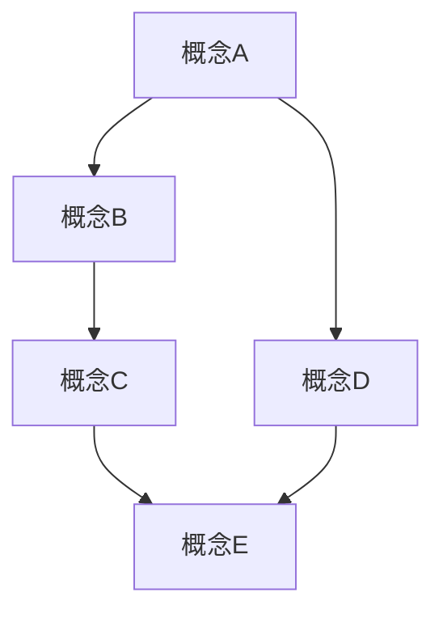

# 形式化架构理论体系：总体分析框架 v4

## 目录

1. [项目概述](#1-项目概述)
2. [分析框架设计](#2-分析框架设计)
3. [内容分类体系](#3-内容分类体系)
4. [形式化规范](#4-形式化规范)
5. [进度跟踪](#5-进度跟踪)
6. [质量保证](#6-质量保证)

## 1. 项目概述

### 1.1 项目目标

本项目旨在对 `/Matter` 目录下的所有内容进行深度分析，构建一个完整的、形式化的软件架构理论体系。通过多维度表征、严格论证和规范化组织，形成符合学术标准的理论框架。

### 1.2 核心原则

- **形式化优先**：所有理论必须具有严格的形式化表达
- **多表征统一**：概念、定义、证明、解释等多种表征方式统一
- **层次化组织**：从理念到实践的多层次理论体系
- **行业相关性**：专注于软件架构、企业架构、行业架构领域
- **技术实践导向**：理论必须能够指导实际的技术实践

### 1.3 分析范围

- **哲学基础**：本体论、认识论、逻辑学、伦理学
- **数学理论**：范畴论、代数、几何、分析、数论
- **形式化理论**：类型理论、控制理论、分布式理论、并发理论
- **软件架构**：系统设计、组件设计、模式设计
- **编程语言**：语言理论、范式分析、Rust/Golang实践

## 2. 分析框架设计

### 2.1 理论层次结构

```latex
\begin{align}
\text{理论体系} &= \text{理念层} \oplus \text{形式科学层} \oplus \text{理论层} \oplus \text{实践层} \\
\text{理念层} &= \text{哲学基础} \oplus \text{认知模型} \oplus \text{方法论} \\
\text{形式科学层} &= \text{数学基础} \oplus \text{逻辑系统} \oplus \text{形式语言} \\
\text{理论层} &= \text{类型理论} \oplus \text{控制理论} \oplus \text{分布式理论} \\
\text{实践层} &= \text{架构设计} \oplus \text{算法实现} \oplus \text{系统验证}
\end{align}
```

### 2.2 分析维度

1. **概念维度**：定义、性质、关系
2. **证明维度**：公理、推理、定理
3. **解释维度**：语义、直觉、应用
4. **实践维度**：实现、验证、优化

### 2.3 表征方式

- **数学符号**：使用 $\LaTeX$ 格式的数学表达式
- **逻辑公式**：形式化逻辑表达
- **图表结构**：Mermaid 图表和关系图
- **代码示例**：Rust/Golang 实现
- **自然语言**：精确的概念解释

## 3. 内容分类体系

### 3.1 主要分类

```
01-哲学基础理论/
├── 01-本体论与存在论
├── 02-认识论与知识论
├── 03-逻辑学与推理
├── 04-伦理学与价值论
└── 05-方法论与科学哲学

02-数学理论体系/
├── 01-集合论与基础数学
├── 02-代数结构与群论
├── 03-几何与拓扑
├── 04-分析与微积分
├── 05-范畴论与函子理论
└── 06-数论与离散数学

03-形式化理论基础/
├── 01-形式语言理论
├── 02-自动机理论
├── 03-计算理论
├── 04-证明理论
└── 05-模型论

04-软件架构理论/
├── 01-系统架构基础
├── 02-组件设计理论
├── 03-模式与反模式
├── 04-微服务架构
├── 05-分布式系统
└── 06-工作流与业务流程

05-编程语言理论/
├── 01-语言理论基础
├── 02-类型系统理论
├── 03-语义理论
├── 04-编译理论
├── 05-Rust语言深度分析
└── 06-Golang语言深度分析

06-系统设计实践/
├── 01-设计原则与方法
├── 02-架构模式实现
├── 03-性能优化理论
├── 04-安全性与可靠性
├── 05-可扩展性设计
└── 06-测试与验证

07-控制与并发理论/
├── 01-控制理论基础
├── 02-时态逻辑
├── 03-Petri网理论
├── 04-进程代数
├── 05-并发控制
└── 06-分布式协调

08-类型理论深化/
├── 01-基础类型理论
├── 02-线性类型系统
├── 03-依赖类型理论
├── 04-高阶类型系统
├── 05-量子类型理论
└── 06-时态类型理论

09-分布式系统理论/
├── 01-一致性理论
├── 02-共识算法
├── 03-容错机制
├── 04-网络拓扑
├── 05-负载均衡
└── 06-数据分片

10-形式化验证/
├── 01-模型检测
├── 02-定理证明
├── 03-静态分析
├── 04-动态验证
├── 05-形式化规范
└── 06-验证工具

11-跨领域整合/
├── 01-哲学与数学整合
├── 02-理论与实践整合
├── 03-形式化与应用整合
├── 04-静态与动态整合
└── 05-局部与全局整合

12-索引与导航/
├── 01-概念索引
├── 02-定理索引
├── 03-方法索引
├── 04-应用索引
└── 05-交叉引用
```

### 3.2 文件命名规范

- **目录结构**：`XX-主题名称/`
- **文件命名**：`XX-YY-具体内容.md`
- **版本控制**：`文件名-vN.md`
- **索引文件**：`XX-索引.md`

## 4. 形式化规范

### 4.1 数学表达式规范

所有数学表达式必须使用 $\LaTeX$ 格式：

```latex
\begin{align}
\text{定义} &: \text{概念名称} \\
\text{性质} &: \text{形式化描述} \\
\text{定理} &: \text{形式化陈述} \\
\text{证明} &: \text{严格论证过程}
\end{align}
```

### 4.2 代码示例规范

使用 Rust 或 Golang 进行实现示例：

```rust
// Rust 示例
pub trait FormalSystem {
    type State;
    type Transition;
    
    fn initial_state() -> Self::State;
    fn transition(state: &Self::State, input: &Self::Transition) -> Self::State;
    fn is_valid(state: &Self::State) -> bool;
}
```

```go
// Golang 示例
type FormalSystem interface {
    InitialState() State
    Transition(state State, input Transition) State
    IsValid(state State) bool
}
```

### 4.3 图表规范

使用 Mermaid 语法创建图表：



## 5. 进度跟踪

### 5.1 当前进度

- [x] 总体框架设计
- [ ] 哲学基础理论分析
- [ ] 数学理论体系整理
- [ ] 形式化理论基础构建
- [ ] 软件架构理论分析
- [ ] 编程语言理论深化
- [ ] 系统设计实践总结
- [ ] 控制与并发理论整合
- [ ] 类型理论深化
- [ ] 分布式系统理论
- [ ] 形式化验证方法
- [ ] 跨领域整合
- [ ] 索引与导航构建

### 5.2 质量检查清单

- [ ] 数学表达式格式正确
- [ ] 逻辑推理严格
- [ ] 概念定义清晰
- [ ] 证明过程完整
- [ ] 代码示例可运行
- [ ] 图表清晰易懂
- [ ] 交叉引用准确
- [ ] 目录结构合理

## 6. 质量保证

### 6.1 内容质量标准

1. **准确性**：所有概念、定义、定理必须准确无误
2. **完整性**：理论体系必须完整，不遗漏重要内容
3. **一致性**：不同部分之间必须保持逻辑一致性
4. **严谨性**：所有证明必须严格，推理必须清晰
5. **实用性**：理论必须能够指导实际应用

### 6.2 形式化标准

1. **数学符号**：统一使用 $\LaTeX$ 格式
2. **逻辑结构**：清晰的层次结构和逻辑关系
3. **引用规范**：准确的交叉引用和索引
4. **代码规范**：符合 Rust/Golang 最佳实践
5. **图表规范**：清晰、准确的图表表达

### 6.3 持续改进

1. **定期审查**：定期审查内容质量和一致性
2. **反馈整合**：整合用户反馈和建议
3. **版本更新**：根据新知识更新理论体系
4. **扩展完善**：持续扩展和完善理论内容

---

**版本信息**：v4.0  
**创建时间**：2024年12月  
**最后更新**：2024年12月  
**维护者**：AI Assistant  
**状态**：进行中
