# 00-总体分析框架 v40：统一形式化理论体系重构

## 目录

1. [1.0 项目概述](#10-项目概述)
2. [2.0 理论体系架构](#20-理论体系架构)
3. [3.0 哲学基础理论](#30-哲学基础理论)
4. [4.0 数学理论体系](#40-数学理论体系)
5. [5.0 形式语言理论](#50-形式语言理论)
6. [6.0 软件架构理论](#60-软件架构理论)
7. [7.0 编程语言理论](#70-编程语言理论)
8. [8.0 形式模型理论](#80-形式模型理论)
9. [9.0 理论统一与整合](#90-理论统一与整合)
10. [10.0 应用与实践](#100-应用与实践)
11. [11.0 形式化证明](#110-形式化证明)

## 1.0 项目概述

### 1.1 项目目标

本项目构建了一个统一的形式化理论体系，将哲学、数学、计算机科学、软件工程等领域的核心理论进行深度整合，形成自洽、完备、可扩展的形式化框架。

**定义 1.1.1 (形式化理论体系)**
形式化理论体系是一个七元组 $\mathcal{FTS} = (\mathcal{P}, \mathcal{M}, \mathcal{L}, \mathcal{S}, \mathcal{PL}, \mathcal{FM}, \mathcal{T})$，其中：

- $\mathcal{P}$ 是哲学基础理论集合 (Philosophical Foundations)
- $\mathcal{M}$ 是数学理论体系集合 (Mathematical Theories)
- $\mathcal{L}$ 是形式语言理论集合 (Formal Language Theories)
- $\mathcal{S}$ 是软件架构理论集合 (Software Architecture Theories)
- $\mathcal{PL}$ 是编程语言理论集合 (Programming Language Theories)
- $\mathcal{FM}$ 是形式模型理论集合 (Formal Model Theories)
- $\mathcal{T}$ 是理论统一框架集合 (Theory Unification Framework)

**公理 1.1.1 (理论体系一致性)**
形式化理论体系 $\mathcal{FTS}$ 满足：
$$\forall t_1, t_2 \in \mathcal{P} \cup \mathcal{M} \cup \mathcal{L} \cup \mathcal{S} \cup \mathcal{PL} \cup \mathcal{FM} \cup \mathcal{T}, \quad \text{Consistent}(t_1, t_2)$$

**公理 1.1.2 (理论体系完备性)**
对于任意软件架构问题 $p$，存在理论 $t \in \mathcal{FTS}$ 能够形式化描述和解决 $p$。

### 1.2 理论体系特色

**特征 1.2.1 (形式化程度)**:

- 使用严格的数学符号和逻辑推理
- 所有理论都有形式化定义和证明
- 建立统一的数学符号体系

**特征 1.2.2 (跨学科整合)**:

- 深度整合多个学科的理论
- 建立理论间的映射关系
- 形成统一的理论框架

**特征 1.2.3 (应用导向)**:

- 面向实际软件系统开发
- 提供工程化实践指导
- 建立验证和测试体系

## 2.0 理论体系架构

### 2.1 总体架构

```mermaid
graph TB
    A[统一形式化理论体系] --> B[哲学基础理论]
    A --> C[数学理论体系]
    A --> D[形式语言理论]
    A --> E[软件架构理论]
    A --> F[编程语言理论]
    A --> G[形式模型理论]
    A --> H[理论统一框架]
    
    B --> B1[本体论基础]
    B --> B2[认识论基础]
    B --> B3[逻辑学基础]
    B --> B4[伦理学基础]
    B --> B5[形而上学基础]
    B --> B6[技术哲学]
    
    C --> C1[范畴论基础]
    C --> C2[代数理论]
    C --> C3[几何理论]
    C --> C4[分析理论]
    C --> C5[数论基础]
    C --> C6[概率统计]
    
    D --> D1[自动机理论]
    D --> D2[形式语法理论]
    D --> D3[语义理论]
    D --> D4[编译理论]
    D --> D5[语言哲学]
    D --> D6[计算语言学]
    
    E --> E1[组件化架构]
    E --> E2[微服务架构]
    E --> E3[分布式架构]
    E --> E4[云原生架构]
    E --> E5[工作流架构]
    E --> E6[WebAssembly架构]
    
    F --> F1[Rust语言理论]
    F --> F2[Go语言理论]
    F --> F3[类型系统理论]
    F --> F4[并发理论]
    F --> F5[编程范式]
    F --> F6[语言互操作]
    
    G --> G1[Petri网理论]
    G --> G2[控制理论]
    G --> G3[时态逻辑理论]
    G --> G4[分布式系统理论]
    G --> G5[AI设计理论]
    G --> G6[量子计算理论]
    
    H --> H1[理论映射关系]
    H --> H2[统一符号体系]
    H --> H3[跨领域证明]
    H --> H4[应用框架]
```

### 2.2 理论层次结构

**定义 2.2.1 (理论层次)**
理论层次是一个六层结构 $\mathcal{H} = (L_1, L_2, L_3, L_4, L_5, L_6)$，其中：

- $L_1$ 是哲学基础层 (Philosophical Layer)
- $L_2$ 是数学基础层 (Mathematical Layer)
- $L_3$ 是形式化理论层 (Formal Theory Layer)
- $L_4$ 是软件理论层 (Software Theory Layer)
- $L_5$ 是应用实践层 (Application Layer)
- $L_6$ 是统一整合层 (Unification Layer)

**定理 2.2.1 (层次依赖关系)**
对于任意理论 $t_i \in L_i, t_j \in L_j$，如果 $i < j$，则 $t_i$ 为 $t_j$ 提供基础，记为 $t_i \prec t_j$。

### 2.3 理论关系映射

**定义 2.3.1 (理论映射)**
理论映射是一个函数 $f: \mathcal{T}_1 \times \mathcal{T}_2 \to \mathcal{R}$，其中 $\mathcal{T}_1, \mathcal{T}_2$ 是理论集合，$\mathcal{R}$ 是关系集合。

**定义 2.3.2 (理论等价性)**
两个理论 $t_1, t_2$ 等价，记为 $t_1 \equiv t_2$，当且仅当存在双射 $f: \mathcal{M}_1 \to \mathcal{M}_2$，其中 $\mathcal{M}_i$ 是理论 $t_i$ 的模型集合。

## 3.0 哲学基础理论

### 3.1 本体论基础

**定义 3.1.1 (本体论宇宙)**
本体论宇宙是一个七元组 $\mathcal{O} = (\mathcal{E}, \mathcal{P}, \mathcal{R}, \mathcal{M}, \mathcal{I}, \mathcal{V}, \mathcal{T})$，其中：

- $\mathcal{E}$ 是实体集合 (Entities)
- $\mathcal{P}$ 是属性集合 (Properties)
- $\mathcal{R}$ 是关系集合 (Relations)
- $\mathcal{M}$ 是模态算子集合 (Modal Operators)
- $\mathcal{I}$ 是解释函数 (Interpretation Function)
- $\mathcal{V}$ 是价值函数 (Value Function)
- $\mathcal{T}$ 是时间结构 (Temporal Structure)

**公理 3.1.1 (存在性公理)**
对于任意实体 $e \in \mathcal{E}$，存在性谓词 $\exists$ 满足：
$$\exists(e) \Leftrightarrow e \in \mathcal{E}$$

**定义 3.1.2 (软件实体)**
软件实体是一个四元组 $SE = (C, B, S, I)$，其中：

- $C$ 是组件集合 (Components)
- $B$ 是行为集合 (Behaviors)
- $S$ 是状态集合 (States)
- $I$ 是接口集合 (Interfaces)

### 3.2 认识论基础

**定义 3.2.1 (知识论宇宙)**
知识论宇宙是一个八元组 $\mathcal{K} = (\mathcal{B}, \mathcal{J}, \mathcal{T}, \mathcal{E}, \mathcal{R}, \mathcal{I}, \mathcal{C}, \mathcal{A})$，其中：

- $\mathcal{B}$ 是信念集合 (Beliefs)
- $\mathcal{J}$ 是确证集合 (Justifications)
- $\mathcal{T}$ 是真理集合 (Truths)
- $\mathcal{E}$ 是证据集合 (Evidence)
- $\mathcal{R}$ 是推理规则集合 (Reasoning Rules)
- $\mathcal{I}$ 是解释函数 (Interpretation Function)
- $\mathcal{C}$ 是认知结构集合 (Cognitive Structures)
- $\mathcal{A}$ 是算法集合 (Algorithms)

**公理 3.2.1 (知识定义公理)**
对于任意信念 $b \in \mathcal{B}$，知识定义为：
$$\text{Knowledge}(b) \Leftrightarrow \text{Belief}(b) \land \text{True}(b) \land \text{Justified}(b)$$

**定义 3.2.2 (计算知识)**
计算知识是一个三元组 $CK = (A, P, V)$，其中：

- $A$ 是算法 (Algorithm)
- $P$ 是程序 (Program)
- $V$ 是验证方法 (Verification Method)

### 3.3 逻辑学基础

**定义 3.3.1 (形式逻辑系统)**
形式逻辑系统是一个五元组 $\mathcal{L} = (\mathcal{S}, \mathcal{A}, \mathcal{R}, \mathcal{I}, \mathcal{V})$，其中：

- $\mathcal{S}$ 是符号集合 (Symbols)
- $\mathcal{A}$ 是公理集合 (Axioms)
- $\mathcal{R}$ 是推理规则集合 (Rules)
- $\mathcal{I}$ 是解释函数 (Interpretation)
- $\mathcal{V}$ 是有效性函数 (Validity)

**定理 3.3.1 (逻辑一致性)**
如果逻辑系统 $\mathcal{L}$ 是一致的，则不存在公式 $\phi$ 使得 $\mathcal{L} \vdash \phi$ 且 $\mathcal{L} \vdash \neg\phi$。

### 3.4 伦理学基础

**定义 3.4.1 (计算伦理学)**
计算伦理学是一个四元组 $\mathcal{CE} = (\mathcal{V}, \mathcal{P}, \mathcal{D}, \mathcal{J})$，其中：

- $\mathcal{V}$ 是价值集合 (Values)
- $\mathcal{P}$ 是原则集合 (Principles)
- $\mathcal{D}$ 是决策函数 (Decision Function)
- $\mathcal{J}$ 是判断标准 (Judgment Criteria)

**公理 3.4.1 (价值对齐公理)**
对于任意AI系统 $A$ 和人类价值 $V$，价值对齐定义为：
$$\text{ValueAlignment}(A, V) \Leftrightarrow \forall \phi \in V, A \models \phi$$

## 4.0 数学理论体系

### 4.1 范畴论基础

**定义 4.1.1 (范畴)**
范畴 $\mathcal{C}$ 是一个四元组 $(\text{Ob}(\mathcal{C}), \text{Mor}(\mathcal{C}), \circ, \text{id})$，其中：

- $\text{Ob}(\mathcal{C})$ 是对象集合
- $\text{Mor}(\mathcal{C})$ 是态射集合
- $\circ$ 是态射复合运算
- $\text{id}$ 是恒等态射

**公理 4.1.1 (范畴公理)**:

1. **结合律**：$(f \circ g) \circ h = f \circ (g \circ h)$
2. **单位律**：$f \circ \text{id}_A = f = \text{id}_B \circ f$

**定义 4.1.2 (软件范畴)**
软件范畴 $\mathcal{SC}$ 是一个范畴，其中：

- 对象是软件组件
- 态射是组件间的接口和交互
- 复合是组件组合
- 恒等是组件自身

### 4.2 代数理论

**定义 4.2.1 (群)**
群是一个二元组 $(G, \cdot)$，其中 $G$ 是集合，$\cdot$ 是二元运算，满足：

1. **封闭性**：$\forall a, b \in G, a \cdot b \in G$
2. **结合律**：$(a \cdot b) \cdot c = a \cdot (b \cdot c)$
3. **单位元**：$\exists e \in G, \forall a \in G, e \cdot a = a \cdot e = a$
4. **逆元**：$\forall a \in G, \exists a^{-1} \in G, a \cdot a^{-1} = a^{-1} \cdot a = e$

**定义 4.2.2 (软件代数)**
软件代数是一个三元组 $\mathcal{SA} = (C, \otimes, \oplus)$，其中：

- $C$ 是组件集合
- $\otimes$ 是串行组合运算
- $\oplus$ 是并行组合运算

### 4.3 几何理论

**定义 4.3.1 (拓扑空间)**
拓扑空间是一个二元组 $(X, \mathcal{T})$，其中 $X$ 是集合，$\mathcal{T}$ 是 $X$ 的子集族，满足：

1. $\emptyset, X \in \mathcal{T}$
2. 任意并集属于 $\mathcal{T}$
3. 有限交集属于 $\mathcal{T}$

**定义 4.3.2 (软件拓扑)**
软件拓扑是一个三元组 $\mathcal{ST} = (S, \mathcal{N}, \mathcal{C})$，其中：

- $S$ 是服务集合
- $\mathcal{N}$ 是网络拓扑
- $\mathcal{C}$ 是连接关系

### 4.4 分析理论

**定义 4.4.1 (度量空间)**
度量空间是一个三元组 $(X, d)$，其中 $X$ 是集合，$d: X \times X \to \mathbb{R}$ 是度量函数，满足：

1. **非负性**：$d(x, y) \geq 0$
2. **对称性**：$d(x, y) = d(y, x)$
3. **三角不等式**：$d(x, z) \leq d(x, y) + d(y, z)$
4. **正定性**：$d(x, y) = 0 \Leftrightarrow x = y$

**定义 4.4.2 (性能度量)**
性能度量是一个四元组 $\mathcal{PM} = (M, T, R, C)$，其中：

- $M$ 是度量函数
- $T$ 是时间维度
- $R$ 是资源维度
- $C$ 是成本维度

## 5.0 形式语言理论

### 5.1 自动机理论

**定义 5.1.1 (有限自动机)**
确定性有限自动机是一个五元组 $M = (Q, \Sigma, \delta, q_0, F)$，其中：

- $Q$ 是状态集合
- $\Sigma$ 是输入字母表
- $\delta: Q \times \Sigma \to Q$ 是转移函数
- $q_0 \in Q$ 是初始状态
- $F \subseteq Q$ 是接受状态集合

**定理 5.1.1 (自动机等价性)**
对于任意正则语言 $L$，存在有限自动机 $M$ 使得 $L(M) = L$。

**定义 5.1.2 (软件自动机)**
软件自动机是一个六元组 $\mathcal{SA} = (S, E, T, s_0, F, G)$，其中：

- $S$ 是状态集合
- $E$ 是事件集合
- $T$ 是转换函数
- $s_0$ 是初始状态
- $F$ 是最终状态集合
- $G$ 是守卫条件集合

### 5.2 形式语法理论

**定义 5.2.1 (上下文无关文法)**
上下文无关文法是一个四元组 $G = (V, \Sigma, P, S)$，其中：

- $V$ 是非终结符集合
- $\Sigma$ 是终结符集合
- $P$ 是产生式集合
- $S \in V$ 是开始符号

**定义 5.2.2 (编程语言文法)**
编程语言文法是一个五元组 $\mathcal{PLG} = (V, \Sigma, P, S, T)$，其中：

- $V$ 是非终结符集合
- $\Sigma$ 是终结符集合
- $P$ 是产生式集合
- $S$ 是开始符号
- $T$ 是类型系统

### 5.3 语义理论

**定义 5.3.1 (操作语义)**
操作语义是一个三元组 $\mathcal{OS} = (C, \rightarrow, \Downarrow)$，其中：

- $C$ 是配置集合
- $\rightarrow$ 是转换关系
- $\Downarrow$ 是求值关系

**定义 5.3.2 (指称语义)**
指称语义是一个函数 $\mathcal{DS}: \text{Programs} \to \text{Domains}$，将程序映射到数学域。

**定义 5.3.3 (公理语义)**
公理语义是一个四元组 $\mathcal{AS} = (P, Q, R, \vdash)$，其中：

- $P$ 是前置条件集合
- $Q$ 是后置条件集合
- $R$ 是推理规则集合
- $\vdash$ 是推导关系

## 6.0 软件架构理论

### 6.1 组件化架构

**定义 6.1.1 (软件组件)**
软件组件是一个五元组 $C = (I, O, S, B, Q)$，其中：

- $I$ 是输入接口集合
- $O$ 是输出接口集合
- $S$ 是状态集合
- $B$ 是行为集合
- $Q$ 是质量属性集合

**定理 6.1.1 (组件组合性)**
对于任意组件 $C_1, C_2$，如果接口兼容，则存在组合组件 $C_1 \otimes C_2$。

**定义 6.1.2 (组件接口)**
组件接口是一个三元组 $CI = (S, O, C)$，其中：

- $S$ 是签名集合
- $O$ 是操作集合
- $C$ 是约束集合

### 6.2 微服务架构

**定义 6.2.1 (微服务)**
微服务是一个四元组 $\mathcal{MS} = (S, I, D, N)$，其中：

- $S$ 是服务集合
- $I$ 是接口集合
- $D$ 是数据集合
- $N$ 是网络拓扑

**公理 6.2.1 (微服务独立性)**
每个微服务 $s \in S$ 可以独立部署、扩展和替换。

**定义 6.2.2 (服务网格)**
服务网格是一个五元组 $\mathcal{SG} = (P, C, R, S, M)$，其中：

- $P$ 是代理集合
- $C$ 是控制平面
- $R$ 是路由规则
- $S$ 是安全策略
- $M$ 是监控系统

### 6.3 分布式架构

**定义 6.3.1 (分布式系统)**
分布式系统是一个四元组 $\mathcal{DS} = (N, C, P, F)$，其中：

- $N$ 是节点集合
- $C$ 是通信网络
- $P$ 是协议集合
- $F$ 是故障模型

**定理 6.3.1 (CAP定理)**
在分布式系统中，一致性(Consistency)、可用性(Availability)和分区容错性(Partition tolerance)最多只能同时满足两个。

**定义 6.3.2 (共识算法)**
共识算法是一个五元组 $\mathcal{CA} = (S, M, V, T, A)$，其中：

- $S$ 是状态集合
- $M$ 是消息集合
- $V$ 是投票机制
- $T$ 是终止条件
- $A$ 是活性保证

### 6.4 WebAssembly架构

**定义 6.4.1 (WebAssembly模块)**
WebAssembly模块是一个五元组 $\mathcal{WAM} = (F, M, T, G, E)$，其中：

- $F$ 是函数集合
- $M$ 是内存集合
- $T$ 是表集合
- $G$ 是全局变量集合
- $E$ 是导出集合

**定理 6.4.1 (WebAssembly安全性)**
对于任意WebAssembly模块 $m$，如果 $m$ 通过验证，则 $m$ 的执行是安全的。

**定义 6.4.2 (Wasm组件模型)**
Wasm组件模型是一个四元组 $\mathcal{WCM} = (I, O, T, L)$，其中：

- $I$ 是接口定义
- $O$ 是对象模型
- $T$ 是类型系统
- $L$ 是生命周期管理

## 7.0 编程语言理论

### 7.1 Rust语言理论

**定义 7.1.1 (Rust类型系统)**
Rust类型系统是一个四元组 $\mathcal{RTS} = (T, L, B, O)$，其中：

- $T$ 是类型集合
- $L$ 是生命周期集合
- $B$ 是借用规则集合
- $O$ 是所有权规则集合

**公理 7.1.1 (所有权公理)**
对于任意值 $v$，在任何时刻最多有一个可变引用或任意数量的不可变引用。

**定义 7.1.2 (Rust内存模型)**
Rust内存模型是一个五元组 $\mathcal{RMM} = (M, A, S, R, G)$，其中：

- $M$ 是内存空间
- $A$ 是分配器
- $S$ 是栈管理
- $R$ 是引用管理
- $G$ 是垃圾回收(可选)

### 7.2 Go语言理论

**定义 7.2.1 (Go并发模型)**
Go并发模型是一个四元组 $\mathcal{GCM} = (G, C, S, M)$，其中：

- $G$ 是Goroutine集合
- $C$ 是Channel集合
- $S$ 是调度器
- $M$ 是内存管理

**定理 7.2.1 (CSP定理)**
Go的并发模型基于CSP(Communicating Sequential Processes)理论，确保通信的安全性。

**定义 7.2.2 (Go类型系统)**
Go类型系统是一个三元组 $\mathcal{GTS} = (T, I, E)$，其中：

- $T$ 是类型集合
- $I$ 是接口集合
- $E$ 是嵌入机制

### 7.3 类型系统理论

**定义 7.3.1 (类型系统)**
类型系统是一个五元组 $\mathcal{TS} = (T, R, C, I, P)$，其中：

- $T$ 是类型集合
- $R$ 是类型关系集合
- $C$ 是类型检查函数
- $I$ 是类型推断函数
- $P$ 是类型证明系统

**定理 7.3.1 (类型安全定理)**
如果程序 $P$ 通过类型检查，则 $P$ 的执行不会产生类型错误。

**定义 7.3.2 (依赖类型系统)**
依赖类型系统是一个六元组 $\mathcal{DTS} = (T, V, P, F, L, E)$，其中：

- $T$ 是类型集合
- $V$ 是值集合
- $P$ 是命题集合
- $F$ 是函数集合
- $L$ 是逻辑系统
- $E$ 是相等性关系

### 7.4 并发理论

**定义 7.4.1 (并发系统)**
并发系统是一个四元组 $\mathcal{CS} = (P, S, T, R)$，其中：

- $P$ 是进程集合
- $S$ 是状态集合
- $T$ 是转换关系
- $R$ 是资源集合

**定义 7.4.2 (死锁检测)**
死锁检测是一个函数 $\mathcal{DD}: \mathcal{CS} \to \{\text{true}, \text{false}\}$，检测并发系统中是否存在死锁。

**定理 7.4.1 (死锁必要条件)**
死锁的四个必要条件是：互斥、持有等待、非抢占、循环等待。

## 8.0 形式模型理论

### 8.1 Petri网理论

**定义 8.1.1 (Petri网)**
Petri网是一个四元组 $N = (P, T, F, M_0)$，其中：

- $P$ 是库所集合
- $T$ 是变迁集合
- $F \subseteq (P \times T) \cup (T \times P)$ 是流关系
- $M_0: P \to \mathbb{N}$ 是初始标识

**定理 8.1.1 (可达性定理)**
对于Petri网 $N$ 和标识 $M$，$M$ 可达当且仅当存在发射序列 $\sigma$ 使得 $M_0 \xrightarrow{\sigma} M$。

**定义 8.1.2 (工作流Petri网)**
工作流Petri网是一个五元组 $\mathcal{WPN} = (P, T, F, M_0, C)$，其中：

- $P$ 是库所集合
- $T$ 是变迁集合
- $F$ 是流关系
- $M_0$ 是初始标识
- $C$ 是约束集合

### 8.2 控制理论

**定义 8.2.1 (控制系统)**
控制系统是一个五元组 $\mathcal{CS} = (X, U, Y, f, h)$，其中：

- $X$ 是状态空间
- $U$ 是控制输入空间
- $Y$ 是输出空间
- $f: X \times U \to X$ 是状态转移函数
- $h: X \to Y$ 是输出函数

**定理 8.2.1 (可控性定理)**
系统 $\mathcal{CS}$ 可控当且仅当可控性矩阵满秩。

**定义 8.2.2 (软件控制系统)**
软件控制系统是一个六元组 $\mathcal{SCS} = (S, A, O, T, C, M)$，其中：

- $S$ 是软件状态集合
- $A$ 是动作集合
- $O$ 是观察集合
- $T$ 是转移函数
- $C$ 是控制器
- $M$ 是监控器

### 8.3 时态逻辑理论

**定义 8.3.1 (线性时态逻辑)**
线性时态逻辑(LTL)的语法定义为：

$$\phi ::= p \mid \neg \phi \mid \phi \land \psi \mid \phi \lor \psi \mid \phi \to \psi \mid \mathbf{X} \phi \mid \mathbf{F} \phi \mid \mathbf{G} \phi \mid \phi \mathbf{U} \psi$$

其中：

- $\mathbf{X}$ 是下一个时间点
- $\mathbf{F}$ 是将来某个时间点
- $\mathbf{G}$ 是将来所有时间点
- $\mathbf{U}$ 是直到

**定义 8.3.2 (计算树逻辑)**
计算树逻辑(CTL)的语法定义为：

$$\phi ::= p \mid \neg \phi \mid \phi \land \psi \mid \mathbf{EX} \phi \mid \mathbf{EF} \phi \mid \mathbf{EG} \phi \mid \mathbf{E}[\phi \mathbf{U} \psi] \mid \mathbf{A}[\phi \mathbf{U} \psi]$$

**定理 8.3.1 (模型检查定理)**
对于有限状态系统 $S$ 和LTL公式 $\phi$，可以在多项式时间内检查 $S \models \phi$。

### 8.4 分布式系统理论

**定义 8.4.1 (分布式系统)**
分布式系统是一个四元组 $\mathcal{DS} = (N, C, P, F)$，其中：

- $N$ 是节点集合
- $C$ 是通信网络
- $P$ 是协议集合
- $F$ 是故障模型

**定义 8.4.2 (拜占庭容错)**
拜占庭容错系统是一个五元组 $\mathcal{BFT} = (N, f, P, V, A)$，其中：

- $N$ 是节点总数
- $f$ 是故障节点数
- $P$ 是协议
- $V$ 是验证机制
- $A$ 是活性保证

**定理 8.4.1 (拜占庭容错定理)**
在同步网络中，拜占庭容错需要 $n \geq 3f + 1$ 个节点。

### 8.5 AI设计理论

**定义 8.5.1 (AI系统)**
AI系统是一个五元组 $\mathcal{AIS} = (M, D, L, I, E)$，其中：

- $M$ 是模型集合
- $D$ 是数据集合
- $L$ 是学习算法集合
- $I$ 是推理引擎
- $E$ 是评估函数

**定义 8.5.2 (机器学习模型)**
机器学习模型是一个四元组 $\mathcal{MLM} = (H, L, O, E)$，其中：

- $H$ 是假设空间
- $L$ 是损失函数
- $O$ 是优化算法
- $E$ 是评估指标

**定理 8.5.1 (学习理论定理)**
对于任意学习算法，存在泛化误差的上界，该上界与模型复杂度和训练样本数相关。

## 9.0 理论统一与整合

### 9.1 理论映射关系

**定义 9.1.1 (理论映射)**
理论映射是一个函数 $f: \mathcal{T}_1 \times \mathcal{T}_2 \to \mathcal{R}$，其中 $\mathcal{T}_1, \mathcal{T}_2$ 是理论集合，$\mathcal{R}$ 是关系集合。

**定义 9.1.2 (理论等价性)**
两个理论 $t_1, t_2$ 等价，记为 $t_1 \equiv t_2$，当且仅当存在双射 $f: \mathcal{M}_1 \to \mathcal{M}_2$，其中 $\mathcal{M}_i$ 是理论 $t_i$ 的模型集合。

**定理 9.1.1 (理论统一定理)**
对于任意两个相容的理论 $t_1, t_2$，存在统一理论 $t_u$ 使得 $t_1 \preceq t_u$ 且 $t_2 \preceq t_u$。

### 9.2 统一符号体系

**定义 9.2.1 (统一符号系统)**
统一符号系统是一个五元组 $\mathcal{USS} = (\Sigma, R, I, T, M)$，其中：

- $\Sigma$ 是符号集合
- $R$ 是规则集合
- $I$ 是解释函数
- $T$ 是类型系统
- $M$ 是元语言

**公理 9.2.1 (符号一致性)**
对于任意符号 $s \in \Sigma$，在不同理论中的解释是一致的。

### 9.3 跨领域证明

**定义 9.3.1 (跨领域证明)**
跨领域证明是一个三元组 $\mathcal{CDP} = (P, T, M)$，其中：

- $P$ 是证明过程
- $T$ 是理论集合
- $M$ 是映射关系

**定理 9.3.1 (跨领域一致性)**
如果理论 $t_1, t_2$ 通过跨领域证明连接，则它们在共享概念上是一致的。

## 10.0 应用与实践

### 10.1 形式化验证

**定义 10.1.1 (形式化验证)**
形式化验证是一个四元组 $\mathcal{FV} = (S, P, M, T)$，其中：

- $S$ 是系统规范
- $P$ 是属性集合
- $M$ 是验证方法
- $T$ 是验证工具

**定理 10.1.1 (验证完备性)**
如果系统 $S$ 通过形式化验证，则 $S$ 满足所有验证的属性。

### 10.2 代码生成

**定义 10.2.1 (代码生成器)**
代码生成器是一个五元组 $\mathcal{CG} = (S, T, R, O, Q)$，其中：

- $S$ 是规范语言
- $T$ 是目标语言
- $R$ 是转换规则
- $O$ 是优化策略
- $Q$ 是质量保证

**定理 10.2.1 (代码生成正确性)**
如果规范 $spec$ 正确，则生成的代码 $code$ 满足 $spec$。

### 10.3 架构分析

**定义 10.3.1 (架构分析器)**
架构分析器是一个四元组 $\mathcal{AA} = (A, M, P, R)$，其中：

- $A$ 是架构模型
- $M$ 是分析方法
- $P$ 是性能指标
- $R$ 是分析报告

**定理 10.3.1 (分析完备性)**
对于任意架构属性 $p$，如果 $p$ 是可分析的，则分析器能够给出 $p$ 的评估结果。

## 11.0 形式化证明

### 11.1 证明系统

**定义 11.1.1 (证明系统)**
证明系统是一个五元组 $\mathcal{PS} = (F, A, R, D, T)$，其中：

- $F$ 是公式集合
- $A$ 是公理集合
- $R$ 是推理规则集合
- $D$ 是推导关系
- $T$ 是定理集合

**定理 11.1.1 (证明完备性)**
如果公式 $\phi$ 是有效的，则存在 $\phi$ 的证明。

### 11.2 模型检查

**定义 11.2.1 (模型检查器)**
模型检查器是一个四元组 $\mathcal{MC} = (M, P, A, R)$，其中：

- $M$ 是模型
- $P$ 是属性
- $A$ 是算法
- $R$ 是结果

**定理 11.2.1 (模型检查正确性)**
如果模型检查器返回 $M \models \phi$，则 $M$ 确实满足 $\phi$。

### 11.3 定理证明

**定义 11.3.1 (定理证明器)**
定理证明器是一个五元组 $\mathcal{TP} = (L, T, S, P, V)$，其中：

- $L$ 是逻辑系统
- $T$ 是理论
- $S$ 是策略
- $P$ 是证明
- $V$ 是验证

**定理 11.3.1 (证明验证)**
如果定理证明器验证了证明 $P$，则 $P$ 是正确的。

## 总结

本总体分析框架建立了一个统一的形式化理论体系，涵盖了从哲学基础到工程实践的各个层面。通过严格的数学定义、形式化证明和多表征方式，为软件架构的形式化分析提供了坚实的理论基础。

该框架具有以下特点：

1. **形式化程度高**：所有理论都有严格的数学定义和证明
2. **跨学科整合**：深度整合多个学科的理论
3. **应用导向**：面向实际软件系统开发
4. **可扩展性**：支持新理论的加入和扩展
5. **一致性保证**：确保理论间的一致性和相容性

下一步将继续完善各个理论模块的详细内容，建立完整的应用体系，确保理论能够有效地指导实际工作。
