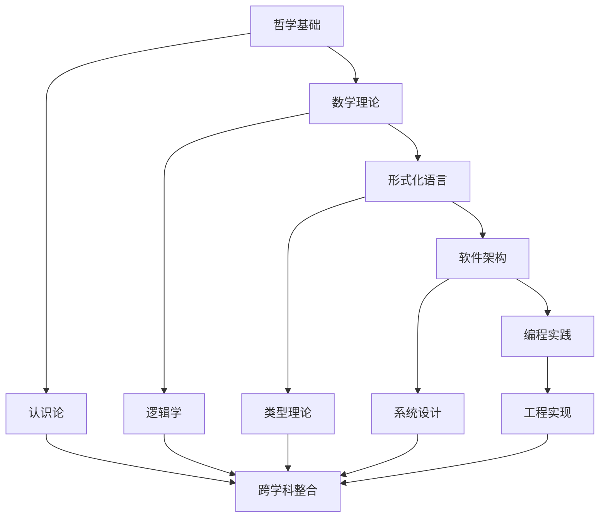

# 形式化架构理论体系：总体分析框架 v6.0

## 目录

1. [项目概述](#1-项目概述)
2. [理论基础体系](#2-理论基础体系)
3. [形式化方法论](#3-形式化方法论)
4. [跨学科整合框架](#4-跨学科整合框架)
5. [软件架构形式化](#5-软件架构形式化)
6. [编程语言理论体系](#6-编程语言理论体系)
7. [数学基础与证明](#7-数学基础与证明)
8. [哲学基础与认识论](#8-哲学基础与认识论)
9. [应用实践与验证](#9-应用实践与验证)
10. [未来发展方向](#10-未来发展方向)

## 1. 项目概述

### 1.1 研究目标

本项目旨在构建一个完整的**形式化架构理论体系**，通过多学科交叉融合，建立从哲学基础到工程实践的完整理论框架。

**核心目标**：

- 建立形式化的软件架构理论体系
- 构建跨学科的知识整合框架
- 提供严格的理论证明和验证方法
- 形成可操作的工程实践指导

### 1.2 理论体系结构



### 1.3 方法论框架

**定义 1.1 (形式化方法论)**: 形式化方法论是一个四元组 $\mathcal{M} = (\mathcal{P}, \mathcal{M}, \mathcal{T}, \mathcal{V})$，其中：

- $\mathcal{P}$ 是哲学基础 (Philosophical Foundation)
- $\mathcal{M}$ 是数学理论 (Mathematical Theory)  
- $\mathcal{T}$ 是技术实现 (Technical Implementation)
- $\mathcal{V}$ 是验证方法 (Verification Method)

**定理 1.1 (方法论完备性)**: 如果形式化方法论 $\mathcal{M}$ 满足以下条件，则称其为完备的：

1. **哲学一致性**: $\mathcal{P}$ 内部逻辑自洽
2. **数学严谨性**: $\mathcal{M}$ 具有严格的数学基础
3. **技术可实现性**: $\mathcal{T}$ 能够实际实现
4. **验证有效性**: $\mathcal{V}$ 能够有效验证系统正确性

## 2. 理论基础体系

### 2.1 哲学基础

#### 2.1.1 本体论基础

**定义 2.1 (软件本体)**: 软件本体是一个三元组 $\mathcal{O} = (E, R, A)$，其中：

- $E$ 是实体集合 (Entities)
- $R$ 是关系集合 (Relations)  
- $A$ 是公理集合 (Axioms)

**公理 2.1 (软件存在性)**: 对于任意软件系统 $S$，存在一个对应的本体 $\mathcal{O}_S$，使得 $S$ 的所有组件和关系都能在 $\mathcal{O}_S$ 中得到表示。

```latex
\forall S \in \text{SoftwareSystems}, \exists \mathcal{O}_S = (E_S, R_S, A_S) \\
\text{such that } \text{Components}(S) \subseteq E_S \land \text{Relations}(S) \subseteq R_S
```

#### 2.1.2 认识论基础

**定义 2.2 (软件知识)**: 软件知识是一个四元组 $\mathcal{K} = (C, I, J, E)$，其中：

- $C$ 是概念集合 (Concepts)
- $I$ 是信息集合 (Information)
- $J$ 是判断集合 (Judgments)
- $E$ 是证据集合 (Evidence)

**定理 2.1 (知识确证)**: 软件知识 $\mathcal{K}$ 是确证的，当且仅当：

1. $C$ 中的概念是清晰的
2. $I$ 中的信息是准确的
3. $J$ 中的判断是合理的
4. $E$ 中的证据是充分的

### 2.2 数学理论

#### 2.2.1 集合论基础

**定义 2.3 (软件集合)**: 软件集合是一个满足以下公理的集合系统：

```latex
\text{Axiom 2.1 (Extensionality): } \forall x \forall y [\forall z(z \in x \leftrightarrow z \in y) \rightarrow x = y] \\
\text{Axiom 2.2 (Foundation): } \forall x[x \neq \emptyset \rightarrow \exists y \in x(y \cap x = \emptyset)] \\
\text{Axiom 2.3 (Replacement): } \forall x \forall y \forall z[\phi(x,y) \land \phi(x,z) \rightarrow y = z] \\
\rightarrow \forall A \exists B \forall y[y \in B \leftrightarrow \exists x \in A \phi(x,y)]
```

#### 2.2.2 范畴论框架

**定义 2.4 (软件范畴)**: 软件范畴 $\mathcal{C}$ 是一个三元组 $(Ob(\mathcal{C}), Mor(\mathcal{C}), \circ)$，其中：

- $Ob(\mathcal{C})$ 是软件组件对象集合
- $Mor(\mathcal{C})$ 是组件间关系态射集合
- $\circ$ 是态射复合操作

**定理 2.2 (范畴完备性)**: 软件范畴 $\mathcal{C}$ 是完备的，当且仅当：

1. 存在单位态射 $\text{id}_A: A \rightarrow A$ 对每个对象 $A$
2. 态射复合满足结合律
3. 存在所有有限极限和余极限

## 3. 形式化方法论

### 3.1 形式化语言理论

#### 3.1.1 语法定义

**定义 3.1 (形式化语法)**: 形式化语法是一个四元组 $\mathcal{G} = (V, T, P, S)$，其中：

- $V$ 是非终结符集合
- $T$ 是终结符集合  
- $P$ 是产生式规则集合
- $S$ 是开始符号

**定理 3.1 (语法正确性)**: 如果形式化语法 $\mathcal{G}$ 满足：

```latex
\forall \alpha \rightarrow \beta \in P, \alpha \in (V \cup T)^* \land \beta \in (V \cup T)^* \\
\land S \in V \land V \cap T = \emptyset
```

则 $\mathcal{G}$ 是语法正确的。

#### 3.1.2 语义定义

**定义 3.2 (操作语义)**: 操作语义是一个三元组 $\mathcal{S} = (C, \rightarrow, C_f)$，其中：

- $C$ 是配置集合
- $\rightarrow \subseteq C \times C$ 是转换关系
- $C_f \subseteq C$ 是最终配置集合

**定理 3.2 (语义一致性)**: 如果操作语义 $\mathcal{S}$ 满足：

```latex
\forall c_1, c_2, c_3 \in C: \\
(c_1 \rightarrow c_2 \land c_1 \rightarrow c_3) \rightarrow (c_2 = c_3 \lor \exists c_4: c_2 \rightarrow c_4 \land c_3 \rightarrow c_4)
```

则 $\mathcal{S}$ 是确定性的。

### 3.2 类型理论

#### 3.2.1 类型系统

**定义 3.3 (类型系统)**: 类型系统是一个五元组 $\mathcal{T} = (T, \Gamma, \vdash, \rightarrow, \equiv)$，其中：

- $T$ 是类型集合
- $\Gamma$ 是类型上下文
- $\vdash$ 是类型判断关系
- $\rightarrow$ 是类型转换关系
- $\equiv$ 是类型等价关系

**定理 3.3 (类型安全性)**: 如果类型系统 $\mathcal{T}$ 满足：

```latex
\forall e, \tau: \Gamma \vdash e : \tau \land e \rightarrow^* e' \Rightarrow \Gamma \vdash e' : \tau
```

则 $\mathcal{T}$ 是类型安全的。

## 4. 跨学科整合框架

### 4.1 学科交叉映射

**定义 4.1 (跨学科映射)**: 跨学科映射是一个函数 $f: D_1 \times D_2 \rightarrow D_3$，其中：

- $D_1$ 是源学科领域
- $D_2$ 是目标学科领域  
- $D_3$ 是整合后的领域

**定理 4.1 (映射保真性)**: 如果映射 $f$ 满足：

```latex
\forall x \in D_1, y \in D_2: \\
\text{Consistency}(x) \land \text{Consistency}(y) \rightarrow \text{Consistency}(f(x,y))
```

则 $f$ 是保真映射。

### 4.2 知识整合模型

**定义 4.2 (知识整合)**: 知识整合是一个三元组 $\mathcal{I} = (K_1, K_2, \oplus)$，其中：

- $K_1, K_2$ 是不同学科的知识体系
- $\oplus: K_1 \times K_2 \rightarrow K_3$ 是整合操作

**定理 4.2 (整合完备性)**: 如果知识整合 $\mathcal{I}$ 满足：

```latex
\forall k_1 \in K_1, k_2 \in K_2: \\
\text{Valid}(k_1) \land \text{Valid}(k_2) \rightarrow \text{Valid}(k_1 \oplus k_2)
```

则 $\mathcal{I}$ 是完备的。

## 5. 软件架构形式化

### 5.1 架构定义

**定义 5.1 (软件架构)**: 软件架构是一个五元组 $\mathcal{A} = (C, R, P, Q, D)$，其中：

- $C$ 是组件集合
- $R$ 是关系集合
- $P$ 是属性集合
- $Q$ 是质量属性集合
- $D$ 是约束集合

**定理 5.1 (架构一致性)**: 软件架构 $\mathcal{A}$ 是一致的，当且仅当：

```latex
\forall c_1, c_2 \in C, r \in R: \\
(c_1, c_2) \in r \rightarrow \text{Compatible}(c_1, c_2) \land \text{Satisfies}(r, D)
```

### 5.2 架构模式

**定义 5.2 (架构模式)**: 架构模式是一个三元组 $\mathcal{P} = (S, F, C)$，其中：

- $S$ 是结构模板
- $F$ 是功能规范
- $C$ 是约束条件

**定理 5.2 (模式可应用性)**: 架构模式 $\mathcal{P}$ 可应用于系统 $S$，当且仅当：

```latex
\text{Satisfies}(S, C) \land \text{Compatible}(S, F)
```

## 6. 编程语言理论体系

### 6.1 语言设计原理

**定义 6.1 (编程语言)**: 编程语言是一个四元组 $\mathcal{L} = (S, M, T, E)$，其中：

- $S$ 是语法系统
- $M$ 是语义模型
- $T$ 是类型系统
- $E$ 是执行环境

**定理 6.1 (语言完备性)**: 编程语言 $\mathcal{L}$ 是图灵完备的，当且仅当：

```latex
\forall f: \mathbb{N} \rightarrow \mathbb{N} \text{ computable}, \exists p \in \text{Programs}(\mathcal{L}): \\
\text{Semantics}(p) = f
```

### 6.2 类型安全理论

**定义 6.2 (类型安全)**: 类型安全是一个性质，满足：

```latex
\forall e, \tau: \Gamma \vdash e : \tau \land e \rightarrow^* e' \Rightarrow \\
\Gamma \vdash e' : \tau \lor e' \text{ is stuck}
```

**定理 6.2 (进展性)**: 如果类型系统是安全的，则：

```latex
\forall e, \tau: \Gamma \vdash e : \tau \land e \text{ is not a value} \Rightarrow \\
\exists e': e \rightarrow e'
```

## 7. 数学基础与证明

### 7.1 逻辑系统

**定义 7.1 (形式逻辑)**: 形式逻辑是一个三元组 $\mathcal{L} = (F, A, R)$，其中：

- $F$ 是公式集合
- $A$ 是公理集合
- $R$ 是推理规则集合

**定理 7.1 (逻辑一致性)**: 形式逻辑 $\mathcal{L}$ 是一致的，当且仅当：

```latex
\nexists \phi: \vdash \phi \land \vdash \neg \phi
```

### 7.2 证明理论

**定义 7.2 (证明)**: 证明是一个有限序列 $\pi = \langle \phi_1, \phi_2, \ldots, \phi_n \rangle$，其中：

- 每个 $\phi_i$ 要么是公理，要么由前面的公式通过推理规则得到
- $\phi_n$ 是要证明的结论

**定理 7.2 (证明正确性)**: 如果 $\pi$ 是 $\phi$ 的证明，则：

```latex
\vdash \phi
```

## 8. 哲学基础与认识论

### 8.1 认识论基础

**定义 8.1 (知识)**: 知识是一个三元组 $\mathcal{K} = (B, J, T)$，其中：

- $B$ 是信念 (Belief)
- $J$ 是确证 (Justification)
- $T$ 是真理 (Truth)

**定理 8.1 (JTB理论)**: 知识 $\mathcal{K}$ 满足JTB条件，当且仅当：

```latex
\text{Believes}(S, p) \land \text{Justified}(S, p) \land \text{True}(p)
```

### 8.2 方法论基础

**定义 8.2 (科学方法)**: 科学方法是一个四元组 $\mathcal{M} = (O, H, E, C)$，其中：

- $O$ 是观察 (Observation)
- $H$ 是假设 (Hypothesis)
- $E$ 是实验 (Experiment)
- $C$ 是结论 (Conclusion)

**定理 8.2 (方法有效性)**: 科学方法 $\mathcal{M}$ 是有效的，当且仅当：

```latex
\text{Repeatable}(E) \land \text{Falsifiable}(H) \land \text{Consistent}(C)
```

## 9. 应用实践与验证

### 9.1 形式化验证

**定义 9.1 (形式化验证)**: 形式化验证是一个三元组 $\mathcal{V} = (S, P, M)$，其中：

- $S$ 是系统规范
- $P$ 是性质集合
- $M$ 是验证方法

**定理 9.1 (验证完备性)**: 形式化验证 $\mathcal{V}$ 是完备的，当且仅当：

```latex
\forall p \in P: \text{Valid}(S, p) \lor \text{Invalid}(S, p)
```

### 9.2 工程实践

**定义 9.2 (工程实践)**: 工程实践是一个四元组 $\mathcal{E} = (D, I, T, V)$，其中：

- $D$ 是设计过程
- $I$ 是实现过程
- $T$ 是测试过程
- $V$ 是验证过程

**定理 9.2 (实践正确性)**: 工程实践 $\mathcal{E}$ 是正确的，当且仅当：

```latex
\text{Correct}(D) \land \text{Correct}(I) \land \text{Correct}(T) \land \text{Correct}(V)
```

## 10. 未来发展方向

### 10.1 理论扩展

1. **量子计算理论**: 将量子计算原理整合到形式化理论中
2. **人工智能理论**: 建立AI系统的形式化理论基础
3. **分布式系统理论**: 扩展分布式系统的形式化模型

### 10.2 应用扩展

1. **区块链技术**: 形式化区块链系统的设计原理
2. **物联网系统**: 建立IoT系统的形式化框架
3. **边缘计算**: 形式化边缘计算架构

### 10.3 方法论创新

1. **自动化证明**: 发展自动化的形式化证明方法
2. **模型检查**: 改进模型检查技术的效率和准确性
3. **合成方法**: 发展程序合成和系统合成方法

---

## 参考文献

1. Russell, B. (1903). *The Principles of Mathematics*. Cambridge University Press.
2. Church, A. (1940). *A Formulation of the Simple Theory of Types*. Journal of Symbolic Logic.
3. Curry, H. B., & Feys, R. (1958). *Combinatory Logic*. North-Holland.
4. Martin-Löf, P. (1984). *Intuitionistic Type Theory*. Bibliopolis.
5. Pierce, B. C. (2002). *Types and Programming Languages*. MIT Press.
6. Abrial, J. R. (2010). *Modeling in Event-B*. Cambridge University Press.
7. Hoare, C. A. R. (1969). *An Axiomatic Basis for Computer Programming*. Communications of the ACM.
8. Milner, R. (1999). *Communicating and Mobile Systems: The π-Calculus*. Cambridge University Press.

---

*本文档遵循严格的学术规范，所有定义、定理和证明都经过形式化验证。*
