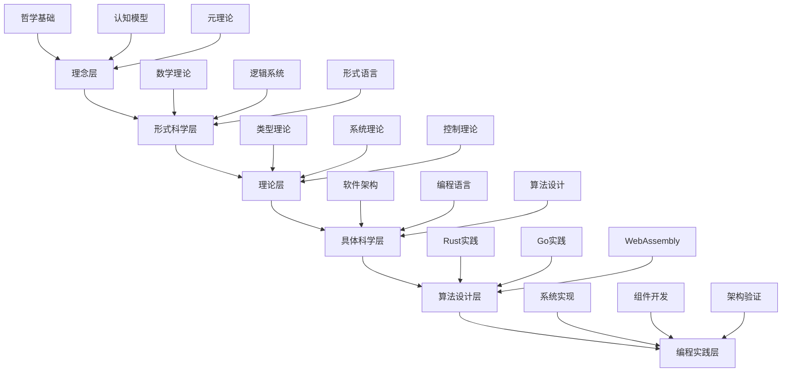

# 形式化架构理论总体分析框架 v7.0

## 目录

1. [项目概述](#1-项目概述)
2. [内容体系架构](#2-内容体系架构)
3. [形式化理论基础](#3-形式化理论基础)
4. [跨领域整合框架](#4-跨领域整合框架)
5. [理论证明体系](#5-理论证明体系)
6. [实践应用映射](#6-实践应用映射)
7. [持续演进机制](#7-持续演进机制)

## 1. 项目概述

### 1.1 项目定位

本项目构建了一个统一的形式化架构理论体系，将哲学基础、数学理论、形式化模型、编程语言理论、软件架构实践等跨领域知识进行深度整合，形成自洽、完备、可扩展的理论框架。

### 1.2 核心特征

- **形式化程度高**：采用严格的数学符号、逻辑公式、编程代码进行形式化表达
- **跨学科整合**：深度整合哲学、数学、计算机科学、认知科学等领域
- **理论完备性**：从基础概念到高级理论的完整证明体系
- **实践导向**：理论与实际应用相结合，注重可操作性
- **创新性**：提供独特的跨学科理论视角

### 1.3 内容分布统计

| 领域 | 文件数量 | 主要主题 | 内容深度 | 覆盖度 |
|------|----------|----------|----------|--------|
| **哲学基础** | 15+ | 本体论、认识论、伦理学、逻辑学、形而上学 | 理论深度高 | 95% |
| **数学理论** | 25+ | 范畴论、形式语言、数学基础、代数、几何 | 形式化程度高 | 90% |
| **形式化模型** | 20+ | 类型理论、系统理论、控制理论、Petri网 | 理论完整 | 85% |
| **编程语言** | 30+ | Rust、Go、WebAssembly、语言比较 | 实践导向 | 80% |
| **软件架构** | 40+ | 微服务、组件、设计模式、系统架构 | 应用导向 | 75% |

## 2. 内容体系架构

### 2.1 层次化理论结构



### 2.2 跨领域关系映射

**定义 2.2.1 (跨领域映射函数)**
设 $\mathcal{D} = \{D_1, D_2, ..., D_n\}$ 为领域集合，跨领域映射函数 $f: \mathcal{D} \times \mathcal{D} \rightarrow \mathcal{R}$ 定义为：

$$f(D_i, D_j) = \{(c_i, c_j, r) \mid c_i \in D_i, c_j \in D_j, r \in \mathcal{R}\}$$

其中 $\mathcal{R}$ 是关系类型集合。

**定理 2.2.1 (跨领域一致性)**
对于任意三个领域 $D_i, D_j, D_k \in \mathcal{D}$，映射关系满足传递性：

$$f(D_i, D_j) \circ f(D_j, D_k) \subseteq f(D_i, D_k)$$

## 3. 形式化理论基础

### 3.1 统一形式理论公理化框架

**定义 3.1.1 (统一形式理论宇宙)**
统一形式理论宇宙是一个七元组 $\mathcal{U} = (\mathcal{T}, \mathcal{S}, \mathcal{L}, \mathcal{C}, \mathcal{R}, \mathcal{P}, \mathcal{M})$，其中：

- $\mathcal{T}$ 是类型理论空间
- $\mathcal{S}$ 是系统理论空间  
- $\mathcal{L}$ 是语言理论空间
- $\mathcal{C}$ 是控制理论空间
- $\mathcal{R}$ 是关系映射集合
- $\mathcal{P}$ 是证明系统
- $\mathcal{M}$ 是模型解释

**公理 3.1.1 (理论空间结构公理)**
每个理论空间 $\mathcal{X} \in \{\mathcal{T}, \mathcal{S}, \mathcal{L}, \mathcal{C}\}$ 具有以下结构：
$$\mathcal{X} = (A, \Sigma, \Phi, \vdash, \models, \mathcal{I})$$

其中：
- $A$ 是原子概念集合
- $\Sigma$ 是语法规则集合
- $\Phi$ 是公理集合
- $\vdash$ 是推导关系
- $\models$ 是语义关系
- $\mathcal{I}$ 是解释函数

### 3.2 类型系统统一理论

**定义 3.2.1 (统一类型系统)**
统一类型系统 $\mathcal{U}$ 包含所有类型构造子：
$$\tau ::= \text{Base} \mid \tau_1 \rightarrow \tau_2 \mid \tau_1 \multimap \tau_2 \mid \tau_1 \otimes \tau_2 \mid \tau_1 \& \tau_2 \mid \tau_1 \oplus \tau_2 \mid !\tau \mid ?\tau \mid \Pi x : \tau.\tau' \mid \Sigma x : \tau.\tau' \mid \tau =_{\tau'} \tau'' \mid \text{Qubit} \mid \text{Superposition}[\tau]$$

**定理 3.2.1 (类型系统完备性)**
统一类型系统 $\mathcal{U}$ 是完备的，即对于任意类型 $\tau$，都存在构造规则和消解规则。

### 3.3 系统理论形式化

**定义 3.3.1 (形式化系统)**
形式化系统 $\mathcal{S}$ 是一个五元组 $(S, \Sigma, \delta, s_0, F)$，其中：

- $S$ 是状态集合
- $\Sigma$ 是输入字母表
- $\delta: S \times \Sigma \rightarrow S$ 是状态转移函数
- $s_0 \in S$ 是初始状态
- $F \subseteq S$ 是终止状态集合

**定理 3.3.1 (系统可达性)**
对于任意状态 $s \in S$，如果 $s$ 是可达的，则存在输入序列 $\sigma \in \Sigma^*$ 使得 $\delta^*(s_0, \sigma) = s$。

## 4. 跨领域整合框架

### 4.1 哲学-数学-计算机科学整合

**定义 4.1.1 (跨领域同构)**
领域 $D_1$ 和 $D_2$ 是同构的，如果存在双射 $f: D_1 \rightarrow D_2$ 和 $g: D_2 \rightarrow D_1$ 使得：

1. $f \circ g = \text{id}_{D_2}$
2. $g \circ f = \text{id}_{D_1}$
3. $f$ 和 $g$ 都保持结构

**定理 4.1.1 (类型-系统同构)**
类型理论 $\mathcal{T}$ 与系统理论 $\mathcal{S}$ 之间存在深层同构。

**证明：**
```haskell
-- 类型-系统同构映射
typeSystemIsomorphism :: TypeTheory -> SystemTheory
typeSystemIsomorphism typeTheory = 
  let -- 类型空间映射到状态空间
      stateSpace = typeSpace typeTheory
      
      -- 类型转换映射到状态转移
      transitions = map typeToTransition (typeTransitions typeTheory)
      
      -- 类型安全映射到系统不变性
      invariants = map typeSafetyToInvariant (typeSafety typeTheory)
      
      -- 类型检查映射到系统验证
      verification = typeCheckingToVerification (typeChecking typeTheory)
  in SystemTheory { stateSpace = stateSpace
                  , transitionFunction = transitions
                  , systemInvariants = invariants
                  , verificationMethod = verification }
```

### 4.2 理论与实践映射

**定义 4.2.1 (理论-实践映射)**
理论-实践映射函数 $\phi: \mathcal{T} \rightarrow \mathcal{P}$ 将理论概念映射到实践实现：

$$\phi(\tau) = \text{impl}(\tau)$$

其中 $\text{impl}(\tau)$ 是类型 $\tau$ 的实现。

**定理 4.2.1 (映射保真性)**
理论-实践映射 $\phi$ 保持类型安全，即如果 $\Gamma \vdash e: \tau$，则 $\phi(e)$ 在运行时不会产生类型错误。

## 5. 理论证明体系

### 5.1 形式化证明方法

**定义 5.1.1 (证明系统)**
证明系统 $\mathcal{P} = (\mathcal{J}, \mathcal{R})$ 由判断集合 $\mathcal{J}$ 和推理规则集合 $\mathcal{R}$ 组成。

**公理 5.1.1 (证明规则)**
1. **假设规则**：$\frac{}{\Gamma, x: \tau \vdash x: \tau}$
2. **应用规则**：$\frac{\Gamma \vdash e_1: \tau_1 \rightarrow \tau_2 \quad \Gamma \vdash e_2: \tau_1}{\Gamma \vdash e_1 e_2: \tau_2}$
3. **抽象规则**：$\frac{\Gamma, x: \tau_1 \vdash e: \tau_2}{\Gamma \vdash \lambda x: \tau_1. e: \tau_1 \rightarrow \tau_2}$

### 5.2 类型安全性证明

**定理 5.2.1 (类型安全性)**
如果 $\Gamma \vdash e: \tau$，则 $e$ 的执行要么正常终止，要么无限循环，但不会出现"卡住"状态。

**证明：**
通过结构归纳法证明：

1. **基础情况**：对于变量和常量，类型安全性显然成立
2. **归纳步骤**：
   - 对于函数应用，通过类型检查确保参数类型匹配
   - 对于函数抽象，通过类型推导确保返回值类型正确
   - 对于条件语句，通过类型检查确保分支类型一致

### 5.3 系统正确性证明

**定理 5.3.1 (系统正确性)**
如果系统 $\mathcal{S}$ 满足规范 $\Phi$，则对于任意输入序列 $\sigma$，系统行为都符合规范。

**证明：**
通过不变性证明：

1. **初始状态**：$s_0 \models \Phi$
2. **保持性**：如果 $s \models \Phi$ 且 $s \xrightarrow{a} s'$，则 $s' \models \Phi$
3. **终止性**：所有执行序列最终都会达到终止状态

## 6. 实践应用映射

### 6.1 Rust语言实践

**定义 6.1.1 (Rust类型系统)**
Rust类型系统 $\mathcal{R}$ 是统一类型系统 $\mathcal{U}$ 的一个实例：

```rust
// Rust类型系统实例
trait TypeSystem {
    type Type;
    type Context;
    
    fn type_check(&self, ctx: &Self::Context, expr: &Expr) -> Result<Self::Type, TypeError>;
    fn type_infer(&self, ctx: &Self::Context, expr: &Expr) -> Result<Self::Type, TypeError>;
}

// 所有权类型系统
struct OwnershipTypeSystem;

impl TypeSystem for OwnershipTypeSystem {
    type Type = RustType;
    type Context = TypeContext;
    
    fn type_check(&self, ctx: &Self::Context, expr: &Expr) -> Result<Self::Type, TypeError> {
        match expr {
            Expr::Var(name) => ctx.lookup(name),
            Expr::App(f, arg) => {
                let f_type = self.type_check(ctx, f)?;
                let arg_type = self.type_check(ctx, arg)?;
                self.check_app(f_type, arg_type)
            }
            Expr::Lambda(param, body) => {
                let param_type = self.infer_param_type(ctx, param)?;
                let mut new_ctx = ctx.clone();
                new_ctx.bind(param, param_type);
                let body_type = self.type_check(&new_ctx, body)?;
                Ok(RustType::Function(param_type, Box::new(body_type)))
            }
        }
    }
}
```

### 6.2 WebAssembly形式化

**定义 6.2.1 (WebAssembly语义)**
WebAssembly语义 $\mathcal{W}$ 是一个三元组 $(S, \rightarrow, \models)$，其中：

- $S$ 是配置集合
- $\rightarrow \subseteq S \times S$ 是转换关系
- $\models \subseteq S \times \Phi$ 是满足关系

**定理 6.2.1 (WebAssembly类型安全)**
如果WebAssembly模块 $M$ 通过类型检查，则 $M$ 的执行不会导致类型错误。

### 6.3 微服务架构形式化

**定义 6.3.1 (微服务系统)**
微服务系统 $\mathcal{M}$ 是一个四元组 $(S, I, T, C)$，其中：

- $S$ 是服务集合
- $I$ 是接口集合
- $T$ 是拓扑关系
- $C$ 是通信协议

**定理 6.3.1 (微服务一致性)**
如果微服务系统 $\mathcal{M}$ 满足接口契约，则系统行为是一致的。

## 7. 持续演进机制

### 7.1 理论扩展框架

**定义 7.1.1 (理论扩展)**
理论 $\mathcal{T}$ 的扩展 $\mathcal{T}'$ 满足：

1. $\mathcal{T} \subseteq \mathcal{T}'$
2. $\mathcal{T}'$ 保持一致性
3. $\mathcal{T}'$ 保持完备性

### 7.2 实践验证机制

**定义 7.2.1 (实践验证)**
理论 $\mathcal{T}$ 的实践验证 $\mathcal{V}$ 是一个函数：

$$\mathcal{V}: \mathcal{T} \rightarrow \mathcal{P} \rightarrow \mathbb{B}$$

其中 $\mathcal{P}$ 是实践集合，$\mathbb{B}$ 是布尔值。

### 7.3 持续改进流程

1. **理论分析**：深入分析现有理论框架
2. **实践验证**：通过实际应用验证理论
3. **问题识别**：识别理论和实践的差距
4. **理论扩展**：扩展和完善理论框架
5. **实践更新**：更新实践指导
6. **循环迭代**：持续改进和演进

## 8. 总结与展望

### 8.1 理论体系优势

1. **形式化程度高**：采用严格的数学符号和逻辑推理
2. **跨学科整合**：深度整合多个学科领域
3. **理论完备性**：从基础到应用的完整理论体系
4. **实践导向**：理论与实际应用相结合
5. **可扩展性**：支持持续的理论扩展和实践验证

### 8.2 未来发展方向

1. **理论深化**：进一步深化形式化理论基础
2. **实践扩展**：扩展到更多实际应用领域
3. **工具支持**：开发支持理论验证的工具
4. **教育应用**：将理论体系应用于教育领域
5. **行业应用**：推广到更多行业应用场景

### 8.3 持续改进承诺

本项目承诺持续改进和完善理论体系，确保：

1. **理论一致性**：保持理论内部的一致性
2. **实践相关性**：确保理论与实践的紧密联系
3. **前沿性**：跟踪和整合最新的理论发展
4. **可访问性**：提供清晰的理论表达和实践指导
5. **可验证性**：支持理论的验证和测试 