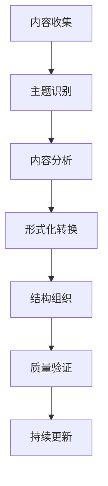

# 形式化架构分析框架 - 总体分析框架

## 目录

1. [项目概述](#1-项目概述)
2. [分析目标与范围](#2-分析目标与范围)
3. [方法论框架](#3-方法论框架)
4. [目录结构规范](#4-目录结构规范)
5. [内容组织原则](#5-内容组织原则)
6. [形式化规范](#6-形式化规范)
7. [进度跟踪机制](#7-进度跟踪机制)

## 1. 项目概述

### 1.1 项目目标

本项目旨在对 `/Matter` 目录下的所有内容进行深度分析，构建一个符合数学LaTeX规范的形式化知识体系，涵盖：

- **哲学基础**：本体论、认识论、伦理学、逻辑学、形而上学
- **数学理论**：范畴论、形式语言理论、数学基础、代数、几何、分析
- **形式化理论**：类型理论、控制理论、分布式理论、Petri网理论
- **软件架构**：系统设计、组件架构、微服务、设计模式
- **编程语言**：Rust、Go、编程范式、语言比较

### 1.2 分析特色

1. **形式化程度高**：使用严格的数学符号和逻辑推理
2. **跨学科整合**：哲学、数学、计算机科学的深度融合
3. **现代性强**：结合最新的软件架构和企业架构理论
4. **应用导向**：理论在实际系统中的应用验证
5. **多表征方式**：图表、数学公式、代码示例的综合表达

## 2. 分析目标与范围

### 2.1 核心目标

1. **内容梳理**：对Matter目录下所有内容进行系统性梳理
2. **主题归纳**：识别和归纳核心主题，消除重复内容
3. **形式化表达**：将内容转换为严格的数学形式化表达
4. **结构优化**：构建层次化的知识体系结构
5. **持续演进**：建立可持续的内容更新机制

### 2.2 分析范围

#### 2.2.1 内容范围

- **哲学内容**：7个子目录，997行核心内容
- **数学内容**：682行综合分析，涵盖主要数学分支
- **理论内容**：50+个理论文件，涵盖形式化理论体系
- **软件内容**：系统、组件、微服务、设计模式等
- **编程语言**：Rust、Go、编程范式等

#### 2.2.2 深度范围

- **理念层**：哲学基础和认知框架
- **形式科学层**：数学理论和逻辑体系
- **理论层**：具体科学理论和模型
- **算法层**：计算方法和实现技术
- **实践层**：实际应用和工程实践

## 3. 方法论框架

### 3.1 分析流程



### 3.2 分析原则

1. **系统性原则**：整体性、层次性、关联性
2. **严谨性原则**：逻辑性、一致性、完备性
3. **创新性原则**：前沿性、实用性、前瞻性
4. **规范性原则**：标准化、结构化、可维护性

### 3.3 质量标准

- **内容完整性**：覆盖所有相关主题
- **逻辑一致性**：理论间无矛盾
- **形式化程度**：使用严格的数学表达
- **实用性**：理论与实际应用结合

## 4. 目录结构规范

### 4.1 总体结构

```
Analysis/
├── 00-总体分析框架.md
├── 01-哲学基础理论/
├── 02-数学理论体系/
├── 03-形式化理论/
├── 04-软件架构理论/
├── 05-编程语言理论/
├── 06-系统设计实践/
├── 07-跨领域整合/
├── 08-前沿发展/
└── 09-索引导航/
```

### 4.2 编号规范

- **一级目录**：01-09，两位数编号
- **二级目录**：01.01-01.99，四位小数编号
- **三级目录**：01.01.01-01.01.99，六位小数编号
- **文件命名**：章节号-主题名称.md

### 4.3 内容结构

每个文档包含：

1. **目录**：完整的章节导航
2. **引言**：背景和目标
3. **理论基础**：相关概念和定义
4. **形式化表达**：数学符号和公式
5. **应用示例**：实际应用案例
6. **总结**：要点和展望
7. **参考文献**：相关资源链接

## 5. 内容组织原则

### 5.1 层次化组织

1. **基础层**：哲学和数学基础
2. **理论层**：形式化理论体系
3. **应用层**：软件架构和设计
4. **实践层**：具体实现和案例

### 5.2 关联性组织

1. **概念关联**：相关概念的链接
2. **理论关联**：理论间的依赖关系
3. **应用关联**：理论与应用的对应
4. **发展关联**：历史和发展的脉络

### 5.3 多表征组织

1. **文字描述**：概念和理论的解释
2. **数学公式**：形式化的数学表达
3. **图表说明**：可视化的关系图
4. **代码示例**：实际的实现代码

## 6. 形式化规范

### 6.1 数学符号规范

- **集合**：使用 $\mathbb{R}$, $\mathbb{Z}$, $\mathbb{N}$ 等
- **函数**：使用 $f: A \to B$ 格式
- **逻辑**：使用 $\land$, $\lor$, $\neg$, $\implies$ 等
- **量词**：使用 $\forall$, $\exists$ 等

### 6.2 LaTeX格式规范

```latex
% 定义环境
\newtheorem{definition}{定义}
\newtheorem{theorem}{定理}
\newtheorem{proof}{证明}

% 数学环境
\begin{definition}[概念名称]
定义内容
\end{definition}

\begin{theorem}[定理名称]
定理内容
\end{theorem}
```

### 6.3 代码规范

- **Rust代码**：使用现代Rust语法和最佳实践
- **Go代码**：遵循Go语言规范和设计模式
- **注释**：详细的注释和文档说明

## 7. 进度跟踪机制

### 7.1 进度指标

- **内容覆盖率**：已分析内容占总内容的比例
- **形式化程度**：使用数学符号的比例
- **质量评分**：内容质量和一致性评分
- **更新频率**：内容更新的及时性

### 7.2 跟踪文档

- **进度跟踪.md**：详细的进度记录
- **质量评估.md**：内容质量评估报告
- **更新日志.md**：内容更新历史记录

### 7.3 持续改进

- **定期审查**：定期审查内容质量和一致性
- **用户反馈**：收集用户反馈并改进
- **技术更新**：跟踪技术发展并更新内容

---

**版本信息**：v1.0  
**创建时间**：2024年12月  
**最后更新**：2024年12月  
**维护者**：AI Assistant
