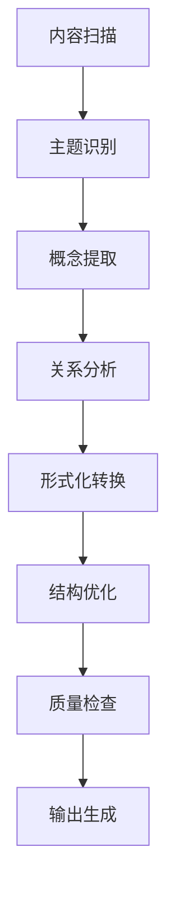

# 形式化架构理论总体分析框架

## 目录

1. [项目概述](#1-项目概述)
2. [分析目标与范围](#2-分析目标与范围)
3. [方法论框架](#3-方法论框架)
4. [内容分类体系](#4-内容分类体系)
5. [形式化规范](#5-形式化规范)
6. [输出结构规划](#6-输出结构规划)
7. [进度跟踪](#7-进度跟踪)

## 1. 项目概述

### 1.1 项目背景

本项目对 `/Matter` 目录下的所有内容进行系统性分析，包括：

- 哲学基础理论
- 数学理论体系
- 形式化语言理论
- 软件架构理论
- 编程语言理论
- 形式化模型理论
- 统一理论综合

### 1.2 分析目标

1. **内容梳理**：递归分析所有子目录和文件内容
2. **主题归纳**：识别和归纳核心主题与概念
3. **形式化转换**：将内容转换为符合数学LaTeX规范的形式化文档
4. **结构优化**：建立规范的目录结构和文件组织
5. **一致性保证**：确保内容的一致性、完整性和相关性

## 2. 分析目标与范围

### 2.1 分析范围

| 目录 | 内容类型 | 分析深度 | 优先级 |
|------|----------|----------|--------|
| Philosophy | 哲学基础理论 | 深度分析 | 高 |
| Mathematics | 数学理论体系 | 深度分析 | 高 |
| FormalLanguage | 形式语言理论 | 深度分析 | 高 |
| Theory | 统一理论综合 | 深度分析 | 高 |
| FormalModel | 形式化模型 | 深度分析 | 中 |
| Software | 软件架构 | 深度分析 | 中 |
| ProgrammingLanguage | 编程语言 | 深度分析 | 中 |

### 2.2 分析维度

1. **概念维度**：核心概念的定义、性质和关系
2. **理论维度**：理论框架、公理系统和推理规则
3. **应用维度**：实际应用场景和实现方法
4. **形式化维度**：数学符号、逻辑公式和证明
5. **交叉维度**：不同领域间的关联和整合

## 3. 方法论框架

### 3.1 分析流程



### 3.2 分析原则

1. **系统性原则**：全面覆盖所有相关内容
2. **一致性原则**：保持概念和术语的一致性
3. **层次性原则**：建立清晰的层次结构
4. **形式化原则**：使用严格的数学符号和逻辑
5. **实用性原则**：注重实际应用价值

## 4. 内容分类体系

### 4.1 一级分类

1. **哲学基础理论** (01-Philosophy)
2. **数学理论体系** (02-Mathematics)
3. **形式化理论基础** (03-FormalTheory)
4. **软件架构理论** (04-SoftwareArchitecture)
5. **编程语言理论** (05-ProgrammingLanguage)
6. **系统设计实践** (06-SystemDesign)
7. **索引与导航** (12-Index)

### 4.2 二级分类

每个一级分类下包含：

- 基础概念
- 核心理论
- 应用方法
- 案例分析
- 前沿发展

## 5. 形式化规范

### 5.1 数学符号规范

所有数学表达式必须使用LaTeX格式：

```latex
\documentclass{article}
\usepackage{amsmath}
\usepackage{amssymb}
\usepackage{amsthm}

\begin{document}

\section{定义}
\begin{definition}
设 $X$ 是一个集合，$f: X \rightarrow Y$ 是一个函数...
\end{definition}

\section{定理}
\begin{theorem}
如果条件 $P$ 成立，则结论 $Q$ 成立。
\end{theorem}

\begin{proof}
证明过程...
\end{proof}

\end{document}
```

### 5.2 文档结构规范

每个文档必须包含：

1. 标题和目录
2. 引言和背景
3. 核心内容（定义、定理、证明）
4. 应用和示例
5. 总结和展望
6. 参考文献

### 5.3 链接规范

- 内部链接：`[链接文本](#锚点)`
- 外部链接：`[链接文本](URL)`
- 文件链接：`[链接文本](文件路径)`

## 6. 输出结构规划

### 6.1 目录结构

```text
Analysis/
├── 00-总体分析框架.md
├── 01-哲学基础理论/
│   ├── 01-本体论基础.md
│   ├── 02-认识论基础.md
│   ├── 03-逻辑学基础.md
│   └── 04-伦理学基础.md
├── 02-数学理论体系/
│   ├── 01-集合论基础.md
│   ├── 02-代数理论.md
│   ├── 03-几何理论.md
│   └── 04-分析理论.md
├── 03-形式化理论基础/
│   ├── 01-形式语言理论.md
│   ├── 02-类型理论.md
│   ├── 03-控制理论.md
│   └── 04-并发理论.md
├── 04-软件架构理论/
│   ├── 01-架构基础.md
│   ├── 02-设计模式.md
│   ├── 03-微服务架构.md
│   └── 04-系统集成.md
├── 05-编程语言理论/
│   ├── 01-语言基础.md
│   ├── 02-类型系统.md
│   ├── 03-语义理论.md
│   └── 04-实现技术.md
├── 06-系统设计实践/
│   ├── 01-设计方法.md
│   ├── 02-实现技术.md
│   ├── 03-验证方法.md
│   └── 04-优化策略.md
└── 12-索引与导航/
    ├── 01-概念索引.md
    ├── 02-理论索引.md
    ├── 03-应用索引.md
    └── 04-导航地图.md
```

### 6.2 文件命名规范

- 使用数字前缀确保顺序
- 使用连字符分隔单词
- 使用描述性名称
- 使用小写字母

## 7. 进度跟踪

### 7.1 当前进度

- [x] 项目初始化
- [x] 目录结构分析
- [x] 总体框架设计
- [ ] 哲学基础理论分析
- [ ] 数学理论体系分析
- [ ] 形式化理论基础分析
- [ ] 软件架构理论分析
- [ ] 编程语言理论分析
- [ ] 系统设计实践分析
- [ ] 索引与导航建立

### 7.2 下一步计划

1. 深入分析哲学基础理论
2. 建立数学理论体系
3. 完善形式化理论基础
4. 整合软件架构理论
5. 建立完整的索引系统

### 7.3 质量保证

- 内容完整性检查
- 形式化规范检查
- 链接有效性检查
- 一致性检查
- 可读性检查

---

**更新时间**：2024年12月19日  
**版本**：v1.0  
**状态**：进行中
