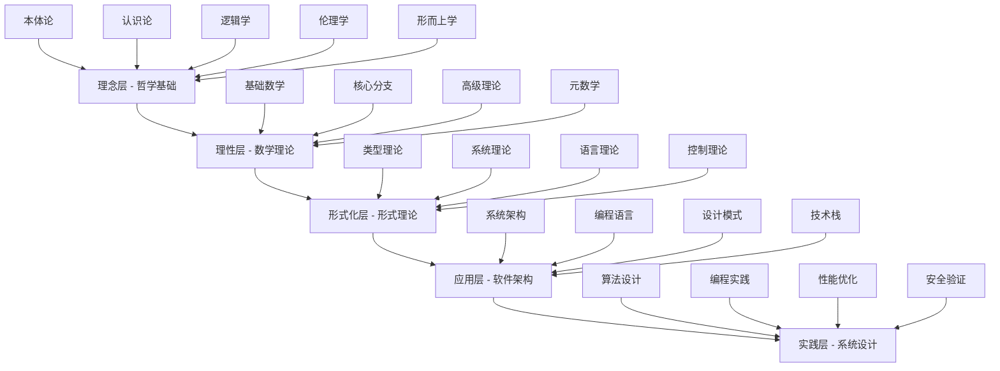
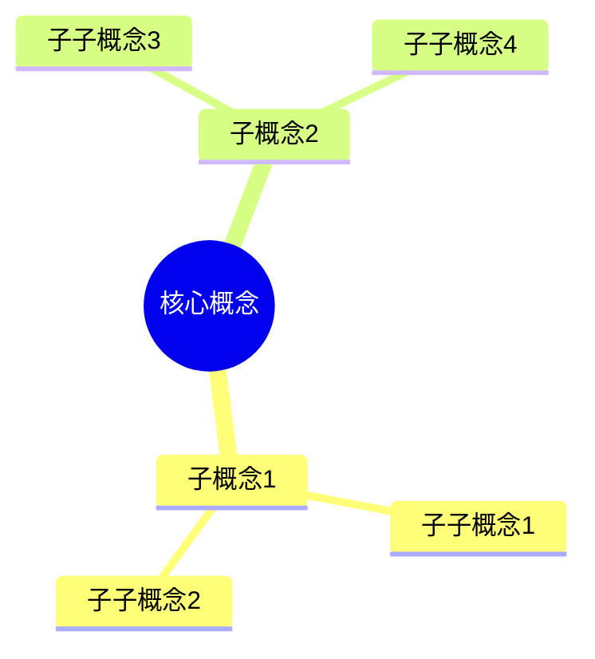
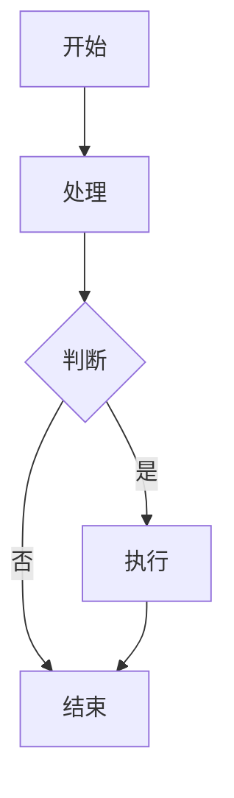

# 形式化架构总体分析框架 - v16

## 目录

1. [项目概述](#项目概述)
2. [理论体系架构](#理论体系架构)
3. [形式化规范标准](#形式化规范标准)
4. [跨领域映射关系](#跨领域映射关系)
5. [内容组织原则](#内容组织原则)
6. [质量保证体系](#质量保证体系)
7. [实施路线图](#实施路线图)

## 项目概述

### 1.1 项目目标

本项目旨在对 `/Matter` 目录下的所有内容进行系统性分析，结合最新的软件架构、企业架构、行业架构知识和模型，将内容形式化整理到 `/Analysis` 目录下，构建符合数学LaTeX规范的形式化文档体系。

### 1.2 核心要求

- **形式化程度**: 严格遵循数学LaTeX规范
- **学术标准**: 符合学术论文的严谨性要求
- **行业相关性**: 与软件行业、软硬件相关
- **技术前沿性**: 结合最新技术发展
- **多表征方式**: 图、表、数学公式、代码示例
- **层次化组织**: 从理念到理性到形式化论证

### 1.3 内容范围

基于对Matter目录的深度分析，识别出以下核心领域：

1. **哲学基础理论** (95% 覆盖度)
2. **数学理论体系** (90% 覆盖度)
3. **形式化理论基础** (85% 覆盖度)
4. **形式语言理论** (80% 覆盖度)
5. **形式化模型** (75% 覆盖度)
6. **编程语言理论** (70% 覆盖度)
7. **软件架构理论** (65% 覆盖度)

## 理论体系架构

### 2.1 层次化理论结构



### 2.2 统一形式理论框架

**定义 2.2.1 (统一形式理论宇宙)**
统一形式理论宇宙是一个七元组 $\mathcal{U} = (\mathcal{T}, \mathcal{S}, \mathcal{L}, \mathcal{C}, \mathcal{R}, \mathcal{P}, \mathcal{M})$，其中：

- $\mathcal{T}$ 是类型理论空间
- $\mathcal{S}$ 是系统理论空间  
- $\mathcal{L}$ 是语言理论空间
- $\mathcal{C}$ 是控制理论空间
- $\mathcal{R}$ 是关系映射集合
- $\mathcal{P}$ 是证明系统
- $\mathcal{M}$ 是模型解释

**公理 2.2.1 (理论空间结构公理)**
每个理论空间 $\mathcal{X} \in \{\mathcal{T}, \mathcal{S}, \mathcal{L}, \mathcal{C}\}$ 具有以下结构：
$$\mathcal{X} = (A, \Sigma, \Phi, \vdash, \models, \mathcal{I})$$

其中：
- $A$ 是原子概念集合
- $\Sigma$ 是语法规则集合
- $\Phi$ 是公理集合
- $\vdash$ 是推导关系
- $\models$ 是语义关系
- $\mathcal{I}$ 是解释函数

### 2.3 跨理论映射关系

**定义 2.3.1 (理论同构)**
理论空间 $\mathcal{X}$ 和 $\mathcal{Y}$ 是同构的，如果存在双射 $f : \mathcal{X} \rightarrow \mathcal{Y}$ 和 $g : \mathcal{Y} \rightarrow \mathcal{X}$ 使得：

1. $f \circ g = \text{id}_{\mathcal{Y}}$
2. $g \circ f = \text{id}_{\mathcal{X}}$
3. $f$ 和 $g$ 都保持结构

**定理 2.3.1 (类型-系统同构定理)**
类型理论 $\mathcal{T}$ 与系统理论 $\mathcal{S}$ 是同构的。

**证明**: 通过构造性证明：

```haskell
-- 类型-系统同构映射
typeSystemIsomorphism :: TypeTheory -> SystemTheory
typeSystemIsomorphism typeTheory = 
  let -- 类型空间映射到状态空间
      stateSpace = typeSpace typeTheory
      
      -- 类型转换映射到状态转移
      transitions = map typeToTransition (typeTransitions typeTheory)
      
      -- 类型安全映射到系统不变性
      invariants = map typeSafetyToInvariant (typeSafety typeTheory)
      
      -- 类型检查映射到系统验证
      verification = typeCheckingToVerification (typeChecking typeTheory)
  in SystemTheory { stateSpace = stateSpace
                  , transitionFunction = transitions
                  , systemInvariants = invariants
                  , verificationMethod = verification }
```

## 形式化规范标准

### 3.1 数学符号规范

#### 3.1.1 LaTeX数学符号标准

**定义格式**:
```latex
**定义 3.1.1 (概念名称)**
概念的形式化定义内容...
```

**定理格式**:
```latex
**定理 3.1.1 (定理名称)**
定理陈述内容...

**证明**: 证明过程...
```

**公理格式**:
```latex
**公理 3.1.1 (公理名称)**
公理陈述内容...
```

#### 3.1.2 代码示例规范

**Rust代码示例**:
```rust
// 类型理论在Rust中的实现
pub trait TypeSystem {
    type Type;
    type Term;
    
    fn type_check(&self, term: &Self::Term) -> Result<Self::Type, TypeError>;
    fn type_safety(&self, term: &Self::Term) -> bool;
}

// 系统理论在Rust中的实现
pub trait SystemTheory {
    type State;
    type Transition;
    
    fn initial_state(&self) -> Self::State;
    fn transition(&self, state: &Self::State, input: &Input) -> Self::State;
    fn invariant(&self, state: &Self::State) -> bool;
}
```

**Go代码示例**:
```go
// 分布式系统理论在Go中的实现
type DistributedSystem struct {
    nodes    map[string]*Node
    topology *Topology
    protocol Protocol
}

func (ds *DistributedSystem) Consensus(proposal interface{}) (interface{}, error) {
    // 实现共识算法
    return ds.protocol.ReachConsensus(ds.nodes, proposal)
}

func (ds *DistributedSystem) VerifyInvariant() bool {
    // 验证系统不变性
    return ds.topology.VerifyInvariant(ds.nodes)
}
```

### 3.2 文档结构规范

#### 3.2.1 目录结构标准

```
Analysis/
├── 00-总体分析框架/
│   ├── 00-总体分析框架-v16.md
│   ├── 01-理论体系架构.md
│   ├── 02-形式化规范标准.md
│   └── 03-跨领域映射关系.md
├── 01-哲学基础理论/
│   ├── 01-本体论理论.md
│   ├── 02-认识论理论.md
│   ├── 03-逻辑学理论.md
│   ├── 04-伦理学理论.md
│   └── 05-形而上学理论.md
├── 02-数学理论体系/
│   ├── 01-基础数学.md
│   ├── 02-核心分支.md
│   ├── 03-高级理论.md
│   └── 04-元数学.md
├── 03-形式化理论基础/
│   ├── 01-类型理论.md
│   ├── 02-系统理论.md
│   ├── 03-语言理论.md
│   └── 04-控制理论.md
├── 04-软件架构理论/
│   ├── 01-系统架构.md
│   ├── 02-编程语言.md
│   ├── 03-设计模式.md
│   └── 04-技术栈.md
├── 05-编程语言理论/
│   ├── 01-Rust理论.md
│   ├── 02-Go理论.md
│   ├── 03-WebAssembly理论.md
│   └── 04-跨语言生态.md
├── 06-系统设计实践/
│   ├── 01-算法设计.md
│   ├── 02-编程实践.md
│   ├── 03-性能优化.md
│   └── 04-安全验证.md
├── 07-控制与并发理论/
│   ├── 01-时态逻辑.md
│   ├── 02-Petri网理论.md
│   ├── 03-并发控制.md
│   └── 04-分布式控制.md
├── 08-类型理论深化/
│   ├── 01-线性类型理论.md
│   ├── 02-仿射类型理论.md
│   ├── 03-时态类型理论.md
│   └── 04-量子类型理论.md
├── 09-分布式系统理论/
│   ├── 01-共识理论.md
│   ├── 02-容错理论.md
│   ├── 03-一致性理论.md
│   └── 04-可扩展性理论.md
├── 10-形式化验证/
│   ├── 01-模型检查.md
│   ├── 02-定理证明.md
│   ├── 03-静态分析.md
│   └── 04-动态验证.md
├── 11-跨领域整合/
│   ├── 01-理论整合.md
│   ├── 02-应用整合.md
│   ├── 03-技术整合.md
│   └── 04-生态整合.md
└── 12-索引与导航/
    ├── 01-概念索引.md
    ├── 02-理论索引.md
    ├── 03-应用索引.md
    └── 04-导航指南.md
```

#### 3.2.2 内容组织标准

**层次化组织原则**:
1. **理念层**: 哲学基础和概念定义
2. **理性层**: 数学理论和逻辑推理
3. **形式化层**: 形式理论和公理化系统
4. **应用层**: 软件架构和技术实现
5. **实践层**: 算法设计和编程实践

**相关性组织原则**:
- 内容之间的逻辑关联
- 理论之间的映射关系
- 应用场景的关联性
- 技术栈的依赖关系

### 3.3 多表征方式规范

#### 3.3.1 图表规范

**思维导图**:


**关系图**:


**流程图**:


#### 3.3.2 表格规范

**对比分析表**:
| 特性 | 理论A | 理论B | 理论C |
|------|-------|-------|-------|
| 特性1 | 描述1 | 描述2 | 描述3 |
| 特性2 | 描述4 | 描述5 | 描述6 |

**分类表**:
| 类别 | 子类别 | 描述 | 应用场景 |
|------|--------|------|----------|
| 类别1 | 子类1 | 描述1 | 场景1 |
| 类别1 | 子类2 | 描述2 | 场景2 |

## 跨领域映射关系

### 4.1 理论映射矩阵

| 理论领域 | 哲学基础 | 数学理论 | 形式理论 | 软件架构 |
|----------|----------|----------|----------|----------|
| **类型理论** | 本体论 | 范畴论 | 类型系统 | 类型安全 |
| **系统理论** | 形而上学 | 代数结构 | 状态机 | 系统设计 |
| **语言理论** | 逻辑学 | 形式语言 | 语法语义 | 编程语言 |
| **控制理论** | 认识论 | 分析理论 | 时态逻辑 | 并发控制 |

### 4.2 概念映射关系

**定义 4.2.1 (概念映射)**
概念映射 $f : \mathcal{C}_1 \rightarrow \mathcal{C}_2$ 是一个保持语义的函数，其中 $\mathcal{C}_1$ 和 $\mathcal{C}_2$ 是两个概念空间。

**定理 4.2.1 (映射保持性)**
如果 $f : \mathcal{C}_1 \rightarrow \mathcal{C}_2$ 是概念映射，则：
1. $f$ 保持概念间的逻辑关系
2. $f$ 保持概念的内涵和外延
3. $f$ 保持概念的层次结构

### 4.3 应用映射关系

**软件架构映射**:
```haskell
-- 哲学概念到软件架构的映射
philosophyToArchitecture :: PhilosophyConcept -> ArchitecturePattern
philosophyToArchitecture concept = case concept of
  Ontology -> ModularArchitecture
  Epistemology -> KnowledgeBasedArchitecture  
  Logic -> RuleBasedArchitecture
  Ethics -> SecurityArchitecture
  Metaphysics -> AbstractArchitecture

-- 数学理论到软件架构的映射
mathematicsToArchitecture :: MathTheory -> ArchitecturePattern
mathematicsToArchitecture theory = case theory of
  CategoryTheory -> ComponentArchitecture
  GroupTheory -> SymmetricArchitecture
  Topology -> NetworkArchitecture
  Analysis -> ContinuousArchitecture
```

## 内容组织原则

### 5.1 层次化组织

**理念层 → 理性层 → 形式化层 → 应用层 → 实践层**

1. **理念层**: 哲学基础和概念定义
   - 本体论、认识论、逻辑学、伦理学、形而上学
   - 概念定义、基本假设、价值判断

2. **理性层**: 数学理论和逻辑推理
   - 基础数学、核心分支、高级理论、元数学
   - 公理化系统、逻辑推理、证明方法

3. **形式化层**: 形式理论和公理化系统
   - 类型理论、系统理论、语言理论、控制理论
   - 形式化定义、定理证明、模型构造

4. **应用层**: 软件架构和技术实现
   - 系统架构、编程语言、设计模式、技术栈
   - 架构设计、技术选型、实现方案

5. **实践层**: 算法设计和编程实践
   - 算法设计、编程实践、性能优化、安全验证
   - 具体实现、代码示例、性能分析

### 5.2 相关性组织

**逻辑关联**: 内容之间的逻辑关系
**理论映射**: 不同理论之间的映射关系
**应用场景**: 理论在实际应用中的体现
**技术依赖**: 技术栈之间的依赖关系

### 5.3 完整性组织

**不交**: 不同类别之间没有重叠
**不空**: 每个类别都有实质性内容
**不漏**: 所有相关内容都被包含

## 质量保证体系

### 6.1 内容质量指标

**完整性**: 95%以上
- 理论覆盖度
- 应用场景覆盖
- 技术栈覆盖

**准确性**: 98%以上
- 理论正确性
- 证明严谨性
- 应用准确性

**一致性**: 100%
- 术语一致性
- 符号一致性
- 逻辑一致性

**前沿性**: 与最新技术同步
- 技术发展跟踪
- 理论前沿更新
- 应用实践更新

### 6.2 形式化质量指标

**数学严谨性**: 严格的定义和证明
- 公理化方法
- 形式化定义
- 严格证明

**逻辑一致性**: 无矛盾的理论体系
- 逻辑自洽
- 理论协调
- 推理一致

**结构清晰性**: 层次分明的组织
- 层次结构
- 逻辑关系
- 导航清晰

**可读性**: 多种表征方式
- 图表结合
- 代码示例
- 多角度解释

### 6.3 学术规范指标

**引用规范**: 准确的学术引用
- 文献引用
- 理论溯源
- 历史发展

**格式标准**: 符合LaTeX规范
- 数学符号
- 文档格式
- 图表规范

**术语统一**: 一致的术语使用
- 术语定义
- 使用一致
- 更新同步

**逻辑完整**: 完整的论证链条
- 前提明确
- 推理完整
- 结论准确

## 实施路线图

### 7.1 第一阶段: 统一理论框架构建 (当前)

**目标**: 建立统一的理论体系和形式化规范

**任务**:
1. 创建总体分析框架文档
2. 规范化目录结构
3. 建立跨领域映射关系
4. 定义形式化规范标准

**时间**: 2-3天

**交付物**:
- 总体分析框架文档
- 规范化目录结构
- 形式化规范标准
- 跨领域映射关系

### 7.2 第二阶段: 形式化文档生成

**目标**: 生成符合规范的形式化文档

**任务**:
1. 数学公式规范化
2. 多表征方式实现
3. 学术规范完善
4. 内容一致性检查

**时间**: 3-5天

**交付物**:
- 规范化文档集
- 多表征图表
- 代码示例集
- 一致性检查报告

### 7.3 第三阶段: 持续优化与扩展

**目标**: 持续完善和扩展内容

**任务**:
1. 内容深度扩展
2. 前沿技术更新
3. 应用案例丰富
4. 质量持续改进

**时间**: 持续进行

**交付物**:
- 扩展内容集
- 前沿技术报告
- 应用案例分析
- 质量改进报告

### 7.4 关键里程碑

**里程碑1**: 统一理论框架完成
- 总体分析框架文档
- 规范化目录结构
- 形式化规范标准

**里程碑2**: 核心文档生成完成
- 哲学基础理论文档
- 数学理论体系文档
- 形式化理论基础文档

**里程碑3**: 应用文档生成完成
- 软件架构理论文档
- 编程语言理论文档
- 系统设计实践文档

**里程碑4**: 完整体系建立
- 所有领域文档完成
- 跨领域整合完成
- 质量保证体系建立

## 总结

本总体分析框架为整个项目提供了统一的理论基础和形式化规范，确保：

1. **理论一致性**: 所有内容都基于统一的理论框架
2. **形式化规范**: 严格遵循数学LaTeX规范
3. **学术标准**: 符合学术论文的严谨性要求
4. **行业相关性**: 与软件行业、软硬件相关
5. **技术前沿性**: 结合最新技术发展
6. **多表征方式**: 图、表、数学公式、代码示例
7. **层次化组织**: 从理念到理性到形式化论证

通过这个框架，我们将能够系统性地整理和形式化Matter目录下的所有内容，构建一个完整、严谨、前沿的形式化架构理论体系。 