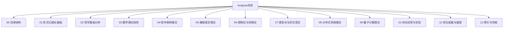

# 形式化架构分析项目目录结构

## 总体架构



## 详细目录结构

### 01-形式化理论基础/
```
01-形式化理论基础/
├── 01.01-形式化方法基础.md
├── 01.02-逻辑系统与证明理论.md
├── 01.03-公理化系统与元理论.md
├── 01.04-形式语义学基础.md
├── 01.05-计算理论基础.md
├── 01.06-形式化验证方法.md
├── 01.07-形式化建模技术.md
└── 01.08-形式化理论基础总结.md
```

### 02-哲学基础分析/
```
02-哲学基础分析/
├── 02.01-本体论分析/
│   ├── 02.01.01-数学本体论.md
│   ├── 02.01.02-现实本体论.md
│   ├── 02.01.03-信息本体论.md
│   ├── 02.01.04-AI本体论.md
│   └── 02.01.05-本体论综合比较.md
├── 02.02-认识论分析/
│   ├── 02.02.01-知识论与真理理论.md
│   ├── 02.02.02-知识来源分析.md
│   ├── 02.02.03-知识结构分析.md
│   ├── 02.02.04-认知科学视角.md
│   └── 02.02.05-AI认识论分析.md
├── 02.03-伦理学分析/
│   ├── 02.03.01-规范伦理学分析.md
│   ├── 02.03.02-元伦理学分析.md
│   ├── 02.03.03-应用伦理学分析.md
│   ├── 02.03.04-AI伦理分析.md
│   └── 02.03.05-形式化伦理学.md
├── 02.04-逻辑学分析/
│   ├── 02.04.01-形式逻辑分析.md
│   ├── 02.04.02-哲学逻辑分析.md
│   ├── 02.04.03-非经典逻辑分析.md
│   ├── 02.04.04-逻辑哲学分析.md
│   └── 02.04.05-计算逻辑应用.md
├── 02.05-形而上学分析/
│   ├── 02.05.01-存在论分析.md
│   ├── 02.05.02-模态形而上学分析.md
│   ├── 02.05.03-时间空间哲学.md
│   ├── 02.05.04-因果性分析.md
│   └── 02.05.05-形而上学综合.md
└── 02.06-交叉领域哲学/
    ├── 02.06.01-数学哲学/
    ├── 02.06.02-科学哲学/
    ├── 02.06.03-认知哲学/
    └── 02.06.04-技术哲学/
```

### 03-数学理论体系/
```
03-数学理论体系/
├── 03.01-基础数学/
│   ├── 03.01.01-集合论基础.md
│   ├── 03.01.02-数系与代数结构.md
│   ├── 03.01.03-逻辑与证明理论.md
│   └── 03.01.04-数学基础总结.md
├── 03.02-范畴论/
│   ├── 03.02.01-范畴论基础概念.md
│   ├── 03.02.02-函子与自然变换.md
│   ├── 03.02.03-极限与余极限.md
│   ├── 03.02.04-Yoneda引理与伴随函子.md
│   └── 03.02.05-范畴论应用.md
├── 03.03-代数理论/
│   ├── 03.03.01-群论.md
│   ├── 03.03.02-环论与域论.md
│   ├── 03.03.03-线性代数.md
│   └── 03.03.04-代数几何.md
├── 03.04-几何理论/
│   ├── 03.04.01-拓扑学.md
│   ├── 03.04.02-微分几何.md
│   ├── 03.04.03-代数几何.md
│   └── 03.04.04-几何应用.md
├── 03.05-分析理论/
│   ├── 03.05.01-实分析.md
│   ├── 03.05.02-复分析.md
│   ├── 03.05.03-泛函分析.md
│   └── 03.05.04-分析应用.md
├── 03.06-数论与概率/
│   ├── 03.06.01-数论基础.md
│   ├── 03.06.02-概率论.md
│   ├── 03.06.03-统计学.md
│   └── 03.06.04-随机过程.md
└── 03.07-元数学/
    ├── 03.07.01-数学基础.md
    ├── 03.07.02-数学哲学.md
    ├── 03.07.03-元数学理论.md
    └── 03.07.04-数学发展史.md
```

### 04-软件架构理论/
```
04-软件架构理论/
├── 04.01-架构基础理论/
│   ├── 04.01.01-软件架构定义与原则.md
│   ├── 04.01.02-架构模式与风格.md
│   ├── 04.01.03-架构质量属性.md
│   └── 04.01.04-架构决策框架.md
├── 04.02-微服务架构/
│   ├── 04.02.01-微服务基础理论.md
│   ├── 04.02.02-服务拆分策略.md
│   ├── 04.02.03-服务通信模式.md
│   ├── 04.02.04-服务治理.md
│   └── 04.02.05-微服务实现.md
├── 04.03-分布式系统/
│   ├── 04.03.01-分布式系统基础.md
│   ├── 04.03.02-一致性理论.md
│   ├── 04.03.03-容错机制.md
│   ├── 04.03.04-分布式算法.md
│   └── 04.03.05-分布式系统实现.md
├── 04.04-工作流系统/
│   ├── 04.04.01-工作流理论基础.md
│   ├── 04.04.02-工作流模式.md
│   ├── 04.04.03-工作流引擎.md
│   └── 04.04.04-工作流应用.md
├── 04.05-设计模式/
│   ├── 04.05.01-创建型模式.md
│   ├── 04.05.02-结构型模式.md
│   ├── 04.05.03-行为型模式.md
│   └── 04.05.04-架构模式.md
├── 04.06-组件化架构/
│   ├── 04.06.01-组件理论基础.md
│   ├── 04.06.02-组件设计原则.md
│   ├── 04.06.03-组件通信.md
│   └── 04.06.04-组件化实现.md
└── 04.07-系统架构/
    ├── 04.07.01-系统架构基础.md
    ├── 04.07.02-企业架构.md
    ├── 04.07.03-行业架构.md
    └── 04.07.04-系统架构实践.md
```

### 05-编程语言理论/
```
05-编程语言理论/
├── 05.01-语言理论基础/
│   ├── 05.01.01-编程语言基础.md
│   ├── 05.01.02-语言设计原则.md
│   ├── 05.01.03-语言实现技术.md
│   └── 05.01.04-语言评估标准.md
├── 05.02-编程范式/
│   ├── 05.02.01-命令式编程.md
│   ├── 05.02.02-函数式编程.md
│   ├── 05.02.03-面向对象编程.md
│   ├── 05.02.04-逻辑编程.md
│   └── 05.02.05-并发编程.md
├── 05.03-Rust语言/
│   ├── 05.03.01-Rust基础理论.md
│   ├── 05.03.02-所有权系统.md
│   ├── 05.03.03-类型系统.md
│   ├── 05.03.04-并发模型.md
│   └── 05.03.05-Rust应用.md
├── 05.04-Go语言/
│   ├── 05.04.01-Go基础理论.md
│   ├── 05.04.02-并发模型.md
│   ├── 05.04.03-接口系统.md
│   ├── 05.04.04-垃圾回收.md
│   └── 05.04.05-Go应用.md
└── 05.05-语言比较/
    ├── 05.05.01-语言特性比较.md
    ├── 05.05.02-性能比较.md
    ├── 05.05.03-应用场景比较.md
    └── 05.05.04-选择指南.md
```

### 06-控制论与系统论/
```
06-控制论与系统论/
├── 06.01-控制论基础/
│   ├── 06.01.01-控制论基本概念.md
│   ├── 06.01.02-反馈控制理论.md
│   ├── 06.01.03-系统稳定性.md
│   └── 06.01.04-控制算法.md
├── 06.02-时态逻辑控制/
│   ├── 06.02.01-时态逻辑基础.md
│   ├── 06.02.02-线性时态逻辑.md
│   ├── 06.02.03-分支时态逻辑.md
│   ├── 06.02.04-时态逻辑控制.md
│   └── 06.02.05-时态逻辑应用.md
├── 06.03-系统论/
│   ├── 06.03.01-系统论基础.md
│   ├── 06.03.02-复杂系统理论.md
│   ├── 06.03.03-自组织系统.md
│   └── 06.03.04-系统优化.md
└── 06.04-控制论应用/
    ├── 06.04.01-软件系统控制.md
    ├── 06.04.02-网络控制.md
    ├── 06.04.03-智能控制.md
    └── 06.04.04-控制论实践.md
```

### 07-类型论与形式语言/
```
07-类型论与形式语言/
├── 07.01-类型论基础/
│   ├── 07.01.01-类型论基本概念.md
│   ├── 07.01.02-简单类型论.md
│   ├── 07.01.03-依赖类型论.md
│   └── 07.01.04-同伦类型论.md
├── 07.02-线性类型论/
│   ├── 07.02.01-线性类型论基础.md
│   ├── 07.02.02-仿射类型论.md
│   ├── 07.02.03-线性逻辑.md
│   └── 07.02.04-线性类型论应用.md
├── 07.03-形式语言理论/
│   ├── 07.03.01-形式语言基础.md
│   ├── 07.03.02-自动机理论.md
│   ├── 07.03.03-形式文法.md
│   └── 07.03.04-语言层次.md
└── 07.04-计算理论/
    ├── 07.04.01-可计算性理论.md
    ├── 07.04.02-计算复杂性.md
    ├── 07.04.03-算法理论.md
    └── 07.04.04-计算理论应用.md
```

### 08-分布式系统理论/
```
08-分布式系统理论/
├── 08.01-分布式基础/
│   ├── 08.01.01-分布式系统基础.md
│   ├── 08.01.02-分布式算法.md
│   ├── 08.01.03-分布式协议.md
│   └── 08.01.04-分布式架构.md
├── 08.02-一致性理论/
│   ├── 08.02.01-一致性基础.md
│   ├── 08.02.02-CAP定理.md
│   ├── 08.02.03-一致性算法.md
│   └── 08.02.04-一致性实践.md
├── 08.03-Petri网理论/
│   ├── 08.03.01-Petri网基础.md
│   ├── 08.03.02-Petri网分析.md
│   ├── 08.03.03-Petri网应用.md
│   └── 08.03.04-Petri网扩展.md
└── 08.04-分布式应用/
    ├── 08.04.01-分布式数据库.md
    ├── 08.04.02-分布式计算.md
    ├── 08.04.03-分布式存储.md
    └── 08.04.04-分布式系统实践.md
```

### 09-量子计算理论/
```
09-量子计算理论/
├── 09.01-量子基础/
│   ├── 09.01.01-量子力学基础.md
│   ├── 09.01.02-量子信息理论.md
│   ├── 09.01.03-量子比特.md
│   └── 09.01.04-量子门.md
├── 09.02-量子算法/
│   ├── 09.02.01-量子算法基础.md
│   ├── 09.02.02-Shor算法.md
│   ├── 09.02.03-Grover算法.md
│   └── 09.02.04-量子机器学习.md
├── 09.03-量子类型论/
│   ├── 09.03.01-量子类型论基础.md
│   ├── 09.03.02-量子线性类型论.md
│   ├── 09.03.03-量子计算语义.md
│   └── 09.03.04-量子类型论应用.md
└── 09.04-量子系统/
    ├── 09.04.01-量子系统理论.md
    ├── 09.04.02-量子控制.md
    ├── 09.04.03-量子通信.md
    └── 09.04.04-量子计算实践.md
```

### 10-综合应用与实现/
```
10-综合应用与实现/
├── 10.01-架构实现/
│   ├── 10.01.01-微服务实现.md
│   ├── 10.01.02-分布式系统实现.md
│   ├── 10.01.03-工作流系统实现.md
│   └── 10.01.04-组件化实现.md
├── 10.02-算法实现/
│   ├── 10.02.01-控制算法实现.md
│   ├── 10.02.02-分布式算法实现.md
│   ├── 10.02.03-量子算法实现.md
│   └── 10.02.04-机器学习算法实现.md
├── 10.03-语言实现/
│   ├── 10.03.01-Rust实现案例.md
│   ├── 10.03.02-Go实现案例.md
│   ├── 10.03.03-函数式编程实现.md
│   └── 10.03.04-并发编程实现.md
└── 10.04-系统集成/
    ├── 10.04.01-系统集成理论.md
    ├── 10.04.02-集成模式.md
    ├── 10.04.03-集成技术.md
    └── 10.04.04-集成实践.md
```

### 11-前沿发展与展望/
```
11-前沿发展与展望/
├── 11.01-理论前沿/
│   ├── 11.01.01-形式化理论前沿.md
│   ├── 11.01.02-数学理论前沿.md
│   ├── 11.01.03-计算机科学前沿.md
│   └── 11.01.04-哲学前沿.md
├── 11.02-技术前沿/
│   ├── 11.02.01-软件架构前沿.md
│   ├── 11.02.02-编程语言前沿.md
│   ├── 11.02.03-分布式系统前沿.md
│   └── 11.02.04-量子计算前沿.md
├── 11.03-应用前沿/
│   ├── 11.03.01-AI应用前沿.md
│   ├── 11.03.02-云计算前沿.md
│   ├── 11.03.03-边缘计算前沿.md
│   └── 11.03.04-区块链前沿.md
└── 11.04-未来展望/
    ├── 11.04.01-技术发展趋势.md
    ├── 11.04.02-理论发展方向.md
    ├── 11.04.03-应用发展前景.md
    └── 11.04.04-挑战与机遇.md
```

### 12-索引与导航/
```
12-索引与导航/
├── 12.01-主题索引.md
├── 12.02-概念索引.md
├── 12.03-理论索引.md
├── 12.04-应用索引.md
├── 12.05-学习路径.md
├── 12.06-快速导航.md
└── 12.07-搜索指南.md
```

## 文件命名规范

### 1. 文件命名规则
- **格式**：`章节号-章节名.md`
- **章节号**：使用两位数字，如 `01`、`02`、`03`
- **子章节号**：使用四位数字，如 `01.01`、`01.02`
- **子子章节号**：使用六位数字，如 `01.01.01`、`01.01.02`

### 2. 目录命名规则
- **主目录**：`章节号-章节名/`
- **子目录**：`章节号.子章节号-子章节名/`

### 3. 内容组织规则
- **层次化**：从基础到应用，从理论到实践
- **模块化**：每个文件独立完整，可单独阅读
- **关联性**：文件间有明确的关联关系
- **可扩展**：支持后续内容的扩展和更新

## 质量保证

### 1. 内容质量
- **学术规范**：符合学术写作标准
- **逻辑严密**：严格的逻辑推理过程
- **证明完整**：充分的论证和证明
- **应用有效**：实际应用的有效性验证

### 2. 形式化质量
- **数学正确性**：数学符号和公式的准确性
- **LaTeX规范**：符合LaTeX数学排版规范
- **图表清晰**：图表和可视化的清晰度
- **代码可执行**：代码示例的可执行性

### 3. 结构质量
- **层次清晰**：目录结构层次分明
- **分类合理**：内容分类科学合理
- **导航便利**：便于查找和导航
- **扩展灵活**：支持内容的扩展和更新

---

*本目录结构为形式化架构分析项目提供了完整的组织框架，确保内容的系统性、完整性和可扩展性。* 