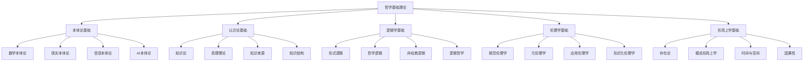

# 00-哲学基础理论总论

## 目录

1. [理论概述](#1-理论概述)
2. [哲学体系架构](#2-哲学体系架构)
3. [核心概念体系](#3-核心概念体系)
4. [形式化表示](#4-形式化表示)
5. [跨学科整合](#5-跨学科整合)
6. [理论应用](#6-理论应用)
7. [参考文献](#7-参考文献)

## 1. 理论概述

### 1.1 哲学基础理论定位

哲学基础理论是形式化架构理论体系的根基，为整个理论体系提供：

- **本体论基础**：存在、实体、属性的形式化定义
- **认识论基础**：知识、真理、信念的形式化理论
- **逻辑学基础**：推理、证明、论证的形式化方法
- **伦理学基础**：价值、规范、义务的形式化框架
- **形而上学基础**：模态、因果、时空的形式化模型

### 1.2 理论特色

本哲学基础理论体系具有以下特色：

1. **高度形式化**：使用数学符号、逻辑公式、编程代码进行精确表达
2. **跨学科整合**：深度整合数学、计算机科学、认知科学、AI等领域
3. **现代导向**：重点关注当代技术发展带来的哲学问题
4. **应用导向**：将哲学理论与实际应用相结合
5. **创新性**：提供独特的跨学科哲学视角

### 1.3 理论目标

- 建立统一的哲学概念体系
- 提供形式化的哲学分析方法
- 支持跨学科的哲学应用
- 为软件架构和系统设计提供哲学基础

## 2. 哲学体系架构

### 2.1 整体架构



### 2.2 理论层次

| 层次 | 内容 | 形式化程度 | 应用领域 |
|------|------|------------|----------|
| **理念层** | 哲学基本概念和原理 | 高 | 理论构建 |
| **形式科学层** | 逻辑和数学方法 | 极高 | 形式化分析 |
| **理论层** | 哲学理论体系 | 高 | 理论应用 |
| **具体科学层** | 应用哲学理论 | 中 | 实际问题 |
| **实践层** | 哲学方法应用 | 中 | 工程实践 |

## 3. 核心概念体系

### 3.1 本体论概念

#### 3.1.1 存在概念

```rust
// 存在的基本定义
trait Existence {
    fn exists(&self) -> bool;
    fn essence(&self) -> Essence;
    fn properties(&self) -> Vec<Property>;
}

// 实体定义
struct Entity {
    id: EntityId,
    essence: Essence,
    properties: Vec<Property>,
    relations: Vec<Relation>
}

// 属性定义
struct Property {
    name: String,
    value: PropertyValue,
    type_info: PropertyType
}

// 关系定义
struct Relation {
    source: EntityId,
    target: EntityId,
    relation_type: RelationType,
    properties: Vec<Property>
}
```

#### 3.1.2 本体论立场

```rust
enum OntologicalPosition {
    // 数学本体论
    Platonism,         // 柏拉图主义
    Formalism,         // 形式主义
    Intuitionism,      // 直觉主义
    Structuralism,     // 结构主义
    Fictionalism,      // 虚构主义
    
    // 现实本体论
    Realism,           // 实在论
    AntiRealism,       // 反实在论
    Materialism,       // 唯物论
    Idealism,          // 唯心论
    Dualism,           // 二元论
    
    // 信息本体论
    InformationRealism, // 信息实在论
    Computationalism,   // 计算主义
    DigitalPhysics      // 数字物理学
}
```

### 3.2 认识论概念

#### 3.2.1 知识定义

```rust
// 知识的JTB理论
struct Knowledge {
    belief: Belief,
    truth: bool,
    justification: Justification
}

// 信念系统
struct Belief {
    content: Proposition,
    strength: f64,  // 信念强度 [0,1]
    source: BeliefSource
}

// 确证理论
trait Justification {
    fn is_justified(&self) -> bool;
    fn justification_type(&self) -> JustificationType;
    fn justification_strength(&self) -> f64;
}
```

#### 3.2.2 真理理论

```rust
enum TruthTheory {
    Correspondence,    // 符合论
    Coherence,         // 融贯论
    Pragmatic,         // 实用主义
    Deflationary       // 紧缩论
}

// 真理评估
struct TruthEvaluation {
    proposition: Proposition,
    theory: TruthTheory,
    evaluation: f64,  // 真值度 [0,1]
    evidence: Vec<Evidence>
}
```

### 3.3 逻辑学概念

#### 3.3.1 逻辑系统

```rust
// 逻辑系统定义
struct LogicalSystem {
    language: FormalLanguage,
    axioms: Vec<Axiom>,
    inference_rules: Vec<InferenceRule>,
    semantics: Semantics
}

// 推理规则
struct InferenceRule {
    name: String,
    premises: Vec<Formula>,
    conclusion: Formula,
    conditions: Vec<Condition>
}

// 证明系统
struct Proof {
    premises: Vec<Formula>,
    steps: Vec<ProofStep>,
    conclusion: Formula,
    validity: bool
}
```

## 4. 形式化表示

### 4.1 数学符号系统

#### 4.1.1 本体论符号

- $\exists x$ : 存在量词
- $\forall x$ : 全称量词
- $E(x)$ : 存在谓词
- $P(x)$ : 属性谓词
- $R(x,y)$ : 关系谓词

#### 4.1.2 认识论符号

- $K_a p$ : 主体a知道p
- $B_a p$ : 主体a相信p
- $J_a p$ : 主体a确证p
- $T(p)$ : p为真

#### 4.1.3 逻辑符号

- $\land$ : 合取
- $\lor$ : 析取
- $\neg$ : 否定
- $\rightarrow$ : 蕴含
- $\leftrightarrow$ : 等价
- $\Box$ : 必然
- $\Diamond$ : 可能

### 4.2 形式化公理

#### 4.2.1 本体论公理

**存在公理**：
$$\forall x (E(x) \leftrightarrow \exists y (y = x))$$

**属性公理**：
$$\forall x \forall P (P(x) \rightarrow E(x))$$

**关系公理**：
$$\forall x \forall y \forall R (R(x,y) \rightarrow E(x) \land E(y))$$

#### 4.2.2 认识论公理

**知识公理**：
$$K_a p \rightarrow p$$

**信念公理**：
$$B_a p \rightarrow \neg B_a \neg p$$

**确证公理**：
$$J_a p \rightarrow B_a p$$

#### 4.2.3 逻辑公理

**经典逻辑公理**：
$$p \lor \neg p$$

**模态逻辑公理**：
$$\Box p \rightarrow p$$
$$\Box p \rightarrow \Box \Box p$$

## 5. 跨学科整合

### 5.1 与数学的整合

哲学基础理论与数学的整合体现在：

1. **集合论基础**：使用集合论作为本体论的形式化基础
2. **范畴论应用**：使用范畴论统一处理不同哲学概念
3. **逻辑代数**：使用布尔代数和格论处理逻辑关系
4. **概率论**：使用概率论处理不确定性和信念强度

### 5.2 与计算机科学的整合

与计算机科学的整合包括：

1. **形式化方法**：使用形式化方法进行哲学概念建模
2. **编程语言**：使用Rust、Go等语言实现哲学概念
3. **算法思维**：使用算法思维处理哲学推理
4. **数据结构**：使用数据结构组织哲学知识

### 5.3 与认知科学的整合

与认知科学的整合体现在：

1. **认知架构**：基于认知科学理论构建哲学认知模型
2. **心智哲学**：整合心智哲学和认知科学的研究成果
3. **学习理论**：使用学习理论解释知识获取过程
4. **意识研究**：整合意识研究的哲学和科学视角

## 6. 理论应用

### 6.1 软件架构应用

哲学基础理论在软件架构中的应用：

1. **本体论建模**：为软件系统建立本体论模型
2. **知识表示**：为知识库系统提供理论基础
3. **逻辑推理**：为推理引擎提供逻辑基础
4. **价值对齐**：为AI系统提供价值对齐框架

### 6.2 系统设计应用

在系统设计中的应用：

1. **概念建模**：使用哲学概念进行系统概念建模
2. **需求分析**：使用哲学方法进行需求分析
3. **架构决策**：使用哲学理论指导架构决策
4. **质量评估**：使用哲学标准评估系统质量

### 6.3 教育应用

在教育领域的应用：

1. **思维训练**：使用哲学方法训练逻辑思维
2. **概念理解**：使用哲学理论深化概念理解
3. **批判性思维**：使用哲学方法培养批判性思维
4. **创新思维**：使用哲学理论激发创新思维

## 7. 参考文献

### 7.1 哲学经典文献

1. Aristotle. *Metaphysics*.
2. Kant, I. *Critique of Pure Reason*.
3. Russell, B. *The Problems of Philosophy*.
4. Quine, W.V.O. *Word and Object*.

### 7.2 现代哲学文献

1. Chalmers, D. *The Conscious Mind*.
2. Dennett, D. *Consciousness Explained*.
3. Searle, J. *The Construction of Social Reality*.
4. Putnam, H. *Reason, Truth and History*.

### 7.3 形式化哲学文献

1. Carnap, R. *The Logical Structure of the World*.
2. Tarski, A. *The Concept of Truth in Formalized Languages*.
3. Kripke, S. *Naming and Necessity*.
4. Lewis, D. *On the Plurality of Worlds*.

### 7.4 跨学科文献

1. Hofstadter, D. *Gödel, Escher, Bach*.
2. Dennett, D. *From Bacteria to Bach and Back*.
3. Chalmers, D. *The Character of Consciousness*.
4. Floridi, L. *The Philosophy of Information*.

---

**文件**: `00-哲学基础理论总论.md`  
**版本**: v60  
**创建时间**: 2024年  
**最后更新**: 2024年当前时间  
**相关文件**:

- [01-本体论基础](01-本体论基础.md)
- [02-认识论基础](02-认识论基础.md)
- [03-逻辑学基础](03-逻辑学基础.md)
- [04-伦理学基础](04-伦理学基础.md)
- [05-形而上学基础](05-形而上学基础.md)
