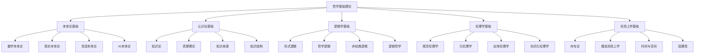

# 哲学基础理论总论

## 1. 理论体系概述

### 1.1 哲学基础理论的定义

哲学基础理论是形式化架构理论体系的根本基础，为整个理论体系提供认识论、本体论、逻辑学和伦理学的基础支撑。本理论体系采用严格的形式化方法，将传统哲学概念与现代数学、计算机科学、认知科学相结合，构建了一个跨学科的哲学理论框架。

**形式化定义**：

$$\Phi = \langle \mathcal{O}, \mathcal{E}, \mathcal{L}, \mathcal{M}, \mathcal{A} \rangle$$

其中：

- $\mathcal{O}$ 表示本体论体系 (Ontology)
- $\mathcal{E}$ 表示认识论体系 (Epistemology)
- $\mathcal{L}$ 表示逻辑学体系 (Logic)
- $\mathcal{M}$ 表示形而上学体系 (Metaphysics)
- $\mathcal{A}$ 表示伦理学体系 (Ethics)

### 1.2 理论体系结构



## 2. 核心理论框架

### 2.1 本体论基础 (Ontology)

本体论研究存在的本质和基本结构，在形式化架构理论中，本体论为软件系统、数据结构、算法等提供存在性基础。

**形式化表示**：

$$\mathcal{O} = \langle \mathcal{E}, \mathcal{R}, \mathcal{P} \rangle$$

其中：

- $\mathcal{E}$ 表示实体集合 (Entities)
- $\mathcal{R}$ 表示关系集合 (Relations)
- $\mathcal{P}$ 表示属性集合 (Properties)

**核心问题**：

1. 什么是存在？
2. 存在的基本类别是什么？
3. 实体间的关系如何？
4. 属性如何依附于实体？

### 2.2 认识论基础 (Epistemology)

认识论研究知识的本质、来源、范围和界限，为形式化方法提供认识论基础。

**形式化表示**：

$$\mathcal{E} = \langle \mathcal{K}, \mathcal{J}, \mathcal{T} \rangle$$

其中：

- $\mathcal{K}$ 表示知识集合 (Knowledge)
- $\mathcal{J}$ 表示确证集合 (Justification)
- $\mathcal{T}$ 表示真理集合 (Truth)

**核心问题**：

1. 什么是知识？
2. 知识如何获得？
3. 知识的界限在哪里？
4. 如何确证知识？

### 2.3 逻辑学基础 (Logic)

逻辑学研究推理的有效性和正确性，为形式化证明和验证提供理论基础。

**形式化表示**：

$$\mathcal{L} = \langle \mathcal{S}, \mathcal{I}, \mathcal{V} \rangle$$

其中：

- $\mathcal{S}$ 表示语法系统 (Syntax)
- $\mathcal{I}$ 表示解释系统 (Interpretation)
- $\mathcal{V}$ 表示有效性系统 (Validity)

**核心问题**：

1. 什么是有效的推理？
2. 逻辑真理的本质是什么？
3. 如何构建形式系统？
4. 逻辑与语言的关系如何？

### 2.4 伦理学基础 (Ethics)

伦理学研究道德价值和规范，为软件系统的伦理设计和价值对齐提供理论基础。

**形式化表示**：

$$\mathcal{A} = \langle \mathcal{V}, \mathcal{N}, \mathcal{D} \rangle$$

其中：

- $\mathcal{V}$ 表示价值集合 (Values)
- $\mathcal{N}$ 表示规范集合 (Norms)
- $\mathcal{D}$ 表示决策集合 (Decisions)

**核心问题**：

1. 什么是善？
2. 如何做出道德决策？
3. 价值如何对齐？
4. 责任如何分配？

### 2.5 形而上学基础 (Metaphysics)

形而上学研究实在的终极本质，为形式化理论提供本体论基础。

**形式化表示**：

$$\mathcal{M} = \langle \mathcal{R}, \mathcal{C}, \mathcal{T} \rangle$$

其中：

- $\mathcal{R}$ 表示实在集合 (Reality)
- $\mathcal{C}$ 表示因果集合 (Causality)
- $\mathcal{T}$ 表示时间集合 (Time)

**核心问题**：

1. 什么是实在？
2. 因果关系如何？
3. 时间空间如何？
4. 自由意志是否存在？

## 3. 跨学科整合

### 3.1 与数学的整合

哲学基础理论与数学理论体系的整合体现在：

1. **形式化方法**：使用数学符号和逻辑公式表达哲学概念
2. **证明理论**：将哲学论证形式化为数学证明
3. **结构分析**：使用数学结构分析哲学概念关系
4. **模型构建**：构建哲学概念的数学模型

**整合框架**：

$$\Phi \cap \mathcal{M} = \langle \mathcal{F}, \mathcal{P}, \mathcal{S} \rangle$$

其中：

- $\mathcal{F}$ 表示形式化方法 (Formalization)
- $\mathcal{P}$ 表示证明理论 (Proof Theory)
- $\mathcal{S}$ 表示结构理论 (Structure Theory)

### 3.2 与计算机科学的整合

哲学基础理论与计算机科学的整合体现在：

1. **算法思维**：将哲学推理算法化
2. **数据结构**：用数据结构表示哲学概念
3. **计算模型**：构建哲学概念的计算模型
4. **人工智能**：AI系统的哲学基础

**整合框架**：

$$\Phi \cap \mathcal{C} = \langle \mathcal{A}, \mathcal{D}, \mathcal{M} \rangle$$

其中：

- $\mathcal{A}$ 表示算法理论 (Algorithm Theory)
- $\mathcal{D}$ 表示数据结构 (Data Structures)
- $\mathcal{M}$ 表示计算模型 (Computational Models)

### 3.3 与认知科学的整合

哲学基础理论与认知科学的整合体现在：

1. **认知架构**：人类认知的哲学分析
2. **意识理论**：意识现象的形式化
3. **知识表示**：知识在认知系统中的表示
4. **学习理论**：学习过程的哲学基础

**整合框架**：

$$\Phi \cap \mathcal{C} = \langle \mathcal{A}, \mathcal{C}, \mathcal{K} \rangle$$

其中：

- $\mathcal{A}$ 表示认知架构 (Cognitive Architecture)
- $\mathcal{C}$ 表示意识理论 (Consciousness Theory)
- $\mathcal{K}$ 表示知识表示 (Knowledge Representation)

## 4. 形式化方法

### 4.1 概念形式化

**定义1.1** (哲学概念的形式化)
一个哲学概念的形式化表示是一个四元组：

$$C = \langle N, D, E, R \rangle$$

其中：

- $N$ 是概念名称 (Name)
- $D$ 是形式化定义 (Definition)
- $E$ 是示例集合 (Examples)
- $R$ 是关系集合 (Relations)

**示例**：本体论概念的形式化

```rust
#[derive(Debug, Clone)]
struct OntologicalConcept {
    name: String,
    formal_definition: FormalDefinition,
    examples: Vec<Example>,
    relations: Vec<ConceptRelation>
}

#[derive(Debug, Clone)]
enum OntologicalPosition {
    Platonism,         // 柏拉图主义
    Formalism,         // 形式主义
    Intuitionism,      // 直觉主义
    Structuralism,     // 结构主义
    Fictionalism,      // 虚构主义
    Realism,           // 实在论
    AntiRealism,       // 反实在论
    Materialism,       // 唯物论
    Idealism,          // 唯心论
    Dualism            // 二元论
}
```

### 4.2 论证形式化

**定义1.2** (哲学论证的形式化)
一个哲学论证的形式化表示是一个五元组：

$$A = \langle P, C, L, V, S \rangle$$

其中：

- $P$ 是前提集合 (Premises)
- $C$ 是结论 (Conclusion)
- $L$ 是逻辑形式 (Logical Form)
- $V$ 是有效性 (Validity)
- $S$ 是强度 (Strength)

**示例**：演绎论证的形式化

```rust
#[derive(Debug, Clone)]
struct DeductiveArgument {
    premises: Vec<Premise>,
    conclusion: Conclusion,
    logical_form: LogicalForm,
    validity: bool
}

impl DeductiveArgument {
    fn is_valid(&self) -> bool {
        // 检查论证的有效性
        self.logical_form.is_valid() && 
        self.premises.iter().all(|p| p.is_true())
    }
    
    fn is_sound(&self) -> bool {
        // 检查论证的可靠性
        self.is_valid() && 
        self.premises.iter().all(|p| p.is_justified())
    }
}
```

### 4.3 理论形式化

**定义1.3** (哲学理论的形式化)
一个哲学理论的形式化表示是一个六元组：

$$T = \langle C, A, P, M, I, E \rangle$$

其中：

- $C$ 是核心概念集合 (Core Concepts)
- $A$ 是公理集合 (Axioms)
- $P$ 是原理集合 (Principles)
- $M$ 是方法集合 (Methods)
- $I$ 是解释集合 (Interpretations)
- $E$ 是证据集合 (Evidence)

## 5. 应用领域

### 5.1 软件架构中的应用

哲学基础理论在软件架构中的应用：

1. **本体论应用**：软件系统的存在性分析
2. **认识论应用**：软件知识的表示和推理
3. **逻辑学应用**：软件系统的形式化验证
4. **伦理学应用**：软件系统的伦理设计
5. **形而上学应用**：软件系统的本质分析

### 5.2 人工智能中的应用

哲学基础理论在人工智能中的应用：

1. **意识问题**：AI系统的意识可能性
2. **知识表示**：知识的形式化表示
3. **推理机制**：逻辑推理的形式化
4. **价值对齐**：AI与人类价值对齐
5. **责任分配**：AI系统的责任问题

### 5.3 认知科学中的应用

哲学基础理论在认知科学中的应用：

1. **认知架构**：人类认知的形式化模型
2. **学习理论**：学习过程的哲学基础
3. **知识获取**：知识获取的机制分析
4. **意识理论**：意识现象的形式化
5. **心智哲学**：心身问题的分析

## 6. 理论发展

### 6.1 历史发展

哲学基础理论的历史发展脉络：

1. **古典时期**：柏拉图、亚里士多德的哲学体系
2. **近代时期**：笛卡尔、康德的认识论转向
3. **现代时期**：分析哲学、现象学的发展
4. **当代时期**：跨学科整合、形式化发展

### 6.2 当代发展

哲学基础理论的当代发展趋势：

1. **形式化趋势**：数学和逻辑方法的广泛应用
2. **跨学科趋势**：与科学技术的深度整合
3. **应用趋势**：理论向实践的转化
4. **创新趋势**：新概念和新方法的出现

### 6.3 未来展望

哲学基础理论的未来发展：

1. **技术整合**：与新兴技术的深度整合
2. **理论创新**：新理论框架的构建
3. **应用扩展**：应用领域的进一步扩展
4. **教育普及**：哲学教育的现代化

## 7. 总结

哲学基础理论作为形式化架构理论体系的根本基础，通过严格的形式化方法和跨学科整合，为软件架构、人工智能、认知科学等领域提供了重要的理论基础。本理论体系不仅继承了传统哲学的深刻洞见，更结合了现代科学技术的发展，形成了独特的跨学科哲学视角。

通过本体论、认识论、逻辑学、伦理学和形而上学的系统整合，哲学基础理论为整个形式化架构理论体系提供了坚实的哲学基础，为理论的发展和实践的应用奠定了重要的基础。

---

**相关链接**：

- [01-本体论基础](01-本体论基础.md)
- [02-认识论基础](02-认识论基础.md)
- [03-逻辑学基础](03-逻辑学基础.md)
- [04-伦理学基础](04-伦理学基础.md)
- [05-形而上学基础](05-形而上学基础.md)

**参考文献**：

1. Plato. *Republic*. 380 BCE.
2. Aristotle. *Metaphysics*. 350 BCE.
3. Descartes, R. *Meditations on First Philosophy*. 1641.
4. Kant, I. *Critique of Pure Reason*. 1781.
5. Russell, B. *Principia Mathematica*. 1910-1913.
6. Wittgenstein, L. *Tractatus Logico-Philosophicus*. 1921.
7. Quine, W.V.O. *Word and Object*. 1960.
8. Putnam, H. *Reason, Truth and History*. 1981.
