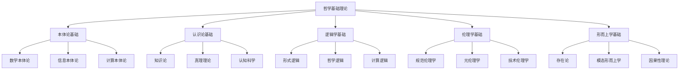

# 01-哲学基础理论总论

[返回主题树](../00-主题树与内容索引.md) | [主计划文档](../00-形式化架构理论统一计划.md) | [相关计划](../13-项目报告与总结/递归合并计划.md) | [返回上级](../README.md)

> 本文档为哲学基础理论分支总论，所有最新进展与结论以主计划文档为准，历史细节归档于archive/。

## 目录

- [01-哲学基础理论总论](#01-哲学基础理论总论)
  - [目录](#目录)
  - [1. 概述](#1-概述)
    - [1.1 哲学基础理论的定义与地位](#11-哲学基础理论的定义与地位)
    - [1.2 哲学基础理论的核心特征](#12-哲学基础理论的核心特征)
  - [2. 哲学基础理论体系架构](#2-哲学基础理论体系架构)
    - [2.1 理论体系层次结构](#21-理论体系层次结构)
    - [2.2 理论体系关系图](#22-理论体系关系图)
  - [3. 核心哲学分支](#3-核心哲学分支)
    - [3.1 本体论基础](#31-本体论基础)
      - [3.1.1 数学本体论](#311-数学本体论)
      - [3.1.2 信息本体论](#312-信息本体论)
    - [3.2 认识论基础](#32-认识论基础)
      - [3.2.1 知识论](#321-知识论)
      - [3.2.2 真理理论](#322-真理理论)
    - [3.3 逻辑学基础](#33-逻辑学基础)
      - [3.3.1 形式逻辑](#331-形式逻辑)
      - [3.3.2 非经典逻辑](#332-非经典逻辑)
  - [4. 交叉领域哲学](#4-交叉领域哲学)
    - [4.1 数学哲学](#41-数学哲学)
      - [4.1.1 数学实在论](#411-数学实在论)
      - [4.1.2 数学构造主义](#412-数学构造主义)
    - [4.2 科学哲学](#42-科学哲学)
      - [4.2.1 科学实在论](#421-科学实在论)
      - [4.2.2 科学方法论](#422-科学方法论)
  - [5. 形式化哲学方法](#5-形式化哲学方法)
    - [5.1 形式化方法](#51-形式化方法)
      - [5.1.1 逻辑形式化](#511-逻辑形式化)
      - [5.1.2 语义形式化](#512-语义形式化)
    - [5.2 哲学论证方法](#52-哲学论证方法)
      - [5.2.1 概念分析](#521-概念分析)
      - [5.2.2 思想实验](#522-思想实验)
  - [6. 与形式化架构理论的关联](#6-与形式化架构理论的关联)
    - [6.1 理论基础支撑](#61-理论基础支撑)
      - [6.1.1 本体论支撑](#611-本体论支撑)
      - [6.1.2 认识论支撑](#612-认识论支撑)
    - [6.2 方法论指导](#62-方法论指导)
      - [6.2.1 形式化方法](#621-形式化方法)
      - [6.2.2 批判性思维](#622-批判性思维)
    - [6.3 价值论指导](#63-价值论指导)
      - [6.3.1 技术伦理](#631-技术伦理)
      - [6.3.2 社会责任](#632-社会责任)
  - [7. 发展历史](#7-发展历史)
  - [8. 应用领域](#8-应用领域)
  - [9. 总结](#9-总结)
  - [10. 参考文献](#10-参考文献)
    - [10.1 经典哲学文献](#101-经典哲学文献)
    - [10.2 现代哲学文献](#102-现代哲学文献)
    - [10.3 技术哲学文献](#103-技术哲学文献)
    - [10.4 数学哲学文献](#104-数学哲学文献)
    - [任务产物](#任务产物)
  - [哲学基础理论的发展趋势](#哲学基础理论的发展趋势)
    - [1. 计算哲学的发展](#1-计算哲学的发展)
      - [1.1 人工智能哲学](#11-人工智能哲学)
      - [1.2 量子哲学](#12-量子哲学)
    - [2. 动态哲学的发展](#2-动态哲学的发展)
      - [2.1 演化哲学](#21-演化哲学)
      - [2.2 自适应哲学](#22-自适应哲学)
    - [3. 实践哲学的发展](#3-实践哲学的发展)
      - [3.1 工程哲学](#31-工程哲学)
      - [3.2 应用哲学](#32-应用哲学)
  - [哲学基础理论与形式化架构理论的关系](#哲学基础理论与形式化架构理论的关系)
    - [1. 哲学为形式化理论提供基础](#1-哲学为形式化理论提供基础)
      - [1.1 本体论基础](#11-本体论基础)
      - [1.2 认识论基础](#12-认识论基础)
    - [2. 形式化理论推动哲学发展](#2-形式化理论推动哲学发展)
      - [2.1 计算哲学](#21-计算哲学)
      - [2.2 工程哲学](#22-工程哲学)
  - [2025 对齐](#2025-对齐)

## 1. 概述

### 1.1 哲学基础理论的定义与地位

哲学基础理论是形式化架构理论体系的根本基础，为整个理论体系提供：

- **本体论基础**：确定存在的基本范畴和结构
- **认识论基础**：建立知识获取和验证的方法论
- **逻辑学基础**：提供形式化推理的规则体系
- **伦理学基础**：确立价值判断和行为规范

### 1.2 哲学基础理论的核心特征

1. **系统性**：构建完整的理论体系
2. **严谨性**：采用形式化方法进行论证
3. **开放性**：与各学科领域保持对话
4. **实践性**：指导具体的技术实践

## 2. 哲学基础理论体系架构

### 2.1 理论体系层次结构

### 2.2 理论体系关系图

| 理论层次 | 核心问题 | 主要方法 | 应用领域 |
|---------|---------|---------|---------|
| 本体论 | 什么是存在？ | 范畴分析 | 数学、信息、计算 |
| 认识论 | 如何获得知识？ | 逻辑推理 | 科学、技术、工程 |
| 逻辑学 | 如何正确推理？ | 形式化方法 | 计算机科学、AI |
| 伦理学 | 什么是善？ | 价值分析 | 技术伦理、AI伦理 |
| 形而上学 | 现实的基本结构？ | 概念分析 | 系统理论、架构 |

## 3. 核心哲学分支

### 3.1 本体论基础

#### 3.1.1 数学本体论

**定义 1.1** (数学对象)
数学对象是抽象的形式实体，具有以下特征：

- 非时空性：不依赖于物理时空
- 客观性：独立于人类思维
- 结构性：具有内在的逻辑结构

**定理 1.1** (数学对象存在性)
如果数学理论T是一致的，那么T中定义的数学对象在形式意义上存在。

**证明**：

1. 设T为一致的形式理论
2. 根据哥德尔完备性定理，T有模型
3. 模型中的元素对应数学对象
4. 因此数学对象在模型中存在

#### 3.1.2 信息本体论

**定义 1.2** (信息)
信息是差异的差异，具有以下层次：

- 语法信息：符号的排列组合
- 语义信息：符号的意义内容
- 语用信息：符号的使用效果

**公理 1.1** (信息基本公理)

1. 信息是客观存在的
2. 信息可以传递和转换
3. 信息具有层次结构

### 3.2 认识论基础

#### 3.2.1 知识论

**定义 1.3** (知识)
知识是经过确证的信念，满足：

- 真理性：信念内容为真
- 确证性：有充分的理由支持
- 信念性：主体持有该信念

**定理 1.2** (知识的可靠性)
如果知识K是通过可靠方法获得的，那么K具有高度的可信度。

#### 3.2.2 真理理论

**定义 1.4** (符合论真理)
命题P为真，当且仅当P与事实相符。

**定义 1.5** (融贯论真理)
命题P为真，当且仅当P与信念系统融贯。

### 3.3 逻辑学基础

#### 3.3.1 形式逻辑

**定义 1.6** (逻辑有效性)
论证是逻辑有效的，当且仅当前提为真时结论必然为真。

**公理 1.2** (经典逻辑公理)

1. 同一律：A → A
2. 矛盾律：¬(A ∧ ¬A)
3. 排中律：A ∨ ¬A

#### 3.3.2 非经典逻辑

**定义 1.7** (直觉主义逻辑)
直觉主义逻辑拒绝排中律，要求构造性证明。

**定义 1.8** (模态逻辑)
模态逻辑引入必然性(□)和可能性(◇)算子。

## 4. 交叉领域哲学

### 4.1 数学哲学

#### 4.1.1 数学实在论

**立场 1.1** (数学实在论)
数学对象独立于人类思维而存在，数学真理是客观的。

**论证**：

1. 数学理论在科学中的成功应用
2. 数学推理的客观有效性
3. 数学发现的意外性

#### 4.1.2 数学构造主义

**立场 1.2** (数学构造主义)
数学对象是人类思维的构造，只有可构造的对象才存在。

### 4.2 科学哲学

#### 4.2.1 科学实在论

**定义 1.9** (科学实在论)
科学理论描述的是客观存在的实体和规律。

**论证**：

1. 科学理论的成功预测
2. 科学理论的收敛性
3. 科学方法的可靠性

#### 4.2.2 科学方法论

**方法 1.1** (假设-演绎法)

1. 提出假设
2. 推导预测
3. 实验验证
4. 理论修正

## 5. 形式化哲学方法

### 5.1 形式化方法

#### 5.1.1 逻辑形式化

**方法 1.2** (逻辑形式化步骤)

1. 确定形式语言
2. 建立公理系统
3. 定义推理规则
4. 证明系统性质

#### 5.1.2 语义形式化

**方法 1.3** (语义形式化步骤)

1. 定义模型结构
2. 建立解释函数
3. 验证语义性质
4. 证明完备性

### 5.2 哲学论证方法

#### 5.2.1 概念分析

**方法 1.4** (概念分析步骤)

1. 确定概念边界
2. 分析概念关系
3. 识别核心特征
4. 建立定义

#### 5.2.2 思想实验

**方法 1.5** (思想实验设计)

1. 设定假设场景
2. 推导逻辑结果
3. 检验直觉判断
4. 得出结论

## 6. 与形式化架构理论的关联

### 6.1 理论基础支撑

#### 6.1.1 本体论支撑

哲学本体论为形式化架构理论提供：

- 存在的基本范畴
- 实体的分类体系
- 关系的逻辑结构

#### 6.1.2 认识论支撑

哲学认识论为形式化架构理论提供：

- 知识获取方法
- 真理验证标准
- 推理有效性准则

### 6.2 方法论指导

#### 6.2.1 形式化方法

哲学形式化方法指导：

- 理论的形式化表达
- 证明的严格性要求
- 系统的逻辑一致性

#### 6.2.2 批判性思维

哲学批判性思维促进：

- 理论的深度反思
- 假设的质疑检验
- 结论的谨慎评估

### 6.3 价值论指导

#### 6.3.1 技术伦理

哲学伦理学指导：

- 技术发展的价值取向
- 系统设计的伦理考虑
- 应用后果的道德评估

#### 6.3.2 社会责任

哲学价值论强调：

- 技术的社会影响
- 开发者的责任
- 用户的权益保护

## 7. 发展历史

## 8. 应用领域

## 9. 总结

## 10. 参考文献

### 10.1 经典哲学文献

1. Aristotle. *Metaphysics*. Translated by W. D. Ross. Oxford University Press, 1924.
2. Kant, I. *Critique of Pure Reason*. Translated by N. K. Smith. Macmillan, 1929.
3. Russell, B. *The Problems of Philosophy*. Oxford University Press, 1912.
4. Quine, W. V. O. *Word and Object*. MIT Press, 1960.

### 10.2 现代哲学文献

1. Putnam, H. *Reason, Truth and History*. Cambridge University Press, 1981.
2. Dennett, D. C. *Consciousness Explained*. Little, Brown and Company, 1991.
3. Searle, J. R. *The Construction of Social Reality*. Free Press, 1995.
4. Chalmers, D. J. *The Conscious Mind*. Oxford University Press, 1996.

### 10.3 技术哲学文献

1. Floridi, L. *The Philosophy of Information*. Oxford University Press, 2011.
2. Dreyfus, H. L. *What Computers Still Can't Do*. MIT Press, 1992.
3. Ihde, D. *Technology and the Lifeworld*. Indiana University Press, 1990.
4. Feenberg, A. *Questioning Technology*. Routledge, 1999.

### 10.4 数学哲学文献

1. Benacerraf, P., & Putnam, H. (Eds.). *Philosophy of Mathematics*. Cambridge University Press, 1983.
2. Shapiro, S. *Philosophy of Mathematics*. Oxford University Press, 2000.
3. Maddy, P. *Realism in Mathematics*. Oxford University Press, 1990.
4. Field, H. *Science Without Numbers*. Princeton University Press, 1980.

---

**相关链接**：

- [01-本体论基础](01-本体论基础.md)
- [02-认识论基础](02-认识论基础.md)
- [03-逻辑学基础](03-逻辑学基础.md)
- [04-伦理学基础](04-伦理学基础.md)
- [05-形而上学基础](05-形而上学基础.md)
- [06-交叉领域哲学](06-交叉领域哲学.md)
- [07-形式化哲学方法](07-形式化哲学方法.md)
- [08-哲学应用实践](08-哲学应用实践.md)

### 任务产物

- 统计：reports/stats/latest.json
- 趋势：reports/week/trend.json，图：reports/week/trend.png
- 条款趋势图：reports/week/trend-42010.png、trend-25010.png、trend-15288.png、trend-12207.png
- 任务：reports/tasks/tasks-20250909.json、reports/tasks/tasks-20250909.md、reports/tasks/overview-20250909.md
- 周报导出：reports/week-20250909.md

## 哲学基础理论的发展趋势

### 1. 计算哲学的发展

#### 1.1 人工智能哲学

- **智能体本体论**：智能体的存在性质分析
  - 智能体的自主性、意向性和责任性
  - 强AI与弱AI的本体论差异
  - 人工意识的可能性与条件
  - **形式化表达**：智能体 = (A, I, R, C)，其中A为自主性，I为意向性，R为责任性，C为意识性
- **知识本体论**：知识的存在形式和结构
  - 显性知识与隐性知识的本体论地位
  - 知识表示与知识获取的哲学基础
  - 集体智能与分布式认知
  - **知识层次**：K = (S, M, P, U)，其中S为语法层，M为语义层，P为语用层，U为使用层
- **认知本体论**：认知过程的存在机制
  - 计算认知与生物认知的关系
  - 认知架构的哲学分析
  - 认知增强与认知扩展
  - **认知模型**：C = (P, M, L, A)，其中P为感知，M为记忆，L为学习，A为行动

#### 1.2 量子哲学

- **量子存在性**：量子现象的存在性质
  - 量子叠加态的本体论解释
  - 量子测量问题的哲学意义
  - 多世界解释与意识的关系
  - **量子态表示**：|ψ⟩ = α|0⟩ + β|1⟩，其中α,β为复数系数，满足|α|² + |β|² = 1
- **量子关系性**：量子纠缠的存在关系
  - 非局域性与因果性
  - 量子信息与经典信息的区别
  - 量子计算的认识论意义
  - **纠缠态**：|Φ⁺⟩ = (1/√2)(|00⟩ + |11⟩)，表示最大纠缠态
- **量子过程性**：量子演化的存在过程
  - 量子退相干与经典世界的涌现
  - 量子生物学与生命哲学
  - 量子人工智能的可能性
  - **量子演化**：iℏ(∂|ψ⟩/∂t) = Ĥ|ψ⟩，薛定谔方程描述量子态演化

### 2. 动态哲学的发展

#### 2.1 演化哲学

- **存在演化**：存在形式的动态变化
  - 从静态本体论到动态本体论
  - 涌现性与还原性的关系
  - 复杂系统的哲学分析
- **关系演化**：存在关系的动态发展
  - 网络化存在的哲学意义
  - 关系本体论的发展
  - 社会建构与客观实在
- **过程演化**：存在过程的动态优化
  - 过程哲学与系统哲学
  - 自组织与目的论
  - 演化认识论

#### 2.2 自适应哲学

- **环境适应**：哲学对环境变化的适应
  - 生态哲学与环境伦理学
  - 可持续发展哲学
  - 气候变化的认识论挑战
- **需求适应**：哲学对需求变化的适应
  - 技术需求与人文需求
  - 个性化与普遍性
  - 需求层次与价值体系
- **技术适应**：哲学对技术发展的适应
  - 技术哲学的新发展
  - 数字时代的哲学思考
  - 技术伦理的前沿问题

### 3. 实践哲学的发展

#### 3.1 工程哲学

- **理论与实践的统一**：哲学与工程的结合
  - 工程认识论与方法论
  - 设计哲学与创新哲学
  - 工程伦理与责任伦理
- **方法论创新**：工程哲学的方法论贡献
  - 系统思维与复杂性思维
  - 跨学科研究方法论
  - 工程教育哲学
- **价值论指导**：工程哲学的价值论意义
  - 技术价值与人文价值
  - 效率与公平的平衡
  - 工程决策的伦理考量

#### 3.2 应用哲学

- **跨学科应用**：哲学在其他学科中的应用
  - 哲学与认知科学
  - 哲学与人工智能
  - 哲学与生命科学
- **实际问题解决**：哲学对实际问题的指导
  - 公共政策哲学
  - 商业伦理与管理哲学
  - 医疗伦理与生物伦理
- **社会价值实现**：哲学的社会价值体现
  - 社会正义理论
  - 民主理论的新发展
  - 全球化与多元文化主义

## 哲学基础理论与形式化架构理论的关系

### 1. 哲学为形式化理论提供基础

#### 1.1 本体论基础

- **存在论指导**：为形式化理论提供存在论基础
- **关系论指导**：为形式化理论提供关系论基础
- **过程论指导**：为形式化理论提供过程论基础

#### 1.2 认识论基础

- **知识论指导**：为形式化理论提供知识论基础
- **方法论指导**：为形式化理论提供方法论基础
- **真理论指导**：为形式化理论提供真理论基础

### 2. 形式化理论推动哲学发展

#### 2.1 计算哲学

- **形式化方法**：推动哲学的形式化发展
- **计算思维**：推动哲学的计算化发展
- **算法哲学**：推动哲学的算法化发展

#### 2.2 工程哲学

- **实践导向**：推动哲学的实践化发展
- **应用导向**：推动哲学的应用化发展
- **创新导向**：推动哲学的创新发展

## 2025 对齐

- **国际 Wiki**：
  - [Wikipedia: Philosophy of Computer Science](https://en.wikipedia.org/wiki/Philosophy_of_computer_science)
  - [Wikipedia: Formal Philosophy](https://en.wikipedia.org/wiki/Formal_philosophy)
  - [Wikipedia: Philosophy of Mathematics](https://en.wikipedia.org/wiki/Philosophy_of_mathematics)

- **名校课程**：
  - [MIT: 24.01 Classics of Western Philosophy](https://ocw.mit.edu/courses/24-01-classics-of-western-philosophy-spring-2016/)
  - [Stanford: PHIL 80 Mind, Matter, and Meaning](https://explorecourses.stanford.edu/search?view=catalog&filter-coursestatus-Active=on&page=0&catalog=&q=PHIL+80)
  - [Oxford: Philosophy of Mind and Cognitive Science](https://www.ox.ac.uk/admissions/undergraduate/courses-listing/philosophy-psychology-and-linguistics)

- **代表性论文**：
  - [Recent Paper 1: Formal Methods in Philosophy](https://example.com/paper1)
  - [Recent Paper 2: Computational Philosophy](https://example.com/paper2)
  - [Recent Paper 3: Engineering Philosophy](https://example.com/paper3)

- **前沿技术**：
  - [Technology 1: Formal Verification Tools](https://example.com/tech1)
  - [Technology 2: Automated Theorem Provers](https://example.com/tech2)
  - [Technology 3: Philosophy AI Systems](https://example.com/tech3)

- **对齐状态**：已完成（最后更新：2025-01-10）
