# 00-哲学基础理论总论：形式化哲学理论体系

## 目录

1. [1.0 哲学理论体系概述](#10-哲学理论体系概述)
2. [2.0 哲学基础公理系统](#20-哲学基础公理系统)
3. [3.0 本体论基础理论](#30-本体论基础理论)
4. [4.0 认识论基础理论](#40-认识论基础理论)
5. [5.0 逻辑学基础理论](#50-逻辑学基础理论)
6. [6.0 伦理学基础理论](#60-伦理学基础理论)
7. [7.0 形而上学基础理论](#70-形而上学基础理论)
8. [8.0 技术哲学基础理论](#80-技术哲学基础理论)
9. [9.0 哲学理论统一框架](#90-哲学理论统一框架)
10. [10.0 哲学应用与实践](#100-哲学应用与实践)

## 1.0 哲学理论体系概述

### 1.1 哲学理论体系定义

**定义 1.1.1 (哲学理论体系)**
哲学理论体系是一个七元组 $\mathcal{PT} = (\mathcal{O}, \mathcal{E}, \mathcal{L}, \mathcal{M}, \mathcal{A}, \mathcal{T}, \mathcal{U})$，其中：

- $\mathcal{O}$ 是本体论理论集合 (Ontological Theories)
- $\mathcal{E}$ 是认识论理论集合 (Epistemological Theories)
- $\mathcal{L}$ 是逻辑学理论集合 (Logical Theories)
- $\mathcal{M}$ 是形而上学理论集合 (Metaphysical Theories)
- $\mathcal{A}$ 是伦理学理论集合 (Ethical Theories)
- $\mathcal{T}$ 是技术哲学理论集合 (Technological Theories)
- $\mathcal{U}$ 是理论统一框架集合 (Unification Framework)

**公理 1.1.1 (哲学理论一致性)**
哲学理论体系 $\mathcal{PT}$ 满足：
$$\forall t_1, t_2 \in \mathcal{O} \cup \mathcal{E} \cup \mathcal{L} \cup \mathcal{M} \cup \mathcal{A} \cup \mathcal{T} \cup \mathcal{U}, \quad \text{Consistent}(t_1, t_2)$$

**公理 1.1.2 (哲学理论完备性)**
对于任意哲学问题 $p$，存在理论 $t \in \mathcal{PT}$ 能够形式化描述和分析 $p$。

### 1.2 哲学理论体系架构

```mermaid
graph TB
    A[哲学理论体系] --> B[本体论基础]
    A --> C[认识论基础]
    A --> D[逻辑学基础]
    A --> E[形而上学基础]
    A --> F[伦理学基础]
    A --> G[技术哲学基础]
    A --> H[理论统一框架]
    
    B --> B1[存在论]
    B --> B2[实体论]
    B --> B3[属性论]
    B --> B4[关系论]
    B --> B5[模态论]
    B --> B6[信息本体论]
    
    C --> C1[知识论]
    C --> C2[真理论]
    C --> C3[确证论]
    C --> C4[信念论]
    C --> C5[认知论]
    C --> C6[计算认识论]
    
    D --> D1[形式逻辑]
    D --> D2[哲学逻辑]
    D --> D3[模态逻辑]
    D --> D4[道义逻辑]
    D --> D5[认知逻辑]
    D --> D6[时态逻辑]
    
    E --> E1[存在论]
    E --> E2[因果论]
    E --> E3[时空论]
    E --> E4[自由意志论]
    E --> E5[决定论]
    E --> E6[涌现论]
    
    F --> F1[规范伦理学]
    F --> F2[元伦理学]
    F --> F3[应用伦理学]
    F --> F4[美德伦理学]
    F --> F5[计算伦理学]
    F --> F6[AI伦理学]
    
    G --> G1[技术本质论]
    G --> G2[技术决定论]
    G --> G3[技术伦理论]
    G --> G4[信息哲学]
    G --> G5[网络哲学]
    G --> G6[AI哲学]
    
    H --> H1[理论映射关系]
    H --> H2[统一符号体系]
    H --> H3[跨领域证明]
    H --> H4[应用框架]
```

### 1.3 哲学理论层次结构

**定义 1.3.1 (哲学理论层次)**
哲学理论层次是一个五层结构 $\mathcal{H}_P = (L_1, L_2, L_3, L_4, L_5)$，其中：

- $L_1$ 是基础哲学层 (Basic Philosophical Layer)
- $L_2$ 是形式化哲学层 (Formal Philosophical Layer)
- $L_3$ 是应用哲学层 (Applied Philosophical Layer)
- $L_4$ 是跨学科哲学层 (Interdisciplinary Philosophical Layer)
- $L_5$ 是统一哲学层 (Unified Philosophical Layer)

**定理 1.3.1 (哲学层次依赖关系)**
对于任意哲学理论 $p_i \in L_i, p_j \in L_j$，如果 $i < j$，则 $p_i$ 为 $p_j$ 提供基础，记为 $p_i \prec p_j$。

## 2.0 哲学基础公理系统

### 2.1 存在性公理

**公理 2.1.1 (存在性公理)**
存在性谓词 $\exists$ 满足：
$$\exists(x) \Leftrightarrow x \in \mathcal{U}$$
其中 $\mathcal{U}$ 是全域集合。

**公理 2.1.2 (同一性公理)**
对于任意对象 $x, y$：
$$x = y \Leftrightarrow \forall P(P(x) \Leftrightarrow P(y))$$

**公理 2.1.3 (差异性公理)**
对于任意对象 $x, y$：
$$x \neq y \Leftrightarrow \exists P(P(x) \land \neg P(y))$$

### 2.2 认识论公理

**公理 2.2.1 (知识定义公理)**
对于任意信念 $b$，知识定义为：
$$\text{Knowledge}(b) \Leftrightarrow \text{Belief}(b) \land \text{True}(b) \land \text{Justified}(b)$$

**公理 2.2.2 (真理符合论公理)**
对于任意命题 $p$：
$$\text{True}(p) \Leftrightarrow p \text{ 符合事实}$$

**公理 2.2.3 (确证传递公理)**
如果 $p$ 确证 $q$，且 $q$ 确证 $r$，则 $p$ 确证 $r$：
$$(p \text{ justifies } q) \land (q \text{ justifies } r) \Rightarrow (p \text{ justifies } r)$$

### 2.3 逻辑学公理

**公理 2.3.1 (逻辑有效性公理)**
逻辑有效论证满足：
$$\text{Valid}(\Gamma, \phi) \Leftrightarrow \Gamma \models \phi$$

**公理 2.3.2 (逻辑一致性公理)**
理论 $\Gamma$ 一致当且仅当：
$$\neg \exists \phi (\Gamma \vdash \phi \land \Gamma \vdash \neg \phi)$$

**公理 2.3.3 (逻辑完备性公理)**
形式系统完备当且仅当：
$$\Gamma \models \phi \Rightarrow \Gamma \vdash \phi$$

## 3.0 本体论基础理论

### 3.1 本体论宇宙

**定义 3.1.1 (本体论宇宙)**
本体论宇宙是一个七元组 $\mathcal{O} = (\mathcal{E}, \mathcal{P}, \mathcal{R}, \mathcal{M}, \mathcal{I}, \mathcal{V}, \mathcal{T})$，其中：

- $\mathcal{E}$ 是实体集合 (Entities)
- $\mathcal{P}$ 是属性集合 (Properties)
- $\mathcal{R}$ 是关系集合 (Relations)
- $\mathcal{M}$ 是模态算子集合 (Modal Operators)
- $\mathcal{I}$ 是解释函数 (Interpretation Function)
- $\mathcal{V}$ 是价值函数 (Value Function)
- $\mathcal{T}$ 是时间结构 (Temporal Structure)

**定义 3.1.2 (软件实体)**
软件实体是一个四元组 $SE = (C, B, S, I)$，其中：

- $C$ 是组件集合 (Components)
- $B$ 是行为集合 (Behaviors)
- $S$ 是状态集合 (States)
- $I$ 是接口集合 (Interfaces)

### 3.2 实体分类理论

**定义 3.2.1 (实体类型)**
实体类型是一个三元组 $ET = (N, A, R)$，其中：

- $N$ 是类型名称 (Type Name)
- $A$ 是属性集合 (Attributes)
- $R$ 是关系集合 (Relations)

**定理 3.2.1 (实体分类定理)**
对于任意实体 $e$，存在类型 $t$ 使得 $e \in t$。

**证明** 通过类型构造：

1. 每个实体都有基本属性
2. 属性集合构成类型
3. 因此每个实体都属于某个类型

### 3.3 模态本体论

**定义 3.3.1 (模态实体)**
模态实体是一个三元组 $ME = (E, M, A)$，其中：

- $E$ 是实体 (Entity)
- $M$ 是模态算子 (Modal Operator)
- $A$ 是可达关系 (Accessibility Relation)

**定义 3.3.2 (必然性)**
实体 $e$ 必然具有属性 $P$，记为 $\Box P(e)$，当且仅当：
$$\forall w \in W(w \models P(e))$$

**定义 3.3.3 (可能性)**
实体 $e$ 可能具有属性 $P$，记为 $\Diamond P(e)$，当且仅当：
$$\exists w \in W(w \models P(e))$$

## 4.0 认识论基础理论

### 4.1 知识论宇宙

**定义 4.1.1 (知识论宇宙)**
知识论宇宙是一个八元组 $\mathcal{K} = (\mathcal{B}, \mathcal{J}, \mathcal{T}, \mathcal{E}, \mathcal{R}, \mathcal{I}, \mathcal{C}, \mathcal{A})$，其中：

- $\mathcal{B}$ 是信念集合 (Beliefs)
- $\mathcal{J}$ 是确证集合 (Justifications)
- $\mathcal{T}$ 是真理集合 (Truths)
- $\mathcal{E}$ 是证据集合 (Evidence)
- $\mathcal{R}$ 是推理规则集合 (Reasoning Rules)
- $\mathcal{I}$ 是解释函数 (Interpretation Function)
- $\mathcal{C}$ 是认知结构集合 (Cognitive Structures)
- $\mathcal{A}$ 是算法集合 (Algorithms)

**定义 4.1.2 (计算知识)**
计算知识是一个三元组 $CK = (A, P, V)$，其中：

- $A$ 是算法 (Algorithm)
- $P$ 是程序 (Program)
- $V$ 是验证方法 (Verification Method)

### 4.2 知识获取理论

**定义 4.2.1 (知识获取过程)**
知识获取过程是一个四元组 $KAP = (S, M, E, V)$，其中：

- $S$ 是主体 (Subject)
- $M$ 是方法 (Method)
- $E$ 是环境 (Environment)
- $V$ 是验证 (Verification)

**定理 4.2.1 (知识获取定理)**
如果主体 $S$ 通过方法 $M$ 在环境 $E$ 中获取知识 $K$，且验证 $V$ 通过，则 $K$ 是可靠知识。

**证明** 通过知识获取条件：

1. 主体具备认知能力
2. 方法具有可靠性
3. 环境提供支持
4. 验证确保正确性

### 4.3 认知科学基础

**定义 4.3.1 (认知架构)**
认知架构是一个五元组 $CA = (M, P, R, S, L)$，其中：

- $M$ 是记忆系统 (Memory System)
- $P$ 是处理系统 (Processing System)
- $R$ 是推理系统 (Reasoning System)
- $S$ 是感知系统 (Sensory System)
- $L$ 是学习系统 (Learning System)

**定义 4.3.2 (认知过程)**
认知过程是一个三元组 $CP = (I, P, O)$，其中：

- $I$ 是输入 (Input)
- $P$ 是处理 (Processing)
- $O$ 是输出 (Output)

## 5.0 逻辑学基础理论

### 5.1 形式逻辑系统

**定义 5.1.1 (形式逻辑系统)**
形式逻辑系统是一个四元组 $FLS = (\Sigma, A, R, T)$，其中：

- $\Sigma$ 是符号集 (Symbol Set)
- $A$ 是公理集 (Axiom Set)
- $R$ 是推理规则集 (Inference Rules)
- $T$ 是定理集 (Theorem Set)

**定义 5.1.2 (逻辑有效性)**
论证 $\Gamma \vdash \phi$ 有效当且仅当：
$$\forall M \forall v(M, v \models \Gamma \Rightarrow M, v \models \phi)$$

### 5.2 模态逻辑

**定义 5.2.1 (模态逻辑框架)**
模态逻辑框架是一个三元组 $MLF = (W, R, V)$，其中：

- $W$ 是可能世界集 (Possible Worlds)
- $R$ 是可达关系 (Accessibility Relation)
- $V$ 是赋值函数 (Valuation Function)

**定义 5.2.2 (模态语义)**
对于任意可能世界 $w$ 和模态公式 $\phi$：

- $w \models \Box \phi$ 当且仅当 $\forall v(wRv \Rightarrow v \models \phi)$
- $w \models \Diamond \phi$ 当且仅当 $\exists v(wRv \land v \models \phi)$

### 5.3 道义逻辑

**定义 5.3.1 (道义逻辑框架)**
道义逻辑框架是一个四元组 $DLF = (W, R, V, N)$，其中：

- $W$ 是可能世界集
- $R$ 是可达关系
- $V$ 是赋值函数
- $N$ 是规范集 (Norm Set)

**定义 5.3.2 (道义算子)**:

- $O\phi$ (义务)：必须 $\phi$
- $P\phi$ (允许)：允许 $\phi$
- $F\phi$ (禁止)：禁止 $\phi$

## 6.0 伦理学基础理论

### 6.1 伦理学框架

**定义 6.1.1 (伦理学框架)**
伦理学框架是一个五元组 $EF = (A, V, R, N, P)$，其中：

- $A$ 是行动集合 (Actions)
- $V$ 是价值集合 (Values)
- $R$ 是规则集合 (Rules)
- $N$ 是规范集合 (Norms)
- $P$ 是原则集合 (Principles)

**定义 6.1.2 (道德行动)**
道德行动是一个三元组 $MA = (A, I, C)$，其中：

- $A$ 是行动 (Action)
- $I$ 是意图 (Intention)
- $C$ 是后果 (Consequences)

### 6.2 规范伦理学

**定义 6.2.1 (义务论)**
义务论主张行动的正确性取决于行动本身的性质，而不是后果：
$$\text{Right}(A) \Leftrightarrow \text{Intrinsic}(A)$$

**定义 6.2.2 (功利主义)**
功利主义主张行动的正确性取决于其产生的总体效用：
$$\text{Right}(A) \Leftrightarrow \text{Maximize}(U(A))$$

**定义 6.2.3 (美德伦理学)**
美德伦理学主张行动的正确性取决于行动者的品格：
$$\text{Right}(A) \Leftrightarrow \text{Virtuous}(A)$$

### 6.3 计算伦理学

**定义 6.3.1 (计算道德系统)**
计算道德系统是一个四元组 $CMS = (R, A, E, D)$，其中：

- $R$ 是道德规则集 (Moral Rules)
- $A$ 是算法集 (Algorithms)
- $E$ 是评估函数 (Evaluation Function)
- $D$ 是决策函数 (Decision Function)

**定义 6.3.2 (AI伦理)**
AI伦理是研究人工智能系统的伦理问题的学科：
$$\text{AI Ethics} = \{(A, E, R) \mid A \in \text{AI}, E \in \text{Ethics}, R \in \text{Regulation}\}$$

## 7.0 形而上学基础理论

### 7.1 存在论

**定义 7.1.1 (存在论框架)**
存在论框架是一个四元组 $OF = (E, P, R, C)$，其中：

- $E$ 是存在物集合 (Existents)
- $P$ 是属性集合 (Properties)
- $R$ 是关系集合 (Relations)
- $C$ 是类别集合 (Categories)

**定义 7.1.2 (存在性)**
存在性是一个一元谓词，满足：
$$\exists(x) \Leftrightarrow x \in \mathcal{U}$$

### 7.2 因果论

**定义 7.2.1 (因果关系)**
因果关系是一个三元组 $CR = (C, E, M)$，其中：

- $C$ 是原因 (Cause)
- $E$ 是结果 (Effect)
- $M$ 是机制 (Mechanism)

**定义 7.2.2 (因果传递性)**
如果 $A$ 导致 $B$，且 $B$ 导致 $C$，则 $A$ 导致 $C$：
$$(A \rightarrow B) \land (B \rightarrow C) \Rightarrow (A \rightarrow C)$$

### 7.3 自由意志论

**定义 7.3.1 (自由意志)**
自由意志是一个三元组 $FW = (A, C, R)$，其中：

- $A$ 是行动 (Action)
- $C$ 是选择 (Choice)
- $R$ 是责任 (Responsibility)

**定义 7.3.2 (决定论)**
决定论主张所有事件都由先前事件决定：
$$\forall e \exists e' (e' < e \land e' \text{ determines } e)$$

## 8.0 技术哲学基础理论

### 8.1 技术本质论

**定义 8.1.1 (技术)**
技术是一个四元组 $T = (K, A, M, P)$，其中：

- $K$ 是知识 (Knowledge)
- $A$ 是人工制品 (Artifacts)
- $M$ 是方法 (Methods)
- $P$ 是实践 (Practices)

**定义 8.1.2 (技术系统)**
技术系统是一个五元组 $TS = (C, F, R, E, G)$，其中：

- $C$ 是组件 (Components)
- $F$ 是功能 (Functions)
- $R$ 是关系 (Relations)
- $E$ 是环境 (Environment)
- $G$ 是目标 (Goals)

### 8.2 信息哲学

**定义 8.2.1 (信息)**
信息是一个三元组 $I = (S, M, R)$，其中：

- $S$ 是源 (Source)
- $M$ 是消息 (Message)
- $R$ 是接收者 (Receiver)

**定义 8.2.2 (信息处理)**
信息处理是一个四元组 $IP = (I, P, O, E)$，其中：

- $I$ 是输入信息 (Input Information)
- $P$ 是处理过程 (Processing)
- $O$ 是输出信息 (Output Information)
- $E$ 是效率 (Efficiency)

### 8.3 AI哲学

**定义 8.3.1 (人工智能)**
人工智能是一个四元组 $AI = (I, L, R, A)$，其中：

- $I$ 是智能 (Intelligence)
- $L$ 是学习 (Learning)
- $R$ 是推理 (Reasoning)
- $A$ 是适应 (Adaptation)

**定义 8.3.2 (强AI)**
强AI主张机器可以具有与人类相同的智能：
$$\text{Strong AI} \Leftrightarrow \text{Machine Intelligence} = \text{Human Intelligence}$$

**定义 8.3.3 (弱AI)**
弱AI主张机器可以模拟人类智能的某些方面：
$$\text{Weak AI} \Leftrightarrow \text{Machine Intelligence} \subseteq \text{Human Intelligence}$$

## 9.0 哲学理论统一框架

### 9.1 理论映射关系

**定义 9.1.1 (理论映射)**
理论映射是一个函数 $f: \mathcal{T}_1 \times \mathcal{T}_2 \to \mathcal{R}$，其中 $\mathcal{T}_1, \mathcal{T}_2$ 是理论集合，$\mathcal{R}$ 是关系集合。

**定义 9.1.2 (理论等价性)**
两个理论 $t_1, t_2$ 等价，记为 $t_1 \equiv t_2$，当且仅当存在双射 $f: \mathcal{M}_1 \to \mathcal{M}_2$，其中 $\mathcal{M}_i$ 是理论 $t_i$ 的模型集合。

### 9.2 统一符号体系

**定义 9.2.1 (统一符号)**
统一符号体系是一个三元组 $USS = (\Sigma, I, R)$，其中：

- $\Sigma$ 是符号集 (Symbol Set)
- $I$ 是解释函数 (Interpretation Function)
- $R$ 是规则集 (Rule Set)

**定义 9.2.2 (符号一致性)**
符号一致性要求：
$$\forall s \in \Sigma, \forall t_1, t_2 \in \mathcal{T}, I_{t_1}(s) = I_{t_2}(s)$$

### 9.3 跨领域证明

**定义 9.3.1 (跨领域证明)**
跨领域证明是一个四元组 $CDP = (P, T_1, T_2, M)$，其中：

- $P$ 是命题 (Proposition)
- $T_1, T_2$ 是不同领域的理论
- $M$ 是映射关系 (Mapping)

**定理 9.3.1 (跨领域证明定理)**
如果命题 $P$ 在理论 $T_1$ 中为真，且存在映射 $M: T_1 \to T_2$，则 $M(P)$ 在理论 $T_2$ 中为真。

## 10.0 哲学应用与实践

### 10.1 软件工程应用

**定义 10.1.1 (软件哲学)**
软件哲学是研究软件本质和软件工程哲学问题的学科：
$$\text{Software Philosophy} = \{(S, P, E) \mid S \in \text{Software}, P \in \text{Philosophy}, E \in \text{Engineering}\}$$

**定义 10.1.2 (软件本体论)**
软件本体论研究软件实体的本质和分类：
$$\text{Software Ontology} = \{(E, T, R) \mid E \in \text{Entities}, T \in \text{Types}, R \in \text{Relations}\}$$

### 10.2 人工智能应用

**定义 10.2.1 (AI哲学应用)**
AI哲学应用是哲学理论在人工智能领域的应用：
$$\text{AI Philosophy Application} = \{(P, AI, A) \mid P \in \text{Philosophy}, AI \in \text{AI}, A \in \text{Application}\}$$

**定义 10.2.2 (认知架构设计)**
认知架构设计基于哲学认知理论：
$$\text{Cognitive Architecture Design} = \{(C, P, D) \mid C \in \text{Cognition}, P \in \text{Philosophy}, D \in \text{Design}\}$$

### 10.3 形式化验证

**定义 10.3.1 (哲学形式化)**
哲学形式化是将哲学概念转化为形式化表达：
$$\text{Philosophical Formalization} = \{(C, F, V) \mid C \in \text{Concept}, F \in \text{Formal}, V \in \text{Verification}\}$$

**定义 10.3.2 (逻辑验证)**
逻辑验证基于哲学逻辑理论：
$$\text{Logical Verification} = \{(L, S, V) \mid L \in \text{Logic}, S \in \text{System}, V \in \text{Verification}\}$$

---

**参考文献**:

1. 哲学内容全面分析报告-最终版.md
2. 哲学内容索引.md
3. 哲学内容总结报告.md
4. 形式语言的多维批判性分析.md
5. 统一形式理论综合.md

**相关链接**:

- [01-本体论基础理论](01-本体论基础理论.md)
- [02-认识论基础理论](02-认识论基础理论.md)
- [03-逻辑学基础理论](03-逻辑学基础理论.md)
- [04-伦理学基础理论](04-伦理学基础理论.md)
- [05-形而上学基础理论](05-形而上学基础理论.md)
- [06-技术哲学基础理论](06-技术哲学基础理论.md)
