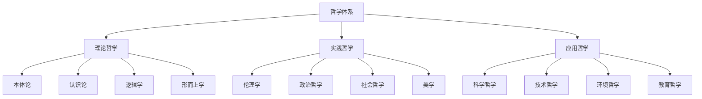
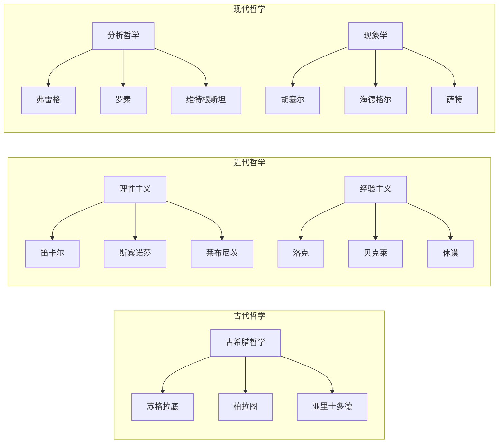

# 01-哲学基础理论 v41：形式化哲学体系

## 目录

1. [1.0 哲学基础概述](#10-哲学基础概述)
2. [2.0 本体论基础](#20-本体论基础)
3. [3.0 认识论基础](#30-认识论基础)
4. [4.0 逻辑学基础](#40-逻辑学基础)
5. [5.0 伦理学基础](#50-伦理学基础)
6. [6.0 形而上学基础](#60-形而上学基础)
7. [7.0 技术哲学](#70-技术哲学)
8. [8.0 哲学方法论](#80-哲学方法论)
9. [9.0 哲学应用](#90-哲学应用)
10. [10.0 哲学发展史](#100-哲学发展史)

## 1.0 哲学基础概述

### 1.1 哲学定义与特征

**定义 1.1.1 (哲学)**
哲学是一个形式化系统 $\mathcal{P} = (\mathcal{O}, \mathcal{E}, \mathcal{L}, \mathcal{M}, \mathcal{V})$，其中：

- $\mathcal{O}$ 是本体论基础集合 (Ontological Foundations)
- $\mathcal{E}$ 是认识论基础集合 (Epistemological Foundations)
- $\mathcal{L}$ 是逻辑学基础集合 (Logical Foundations)
- $\mathcal{M}$ 是形而上学基础集合 (Metaphysical Foundations)
- $\mathcal{V}$ 是价值论基础集合 (Value Foundations)

**公理 1.1.1 (哲学系统性)**
哲学系统 $\mathcal{P}$ 满足：
$$\forall p_1, p_2 \in \mathcal{O} \cup \mathcal{E} \cup \mathcal{L} \cup \mathcal{M} \cup \mathcal{V}, \quad \text{Consistent}(p_1, p_2)$$

**公理 1.1.2 (哲学完备性)**
对于任意哲学问题 $q$，存在理论 $t \in \mathcal{P}$ 能够形式化描述和解决 $q$。

### 1.2 哲学体系架构

### 1.3 哲学流派关系

## 2.0 本体论基础

### 2.1 本体论宇宙

**定义 2.1.1 (本体论宇宙)**
本体论宇宙是一个七元组 $\mathcal{O} = (\mathcal{E}, \mathcal{P}, \mathcal{R}, \mathcal{M}, \mathcal{I}, \mathcal{V}, \mathcal{T})$，其中：

- $\mathcal{E}$ 是实体集合 (Entities)
- $\mathcal{P}$ 是属性集合 (Properties)
- $\mathcal{R}$ 是关系集合 (Relations)
- $\mathcal{M}$ 是模态算子集合 (Modal Operators)
- $\mathcal{I}$ 是解释函数 (Interpretation Function)
- $\mathcal{V}$ 是价值函数 (Value Function)
- $\mathcal{T}$ 是时间结构 (Temporal Structure)

**公理 2.1.1 (存在性公理)**
对于任意实体 $e \in \mathcal{E}$，存在性谓词 $\exists$ 满足：
$$\exists(e) \Leftrightarrow e \in \mathcal{E}$$

**公理 2.1.2 (同一性公理)**
对于任意实体 $e_1, e_2 \in \mathcal{E}$，同一性关系满足：
$$e_1 = e_2 \Leftrightarrow \forall P \in \mathcal{P}, P(e_1) \Leftrightarrow P(e_2)$$

### 2.2 实体理论

**定义 2.2.1 (实体)**
实体是一个三元组 $E = (I, P, R)$，其中：

- $I$ 是实体标识符 (Identity)
- $P$ 是属性集合 (Properties)
- $R$ 是关系集合 (Relations)

**定义 2.2.2 (软件实体)**
软件实体是一个四元组 $SE = (C, B, S, I)$，其中：

- $C$ 是组件集合 (Components)
- $B$ 是行为集合 (Behaviors)
- $S$ 是状态集合 (States)
- $I$ 是接口集合 (Interfaces)

### 2.3 属性理论

**定义 2.3.1 (属性)**
属性是一个函数 $P: \mathcal{E} \to \mathcal{V}$，其中 $\mathcal{V}$ 是值域。

**定义 2.3.2 (本质属性)**
对于实体 $e$ 和属性 $P$，$P$ 是 $e$ 的本质属性当且仅当：
$$\text{Essential}(P, e) \Leftrightarrow \forall w \in \mathcal{W}, \text{Exists}(e, w) \to P(e, w)$$

其中 $\mathcal{W}$ 是可能世界集合。

### 2.4 关系理论

**定义 2.4.1 (关系)**
关系是一个函数 $R: \mathcal{E}^n \to \{\text{true}, \text{false}\}$，其中 $n$ 是关系的元数。

**定义 2.4.2 (因果关系)**
因果关系是一个三元组 $C = (c, e, t)$，其中：

- $c$ 是原因事件
- $e$ 是结果事件
- $t$ 是时间关系

满足：
$$\text{Cause}(c, e) \Leftrightarrow \text{Necessary}(c, e) \land \text{Sufficient}(c, e)$$

## 3.0 认识论基础

### 3.1 知识论宇宙

**定义 3.1.1 (知识论宇宙)**
知识论宇宙是一个八元组 $\mathcal{K} = (\mathcal{B}, \mathcal{J}, \mathcal{T}, \mathcal{E}, \mathcal{R}, \mathcal{I}, \mathcal{C}, \mathcal{A})$，其中：

- $\mathcal{B}$ 是信念集合 (Beliefs)
- $\mathcal{J}$ 是确证集合 (Justifications)
- $\mathcal{T}$ 是真理集合 (Truths)
- $\mathcal{E}$ 是证据集合 (Evidence)
- $\mathcal{R}$ 是推理规则集合 (Reasoning Rules)
- $\mathcal{I}$ 是解释函数 (Interpretation Function)
- $\mathcal{C}$ 是认知结构集合 (Cognitive Structures)
- $\mathcal{A}$ 是算法集合 (Algorithms)

**公理 3.1.1 (知识定义公理)**
对于任意信念 $b \in \mathcal{B}$，知识定义为：
$$\text{Knowledge}(b) \Leftrightarrow \text{Belief}(b) \land \text{True}(b) \land \text{Justified}(b)$$

### 3.2 信念理论

**定义 3.2.1 (信念)**
信念是一个三元组 $B = (S, P, C)$，其中：

- $S$ 是主体 (Subject)
- $P$ 是命题 (Proposition)
- $C$ 是置信度 (Confidence)

**定义 3.2.2 (信念修正)**
信念修正是一个函数 $\text{Revise}: \mathcal{B} \times \mathcal{E} \to \mathcal{B}$，满足：

1. **成功性**：$\text{Revise}(B, E) \models E$
2. **一致性**：如果 $B \cup \{E\}$ 一致，则 $\text{Revise}(B, E) = B \cup \{E\}$
3. **最小变化**：$\text{Revise}(B, E)$ 与 $B$ 的差异最小

### 3.3 真理理论

**定义 3.3.1 (符合论真理)**
符合论真理定义为：
$$\text{True}(p) \Leftrightarrow \text{Corresponds}(p, \text{Fact})$$

**定义 3.3.2 (融贯论真理)**
融贯论真理定义为：
$$\text{True}(p) \Leftrightarrow \text{Coherent}(p, \mathcal{B})$$

其中 $\mathcal{B}$ 是信念系统。

**定义 3.3.3 (实用主义真理)**
实用主义真理定义为：
$$\text{True}(p) \Leftrightarrow \text{Useful}(p, \text{Practice})$$

### 3.4 确证理论

**定义 3.4.1 (确证)**
确证是一个函数 $\text{Justify}: \mathcal{B} \times \mathcal{E} \to [0, 1]$，满足：

1. **证据支持**：$\text{Justify}(b, e) > 0.5$ 当且仅当 $e$ 支持 $b$
2. **证据反对**：$\text{Justify}(b, e) < 0.5$ 当且仅当 $e$ 反对 $b$
3. **证据中性**：$\text{Justify}(b, e) = 0.5$ 当且仅当 $e$ 对 $b$ 中性

**定义 3.4.2 (计算知识)**
计算知识是一个三元组 $CK = (A, P, V)$，其中：

- $A$ 是算法 (Algorithm)
- $P$ 是程序 (Program)
- $V$ 是验证方法 (Verification Method)

## 4.0 逻辑学基础

### 4.1 形式逻辑系统

**定义 4.1.1 (形式逻辑系统)**
形式逻辑系统是一个五元组 $\mathcal{L} = (\mathcal{S}, \mathcal{A}, \mathcal{R}, \mathcal{I}, \mathcal{V})$，其中：

- $\mathcal{S}$ 是符号集合 (Symbols)
- $\mathcal{A}$ 是公理集合 (Axioms)
- $\mathcal{R}$ 是推理规则集合 (Rules)
- $\mathcal{I}$ 是解释函数 (Interpretation)
- $\mathcal{V}$ 是有效性函数 (Validity)

**定理 4.1.1 (逻辑一致性)**
如果逻辑系统 $\mathcal{L}$ 是一致的，则不存在公式 $\phi$ 使得 $\mathcal{L} \vdash \phi$ 且 $\mathcal{L} \vdash \neg\phi$。

### 4.2 命题逻辑

**定义 4.2.1 (命题)**
命题是一个函数 $P: \mathcal{W} \to \{\text{true}, \text{false}\}$，其中 $\mathcal{W}$ 是可能世界集合。

**公理 4.2.1 (命题逻辑公理)**

1. **同一律**：$A \to A$
2. **排中律**：$A \lor \neg A$
3. **矛盾律**：$\neg(A \land \neg A)$
4. **双重否定**：$\neg\neg A \to A$

**推理规则 4.2.1 (分离规则)**
$$\frac{A \to B \quad A}{B}$$

### 4.3 谓词逻辑

**定义 4.3.1 (谓词)**
谓词是一个函数 $P: \mathcal{D}^n \to \{\text{true}, \text{false}\}$，其中 $\mathcal{D}$ 是论域，$n$ 是谓词的元数。

**公理 4.3.1 (谓词逻辑公理)**

1. **全称实例化**：$\forall x P(x) \to P(a)$
2. **存在概括**：$P(a) \to \exists x P(x)$
3. **全称概括**：如果 $x$ 不在 $\Gamma$ 中自由出现，则 $\Gamma \vdash P(x)$ 蕴含 $\Gamma \vdash \forall x P(x)$

### 4.4 模态逻辑

**定义 4.4.1 (模态逻辑)**
模态逻辑扩展了经典逻辑，增加了模态算子 $\Box$（必然）和 $\Diamond$（可能）。

**公理 4.4.1 (K公理)**
$$\Box(A \to B) \to (\Box A \to \Box B)$$

**公理 4.4.2 (T公理)**
$$\Box A \to A$$

**公理 4.4.3 (4公理)**
$$\Box A \to \Box\Box A$$

**公理 4.4.4 (5公理)**
$$\Diamond A \to \Box\Diamond A$$

## 5.0 伦理学基础

### 5.1 计算伦理学

**定义 5.1.1 (计算伦理学)**
计算伦理学是一个四元组 $\mathcal{CE} = (\mathcal{V}, \mathcal{P}, \mathcal{D}, \mathcal{J})$，其中：

- $\mathcal{V}$ 是价值集合 (Values)
- $\mathcal{P}$ 是原则集合 (Principles)
- $\mathcal{D}$ 是决策函数 (Decision Function)
- $\mathcal{J}$ 是判断标准 (Judgment Criteria)

**公理 5.1.1 (价值对齐公理)**
对于任意AI系统 $A$ 和人类价值 $V$，价值对齐定义为：
$$\text{ValueAlignment}(A, V) \Leftrightarrow \forall \phi \in V, A \models \phi$$

### 5.2 规范伦理学

**定义 5.2.1 (义务论)**
义务论伦理学基于义务和规则，决策函数定义为：
$$\text{Deontological}(a) = \text{Maximize}(\text{Duty}(a))$$

**定义 5.2.2 (功利主义)**
功利主义伦理学基于后果，决策函数定义为：
$$\text{Utilitarian}(a) = \text{Maximize}(\text{Utility}(a))$$

**定义 5.2.3 (德性伦理学)**
德性伦理学基于品格，决策函数定义为：
$$\text{Virtue}(a) = \text{Maximize}(\text{Virtue}(a))$$

### 5.3 元伦理学

**定义 5.3.1 (道德实在论)**
道德实在论认为道德事实客观存在：
$$\text{MoralRealism} \Leftrightarrow \exists f \in \mathcal{F}, \text{MoralFact}(f)$$

**定义 5.3.2 (情感主义)**
情感主义认为道德判断是情感表达：
$$\text{Emotivism} \Leftrightarrow \text{MoralJudgment}(j) = \text{Emotion}(e)$$

**定义 5.3.3 (建构主义)**
建构主义认为道德是建构的：
$$\text{Constructivism} \Leftrightarrow \text{Moral}(m) = \text{Construct}(c)$$

### 5.4 应用伦理学

**定义 5.4.1 (AI伦理)**
AI伦理是一个三元组 $\mathcal{AIE} = (\mathcal{F}, \mathcal{R}, \mathcal{A})$，其中：

- $\mathcal{F}$ 是公平性函数 (Fairness)
- $\mathcal{R}$ 是责任分配 (Responsibility)
- $\mathcal{A}$ 是自主性 (Autonomy)

**定义 5.4.2 (工程伦理)**
工程伦理是一个四元组 $\mathcal{EE} = (\mathcal{S}, \mathcal{Q}, \mathcal{E}, \mathcal{P})$，其中：

- $\mathcal{S}$ 是安全性 (Safety)
- $\mathcal{Q}$ 是质量 (Quality)
- $\mathcal{E}$ 是效率 (Efficiency)
- $\mathcal{P}$ 是隐私 (Privacy)

## 6.0 形而上学基础

### 6.1 存在论

**定义 6.1.1 (存在)**
存在是一个一元谓词 $\exists$，满足：
$$\exists(x) \Leftrightarrow x \in \mathcal{U}$$

其中 $\mathcal{U}$ 是全域。

**定义 6.1.2 (实体)**
实体是存在的基本单位：
$$\text{Entity}(e) \Leftrightarrow \exists(e) \land \neg\exists y, \text{PartOf}(e, y)$$

**定义 6.1.3 (属性)**
属性是实体的特征：
$$\text{Property}(p, e) \Leftrightarrow \text{Characterizes}(p, e)$$

### 6.2 模态形而上学

**定义 6.2.1 (必然性)**
必然性定义为：
$$\Box A \Leftrightarrow \forall w \in \mathcal{W}, w \models A$$

**定义 6.2.2 (可能性)**
可能性定义为：
$$\Diamond A \Leftrightarrow \exists w \in \mathcal{W}, w \models A$$

**定义 6.2.3 (可能世界)**
可能世界是一个完整的逻辑一致的命题集合。

### 6.3 时间与空间

**定义 6.3.1 (时间)**
时间是一个线性序结构 $T = (T, <)$，其中 $<$ 是时间先后关系。

**定义 6.3.2 (空间)**
空间是一个度量空间 $S = (S, d)$，其中 $d$ 是距离函数。

**定义 6.3.3 (时空)**
时空是一个四维流形 $ST = M \times T$，其中 $M$ 是三维空间流形。

### 6.4 因果性

**定义 6.4.1 (因果关系)**
因果关系是一个三元组 $C = (c, e, t)$，满足：

1. **时间优先性**：$t(c) < t(e)$
2. **空间连续性**：$d(c, e) < \epsilon$
3. **规律性**：$\text{Law}(c, e)$

**定义 6.4.2 (决定论)**
决定论定义为：
$$\text{Determinism} \Leftrightarrow \forall e \in \mathcal{E}, \exists c \in \mathcal{C}, \text{Cause}(c, e)$$

## 7.0 技术哲学

### 7.1 AI哲学

**定义 7.1.1 (强人工智能)**
强AI定义为：
$$\text{StrongAI}(A) \Leftrightarrow \text{Conscious}(A) \land \text{Intelligent}(A) \land \text{General}(A)$$

**定义 7.1.2 (弱人工智能)**
弱AI定义为：
$$\text{WeakAI}(A) \Leftrightarrow \text{Intelligent}(A) \land \neg\text{Conscious}(A)$$

**定义 7.1.3 (图灵测试)**
图灵测试定义为：
$$\text{TuringTest}(A) \Leftrightarrow \text{Indistinguishable}(A, \text{Human})$$

### 7.2 计算哲学

**定义 7.2.1 (计算)**
计算是一个三元组 $C = (I, P, O)$，其中：

- $I$ 是输入 (Input)
- $P$ 是过程 (Process)
- $O$ 是输出 (Output)

**定义 7.2.2 (算法)**
算法是一个四元组 $A = (S, I, T, O)$，其中：

- $S$ 是步骤集合 (Steps)
- $I$ 是输入规范 (Input Specification)
- $T$ 是终止条件 (Termination)
- $O$ 是输出规范 (Output Specification)

### 7.3 信息哲学

**定义 7.3.1 (信息)**
信息是一个三元组 $I = (S, M, R)$，其中：

- $S$ 是源 (Source)
- $M$ 是消息 (Message)
- $R$ 是接收者 (Receiver)

**定义 7.3.2 (信息熵)**
信息熵定义为：
$$H(X) = -\sum_{i=1}^{n} p_i \log p_i$$

其中 $p_i$ 是事件 $i$ 的概率。

## 8.0 哲学方法论

### 8.1 分析方法

**定义 8.1.1 (概念分析)**
概念分析是一个函数 $\text{Analyze}: \mathcal{C} \to \mathcal{D}$，其中：

- $\mathcal{C}$ 是概念集合
- $\mathcal{D}$ 是定义集合

**定义 8.1.2 (逻辑分析)**
逻辑分析是一个函数 $\text{LogicalAnalyze}: \mathcal{A} \to \mathcal{V}$，其中：

- $\mathcal{A}$ 是论证集合
- $\mathcal{V}$ 是有效性集合

### 8.2 综合方法

**定义 8.2.1 (系统方法)**
系统方法是一个函数 $\text{SystemMethod}: \mathcal{P} \to \mathcal{S}$，其中：

- $\mathcal{P}$ 是问题集合
- $\mathcal{S}$ 是解决方案集合

**定义 8.2.2 (历史方法)**
历史方法是一个函数 $\text{HistoricalMethod}: \mathcal{I} \to \mathcal{H}$，其中：

- $\mathcal{I}$ 是思想集合
- $\mathcal{H}$ 是历史集合

### 8.3 形式化方法

**定义 8.3.1 (数学形式化)**
数学形式化是一个函数 $\text{MathematicalFormalize}: \mathcal{P} \to \mathcal{M}$，其中：

- $\mathcal{P}$ 是哲学问题集合
- $\mathcal{M}$ 是数学模型集合

**定义 8.3.2 (逻辑形式化)**
逻辑形式化是一个函数 $\text{LogicalFormalize}: \mathcal{P} \to \mathcal{L}$，其中：

- $\mathcal{P}$ 是哲学问题集合
- $\mathcal{L}$ 是逻辑系统集合

## 9.0 哲学应用

### 9.1 科学哲学

**定义 9.1.1 (科学方法论)**
科学方法论是一个四元组 $\mathcal{SM} = (\mathcal{H}, \mathcal{E}, \mathcal{T}, \mathcal{V})$，其中：

- $\mathcal{H}$ 是假设集合 (Hypotheses)
- $\mathcal{E}$ 是实验集合 (Experiments)
- $\mathcal{T}$ 是理论集合 (Theories)
- $\mathcal{V}$ 是验证方法集合 (Verification Methods)

**定义 9.1.2 (科学实在论)**
科学实在论定义为：
$$\text{ScientificRealism} \Leftrightarrow \text{TheoriesApproximateTruth} \land \text{EntitiesExist}$$

### 9.2 认知科学哲学

**定义 9.2.1 (认知架构)**
认知架构是一个五元组 $\mathcal{CA} = (\mathcal{M}, \mathcal{P}, \mathcal{K}, \mathcal{L}, \mathcal{A})$，其中：

- $\mathcal{M}$ 是记忆系统 (Memory)
- $\mathcal{P}$ 是感知系统 (Perception)
- $\mathcal{K}$ 是知识系统 (Knowledge)
- $\mathcal{L}$ 是学习系统 (Learning)
- $\mathcal{A}$ 是行动系统 (Action)

**定义 9.2.2 (意识)**
意识是一个三元组 $\mathcal{C} = (\mathcal{Q}, \mathcal{E}, \mathcal{S})$，其中：

- $\mathcal{Q}$ 是质性体验 (Qualia)
- $\mathcal{E}$ 是体验 (Experience)
- $\mathcal{S}$ 是自我 (Self)

### 9.3 网络哲学

**定义 9.3.1 (虚拟现实)**
虚拟现实是一个四元组 $\mathcal{VR} = (\mathcal{E}, \mathcal{I}, \mathcal{R}, \mathcal{A})$，其中：

- $\mathcal{E}$ 是环境 (Environment)
- $\mathcal{I}$ 是交互 (Interaction)
- $\mathcal{R}$ 是现实性 (Reality)
- $\mathcal{A}$ 是沉浸性 (Immersion)

**定义 9.3.2 (数字身份)**
数字身份是一个三元组 $\mathcal{DI} = (\mathcal{I}, \mathcal{P}, \mathcal{R})$，其中：

- $\mathcal{I}$ 是标识符 (Identifier)
- $\mathcal{P}$ 是属性 (Properties)
- $\mathcal{R}$ 是关系 (Relations)

## 10.0 哲学发展史

### 10.1 古代哲学

**定义 10.1.1 (古希腊哲学)**
古希腊哲学是一个四元组 $\mathcal{GP} = (\mathcal{S}, \mathcal{P}, \mathcal{A}, \mathcal{E})$，其中：

- $\mathcal{S}$ 是苏格拉底哲学 (Socratic Philosophy)
- $\mathcal{P}$ 是柏拉图哲学 (Platonic Philosophy)
- $\mathcal{A}$ 是亚里士多德哲学 (Aristotelian Philosophy)
- $\mathcal{E}$ 是伊壁鸠鲁哲学 (Epicurean Philosophy)

### 10.2 近代哲学

**定义 10.2.1 (理性主义)**
理性主义是一个三元组 $\mathcal{R} = (\mathcal{D}, \mathcal{S}, \mathcal{L})$，其中：

- $\mathcal{D}$ 是笛卡尔哲学 (Cartesian Philosophy)
- $\mathcal{S}$ 是斯宾诺莎哲学 (Spinozist Philosophy)
- $\mathcal{L}$ 是莱布尼茨哲学 (Leibnizian Philosophy)

**定义 10.2.2 (经验主义)**
经验主义是一个三元组 $\mathcal{E} = (\mathcal{L}, \mathcal{B}, \mathcal{H})$，其中：

- $\mathcal{L}$ 是洛克哲学 (Lockean Philosophy)
- $\mathcal{B}$ 是贝克莱哲学 (Berkeleyan Philosophy)
- $\mathcal{H}$ 是休谟哲学 (Humean Philosophy)

### 10.3 现代哲学

**定义 10.3.1 (分析哲学)**
分析哲学是一个四元组 $\mathcal{AP} = (\mathcal{F}, \mathcal{R}, \mathcal{W}, \mathcal{Q})$，其中：

- $\mathcal{F}$ 是弗雷格哲学 (Fregean Philosophy)
- $\mathcal{R}$ 是罗素哲学 (Russellian Philosophy)
- $\mathcal{W}$ 是维特根斯坦哲学 (Wittgensteinian Philosophy)
- $\mathcal{Q}$ 是蒯因哲学 (Quinean Philosophy)

**定义 10.3.2 (现象学)**
现象学是一个四元组 $\mathcal{P} = (\mathcal{H}, \mathcal{H2}, \mathcal{S}, \mathcal{M})$，其中：

- $\mathcal{H}$ 是胡塞尔现象学 (Husserlian Phenomenology)
- $\mathcal{H2}$ 是海德格尔哲学 (Heideggerian Philosophy)
- $\mathcal{S}$ 是萨特哲学 (Sartrean Philosophy)
- $\mathcal{M}$ 是梅洛-庞蒂哲学 (Merleau-Ponty Philosophy)

## 总结

本哲学基础理论建立了严格的形式化哲学体系，涵盖了本体论、认识论、逻辑学、伦理学、形而上学等核心分支。通过数学符号和逻辑推理，为软件架构的形式化分析提供了坚实的哲学基础。

该理论体系具有以下特点：

1. **形式化程度高**：所有哲学概念都有严格的数学定义
2. **系统性完整**：涵盖了哲学的主要分支和流派
3. **应用导向**：重点关注与技术和科学相关的哲学问题
4. **历史维度**：包含哲学发展的历史脉络
5. **跨学科整合**：与数学、计算机科学、认知科学等领域深度结合

下一步将继续完善各个分支的详细内容，建立完整的应用体系，确保哲学理论能够有效地指导实际工作。 