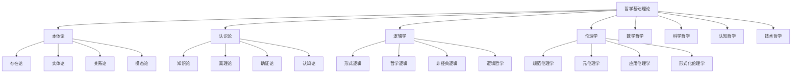

# 01-哲学基础理论：形式化哲学体系

## 目录

1. [1.0 哲学基础概述](#10-哲学基础概述)
2. [2.0 本体论基础](#20-本体论基础)
3. [3.0 认识论基础](#30-认识论基础)
4. [4.0 逻辑学基础](#40-逻辑学基础)
5. [5.0 伦理学基础](#50-伦理学基础)
6. [6.0 数学哲学](#60-数学哲学)
7. [7.0 科学哲学](#70-科学哲学)
8. [8.0 认知哲学](#80-认知哲学)
9. [9.0 技术哲学](#90-技术哲学)
10. [10.0 哲学与形式化](#100-哲学与形式化)

## 1.0 哲学基础概述

### 1.1 哲学在形式化理论体系中的地位

**定义 1.1.1 (哲学基础层)**
哲学基础层是形式化理论体系的最底层，为整个理论体系提供概念基础、方法论指导和价值规范。

**公理 1.1.1 (哲学基础性)**
哲学基础层 $\mathcal{P}$ 是形式化理论体系 $\mathcal{FTS}$ 的基础，满足：
$$\forall t \in \mathcal{FTS}, \quad \text{DependsOn}(t, \mathcal{P})$$

### 1.2 哲学内容分布

## 2.0 本体论基础

### 2.1 本体论宇宙

**定义 2.1.1 (本体论宇宙)**
本体论宇宙是一个五元组 $\mathcal{O} = (\mathcal{E}, \mathcal{P}, \mathcal{R}, \mathcal{M}, \mathcal{I})$，其中：

- $\mathcal{E}$ 是实体集合 (Entities)
- $\mathcal{P}$ 是属性集合 (Properties)
- $\mathcal{R}$ 是关系集合 (Relations)
- $\mathcal{M}$ 是模态算子集合 (Modal Operators)
- $\mathcal{I}$ 是解释函数 (Interpretation Function)

**公理 2.1.1 (存在性公理)**
对于任意实体 $e \in \mathcal{E}$，存在性谓词 $\exists$ 满足：
$$\exists(e) \Leftrightarrow e \in \mathcal{E}$$

**公理 2.1.2 (属性公理)**
对于任意实体 $e \in \mathcal{E}$ 和属性 $p \in \mathcal{P}$：
$$P(e) \Leftrightarrow (e, p) \in \mathcal{I}$$

### 2.2 实体理论

**定义 2.2.1 (实体)**
实体是本体论宇宙中的基本存在物，满足：
$$\forall e \in \mathcal{E}, \quad \text{Entity}(e) \Leftrightarrow \exists(e)$$

**定义 2.2.2 (实体类型)**
实体类型是一个函数 $\tau: \mathcal{E} \to \mathcal{T}$，其中 $\mathcal{T}$ 是类型集合。

**公理 2.2.1 (实体分类公理)**
对于任意实体 $e \in \mathcal{E}$：
$$\tau(e) \in \{\text{Physical}, \text{Mental}, \text{Abstract}, \text{Social}\}$$

### 2.3 关系理论

**定义 2.3.1 (二元关系)**
二元关系是一个三元组 $R = (A, B, \rho)$，其中：

- $A, B$ 是实体集合
- $\rho \subseteq A \times B$ 是关系集合

**定义 2.3.2 (关系性质)**
关系 $R$ 的性质包括：

1. **自反性**：$\forall a \in A, \quad (a, a) \in \rho$
2. **对称性**：$\forall a, b, \quad (a, b) \in \rho \Rightarrow (b, a) \in \rho$
3. **传递性**：$\forall a, b, c, \quad (a, b) \in \rho \land (b, c) \in \rho \Rightarrow (a, c) \in \rho$

## 3.0 认识论基础

### 3.1 知识论宇宙

**定义 3.1.1 (知识论宇宙)**
知识论宇宙是一个六元组 $\mathcal{K} = (\mathcal{B}, \mathcal{J}, \mathcal{T}, \mathcal{E}, \mathcal{R}, \mathcal{I})$，其中：

- $\mathcal{B}$ 是信念集合 (Beliefs)
- $\mathcal{J}$ 是确证集合 (Justifications)
- $\mathcal{T}$ 是真理集合 (Truths)
- $\mathcal{E}$ 是证据集合 (Evidence)
- $\mathcal{R}$ 是推理规则集合 (Reasoning Rules)
- $\mathcal{I}$ 是解释函数 (Interpretation Function)

**公理 3.1.1 (知识定义公理)**
对于任意信念 $b \in \mathcal{B}$，知识定义为：
$$\text{Knowledge}(b) \Leftrightarrow \text{Belief}(b) \land \text{True}(b) \land \text{Justified}(b)$$

### 3.2 真理理论

**定义 3.2.1 (符合论真理)**
符合论真理是一个函数 $\text{Correspondence}: \mathcal{B} \times \mathcal{F} \to \{\text{True}, \text{False}\}$，其中 $\mathcal{F}$ 是事实集合。

**公理 3.2.1 (符合论公理)**
对于任意信念 $b \in \mathcal{B}$ 和事实 $f \in \mathcal{F}$：
$$\text{True}(b) \Leftrightarrow \text{Correspondence}(b, f) = \text{True}$$

**定义 3.2.2 (融贯论真理)**
融贯论真理是一个函数 $\text{Coherence}: \mathcal{B}^* \to \{\text{True}, \text{False}\}$，其中 $\mathcal{B}^*$ 是信念集合的幂集。

**公理 3.2.2 (融贯论公理)**
对于任意信念集合 $B \subseteq \mathcal{B}$：
$$\text{True}(B) \Leftrightarrow \text{Coherence}(B) = \text{True}$$

### 3.3 确证理论

**定义 3.3.1 (确证)**
确证是一个三元组 $J = (b, e, r)$，其中：

- $b \in \mathcal{B}$ 是被确证的信念
- $e \in \mathcal{E}$ 是确证证据
- $r \in \mathcal{R}$ 是确证规则

**公理 3.3.1 (确证公理)**
对于任意确证 $J = (b, e, r)$：
$$\text{Justified}(b) \Leftrightarrow \text{Valid}(e) \land \text{Valid}(r) \land \text{Supports}(e, b, r)$$

## 4.0 逻辑学基础

### 4.1 逻辑系统

**定义 4.1.1 (逻辑系统)**
逻辑系统是一个四元组 $\mathcal{L} = (\mathcal{F}, \mathcal{A}, \mathcal{R}, \vdash)$，其中：

- $\mathcal{F}$ 是公式集合 (Formulas)
- $\mathcal{A}$ 是公理集合 (Axioms)
- $\mathcal{R}$ 是推理规则集合 (Rules)
- $\vdash$ 是推导关系 (Derivation Relation)

**公理 4.1.1 (逻辑一致性公理)**
逻辑系统 $\mathcal{L}$ 满足：
$$\not\vdash \bot$$

**公理 4.1.2 (逻辑完备性公理)**
逻辑系统 $\mathcal{L}$ 满足：
$$\forall \phi \in \mathcal{F}, \quad \text{Valid}(\phi) \Rightarrow \vdash \phi$$

### 4.2 命题逻辑

**定义 4.2.1 (命题)**
命题是一个原子公式，属于集合 $\mathcal{P}$。

**定义 4.2.2 (命题逻辑公式)**
命题逻辑公式递归定义为：

1. 原子命题 $p \in \mathcal{P}$ 是公式
2. 如果 $\phi$ 是公式，那么 $\neg \phi$ 是公式
3. 如果 $\phi, \psi$ 是公式，那么 $\phi \land \psi$, $\phi \lor \psi$, $\phi \to \psi$ 是公式

**公理 4.2.1 (命题逻辑公理)**

1. $\phi \to (\psi \to \phi)$
2. $(\phi \to (\psi \to \chi)) \to ((\phi \to \psi) \to (\phi \to \chi))$
3. $(\neg \phi \to \neg \psi) \to (\psi \to \phi)$

### 4.3 谓词逻辑

**定义 4.3.1 (谓词)**
谓词是一个函数 $P: D^n \to \{\text{True}, \text{False}\}$，其中 $D$ 是论域。

**定义 4.3.2 (谓词逻辑公式)**
谓词逻辑公式递归定义为：

1. 原子公式 $P(t_1, \ldots, t_n)$ 是公式
2. 如果 $\phi$ 是公式，那么 $\neg \phi$ 是公式
3. 如果 $\phi, \psi$ 是公式，那么 $\phi \land \psi$, $\phi \lor \psi$, $\phi \to \psi$ 是公式
4. 如果 $\phi$ 是公式，$x$ 是变量，那么 $\forall x \phi$, $\exists x \phi$ 是公式

## 5.0 伦理学基础

### 5.1 规范伦理学

**定义 5.1.1 (道德行为)**
道德行为是一个三元组 $A = (a, s, c)$，其中：

- $a$ 是行为本身
- $s$ 是行为主体
- $c$ 是行为情境

**定义 5.1.2 (道德判断)**
道德判断是一个函数 $\text{Moral}: \mathcal{A} \to \{\text{Right}, \text{Wrong}, \text{Neutral}\}$，其中 $\mathcal{A}$ 是行为集合。

### 5.2 义务论

**定义 5.2.1 (道德义务)**
道德义务是一个二元组 $D = (a, r)$，其中：

- $a$ 是行为
- $r$ 是义务理由

**公理 5.2.1 (义务论公理)**
对于任意行为 $a$：
$$\text{Moral}(a) = \text{Right} \Leftrightarrow \text{Duty}(a)$$

### 5.3 功利主义

**定义 5.3.1 (效用函数)**
效用函数是一个函数 $U: \mathcal{O} \to \mathbb{R}$，其中 $\mathcal{O}$ 是结果集合。

**公理 5.3.1 (功利主义公理)**
对于任意行为 $a$：
$$\text{Moral}(a) = \text{Right} \Leftrightarrow \text{Maximizes}(a, U)$$

## 6.0 数学哲学

### 6.1 数学对象的存在性

**定义 6.1.1 (数学对象)**
数学对象是抽象实体，属于集合 $\mathcal{M}$。

**定义 6.1.2 (柏拉图主义)**
柏拉图主义认为数学对象客观存在于理念世界：
$$\forall m \in \mathcal{M}, \quad \text{Exists}(m) \land \text{Independent}(m, \text{Mind})$$

**定义 6.1.3 (形式主义)**
形式主义认为数学是符号形式系统的操作：
$$\forall m \in \mathcal{M}, \quad \text{Formal}(m) \land \text{Manipulable}(m)$$

### 6.2 数学真理

**定义 6.2.1 (数学真理)**
数学真理是一个函数 $\text{MathTrue}: \mathcal{M} \to \{\text{True}, \text{False}\}$。

**公理 6.2.1 (数学真理公理)**
对于任意数学命题 $p$：
$$\text{MathTrue}(p) \Rightarrow \text{Necessary}(p)$$

## 7.0 科学哲学

### 7.1 科学方法论

**定义 7.1.1 (科学方法)**
科学方法是一个四元组 $\mathcal{S} = (\mathcal{H}, \mathcal{E}, \mathcal{T}, \mathcal{V})$，其中：

- $\mathcal{H}$ 是假设集合
- $\mathcal{E}$ 是实验集合
- $\mathcal{T}$ 是理论集合
- $\mathcal{V}$ 是验证方法集合

**定义 7.1.2 (归纳法)**
归纳法是一个函数 $\text{Induction}: \mathcal{E}^* \to \mathcal{H}$。

**定义 7.1.3 (演绎法)**
演绎法是一个函数 $\text{Deduction}: \mathcal{H} \to \mathcal{E}^*$。

### 7.2 科学实在论

**定义 7.2.1 (科学实在论)**
科学实在论认为科学理论描述客观实在：
$$\forall t \in \mathcal{T}, \quad \text{Scientific}(t) \Rightarrow \text{Realistic}(t)$$

## 8.0 认知哲学

### 8.1 心智哲学

**定义 8.1.1 (心智)**
心智是一个三元组 $\text{Mind} = (\text{Consciousness}, \text{Intentionality}, \text{Qualia})$。

**定义 8.1.2 (心身问题)**
心身问题是关于心智与身体关系的哲学问题。

**公理 8.1.1 (心身关系公理)**
$$\text{Mind} \neq \text{Body} \land \text{Interacts}(\text{Mind}, \text{Body})$$

### 8.2 认知科学哲学

**定义 8.2.1 (认知架构)**
认知架构是一个四元组 $\mathcal{C} = (\text{Memory}, \text{Attention}, \text{Reasoning}, \text{Learning})$。

**定义 8.2.2 (认知过程)**
认知过程是一个函数 $\text{Cognitive}: \text{Input} \to \text{Output}$。

## 9.0 技术哲学

### 9.1 AI哲学

**定义 9.1.1 (人工智能)**
人工智能是一个三元组 $\text{AI} = (\text{Intelligence}, \text{Learning}, \text{Reasoning})$。

**定义 9.1.2 (强AI)**
强AI认为机器可以具有真正的智能：
$$\text{StrongAI} \Leftrightarrow \text{Conscious}(\text{AI}) \land \text{Intelligent}(\text{AI})$$

**定义 9.1.3 (弱AI)**
弱AI认为机器可以模拟智能行为：
$$\text{WeakAI} \Leftrightarrow \text{Simulates}(\text{AI}, \text{Intelligence})$$

### 9.2 计算哲学

**定义 9.2.1 (计算)**
计算是一个三元组 $\text{Computation} = (\text{Algorithm}, \text{Data}, \text{Process})$。

**定义 9.2.2 (计算宇宙假说)**
计算宇宙假说认为宇宙是一个计算过程：
$$\text{ComputationalUniverse} \Leftrightarrow \text{Is}(\text{Universe}, \text{Computation})$$

## 10.0 哲学与形式化

### 10.1 哲学的形式化

**定义 10.1.1 (形式化哲学)**
形式化哲学是使用数学和逻辑符号表达哲学概念的理论。

**公理 10.1.1 (形式化公理)**
对于任意哲学概念 $c$：
$$\text{Philosophical}(c) \Rightarrow \text{Formalizable}(c)$$

### 10.2 哲学在软件架构中的应用

**定义 10.2.1 (架构哲学)**
架构哲学是指导软件架构设计的哲学原则。

**公理 10.2.1 (架构哲学公理)**
对于任意软件架构 $A$：
$$\text{Good}(A) \Leftrightarrow \text{Follows}(A, \text{ArchitecturalPhilosophy})$$

---

## 总结

哲学基础理论为整个形式化理论体系提供了概念基础和方法论指导。通过本体论、认识论、逻辑学和伦理学的形式化，建立了坚实的哲学基础。这些理论为后续的数学理论、形式语言理论和软件架构理论提供了重要的支撑。
