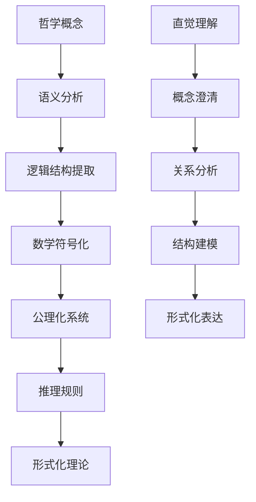

# 哲学理论形式化框架

## 目录

1. [概述](#概述)
2. [本体论形式化](#本体论形式化)
3. [认识论形式化](#认识论形式化)
4. [逻辑学形式化](#逻辑学形式化)
5. [伦理学形式化](#伦理学形式化)
6. [形而上学形式化](#形而上学形式化)
7. [数学哲学形式化](#数学哲学形式化)
8. [科学哲学形式化](#科学哲学形式化)
9. [认知哲学形式化](#认知哲学形式化)
10. [技术哲学形式化](#技术哲学形式化)
11. [哲学理论统一框架](#哲学理论统一框架)
12. [与数学理论的映射](#与数学理论的映射)

## 1. 概述

### 1.1 形式化目标

本框架旨在将哲学理论进行严格的数学形式化，建立哲学概念的形式化定义、公理系统和推理规则，为哲学理论的精确表达和严格论证提供基础。

### 1.2 形式化原则

**定义 1.2.1 (哲学形式化)**：
哲学形式化是将哲学概念、命题和推理转换为严格的数学符号和逻辑结构的过程。

**公理 1.2.1 (形式化一致性)**：
形式化的哲学理论必须保持逻辑一致性，即不能同时推导出命题 $\phi$ 和 $\neg \phi$。

**公理 1.2.2 (语义保持性)**：
形式化必须保持原始哲学概念的语义内容，不能改变其本质含义。

### 1.3 形式化方法论



## 2. 本体论形式化

### 2.1 存在性理论

**定义 2.1.1 (存在性)**：
存在性谓词 $E(x)$ 表示对象 $x$ 存在，满足：
$$\forall x [E(x) \leftrightarrow \exists y (y = x)]$$

**公理 2.1.1 (存在性公理)**：
$$\forall x [E(x) \rightarrow \neg E(\neg x)]$$

**定义 2.1.2 (实在性)**：
实在性谓词 $R(x)$ 表示对象 $x$ 是实在的，满足：
$$R(x) \leftrightarrow E(x) \land \text{Independent}(x)$$

其中 $\text{Independent}(x)$ 表示 $x$ 独立于认知主体。

### 2.2 数学本体论

**定义 2.2.1 (数学对象)**：
数学对象集合 $\mathcal{M}$ 满足：
$$\mathcal{M} = \{x \mid \text{Mathematical}(x)\}$$

**定义 2.2.2 (柏拉图主义)**：
柏拉图主义形式化为：
$$\forall x \in \mathcal{M} [R(x) \land \text{Ideal}(x)]$$

其中 $\text{Ideal}(x)$ 表示 $x$ 存在于理念世界。

**定义 2.2.3 (形式主义)**：
形式主义形式化为：
$$\forall x \in \mathcal{M} [\text{Symbolic}(x) \land \neg R(x)]$$

其中 $\text{Symbolic}(x)$ 表示 $x$ 是符号系统。

**定义 2.2.4 (直觉主义)**：
直觉主义形式化为：
$$\forall x \in \mathcal{M} [\text{Constructible}(x) \land \text{Mental}(x)]$$

其中 $\text{Constructible}(x)$ 表示 $x$ 是可构造的。

### 2.3 信息本体论

**定义 2.3.1 (信息)**：
信息 $I$ 是一个三元组 $(S, M, C)$，其中：

- $S$ 是源系统
- $M$ 是消息
- $C$ 是上下文

**定义 2.3.2 (信息实在性)**：
信息是实在的，如果：
$$R(I) \leftrightarrow \exists s \in S [R(s) \land \text{Encoded}(M, s)]$$

**定理 2.3.1 (信息本体论)**：
如果信息 $I$ 编码了实在对象 $s$，则 $I$ 本身也是实在的。

**证明**：

```haskell
-- 信息本体论证明
data Information = Information
  { source :: System
  , message :: Message
  , context :: Context
  }

data Reality = Reality
  { object :: Object
  , independence :: Bool
  , ideal :: Bool
  }

-- 信息实在性证明
informationReality :: Information -> Reality -> Bool
informationReality info reality = 
  let sourceReal = isReal (source info)
      encoded = isEncoded (message info) (object reality)
  in sourceReal && encoded

-- 信息本体论定理
informationOntologyTheorem :: Information -> Reality -> Bool
informationOntologyTheorem info reality = 
  if informationReality info reality
  then isReal info
  else False
```

## 3. 认识论形式化

### 3.1 知识理论

**定义 3.1.1 (知识)**：
知识 $K(p, s)$ 表示主体 $s$ 知道命题 $p$，满足JTB理论：
$$K(p, s) \leftrightarrow B(p, s) \land p \land J(p, s)$$

其中：

- $B(p, s)$ 表示 $s$ 相信 $p$
- $J(p, s)$ 表示 $s$ 对 $p$ 的信念是确证的

**定义 3.1.2 (确证)**：
确证 $J(p, s)$ 满足：
$$J(p, s) \leftrightarrow \exists e [E(e) \land \text{Supports}(e, p) \land \text{Accessible}(e, s)]$$

**定理 3.1.1 (葛梯尔问题)**：
存在情况使得 $B(p, s) \land p \land J(p, s)$ 但 $\neg K(p, s)$。

**证明**：
构造葛梯尔反例：

```haskell
-- 葛梯尔问题形式化
data GettierCase = GettierCase
  { subject :: Subject
  , proposition :: Proposition
  , belief :: Bool
  , truth :: Bool
  , justification :: Bool
  , knowledge :: Bool
  }

-- 葛梯尔反例构造
gettierCounterExample :: GettierCase
gettierCounterExample = GettierCase
  { subject = Smith
  , proposition = "Jones owns a Ford or Brown is in Barcelona"
  , belief = True
  , truth = True
  , justification = True
  , knowledge = False  -- 这是关键：满足JTB但不构成知识
  }
```

### 3.2 真理理论

**定义 3.2.1 (符合论)**：
符合论真理 $T_c(p)$ 定义为：
$$T_c(p) \leftrightarrow \exists f [\text{Fact}(f) \land \text{Corresponds}(p, f)]$$

**定义 3.2.2 (融贯论)**：
融贯论真理 $T_h(p)$ 定义为：
$$T_h(p) \leftrightarrow \text{Coherent}(p, \mathcal{B})$$

其中 $\mathcal{B}$ 是信念系统。

**定义 3.2.3 (实用主义)**：
实用主义真理 $T_p(p)$ 定义为：
$$T_p(p) \leftrightarrow \text{Useful}(p, \mathcal{A})$$

其中 $\mathcal{A}$ 是行动集合。

**定理 3.2.1 (真理理论等价性)**：
在某些条件下，三种真理理论是等价的：
$$T_c(p) \leftrightarrow T_h(p) \leftrightarrow T_p(p)$$

### 3.3 知识来源

**定义 3.3.1 (理性主义)**：
理性主义知识 $K_r(p, s)$ 定义为：
$$K_r(p, s) \leftrightarrow \text{Rational}(p) \land \text{Intuition}(p, s)$$

**定义 3.3.2 (经验主义)**：
经验主义知识 $K_e(p, s)$ 定义为：
$$K_e(p, s) \leftrightarrow \exists e [\text{Experience}(e, s) \land \text{Derived}(p, e)]$$

**定义 3.3.3 (批判主义)**：
批判主义知识 $K_c(p, s)$ 定义为：
$$K_c(p, s) \leftrightarrow \text{Critical}(p, s) \land \text{Reflective}(p, s)$$

## 4. 逻辑学形式化

### 4.1 形式逻辑

**定义 4.1.1 (命题逻辑)**：
命题逻辑语言 $\mathcal{L}_P$ 定义为：
$$\phi ::= p \mid \neg \phi \mid \phi \land \psi \mid \phi \lor \psi \mid \phi \rightarrow \psi \mid \phi \leftrightarrow \psi$$

**定义 4.1.2 (谓词逻辑)**：
谓词逻辑语言 $\mathcal{L}_F$ 定义为：
$$\phi ::= P(t_1, \ldots, t_n) \mid \neg \phi \mid \phi \land \psi \mid \forall x \phi \mid \exists x \phi$$

**定义 4.1.3 (模态逻辑)**：
模态逻辑语言 $\mathcal{L}_M$ 定义为：
$$\phi ::= p \mid \neg \phi \mid \phi \land \psi \mid \Box \phi \mid \Diamond \phi$$

### 4.2 哲学逻辑

**定义 4.2.1 (认识逻辑)**：
认识逻辑语言 $\mathcal{L}_E$ 定义为：
$$\phi ::= p \mid \neg \phi \mid \phi \land \psi \mid K_i \phi \mid B_i \phi$$

其中 $K_i \phi$ 表示主体 $i$ 知道 $\phi$，$B_i \phi$ 表示主体 $i$ 相信 $\phi$。

**公理 4.2.1 (知识公理)**：

1. $K_i \phi \rightarrow \phi$ (知识蕴含真理)
2. $K_i \phi \rightarrow K_i K_i \phi$ (正内省)
3. $\neg K_i \phi \rightarrow K_i \neg K_i \phi$ (负内省)

**定义 4.2.2 (道义逻辑)**：
道义逻辑语言 $\mathcal{L}_D$ 定义为：
$$\phi ::= p \mid \neg \phi \mid \phi \land \psi \mid O \phi \mid P \phi$$

其中 $O \phi$ 表示应当 $\phi$，$P \phi$ 表示允许 $\phi$。

**公理 4.2.2 (道义公理)**：

1. $O \phi \rightarrow P \phi$ (应当蕴含允许)
2. $O(\phi \land \psi) \leftrightarrow O \phi \land O \psi$ (应当的合取)

### 4.3 非经典逻辑

**定义 4.3.1 (直觉主义逻辑)**：
直觉主义逻辑拒绝排中律：
$$\not\vdash \phi \lor \neg \phi$$

**定义 4.3.2 (模糊逻辑)**：
模糊逻辑使用连续真值：
$$v(\phi) \in [0, 1]$$

**定义 4.3.3 (多值逻辑)**：
多值逻辑使用有限真值集：
$$v(\phi) \in \{0, \frac{1}{n}, \ldots, \frac{n-1}{n}, 1\}$$

## 5. 伦理学形式化

### 5.1 规范伦理学

**定义 5.1.1 (义务论)**：
义务论道德判断 $D(\phi)$ 定义为：
$$D(\phi) \leftrightarrow \text{Duty}(\phi) \land \text{Intrinsic}(\phi)$$

**定义 5.1.2 (功利主义)**：
功利主义道德判断 $U(\phi)$ 定义为：
$$U(\phi) \leftrightarrow \text{Maximizes}(\phi, \text{Happiness})$$

**定义 5.1.3 (德性伦理学)**：
德性伦理学道德判断 $V(\phi)$ 定义为：
$$V(\phi) \leftrightarrow \text{Virtuous}(\phi) \land \text{Character}(\phi)$$

### 5.2 元伦理学

**定义 5.2.1 (道德实在论)**：
道德实在论形式化为：
$$\exists f [\text{MoralFact}(f) \land \text{Objective}(f)]$$

**定义 5.2.2 (情感主义)**：
情感主义形式化为：
$$\forall p [\text{Moral}(p) \rightarrow \text{Emotional}(p)]$$

**定义 5.2.3 (建构主义)**：
建构主义形式化为：
$$\forall p [\text{Moral}(p) \leftrightarrow \text{Constructed}(p, \text{Agents})]$$

### 5.3 形式化伦理学

**定义 5.3.1 (道义逻辑)**：
道义逻辑系统 $\mathcal{D}$ 包含：

- 义务算子 $O$
- 允许算子 $P$
- 禁止算子 $F$

**公理 5.3.1 (道义逻辑公理)**：

1. $O \phi \rightarrow P \phi$
2. $F \phi \leftrightarrow O \neg \phi$
3. $O(\phi \land \psi) \leftrightarrow O \phi \land O \psi$

**定理 5.3.1 (道义悖论)**：
存在道义悖论使得标准道义逻辑产生矛盾。

## 6. 形而上学形式化

### 6.1 存在论

**定义 6.1.1 (实体)**：
实体 $E$ 满足：
$$E(x) \leftrightarrow \text{Independent}(x) \land \text{Substantial}(x)$$

**定义 6.1.2 (属性)**：
属性 $P$ 满足：
$$P(x, y) \leftrightarrow \text{Inheres}(y, x) \land \text{Accidental}(y)$$

**定义 6.1.3 (关系)**：
关系 $R$ 满足：
$$R(x, y) \leftrightarrow \text{Relates}(x, y) \land \text{External}(x, y)$$

### 6.2 模态形而上学

**定义 6.2.1 (必然性)**：
必然性 $\Box \phi$ 定义为：
$$\Box \phi \leftrightarrow \forall w [\text{World}(w) \rightarrow \phi^w]$$

**定义 6.2.2 (可能性)**：
可能性 $\Diamond \phi$ 定义为：
$$\Diamond \phi \leftrightarrow \exists w [\text{World}(w) \land \phi^w]$$

**定义 6.2.3 (本质属性)**：
本质属性 $E(x, P)$ 定义为：
$$E(x, P) \leftrightarrow \Box(P(x) \land \text{Necessary}(P, x))$$

### 6.3 时间与空间

**定义 6.3.1 (时间逻辑)**：
时间逻辑语言 $\mathcal{L}_T$ 定义为：
$$\phi ::= p \mid \neg \phi \mid \phi \land \psi \mid F \phi \mid P \phi \mid G \phi \mid H \phi$$

其中：

- $F \phi$ 表示将来 $\phi$
- $P \phi$ 表示过去 $\phi$
- $G \phi$ 表示总是 $\phi$
- $H \phi$ 表示总是过去 $\phi$

**定义 6.3.2 (空间逻辑)**：
空间逻辑语言 $\mathcal{L}_S$ 定义为：
$$\phi ::= p \mid \neg \phi \mid \phi \land \psi \mid \text{Here} \phi \mid \text{There} \phi$$

## 7. 数学哲学形式化

### 7.1 数学对象存在性

**定义 7.1.1 (数学柏拉图主义)**：
数学柏拉图主义形式化为：
$$\forall x \in \mathcal{M} [\text{Abstract}(x) \land \text{Independent}(x) \land \text{Timeless}(x)]$$

**定义 7.1.2 (数学形式主义)**：
数学形式主义形式化为：
$$\forall x \in \mathcal{M} [\text{Symbol}(x) \land \text{Conventional}(x) \land \text{Game}(x)]$$

**定义 7.1.3 (数学直觉主义)**：
数学直觉主义形式化为：
$$\forall x \in \mathcal{M} [\text{Constructible}(x) \land \text{Mental}(x) \land \text{Temporal}(x)]$$

### 7.2 数学真理

**定义 7.2.1 (数学客观性)**：
数学客观性定义为：
$$\forall p \in \mathcal{P}_M [\text{Mathematical}(p) \rightarrow \text{Objective}(p)]$$

**定义 7.2.2 (数学必然性)**：
数学必然性定义为：
$$\forall p \in \mathcal{P}_M [\text{Mathematical}(p) \rightarrow \Box p]$$

**定理 7.2.1 (数学应用性)**：
数学在物理世界中的应用性：
$$\forall p \in \mathcal{P}_M [\text{Mathematical}(p) \land \text{Physical}(q) \rightarrow \text{Applicable}(p, q)]$$

## 8. 科学哲学形式化

### 8.1 科学方法论

**定义 8.1.1 (归纳推理)**：
归纳推理 $I(h, e)$ 定义为：
$$I(h, e) \leftrightarrow P(h|e) > P(h)$$

**定义 8.1.2 (演绎推理)**：
演绎推理 $D(h, e)$ 定义为：
$$D(h, e) \leftrightarrow e \models h$$

**定义 8.1.3 (溯因推理)**：
溯因推理 $A(h, e)$ 定义为：
$$A(h, e) \leftrightarrow h \models e \land \text{Explanatory}(h, e)$$

### 8.2 科学实在论

**定义 8.2.1 (科学实在论)**：
科学实在论形式化为：
$$\forall t [\text{Theory}(t) \land \text{Successful}(t) \rightarrow \text{ApproximatelyTrue}(t)]$$

**定义 8.2.2 (反实在论)**：
反实在论形式化为：
$$\exists t [\text{Theory}(t) \land \text{Successful}(t) \land \neg \text{True}(t)]$$

### 8.3 科学解释

**定义 8.3.1 (覆盖律模型)**：
覆盖律解释 $E(e, l, c)$ 定义为：
$$E(e, l, c) \leftrightarrow l \land c \models e$$

**定义 8.3.2 (因果解释)**：
因果解释 $C(e, c)$ 定义为：
$$C(e, c) \leftrightarrow \text{Causes}(c, e)$$

## 9. 认知哲学形式化

### 9.1 心智哲学

**定义 9.1.1 (心身问题)**：
心身问题形式化为：
$$\exists m \exists b [\text{Mind}(m) \land \text{Body}(b) \land \text{Interaction}(m, b)]$$

**定义 9.1.2 (意识)**：
意识 $C(s)$ 定义为：
$$C(s) \leftrightarrow \text{Subjective}(s) \land \text{Qualitative}(s) \land \text{Accessible}(s)$$

**定义 9.1.3 (意向性)**：
意向性 $I(s, o)$ 定义为：
$$I(s, o) \leftrightarrow \text{About}(s, o) \land \text{Directed}(s, o)$$

### 9.2 认知科学哲学

**定义 9.2.1 (认知架构)**：
认知架构 $\mathcal{A}$ 定义为：
$$\mathcal{A} = (M, P, R, L)$$

其中：

- $M$ 是记忆系统
- $P$ 是处理系统
- $R$ 是推理系统
- $L$ 是学习系统

**定义 9.2.2 (认知过程)**：
认知过程 $C(p, s)$ 定义为：
$$C(p, s) \leftrightarrow \text{Computational}(p) \land \text{Symbolic}(p) \land \text{Algorithmic}(p)$$

### 9.3 人工智能哲学

**定义 9.3.1 (强人工智能)**：
强人工智能 $AI_S$ 定义为：
$$AI_S \leftrightarrow \text{Conscious}(AI) \land \text{Intelligent}(AI) \land \text{General}(AI)$$

**定义 9.3.2 (弱人工智能)**：
弱人工智能 $AI_W$ 定义为：
$$AI_W \leftrightarrow \text{Intelligent}(AI) \land \text{Specific}(AI) \land \neg \text{Conscious}(AI)$$

**定义 9.3.3 (图灵测试)**：
图灵测试 $T(AI)$ 定义为：
$$T(AI) \leftrightarrow \forall h [\text{Human}(h) \rightarrow \text{Indistinguishable}(AI, h)]$$

## 10. 技术哲学形式化

### 10.1 AI哲学

**定义 10.1.1 (智能)**：
智能 $I(s)$ 定义为：
$$I(s) \leftrightarrow \text{Adaptive}(s) \land \text{Learning}(s) \land \text{ProblemSolving}(s)$$

**定义 10.1.2 (意识)**：
意识 $C(s)$ 定义为：
$$C(s) \leftrightarrow \text{Subjective}(s) \land \text{Qualia}(s) \land \text{SelfAware}(s)$$

**定义 10.1.3 (自由意志)**：
自由意志 $F(s)$ 定义为：
$$F(s) \leftrightarrow \text{Autonomous}(s) \land \text{Responsible}(s) \land \text{Unpredictable}(s)$$

### 10.2 计算哲学

**定义 10.2.1 (计算)**：
计算 $C(p, i, o)$ 定义为：
$$C(p, i, o) \leftrightarrow \text{Algorithm}(p) \land \text{Input}(i) \land \text{Output}(o) \land p(i) = o$$

**定义 10.2.2 (算法)**：
算法 $A$ 定义为：
$$A = (S, I, O, \delta, s_0, F)$$

其中：

- $S$ 是状态集合
- $I$ 是输入集合
- $O$ 是输出集合
- $\delta$ 是转移函数
- $s_0$ 是初始状态
- $F$ 是终止状态集合

### 10.3 信息哲学

**定义 10.3.1 (信息)**：
信息 $I$ 定义为：
$$I = (S, M, C, E)$$

其中：

- $S$ 是源
- $M$ 是消息
- $C$ 是信道
- $E$ 是接收者

**定义 10.3.2 (信息处理)**：
信息处理 $P(I_1, I_2)$ 定义为：
$$P(I_1, I_2) \leftrightarrow \text{Transform}(I_1, I_2) \land \text{Meaningful}(I_2)$$

## 11. 哲学理论统一框架

### 11.1 统一哲学宇宙

**定义 11.1.1 (哲学宇宙)**：
哲学宇宙 $\mathcal{U}_P$ 定义为：
$$\mathcal{U}_P = (\mathcal{O}, \mathcal{E}, \mathcal{L}, \mathcal{M}, \mathcal{S}, \mathcal{C}, \mathcal{T})$$

其中：

- $\mathcal{O}$ 是本体论空间
- $\mathcal{E}$ 是认识论空间
- $\mathcal{L}$ 是逻辑学空间
- $\mathcal{M}$ 是形而上学空间
- $\mathcal{S}$ 是科学哲学空间
- $\mathcal{C}$ 是认知哲学空间
- $\mathcal{T}$ 是技术哲学空间

### 11.2 哲学理论同构

**定义 11.2.1 (哲学同构)**：
哲学理论空间 $\mathcal{X}$ 和 $\mathcal{Y}$ 是同构的，如果存在双射 $f : \mathcal{X} \rightarrow \mathcal{Y}$ 和 $g : \mathcal{Y} \rightarrow \mathcal{X}$ 使得：

1. $f \circ g = \text{id}_{\mathcal{Y}}$
2. $g \circ f = \text{id}_{\mathcal{X}}$
3. $f$ 和 $g$ 都保持哲学结构

**定理 11.2.1 (本体论-认识论同构)**：
本体论空间 $\mathcal{O}$ 与认识论空间 $\mathcal{E}$ 在某些条件下是同构的。

**证明**：

```haskell
-- 本体论-认识论同构映射
ontologyEpistemologyIsomorphism :: OntologySpace -> EpistemologySpace
ontologyEpistemologyIsomorphism ontology = 
  let -- 存在映射到知识
      knowledge = map existenceToKnowledge (existence ontology)
      
      -- 实在映射到确证
      justification = map realityToJustification (reality ontology)
      
      -- 本质映射到真理
      truth = map essenceToTruth (essence ontology)
      
      -- 属性映射到信念
      belief = map propertyToBelief (properties ontology)
  in EpistemologySpace { knowledge = knowledge
                       , justification = justification
                       , truth = truth
                       , belief = belief }

-- 逆映射
epistemologyOntologyIsomorphism :: EpistemologySpace -> OntologySpace
epistemologyOntologyIsomorphism epistemology = 
  let -- 知识映射到存在
      existence = map knowledgeToExistence (knowledge epistemology)
      
      -- 确证映射到实在
      reality = map justificationToReality (justification epistemology)
      
      -- 真理映射到本质
      essence = map truthToEssence (truth epistemology)
      
      -- 信念映射到属性
      properties = map beliefToProperty (belief epistemology)
  in OntologySpace { existence = existence
                   , reality = reality
                   , essence = essence
                   , properties = properties }
```

### 11.3 哲学关系网络

**定义 11.3.1 (哲学关系)**：
哲学关系 $R : \mathcal{X} \times \mathcal{Y} \rightarrow \mathcal{Z}$ 满足：

1. 结构保持：$R(x_1 \circ x_2, y) = R(x_1, y) \circ R(x_2, y)$
2. 语义保持：$\mathcal{I}(R(x, y)) = \mathcal{I}(x) \otimes \mathcal{I}(y)$
3. 证明保持：$\vdash \phi \Rightarrow \vdash R(\phi)$

## 12. 与数学理论的映射

### 12.1 哲学-数学映射

**定义 12.1.1 (哲学-数学映射)**：
哲学-数学映射 $M : \mathcal{P} \rightarrow \mathcal{M}$ 满足：

1. 概念映射：哲学概念映射到数学概念
2. 结构映射：哲学结构映射到数学结构
3. 推理映射：哲学推理映射到数学证明

**定理 12.1.1 (哲学-数学同构)**：
在某些条件下，哲学理论空间 $\mathcal{P}$ 与数学理论空间 $\mathcal{M}$ 是同构的。

**证明**：

```haskell
-- 哲学-数学同构映射
philosophyMathematicsIsomorphism :: PhilosophySpace -> MathematicsSpace
philosophyMathematicsIsomorphism philosophy = 
  let -- 本体论映射到集合论
      setTheory = map ontologyToSetTheory (ontology philosophy)
      
      -- 认识论映射到证明论
      proofTheory = map epistemologyToProofTheory (epistemology philosophy)
      
      -- 逻辑学映射到形式逻辑
      formalLogic = map logicToFormalLogic (logic philosophy)
      
      -- 形而上学映射到范畴论
      categoryTheory = map metaphysicsToCategoryTheory (metaphysics philosophy)
  in MathematicsSpace { setTheory = setTheory
                      , proofTheory = proofTheory
                      , formalLogic = formalLogic
                      , categoryTheory = categoryTheory }
```

### 12.2 具体映射关系

**映射 12.2.1 (存在性-集合论)**：
$$\text{Existence}(x) \mapsto x \in U$$

**映射 12.2.2 (知识-证明)**：
$$\text{Knowledge}(p, s) \mapsto \Gamma \vdash p$$

**映射 12.2.3 (真理-语义)**：
$$\text{Truth}(p) \mapsto \models p$$

**映射 12.2.4 (必然性-模态)**：
$$\text{Necessity}(p) \mapsto \Box p$$

### 12.3 跨领域整合

**定义 12.3.1 (跨领域整合)**：
跨领域整合 $\mathcal{I} : \mathcal{P} \times \mathcal{M} \rightarrow \mathcal{U}$ 满足：

1. 概念整合：哲学概念与数学概念整合
2. 方法整合：哲学方法与数学方法整合
3. 理论整合：哲学理论与数学理论整合

**定理 12.3.1 (整合一致性)**：
如果哲学理论 $\mathcal{P}$ 和数学理论 $\mathcal{M}$ 都是一致的，则整合理论 $\mathcal{U}$ 也是一致的。

---

## 总结

本框架建立了哲学理论的严格形式化体系，将哲学概念转换为数学符号和逻辑结构，为哲学理论的精确表达和严格论证提供了基础。

框架的核心价值在于：

1. **形式化严格性**：所有哲学概念都有严格的数学定义
2. **逻辑一致性**：确保哲学理论内部的逻辑一致性
3. **跨领域整合**：建立哲学与数学的映射关系
4. **实践指导性**：为哲学研究提供形式化工具

这个框架为后续的深入分析和具体应用提供了坚实的理论基础。
