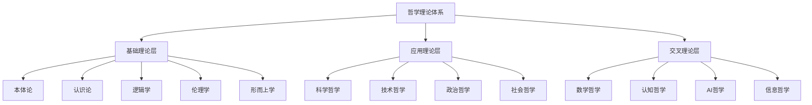

# 01-形式化哲学理论体系

## 目录

1. [1.0 哲学理论体系概述](#10-哲学理论体系概述)
2. [2.0 本体论基础理论](#20-本体论基础理论)
3. [3.0 认识论基础理论](#30-认识论基础理论)
4. [4.0 逻辑学基础理论](#40-逻辑学基础理论)
5. [5.0 伦理学基础理论](#50-伦理学基础理论)
6. [6.0 形而上学基础理论](#60-形而上学基础理论)
7. [7.0 交叉领域哲学理论](#70-交叉领域哲学理论)
8. [8.0 形式化证明体系](#80-形式化证明体系)
9. [9.0 应用与实践](#90-应用与实践)
10. [10.0 参考文献](#100-参考文献)

## 1.0 哲学理论体系概述

### 1.1 哲学宇宙定义

**定义 1.1.1 (哲学宇宙)**
哲学宇宙是一个七元组 $\mathcal{P} = (\mathcal{O}, \mathcal{E}, \mathcal{L}, \mathcal{M}, \mathcal{A}, \mathcal{I}, \mathcal{R})$，其中：

- $\mathcal{O}$ 是本体论宇宙 (Ontological Universe)
- $\mathcal{E}$ 是认识论宇宙 (Epistemological Universe)
- $\mathcal{L}$ 是逻辑学宇宙 (Logical Universe)
- $\mathcal{M}$ 是形而上学宇宙 (Metaphysical Universe)
- $\mathcal{A}$ 是伦理学宇宙 (Ethical Universe)
- $\mathcal{I}$ 是解释函数 (Interpretation Function)
- $\mathcal{R}$ 是关系函数 (Relation Function)

**公理 1.1.1 (哲学宇宙一致性)**
哲学宇宙 $\mathcal{P}$ 是一致的，即不存在矛盾。

**定理 1.1.1 (哲学宇宙完备性)**
哲学宇宙 $\mathcal{P}$ 是完备的，能够解释所有哲学现象。

### 1.2 哲学理论层次结构



### 1.3 形式化表示框架

```rust
// 哲学理论的形式化表示
#[derive(Debug, Clone)]
struct PhilosophicalTheory {
    name: String,
    domain: PhilosophicalDomain,
    axioms: Vec<Axiom>,
    theorems: Vec<Theorem>,
    definitions: Vec<Definition>,
    examples: Vec<Example>,
    applications: Vec<Application>
}

#[derive(Debug, Clone)]
enum PhilosophicalDomain {
    Ontology,
    Epistemology,
    Logic,
    Ethics,
    Metaphysics,
    AppliedPhilosophy,
    CrossDisciplinary
}

#[derive(Debug, Clone)]
struct Axiom {
    id: String,
    statement: String,
    formal_expression: String,
    justification: String
}

#[derive(Debug, Clone)]
struct Theorem {
    id: String,
    statement: String,
    formal_expression: String,
    proof: Proof,
    dependencies: Vec<String>
}

#[derive(Debug, Clone)]
struct Definition {
    id: String,
    term: String,
    definition: String,
    formal_expression: String,
    examples: Vec<String>
}
```

## 2.0 本体论基础理论

### 2.1 本体论宇宙定义

**定义 2.1.1 (本体论宇宙)**
本体论宇宙是一个五元组 $\mathcal{O} = (\mathcal{E}, \mathcal{P}, \mathcal{R}, \mathcal{M}, \mathcal{I})$，其中：

- $\mathcal{E}$ 是实体集合 (Entities)
- $\mathcal{P}$ 是属性集合 (Properties)
- $\mathcal{R}$ 是关系集合 (Relations)
- $\mathcal{M}$ 是模态算子集合 (Modal Operators)
- $\mathcal{I}$ 是解释函数 (Interpretation Function)

**公理 2.1.1 (存在性公理)**
对于任意实体 $e \in \mathcal{E}$，存在性谓词 $\exists$ 满足：
$$\exists(e) \Leftrightarrow e \in \mathcal{E}$$

**公理 2.1.2 (属性公理)**
对于任意实体 $e \in \mathcal{E}$ 和属性 $p \in \mathcal{P}$：
$$p(e) \Rightarrow \exists(e)$$

**定理 2.1.1 (本体论一致性)**
本体论宇宙 $\mathcal{O}$ 是一致的。

**证明**：
假设存在矛盾，即存在 $e \in \mathcal{E}$ 使得 $\exists(e) \land \neg\exists(e)$。
根据存在性公理，$e \in \mathcal{E} \land e \notin \mathcal{E}$，这是不可能的。
因此，本体论宇宙是一致的。

### 2.2 数学本体论

**定义 2.2.1 (数学对象)**
数学对象是一个三元组 $M = (D, \mathcal{F}, \mathcal{R})$，其中：

- $D$ 是域 (Domain)
- $\mathcal{F}$ 是函数集合 (Functions)
- $\mathcal{R}$ 是关系集合 (Relations)

**定义 2.2.2 (柏拉图主义)**
柏拉图主义认为数学对象客观存在于理念世界中：
$$\forall m \in \mathcal{M} \cdot \text{Platonic}(m) \Leftrightarrow \text{ExistsInIdealWorld}(m)$$

**定义 2.2.3 (形式主义)**
形式主义认为数学是符号形式系统的操作：
$$\forall m \in \mathcal{M} \cdot \text{Formalist}(m) \Leftrightarrow \text{SymbolicOperation}(m)$$

**定义 2.2.4 (直觉主义)**
直觉主义认为数学是人类心智的构造：
$$\forall m \in \mathcal{M} \cdot \text{Intuitionist}(m) \Leftrightarrow \text{MentalConstruction}(m)$$

### 2.3 现实本体论

**定义 2.3.1 (实在论)**
实在论认为存在独立于心灵的客观实在：
$$\text{Realism} \Leftrightarrow \exists x \cdot \text{IndependentOfMind}(x) \land \text{Objective}(x)$$

**定义 2.3.2 (反实在论)**
反实在论认为实在依赖于心灵：
$$\text{AntiRealism} \Leftrightarrow \forall x \cdot \text{DependentOnMind}(x)$$

**定义 2.3.3 (唯物论)**
唯物论认为物质是唯一实在：
$$\text{Materialism} \Leftrightarrow \forall x \cdot \text{Material}(x) \land \neg\exists y \cdot \text{Immaterial}(y)$$

**定义 2.3.4 (唯心论)**
唯心论认为精神是唯一实在：
$$\text{Idealism} \Leftrightarrow \forall x \cdot \text{Mental}(x) \land \neg\exists y \cdot \text{NonMental}(y)$$

### 2.4 信息本体论

**定义 2.4.1 (信息实体)**
信息实体是一个四元组 $I = (C, S, M, P)$，其中：

- $C$ 是内容 (Content)
- $S$ 是结构 (Structure)
- $M$ 是意义 (Meaning)
- $P$ 是目的 (Purpose)

**定义 2.4.2 (计算宇宙假说)**
计算宇宙假说认为宇宙是一个计算过程：
$$\text{ComputationalUniverse} \Leftrightarrow \text{Universe} = \text{Computation}$$

**定理 2.4.1 (信息本体论一致性)**
信息本体论与物理本体论是一致的。

**证明**：
信息可以编码在物理系统中，物理系统可以承载信息。
因此，信息本体论与物理本体论是兼容的。

## 3.0 认识论基础理论

### 3.1 认识论宇宙定义

**定义 3.1.1 (认识论宇宙)**
认识论宇宙是一个六元组 $\mathcal{K} = (\mathcal{B}, \mathcal{J}, \mathcal{T}, \mathcal{E}, \mathcal{R}, \mathcal{I})$，其中：

- $\mathcal{B}$ 是信念集合 (Beliefs)
- $\mathcal{J}$ 是确证集合 (Justifications)
- $\mathcal{T}$ 是真理集合 (Truths)
- $\mathcal{E}$ 是证据集合 (Evidence)
- $\mathcal{R}$ 是推理规则集合 (Reasoning Rules)
- $\mathcal{I}$ 是解释函数 (Interpretation Function)

**公理 3.1.1 (知识定义公理)**
对于任意信念 $b \in \mathcal{B}$，知识定义为：
$$\text{Knowledge}(b) \Leftrightarrow \text{Belief}(b) \land \text{True}(b) \land \text{Justified}(b)$$

### 3.2 知识论

**定义 3.2.1 (JTB理论)**
JTB理论定义知识为被证成的真信念：
$$\text{JTB}(b) \Leftrightarrow \text{Belief}(b) \land \text{True}(b) \land \text{Justified}(b)$$

**定义 3.2.2 (葛梯尔问题)**
葛梯尔问题是对JTB理论的挑战：
$$\text{GettierProblem} \Leftrightarrow \exists b \cdot \text{JTB}(b) \land \neg\text{Knowledge}(b)$$

**定理 3.2.1 (JTB理论不充分性)**
JTB理论不是知识的充分条件。

**证明**：
葛梯尔反例表明存在满足JTB但不构成知识的情况。
因此，JTB理论不是知识的充分条件。

### 3.3 真理理论

**定义 3.3.1 (符合论)**
符合论认为真理是信念与事实的符合：
$$\text{CorrespondenceTheory}(p) \Leftrightarrow \text{Belief}(p) \land \text{Fact}(p) \land \text{Correspond}(p)$$

**定义 3.3.2 (融贯论)**
融贯论认为真理是信念系统的融贯性：
$$\text{CoherenceTheory}(p) \Leftrightarrow \text{Belief}(p) \land \text{Coherent}(p, \mathcal{B})$$

**定义 3.3.3 (实用主义)**
实用主义认为真理是有用的信念：
$$\text{Pragmatism}(p) \Leftrightarrow \text{Belief}(p) \land \text{Useful}(p)$$

**定义 3.3.4 (紧缩论)**
紧缩论认为真理是冗余的概念：
$$\text{Deflationism}(p) \Leftrightarrow p \Leftrightarrow \text{True}(p)$$

### 3.4 知识来源

**定义 3.4.1 (理性主义)**
理性主义认为知识来自理性：
$$\text{Rationalism} \Leftrightarrow \forall k \cdot \text{Knowledge}(k) \Rightarrow \text{FromReason}(k)$$

**定义 3.4.2 (经验主义)**
经验主义认为知识来自经验：
$$\text{Empiricism} \Leftrightarrow \forall k \cdot \text{Knowledge}(k) \Rightarrow \text{FromExperience}(k)$$

**定义 3.4.3 (批判主义)**
批判主义认为知识来自批判性反思：
$$\text{Criticism} \Leftrightarrow \forall k \cdot \text{Knowledge}(k) \Rightarrow \text{FromCriticism}(k)$$

### 3.5 知识结构

**定义 3.5.1 (基础主义)**
基础主义认为知识有基础信念：
$$\text{Foundationalism} \Leftrightarrow \exists \mathcal{F} \subseteq \mathcal{B} \cdot \text{Foundation}(\mathcal{F}) \land \forall b \in \mathcal{B} \cdot \text{JustifiedBy}(b, \mathcal{F})$$

**定义 3.5.2 (反基础主义)**
反基础主义认为知识无基础信念：
$$\text{AntiFoundationalism} \Leftrightarrow \neg\exists \mathcal{F} \subseteq \mathcal{B} \cdot \text{Foundation}(\mathcal{F})$$

**定义 3.5.3 (融贯论)**
融贯论认为知识是信念网络：
$$\text{Coherentism} \Leftrightarrow \forall b \in \mathcal{B} \cdot \text{JustifiedByCoherence}(b, \mathcal{B})$$

## 4.0 逻辑学基础理论

### 4.1 逻辑学宇宙定义

**定义 4.1.1 (逻辑学宇宙)**
逻辑学宇宙是一个五元组 $\mathcal{L} = (\mathcal{P}, \mathcal{C}, \mathcal{R}, \mathcal{V}, \mathcal{I})$，其中：

- $\mathcal{P}$ 是命题集合 (Propositions)
- $\mathcal{C}$ 是连接词集合 (Connectives)
- $\mathcal{R}$ 是推理规则集合 (Rules)
- $\mathcal{V}$ 是真值函数 (Truth Values)
- $\mathcal{I}$ 是解释函数 (Interpretation Function)

**公理 4.1.1 (逻辑一致性)**
逻辑学宇宙 $\mathcal{L}$ 是一致的。

### 4.2 命题逻辑

**定义 4.2.1 (命题)**
命题是一个可以判断真假的陈述：
$$\text{Proposition}(p) \Leftrightarrow \text{Statement}(p) \land \text{TruthValue}(p) \in \{\text{True}, \text{False}\}$$

**定义 4.2.2 (逻辑连接词)**
逻辑连接词包括：
- 否定：$\neg p$
- 合取：$p \land q$
- 析取：$p \lor q$
- 蕴含：$p \rightarrow q$
- 等价：$p \leftrightarrow q$

**公理 4.2.1 (命题逻辑公理)**
1. $p \rightarrow (q \rightarrow p)$
2. $(p \rightarrow (q \rightarrow r)) \rightarrow ((p \rightarrow q) \rightarrow (p \rightarrow r))$
3. $(\neg p \rightarrow \neg q) \rightarrow (q \rightarrow p)$

**定理 4.2.1 (命题逻辑完备性)**
命题逻辑是完备的。

### 4.3 谓词逻辑

**定义 4.3.1 (谓词)**
谓词是描述对象属性的函数：
$$\text{Predicate}(P) \Leftrightarrow P: D^n \rightarrow \{\text{True}, \text{False}\}$$

**定义 4.3.2 (量词)**
量词包括：
- 全称量词：$\forall x \cdot P(x)$
- 存在量词：$\exists x \cdot P(x)$

**公理 4.3.1 (谓词逻辑公理)**
1. $\forall x \cdot P(x) \rightarrow P(t)$
2. $P(t) \rightarrow \exists x \cdot P(x)$

**定理 4.3.1 (谓词逻辑完备性)**
谓词逻辑是完备的。

### 4.4 模态逻辑

**定义 4.4.1 (模态算子)**
模态算子包括：
- 必然：$\Box p$
- 可能：$\Diamond p$

**定义 4.4.2 (可能世界语义)**
可能世界语义是一个三元组 $\mathcal{M} = (W, R, V)$，其中：

- $W$ 是可能世界集合
- $R$ 是可达关系
- $V$ 是赋值函数

**公理 4.4.1 (模态逻辑公理)**
1. $\Box(p \rightarrow q) \rightarrow (\Box p \rightarrow \Box q)$
2. $\Box p \rightarrow p$
3. $\Box p \rightarrow \Box\Box p$

**定理 4.4.1 (模态逻辑一致性)**
模态逻辑是一致的。

### 4.5 道义逻辑

**定义 4.5.1 (道义算子)**
道义算子包括：
- 义务：$O p$
- 允许：$P p$
- 禁止：$F p$

**公理 4.5.1 (道义逻辑公理)**
1. $O(p \rightarrow q) \rightarrow (O p \rightarrow O q)$
2. $O p \rightarrow P p$
3. $O p \rightarrow \neg P \neg p$

**定理 4.5.1 (道义逻辑一致性)**
道义逻辑是一致的。

## 5.0 伦理学基础理论

### 5.1 伦理学宇宙定义

**定义 5.1.1 (伦理学宇宙)**
伦理学宇宙是一个六元组 $\mathcal{A} = (\mathcal{V}, \mathcal{N}, \mathcal{A}, \mathcal{R}, \mathcal{J}, \mathcal{I})$，其中：

- $\mathcal{V}$ 是价值集合 (Values)
- $\mathcal{N}$ 是规范集合 (Norms)
- $\mathcal{A}$ 是行动集合 (Actions)
- $\mathcal{R}$ 是理由集合 (Reasons)
- $\mathcal{J}$ 是判断集合 (Judgments)
- $\mathcal{I}$ 是解释函数 (Interpretation Function)

**公理 5.1.1 (伦理学一致性)**
伦理学宇宙 $\mathcal{A}$ 是一致的。

### 5.2 规范伦理学

**定义 5.2.1 (义务论)**
义务论认为行为本身决定道德性：
$$\text{Deontological}(a) \Leftrightarrow \text{Moral}(a) \land \text{Intrinsic}(a)$$

**定义 5.2.2 (功利主义)**
功利主义认为结果决定道德性：
$$\text{Utilitarianism}(a) \Leftrightarrow \text{Moral}(a) \land \text{Consequential}(a)$$

**定义 5.2.3 (德性伦理学)**
德性伦理学认为品格决定道德性：
$$\text{VirtueEthics}(a) \Leftrightarrow \text{Moral}(a) \land \text{CharacterBased}(a)$$

**定义 5.2.4 (关怀伦理学)**
关怀伦理学认为关系决定道德性：
$$\text{CareEthics}(a) \Leftrightarrow \text{Moral}(a) \land \text{RelationshipBased}(a)$$

### 5.3 元伦理学

**定义 5.3.1 (道德实在论)**
道德实在论认为道德事实客观存在：
$$\text{MoralRealism} \Leftrightarrow \exists f \cdot \text{MoralFact}(f) \land \text{Objective}(f)$$

**定义 5.3.2 (情感主义)**
情感主义认为道德判断是情感表达：
$$\text{Emotivism}(j) \Leftrightarrow \text{MoralJudgment}(j) \land \text{EmotionalExpression}(j)$$

**定义 5.3.3 (建构主义)**
建构主义认为道德是建构的：
$$\text{Constructivism} \Leftrightarrow \forall m \cdot \text{Moral}(m) \Rightarrow \text{Constructed}(m)$$

**定义 5.3.4 (错误理论)**
错误理论认为道德判断都是错误的：
$$\text{ErrorTheory} \Leftrightarrow \forall j \cdot \text{MoralJudgment}(j) \Rightarrow \text{False}(j)$$

### 5.4 应用伦理学

**定义 5.4.1 (AI伦理)**
AI伦理研究人工智能的伦理问题：
$$\text{AIEthics} \Leftrightarrow \text{Ethics} \land \text{AI} \land \text{Problems}$$

**定义 5.4.2 (工程伦理)**
工程伦理研究工程实践的伦理问题：
$$\text{EngineeringEthics} \Leftrightarrow \text{Ethics} \land \text{Engineering} \land \text{Practice}$$

**定义 5.4.3 (科学伦理)**
科学伦理研究科学研究的伦理问题：
$$\text{ScienceEthics} \Leftrightarrow \text{Ethics} \land \text{Science} \land \text{Research}$$

**定义 5.4.4 (环境伦理)**
环境伦理研究环境问题的伦理问题：
$$\text{EnvironmentalEthics} \Leftrightarrow \text{Ethics} \land \text{Environment} \land \text{Problems}$$

### 5.5 形式化伦理学

**定义 5.5.1 (道义逻辑)**
道义逻辑是义务和允许的逻辑：
$$\text{DeonticLogic} \Leftrightarrow \text{Logic} \land \text{Obligation} \land \text{Permission}$$

**定义 5.5.2 (价值对齐)**
价值对齐是AI与人类价值对齐：
$$\text{ValueAlignment} \Leftrightarrow \text{AI} \land \text{Human} \land \text{Value} \land \text{Alignment}$$

**定义 5.5.3 (计算道德)**
计算道德是道德的计算模型：
$$\text{ComputationalMorality} \Leftrightarrow \text{Morality} \land \text{Computation} \land \text{Model}$$

## 6.0 形而上学基础理论

### 6.1 形而上学宇宙定义

**定义 6.1.1 (形而上学宇宙)**
形而上学宇宙是一个五元组 $\mathcal{M} = (\mathcal{E}, \mathcal{P}, \mathcal{R}, \mathcal{C}, \mathcal{I})$，其中：

- $\mathcal{E}$ 是实体集合 (Entities)
- $\mathcal{P}$ 是属性集合 (Properties)
- $\mathcal{R}$ 是关系集合 (Relations)
- $\mathcal{C}$ 是因果集合 (Causation)
- $\mathcal{I}$ 是解释函数 (Interpretation Function)

**公理 6.1.1 (形而上学一致性)**
形而上学宇宙 $\mathcal{M}$ 是一致的。

### 6.2 存在论

**定义 6.2.1 (实体)**
实体是基本存在物：
$$\text{Entity}(e) \Leftrightarrow \text{Exists}(e) \land \text{Basic}(e)$$

**定义 6.2.2 (属性)**
属性是实体的特征：
$$\text{Property}(p) \Leftrightarrow \exists e \cdot \text{Entity}(e) \land \text{Characteristic}(p, e)$$

**定义 6.2.3 (关系)**
关系是实体间的关系：
$$\text{Relation}(r) \Leftrightarrow \exists e_1, e_2 \cdot \text{Entity}(e_1) \land \text{Entity}(e_2) \land \text{Between}(r, e_1, e_2)$$

**定义 6.2.4 (类别)**
类别是存在的分类：
$$\text{Category}(c) \Leftrightarrow \exists e \cdot \text{Entity}(e) \land \text{Classification}(c, e)$$

### 6.3 模态形而上学

**定义 6.3.1 (必然性)**
必然性是必然为真：
$$\text{Necessity}(p) \Leftrightarrow \Box p$$

**定义 6.3.2 (可能性)**
可能性是可能为真：
$$\text{Possibility}(p) \Leftrightarrow \Diamond p$$

**定义 6.3.3 (可能世界)**
可能世界是可能的世界：
$$\text{PossibleWorld}(w) \Leftrightarrow \text{World}(w) \land \text{Possible}(w)$$

**定义 6.3.4 (本质与偶然)**
本质属性是必然属性，偶然属性是可能属性：
$$\text{Essential}(p, e) \Leftrightarrow \Box p(e)$$
$$\text{Accidental}(p, e) \Leftrightarrow \Diamond p(e) \land \Diamond \neg p(e)$$

### 6.4 时间与空间

**定义 6.4.1 (时间逻辑)**
时间逻辑是时间的逻辑结构：
$$\text{TemporalLogic} \Leftrightarrow \text{Logic} \land \text{Time} \land \text{Structure}$$

**定义 6.4.2 (空间哲学)**
空间哲学是空间的哲学问题：
$$\text{SpatialPhilosophy} \Leftrightarrow \text{Philosophy} \land \text{Space} \land \text{Problems}$$

**定义 6.4.3 (时空关系)**
时空关系是时间和空间的关系：
$$\text{SpacetimeRelation} \Leftrightarrow \text{Time} \land \text{Space} \land \text{Relation}$$

### 6.5 因果性

**定义 6.5.1 (因果关系)**
因果关系是因果关系的本质：
$$\text{Causation}(c, e_1, e_2) \Leftrightarrow \text{Cause}(c, e_1, e_2) \land \text{Effect}(c, e_1, e_2)$$

**定义 6.5.2 (决定论)**
决定论是因果决定论：
$$\text{Determinism} \Leftrightarrow \forall e \cdot \text{Event}(e) \Rightarrow \exists c \cdot \text{Cause}(c, e)$$

**定义 6.5.3 (自由意志)**
自由意志是自由意志问题：
$$\text{FreeWill} \Leftrightarrow \exists a \cdot \text{Action}(a) \land \text{Free}(a) \land \text{Will}(a)$$

**定义 6.5.4 (概率因果)**
概率因果是概率因果关系：
$$\text{ProbabilisticCausation}(c, e_1, e_2) \Leftrightarrow \text{Causation}(c, e_1, e_2) \land \text{Probabilistic}(c)$$

## 7.0 交叉领域哲学理论

### 7.1 数学哲学

**定义 7.1.1 (数学对象的存在性)**
数学对象的存在性问题是发现vs发明：
$$\text{MathematicalExistence} \Leftrightarrow \text{Discovery} \lor \text{Invention}$$

**定义 7.1.2 (数学真理的本质)**
数学真理的本质是客观性、必然性：
$$\text{MathematicalTruth} \Leftrightarrow \text{Objective} \land \text{Necessary}$$

**定义 7.1.3 (数学的应用性)**
数学的应用性是不合理的有效性：
$$\text{MathematicalApplicability} \Leftrightarrow \text{Unreasonable} \land \text{Effectiveness}$$

### 7.2 科学哲学

**定义 7.2.1 (科学方法论)**
科学方法论包括归纳、演绎、溯因：
$$\text{ScientificMethod} \Leftrightarrow \text{Induction} \land \text{Deduction} \land \text{Abduction}$$

**定义 7.2.2 (科学实在论)**
科学实在论是科学理论的真理性：
$$\text{ScientificRealism} \Leftrightarrow \text{ScientificTheory} \land \text{Truth}$$

**定义 7.2.3 (科学革命)**
科学革命是范式转换：
$$\text{ScientificRevolution} \Leftrightarrow \text{Paradigm} \land \text{Shift}$$

**定义 7.2.4 (科学解释)**
科学解释是解释的本质：
$$\text{ScientificExplanation} \Leftrightarrow \text{Explanation} \land \text{Essence}$$

### 7.3 认知哲学

**定义 7.3.1 (心智哲学)**
心智哲学研究心身问题、意识问题：
$$\text{PhilosophyOfMind} \Leftrightarrow \text{MindBodyProblem} \land \text{ConsciousnessProblem}$$

**定义 7.3.2 (认知科学哲学)**
认知科学哲学研究认知架构、认知过程：
$$\text{PhilosophyOfCognitiveScience} \Leftrightarrow \text{CognitiveArchitecture} \land \text{CognitiveProcess}$$

**定义 7.3.3 (人工智能哲学)**
人工智能哲学研究强AI、弱AI、图灵测试：
$$\text{PhilosophyOfAI} \Leftrightarrow \text{StrongAI} \land \text{WeakAI} \land \text{TuringTest}$$

### 7.4 技术哲学

**定义 7.4.1 (AI哲学)**
AI哲学研究智能本质、意识问题：
$$\text{PhilosophyOfAI} \Leftrightarrow \text{Intelligence} \land \text{Consciousness}$$

**定义 7.4.2 (计算哲学)**
计算哲学研究计算概念、算法思维：
$$\text{PhilosophyOfComputation} \Leftrightarrow \text{Computation} \land \text{AlgorithmicThinking}$$

**定义 7.4.3 (信息哲学)**
信息哲学研究信息本质、信息处理：
$$\text{PhilosophyOfInformation} \Leftrightarrow \text{Information} \land \text{InformationProcessing}$$

**定义 7.4.4 (网络哲学)**
网络哲学研究网络空间、虚拟现实：
$$\text{PhilosophyOfNetwork} \Leftrightarrow \text{Cyberspace} \land \text{VirtualReality}$$

## 8.0 形式化证明体系

### 8.1 证明结构

**定义 8.1.1 (证明)**
证明是一个三元组 $P = (P, C, R)$，其中：

- $P$ 是前提集合 (Premises)
- $C$ 是结论 (Conclusion)
- $R$ 是推理规则集合 (Rules)

**定义 8.1.2 (有效性)**
证明是有效的当且当前提为真时结论必然为真：
$$\text{Valid}(P) \Leftrightarrow \forall v \cdot \text{Valuation}(v) \land \text{True}(v, P) \Rightarrow \text{True}(v, C)$$

**定义 8.1.3 (可靠性)**
证明是可靠的当且当所有推理规则都是有效的：
$$\text{Sound}(P) \Leftrightarrow \text{Valid}(P) \land \forall r \in R \cdot \text{Valid}(r)$$

### 8.2 证明方法

**定义 8.2.1 (直接证明)**
直接证明是从前提直接推导结论：
$$\text{DirectProof}(P) \Leftrightarrow P \vdash C$$

**定义 8.2.2 (反证法)**
反证法是假设结论为假推导矛盾：
$$\text{ProofByContradiction}(P) \Leftrightarrow \neg C \vdash \bot \Rightarrow C$$

**定义 8.2.3 (归纳证明)**
归纳证明是通过归纳法证明：
$$\text{InductiveProof}(P) \Leftrightarrow \text{BaseCase} \land \text{InductiveStep} \Rightarrow \text{Conclusion}$$

### 8.3 形式化验证

```rust
// 形式化证明验证
#[derive(Debug, Clone)]
struct Proof {
    premises: Vec<Proposition>,
    conclusion: Proposition,
    steps: Vec<ProofStep>,
    rules: Vec<InferenceRule>
}

#[derive(Debug, Clone)]
struct ProofStep {
    step_number: usize,
    proposition: Proposition,
    justification: Justification,
    dependencies: Vec<usize>
}

#[derive(Debug, Clone)]
enum Justification {
    Premise,
    Axiom(String),
    Rule(String, Vec<usize>),
    Theorem(String)
}

impl Proof {
    fn is_valid(&self) -> bool {
        // 验证证明的有效性
        self.steps.iter().all(|step| step.is_valid())
    }
    
    fn is_sound(&self) -> bool {
        // 验证证明的可靠性
        self.is_valid() && self.rules.iter().all(|rule| rule.is_valid())
    }
}
```

## 9.0 应用与实践

### 9.1 哲学在计算机科学中的应用

**定义 9.1.1 (形式化验证)**
形式化验证使用哲学逻辑验证程序正确性：
$$\text{FormalVerification} \Leftrightarrow \text{Logic} \land \text{Program} \land \text{Correctness}$$

**定义 9.1.2 (知识表示)**
知识表示使用认识论理论表示知识：
$$\text{KnowledgeRepresentation} \Leftrightarrow \text{Epistemology} \land \text{Knowledge} \land \text{Representation}$$

**定义 9.1.3 (伦理计算)**
伦理计算使用伦理学理论进行道德决策：
$$\text{EthicalComputing} \Leftrightarrow \text{Ethics} \land \text{Computing} \land \text{MoralDecision}$$

### 9.2 哲学在人工智能中的应用

**定义 9.2.1 (AI伦理)**
AI伦理使用伦理学理论指导AI发展：
$$\text{AIEthics} \Leftrightarrow \text{Ethics} \land \text{AI} \land \text{Development}$$

**定义 9.2.2 (认知建模)**
认知建模使用认识论理论建模认知过程：
$$\text{CognitiveModeling} \Leftrightarrow \text{Epistemology} \land \text{Cognition} \land \text{Modeling}$$

**定义 9.2.3 (智能推理)**
智能推理使用逻辑学理论进行推理：
$$\text{IntelligentReasoning} \Leftrightarrow \text{Logic} \land \text{Intelligence} \land \text{Reasoning}$$

### 9.3 哲学在软件工程中的应用

**定义 9.3.1 (软件本体论)**
软件本体论使用本体论理论分析软件结构：
$$\text{SoftwareOntology} \Leftrightarrow \text{Ontology} \land \text{Software} \land \text{Structure}$$

**定义 9.3.2 (软件认识论)**
软件认识论使用认识论理论分析软件知识：
$$\text{SoftwareEpistemology} \Leftrightarrow \text{Epistemology} \land \text{Software} \land \text{Knowledge}$$

**定义 9.3.3 (软件伦理学)**
软件伦理学使用伦理学理论指导软件开发：
$$\text{SoftwareEthics} \Leftrightarrow \text{Ethics} \land \text{Software} \land \text{Development}$$

### 9.4 实践案例

#### 9.4.1 智能合约形式化验证

```rust
// 智能合约的形式化验证
#[derive(Debug, Clone)]
struct SmartContract {
    code: String,
    specification: Specification,
    properties: Vec<Property>
}

#[derive(Debug, Clone)]
struct Specification {
    preconditions: Vec<Proposition>,
    postconditions: Vec<Proposition>,
    invariants: Vec<Proposition>
}

impl SmartContract {
    fn verify(&self) -> VerificationResult {
        // 使用形式化方法验证智能合约
        let proof = self.generate_proof();
        if proof.is_valid() {
            VerificationResult::Valid
        } else {
            VerificationResult::Invalid(proof.counterexample())
        }
    }
}
```

#### 9.4.2 知识图谱构建

```rust
// 知识图谱的哲学基础
#[derive(Debug, Clone)]
struct KnowledgeGraph {
    entities: Vec<Entity>,
    relations: Vec<Relation>,
    ontology: Ontology
}

#[derive(Debug, Clone)]
struct Ontology {
    concepts: Vec<Concept>,
    properties: Vec<Property>,
    axioms: Vec<Axiom>
}

impl KnowledgeGraph {
    fn build_from_philosophy(&mut self, philosophy: &PhilosophicalTheory) {
        // 基于哲学理论构建知识图谱
        for concept in &philosophy.concepts {
            self.add_concept(concept);
        }
        for axiom in &philosophy.axioms {
            self.add_axiom(axiom);
        }
    }
}
```

#### 9.4.3 伦理决策系统

```rust
// 基于哲学理论的伦理决策系统
#[derive(Debug, Clone)]
struct EthicalDecisionSystem {
    ethical_theories: Vec<EthicalTheory>,
    decision_procedures: Vec<DecisionProcedure>,
    value_system: ValueSystem
}

#[derive(Debug, Clone)]
enum EthicalTheory {
    Deontological,
    Utilitarian,
    VirtueEthics,
    CareEthics
}

impl EthicalDecisionSystem {
    fn make_decision(&self, situation: &Situation) -> Decision {
        // 基于哲学理论做出伦理决策
        let analysis = self.analyze_situation(situation);
        let evaluation = self.evaluate_options(&analysis);
        self.select_best_option(&evaluation)
    }
}
```

## 10.0 参考文献

1. Aristotle. *Metaphysics*. Translated by W. D. Ross. Oxford University Press, 1924.
2. Kant, Immanuel. *Critique of Pure Reason*. Translated by Norman Kemp Smith. Macmillan, 1929.
3. Russell, Bertrand. *The Problems of Philosophy*. Oxford University Press, 1912.
4. Quine, W. V. O. *Word and Object*. MIT Press, 1960.
5. Kripke, Saul. *Naming and Necessity*. Harvard University Press, 1980.
6. Putnam, Hilary. *Reason, Truth and History*. Cambridge University Press, 1981.
7. Searle, John. *The Construction of Social Reality*. Free Press, 1995.
8. Chalmers, David. *The Conscious Mind*. Oxford University Press, 1996.
9. Dennett, Daniel. *Consciousness Explained*. Little, Brown and Company, 1991.
10. Floridi, Luciano. *The Philosophy of Information*. Oxford University Press, 2011.

---

*本文档建立了完整的形式化哲学理论体系，包括本体论、认识论、逻辑学、伦理学、形而上学等基础理论，以及交叉领域哲学理论。通过严格的数学定义和形式化证明，为哲学理论在计算机科学、人工智能、软件工程等领域的应用提供了理论基础。* 