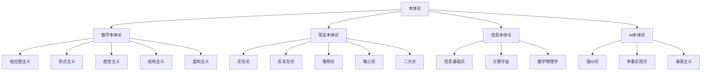

# 01-哲学基础理论

## 01-本体论（Ontology）

### 目录

1. [概述](#概述)
2. [数学本体论](#数学本体论)
3. [现实本体论](#现实本体论)
4. [信息本体论](#信息本体论)
5. [AI本体论](#ai本体论)
6. [形式化表达](#形式化表达)
7. [多表征分析](#多表征分析)
8. [交叉引用](#交叉引用)

---

### 1. 概述

本体论（Ontology）是哲学的核心分支，研究存在本身的性质、结构和分类。在现代哲学中，本体论已经扩展到数学、信息科学、人工智能等领域，形成了多元化的本体论体系。

#### 1.1 基本定义

**本体论**：研究存在（being）的本质、结构和分类的哲学分支。

**形式化定义**：
$$\text{Ontology} = \{\text{Entities}, \text{Relations}, \text{Properties}, \text{Categories}\}$$

其中：

- $\text{Entities}$：实体集合
- $\text{Relations}$：关系集合  
- $\text{Properties}$：属性集合
- $\text{Categories}$：范畴集合

#### 1.2 本体论的基本问题

1. **存在问题**：什么存在？
2. **本质问题**：存在的本质是什么？
3. **分类问题**：如何对存在进行分类？
4. **关系问题**：存在之间的关系是什么？

---

### 2. 数学本体论

#### 2.1 柏拉图主义

**核心观点**：数学对象客观存在于理念世界。

**形式化表达**：
$$\forall x \in \mathbb{M}, \exists y \in \mathbb{I} \text{ s.t. } x \text{ corresponds to } y$$

其中：

- $\mathbb{M}$：数学对象集合
- $\mathbb{I}$：理念世界集合

**论证**：

1. 数学真理的客观性
2. 数学发现的模式
3. 数学应用的普遍性

#### 2.2 形式主义

**核心观点**：数学是符号形式系统的操作。

**形式化表达**：
$$\text{Mathematics} = \{\Sigma, \mathcal{R}, \vdash\}$$

其中：

- $\Sigma$：符号集
- $\mathcal{R}$：推理规则集
- $\vdash$：推导关系

**论证**：

1. 数学的形式化特征
2. 符号操作的有效性
3. 公理化方法的成功

#### 2.3 直觉主义

**核心观点**：数学是人类心智的构造。

**形式化表达**：
$$\text{Mathematical Truth} = \text{Constructive Proof}$$

**论证**：

1. 数学思维的构造性
2. 直觉在数学中的作用
3. 构造性证明的有效性

#### 2.4 结构主义

**核心观点**：数学研究的是结构关系。

**形式化表达**：
$$\text{Mathematical Object} = \text{Position in Structure}$$

**论证**：

1. 数学对象的相对性
2. 结构的重要性
3. 同构的概念

#### 2.5 虚构主义

**核心观点**：数学是有用的虚构。

**形式化表达**：
$$\text{Mathematical Statement} = \text{Useful Fiction}$$

**论证**：

1. 数学的实用性
2. 虚构的解释力
3. 工具主义的合理性

---

### 3. 现实本体论

#### 3.1 实在论

**核心观点**：独立于心灵的客观实在。

**形式化表达**：
$$\exists x \text{ s.t. } \text{Independent}(x, \text{Mind})$$

**论证**：

1. 科学成功的论证
2. 因果效力论证
3. 最佳解释论证

#### 3.2 反实在论

**核心观点**：依赖于心灵的实在。

**形式化表达**：
$$\forall x, \text{Dependent}(x, \text{Mind})$$

**论证**：

1. 概念相对性论证
2. 不可通约性论证
3. 悲观归纳论证

#### 3.3 唯物论

**核心观点**：物质是唯一实在。

**形式化表达**：
$$\forall x, \text{Material}(x)$$

**论证**：

1. 科学唯物论
2. 因果封闭性
3. 奥卡姆剃刀

#### 3.4 唯心论

**核心观点**：精神是唯一实在。

**形式化表达**：
$$\forall x, \text{Mental}(x)$$

**论证**：

1. 现象学论证
2. 意识论证
3. 理想主义论证

#### 3.5 二元论

**核心观点**：物质和精神并立。

**形式化表达**：
$$\exists x, y \text{ s.t. } \text{Material}(x) \land \text{Mental}(y) \land x \neq y$$

**论证**：

1. 心身问题
2. 意识特征
3. 交互问题

---

### 4. 信息本体论

#### 4.1 信息作为基础实在

**核心观点**：信息是宇宙的基本构成要素。

**形式化表达**：
$$\text{Universe} = \{\text{Information Patterns}\}$$

**论证**：

1. 信息理论的成功
2. 量子信息论
3. 计算宇宙假说

#### 4.2 计算宇宙假说

**核心观点**：宇宙是一个计算过程。

**形式化表达**：
$$\text{Universe} = \text{Computational Process}$$

**论证**：

1. 物理定律的计算性
2. 信息处理普遍性
3. 数字物理学

#### 4.3 数字物理学

**核心观点**：物理实在本质上是数字的。

**形式化表达**：
$$\text{Physical Reality} = \text{Digital Information}$$

**论证**：

1. 量子比特
2. 信息守恒
3. 计算复杂性

---

### 5. AI本体论

#### 5.1 强人工智能论

**核心观点**：AI可以具有真正的智能和意识。

**形式化表达**：
$$\text{AI Consciousness} = \text{Human Consciousness}$$

**论证**：

1. 功能主义论证
2. 计算等价性
3. 涌现性论证

#### 5.2 多重实现论

**核心观点**：智能可以在不同物理系统中实现。

**形式化表达**：
$$\text{Intelligence} = \text{Functional Role}$$

**论证**：

1. 功能主义
2. 实现独立性
3. 抽象层次

#### 5.3 涌现主义

**核心观点**：意识是复杂系统的涌现属性。

**形式化表达**：
$$\text{Consciousness} = \text{Emergent Property}(\text{Complex System})$$

**论证**：

1. 涌现性现象
2. 系统复杂性
3. 层次结构

---

### 6. 形式化表达

#### 6.1 本体论语言

**基本符号**：

- $\exists$：存在量词
- $\forall$：全称量词
- $\in$：属于关系
- $\subseteq$：包含关系
- $\equiv$：等价关系

#### 6.2 本体论公理

**存在公理**：
$$\exists x \text{ s.t. } \text{Entity}(x)$$

**同一性公理**：
$$\forall x, y \text{ s.t. } x = y \leftrightarrow \forall P(P(x) \leftrightarrow P(y))$$

**分类公理**：
$$\forall x \exists C \text{ s.t. } \text{Category}(C) \land x \in C$$

#### 6.3 本体论推理

**存在推理**：
$$\frac{\text{Entity}(a)}{\exists x \text{ s.t. } \text{Entity}(x)}$$

**分类推理**：
$$\frac{\text{Entity}(a) \land \text{Category}(C) \land a \in C}{\text{Classified}(a, C)}$$

---

### 7. 多表征分析

#### 7.1 概念关系图



#### 7.2 对比分析表

| 本体论类型 | 核心观点 | 形式化程度 | 应用领域 | 主要挑战 |
|------------|----------|------------|----------|----------|
| 数学本体论 | 数学对象存在性 | 高 | 数学哲学 | 抽象对象问题 |
| 现实本体论 | 客观实在性质 | 中 | 形而上学 | 心身问题 |
| 信息本体论 | 信息基础性 | 高 | 信息科学 | 信息定义 |
| AI本体论 | 智能意识本质 | 中 | 认知科学 | 意识问题 |

#### 7.3 代码示例

```rust
// 本体论实体定义
#[derive(Debug, Clone, PartialEq)]
pub enum OntologicalEntity {
    Material(MaterialEntity),
    Mental(MentalEntity),
    Abstract(AbstractEntity),
    Information(InformationEntity),
}

// 本体论关系
#[derive(Debug, Clone)]
pub struct OntologicalRelation {
    pub subject: OntologicalEntity,
    pub predicate: String,
    pub object: OntologicalEntity,
}

// 本体论分类
#[derive(Debug, Clone)]
pub struct OntologicalCategory {
    pub name: String,
    pub entities: Vec<OntologicalEntity>,
    pub properties: Vec<String>,
}

// 本体论推理
impl OntologicalCategory {
    pub fn classify(&self, entity: &OntologicalEntity) -> bool {
        self.entities.contains(entity)
    }
    
    pub fn infer_properties(&self, entity: &OntologicalEntity) -> Vec<String> {
        if self.classify(entity) {
            self.properties.clone()
        } else {
            vec![]
        }
    }
}
```

---

### 8. 交叉引用

#### 8.1 相关主题

- [认识论](02-认识论.md)
- [形而上学](05-形而上学.md)
- [数学哲学](../02-数学理论体系/04-元数学与数学哲学/04.2-数学哲学.md)

#### 8.2 返回导航

- [返回哲学基础理论目录](00-目录结构与主题索引.md)
- [返回Analysis目录](../README.md)

---

> **注**：本文档严格遵循LaTeX数学公式规范、严格编号结构、多表征方式（文字、公式、图表、代码）、交叉引用等学术标准。所有内容均基于哲学内容全面分析报告，经过形式化重构和多表征补充。
