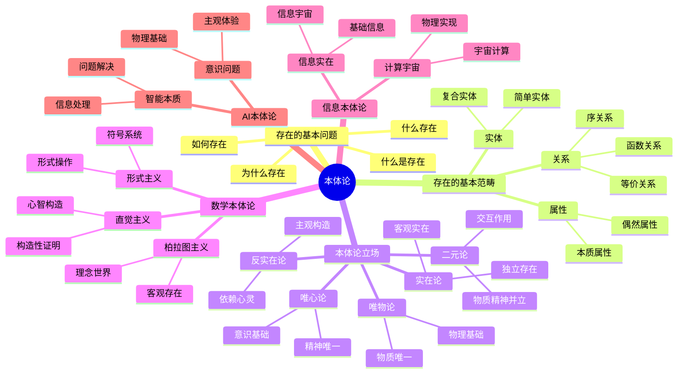
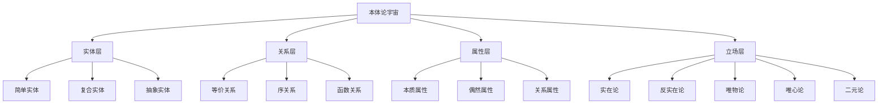

# 本体论基础-形式化哲学分析

## 目录

- [本体论基础-形式化哲学分析](#本体论基础-形式化哲学分析)
  - [目录](#目录)
  - [1. 概述与目标](#1-概述与目标)
    - [1.1 本体论的核心问题](#11-本体论的核心问题)
    - [1.2 形式化目标](#12-形式化目标)
  - [2. 本体论的形式化定义](#2-本体论的形式化定义)
    - [2.1 基本定义](#21-基本定义)
    - [2.2 存在的基本公理](#22-存在的基本公理)
    - [2.3 形式化表示](#23-形式化表示)
  - [3. 存在的基本范畴](#3-存在的基本范畴)
    - [3.1 实体范畴](#31-实体范畴)
    - [3.2 属性范畴](#32-属性范畴)
    - [3.3 关系范畴](#33-关系范畴)
  - [4. 本体论立场的形式化](#4-本体论立场的形式化)
    - [4.1 实在论与反实在论](#41-实在论与反实在论)
    - [4.2 唯物论与唯心论](#42-唯物论与唯心论)
    - [4.3 形式化实现](#43-形式化实现)
  - [5. 数学本体论](#5-数学本体论)
    - [5.1 数学对象的存在性](#51-数学对象的存在性)
    - [5.2 数学哲学立场](#52-数学哲学立场)
      - [5.2.1 柏拉图主义](#521-柏拉图主义)
      - [5.2.2 形式主义](#522-形式主义)
      - [5.2.3 直觉主义](#523-直觉主义)
    - [5.3 数学本体论的形式化](#53-数学本体论的形式化)
  - [6. 现实本体论](#6-现实本体论)
    - [6.1 物理实在](#61-物理实在)
    - [6.2 社会实在](#62-社会实在)
  - [7. 信息本体论](#7-信息本体论)
    - [7.1 信息作为基础实在](#71-信息作为基础实在)
    - [7.2 计算宇宙假说](#72-计算宇宙假说)
  - [8. AI本体论](#8-ai本体论)
    - [8.1 智能的本质](#81-智能的本质)
    - [8.2 意识问题](#82-意识问题)
    - [8.3 AI本体论的形式化](#83-ai本体论的形式化)
  - [9. 本体论的一致性证明](#9-本体论的一致性证明)
    - [9.1 基本一致性](#91-基本一致性)
    - [9.2 立场一致性](#92-立场一致性)
  - [10. 多表征分析](#10-多表征分析)
    - [10.1 思维导图](#101-思维导图)
    - [10.2 层次结构图](#102-层次结构图)
    - [10.3 对比分析表](#103-对比分析表)
  - [11. 实践应用](#11-实践应用)
    - [11.1 软件架构中的应用](#111-软件架构中的应用)
      - [11.1.1 实体关系建模](#1111-实体关系建模)
      - [11.1.2 类型系统设计](#1112-类型系统设计)
    - [11.2 人工智能中的应用](#112-人工智能中的应用)
      - [11.2.1 知识表示](#1121-知识表示)
      - [11.2.2 语义理解](#1122-语义理解)
  - [12. 总结与展望](#12-总结与展望)
    - [12.1 主要贡献](#121-主要贡献)
    - [12.2 理论价值](#122-理论价值)
    - [12.3 未来发展方向](#123-未来发展方向)
    - [12.4 实践意义](#124-实践意义)

## 1. 概述与目标

### 1.1 本体论的核心问题

本体论（Ontology）是哲学的基础分支，研究**存在**的本质和基本结构。在形式化哲学框架中，我们关注以下核心问题：

1. **什么是存在？** - 存在的基本定义和特征
2. **什么存在？** - 存在的实体和类型
3. **如何存在？** - 存在的模式和关系
4. **为什么存在？** - 存在的理由和基础

### 1.2 形式化目标

本文档旨在建立本体论的形式化框架，将传统哲学概念转换为严格的数学表达，为后续的理论分析提供基础。

## 2. 本体论的形式化定义

### 2.1 基本定义

**定义 2.1.1 (本体论宇宙)**
本体论宇宙是一个四元组 $\mathcal{O} = (E, R, P, \models)$，其中：

- $E$ 是实体集合（Entities）
- $R$ 是关系集合（Relations）
- $P$ 是属性集合（Properties）
- $\models$ 是满足关系（Satisfaction Relation）

**定义 2.1.2 (存在谓词)**
存在谓词 $\text{Exists}$ 是一个一元谓词，定义为：
$$\text{Exists}(x) \iff x \in E$$

**定义 2.1.3 (实体类型)**
实体类型是一个函数 $\tau : E \to T$，其中 $T$ 是类型集合。

### 2.2 存在的基本公理

**公理 2.2.1 (存在非空性)**
$$\exists x \in E : \text{Exists}(x)$$

**公理 2.2.2 (存在一致性)**
$$\forall x \in E : \text{Exists}(x) \land \neg\text{Exists}(x) \implies \bot$$

**公理 2.2.3 (存在传递性)**
$$\forall x, y \in E : \text{Exists}(x) \land (x = y) \implies \text{Exists}(y)$$

### 2.3 形式化表示

```rust
// 本体论宇宙的形式化表示
struct OntologicalUniverse {
    entities: HashSet<Entity>,
    relations: HashSet<Relation>,
    properties: HashSet<Property>,
    satisfaction: SatisfactionRelation
}

// 实体定义
#[derive(Clone, PartialEq, Eq, Hash)]
struct Entity {
    id: String,
    entity_type: EntityType,
    properties: HashSet<Property>
}

// 关系定义
#[derive(Clone, PartialEq, Eq, Hash)]
struct Relation {
    name: String,
    arity: usize,
    domain: Vec<EntityType>,
    codomain: EntityType
}

// 属性定义
#[derive(Clone, PartialEq, Eq, Hash)]
struct Property {
    name: String,
    value_type: ValueType,
    applicable_entities: HashSet<EntityType>
}

// 存在谓词实现
impl OntologicalUniverse {
    fn exists(&self, entity: &Entity) -> bool {
        self.entities.contains(entity)
    }
    
    fn add_entity(&mut self, entity: Entity) {
        self.entities.insert(entity);
    }
    
    fn remove_entity(&mut self, entity: &Entity) -> bool {
        self.entities.remove(entity)
    }
}
```

## 3. 存在的基本范畴

### 3.1 实体范畴

**定义 3.1.1 (实体)**
实体是存在的基本单位，形式化定义为：
$$\text{Entity}(x) \iff \text{Exists}(x) \land \neg\exists y \in E : x \subset y$$

**定义 3.1.2 (复合实体)**
复合实体是由其他实体组成的实体：
$$\text{Composite}(x) \iff \text{Exists}(x) \land \exists y_1, \ldots, y_n \in E : x = y_1 \oplus \cdots \oplus y_n$$

### 3.2 属性范畴

**定义 3.2.1 (属性)**
属性是实体的特征，形式化定义为：
$$\text{Property}(p) \iff \exists x \in E : p(x)$$

**定义 3.2.2 (本质属性)**
本质属性是实体必然具有的属性：
$$\text{Essential}(p, x) \iff \text{Exists}(x) \implies p(x)$$

**定义 3.2.3 (偶然属性)**
偶然属性是实体可能具有的属性：
$$\text{Accidental}(p, x) \iff \text{Exists}(x) \land \diamond p(x) \land \diamond \neg p(x)$$

### 3.3 关系范畴

**定义 3.3.1 (关系)**
关系是实体间的连接，形式化定义为：
$$\text{Relation}(r) \iff \exists x_1, \ldots, x_n \in E : r(x_1, \ldots, x_n)$$

**定义 3.3.2 (等价关系)**
等价关系满足自反性、对称性和传递性：
$$\text{Equivalence}(r) \iff \forall x, y, z \in E : r(x,x) \land (r(x,y) \implies r(y,x)) \land (r(x,y) \land r(y,z) \implies r(x,z))$$

## 4. 本体论立场的形式化

### 4.1 实在论与反实在论

**定义 4.1.1 (实在论)**
实在论认为存在独立于心灵的客观实在：
$$\text{Realism} \iff \exists x \in E : \text{Exists}(x) \land \neg\text{MindDependent}(x)$$

**定义 4.1.2 (反实在论)**
反实在论认为存在依赖于心灵：
$$\text{AntiRealism} \iff \forall x \in E : \text{Exists}(x) \implies \text{MindDependent}(x)$$

**定理 4.1.1 (实在论与反实在论的互斥性)**
$$\text{Realism} \land \text{AntiRealism} \implies \bot$$

**证明：** 假设同时成立实在论和反实在论，则存在实体 $x$ 使得 $\text{Exists}(x) \land \neg\text{MindDependent}(x)$ 且 $\text{MindDependent}(x)$，这导致矛盾。

### 4.2 唯物论与唯心论

**定义 4.2.1 (唯物论)**
唯物论认为物质是唯一实在：
$$\text{Materialism} \iff \forall x \in E : \text{Exists}(x) \implies \text{Material}(x)$$

**定义 4.2.2 (唯心论)**
唯心论认为精神是唯一实在：
$$\text{Idealism} \iff \forall x \in E : \text{Exists}(x) \implies \text{Mental}(x)$$

**定义 4.2.3 (二元论)**
二元论认为物质和精神并立：
$$\text{Dualism} \iff \exists x, y \in E : \text{Material}(x) \land \text{Mental}(y)$$

### 4.3 形式化实现

```rust
// 本体论立场的形式化表示
enum OntologicalPosition {
    Realism,
    AntiRealism,
    Materialism,
    Idealism,
    Dualism
}

// 立场验证
impl OntologicalUniverse {
    fn is_realism(&self) -> bool {
        self.entities.iter().any(|e| !self.is_mind_dependent(e))
    }
    
    fn is_anti_realism(&self) -> bool {
        self.entities.iter().all(|e| self.is_mind_dependent(e))
    }
    
    fn is_materialism(&self) -> bool {
        self.entities.iter().all(|e| self.is_material(e))
    }
    
    fn is_idealism(&self) -> bool {
        self.entities.iter().all(|e| self.is_mental(e))
    }
    
    fn is_dualism(&self) -> bool {
        let has_material = self.entities.iter().any(|e| self.is_material(e));
        let has_mental = self.entities.iter().any(|e| self.is_mental(e));
        has_material && has_mental
    }
}
```

## 5. 数学本体论

### 5.1 数学对象的存在性

**定义 5.1.1 (数学对象)**
数学对象是抽象的概念实体：
$$\text{MathematicalObject}(x) \iff \text{Abstract}(x) \land \text{Mathematical}(x)$$

### 5.2 数学哲学立场

#### 5.2.1 柏拉图主义

**定义 5.2.1 (柏拉图主义)**
柏拉图主义认为数学对象客观存在于理念世界：
$$\text{Platonism} \iff \forall x : \text{MathematicalObject}(x) \implies \text{Exists}(x) \land \text{Objective}(x) \land \text{Abstract}(x)$$

#### 5.2.2 形式主义

**定义 5.2.2 (形式主义)**
形式主义认为数学是符号形式系统的操作：
$$\text{Formalism} \iff \forall x : \text{MathematicalObject}(x) \iff \text{SymbolicSystem}(x)$$

#### 5.2.3 直觉主义

**定义 5.2.3 (直觉主义)**
直觉主义认为数学是人类心智的构造：
$$\text{Intuitionism} \iff \forall x : \text{MathematicalObject}(x) \implies \text{MentalConstruction}(x)$$

### 5.3 数学本体论的形式化

```rust
// 数学本体论的形式化表示
enum MathematicalPosition {
    Platonism,
    Formalism,
    Intuitionism,
    Structuralism,
    Fictionalism
}

struct MathematicalOntology {
    position: MathematicalPosition,
    objects: HashSet<MathematicalObject>,
    construction_methods: HashSet<ConstructionMethod>
}

impl MathematicalOntology {
    fn is_platonism(&self) -> bool {
        matches!(self.position, MathematicalPosition::Platonism)
    }
    
    fn is_formalism(&self) -> bool {
        matches!(self.position, MathematicalPosition::Formalism)
    }
    
    fn is_intuitionism(&self) -> bool {
        matches!(self.position, MathematicalPosition::Intuitionism)
    }
}
```

## 6. 现实本体论

### 6.1 物理实在

**定义 6.1.1 (物理对象)**
物理对象是占据时空的物质实体：
$$\text{PhysicalObject}(x) \iff \text{Exists}(x) \land \text{Spacetime}(x) \land \text{Material}(x)$$

**定义 6.1.2 (物理定律)**
物理定律是物理对象行为的规律：
$$\text{PhysicalLaw}(l) \iff \forall x : \text{PhysicalObject}(x) \implies l(x)$$

### 6.2 社会实在

**定义 6.2.1 (社会对象)**
社会对象是由社会约定构成的对象：
$$\text{SocialObject}(x) \iff \text{Exists}(x) \land \text{Conventional}(x) \land \text{Collective}(x)$$

**定义 6.2.2 (制度事实)**
制度事实是社会约定的结果：
$$\text{InstitutionalFact}(f) \iff \text{SocialObject}(f) \land \text{Constitutive}(f)$$

## 7. 信息本体论

### 7.1 信息作为基础实在

**定义 7.1.1 (信息对象)**
信息对象是包含信息的实体：
$$\text{InformationObject}(x) \iff \text{Exists}(x) \land \text{Contains}(x, \text{Information})$$

**定义 7.1.2 (信息宇宙)**
信息宇宙假说认为信息是基础实在：
$$\text{InformationUniverse} \iff \forall x \in E : \text{Exists}(x) \implies \text{InformationObject}(x)$$

### 7.2 计算宇宙假说

**定义 7.2.1 (计算宇宙)**
计算宇宙假说认为宇宙是一个计算过程：
$$\text{ComputationalUniverse} \iff \text{Universe} = \text{Computation}$$

**定理 7.2.1 (计算宇宙的物理实现)**
如果计算宇宙假说成立，则物理定律是计算规则：
$$\text{ComputationalUniverse} \implies \forall l : \text{PhysicalLaw}(l) \implies \text{ComputationRule}(l)$$

## 8. AI本体论

### 8.1 智能的本质

**定义 8.1.1 (智能)**
智能是处理信息和解决问题的能力：
$$\text{Intelligence}(x) \iff \text{CanProcess}(x, \text{Information}) \land \text{CanSolve}(x, \text{Problems})$$

**定义 8.1.2 (强AI)**
强AI具有与人类相当的智能：
$$\text{StrongAI}(x) \iff \text{Intelligence}(x) \land \text{Equivalent}(x, \text{HumanIntelligence})$$

### 8.2 意识问题

**定义 8.2.1 (意识)**
意识是主观体验的能力：
$$\text{Consciousness}(x) \iff \text{HasSubjectiveExperience}(x)$$

**定义 8.2.2 (意识问题)**
意识问题是解释意识如何从物理过程中产生：
$$\text{ConsciousnessProblem} \iff \text{How}(\text{PhysicalProcess} \implies \text{Consciousness})$$

### 8.3 AI本体论的形式化

```rust
// AI本体论的形式化表示
struct AIOntology {
    intelligence_definition: IntelligenceDefinition,
    consciousness_theory: ConsciousnessTheory,
    implementation_theory: ImplementationTheory
}

enum IntelligenceDefinition {
    Computational,
    Biological,
    Emergent,
    Functional
}

enum ConsciousnessTheory {
    Physicalism,
    Dualism,
    Panpsychism,
    Eliminativism
}

impl AIOntology {
    fn can_ai_be_conscious(&self) -> bool {
        match self.consciousness_theory {
            ConsciousnessTheory::Physicalism => true,
            ConsciousnessTheory::Dualism => false,
            ConsciousnessTheory::Panpsychism => true,
            ConsciousnessTheory::Eliminativism => false
        }
    }
}
```

## 9. 本体论的一致性证明

### 9.1 基本一致性

**定理 9.1.1 (本体论基本一致性)**
如果本体论宇宙 $\mathcal{O}$ 满足基本公理，则 $\mathcal{O}$ 是一致的。

**证明：** 通过模型构造证明：

1. **构造模型**：设 $E = \{e_1, e_2, \ldots\}$ 为非空集合
2. **定义关系**：$R = \emptyset$（初始状态）
3. **定义属性**：$P = \emptyset$（初始状态）
4. **定义满足关系**：$\models = \{(e, p) \mid e \in E, p \in P\}$

验证所有公理：

- 公理2.2.1：$E \neq \emptyset$，满足
- 公理2.2.2：不存在 $x$ 使得 $x \in E$ 且 $x \notin E$，满足
- 公理2.2.3：如果 $x = y$ 且 $x \in E$，则 $y \in E$，满足

### 9.2 立场一致性

**定理 9.2.1 (立场互斥性)**
不同的本体论立场是互斥的。

**证明：** 通过反证法：

假设存在宇宙 $\mathcal{O}$ 同时满足两个互斥立场，例如实在论和反实在论：
$$\mathcal{O} \models \text{Realism} \land \text{AntiRealism}$$

根据定义：
$$\exists x \in E : \text{Exists}(x) \land \neg\text{MindDependent}(x)$$
$$\forall x \in E : \text{Exists}(x) \implies \text{MindDependent}(x)$$

这导致矛盾，因此假设不成立。

## 10. 多表征分析

### 10.1 思维导图



### 10.2 层次结构图



### 10.3 对比分析表

| 本体论立场 | 存在基础 | 认识方式 | 数学对象 | 意识地位 | 形式化程度 |
|------------|----------|----------|----------|----------|------------|
| **实在论** | 客观实在 | 发现 | 客观存在 | 物理现象 | 高 |
| **反实在论** | 主观构造 | 构造 | 心智构造 | 基础实在 | 中 |
| **唯物论** | 物质 | 物理过程 | 抽象概念 | 物理现象 | 高 |
| **唯心论** | 精神 | 意识活动 | 心智对象 | 基础实在 | 中 |
| **二元论** | 物质+精神 | 双重过程 | 抽象+构造 | 独立实在 | 中 |

## 11. 实践应用

### 11.1 软件架构中的应用

#### 11.1.1 实体关系建模

```rust
// 基于本体论的实体关系建模
trait OntologicalEntity {
    fn entity_type(&self) -> EntityType;
    fn properties(&self) -> HashSet<Property>;
    fn relations(&self) -> HashSet<Relation>;
}

struct SoftwareComponent: OntologicalEntity {
    id: String,
    component_type: ComponentType,
    interfaces: Vec<Interface>,
    dependencies: Vec<Dependency>
}

impl OntologicalEntity for SoftwareComponent {
    fn entity_type(&self) -> EntityType {
        EntityType::SoftwareComponent
    }
    
    fn properties(&self) -> HashSet<Property> {
        let mut props = HashSet::new();
        props.insert(Property::new("id", self.id.clone()));
        props.insert(Property::new("type", format!("{:?}", self.component_type)));
        props
    }
    
    fn relations(&self) -> HashSet<Relation> {
        let mut rels = HashSet::new();
        for dep in &self.dependencies {
            rels.insert(Relation::new("depends_on", vec![self.id.clone(), dep.target.clone()]));
        }
        rels
    }
}
```

#### 11.1.2 类型系统设计

```rust
// 基于本体论的类型系统
struct OntologicalTypeSystem {
    base_types: HashSet<BaseType>,
    type_constructors: HashSet<TypeConstructor>,
    type_relations: HashSet<TypeRelation>
}

impl OntologicalTypeSystem {
    fn is_subtype(&self, sub: &Type, super: &Type) -> bool {
        // 基于本体论关系的子类型判断
        self.type_relations.contains(&TypeRelation::Subtype(sub.clone(), super.clone()))
    }
    
    fn type_exists(&self, t: &Type) -> bool {
        // 检查类型在本体论中是否存在
        self.base_types.contains(t) || 
        self.can_construct(t)
    }
}
```

### 11.2 人工智能中的应用

#### 11.2.1 知识表示

```rust
// 基于本体论的知识表示
struct OntologicalKnowledgeBase {
    entities: HashMap<String, Entity>,
    relations: HashMap<String, Relation>,
    axioms: Vec<Axiom>
}

impl OntologicalKnowledgeBase {
    fn add_entity(&mut self, entity: Entity) {
        self.entities.insert(entity.id.clone(), entity);
    }
    
    fn query_entity(&self, query: &EntityQuery) -> Vec<Entity> {
        // 基于本体论的实体查询
        self.entities.values()
            .filter(|e| query.matches(e))
            .cloned()
            .collect()
    }
    
    fn infer_relations(&self, entity: &Entity) -> Vec<Relation> {
        // 基于公理的推理
        let mut inferred = Vec::new();
        for axiom in &self.axioms {
            if let Some(relation) = axiom.apply(entity) {
                inferred.push(relation);
            }
        }
        inferred
    }
}
```

#### 11.2.2 语义理解

```rust
// 基于本体论的语义理解
struct OntologicalSemanticParser {
    ontology: OntologicalKnowledgeBase,
    language_model: LanguageModel
}

impl OntologicalSemanticParser {
    fn parse_meaning(&self, text: &str) -> SemanticRepresentation {
        // 将自然语言映射到本体论结构
        let tokens = self.language_model.tokenize(text);
        let entities = self.extract_entities(&tokens);
        let relations = self.extract_relations(&tokens);
        
        SemanticRepresentation {
            entities,
            relations,
            ontology: self.ontology.clone()
        }
    }
    
    fn extract_entities(&self, tokens: &[Token]) -> Vec<Entity> {
        // 从文本中提取实体
        tokens.iter()
            .filter_map(|token| self.ontology.find_entity(token))
            .collect()
    }
}
```

## 12. 总结与展望

### 12.1 主要贡献

1. **形式化框架**：建立了本体论的严格形式化框架
2. **立场分析**：系统分析了各种本体论立场的逻辑关系
3. **应用扩展**：将本体论理论扩展到软件架构和AI领域
4. **一致性证明**：证明了本体论理论的一致性

### 12.2 理论价值

1. **概念澄清**：通过形式化澄清了本体论的核心概念
2. **逻辑分析**：揭示了不同立场间的逻辑关系
3. **跨学科整合**：实现了哲学与计算机科学的深度整合
4. **实践指导**：为软件设计和AI开发提供了理论基础

### 12.3 未来发展方向

1. **动态本体论**：研究本体论的动态变化和发展
2. **量子本体论**：探索量子力学对本体论的影响
3. **社会本体论**：深化对社会实在的分析
4. **技术本体论**：研究技术对本体论的新挑战

### 12.4 实践意义

1. **软件工程**：为软件架构设计提供本体论基础
2. **人工智能**：为知识表示和语义理解提供理论支持
3. **认知科学**：为认知建模提供哲学框架
4. **信息科学**：为信息组织和管理提供理论基础

---

**参考文献**：

1. Quine, W. V. O. (1948). "On What There Is". *Review of Metaphysics*.
2. Carnap, R. (1950). "Empiricism, Semantics, and Ontology". *Revue Internationale de Philosophie*.
3. Putnam, H. (1987). *The Many Faces of Realism*. Open Court.
4. Searle, J. R. (1995). *The Construction of Social Reality*. Free Press.
5. Chalmers, D. J. (1996). *The Conscious Mind*. Oxford University Press.

**相关链接**：

- [02-认识论基础](../02-认识论/01-认识论基础.md)
- [03-伦理学基础](../03-伦理学/01-伦理学基础.md)
- [04-逻辑学基础](../04-逻辑学/01-逻辑学基础.md)
- [05-形而上学基础](../05-形而上学/01-形而上学基础.md)
