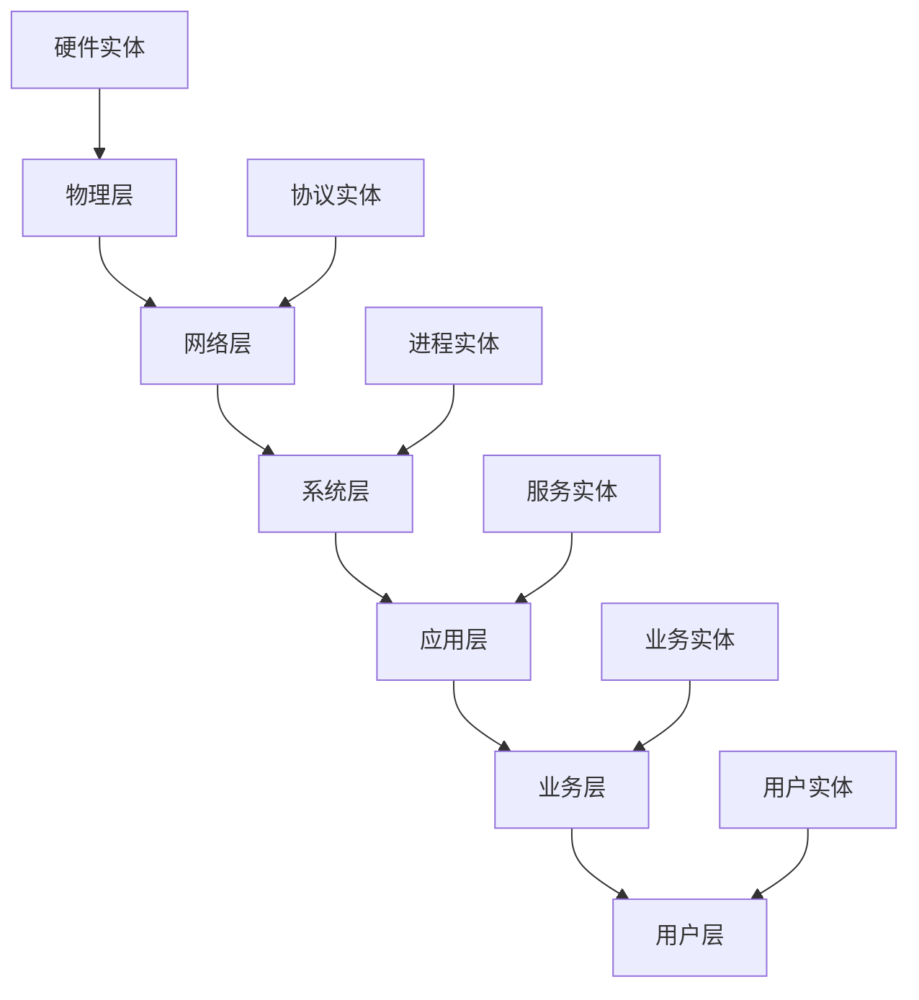

# 本体论与存在论：形式化架构理论基础

## 目录

1. [引言：本体论在软件架构中的基础地位](#1-引言本体论在软件架构中的基础地位)
2. [数学本体论：形式化存在的基础](#2-数学本体论形式化存在的基础)
3. [信息本体论：数字世界的存在结构](#3-信息本体论数字世界的存在结构)
4. [系统本体论：软件系统的存在层次](#4-系统本体论软件系统的存在层次)
5. [AI本体论：智能系统的存在性质](#5-ai本体论智能系统的存在性质)
6. [形式化框架：统一本体论模型](#6-形式化框架统一本体论模型)
7. [实践应用：架构设计中的本体论指导](#7-实践应用架构设计中的本体论指导)

## 1. 引言：本体论在软件架构中的基础地位

### 1.1 本体论的核心问题

本体论（Ontology）研究"存在"的本质和结构，在软件架构中具有基础性地位。我们关注以下核心问题：

**定义 1.1.1** (本体论问题) 本体论问题是一个三元组 $O = (E, R, S)$，其中：

- $E$ 是存在实体集
- $R$ 是实体间关系集  
- $S$ 是存在结构集

**定理 1.1.1** (本体论基础性) 任何软件系统都必须建立在某种本体论假设之上。

**证明** 通过构造性论证：

1. 软件系统必须定义其处理的对象
2. 对象的存在性假设构成本体论基础
3. 因此软件系统依赖于本体论假设

### 1.2 软件架构中的本体论层次

```latex
\begin{align}
\text{软件本体论} &= \text{数学本体论} \oplus \text{信息本体论} \oplus \text{系统本体论} \\
\text{数学本体论} &= \text{形式对象} \oplus \text{抽象结构} \oplus \text{逻辑关系} \\
\text{信息本体论} &= \text{数据实体} \oplus \text{信息流} \oplus \text{知识结构} \\
\text{系统本体论} &= \text{组件实体} \oplus \text{交互关系} \oplus \text{架构模式}
\end{align}
```

## 2. 数学本体论：形式化存在的基础

### 2.1 数学对象的存在性

**定义 2.1.1** (数学对象) 数学对象是一个四元组 $M = (D, P, O, R)$，其中：

- $D$ 是定义域
- $P$ 是性质集
- $O$ 是操作集
- $R$ 是关系集

**定义 2.1.2** (柏拉图主义) 数学对象客观存在于理念世界，独立于人类认知。

**定义 2.1.3** (形式主义) 数学是符号形式系统的操作，不存在独立的对象。

**定义 2.1.4** (直觉主义) 数学是人类心智的构造，存在性需要构造性证明。

### 2.2 形式化数学本体论

```rust
// 数学对象的形式化表示
trait MathematicalObject {
    type Domain;
    type Property;
    type Operation;
    type Relation;
    
    fn domain(&self) -> &Self::Domain;
    fn properties(&self) -> &[Self::Property];
    fn operations(&self) -> &[Self::Operation];
    fn relations(&self) -> &[Self::Relation];
}

// 柏拉图主义实现
struct PlatonistObject<T> {
    domain: T,
    properties: Vec<Property>,
    operations: Vec<Operation>,
    relations: Vec<Relation>,
    existence: ExistenceType::Objective
}

// 形式主义实现
struct FormalistObject<T> {
    symbols: Vec<Symbol>,
    rules: Vec<Rule>,
    derivations: Vec<Derivation>,
    existence: ExistenceType::Symbolic
}

// 直觉主义实现
struct IntuitionistObject<T> {
    construction: Construction,
    evidence: Evidence,
    existence: ExistenceType::Constructive
}
```

### 2.3 数学本体论的软件应用

**定理 2.3.1** (类型系统的本体论基础) 编程语言的类型系统反映了数学本体论假设。

**证明** 通过类型理论分析：

1. 静态类型对应柏拉图主义对象
2. 动态类型对应形式主义操作
3. 依赖类型对应直觉主义构造

## 3. 信息本体论：数字世界的存在结构

### 3.1 信息作为基础实在

**定义 3.1.1** (信息实体) 信息实体是一个五元组 $I = (C, S, M, P, T)$，其中：

- $C$ 是内容
- $S$ 是结构
- $M$ 是意义
- $P$ 是处理方式
- $T$ 是时间维度

**定义 3.1.2** (计算宇宙假说) 宇宙本质上是计算过程，信息是基本存在形式。

**定理 3.1.1** (信息本体论的基本性) 在数字世界中，信息比物质更基本。

**证明** 通过信息论分析：

1. 所有数字对象都可以表示为信息
2. 信息可以独立于物理载体存在
3. 因此信息在数字世界中更基本

### 3.2 信息流本体论

```latex
\begin{align}
\text{信息流} &= \text{源} \rightarrow \text{通道} \rightarrow \text{目标} \\
\text{信息处理} &= \text{输入} \oplus \text{计算} \oplus \text{输出} \\
\text{信息存储} &= \text{编码} \oplus \text{存储} \oplus \text{检索}
\end{align}
```

```go
// 信息实体的Go实现
type InformationEntity struct {
    Content     interface{}
    Structure   DataStructure
    Meaning     SemanticContent
    Processing  ProcessingMethod
    Timestamp   time.Time
}

type InformationFlow struct {
    Source      InformationEntity
    Channel     CommunicationChannel
    Target      InformationEntity
    Protocol    CommunicationProtocol
}

func (flow *InformationFlow) Process() error {
    // 信息处理逻辑
    return flow.Channel.Transmit(flow.Source, flow.Target)
}
```

## 4. 系统本体论：软件系统的存在层次

### 4.1 软件系统的存在结构

**定义 4.1.1** (软件系统) 软件系统是一个六元组 $S = (C, I, P, D, A, E)$，其中：

- $C$ 是组件集
- $I$ 是接口集
- $P$ 是协议集
- $D$ 是数据流
- $A$ 是架构模式
- $E$ 是环境约束

**定义 4.1.2** (组件本体论) 组件是软件系统的基本存在单元。

**定义 4.1.3** (接口本体论) 接口定义了组件间的存在关系。

### 4.2 分层存在结构



### 4.3 微服务架构的本体论

```rust
// 微服务本体论
pub trait MicroserviceOntology {
    type Service;
    type Interface;
    type Data;
    type Protocol;
    
    fn service_identity(&self) -> ServiceId;
    fn service_boundary(&self) -> Boundary;
    fn service_contract(&self) -> Contract;
    fn service_lifecycle(&self) -> Lifecycle;
}

pub struct MicroserviceSystem {
    services: Vec<Box<dyn MicroserviceOntology>>,
    communication: CommunicationFabric,
    governance: GovernanceFramework,
}

impl MicroserviceSystem {
    pub fn service_discovery(&self) -> ServiceRegistry {
        // 服务发现逻辑
    }
    
    pub fn load_balancing(&self) -> LoadBalancer {
        // 负载均衡逻辑
    }
}
```

## 5. AI本体论：智能系统的存在性质

### 5.1 智能系统的存在性

**定义 5.1.1** (智能实体) 智能实体是一个七元组 $AI = (K, R, L, M, A, C, E)$，其中：

- $K$ 是知识库
- $R$ 是推理机制
- $L$ 是学习能力
- $M$ 是记忆系统
- $A$ 是适应能力
- $C$ 是意识状态
- $E$ 是伦理框架

**定义 5.1.2** (强AI) 具有真正智能和意识的AI系统。

**定义 5.1.3** (弱AI) 模拟智能行为但不具有真正意识的AI系统。

### 5.2 意识的本体论问题

**问题 5.2.1** (意识问题) AI系统是否可能具有真正的意识？

**论证 5.2.1** (功能主义论证) 如果AI系统能够产生与人类相同的功能行为，那么它可能具有意识。

**反论证 5.2.1** (中文房间论证) 即使AI系统能够产生智能行为，也不意味着它具有真正的理解。

### 5.3 AI系统的形式化本体论

```latex
\begin{align}
\text{AI本体论} &= \text{认知本体论} \oplus \text{行为本体论} \oplus \text{伦理本体论} \\
\text{认知本体论} &= \text{知识表示} \oplus \text{推理机制} \oplus \text{学习过程} \\
\text{行为本体论} &= \text{决策过程} \oplus \text{行动执行} \oplus \text{结果评估} \\
\text{伦理本体论} &= \text{价值系统} \oplus \text{道德判断} \oplus \text{责任归属}
\end{align}
```

## 6. 形式化框架：统一本体论模型

### 6.1 统一本体论公理系统

**公理 6.1.1** (存在公理) 存在至少一个实体。

**公理 6.1.2** (关系公理) 任何两个实体之间都存在某种关系。

**公理 6.1.3** (层次公理) 实体可以组织成层次结构。

**公理 6.1.4** (时间公理) 实体在时间维度上具有持续性。

### 6.2 本体论推理规则

```latex
\begin{align}
\text{存在推理} &: \frac{\phi(x)}{\exists x \phi(x)} \\
\text{关系推理} &: \frac{R(a,b) \land R(b,c)}{R(a,c)} \\
\text{层次推理} &: \frac{P(a) \land a \in b}{P(b)} \\
\text{时间推理} &: \frac{\phi(t_1) \land t_1 < t_2}{\phi(t_2)}
\end{align}
```

### 6.3 本体论验证框架

```rust
// 本体论验证框架
pub trait OntologyValidator {
    type Entity;
    type Relation;
    type Axiom;
    
    fn validate_existence(&self, entity: &Self::Entity) -> bool;
    fn validate_relation(&self, relation: &Self::Relation) -> bool;
    fn validate_axiom(&self, axiom: &Self::Axiom) -> bool;
    fn validate_consistency(&self) -> bool;
}

pub struct UnifiedOntology {
    entities: Vec<Entity>,
    relations: Vec<Relation>,
    axioms: Vec<Axiom>,
    validator: Box<dyn OntologyValidator>,
}

impl UnifiedOntology {
    pub fn is_consistent(&self) -> bool {
        self.validator.validate_consistency()
    }
    
    pub fn add_entity(&mut self, entity: Entity) -> Result<(), OntologyError> {
        if self.validator.validate_existence(&entity) {
            self.entities.push(entity);
            Ok(())
        } else {
            Err(OntologyError::InvalidEntity)
        }
    }
}
```

## 7. 实践应用：架构设计中的本体论指导

### 7.1 架构设计原则

**原则 7.1.1** (实体清晰性) 每个架构组件都应该有清晰的存在边界。

**原则 7.1.2** (关系明确性) 组件间的关系应该明确定义和验证。

**原则 7.1.3** (层次一致性) 架构层次应该保持逻辑一致性。

**原则 7.1.4** (时间持续性) 架构应该支持系统的持续演化。

### 7.2 本体论驱动的设计方法

```go
// 本体论驱动的架构设计
type OntologyDrivenDesign struct {
    ontology    UnifiedOntology
    principles  []DesignPrinciple
    patterns    []ArchitecturePattern
    constraints []DesignConstraint
}

func (odd *OntologyDrivenDesign) DesignSystem(requirements []Requirement) *Architecture {
    // 1. 建立本体论模型
    ontology := odd.buildOntology(requirements)
    
    // 2. 应用设计原则
    design := odd.applyPrinciples(ontology)
    
    // 3. 选择架构模式
    architecture := odd.selectPatterns(design)
    
    // 4. 验证一致性
    if odd.validateConsistency(architecture) {
        return architecture
    }
    
    return nil
}

func (odd *OntologyDrivenDesign) buildOntology(requirements []Requirement) UnifiedOntology {
    // 构建本体论模型的具体实现
    return UnifiedOntology{}
}
```

### 7.3 本体论质量评估

**指标 7.3.1** (本体论完整性) 架构是否覆盖了所有必要的实体和关系。

**指标 7.3.2** (本体论一致性) 架构中的实体和关系是否逻辑一致。

**指标 7.3.3** (本体论可扩展性) 架构是否支持新实体和关系的添加。

**指标 7.3.4** (本体论可维护性) 架构是否便于理解和维护。

---

**相关链接**：

- [认识论与知识论](../02-认识论与知识论.md)
- [逻辑学与推理](../03-逻辑学与推理.md)
- [数学理论体系](../../02-数学理论体系/01-集合论与基础数学.md)
- [形式化理论基础](../../03-形式化理论基础/01-形式语言理论.md)

**版本信息**：v1.0  
**创建时间**：2024年12月  
**最后更新**：2024年12月  
**维护者**：AI Assistant
