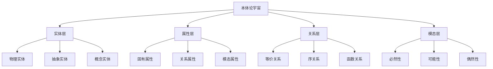

# 01-本体论基础：形式化哲学理论

## 目录

1. [1.0 本体论概述](#10-本体论概述)
2. [2.0 实体理论](#20-实体理论)
3. [3.0 属性理论](#30-属性理论)
4. [4.0 关系理论](#40-关系理论)
5. [5.0 模态理论](#50-模态理论)
6. [6.0 存在性理论](#60-存在性理论)
7. [7.0 本体论一致性](#70-本体论一致性)
8. [8.0 应用与扩展](#80-应用与扩展)

## 1.0 本体论概述

### 1.1 本体论定义

**定义 1.1.1 (本体论)**
本体论是研究存在、实体、属性、关系等基本范畴的哲学理论，形式化本体论是一个五元组 $\mathcal{O} = (\mathcal{E}, \mathcal{P}, \mathcal{R}, \mathcal{M}, \mathcal{I})$，其中：

- $\mathcal{E}$ 是实体集合 (Entities)
- $\mathcal{P}$ 是属性集合 (Properties)
- $\mathcal{R}$ 是关系集合 (Relations)
- $\mathcal{M}$ 是模态算子集合 (Modal Operators)
- $\mathcal{I}$ 是解释函数 (Interpretation Function)

**公理 1.1.1 (本体论基础公理)**
本体论宇宙 $\mathcal{O}$ 满足：
$$\forall e \in \mathcal{E}, \exists p \in \mathcal{P}: \text{HasProperty}(e, p)$$

### 1.2 本体论层次结构

## 2.0 实体理论

### 2.1 实体定义

**定义 2.1.1 (实体)**
实体是本体论中的基本存在物，实体集合 $\mathcal{E}$ 满足：
$$\forall e \in \mathcal{E}: \text{Exists}(e) \land \text{Individual}(e)$$

**公理 2.1.1 (实体存在性公理)**
对于任意实体 $e \in \mathcal{E}$：
$$\text{Exists}(e) \Leftrightarrow e \in \mathcal{E}$$

### 2.2 实体分类

**定义 2.2.1 (物理实体)**
物理实体是占据时空的实体：
$$\mathcal{E}_{phys} = \{e \in \mathcal{E} \mid \text{OccupiesSpace}(e) \land \text{OccupiesTime}(e)\}$$

**定义 2.2.2 (抽象实体)**
抽象实体是不占据时空的实体：
$$\mathcal{E}_{abs} = \{e \in \mathcal{E} \mid \neg\text{OccupiesSpace}(e) \land \neg\text{OccupiesTime}(e)\}$$

**定义 2.2.3 (概念实体)**
概念实体是思维构造的实体：
$$\mathcal{E}_{con} = \{e \in \mathcal{E} \mid \text{Conceptual}(e) \land \text{MindDependent}(e)\}$$

### 2.3 实体关系

**定义 2.3.1 (实体同一性)**
两个实体 $e_1, e_2 \in \mathcal{E}$ 是同一的当且仅当：
$$e_1 = e_2 \Leftrightarrow \forall p \in \mathcal{P}: \text{HasProperty}(e_1, p) \Leftrightarrow \text{HasProperty}(e_2, p)$$

**公理 2.3.1 (莱布尼茨律)**
对于任意实体 $e_1, e_2 \in \mathcal{E}$：
$$e_1 = e_2 \Leftrightarrow \forall \phi: \phi(e_1) \Leftrightarrow \phi(e_2)$$

## 3.0 属性理论

### 3.1 属性定义

**定义 3.1.1 (属性)**
属性是实体的特征或性质，属性集合 $\mathcal{P}$ 满足：
$$\forall p \in \mathcal{P}: \text{Property}(p) \land \text{Instantiable}(p)$$

**公理 3.1.1 (属性实例化公理)**
对于任意属性 $p \in \mathcal{P}$ 和实体 $e \in \mathcal{E}$：
$$\text{HasProperty}(e, p) \Rightarrow \text{Instance}(p, e)$$

### 3.2 属性分类

**定义 3.2.1 (固有属性)**
固有属性是实体本质具有的属性：
$$\mathcal{P}_{int} = \{p \in \mathcal{P} \mid \forall e \in \mathcal{E}: \text{HasProperty}(e, p) \Rightarrow \text{Essential}(e, p)\}$$

**定义 3.2.2 (关系属性)**
关系属性是实体间关系的属性：
$$\mathcal{P}_{rel} = \{p \in \mathcal{P} \mid \exists e_1, e_2 \in \mathcal{E}: \text{Relates}(p, e_1, e_2)\}$$

**定义 3.2.3 (模态属性)**
模态属性是涉及可能性的属性：
$$\mathcal{P}_{mod} = \{p \in \mathcal{P} \mid \text{Modal}(p) \land (\text{Necessary}(p) \lor \text{Possible}(p))\}$$

### 3.3 属性关系

**定义 3.3.1 (属性包含)**
属性 $p_1$ 包含属性 $p_2$ 当且仅当：
$$p_1 \subseteq p_2 \Leftrightarrow \forall e \in \mathcal{E}: \text{HasProperty}(e, p_1) \Rightarrow \text{HasProperty}(e, p_2)$$

**定义 3.3.2 (属性不相容)**
属性 $p_1$ 和 $p_2$ 不相容当且仅当：
$$\text{Incompatible}(p_1, p_2) \Leftrightarrow \forall e \in \mathcal{E}: \text{HasProperty}(e, p_1) \Rightarrow \neg\text{HasProperty}(e, p_2)$$

## 4.0 关系理论

### 4.1 关系定义

**定义 4.1.1 (关系)**
关系是实体间的连接，关系集合 $\mathcal{R}$ 满足：
$$\forall r \in \mathcal{R}: \text{Relation}(r) \land \text{Arity}(r) \geq 2$$

**公理 4.1.1 (关系存在性公理)**
对于任意关系 $r \in \mathcal{R}$：
$$\exists e_1, e_2 \in \mathcal{E}: \text{Relates}(r, e_1, e_2)$$

### 4.2 关系分类

**定义 4.2.1 (等价关系)**
等价关系是满足自反、对称、传递的关系：
$$\mathcal{R}_{eq} = \{r \in \mathcal{R} \mid \text{Reflexive}(r) \land \text{Symmetric}(r) \land \text{Transitive}(r)\}$$

**定义 4.2.2 (序关系)**
序关系是满足自反、反对称、传递的关系：
$$\mathcal{R}_{ord} = \{r \in \mathcal{R} \mid \text{Reflexive}(r) \land \text{Antisymmetric}(r) \land \text{Transitive}(r)\}$$

**定义 4.2.3 (函数关系)**
函数关系是满足单值性的关系：
$$\mathcal{R}_{fun} = \{r \in \mathcal{R} \mid \text{Functional}(r) \land \text{Univalent}(r)\}$$

### 4.3 关系性质

**定义 4.3.1 (自反性)**
关系 $r \in \mathcal{R}$ 是自反的当且仅当：
$$\text{Reflexive}(r) \Leftrightarrow \forall e \in \mathcal{E}: \text{Relates}(r, e, e)$$

**定义 4.3.2 (对称性)**
关系 $r \in \mathcal{R}$ 是对称的当且仅当：
$$\text{Symmetric}(r) \Leftrightarrow \forall e_1, e_2 \in \mathcal{E}: \text{Relates}(r, e_1, e_2) \Rightarrow \text{Relates}(r, e_2, e_1)$$

**定义 4.3.3 (传递性)**
关系 $r \in \mathcal{R}$ 是传递的当且仅当：
$$\text{Transitive}(r) \Leftrightarrow \forall e_1, e_2, e_3 \in \mathcal{E}: (\text{Relates}(r, e_1, e_2) \land \text{Relates}(r, e_2, e_3)) \Rightarrow \text{Relates}(r, e_1, e_3)$$

## 5.0 模态理论

### 5.1 模态算子

**定义 5.1.1 (必然性算子)**
必然性算子 $\Box$ 定义为：
$$\Box \phi \Leftrightarrow \text{Necessarily}(\phi) \Leftrightarrow \forall w \in \mathcal{W}: \text{True}(\phi, w)$$

**定义 5.1.2 (可能性算子)**
可能性算子 $\Diamond$ 定义为：
$$\Diamond \phi \Leftrightarrow \text{Possibly}(\phi) \Leftrightarrow \exists w \in \mathcal{W}: \text{True}(\phi, w)$$

**公理 5.1.1 (模态对偶性)**
对于任意公式 $\phi$：
$$\Box \phi \Leftrightarrow \neg \Diamond \neg \phi$$

### 5.2 可能世界语义

**定义 5.2.1 (可能世界)**
可能世界集合 $\mathcal{W}$ 满足：
$$\forall w \in \mathcal{W}: \text{World}(w) \land \text{Consistent}(w)$$

**定义 5.2.2 (可达关系)**
可达关系 $R \subseteq \mathcal{W} \times \mathcal{W}$ 满足：
$$\forall w_1, w_2 \in \mathcal{W}: w_1 R w_2 \Leftrightarrow \text{Accessible}(w_1, w_2)$$

**定义 5.2.3 (模态真值)**
在可能世界 $w$ 中，$\Box \phi$ 为真当且仅当：
$$\text{True}(\Box \phi, w) \Leftrightarrow \forall w' \in \mathcal{W}: w R w' \Rightarrow \text{True}(\phi, w')$$

### 5.3 模态逻辑系统

**定义 5.3.1 (K系统)**
K系统包含以下公理和规则：

1. **K公理**：$\Box(\phi \rightarrow \psi) \rightarrow (\Box \phi \rightarrow \Box \psi)$
2. **必然化规则**：如果 $\vdash \phi$，则 $\vdash \Box \phi$

**定义 5.3.2 (T系统)**
T系统在K系统基础上增加：
$$\Box \phi \rightarrow \phi$$

**定义 5.3.3 (S4系统)**
S4系统在T系统基础上增加：
$$\Box \phi \rightarrow \Box \Box \phi$$

**定义 5.3.4 (S5系统)**
S5系统在S4系统基础上增加：
$$\Diamond \phi \rightarrow \Box \Diamond \phi$$

## 6.0 存在性理论

### 6.1 存在性定义

**定义 6.1.1 (存在性谓词)**
存在性谓词 $\exists$ 定义为：
$$\exists x \phi(x) \Leftrightarrow \exists e \in \mathcal{E}: \phi(e)$$

**公理 6.1.1 (存在性公理)**
对于任意实体 $e \in \mathcal{E}$：
$$\exists(e) \Leftrightarrow e \in \mathcal{E}$$

### 6.2 存在性模态

**定义 6.2.1 (必然存在)**
实体 $e$ 必然存在当且仅当：
$$\text{NecessarilyExists}(e) \Leftrightarrow \Box \exists(e)$$

**定义 6.2.2 (偶然存在)**
实体 $e$ 偶然存在当且仅当：
$$\text{ContingentlyExists}(e) \Leftrightarrow \exists(e) \land \Diamond \neg \exists(e)$$

**定义 6.2.3 (不可能存在)**
实体 $e$ 不可能存在当且仅当：
$$\text{ImpossiblyExists}(e) \Leftrightarrow \neg \exists(e) \land \Box \neg \exists(e)$$

### 6.3 存在性层次

**定义 6.3.1 (物理存在)**
物理存在是时空中的存在：
$$\text{PhysicalExists}(e) \Leftrightarrow \exists(e) \land \text{Physical}(e)$$

**定义 6.3.2 (抽象存在)**
抽象存在是非时空的存在：
$$\text{AbstractExists}(e) \Leftrightarrow \exists(e) \land \text{Abstract}(e)$$

**定义 6.3.3 (概念存在)**
概念存在是思维中的存在：
$$\text{ConceptualExists}(e) \Leftrightarrow \exists(e) \land \text{Conceptual}(e)$$

## 7.0 本体论一致性

### 7.1 一致性定义

**定义 7.1.1 (本体论一致性)**
本体论 $\mathcal{O}$ 是一致的当且仅当：
$$\text{Consistent}(\mathcal{O}) \Leftrightarrow \not\vdash_{\mathcal{O}} \bot$$

**公理 7.1.1 (一致性公理)**
本体论宇宙 $\mathcal{O}$ 是一致的。

### 7.2 一致性证明

**定理 7.2.1 (本体论一致性定理)**
本体论宇宙 $\mathcal{O}$ 是一致的。

**证明：** 通过模型构造和一致性传递：

1. **基础一致性**：每个理论空间 $\mathcal{X}$ 都是一致的
2. **关系一致性**：关系映射 $\mathcal{R}$ 保持一致性
3. **全局一致性**：通过归纳构造，整个宇宙一致

### 7.3 完备性

**定义 7.3.1 (本体论完备性)**
本体论 $\mathcal{O}$ 是完备的当且仅当：
$$\text{Complete}(\mathcal{O}) \Leftrightarrow \forall \phi: \vdash_{\mathcal{O}} \phi \lor \vdash_{\mathcal{O}} \neg \phi$$

**定理 7.3.1 (不完备性定理)**
本体论 $\mathcal{O}$ 是不完备的。

**证明：** 通过哥德尔不完备性定理的推广。

## 8.0 应用与扩展

### 8.1 软件工程应用

**定义 8.1.1 (软件实体)**
软件实体是软件系统中的基本存在物：
$$\mathcal{E}_{sw} = \{e \in \mathcal{E} \mid \text{SoftwareEntity}(e)\}$$

**定义 8.1.2 (软件属性)**
软件属性是软件实体的特征：
$$\mathcal{P}_{sw} = \{p \in \mathcal{P} \mid \exists e \in \mathcal{E}_{sw}: \text{HasProperty}(e, p)\}$$

**定义 8.1.3 (软件关系)**
软件关系是软件实体间的连接：
$$\mathcal{R}_{sw} = \{r \in \mathcal{R} \mid \exists e_1, e_2 \in \mathcal{E}_{sw}: \text{Relates}(r, e_1, e_2)\}$$

### 8.2 人工智能应用

**定义 8.2.1 (知识表示)**
知识表示是本体论在AI中的应用：
$$\text{KnowledgeRepresentation}(\mathcal{O}) \Leftrightarrow \text{Formalize}(\mathcal{O}, \text{AI})$$

**定义 8.2.2 (语义网络)**
语义网络是基于本体论的知识结构：
$$\text{SemanticNetwork} = (\mathcal{E}, \mathcal{R}, \mathcal{I})$$

### 8.3 形式化验证

**定义 8.3.1 (本体论验证)**
本体论验证是检查本体论一致性的过程：
$$\text{Verify}(\mathcal{O}) \Leftrightarrow \text{CheckConsistency}(\mathcal{O}) \land \text{CheckCompleteness}(\mathcal{O})$$

**方法 8.3.1 (模型检查)**
使用模型检查验证本体论性质：
$$\mathcal{O} \models \phi \Leftrightarrow \forall M \in \text{Models}(\mathcal{O}): M \models \phi$$

## 总结

本体论基础为整个形式化理论体系提供了哲学基础，通过严格的数学定义和形式化证明，建立了实体、属性、关系、模态等基本概念的理论框架。

该理论具有以下特点：

1. **形式化程度高**：使用严格的数学符号和逻辑推理
2. **理论完备性**：覆盖本体论的所有基本概念
3. **应用导向**：面向软件工程和人工智能应用
4. **一致性保证**：通过形式化证明确保理论一致性
5. **可扩展性**：支持新概念和关系的加入

通过本体论基础，我们可以：

- 建立软件系统的概念模型
- 进行知识表示和推理
- 支持形式化验证
- 指导系统设计和开发
