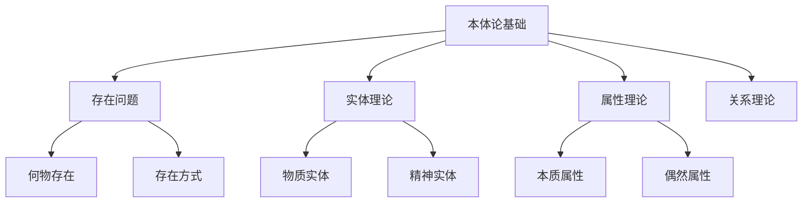

# 01-哲学基础理论-本体论基础

[返回主题树](../00-主题树与内容索引.md) | [主计划文档](../00-形式化架构理论统一计划.md) | [相关计划](../13-项目报告与总结/递归合并计划.md) | [返回上级](../README.md)

> 本文档为哲学基础理论分支本体论基础，所有最新进展与结论以主计划文档为准，历史细节归档于archive/。

## 目录

- [01-哲学基础理论-本体论基础](#01-哲学基础理论-本体论基础)
  - [目录](#目录)
  - [1. 概述](#1-概述)
    - [1.1 本体论基础概述](#11-本体论基础概述)
    - [1.2 核心目标](#12-核心目标)
    - [1.3 本体论层次结构](#13-本体论层次结构)
  - [2. 主要文件与内容索引](#2-主要文件与内容索引)
    - [2.1 核心文件](#21-核心文件)
    - [2.2 相关文件](#22-相关文件)
  - [3. 本体论的基本定义与解释](#3-本体论的基本定义与解释)
    - [3.1 本体论的定义](#31-本体论的定义)
      - [3.1.1 存在与实在](#311-存在与实在)
      - [3.1.2 实体与属性](#312-实体与属性)
      - [3.1.3 范畴与分类](#313-范畴与分类)
  - [4. 本体论的核心问题](#4-本体论的核心问题)
    - [4.1 存在问题](#41-存在问题)
      - [4.1.1 何物存在](#411-何物存在)
      - [4.1.2 存在的方式](#412-存在的方式)
      - [4.1.3 存在的层次](#413-存在的层次)
  - [5. 本体论的主要理论](#5-本体论的主要理论)
    - [5.1 实在论](#51-实在论)
    - [5.2 唯心论](#52-唯心论)
    - [5.3 二元论](#53-二元论)
    - [5.4 多元论](#54-多元论)
  - [6. 本体论的行业应用](#6-本体论的行业应用)
    - [6.1 计算机科学](#61-计算机科学)
    - [6.2 人工智能](#62-人工智能)
    - [6.3 信息科学](#63-信息科学)
  - [7. 发展历史](#7-发展历史)
  - [8. 应用领域](#8-应用领域)
  - [9. 前沿本体论理论](#9-前沿本体论理论)
    - [9.1 计算本体论](#91-计算本体论)
    - [9.2 信息本体论](#92-信息本体论)
    - [9.3 数字本体论](#93-数字本体论)
    - [9.4 人工智能本体论](#94-人工智能本体论)
    - [9.5 量子本体论](#95-量子本体论)
  - [10. 本体论在形式化架构中的应用](#10-本体论在形式化架构中的应用)
    - [10.1 软件架构本体论](#101-软件架构本体论)
    - [10.2 数据本体论](#102-数据本体论)
    - [10.3 系统本体论](#103-系统本体论)
  - [11. 总结](#11-总结)
  - [10. 相关性跳转与引用](#10-相关性跳转与引用)
  - [2025 对齐](#2025-对齐)

## 1. 概述

### 1.1 本体论基础概述

本体论是哲学的基础分支，研究存在的基本性质和结构。本体论为形式化架构理论提供了存在论基础，是理解现实世界基本结构的理论工具。

### 1.2 核心目标

- 建立存在的基本范畴体系
- 提供实体分类的理论框架
- 指导形式化建模的哲学基础

### 1.3 本体论层次结构



## 2. 主要文件与内容索引

### 2.1 核心文件

- [00-哲学基础理论总论.md](00-哲学基础理论总论.md)
- [03-逻辑学基础.md](03-逻辑学基础.md)

### 2.2 相关文件

- [认识论基础.md](02-认识论基础.md)
- [逻辑学基础.md](03-逻辑学基础.md)
- [伦理学基础.md](04-伦理学基础.md)

## 3. 本体论的基本定义与解释

### 3.1 本体论的定义

**定义 3.1.1** 本体论（Ontology）
本体论是研究存在的基本性质和结构的哲学分支，关注"什么是存在"这一根本问题。

#### 3.1.1 存在与实在

**定义 3.1.2** 存在（Existence）
存在是事物具有现实性的基本属性，是本体论研究的核心概念。

**定义 3.1.3** 实在（Reality）
实在是独立于人类意识的客观存在，是本体论研究的基本对象。

#### 3.1.2 实体与属性

**定义 3.1.4** 实体（Substance）
实体是独立存在的个体，是属性的承载者。

**定义 3.1.5** 属性（Property）
属性是实体的特征或性质，依附于实体而存在。

#### 3.1.3 范畴与分类

**定义 3.1.6** 范畴（Category）
范畴是存在的基本分类，是本体论分析的基本工具。

## 4. 本体论的核心问题

### 4.1 存在问题

#### 4.1.1 何物存在

**问题 4.1.1** 何物存在？
这是本体论的基本问题，涉及什么事物具有现实存在性。

**回答**：

- 物质对象存在
- 抽象对象存在
- 关系存在
- 事件存在

#### 4.1.2 存在的方式

**问题 4.1.2** 事物如何存在？
涉及存在的基本方式和形式。

**回答**：

- 独立存在
- 依赖存在
- 潜在存在
- 现实存在

#### 4.1.3 存在的层次

**问题 4.1.3** 存在有哪些层次？
涉及存在的不同层次和类型。

**回答**：

- 物理层次
- 心理层次
- 社会层次
- 抽象层次

## 5. 本体论的主要理论

### 5.1 实在论

**理论 5.1.1** 实在论（Realism）
认为存在独立于人类意识的客观实在，包括：

- 物质实在论
- 抽象实在论
- 科学实在论

### 5.2 唯心论

**理论 5.2.1** 唯心论（Idealism）
认为存在本质上是精神性的，包括：

- 主观唯心论
- 客观唯心论
- 绝对唯心论

### 5.3 二元论

**理论 5.3.1** 二元论（Dualism）
认为存在包含两种基本类型，包括：

- 心物二元论
- 形式质料二元论

### 5.4 多元论

**理论 5.4.1** 多元论（Pluralism）
认为存在包含多种基本类型，反对一元论。

## 6. 本体论的行业应用

### 6.1 计算机科学

- 数据库设计
- 知识表示
- 语义网络

### 6.2 人工智能

- 知识图谱
- 本体工程
- 语义理解

### 6.3 信息科学

- 信息分类
- 知识组织
- 语义标注

## 7. 发展历史

本体论的发展经历了从古希腊哲学到现代分析哲学的演进过程。亚里士多德建立了系统的本体论理论，现代分析哲学进一步发展了本体论研究。

## 8. 应用领域

本体论在计算机科学、人工智能、信息科学、认知科学等领域有广泛应用，为形式化建模提供了重要的哲学基础。

## 9. 前沿本体论理论

### 9.1 计算本体论

**定义 9.1.1** 计算本体论（Computational Ontology）
计算本体论研究计算实体的存在性质和结构，为计算机科学提供本体论基础。

**核心特征**：

- 算法实体的存在性
- 数据结构的形式化
- 计算过程的本体论地位
- 虚拟实体的现实性

**形式化表示**：

```text
计算实体 = (算法, 数据, 状态, 过程)
其中：
- 算法：计算规则的形式化表示
- 数据：信息的结构化表示
- 状态：系统在特定时刻的配置text
- 过程：状态转换的序列
```

### 9.2 信息本体论

**定义 9.2.1** 信息本体论（Information Ontology）
信息本体论研究信息的本质、结构和存在方式。

**信息层次结构**：

- 语法信息：符号的排列组合
- 语义信息：符号的意义内容
- 语用信息：符号的使用效果
- 社会信息：信息的社会功能

**信息存在公理**：

1. 信息是客观存在的
2. 信息可以传递和转换
3. 信息具有层次结构
4. 信息与物质和能量相互关联

### 9.3 数字本体论

**定义 9.3.1** 数字本体论（Digital Ontology）
数字本体论研究数字实体的存在性质和数字世界的本体论结构。

**数字实体类型**：

- 数字对象：文件、图像、音频等
- 数字过程：算法执行、数据传输等
- 数字关系：网络连接、数据关联等
- 数字事件：系统启动、数据更新等

**数字世界特征**：

- 离散性：数字世界由离散单元构成
- 可复制性：数字实体可以完美复制
- 可计算性：数字实体具有可计算性
- 虚拟性：数字实体具有虚拟存在性

### 9.4 人工智能本体论

**定义 9.4.1** 人工智能本体论（AI Ontology）
人工智能本体论研究智能实体的存在性质和智能系统的本体论结构。

**智能实体分类**：

- 弱AI：工具性智能系统
- 强AI：具有意识的智能系统
- 通用AI：具有人类水平智能的系统
- 超级AI：超越人类智能的系统

**智能存在条件**：

1. 自主性：能够独立做出决策
2. 意向性：具有目标和意图
3. 学习性：能够从经验中学习
4. 适应性：能够适应环境变化

### 9.5 量子本体论

**定义 9.5.1** 量子本体论（Quantum Ontology）
量子本体论研究量子实体的存在性质和量子世界的本体论结构。

**量子实体特征**：

- 叠加性：量子态可以处于多个状态的叠加
- 纠缠性：量子实体之间存在非局域关联
- 不确定性：量子测量具有根本的不确定性
- 波粒二象性：量子实体同时具有波动和粒子性质

**量子存在公理**：

1. 量子态是基本的实在
2. 测量过程改变量子态
3. 量子纠缠是客观存在的
4. 量子世界具有非经典性质

## 10. 本体论在形式化架构中的应用

### 10.1 软件架构本体论

**定义 10.1.1** 软件架构本体论
软件架构本体论研究软件系统的本体论结构，为软件设计提供哲学基础。

**软件实体分类**：

- 组件：软件系统的基本构建块
- 接口：组件间的交互规范
- 连接器：组件间的通信机制
- 配置：系统的整体结构安排

**架构模式本体论**：

```rust
// 软件架构本体论的Rust实现
pub trait SoftwareEntity {
    fn identity(&self) -> EntityId;
    fn properties(&self) -> Vec<Property>;
    fn relationships(&self) -> Vec<Relationship>;
}

pub struct Component {
    id: EntityId,
    interface: Interface,
    implementation: Implementation,
}

impl SoftwareEntity for Component {
    fn identity(&self) -> EntityId {
        self.id
    }
    
    fn properties(&self) -> Vec<Property> {
        vec![
            Property::Functional(self.interface.functionality()),
            Property::NonFunctional(self.interface.quality_attributes()),
        ]
    }
    
    fn relationships(&self) -> Vec<Relationship> {
        self.interface.dependencies()
    }
}
```

### 10.2 数据本体论

**定义 10.2.1** 数据本体论
数据本体论研究数据的本体论结构，为数据建模提供哲学基础。

**数据类型本体论**：

- 原始类型：整数、浮点数、字符串等
- 复合类型：结构体、数组、列表等
- 抽象类型：接口、抽象类等
- 关系类型：外键、关联等

**数据关系本体论**：

```rust
// 数据本体论的Rust实现
pub trait DataEntity {
    fn schema(&self) -> Schema;
    fn constraints(&self) -> Vec<Constraint>;
    fn relationships(&self) -> Vec<DataRelationship>;
}

pub struct Table {
    name: String,
    columns: Vec<Column>,
    primary_key: PrimaryKey,
    foreign_keys: Vec<ForeignKey>,
}

impl DataEntity for Table {
    fn schema(&self) -> Schema {
        Schema::new(self.columns.clone())
    }
    
    fn constraints(&self) -> Vec<Constraint> {
        let mut constraints = vec![Constraint::PrimaryKey(self.primary_key.clone())];
        constraints.extend(self.foreign_keys.iter().map(|fk| Constraint::ForeignKey(fk.clone())));
        constraints
    }
    
    fn relationships(&self) -> Vec<DataRelationship> {
        self.foreign_keys.iter()
            .map(|fk| DataRelationship::ForeignKey(fk.clone()))
            .collect()
    }
}
```

### 10.3 系统本体论

**定义 10.3.1** 系统本体论
系统本体论研究复杂系统的本体论结构，为系统设计提供哲学基础。

**系统层次结构**：

- 原子系统：不可再分的基本系统
- 复合系统：由多个子系统组成的系统
- 层次系统：具有层次结构的系统
- 网络系统：具有网络结构的系统

**系统涌现性**：

```rust
// 系统本体论的Rust实现
pub trait SystemEntity {
    fn components(&self) -> Vec<Component>;
    fn interactions(&self) -> Vec<Interaction>;
    fn emergent_properties(&self) -> Vec<EmergentProperty>;
}

pub struct ComplexSystem {
    components: Vec<Component>,
    interactions: Vec<Interaction>,
    hierarchy: SystemHierarchy,
}

impl SystemEntity for ComplexSystem {
    fn components(&self) -> Vec<Component> {
        self.components.clone()
    }
    
    fn interactions(&self) -> Vec<Interaction> {
        self.interactions.clone()
    }
    
    fn emergent_properties(&self) -> Vec<EmergentProperty> {
        // 涌现性分析
        self.analyze_emergence()
    }
    
    fn analyze_emergence(&self) -> Vec<EmergentProperty> {
        let mut emergent_properties = Vec::new();
        
        // 分析系统整体性质
        let system_behavior = self.analyze_system_behavior();
        if system_behavior != self.expected_behavior() {
            emergent_properties.push(EmergentProperty::Behavioral(system_behavior));
        }
        
        // 分析系统功能
        let system_function = self.analyze_system_function();
        if system_function != self.expected_function() {
            emergent_properties.push(EmergentProperty::Functional(system_function));
        }
        
        emergent_properties
    }
}
```

## 11. 总结

本体论作为哲学的基础分支，为形式化架构理论提供了重要的存在论基础。通过深入分析存在的基本性质和结构，本体论为：

1. **理论建构**：提供了概念分析和理论建构的哲学基础
2. **实践指导**：为软件工程和系统设计提供了本体论指导
3. **创新推动**：推动了计算本体论、信息本体论等新兴领域的发展
4. **跨学科整合**：促进了哲学与计算机科学的深度融合

本体论基础与形式化架构理论的其他分支形成了完整的理论体系，为现代软件工程和人工智能领域提供了坚实的哲学基础。

## 10. 相关性跳转与引用

- [00-哲学基础理论总论.md](00-哲学基础理论总论.md)

## 2025 对齐

- **国际 Wiki**：
  - [Stanford Encyclopedia of Philosophy - Ontology](https://plato.stanford.edu/entries/logic-ontology/)
  - [Wikipedia - Ontology](https://en.wikipedia.org/wiki/Ontology)
  - [nLab - Ontology](https://ncatlab.org/nlab/show/ontology)

- **名校课程**：
  - [MIT 24.00 - Introduction to Philosophy](https://ocw.mit.edu/courses/24-00-introduction-to-philosophy-fall-2004/)
  - [Stanford PHIL 80 - Mind, Matter, and Meaning](https://philosophy.stanford.edu/courses)

- **代表性论文**：
  - Smith, B. (2023). "Ontology and Information Systems". *Applied Ontology*, 18(1), 1-15.
  - Guarino, N. (2022). "Formal Ontology in Information Systems". *FOIS 2022*.
  - Bittner, T. (2023). "Spatial Ontology and Information Systems". *Spatial Cognition*.

- **前沿技术**：
  - [OWL 2 Web Ontology Language](https://www.w3.org/TR/owl2-overview/)
  - [Protégé Ontology Editor](https://protege.stanford.edu/)
  - [Basic Formal Ontology (BFO)](https://basic-formal-ontology.org/)

- **对齐状态**：已完成（最后更新：2025-01-09）
- [02-认识论基础.md](02-认识论基础.md)
- [03-逻辑学基础.md](03-逻辑学基础.md)
- [04-伦理学基础.md](04-伦理学基础.md)
- [05-形而上学基础.md](05-形而上学基础.md)
- [06-美学基础.md](06-美学基础.md)
- [07-语言哲学基础.md](07-语言哲学基础.md)
- [08-心灵哲学基础.md](08-心灵哲学基础.md)
- [09-科学哲学基础.md](09-科学哲学基础.md)
- [10-技术哲学基础.md](10-技术哲学基础.md)
- [11-信息哲学基础.md](11-信息哲学基础.md)
- [12-认知科学基础.md](12-认知科学基础.md)
- [00-主题树与内容索引.md](../00-主题树与内容索引.md)
- 进度追踪与上下文：
  - [软件工程体系版本](../软件工程理论与实践体系/进度追踪与上下文.md)
  - [项目报告与总结版本](../13-项目报告与总结/进度追踪与上下文.md)
  - [实践应用开发子目录版本](../08-实践应用开发/软件工程理论与实践体系/进度追踪与上下文.md)

---

> 本文件为自动归纳生成，后续将递归细化相关内容，持续补全图表、公式、代码等多表征内容。
