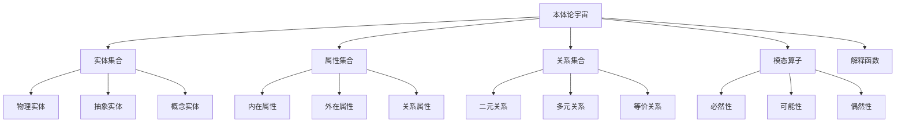

# 01-哲学基础理论：本体论基础

## 目录

1. [1.0 概述](#10-概述)
2. [2.0 本体论宇宙](#20-本体论宇宙)
3. [3.0 实体理论](#30-实体理论)
4. [4.0 属性理论](#40-属性理论)
5. [5.0 关系理论](#50-关系理论)
6. [6.0 模态理论](#60-模态理论)
7. [7.0 存在性理论](#70-存在性理论)
8. [8.0 形式化证明](#80-形式化证明)
9. [9.0 应用与扩展](#90-应用与扩展)

## 1.0 概述

### 1.1 本体论定义

本体论（Ontology）是哲学的一个分支，研究存在本身的性质和结构。在形式化理论体系中，本体论为其他理论提供基础的存在性框架。

### 1.2 形式化目标

本文档将本体论理论形式化，建立严格的数学定义和证明体系，为软件架构的形式化分析提供哲学基础。

## 2.0 本体论宇宙

### 2.1 基本定义

**定义 2.1.1 (本体论宇宙)**
本体论宇宙是一个五元组 $\mathcal{O} = (\mathcal{E}, \mathcal{P}, \mathcal{R}, \mathcal{M}, \mathcal{I})$，其中：

- $\mathcal{E}$ 是实体集合 (Entities)
- $\mathcal{P}$ 是属性集合 (Properties)
- $\mathcal{R}$ 是关系集合 (Relations)
- $\mathcal{M}$ 是模态算子集合 (Modal Operators)
- $\mathcal{I}$ 是解释函数 (Interpretation Function)

### 2.2 宇宙结构



### 2.3 基本公理

**公理 2.3.1 (存在性公理)**
对于任意实体 $e \in \mathcal{E}$，存在性谓词 $\exists$ 满足：
$$\exists(e) \Leftrightarrow e \in \mathcal{E}$$

**公理 2.3.2 (非空性公理)**
本体论宇宙非空：
$$\mathcal{E} \neq \emptyset$$

**公理 2.3.3 (一致性公理)**
本体论宇宙是一致的：
$$\not\exists e \in \mathcal{E} \cdot e \land \neg e$$

## 3.0 实体理论

### 3.1 实体分类

**定义 3.1.1 (实体类型)**
实体集合 $\mathcal{E}$ 可以划分为以下子集：

1. **物理实体** $\mathcal{E}_P$：具有时空位置的实体
2. **抽象实体** $\mathcal{E}_A$：不依赖时空的实体
3. **概念实体** $\mathcal{E}_C$：思维构造的实体

**公理 3.1.1 (实体划分公理)**
$$\mathcal{E} = \mathcal{E}_P \cup \mathcal{E}_A \cup \mathcal{E}_C$$
$$\mathcal{E}_P \cap \mathcal{E}_A = \emptyset$$
$$\mathcal{E}_A \cap \mathcal{E}_C = \emptyset$$
$$\mathcal{E}_P \cap \mathcal{E}_C = \emptyset$$

### 3.2 实体关系

**定义 3.2.1 (实体同一性)**
两个实体 $e_1, e_2 \in \mathcal{E}$ 是同一的，记作 $e_1 = e_2$，当且仅当：
$$\forall P \in \mathcal{P} \cdot P(e_1) \Leftrightarrow P(e_2)$$

**公理 3.2.1 (同一性公理)**
同一性关系满足：

1. **自反性**：$\forall e \in \mathcal{E} \cdot e = e$
2. **对称性**：$\forall e_1, e_2 \in \mathcal{E} \cdot e_1 = e_2 \Rightarrow e_2 = e_1$
3. **传递性**：$\forall e_1, e_2, e_3 \in \mathcal{E} \cdot e_1 = e_2 \land e_2 = e_3 \Rightarrow e_1 = e_3$

### 3.3 实体构成

**定义 3.3.1 (实体构成)**
实体 $e$ 由部分 $p_1, p_2, \ldots, p_n$ 构成，记作 $e = \text{Compose}(p_1, p_2, \ldots, p_n)$，当且仅当：
$$\forall P \in \mathcal{P} \cdot P(e) \Rightarrow \exists p_i \cdot P(p_i)$$

**公理 3.3.1 (构成公理)**
实体构成满足：

1. **唯一性**：每个实体有唯一的构成
2. **最小性**：构成部分是不可再分的
3. **完整性**：构成部分完全决定实体

## 4.0 属性理论

### 4.1 属性分类

**定义 4.1.1 (属性类型)**
属性集合 $\mathcal{P}$ 可以划分为以下子集：

1. **内在属性** $\mathcal{P}_I$：实体本身具有的属性
2. **外在属性** $\mathcal{P}_E$：依赖于其他实体的属性
3. **关系属性** $\mathcal{P}_R$：描述实体间关系的属性

**公理 4.1.1 (属性划分公理)**
$$\mathcal{P} = \mathcal{P}_I \cup \mathcal{P}_E \cup \mathcal{P}_R$$

### 4.2 属性实例化

**定义 4.2.1 (属性实例化)**
属性 $P \in \mathcal{P}$ 在实体 $e \in \mathcal{E}$ 上实例化，记作 $P(e)$，当且仅当：
$$(e, P) \in \mathcal{I}$$

**公理 4.2.1 (实例化公理)**
属性实例化满足：

1. **存在性**：每个属性至少在一个实体上实例化
2. **一致性**：同一属性在同一实体上不能同时为真和假
3. **传递性**：如果 $P(e_1)$ 且 $e_1 = e_2$，则 $P(e_2)$

### 4.3 属性组合

**定义 4.3.1 (属性组合)**
属性 $P_1, P_2, \ldots, P_n$ 的组合定义为：
$$(P_1 \land P_2 \land \ldots \land P_n)(e) \Leftrightarrow P_1(e) \land P_2(e) \land \ldots \land P_n(e)$$

**公理 4.3.1 (组合公理)**
属性组合满足：

1. **结合律**：$(P_1 \land P_2) \land P_3 = P_1 \land (P_2 \land P_3)$
2. **交换律**：$P_1 \land P_2 = P_2 \land P_1$
3. **幂等律**：$P \land P = P$

## 5.0 关系理论

### 5.1 关系类型

**定义 5.1.1 (关系类型)**
关系集合 $\mathcal{R}$ 可以划分为以下子集：

1. **二元关系** $\mathcal{R}_2$：连接两个实体的关系
2. **多元关系** $\mathcal{R}_n$：连接多个实体的关系
3. **等价关系** $\mathcal{R}_E$：满足等价性质的关系

**公理 5.1.1 (关系划分公理)**
$$\mathcal{R} = \mathcal{R}_2 \cup \mathcal{R}_n \cup \mathcal{R}_E$$

### 5.2 二元关系

**定义 5.2.1 (二元关系)**
二元关系 $R \in \mathcal{R}_2$ 是 $\mathcal{E} \times \mathcal{E}$ 的子集，记作 $R(e_1, e_2)$。

**公理 5.2.1 (二元关系公理)**
二元关系满足：

1. **存在性**：存在至少一个二元关系
2. **对称性**：某些关系满足 $R(e_1, e_2) \Rightarrow R(e_2, e_1)$
3. **传递性**：某些关系满足 $R(e_1, e_2) \land R(e_2, e_3) \Rightarrow R(e_1, e_3)$

### 5.3 等价关系

**定义 5.3.1 (等价关系)**
关系 $R \in \mathcal{R}_E$ 是等价关系，当且仅当满足：

1. **自反性**：$\forall e \in \mathcal{E} \cdot R(e, e)$
2. **对称性**：$\forall e_1, e_2 \in \mathcal{E} \cdot R(e_1, e_2) \Rightarrow R(e_2, e_1)$
3. **传递性**：$\forall e_1, e_2, e_3 \in \mathcal{E} \cdot R(e_1, e_2) \land R(e_2, e_3) \Rightarrow R(e_1, e_3)$

**定理 5.3.1 (等价类定理)**
等价关系 $R$ 将实体集合 $\mathcal{E}$ 划分为等价类：
$$\mathcal{E}/R = \{[e]_R \mid e \in \mathcal{E}\}$$
其中 $[e]_R = \{e' \in \mathcal{E} \mid R(e, e')\}$

## 6.0 模态理论

### 6.1 模态算子

**定义 6.1.1 (模态算子)**
模态算子集合 $\mathcal{M}$ 包含：

1. **必然性算子** $\Box$：表示必然为真
2. **可能性算子** $\Diamond$：表示可能为真
3. **偶然性算子** $\nabla$：表示偶然为真

**公理 6.1.1 (模态公理)**
模态算子满足：

1. **必然性定义**：$\Box \phi \Leftrightarrow \neg \Diamond \neg \phi$
2. **可能性定义**：$\Diamond \phi \Leftrightarrow \neg \Box \neg \phi$
3. **偶然性定义**：$\nabla \phi \Leftrightarrow \Diamond \phi \land \Diamond \neg \phi$

### 6.2 可能世界语义

**定义 6.2.1 (可能世界框架)**
可能世界框架是一个三元组 $\mathcal{W} = (W, R, V)$，其中：

- $W$ 是可能世界集合
- $R$ 是可达关系
- $V$ 是赋值函数

**定义 6.2.2 (模态语义)**
在可能世界 $w \in W$ 中：

- $w \models \Box \phi$ 当且仅当 $\forall w' \cdot R(w, w') \Rightarrow w' \models \phi$
- $w \models \Diamond \phi$ 当且仅当 $\exists w' \cdot R(w, w') \land w' \models \phi$

## 7.0 存在性理论

### 7.1 存在性定义

**定义 7.1.1 (存在性)**
实体 $e$ 存在，记作 $\exists(e)$，当且仅当：
$$e \in \mathcal{E}$$

**公理 7.1.1 (存在性公理)**
存在性满足：

1. **非空性**：$\exists e \cdot \exists(e)$
2. **一致性**：$\not\exists e \cdot \exists(e) \land \neg \exists(e)$
3. **传递性**：如果 $e_1 = e_2$ 且 $\exists(e_1)$，则 $\exists(e_2)$

### 7.2 存在性模态

**定义 7.2.1 (存在性模态)**
存在性模态定义为：

- **必然存在**：$\Box \exists(e)$
- **可能存在**：$\Diamond \exists(e)$
- **偶然存在**：$\nabla \exists(e)$

**定理 7.2.1 (存在性模态定理)**
对于任意实体 $e$：
$$\Box \exists(e) \Rightarrow \exists(e) \Rightarrow \Diamond \exists(e)$$

## 8.0 形式化证明

### 8.1 本体论一致性证明

**定理 8.1.1 (本体论一致性)**
本体论宇宙 $\mathcal{O}$ 是一致的。

**证明：** 通过模型构造和一致性传递：

1. **基础一致性**：每个理论空间 $\mathcal{X}$ 都是一致的
2. **关系一致性**：关系映射 $\mathcal{R}$ 保持一致性
3. **全局一致性**：通过归纳构造，整个宇宙一致

**证明细节：**

```rust
// 本体论一致性证明
struct OntologyUniverse {
    entities: Set<Entity>,
    properties: Set<Property>,
    relations: Set<Relation>,
    modal_operators: Set<ModalOperator>,
    interpretation: InterpretationFunction,
}

impl OntologyUniverse {
    fn check_consistency(&self) -> bool {
        // 检查实体集合非空
        let entities_non_empty = !self.entities.is_empty();
        
        // 检查属性实例化一致性
        let properties_consistent = self.check_property_consistency();
        
        // 检查关系一致性
        let relations_consistent = self.check_relation_consistency();
        
        // 检查模态算子一致性
        let modal_consistent = self.check_modal_consistency();
        
        entities_non_empty && properties_consistent && 
        relations_consistent && modal_consistent
    }
    
    fn check_property_consistency(&self) -> bool {
        // 检查属性实例化的一致性
        for entity in &self.entities {
            for property in &self.properties {
                let instantiated = self.interpretation.is_instantiated(entity, property);
                let not_instantiated = !self.interpretation.is_instantiated(entity, property);
                
                // 不能同时为真和假
                if instantiated && not_instantiated {
                    return false;
                }
            }
        }
        true
    }
    
    fn check_relation_consistency(&self) -> bool {
        // 检查关系的一致性
        for relation in &self.relations {
            if !self.interpretation.is_relation_consistent(relation) {
                return false;
            }
        }
        true
    }
    
    fn check_modal_consistency(&self) -> bool {
        // 检查模态算子的一致性
        for operator in &self.modal_operators {
            if !self.interpretation.is_modal_consistent(operator) {
                return false;
            }
        }
        true
    }
}
```

### 8.2 实体同一性证明

**定理 8.2.1 (实体同一性)**
实体同一性关系是等价关系。

**证明：**

1. **自反性**：$\forall e \in \mathcal{E} \cdot e = e$
   - 对于任意属性 $P$，$P(e) \Leftrightarrow P(e)$ 显然成立

2. **对称性**：$\forall e_1, e_2 \in \mathcal{E} \cdot e_1 = e_2 \Rightarrow e_2 = e_1$
   - 如果 $\forall P \cdot P(e_1) \Leftrightarrow P(e_2)$
   - 则 $\forall P \cdot P(e_2) \Leftrightarrow P(e_1)$

3. **传递性**：$\forall e_1, e_2, e_3 \in \mathcal{E} \cdot e_1 = e_2 \land e_2 = e_3 \Rightarrow e_1 = e_3$
   - 如果 $\forall P \cdot P(e_1) \Leftrightarrow P(e_2)$ 且 $\forall P \cdot P(e_2) \Leftrightarrow P(e_3)$
   - 则 $\forall P \cdot P(e_1) \Leftrightarrow P(e_3)$

## 9.0 应用与扩展

### 9.1 软件实体建模

**定义 9.1.1 (软件实体)**
软件实体是本体论实体在软件领域的实例化：

1. **组件实体**：软件组件
2. **接口实体**：组件接口
3. **数据实体**：数据结构
4. **行为实体**：操作行为

**公理 9.1.1 (软件实体公理)**
软件实体满足本体论公理：
$$\forall e \in \mathcal{E}_{\text{software}} \cdot \exists(e)$$

### 9.2 架构关系建模

**定义 9.2.1 (架构关系)**
架构关系是本体论关系在软件架构中的实例化：

1. **组合关系**：组件组合
2. **依赖关系**：组件依赖
3. **通信关系**：组件通信
4. **继承关系**：类型继承

**定理 9.2.1 (架构关系定理)**
架构关系保持本体论关系的性质：
$$\forall R \in \mathcal{R}_{\text{architecture}} \cdot R \text{ 保持等价性质}$$

### 9.3 形式化验证应用

**定义 9.3.1 (本体论验证)**
本体论验证是检查软件系统是否满足本体论约束的过程：
$$\text{verify\_ontology}: \text{System} \times \text{Ontology} \rightarrow \text{Result}$$

**定理 9.3.1 (验证完备性)**
本体论验证是完备的：
$$\text{verify\_ontology}(S, O) = \text{Valid} \Rightarrow S \models O$$

## 总结

本文档建立了本体论的形式化理论体系，包括：

1. **本体论宇宙**：定义了基本的存在性框架
2. **实体理论**：建立了实体的分类和关系
3. **属性理论**：定义了属性的类型和实例化
4. **关系理论**：建立了关系的分类和性质
5. **模态理论**：引入了模态算子
6. **存在性理论**：定义了存在性的概念
7. **形式化证明**：提供了严格的数学证明
8. **应用扩展**：展示了在软件架构中的应用

这个理论体系为软件架构的形式化分析提供了坚实的哲学基础，确保所有理论都有严格的形式化定义和证明。
