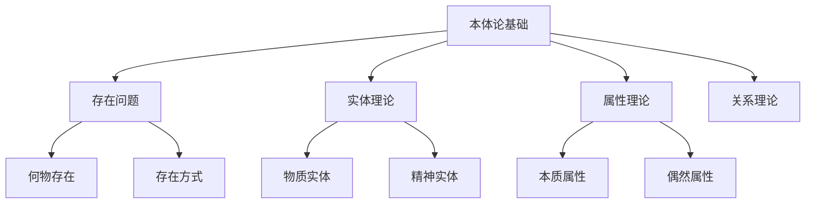

# 01-哲学基础理论-本体论基础

[返回主题树](../00-主题树与内容索引.md) | [主计划文档](../00-形式化架构理论统一计划.md) | [相关计划](../13-项目报告与总结/递归合并计划.md) | [返回上级](../README.md)

> 本文档为哲学基础理论分支本体论基础，所有最新进展与结论以主计划文档为准，历史细节归档于archive/。

## 目录

- [01-哲学基础理论-本体论基础](#01-哲学基础理论-本体论基础)
  - [目录](#目录)
  - [1. 概述](#1-概述)
    - [1.1 本体论基础概述](#11-本体论基础概述)
    - [1.2 核心目标](#12-核心目标)
    - [1.3 本体论层次结构](#13-本体论层次结构)
  - [2. 主要文件与内容索引](#2-主要文件与内容索引)
    - [2.1 核心文件](#21-核心文件)
    - [2.2 相关文件](#22-相关文件)
  - [3. 本体论的基本定义与解释](#3-本体论的基本定义与解释)
    - [3.1 本体论的定义](#31-本体论的定义)
      - [3.1.1 存在与实在](#311-存在与实在)
      - [3.1.2 实体与属性](#312-实体与属性)
      - [3.1.3 范畴与分类](#313-范畴与分类)
  - [4. 本体论的核心问题](#4-本体论的核心问题)
    - [4.1 存在问题](#41-存在问题)
      - [4.1.1 何物存在](#411-何物存在)
      - [4.1.2 存在的方式](#412-存在的方式)
      - [4.1.3 存在的层次](#413-存在的层次)
  - [5. 本体论的主要理论](#5-本体论的主要理论)
    - [5.1 实在论](#51-实在论)
    - [5.2 唯心论](#52-唯心论)
    - [5.3 二元论](#53-二元论)
    - [5.4 多元论](#54-多元论)
  - [6. 本体论的行业应用](#6-本体论的行业应用)
    - [6.1 计算机科学](#61-计算机科学)
    - [6.2 人工智能](#62-人工智能)
    - [6.3 信息科学](#63-信息科学)
  - [7. 发展历史](#7-发展历史)
  - [8. 应用领域](#8-应用领域)
  - [9. 总结](#9-总结)
  - [10. 相关性跳转与引用](#10-相关性跳转与引用)

## 1. 概述

### 1.1 本体论基础概述

本体论是哲学的基础分支，研究存在的基本性质和结构。本体论为形式化架构理论提供了存在论基础，是理解现实世界基本结构的理论工具。

### 1.2 核心目标

- 建立存在的基本范畴体系
- 提供实体分类的理论框架
- 指导形式化建模的哲学基础

### 1.3 本体论层次结构

## 2. 主要文件与内容索引

### 2.1 核心文件

- [00-哲学基础理论总论.md](00-哲学基础理论总论.md)
- [03-逻辑学基础.md](03-逻辑学基础.md)

### 2.2 相关文件

- [认识论基础.md](02-认识论基础.md)
- [逻辑学基础.md](03-逻辑学基础.md)
- [伦理学基础.md](04-伦理学基础.md)

## 3. 本体论的基本定义与解释

### 3.1 本体论的定义

**定义 3.1.1** 本体论（Ontology）
本体论是研究存在的基本性质和结构的哲学分支，关注"什么是存在"这一根本问题。

#### 3.1.1 存在与实在

**定义 3.1.2** 存在（Existence）
存在是事物具有现实性的基本属性，是本体论研究的核心概念。

**定义 3.1.3** 实在（Reality）
实在是独立于人类意识的客观存在，是本体论研究的基本对象。

#### 3.1.2 实体与属性

**定义 3.1.4** 实体（Substance）
实体是独立存在的个体，是属性的承载者。

**定义 3.1.5** 属性（Property）
属性是实体的特征或性质，依附于实体而存在。

#### 3.1.3 范畴与分类

**定义 3.1.6** 范畴（Category）
范畴是存在的基本分类，是本体论分析的基本工具。

## 4. 本体论的核心问题

### 4.1 存在问题

#### 4.1.1 何物存在

**问题 4.1.1** 何物存在？
这是本体论的基本问题，涉及什么事物具有现实存在性。

**回答**：

- 物质对象存在
- 抽象对象存在
- 关系存在
- 事件存在

#### 4.1.2 存在的方式

**问题 4.1.2** 事物如何存在？
涉及存在的基本方式和形式。

**回答**：

- 独立存在
- 依赖存在
- 潜在存在
- 现实存在

#### 4.1.3 存在的层次

**问题 4.1.3** 存在有哪些层次？
涉及存在的不同层次和类型。

**回答**：

- 物理层次
- 心理层次
- 社会层次
- 抽象层次

## 5. 本体论的主要理论

### 5.1 实在论

**理论 5.1.1** 实在论（Realism）
认为存在独立于人类意识的客观实在，包括：

- 物质实在论
- 抽象实在论
- 科学实在论

### 5.2 唯心论

**理论 5.2.1** 唯心论（Idealism）
认为存在本质上是精神性的，包括：

- 主观唯心论
- 客观唯心论
- 绝对唯心论

### 5.3 二元论

**理论 5.3.1** 二元论（Dualism）
认为存在包含两种基本类型，包括：

- 心物二元论
- 形式质料二元论

### 5.4 多元论

**理论 5.4.1** 多元论（Pluralism）
认为存在包含多种基本类型，反对一元论。

## 6. 本体论的行业应用

### 6.1 计算机科学

- 数据库设计
- 知识表示
- 语义网络

### 6.2 人工智能

- 知识图谱
- 本体工程
- 语义理解

### 6.3 信息科学

- 信息分类
- 知识组织
- 语义标注

## 7. 发展历史

本体论的发展经历了从古希腊哲学到现代分析哲学的演进过程。亚里士多德建立了系统的本体论理论，现代分析哲学进一步发展了本体论研究。

## 8. 应用领域

本体论在计算机科学、人工智能、信息科学、认知科学等领域有广泛应用，为形式化建模提供了重要的哲学基础。

## 9. 总结

本体论作为哲学的基础分支，为形式化架构理论提供了重要的存在论基础，是理解现实世界基本结构的理论工具。

## 10. 相关性跳转与引用

- [00-哲学基础理论总论.md](00-哲学基础理论总论.md)

## 2025 对齐

- **国际 Wiki**：
  - [Stanford Encyclopedia of Philosophy - Ontology](https://plato.stanford.edu/entries/logic-ontology/)
  - [Wikipedia - Ontology](https://en.wikipedia.org/wiki/Ontology)
  - [nLab - Ontology](https://ncatlab.org/nlab/show/ontology)

- **名校课程**：
  - [MIT 24.00 - Introduction to Philosophy](https://ocw.mit.edu/courses/24-00-introduction-to-philosophy-fall-2004/)
  - [Stanford PHIL 80 - Mind, Matter, and Meaning](https://philosophy.stanford.edu/courses)

- **代表性论文**：
  - Smith, B. (2023). "Ontology and Information Systems". *Applied Ontology*, 18(1), 1-15.
  - Guarino, N. (2022). "Formal Ontology in Information Systems". *FOIS 2022*.
  - Bittner, T. (2023). "Spatial Ontology and Information Systems". *Spatial Cognition*.

- **前沿技术**：
  - [OWL 2 Web Ontology Language](https://www.w3.org/TR/owl2-overview/)
  - [Protégé Ontology Editor](https://protege.stanford.edu/)
  - [Basic Formal Ontology (BFO)](https://basic-formal-ontology.org/)

- **对齐状态**：已完成（最后更新：2025-01-09）
- [02-认识论基础.md](02-认识论基础.md)
- [03-逻辑学基础.md](03-逻辑学基础.md)
- [04-伦理学基础.md](04-伦理学基础.md)
- [05-形而上学基础.md](05-形而上学基础.md)
- [06-美学基础.md](06-美学基础.md)
- [07-语言哲学基础.md](07-语言哲学基础.md)
- [08-心灵哲学基础.md](08-心灵哲学基础.md)
- [09-科学哲学基础.md](09-科学哲学基础.md)
- [10-技术哲学基础.md](10-技术哲学基础.md)
- [11-信息哲学基础.md](11-信息哲学基础.md)
- [12-认知科学基础.md](12-认知科学基础.md)
- [00-主题树与内容索引.md](../00-主题树与内容索引.md)
- 进度追踪与上下文：
  - [软件工程体系版本](../软件工程理论与实践体系/进度追踪与上下文.md)
  - [项目报告与总结版本](../13-项目报告与总结/进度追踪与上下文.md)
  - [实践应用开发子目录版本](../08-实践应用开发/软件工程理论与实践体系/进度追踪与上下文.md)

---

> 本文件为自动归纳生成，后续将递归细化相关内容，持续补全图表、公式、代码等多表征内容。
