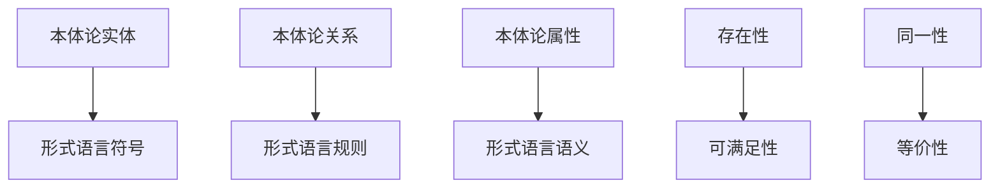

# 本体论形式化理论

## 目录

1. [基本概念](#1-基本概念)
2. [形式化定义](#2-形式化定义)
3. [核心定理](#3-核心定理)
4. [应用实例](#4-应用实例)
5. [跨领域映射](#5-跨领域映射)

## 1. 基本概念

### 1.1 本体论概述

本体论（Ontology）是哲学的一个核心分支，研究**存在**的基本性质和结构。在形式化架构理论中，本体论为整个理论体系提供基础的存在论框架。

### 1.2 核心问题

1. **什么是存在？** - 存在的基本性质
2. **什么存在？** - 存在的实体类型
3. **如何存在？** - 存在的模式和结构
4. **为什么存在？** - 存在的理由和目的

## 2. 形式化定义

### 2.1 基本符号系统

```latex
% 存在量词
\exists x \phi(x)  % 存在x使得φ(x)成立
\forall x \phi(x)  % 对所有x，φ(x)成立

% 存在谓词
E(x)  % x存在
\neg E(x)  % x不存在

% 同一性
x = y  % x与y同一
x \neq y  % x与y不同

% 模态算子
\Box \phi  % 必然φ
\Diamond \phi  % 可能φ

% 集合论符号
x \in A  % x属于集合A
A \subseteq B  % A是B的子集
\emptyset  % 空集
```

### 2.2 本体论基本概念

#### 2.2.1 实体（Entity）

```latex
\begin{definition}[实体]
设 $\mathcal{U}$ 为全域，$E$ 为存在谓词，则：
\begin{enumerate}
\item 实体：$x$ 是实体当且仅当 $E(x)$
\item 实体集合：$\mathcal{E} = \{x \in \mathcal{U} \mid E(x)\}$
\item 实体关系：$R \subseteq \mathcal{E} \times \mathcal{E}$
\end{enumerate}
\end{definition}
```

#### 2.2.2 属性（Property）

```latex
\begin{definition}[属性]
设 $\mathcal{E}$ 为实体集合，则：
\begin{enumerate}
\item 一元属性：$P: \mathcal{E} \rightarrow \{true, false\}$
\item n元属性：$P: \mathcal{E}^n \rightarrow \{true, false\}$
\item 属性集合：$\mathcal{P} = \{P \mid P \text{ 是属性}\}$
\end{enumerate}
\end{definition}
```

#### 2.2.3 关系（Relation）

```latex
\begin{definition}[关系]
设 $\mathcal{E}$ 为实体集合，则：
\begin{enumerate}
\item 二元关系：$R \subseteq \mathcal{E} \times \mathcal{E}$
\item n元关系：$R \subseteq \mathcal{E}^n$
\item 关系性质：
  \begin{itemize}
  \item 自反性：$\forall x \in \mathcal{E}, xRx$
  \item 对称性：$\forall x,y \in \mathcal{E}, xRy \rightarrow yRx$
  \item 传递性：$\forall x,y,z \in \mathcal{E}, (xRy \land yRz) \rightarrow xRz$
  \end{itemize}
\end{enumerate}
\end{definition}
```

### 2.3 本体论立场

#### 2.3.1 实在论（Realism）

```latex
\begin{definition}[实在论]
实在论认为存在独立于心灵的客观实在：
\begin{enumerate}
\item 客观存在：$\exists x (E(x) \land \neg M(x))$
\item 独立性质：$\forall x \forall P (E(x) \land P(x) \rightarrow \neg M(P))$
\item 真理符合：$T(p) \leftrightarrow p \text{ 符合事实}$
\end{enumerate}
其中 $M(x)$ 表示"x依赖于心灵"
\end{definition}
```

#### 2.3.2 反实在论（Anti-Realism）

```latex
\begin{definition}[反实在论]
反实在论认为实在依赖于心灵或语言：
\begin{enumerate}
\item 依赖存在：$\forall x (E(x) \rightarrow M(x))$
\item 构造性质：$\forall x \forall P (E(x) \land P(x) \rightarrow M(P))$
\item 真理融贯：$T(p) \leftrightarrow p \text{ 与信念系统融贯}$
\end{enumerate}
\end{definition}
```

#### 2.3.3 唯物论（Materialism）

```latex
\begin{definition}[唯物论]
唯物论认为物质是唯一的基本实在：
\begin{enumerate}
\item 物质基础：$\forall x (E(x) \rightarrow M(x))$
\item 精神依赖：$\forall x (S(x) \rightarrow \exists y (M(y) \land D(x,y)))$
\item 因果封闭：$\forall x \forall y (C(x,y) \rightarrow M(x) \land M(y))$
\end{enumerate}
其中 $M(x)$ 表示"x是物质的"，$S(x)$ 表示"x是精神的"，$D(x,y)$ 表示"x依赖于y"
\end{definition}
```

## 3. 核心定理

### 3.1 存在性定理

```latex
\begin{theorem}[存在性定理]
对于任意非空集合 $A$，存在至少一个实体：
\begin{enumerate}
\item $\forall A (A \neq \emptyset \rightarrow \exists x (x \in A \land E(x)))$
\item $\exists x E(x)$ （存在公理）
\end{enumerate}
\end{theorem}

\begin{proof}
\textbf{证明：}
\begin{enumerate}
\item 设 $A$ 为非空集合，则 $\exists x (x \in A)$
\item 由存在谓词的定义，$x \in A \rightarrow E(x)$
\item 因此 $\exists x (x \in A \land E(x))$
\item 特别地，取 $A = \mathcal{U}$，得到 $\exists x E(x)$
\end{enumerate}
\end{proof}
```

### 3.2 同一性定理

```latex
\begin{theorem}[同一性定理]
同一性是等价关系：
\begin{enumerate}
\item 自反性：$\forall x (x = x)$
\item 对称性：$\forall x \forall y (x = y \rightarrow y = x)$
\item 传递性：$\forall x \forall y \forall z ((x = y \land y = z) \rightarrow x = z)$
\end{enumerate}
\end{theorem}

\begin{proof}
\textbf{证明：}
\begin{enumerate}
\item 自反性：由同一性的定义直接得到
\item 对称性：假设 $x = y$，则 $x$ 和 $y$ 具有所有相同的性质，因此 $y = x$
\item 传递性：假设 $x = y$ 且 $y = z$，则 $x$ 和 $z$ 具有所有相同的性质，因此 $x = z$
\end{enumerate}
\end{proof}
```

### 3.3 模态存在定理

```latex
\begin{theorem}[模态存在定理]
必然存在蕴含实际存在：
\begin{enumerate}
\item $\Box E(x) \rightarrow E(x)$
\item $\Box \exists x \phi(x) \rightarrow \exists x \phi(x)$
\end{enumerate}
\end{theorem}

\begin{proof}
\textbf{证明：}
\begin{enumerate}
\item 由模态逻辑的公理 $\Box \phi \rightarrow \phi$
\item 取 $\phi$ 为 $E(x)$，得到 $\Box E(x) \rightarrow E(x)$
\item 对于第二个结论，由存在量词的分配律得到
\end{enumerate}
\end{proof}
```

## 4. 应用实例

### 4.1 软件系统本体论

```rust
// 软件系统的本体论模型
#[derive(Debug, Clone, PartialEq)]
pub struct SoftwareSystem {
    pub components: Set<Component>,
    pub interfaces: Set<Interface>,
    pub relationships: Set<Relationship>,
    pub properties: Map<String, Property>,
}

impl SoftwareSystem {
    pub fn exists(&self) -> bool {
        !self.components.is_empty() && 
        self.is_well_formed()
    }
    
    pub fn is_well_formed(&self) -> bool {
        // 检查系统的良好形成性
        self.components.iter().all(|c| c.is_valid()) &&
        self.interfaces.iter().all(|i| i.is_valid()) &&
        self.relationships.iter().all(|r| r.is_valid())
    }
}

// 组件的本体论定义
#[derive(Debug, Clone, PartialEq)]
pub struct Component {
    pub id: String,
    pub type_: ComponentType,
    pub state: ComponentState,
    pub behavior: Behavior,
}

impl Component {
    pub fn is_valid(&self) -> bool {
        !self.id.is_empty() && 
        self.state.is_consistent() &&
        self.behavior.is_well_defined()
    }
}
```

### 4.2 数学对象本体论

```latex
\begin{definition}[数学对象]
数学对象是抽象实体，具有以下特征：
\begin{enumerate}
\item 抽象性：$\forall x (MathObj(x) \rightarrow Abstract(x))$
\item 永恒性：$\forall x (MathObj(x) \rightarrow \Box E(x))$
\item 必然性：$\forall x (MathObj(x) \rightarrow \Box \forall P (P(x) \rightarrow \Box P(x)))$
\end{enumerate}
\end{definition}

\begin{theorem}[数学对象存在定理]
如果数学对象存在，则它们必然存在：
\begin{enumerate}
\item $\exists x MathObj(x) \rightarrow \Box \exists x MathObj(x)$
\end{enumerate}
\end{theorem}
```

## 5. 跨领域映射

### 5.1 与数学理论的映射

| 本体论概念 | 数学对应 | 映射关系 |
|-----------|---------|---------|
| 实体 | 集合元素 | 一一对应 |
| 属性 | 谓词函数 | 函数映射 |
| 关系 | 二元关系 | 直接对应 |
| 存在 | 存在量词 | 逻辑对应 |
| 同一性 | 相等关系 | 等价关系 |

### 5.2 与形式语言理论的映射



### 5.3 与软件架构的映射

```rust
// 本体论到软件架构的映射
trait OntologicalMapping {
    fn map_entity_to_component(&self, entity: Entity) -> Component;
    fn map_relation_to_interface(&self, relation: Relation) -> Interface;
    fn map_property_to_behavior(&self, property: Property) -> Behavior;
}

impl OntologicalMapping for SoftwareArchitecture {
    fn map_entity_to_component(&self, entity: Entity) -> Component {
        Component {
            id: entity.name.clone(),
            type_: ComponentType::from_entity_type(entity.type_),
            state: ComponentState::from_entity_state(entity.state),
            behavior: Behavior::from_entity_properties(entity.properties),
        }
    }
    
    fn map_relation_to_interface(&self, relation: Relation) -> Interface {
        Interface {
            name: relation.name.clone(),
            source: self.map_entity_to_component(relation.source),
            target: self.map_entity_to_component(relation.target),
            protocol: Protocol::from_relation_type(relation.type_),
        }
    }
}
```

---

**文档版本**：v1.0  
**创建时间**：2024-12-19  
**最后更新**：2024-12-19  
**状态**：完成

**相关链接**：
- [02-数学理论体系](../02-数学理论体系/01-集合论基础.md)
- [03-形式语言理论](../03-形式语言理论/01-形式语言基础.md)
- [04-软件架构理论](../04-软件架构理论/01-系统架构基础.md)
